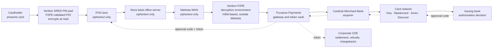
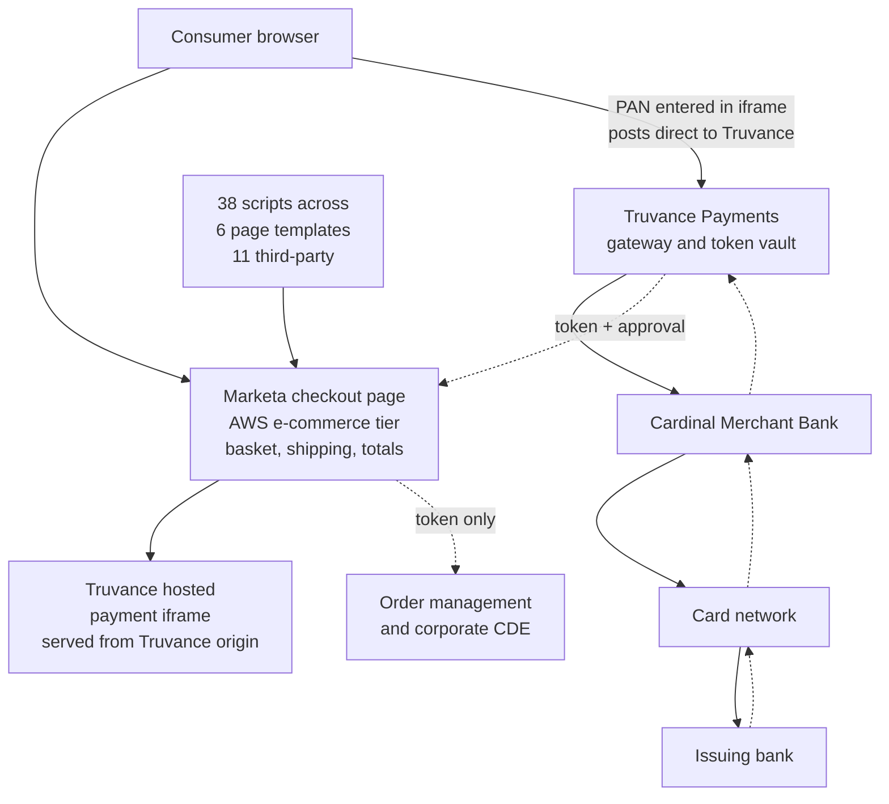
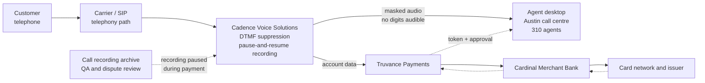

# 01.01 — Company Profile &amp; Payment Channels

| Field | Value |
|---|---|
| Document ID | MRG-PCI-2026-101 |
| Program | Marketa Retail Group — PCI DSS v4.0.1 Compliance Program |
| Phase | 01 — Program Foundation &amp; PCI Governance |
| Version | 1.0 |
| Status | Approved |
| Owner | Elena Marchetti, VP Payment Operations |
| Approver | Naomi Bhatt, Chief Information Security Officer |
| Date | 2026-07-15 |
| Classification | Confidential — Cardholder Data Environment // Illustrative Portfolio Sample |

## Purpose

This document establishes the authoritative business and payment-acceptance profile of Marketa Retail Group, Inc. ("Marketa," "the Company"). It describes the store estate, the distribution and corporate footprint, and — above all — the **three channels through which Marketa accepts payment cards**: card-present transactions at 1,914 point-of-sale lanes, e-commerce transactions through a hosted checkout iframe, and mail-order/telephone-order (MOTO) transactions taken by the Austin call centre.

Everything the PCI DSS programme later decides about scope follows from the mechanics described here. A reader who understands *where account data is created, where it travels, and who holds it* will find every subsequent scoping determination in Phase 02 self-evident. A reader who does not will find them arbitrary. This document exists so that no one is in the second category.

## 1. The Company at a Glance

Marketa is a national specialty retail chain selling home, lifestyle and seasonal goods. It is **privately held** — family ownership with a private-equity minority stake — and is not an SEC registrant. Its obligations in this programme therefore arise from contract with its acquirer and the payment card brands, not from securities regulation.

| Attribute | Value |
|---|---|
| Legal entity | Marketa Retail Group, Inc. |
| Business | National specialty retail — home, lifestyle and seasonal goods |
| Headquarters | Columbus, Ohio |
| Ownership | Privately held (family + private-equity minority stake); not SEC-registered |
| Annual revenue | $4.2 billion |
| E-commerce share of revenue | 22% (≈ $924 million) |
| Employees | ~34,000 (≈29,600 store, ≈2,100 distribution centre, ≈2,300 corporate) |
| Seasonal surge workforce | +6,800 temporary workers, October–January |
| Acquirer | Cardinal Merchant Bank, N.A. |
| Card brands accepted | Visa, Mastercard, American Express, Discover |

## 2. Physical and Technology Estate

The estate is large, geographically dispersed, and — critically for PCI DSS — **mostly irrelevant to cardholder data** once the channel architecture is understood. The count of sites is not the count of scope.

| Location type | Count | Description | Payment relevance |
|---|---|---|---|
| Retail stores | 482 across 38 states | Full-line stores, average 4.0 checkout lanes | Card-present acceptance; P2PE point-of-interaction devices |
| POS lanes | 1,914 | Verition POS Systems lanes with SRED-capable PIN pads | Card data encrypted at the point of interaction |
| Distribution centres | 4 — Columbus OH, Reno NV, Atlanta GA, Allentown PA | Inbound receiving, replenishment, e-commerce fulfilment | No card acceptance; order data only, no PAN |
| Corporate offices | 2 — Columbus HQ, Austin TX technology office | Merchandising, finance, payment operations, engineering | Columbus hosts payment operations; Austin hosts the call centre |
| Owned data centre | 1 — Columbus | Core retail, merchandising, finance, payment operations | Hosts the corporate cardholder data environment |
| Co-location facility | 1 — Ashburn VA | Disaster recovery and edge services | Recovery capability for in-scope systems |
| Public cloud | AWS us-east-1 and us-west-2 | E-commerce platform, analytics, integration services | Hosts e-commerce web tier and part of the corporate CDE |

Across all of this sit **1,842 systems** in the enterprise estate. At the start of the programme, **604 of them were believed to be in scope** for PCI DSS. Phase 02 tests that belief against the channel architecture below and reaches a very different number.

## 3. The Card Volume, and Why It Matters

Marketa processes **68.4 million card transactions annually** across Visa and Mastercard combined, distributed across the three channels.

| Channel | Share of transactions | Approx. annual transactions | Acceptance mode |
|---|---|---|---|
| Card-present (stores) | 74% | ≈ 50.6 million | EMV chip, contactless, magnetic-stripe fallback at P2PE terminals |
| E-commerce | 23% | ≈ 15.7 million | Hosted checkout iframe served by Truvance Payments |
| MOTO / call centre | 3% | ≈ 2.1 million | Telephone orders with DTMF masking via Cadence Voice Solutions |
| **Total** | **100%** | **≈ 68.4 million** | — |

That volume is what drives merchant level, which drives validation obligations. The determination is made formally in 01.03; the short version is that Marketa exceeds six million transactions annually for both Visa and Mastercard and is therefore **Level 1** for both.

## 4. The Three Payment Channels — Overview

Each channel was engineered, at different times and for different reasons, so that **primary account numbers (PANs) do not come to rest on Marketa-controlled systems**. That is not an accident of architecture; it is the single most consequential set of decisions the Company has made about its PCI DSS exposure.

| # | Channel | Card-data-handling technology | Third party | PAN on Marketa systems? |
|---|---|---|---|---|
| 1 | Card-present, 482 stores | PCI P2PE-validated solution; SRED point-of-interaction devices | Verition POS Systems (solution provider) | No — encrypted at swipe/tap/dip, decrypted outside Marketa's environment |
| 2 | E-commerce | Hosted checkout iframe; browser posts directly to the provider | Truvance Payments, Inc. | No — the PAN never traverses a Marketa web server |
| 3 | MOTO / call centre | Pause-and-resume recording with DTMF suppression | Cadence Voice Solutions | No — tones are intercepted before reaching the agent desktop or recorder |

In all three channels the authorisation response returns a **token** issued by Truvance Payments. Marketa stores tokens; it does not store PANs. The token-to-PAN mapping lives in Truvance's vault, and Marketa has no means of reversing it.

## 5. Channel 1 — Card-Present at the Store Lane

A customer presents a card at one of 1,914 lanes. The card is read by a Verition PIN pad operating as a **secure reading and exchange of data (SRED)**-capable point-of-interaction (POI) device within a PCI **P2PE-validated solution** listed on the PCI Security Standards Council's website.

The account data is encrypted **inside the POI device**, at the moment of read, under keys injected by the solution provider under key-management controls Marketa does not participate in and cannot access. What leaves the PIN pad is ciphertext. The POS lane, the store server, the store network, the corporate WAN and every intermediate device handle only ciphertext they have no capability to decrypt.

The consequence is precise and worth stating carefully. A validated P2PE solution removes the merchant's POI-to-decryption path from the cardholder data environment, because the merchant cannot decrypt the data it carries. It does **not** remove the merchant's obligations entirely:

| Retained obligation | Requirement | Owner |
|---|---|---|
| Physical inspection of POI devices for tampering and substitution | 9.5.1 and its sub-requirements | Adaeze Nwosu, Director of Store Operations |
| Maintenance of an up-to-date device inventory (make, model, location, serial) | 9.5.1.1 | Adaeze Nwosu |
| Training store personnel to recognise and report tampering | 9.5.1.3 | Adaeze Nwosu |
| Operating the solution strictly per the **P2PE Instruction Manual (PIM)** issued by Verition | P2PE programme + 12.8 | Elena Marchetti / Trevor Kim |
| Confirming the solution remains listed and validated | 12.8.4 | Owen Castellanos |
| Ensuring no unencrypted account data is captured elsewhere in the lane | 3.2.1, 3.3.1 | Trevor Kim |

Deviating from the PIM — substituting an unapproved device, connecting the POI to an unapproved network path, or capturing card data by any route other than the POI — voids the scope reduction for that store. That is why 9.5.1 device inspection across 1,914 terminals, described in Phase 05, is treated as a first-order control rather than a housekeeping task.

## 6. Channel 2 — E-Commerce via Hosted Checkout Iframe

Marketa's e-commerce platform runs in AWS and generates roughly $924 million of revenue and 15.7 million transactions per year. Customers browse, build a basket and enter shipping details on Marketa-controlled pages. At the payment step, the page **embeds an iframe served directly by Truvance Payments**. The card fields inside that iframe belong to Truvance's origin, not Marketa's. When the customer submits, the browser posts the PAN to Truvance. Marketa's servers never see it.

This is the nuance that catches most retailers, and it is the reason Phase 04 devotes a whole workstream to a channel where, on paper, "we don't touch card data."

> **The page that contains the iframe is in scope even though the PAN is not.** Under PCI DSS v4.0.1, Requirement **6.4.3** obliges the entity to inventory every script executing in the consumer's browser on a payment page, to confirm each is authorised, and to assure its integrity. Requirement **11.6.1** obliges the entity to deploy change- and tamper-detection over payment pages, alerting on unauthorised modification of HTTP headers and page content, and to run that check at least weekly. Both became mandatory on 31 March 2025.

The threat model is digital skimming — the family of attacks in which an attacker modifies a merchant's own page to overlay a fake form, or injects script that reads keystrokes before the iframe receives them. The iframe protects the *transport* of the PAN. It does not protect the *page* from being rewritten around it. Marketa's initial inventory found **38 scripts across 6 templates, 11 of them third-party**, and **3 of the 38 unauthorised** — a marketing tag manager silently injecting two undeclared third-party scripts. Sonia Rendell, Director of E-Commerce Engineering, owns both requirements.

## 7. Channel 3 — MOTO via the Austin Call Centre

Marketa operates an in-house call centre in Austin, Texas, staffed by approximately **310 agents** handling phone orders and post-order support. This channel is only 3% of transactions — about 2.1 million a year — but historically it is the channel most likely to put account data somewhere nobody intended.

The control is a **pause-and-resume service with DTMF suppression** provided by Cadence Voice Solutions. When an order reaches the payment step, the agent triggers a secure payment session:

| Step | What happens | Who holds card data |
|---|---|---|
| 1 | Agent initiates a secure payment session from the order screen | None yet |
| 2 | Cadence intercepts the call media path; call recording is paused | Cadence (media path) |
| 3 | Customer keys the PAN on their telephone keypad | Customer device → Cadence |
| 4 | DTMF tones are suppressed and replaced with flat tones — the agent hears nothing that encodes digits | Cadence only |
| 5 | Cadence relays the account data to Truvance Payments for authorisation | Cadence → Truvance |
| 6 | Approval and token return to the agent's order screen | Marketa receives a token, not a PAN |
| 7 | Recording resumes; the agent completes the order | None |

By design, agent desktops are **outside the cardholder data environment**: no PAN is ever spoken, displayed, typed or written down. The telephony path and the Cadence service are in scope; the desktops are not.

Two honest qualifications belong here, because the programme was built around them rather than in spite of them:

1. **The control is forward-looking only.** DTMF masking prevents PAN from entering call recordings *from the day it is enabled*. It does nothing about recordings made before. Phase 02's PAN discovery found spoken PAN in approximately **11,400 historical QA call recordings** predating the masking deployment — one of four unexpected PAN locations, and the trigger for risk R-31.
2. **The control depends on agents using it.** A secure payment session that an agent bypasses — by asking the customer to read the number aloud "just this once" — produces exactly the exposure the architecture was meant to eliminate. Bill Traynor, Call Centre Operations Manager, owns the procedural controls and the monitoring that detect bypass.

## 8. The Parties in a Marketa Payment

Payment card processing is a chain of contractually connected parties. Naming them precisely matters, because PCI DSS obligations attach to *entities*, and the entity that holds data is not always the entity that answers for it.

| Party | Who | Role in the transaction |
|---|---|---|
| Cardholder | Marketa's customer | Presents the payment credential |
| Merchant | **Marketa Retail Group, Inc.** | Accepts the card; contractually bound to PCI DSS through its acquirer |
| P2PE solution provider | **Verition POS Systems** | Supplies the validated P2PE solution, POI devices, key management, decryption environment and the PIM |
| Payment gateway / tokenization provider | **Truvance Payments, Inc.** | Hosted checkout iframe, authorisation routing, token issuance and vault; Level 1 service provider with an AOC on file |
| Voice payment provider | **Cadence Voice Solutions** | DTMF suppression and pause-and-resume recording; Level 1 service provider with an AOC on file |
| Acquirer (merchant bank) | **Cardinal Merchant Bank, N.A.** | Holds the merchant agreement; sets validation deadlines; receives the AOC; passes brand requirements down |
| Card networks | Visa, Mastercard, American Express, Discover | Operate the networks, publish the operating rules and the compliance programmes |
| Issuers | Cardholders' banks | Authorise or decline; bear reissuance cost after a compromise |
| Managed security provider | **Northbridge Managed Services** | After-hours SOC monitoring; third-party service provider with a responsibility matrix |
| Media destruction vendor | **Halberd Data Destruction** | Certified destruction of media that may bear account data |

## 9. What Marketa Actually Stores

The programme's working assertion — tested exhaustively in Phase 02 rather than assumed — is that Marketa stores **tokens and truncated data**, not PANs.

| Data element | Stored by Marketa? | Where | Note |
|---|---|---|---|
| Full PAN | No (by design) | — | Held by Truvance; Marketa holds no key or mapping |
| Token (Truvance-issued) | Yes | Order management, corporate CDE, data warehouse | Not cardholder data; no mathematical relationship to the PAN |
| Truncated PAN (last four) | Yes | Receipts, order records, agent screens | Permitted for display; masking rules in Requirement 3.4 |
| Cardholder name | Yes | Order and shipping records | Cardholder data when stored with PAN; here stored without it |
| Expiry date | Limited | Recurring-order records | Never stored with a PAN |
| Service code | No | — | Not captured |
| Sensitive authentication data (CVV2, full track, PIN/PIN block) | **Never stored post-authorisation** | — | Requirement 3.3.1 prohibition; verified in Phase 02 |

The corporate cardholder data environment that remains — payment operations, chargebacks, settlement reconciliation and refunds — is small: **8 systems** across the Columbus data centre and AWS. Around it sit **63 connected-to and security-impacting systems**: Active Directory, the SIEM, jump hosts, patching infrastructure, the EDR console, backup and the vulnerability scanner. Together they form the **71 assessed system components** of the 2026 assessment.

## 10. Why the Channel Architecture Is the Scope Argument

The three channels above were not designed as a compliance exercise, but they function as one. Each removes a class of systems from the cardholder data environment by removing the *capability* those systems have to see account data:

| Channel decision | Systems it takes out of the CDE | Mechanism |
|---|---|---|
| P2PE at 1,914 lanes | POS lanes, 482 store servers, store LANs, the retail WAN | The merchant cannot decrypt what it carries |
| Hosted checkout iframe | The AWS e-commerce web and application tier | The PAN never reaches a Marketa origin |
| DTMF suppression | 310 agent desktops, the QA recording platform | The digits never become audible or recordable |
| Tokenization | Order management, data warehouse, finance, analytics | Tokens are not cardholder data |

This is the reduction Phase 02 quantifies: **604 systems believed in scope at the outset, 71 assessed components at the end — a reduction of 88.2%**. The number is large because the architecture is good, not because the scoping was generous. Every removal above is defensible against a specific mechanism a QSA can test, which is the only kind of scope reduction worth claiming.

## Cross-References

| Reference | Relevance |
|---|---|
| 01.02 — PCI DSS Landscape &amp; v4.0.1 | The standard these channels are assessed against |
| 01.03 — Merchant Level Determination &amp; Validation | The 68.4M transaction volume drives Level 1 |
| 01.05 — PCI DSS v4 Requirements Overview | Requirements 6.4.3, 9.5.1, 11.6.1 introduced here |
| 01.06 — Program Charter &amp; Objectives | Mandate to deliver against this footprint |
| Phase 02 — CDE Scoping &amp; Cardholder Data Discovery | Tests every assertion in §9 and §10 |
| Phase 03 — Network Segmentation Architecture | The 9 zones that carry the ciphertext paths |
| Phase 06 — Monitoring, Testing &amp; Third Parties | Truvance, Cadence, Verition, Northbridge governance |

---
[⬅ Previous](01.00-README.md) · [🏠 Phase 01 Home](01.00-README.md) · [Next ➡](01.02-pci-dss-landscape-and-v4-0-1.md)
