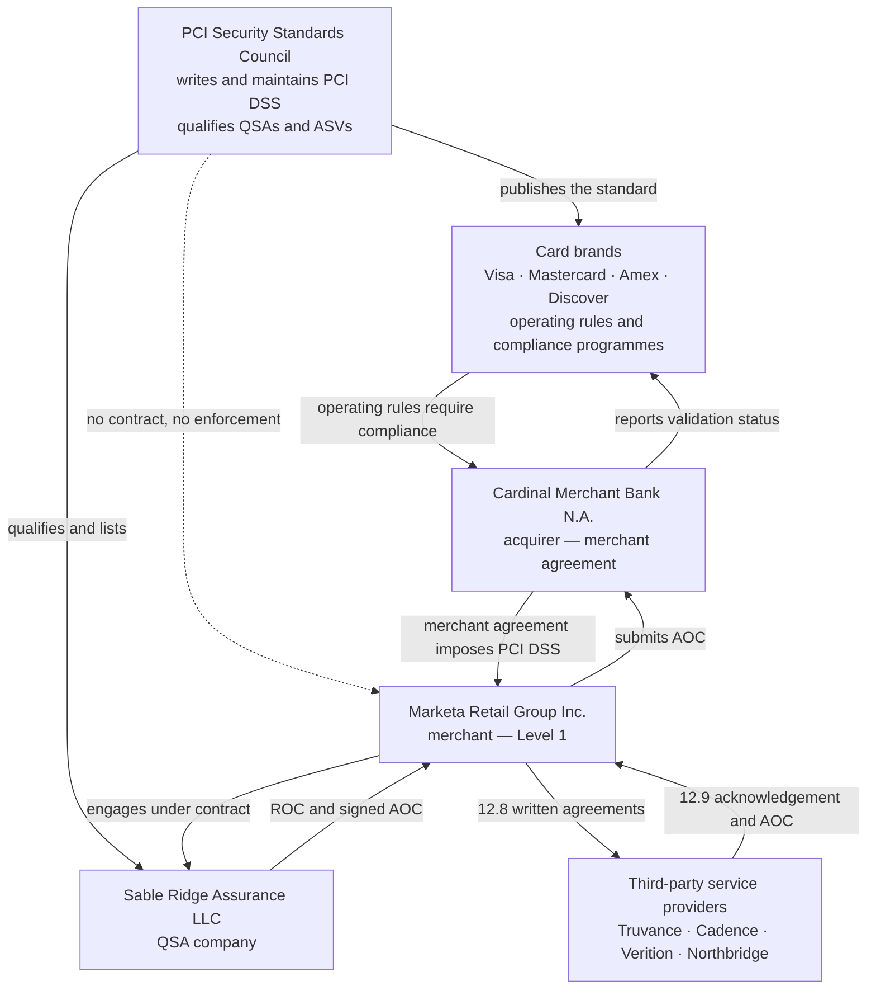

# 01.02 — The PCI DSS Landscape &amp; PCI DSS v4.0.1

| Field | Value |
|---|---|
| Document ID | MRG-PCI-2026-102 |
| Program | Marketa Retail Group — PCI DSS v4.0.1 Compliance Program |
| Phase | 01 — Program Foundation &amp; PCI Governance |
| Version | 1.0 |
| Status | Approved |
| Owner | Owen Castellanos, Payment Card Compliance Manager |
| Approver | Naomi Bhatt, Chief Information Security Officer |
| Date | 2026-07-15 |
| Classification | Confidential — Cardholder Data Environment // Illustrative Portfolio Sample |

## Purpose

This document explains the ecosystem in which the Payment Card Industry Data Security Standard operates — **who writes the standard, who enforces it, and through what instrument** — and then sets out what PCI DSS v4.0.1 requires that v3.2.1 did not. It is written to correct the two misconceptions that most often distort retail compliance programmes: that the PCI Security Standards Council enforces its own standard (it does not), and that an Attestation of Compliance is a certificate of legal compliance (it is not).

Marketa's 2026 assessment is the Company's **first under PCI DSS v4.0.1**, and the first in which all of the future-dated requirements are in force. Understanding what that means is the point of this document.

## 1. Two Different Institutions, Two Different Jobs

The most important structural fact about PCI DSS is that the body that **writes** the standard and the bodies that **enforce** it are not the same.

| Body | What it is | What it does | What it does **not** do |
|---|---|---|---|
| **PCI Security Standards Council (PCI SSC)** | An independent standards body founded in 2006 by Visa, Mastercard, American Express, Discover and JCB | Authors and maintains PCI DSS and the related standards; runs the QSA, ASV, ISA and PCIP qualification programmes; maintains the validated-solution listings (P2PE, PTS, SSF); publishes guidance, FAQs and the Self-Assessment Questionnaires | Does **not** enforce compliance; does not set merchant levels; does not impose fines; does not receive merchants' AOCs; has no contractual relationship with Marketa |
| **The payment card brands** (Visa, Mastercard, American Express, Discover) | The payment networks | Set their own compliance programmes; define merchant levels and validation criteria; require compliance through their operating rules; assess non-compliance amounts and breach-related recovery against acquirers | Do not write the standard; generally have no direct contract with Marketa |
| **The acquirer** (Cardinal Merchant Bank, N.A.) | The merchant bank that holds Marketa's merchant agreement | Passes brand rules down by contract; sets Marketa's validation deadline; receives and reviews the AOC; reports Marketa's status to the brands; passes through any non-compliance amounts | Does not write the standard; does not perform the assessment |
| **The QSA company** (Sable Ridge Assurance, LLC) | A firm qualified by the Council to perform assessments | Assesses Marketa against PCI DSS and produces the Report on Compliance; signs the AOC as assessor | Does **not** certify, license or approve Marketa; does not bind the brands or the acquirer; does not accept responsibility for Marketa's controls |

The practical consequence: **Marketa's PCI DSS obligation is a contractual obligation owed to Cardinal Merchant Bank**, which owes a corresponding obligation to the brands. If Marketa were to fall out of compliance, the Council would neither know nor act. Cardinal would.

## 2. What an AOC Is — and What It Is Not

The Attestation of Compliance is the most misunderstood artefact in the payments industry. It is a **signed statement of the assessment result at a point in time**, made on a form the Council publishes.

| Proposition | True? | Explanation |
|---|---|---|
| The AOC records the outcome of an assessment against PCI DSS at a point in time | **Yes** | It states the version assessed, the scope, the assessment dates, and the result for each requirement |
| The AOC is signed by both the assessed entity and the assessor | **Yes** | An executive officer of Marketa and the lead QSA both sign |
| The AOC is evidence Marketa can give its acquirer to demonstrate validation | **Yes** | This is its operational purpose |
| The AOC "certifies" Marketa | **No** | PCI DSS has no certification. The Council certifies assessors, not merchants |
| The AOC guarantees Marketa was secure on the date of signature | **No** | It records that specified controls were observed in place during the assessment window |
| The AOC guarantees Marketa remains compliant tomorrow | **No** | Compliance is a continuous state; an AOC is a snapshot. Requirement 12.4 and the business-as-usual model exist precisely because of this |
| The AOC binds a card brand or an acquirer to any conclusion | **No** | The brands and the acquirer make their own determinations; the QSA's opinion does not bind them |
| The AOC is a determination of compliance with any law or regulation | **No** | PCI DSS is a contractual industry standard. An AOC says nothing about any statute |

> **Legal position, stated plainly.** PCI DSS is not law. It is a standard imposed by private contract through the payment card chain. A small number of jurisdictions have enacted statutes that reference payment card security standards, and data-breach and consumer-protection statutes may apply to the same facts, but **nothing in this programme — including a clean ROC and a signed AOC — constitutes a determination of Marketa's compliance with any statute or regulation**. Legal obligations are assessed separately by the General Counsel, Frank Mueller.

## 3. Where PCI DSS Sits Among the Council's Standards

PCI DSS is one of a family. The others matter to Marketa because two of them underpin the scope reduction described in 01.01.

| Standard | Applies to | Relevance to Marketa |
|---|---|---|
| **PCI DSS v4.0.1** | Entities that store, process or transmit account data, or that can affect its security | The standard Marketa is assessed against |
| **PCI PIN Transaction Security (PTS) POI** | Point-of-interaction device manufacturers | Verition's PIN pads are PTS-approved and SRED-capable |
| **PCI Point-to-Point Encryption (P2PE)** | Encryption solutions and their providers | Verition's solution is P2PE-validated and listed; supplies the PIM |
| **PCI Software Security Framework (SSF)** | Payment software and its vendors | Successor to PA-DSS; relevant to the POS application lifecycle |
| **PCI 3-D Secure (3DS) Core Security Standard** | 3DS environments | Referenced; Truvance operates 3DS on Marketa's behalf |
| **PCI Card Production and Provisioning** | Card manufacturers and personalisers | Not applicable to Marketa |

## 4. Version History and Where v4.0.1 Sits

| Version | Released | Status | Note |
|---|---|---|---|
| PCI DSS 1.0 | December 2004 | Retired | First unified standard, replacing five brand programmes |
| PCI DSS 2.0 | October 2010 | Retired | Scoping clarifications |
| PCI DSS 3.0 | November 2013 | Retired | Business-as-usual emphasis; penetration-testing methodology |
| PCI DSS 3.2 | April 2016 | Retired | MFA for administrative CDE access; service-provider requirements |
| PCI DSS 3.2.1 | May 2018 | **Retired 31 March 2024** | The version Marketa validated against in 2023 and 2024 |
| **PCI DSS 4.0** | March 2022 | Superseded by 4.0.1 | The structural rewrite; introduced the customized approach |
| **PCI DSS 4.0.1** | **June 2024** | **Current — the version assessed here** | Limited errata and clarification release of v4.0; **no new requirements introduced** |

Two dates govern Marketa's position:

- **31 March 2024** — PCI DSS v3.2.1 retired. From that date no assessment could be validated against it. Marketa's 2024 assessment was the last under v3.2.1; its 2025 posture work and 2026 assessment are v4 work.
- **31 March 2025** — the end of the transition period for the **51 future-dated requirements** in v4. From that date they ceased to be "best practice" and became mandatory for all assessments. **Marketa's 2026 assessment is its first with all 51 in force.**

## 5. Why v4 Exists

The Council set out four goals for v4, and every structural change traces back to one of them. Understanding the goals is more useful than memorising the change list, because it explains what an assessor is looking for.

| Goal | What it means in practice | Where Marketa feels it |
|---|---|---|
| Continue to meet the security needs of the payment industry | New requirements addressing threats that did not exist or did not matter in 2018 — script injection on payment pages, phishing, authenticated scanning | 6.4.3, 11.6.1, 5.4.1, 11.3.1.2 |
| Promote security as a continuous process | Requirements framed around ongoing operation, defined roles and documented ownership rather than annual point-in-time evidence | 12.4.1, 12.5.2, the "roles and responsibilities" sub-requirement added to every requirement |
| Add flexibility and support different methodologies | The **customized approach**, and requirements that let the entity set its own frequency subject to a **targeted risk analysis** | 12.3.1 (14 targeted risk analyses); the single customized approach at 8.3.9 |
| Enhance validation methods and procedures | Tighter reporting templates, clearer testing procedures, explicit evidence expectations, alignment of the ROC and AOC | Phase 08's ROC production |

The rewrite is also structural: v4 restated most requirements as **outcome statements** with separate defined-approach testing procedures, and added to each of the twelve requirements an explicit sub-requirement (x.1.1 and x.1.2) that security policies, operational procedures and **roles and responsibilities** are documented, kept current, in use and known to affected parties. That change alone accounts for a substantial share of the documentation work in Phases 04 to 07.

## 6. What Changed from v3.2.1 — The Material Deltas

| Area | v3.2.1 | v4.0.1 | Impact on Marketa |
|---|---|---|---|
| Approach | Single prescriptive approach; compensating controls where needed | **Defined approach** plus **customized approach** with a stated Customized Approach Objective per eligible requirement | One customized approach adopted (8.3.9) |
| Risk analysis | Annual risk-assessment requirement (12.2) removed in v4 and replaced | **Targeted risk analysis (12.3.1)** for each entity-defined frequency; **12.3.2** for customized approach | 14 targeted risk analyses produced |
| Passwords | Minimum 7 characters, alphabetic and numeric | **Minimum 12 characters (8.3.6)**, alphabetic and numeric | Enterprise password standard reset |
| Multi-factor authentication | MFA for administrative access and all remote access into the CDE | **8.4.2 — MFA for all access into the CDE**, plus 8.5.1 MFA system requirements | Largest single access-control workstream (Phase 05) |
| Application and system accounts | Limited coverage | **8.6.1–8.6.3** — governance of interactive use, credential management, and password change frequency | Surfaced hard-coded credentials in 2 legacy batch integrations |
| Payment pages | Not addressed | **6.4.3** script inventory, authorisation and integrity; **11.6.1** payment-page change and tamper detection | New workstream owned by Sonia Rendell |
| Vulnerability management | High/Critical ranked issues addressed | **11.3.1.1** manage all other applicable vulnerabilities; **11.3.1.2** authenticated internal scanning | One of the two Not in Place findings at first assessment |
| Log review | Daily review, manual acceptable | **10.4.1.1** automated mechanisms to perform log reviews | SIEM use-case build in Phase 06 |
| Anti-malware | Anti-virus on commonly affected systems | **5.3.3** removable media scanning; **5.4.1** automated anti-phishing mechanisms | DC and store media handling; email security tooling |
| Remote access and PAN | Copy/relocation restricted by policy | **3.4.2** technical controls preventing copy and relocation of PAN during remote access | Jump-host and DLP controls |
| Incident response | Response plan required | **12.10.7** procedures for PAN found where it is not expected | Directly exercised — 4 unexpected PAN locations found |
| Scope | Annual scope confirmation implied | **12.5.2** documented scope confirmed at least every 12 months (**12.5.2.1**, every 6 months for service providers) | The governing requirement for Phase 02 |
| Encryption | SSL/early TLS deprecation, disk encryption allowances | Tightened key-management and cryptographic-inventory expectations, including 12.3.3 review of cryptographic suites | Cryptography inventory in Phase 04 |

## 7. The Future-Dated Requirements That Matter to Marketa

Of the 64 new requirements introduced in v4, **13 applied immediately on adoption of v4 and 51 were future-dated to 31 March 2025**. The table below is the subset that materially shapes this programme. Every one of these is assessed as mandatory in 2026.

| Requirement | What it now requires | Marketa impact | Owner | Phase |
|---|---|---|---|---|
| **3.4.2** | Technical controls to prevent copy and relocation of PAN when using remote-access technologies, unless explicitly authorised | Jump-host clipboard and file-transfer restrictions for the 8 CDE systems | Trevor Kim | 05 |
| **5.3.3** | Anti-malware scanning of removable electronic media, or a documented targeted risk analysis supporting an alternative | DC and store media handling; USB policy and enforcement | Marcus Hale | 04 |
| **5.4.1** | Automated mechanisms to detect and protect personnel against phishing attacks | Email security gateway controls above and beyond training | Marcus Hale | 04 |
| **6.4.3** | Inventory, authorise and assure the integrity of **all scripts executing in the consumer browser on payment pages** | 38 scripts across 6 templates, 11 third-party; 3 unauthorised at first inventory | Sonia Rendell | 04 |
| **8.3.6** | Passwords a minimum of **12 characters** with both numeric and alphabetic characters | Enterprise-wide standard change across AD and in-scope local accounts | Trevor Kim | 05 |
| **8.4.2** | **MFA for all access into the CDE**, not only administrative or remote access | All access paths to the 8 CDE systems | Trevor Kim | 05 |
| **8.6.1** | Governance of application and system accounts used for interactive login | Service-account inventory and interactive-use justification | Trevor Kim | 05 |
| **8.6.2** | Passwords for application and system accounts not hard-coded in scripts, configuration or source | Two legacy batch integrations failed at first assessment | Trevor Kim | 05 |
| **8.6.3** | Application and system account passwords protected against misuse; change frequency and complexity set by targeted risk analysis | Secrets-management rollout | Trevor Kim | 05 |
| **10.4.1.1** | **Automated mechanisms** to perform audit-log reviews | SIEM correlation and alerting replaces manual daily review | Marcus Hale | 06 |
| **11.3.1.1** | Manage **all other applicable vulnerabilities** — those not ranked High or Critical | Risk-ranked treatment of Medium and Low findings | Marcus Hale | 06 |
| **11.3.1.2** | **Authenticated** internal vulnerability scanning | Incomplete on 9 of 71 components at first assessment (vendor-locked appliances) — one of the two Not in Place findings | Marcus Hale | 06 |
| **11.6.1** | Change- and tamper-detection on payment pages, alerting on unauthorised modification of HTTP headers and page content, checked at least weekly | Monitoring live from August 2026; alerts within 24 hours | Sonia Rendell | 06 |
| **12.3.1** | A **targeted risk analysis** for every requirement that permits an entity-defined frequency | 14 targeted risk analyses produced and maintained | Naomi Bhatt | 07 |
| **12.10.7** | Incident-response procedures for **PAN discovered where it is not expected** | Exercised for real — all 4 unexpected PAN locations drove a procedure improvement | Marcus Hale | 07 |

Two of these deserve emphasis because they are the requirements most likely to be missed by a retailer that believes its outsourcing has removed it from scope.

**6.4.3 and 11.6.1 apply to Marketa notwithstanding the hosted iframe.** The PAN never reaches a Marketa server, and that is exactly why the attack shifts to the page. If an attacker can modify the checkout template, the iframe becomes decoration. The Council future-dated these requirements to give the industry time to build script inventory and page-integrity monitoring; that time expired on 31 March 2025.

**11.3.1.2 changes the meaning of an internal scan.** An unauthenticated internal scan sees what a network-adjacent attacker sees. An authenticated scan sees what is actually installed. The gap between the two is usually large, and closing it is the reason Marketa's first assessment carries a Not in Place finding rather than a clean result.

## 8. What v4.0.1 Changed Relative to v4.0

PCI DSS v4.0.1 was released in **June 2024** as a limited revision. It corrected typographical and formatting errors, clarified intent in applicability notes and guidance, and adjusted several testing procedures for consistency. It **did not add new requirements**, did not remove any, and did not alter any future-dated deadline.

| Aspect | Position under v4.0.1 |
|---|---|
| New requirements | None |
| Removed requirements | None |
| Future-dated deadline | Unchanged — 31 March 2025 |
| Nature of the changes | Errata, clarifications to applicability notes, guidance and testing-procedure wording |
| Effect on Marketa | The version cited on the ROC and AOC is **v4.0.1**; content of the obligations follows v4 |

For a merchant, the operational significance of v4.0.1 is small but not zero: the reporting templates, the AOC form and the SAQ set were reissued at v4.0.1, and **an assessment must be documented on the templates matching the version assessed**. Sable Ridge Assurance will use the v4.0.1 ROC Reporting Template.

## 9. What This Means for Marketa's 2026 Assessment

```mermaid
flowchart LR
    V321["v3.2.1<br/>Marketa compliant<br/>2023 and 2024"] -->|"retired 31 Mar 2024"| GAP["Transition period<br/>13 requirements immediate<br/>51 future-dated"]
    GAP -->|"51 mandatory 31 Mar 2025"| V401["PCI DSS v4.0.1<br/>full obligation set"]
    V401 --> ASSESS["2026 assessment<br/>Sable Ridge Assurance<br/>fieldwork 2 to 20 Nov 2026"]
    ASSESS --> ROC["ROC and AOC<br/>issued 11 Dec 2026"]
    ROC -.->|"2 requirements Not in Place<br/>dated remediation"| REM["Remediation<br/>complete 31 Jan 2027"]
    REM --> REASSESS["Re-assessment<br/>full compliance<br/>18 Feb 2027"]
```

| Consideration | Position |
|---|---|
| Version assessed | PCI DSS v4.0.1 |
| Future-dated requirements | All in force; none may be reported as "not yet applicable" |
| Applicable sub-requirements | 306 for a Level 1 merchant of this shape |
| Prior-year precedent | Limited value — v3.2.1 evidence does not satisfy v4 testing procedures for the changed requirements |
| Biggest delta from prior years | 8.4.2 MFA everywhere into the CDE; 6.4.3 and 11.6.1 payment-page controls; 11.3.1.2 authenticated scanning; 10.4.1.1 automated log review |
| Documentation delta | Every requirement now carries an explicit roles-and-responsibilities sub-requirement |
| Approach | Defined approach throughout, with one customized approach (8.3.9) and three compensating controls |

The honest summary Marketa's Steering Committee was given at kickoff on 12 January 2026: *two clean years under v3.2.1 predict very little about v4.0.1, and the programme should be planned as a first-time assessment rather than a renewal.* Phase 08's outcome — 297 In Place, 3 In Place with Compensating Control, 4 Not Applicable, 2 Not in Place — is what that honesty produced.

## Cross-References

| Reference | Relevance |
|---|---|
| 01.01 — Company Profile &amp; Payment Channels | The channels the standard is applied to |
| 01.03 — Merchant Level Determination &amp; Validation | Which validation instrument the brands require |
| 01.04 — Acquirer &amp; Card Brand Obligations | The contractual chain that enforces the standard |
| 01.05 — PCI DSS v4 Requirements Overview | The 12 requirements in detail; defined vs customized approach |
| Phase 04 — Build &amp; Maintain Secure Systems | 6.4.3, 5.3.3, 5.4.1 delivery |
| Phase 06 — Monitoring, Testing &amp; Third Parties | 10.4.1.1, 11.3.1.2, 11.6.1 delivery |
| Phase 08 — QSA Assessment &amp; ROC Production | Assessment against v4.0.1 templates |

---
[⬅ Previous](01.01-company-profile-and-payment-channels.md) · [🏠 Phase 01 Home](01.00-README.md) · [Next ➡](01.03-merchant-level-determination-and-validation.md)
