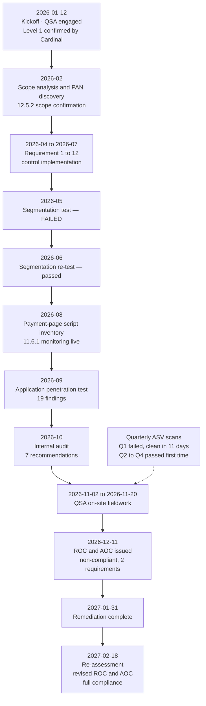

# 01.03 — Merchant Level Determination &amp; Validation Obligations

| Field | Value |
|---|---|
| Document ID | MRG-PCI-2026-103 |
| Program | Marketa Retail Group — PCI DSS v4.0.1 Compliance Program |
| Phase | 01 — Program Foundation &amp; PCI Governance |
| Version | 1.0 |
| Status | Approved |
| Owner | Owen Castellanos, Payment Card Compliance Manager |
| Approver | Raymond Voss, Chief Financial Officer |
| Date | 2026-07-15 |
| Classification | Confidential — Cardholder Data Environment // Illustrative Portfolio Sample |

## Purpose

Every merchant is subject to PCI DSS in full. Not every merchant validates compliance the same way. **Merchant level** determines which validation instrument the card brands require, who may produce it, and how often. This document explains how levels are assigned, shows Marketa's transaction arithmetic, records the determination — **Level 1** — and sets out precisely what validation obligations follow from it.

It also draws a distinction the programme depends on: the difference between **complying** with PCI DSS and **validating** compliance. Marketa must do the first continuously and demonstrate the second annually. They are not the same activity, and Requirement 12.4's business-as-usual expectation exists because the industry has repeatedly confused them.

## 1. How Merchant Levels Work

Merchant levels are set by **the card brands, not the PCI Security Standards Council**. Each brand publishes its own criteria in its own compliance programme, each applies them to transaction volume processed under that brand, and each may exercise discretion.

| Principle | Explanation |
|---|---|
| Levels are per brand | A merchant can be Level 1 for Visa and Level 2 for American Express. Level is not a single global attribute |
| Levels are driven by annual transaction volume | Counted per brand, aggregated across all channels and all doing-business-as names under the same corporate entity |
| Levels determine **validation**, not **applicability** | A Level 4 merchant must comply with PCI DSS just as fully as a Level 1 merchant; it simply validates differently |
| Aggregation follows the entity | Volume for the same legal entity is aggregated globally, not counted per store or per merchant identification number |
| Brands may reassign level at discretion | A brand or an acquirer may elevate a merchant's level for risk reasons independent of volume |
| **A compromise can force Level 1 regardless of volume** | Any merchant that suffers an account data compromise may be escalated to Level 1 by the brands, with a mandated forensic investigation and on-site validation, whatever its transaction count |

That last row is the one worth internalising. The brands treat a breach as evidence that the merchant's self-assessment, if it had one, was wrong. A merchant processing 200,000 transactions a year can find itself in a Level 1 validation cycle within weeks of a compromise. **Level is a floor set by volume and a ceiling raised by incident.**

### Typical published thresholds

The table below reflects the general shape of the brands' published criteria. Exact criteria are defined by each brand in its own programme documentation and by Cardinal Merchant Bank in the merchant agreement; the programme relies on Cardinal's written confirmation rather than on this table.

| Level | Visa (typical) | Mastercard (typical) | American Express (typical) | Discover (typical) |
|---|---|---|---|---|
| **1** | Over 6M transactions annually; or any merchant compromised; or designated by Visa | Over 6M transactions annually; or compromised; or designated | 2.5M+ transactions annually; or designated | 6M+ transactions annually; or designated |
| **2** | 1M–6M transactions annually | 1M–6M transactions annually | 50,000–2.5M annually | 1M–6M annually |
| **3** | 20,000–1M **e-commerce** transactions annually | 20,000–1M e-commerce transactions annually | Under 50,000 annually | 20,000–1M e-commerce annually |
| **4** | All other merchants | All other merchants | — | All others |

## 2. Marketa's Transaction Arithmetic

Marketa processes **68.4 million card transactions annually across Visa and Mastercard combined**. The channel split is set out in 01.01 and reproduced here because the determination depends on it.

| Channel | Share | Transactions | Notes |
|---|---|---|---|
| Card-present, 482 stores / 1,914 lanes | 74% | ≈ 50,616,000 | EMV chip, contactless, limited magnetic-stripe fallback |
| E-commerce | 23% | ≈ 15,732,000 | Hosted checkout iframe; 22% of revenue |
| MOTO, Austin call centre | 3% | ≈ 2,052,000 | 310 agents; DTMF suppression |
| **Total (Visa + Mastercard)** | **100%** | **≈ 68,400,000** | The figure of record for level determination |

Even on the most conservative apportionment between the two brands — and the actual split is materially more balanced — each of Visa and Mastercard individually exceeds the six-million threshold by a wide margin. There is no arithmetic under which Marketa is anything other than Level 1 for both.

American Express and Discover volumes are lower in absolute terms but are also assessed against lower thresholds. Marketa validates once, to the most demanding standard, and provides the resulting AOC to all four brands through Cardinal. This is the normal and expected practice: **a merchant does not run four assessments.**

## 3. The Determination

| Brand | Threshold engaged | Marketa volume | Determination | Basis |
|---|---|---|---|---|
| Visa | Over 6M annually | Well above threshold | **Level 1** | Volume |
| Mastercard | Over 6M annually | Well above threshold | **Level 1** | Volume |
| American Express | 2.5M+ annually | Above threshold | **Level 1** | Volume |
| Discover | 6M+ annually | Above threshold | **Level 1** | Volume |
| **Consolidated position** | — | **68.4M (Visa + Mastercard)** | **Level 1 merchant** | Confirmed in writing by Cardinal Merchant Bank |

> **Determination of record.** Marketa Retail Group, Inc. is a **Level 1 merchant**. Cardinal Merchant Bank, N.A. confirmed this classification at programme kickoff on 2026-01-12. Marketa has no history of an account data compromise; the classification rests on volume alone.

## 4. What Level 1 Requires

Level 1 validation is the full instrument set. Each item below is an obligation in its own right; none substitutes for another.

| # | Obligation | Instrument | Performed by | Frequency | Marketa's provider |
|---|---|---|---|---|---|
| 1 | On-site assessment of the full cardholder data environment against every applicable requirement | **Report on Compliance (ROC)** | Qualified Security Assessor (or an Internal Security Assessor where the acquirer permits) | Annual | Sable Ridge Assurance, LLC — lead QSA Grant Whitfield, QSA Amara Osei |
| 2 | Executive attestation of the assessment result | **Attestation of Compliance (AOC)** | Signed by an executive officer of the assessed entity **and** the QSA | Annual | Raymond Voss (CFO) and Grant Whitfield |
| 3 | External vulnerability scanning of all internet-facing in-scope systems | **ASV scan report and attestation** | PCI **Approved Scanning Vendor** | Quarterly, and after significant change | Sable Ridge Scanning Services |
| 4 | Internal vulnerability scanning, including authenticated scanning (11.3.1.2) | Scan reports and remediation records | Qualified internal resource or third party | Quarterly, and after significant change | Marketa Security Operations (Marcus Hale) |
| 5 | External penetration testing (11.4.3) | Penetration test report | Qualified internal or external tester, organisationally independent | At least annually, and after significant change | Ironwood Security Labs |
| 6 | Internal penetration testing (11.4.2) | Penetration test report | Qualified internal or external tester, organisationally independent | At least annually, and after significant change | Ironwood Security Labs |
| 7 | Segmentation testing to confirm isolation of the CDE (11.4.5) | Segmentation test report | Qualified tester, organisationally independent | At least annually for merchants, and after any change to segmentation controls | Ironwood Security Labs |
| 8 | Annual scope confirmation (12.5.2) | Documented scope with supporting analysis | The assessed entity | At least every 12 months, and on significant change | Naomi Bhatt / Owen Castellanos |

Two clarifications that assessors routinely have to make:

**The ASV scan is not the penetration test, and neither is the internal vulnerability scan.** They test different things with different methods and different qualification regimes. An ASV scan is an automated external scan performed by a vendor the Council has approved, producing a pass or fail against defined criteria. A penetration test is a manual, objective-driven exercise conducted to a documented methodology. Requirement 11 requires both.

**Quarterly ASV scans must show four passing quarters.** A failed scan must be remediated and rescanned until it passes; the passing rescan is what evidences the quarter. Marketa's Q1 2026 scan failed with three findings and was rescanned clean in eleven days; Q2 through Q4 passed first time. The failed initial scan is not itself a compliance failure — **failing to obtain a passing scan for the quarter would be.**

## 5. ROC or SAQ — and Why Marketa Has No Choice

A **Self-Assessment Questionnaire (SAQ)** is a validation instrument the Council publishes for merchants and service providers whose acquirer or brand permits self-assessment. Each SAQ covers a subset of PCI DSS requirements matched to a specific acceptance channel and technology profile. A **Report on Compliance** covers every applicable requirement and is produced by a qualified assessor who tests and documents evidence for each one.

| Instrument | Who completes it | Coverage | Evidence standard |
|---|---|---|---|
| **SAQ** | The merchant itself, on a Council form | A subset of requirements matched to eligibility criteria | Self-attested; no independent testing required |
| **ROC** | A QSA (or ISA where permitted) | Every applicable requirement, with an assessed finding for each | Independent examination, observation, interview and sampling documented per testing procedure |

The SAQ family, for orientation:

| SAQ | Intended for | Would it fit Marketa? |
|---|---|---|
| A | Card-not-present merchants who fully outsource all account-data functions; payment page wholly hosted or a compliant iframe/redirect | Fits the e-commerce channel's *shape* but not the merchant's level; also does not cover stores or MOTO |
| A-EP | E-commerce merchants whose site does not receive account data but does affect the security of the payment transaction | Closer to the e-commerce reality than A, but again channel-specific |
| B | Imprint machines or standalone dial-out terminals, no electronic storage | No |
| B-IP | Standalone, PTS-approved IP-connected terminals, no electronic storage | No |
| C | Payment application systems connected to the internet, no electronic storage | No |
| C-VT | Web-based virtual terminal on one computer, no electronic storage | No |
| **P2PE** | Merchants using a validated P2PE solution with no electronic account-data storage | Fits the *store* channel precisely — and is exactly why the P2PE investment matters — but covers only that channel |
| D — Merchant | All other merchants | Broadest, but still a self-assessment |

Marketa cannot use any of them, for two independent reasons:

1. **Level 1 merchants are required by the brands to validate by on-site assessment producing a ROC.** Self-assessment is not an option the brands extend at this volume. This reason alone is dispositive.
2. **No single SAQ spans Marketa's channel mix.** Even if self-assessment were permitted, the Company accepts through three channels with three different technology profiles. SAQ eligibility is assessed against a single acceptance profile; a merchant that spans several either uses SAQ D or does the full assessment. The channel diversity is a supporting reason, not the operative one.

> The P2PE scope reduction is therefore **real but differently valuable** to Marketa than it would be to a smaller retailer. A Level 3 merchant with the same store estate could validate the store channel on SAQ P2PE. Marketa still requires a full ROC — but the ROC covers 71 assessed components rather than 604, because P2PE, tokenization and DTMF suppression removed the rest. The saving is in **assessment surface**, not in instrument.

## 6. Who Signs What

Signature accountability is not a formality. The AOC is signed by a named executive officer who is attesting on behalf of the entity, and that signature is what the acquirer relies on.

| Document | Signed by (assessed entity) | Signed by (assessor) | What the signature asserts |
|---|---|---|---|
| **Report on Compliance** | Not signed by the merchant; the merchant provides representations within it | Lead QSA, on behalf of the QSA company — **Grant Whitfield, Sable Ridge Assurance, LLC** | That the assessment was performed in accordance with PCI DSS testing procedures and the findings are accurately recorded |
| **Attestation of Compliance, Part 3 (merchant section)** | **Raymond Voss, Chief Financial Officer** | — | That the assessed entity's PCI DSS assessment is accurately represented; that PCI DSS is maintained at all times; that material change triggers reassessment of the affected environment |
| **Attestation of Compliance, Part 3 (assessor section)** | — | **Grant Whitfield**, lead QSA | That the QSA company performed the assessment, that it has no conflict impairing independence, and that the ROC supports the attestation |
| **ASV scan report attestation** | **Owen Castellanos**, Payment Card Compliance Manager (scan customer) | **Sable Ridge Scanning Services** (ASV) | That the scan scope is complete and accurate (customer) and that the scan was conducted per the ASV Program Guide (ASV) |
| **Penetration test report** | Accepted by **Naomi Bhatt**, CISO | **Ironwood Security Labs** | Methodology, scope, findings and retest results |
| **Compensating Controls Worksheet** (one per compensating control) | **Naomi Bhatt**, CISO | Reviewed and accepted by the QSA | Constraint, objective, identified risk, definition of the compensating control, validation and maintenance |
| **Customized Approach controls matrix and targeted risk analysis** (8.3.9) | **Naomi Bhatt**, CISO | QSA derives and documents bespoke testing procedures | That the Customized Approach Objective is met by the described controls |

Marketa deliberately places the AOC signature with the **CFO rather than the CISO**. Raymond Voss owns the acquirer relationship, is the executive sponsor of the programme, and is the officer to whom Cardinal Merchant Bank looks. Placing the attestation with the executive who owns the commercial relationship, and who does not run the controls being attested to, is a governance choice recorded in ADR-0002.

## 7. Independence of the Assessing Parties

| Party | Engagement | Independence position |
|---|---|---|
| Sable Ridge Assurance, LLC (QSA) | Annual on-site assessment and ROC | Qualified by the Council; no role in designing, implementing or operating Marketa's controls |
| Sable Ridge Scanning Services (ASV) | Quarterly external scans | Same firm as the QSA, **separate practice**. Separation of personnel, engagement management and reporting lines documented and accepted by Cardinal at kickoff. Recorded in the ROC and in ADR-0003 |
| Ironwood Security Labs | Segmentation and application penetration testing | External; organisationally independent of Marketa IT and Security per 11.4.1 |
| Rosa Delgado, Director of Internal Audit | Independent internal review (October 2026) | Reports to the Audit Committee, not to the CISO; provides second-line assurance ahead of QSA fieldwork |

The QSA-and-ASV-from-one-firm arrangement is permissible and common, but it is the kind of arrangement that should be documented before an assessor asks about it rather than after. Marketa documented it at kickoff.

## 8. Marketa's 2026 Validation Cycle

| Obligation | Q1 2026 | Q2 2026 | Q3 2026 | Q4 2026 | Q1 2027 |
|---|---|---|---|---|---|
| ASV external scan | Failed, 3 findings; clean rescan in 11 days | Passed | Passed | Passed | Cycle continues |
| Internal vulnerability scan (incl. authenticated) | Performed | Performed | Performed | Performed — 9 of 71 components incomplete | Complete |
| POI device inspection (9.5.1), 1,914 terminals | Performed | Performed | Performed — 6 seal discrepancies, all cleared | Performed | Performed |
| Penetration testing | — | Segmentation test (failed, then passed) | — | Application test, September | Retest of remediated findings |
| Scope confirmation (12.5.2) | February | — | — | Re-confirmed for fieldwork | — |
| QSA activity | Engagement, planning | Interim checkpoints | Evidence readiness review | Fieldwork 2–20 Nov; ROC/AOC 11 Dec | Re-assessment 18 Feb |

## 9. Validating Is Not Complying

The distinction is worth stating in the charter documents because it changes how the programme is run and how it is measured.

| Dimension | Complying | Validating |
|---|---|---|
| Timeframe | Continuous — every day of the year | Point in time — the assessment window |
| Governing requirements | All 306 applicable sub-requirements, plus 12.4 business-as-usual expectations | The brands' Level 1 validation criteria |
| Evidence | Produced by operating controls | Selected and tested by the QSA |
| Consequence of failure | Exposure to compromise | Non-compliant AOC and acquirer consequences |
| Owner at Marketa | Every control owner | Owen Castellanos, coordinating |

Marketa's stated position, carried into the charter at 01.06, is that the programme's objective is **continuous compliance evidenced annually**, not an annual scramble to produce an AOC. The measurable expression of that is Phase 09's continuous-compliance calendar, not the December signature.

## Cross-References

| Reference | Relevance |
|---|---|
| 01.01 — Company Profile &amp; Payment Channels | The 68.4M transaction volume and channel split |
| 01.02 — PCI DSS Landscape &amp; v4.0.1 | Why the brands, not the Council, set levels |
| 01.04 — Acquirer &amp; Card Brand Obligations | Submission path and non-compliance consequences |
| 01.06 — Program Charter &amp; Objectives | Continuous-compliance objective |
| 01.07 — Roles, Responsibilities &amp; RACI | What the QSA does and does not do |
| Phase 06 — Monitoring, Testing &amp; Third Parties | ASV, internal scanning, penetration testing execution |
| Phase 08 — QSA Assessment &amp; ROC Production | The ROC and AOC themselves |

---
[⬅ Previous](01.02-pci-dss-landscape-and-v4-0-1.md) · [🏠 Phase 01 Home](01.00-README.md) · [Next ➡](01.04-acquirer-and-card-brand-obligations.md)
