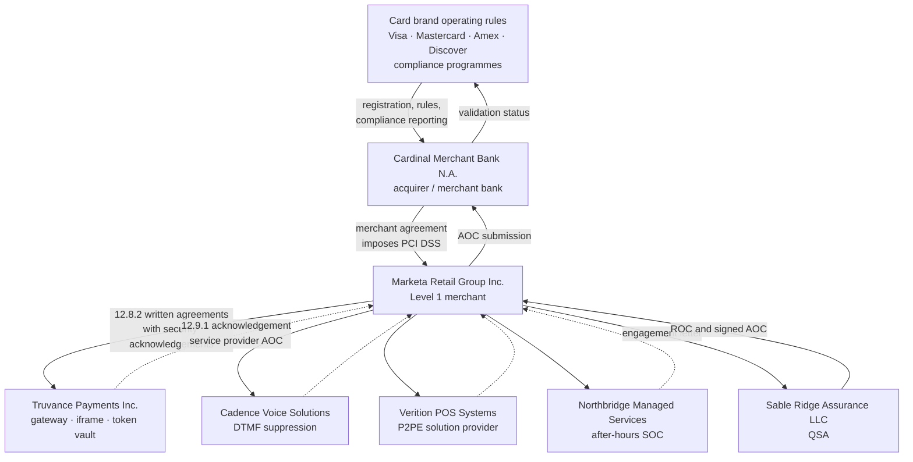
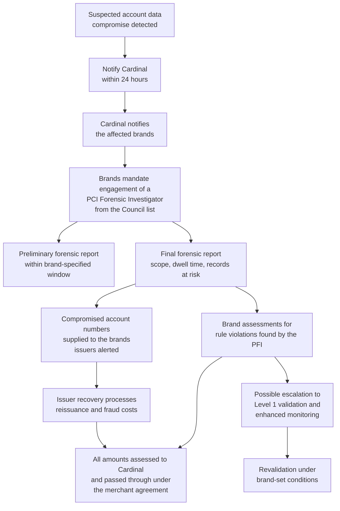
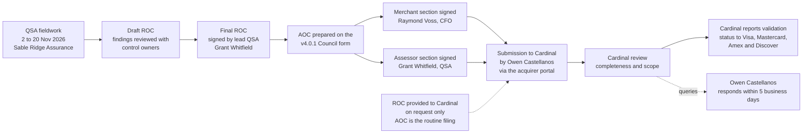

# 01.04 — Acquirer &amp; Card Brand Obligations

| Field | Value |
|---|---|
| Document ID | MRG-PCI-2026-104 |
| Program | Marketa Retail Group — PCI DSS v4.0.1 Compliance Program |
| Phase | 01 — Program Foundation &amp; PCI Governance |
| Version | 1.0 |
| Status | Approved |
| Owner | Raymond Voss, Chief Financial Officer |
| Approver | Frank Mueller, General Counsel |
| Date | 2026-07-15 |
| Classification | Confidential — Cardholder Data Environment // Illustrative Portfolio Sample |

## Purpose

Marketa's obligation to comply with PCI DSS is **contractual**. It arrives through a chain: the card brands' operating rules bind Cardinal Merchant Bank, N.A.; Cardinal's merchant agreement binds Marketa; and Marketa's written agreements bind its own third-party service providers. This document maps that chain, records what Cardinal requires and by when, describes the card brands' compliance programmes at a level of generality that is accurate, and sets out what happens on non-compliance — both the routine case (a missed or non-compliant validation) and the severe case (an account data compromise).

It deliberately does **not** quote fee schedules or fine amounts. Those figures are set by the brands in their operating rules, communicated to acquirers, and passed through under Marketa's merchant agreement. Reproducing numbers from secondary sources into a governance document is how organisations end up planning against figures that are wrong.

## 1. The Contractual Chain

Three properties of this chain govern everything else in the document.

| Property | Consequence for Marketa |
|---|---|
| Marketa generally has **no direct contract with the card brands** | Brand requirements reach Marketa only through Cardinal. Marketa's counterparty for every compliance question is Cardinal, not Visa |
| Cardinal is **liable to the brands** for its merchants' compliance | Cardinal has a direct commercial incentive to demand evidence, and the leverage of the merchant agreement to obtain it |
| Marketa is **responsible for its service providers** | Outsourcing the handling of account data does not outsource accountability. Requirement 12.8 obliges Marketa to govern the relationships; Requirement 12.9 obliges the providers to support that governance |

## 2. What Cardinal Merchant Bank Requires

The obligations below are drawn from the Marketa–Cardinal merchant agreement and Cardinal's PCI compliance programme documentation, as confirmed in writing at programme kickoff on 2026-01-12.

| # | Obligation | Instrument | Cadence / deadline | Marketa owner |
|---|---|---|---|---|
| C1 | Maintain full compliance with PCI DSS at all times | Continuous | Ongoing | Naomi Bhatt |
| C2 | Validate annually as a Level 1 merchant by on-site assessment | ROC produced by a QSA | Annual | Owen Castellanos |
| C3 | Submit the executed Attestation of Compliance | AOC, current version of the Council form | **On or before 31 December each year** | Raymond Voss (signature); Owen Castellanos (submission) |
| C4 | Submit quarterly external scan attestations | ASV scan report and attestation of scan compliance | **Within 30 days of each quarter end**; a passing scan required for every quarter | Owen Castellanos |
| C5 | Notify Cardinal of any suspected or confirmed account data compromise | Written notice via the designated incident contact | **Within 24 hours of determination** | Naomi Bhatt |
| C6 | Notify Cardinal before engaging any new third-party service provider that stores, processes or transmits account data, or that can affect its security | Written notice with the provider's validation status | **Prior to engagement** | Owen Castellanos |
| C7 | Notify Cardinal of material change to the cardholder data environment, acceptance channels or processing arrangements | Written notice | **Within 30 days** | Elena Marchetti |
| C8 | Maintain and evidence quarterly POI device inspection under 9.5.1 | Inspection records, retained | Quarterly | Adaeze Nwosu |
| C9 | Provide the AOCs of all in-scope service providers on request | TPSP AOC register | Annual and on request | Owen Castellanos |
| C10 | Cooperate with any brand-mandated forensic investigation | As directed | On demand | Frank Mueller / Naomi Bhatt |

> Cardinal's deadline of **31 December** and the 30-day ASV submission window are the dates the programme plans against. The 2026 ROC and AOC were issued on **2026-12-11**, twenty days ahead of the deadline — deliberately, so that a non-compliant result would still leave time for a considered submission and a negotiated remediation plan rather than a scramble.

## 3. Marketa's Reporting Calendar to Cardinal

| Trigger | Report | Due | 2026 actual |
|---|---|---|---|
| Q1 end (31 Mar) | ASV scan attestation | 30 Apr | Submitted after clean rescan (initial scan failed with 3 findings; clean in 11 days) |
| Q2 end (30 Jun) | ASV scan attestation | 30 Jul | Submitted; passed first time |
| Q3 end (30 Sep) | ASV scan attestation | 30 Oct | Submitted; passed first time |
| Q4 end (31 Dec) | ASV scan attestation | 30 Jan 2027 | Submitted; passed first time |
| Annual validation | Signed AOC (+ ROC on request) | 31 Dec | **AOC filed 2026-12-11 as non-compliant with a dated remediation plan** |
| Remediation milestone | Written confirmation of completion | As agreed | 2027-01-31 |
| Re-assessment | Revised ROC and AOC | As agreed | **2027-02-18 — full compliance** |
| Material change | Change notification | Within 30 days | Segmentation redesign notified June 2026 |
| New service provider | Pre-engagement notification | Before engagement | None added during the engagement |
| Suspected compromise | Incident notification | Within 24 hours | None occurred |

## 4. The Card Brand Compliance Programmes

Each brand runs its own programme under its own name. The programmes cover merchant and service-provider registration, validation reporting, compromise handling and enforcement. They are administered through acquirers.

| Brand | Programme | What it governs |
|---|---|---|
| Visa | **Cardholder Information Security Program (CISP)** | Merchant and service-provider validation levels and reporting; maintains a global registry of validated service providers; operates the account data compromise process |
| Mastercard | **Site Data Protection (SDP) Program** | Validation requirements by level; compliance reporting through acquirers; maintains a compliant service-provider list; operates the account data compromise process |
| American Express | **Data Security Operating Policy (DSOP)** | Merchant and service-provider data security obligations, validation and incident reporting |
| Discover | **Discover Information Security &amp; Compliance (DISC)** | Validation requirements, reporting and compromise handling |

Four things are true of all four programmes and are the only generalisations this document makes about them:

1. **They require compliance with PCI DSS** and specify how compliance is validated by level.
2. **They are administered through acquirers.** Marketa reports to Cardinal; Cardinal reports to the brands.
3. **They provide for financial consequences for non-compliance and for compromise**, assessed against the acquirer, which passes them through to the merchant under the merchant agreement.
4. **They can escalate a merchant to Level 1 following a compromise**, regardless of transaction volume, and can mandate an investigation by a PCI Forensic Investigator.

The programmes also maintain **published registries of validated service providers**, which is how Marketa independently corroborates the status of Truvance Payments and Cadence Voice Solutions under Requirement 12.8.4 rather than relying solely on AOCs the providers supply.

## 5. Consequences of Non-Compliance — the Routine Case

The routine case is a merchant that misses its validation deadline, files a non-compliant AOC, or fails to obtain passing quarterly scans. The consequences escalate.

| Stage | What happens | Who acts | Marketa exposure |
|---|---|---|---|
| 1 — Notice | Acquirer notifies the merchant of the missed or deficient submission and sets a cure period | Cardinal | Administrative |
| 2 — Monthly non-compliance assessment | The brands assess a recurring monthly amount against the acquirer for each non-validated Level 1 merchant; the acquirer passes it through under the merchant agreement | Brands → Cardinal → Marketa | Recurring monthly charge, continuing until validation is restored. **Amount is set by the brand's operating rules and the merchant agreement; not reproduced here** |
| 3 — Escalation | Increased assessment amounts, mandatory remediation plans with brand-set milestones, and enhanced reporting | Brands → Cardinal | Higher recurring charge plus management burden |
| 4 — Commercial consequence | Adverse changes to processing terms, increased reserve requirements, or restrictions on acceptance channels | Cardinal | Direct cost of acceptance rises |
| 5 — Termination | Termination of the merchant agreement; in extreme cases, placement on the brands' terminated-merchant listings | Cardinal / brands | Loss of card acceptance — existential for a $4.2B retailer |

> A merchant that files a **non-compliant AOC with a credible, dated remediation plan** is in a materially better position than one that files nothing or files late. Acquirers can and do accept a dated plan and hold enforcement in abeyance while it is executed. That is precisely the path Marketa took on 2026-12-11 — two requirements Not in Place, each with a named owner and a remediation date of 2027-01-31, followed by a re-assessment achieving full compliance on 2027-02-18. The programme treated an honest non-compliant filing as the correct outcome, not as a failure of the programme.

## 6. Consequences of a Compromise — the Severe Case

An account data compromise engages a different machinery. This is the scenario the risk register's impact dimension is calibrated against: *cardholder data exposure, brand-programme penalties, and business interruption*.

| Cost category | What it is | Who bears it initially | Where it lands |
|---|---|---|---|
| Forensic investigation | Mandatory engagement of a **PCI Forensic Investigator (PFI)** from the Council's list, to a brand-defined scope and timetable | Merchant engages and pays | Marketa |
| Brand assessments | Amounts assessed by the brands for violations identified by the PFI — commonly the storage of sensitive authentication data, or non-compliance at the time of the compromise | Assessed against the acquirer | Passed through to Marketa |
| Issuer recovery | Reimbursement of issuers for card reissuance and, under brand-specific processes, fraud losses attributable to the event | Assessed against the acquirer | Passed through to Marketa |
| Revalidation | Escalation to Level 1 validation where not already there; enhanced or more frequent validation | Merchant | Marketa |
| Operational | Incident response, legal counsel, notification where statutes require it, customer remediation, remediation engineering | Merchant | Marketa |
| Commercial | Increased processing costs, reserve requirements, reputational damage, lost sales | Merchant | Marketa |

Two accuracy points that the programme insists on:

**No amount is stated anywhere in this programme.** The brands set assessment amounts in their operating rules. Cardinal's merchant agreement determines pass-through. Any figure Marketa planned against would be a guess, and a governance document that contains a guessed number invites decisions made on it.

**A finding that the merchant was non-compliant at the time of the compromise is the aggravating factor.** The PFI's report establishes what was in place. The most expensive outcome for a breached retailer is a PFI report concluding that requirements attested to as In Place were not, in fact, in place. That is one reason the programme's tolerance for evidence that "looks right" but does not survive testing is zero, and why the 2026 AOC was filed non-compliant rather than optimistically.

## 7. Statutory and Contractual Exposure Are Different Things

| Dimension | PCI DSS / brand programmes | Law and regulation |
|---|---|---|
| Source of obligation | Private contract through the payment chain | Statute and regulation |
| Who enforces | Card brands via acquirers | Regulators, attorneys general, courts |
| What a clean AOC establishes | That an assessment found controls in place at a point in time | **Nothing** about statutory compliance |
| Who advises Marketa | Owen Castellanos / Raymond Voss | **Frank Mueller, General Counsel** |

A card data compromise typically triggers both tracks at once: the brand machinery in §6, and separately whatever statutory breach-notification and consumer-protection obligations apply in the jurisdictions affected. Marketa's incident response plan (Phase 07) runs both tracks in parallel with distinct owners, and explicitly instructs that **the completion of a PCI DSS obligation does not discharge a legal one, and vice versa**.

## 8. The AOC Submission Path

| Step | Detail |
|---|---|
| What is routinely filed | The **AOC**. The full ROC is provided to Cardinal on request, and is not routinely distributed |
| Who may receive the ROC | Cardinal, on request; the brands through Cardinal; Marketa's General Counsel. The ROC is classified Confidential — Cardholder Data Environment and is not shared with customers or partners |
| Form version | The AOC form matching the assessed version — **v4.0.1** |
| Retention | ROC, AOC, scan reports, penetration test reports and Compensating Controls Worksheets retained for a minimum of three years; evidence retained per Requirement 10.5.1 and Marketa's records policy |
| TPSP AOCs | Collected and reviewed by Owen Castellanos under 12.8.4, and cross-checked against the brands' published service-provider registries |
| Escalation | Any Cardinal query not resolvable within five business days escalates to Raymond Voss |

## 9. Marketa's Obligations to Its Own Service Providers

The chain runs downwards as well as upwards. Requirement 12.8 places obligations on Marketa as the customer of a service provider; Requirement 12.9 places corresponding obligations on the providers.

| Requirement | Obligation | Falls on |
|---|---|---|
| 12.8.1 | Maintain a list of all TPSPs with which account data is shared, or that could affect its security, with a description of the service | **Marketa** |
| 12.8.2 | Written agreements including the TPSP's acknowledgement of responsibility for the security of account data it possesses, stores, processes or transmits, or that it could affect | **Marketa** |
| 12.8.3 | An established process for engaging TPSPs, including proper due diligence prior to engagement | **Marketa** |
| 12.8.4 | A programme to monitor TPSPs' PCI DSS compliance status at least once every 12 months | **Marketa** |
| 12.8.5 | Information maintained about which PCI DSS requirements are managed by each TPSP, which are managed by Marketa, and any that are shared | **Marketa** |
| 12.9.1 | Written acknowledgements to customers of responsibility for the security of account data | **The TPSP** (Truvance, Cadence, Verition, Northbridge) |
| 12.9.2 | Support customers' requests for information to meet 12.8.4 and 12.8.5 | **The TPSP** |

| TPSP | Service | Validation status held | Responsibility matrix (12.8.5) |
|---|---|---|---|
| Truvance Payments, Inc. | Hosted checkout iframe, gateway, tokenization vault | Level 1 service provider; AOC on file | Documented; the majority of Requirements 3 and 4 for the e-commerce and token paths |
| Cadence Voice Solutions | DTMF suppression, pause-and-resume recording | Level 1 service provider; AOC on file | Documented; the telephony media path |
| Verition POS Systems | P2PE-validated solution, POI devices, key management, PIM | P2PE solution listed by the Council | Documented; POI encryption and key management. Marketa retains 9.5.1 and PIM adherence |
| Northbridge Managed Services | After-hours SOC monitoring | TPSP with a responsibility matrix | Documented; out-of-hours detection and escalation for Requirement 10 |

Phase 06 executes this governance in detail. What matters here is the principle: **Marketa can transfer the handling of account data. It cannot transfer accountability for it to Cardinal Merchant Bank.**

## Cross-References

| Reference | Relevance |
|---|---|
| 01.02 — PCI DSS Landscape &amp; v4.0.1 | Who enforces and through what instrument |
| 01.03 — Merchant Level Determination &amp; Validation | The Level 1 obligations Cardinal enforces |
| 01.06 — Program Charter &amp; Objectives | Escalation to the Steering Committee and Audit Committee |
| 01.07 — Roles, Responsibilities &amp; RACI | TPSP shared-responsibility accountability |
| Phase 06 — Monitoring, Testing &amp; Third Parties | 12.8 and 12.9 execution |
| Phase 07 — Security Policy, Risk &amp; Incident Response | Compromise response, including 12.10.7 |
| Phase 08 — QSA Assessment &amp; ROC Production | The AOC that is filed |
| Phase 09 — Executive Reporting &amp; Continuous Compliance | The 2027 re-assessment and the ongoing calendar |

---
[⬅ Previous](01.03-merchant-level-determination-and-validation.md) · [🏠 Phase 01 Home](01.00-README.md) · [Next ➡](01.05-pci-dss-v4-requirements-overview.md)
