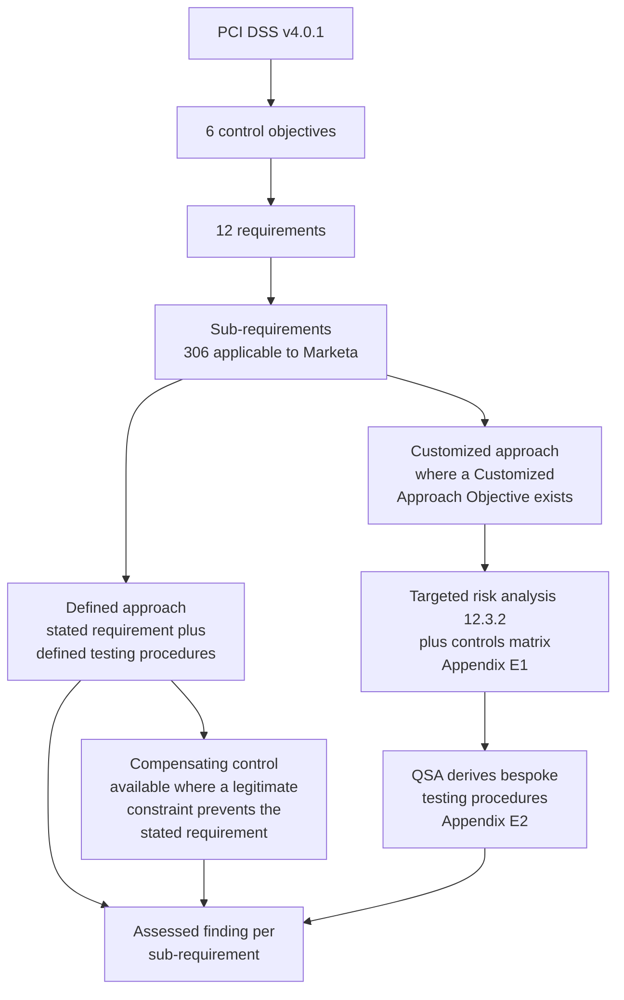
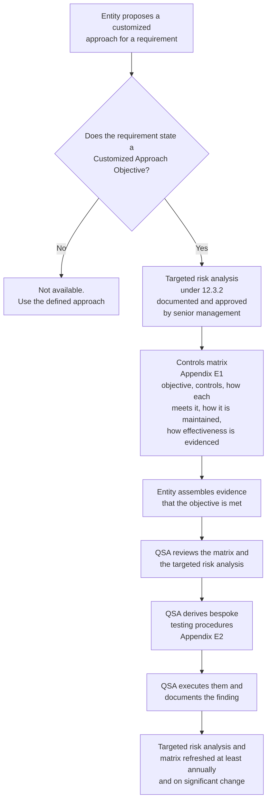

# 01.05 — PCI DSS v4.0.1 Requirements Overview

| Field | Value |
|---|---|
| Document ID | MRG-PCI-2026-105 |
| Program | Marketa Retail Group — PCI DSS v4.0.1 Compliance Program |
| Phase | 01 — Program Foundation &amp; PCI Governance |
| Version | 1.0 |
| Status | Approved |
| Owner | Naomi Bhatt, Chief Information Security Officer |
| Approver | Curtis Lang, Chief Information Officer |
| Date | 2026-07-15 |
| Classification | Confidential — Cardholder Data Environment // Illustrative Portfolio Sample |

## Purpose

This document sets out the architecture of PCI DSS v4.0.1 — its **6 control objectives and 12 requirements**, how sub-requirements and testing procedures are organised, and what each of the twelve requirements will mean for Marketa specifically. It then explains the two ways a requirement may be met: the **defined approach** and the **customized approach**. The second of these is the most misunderstood feature of v4, and the treatment here is deliberately detailed, because Marketa uses it exactly once and needs to be able to explain why once and not zero, and why once and not twenty.

## 1. The Architecture of the Standard

PCI DSS is organised as a hierarchy. Each level narrows from intent to testable fact.

| Level | What it is | Example |
|---|---|---|
| **Control objective** (6) | A thematic grouping of requirements | "Implement Strong Access Control Measures" |
| **Requirement** (12) | A top-level security requirement | Requirement 8 — Identify Users and Authenticate Access to System Components |
| **Sub-requirement** | The specific, testable obligation. Numbered x.y.z, sometimes to a fourth level | 8.3.6 — passwords a minimum of 12 characters with numeric and alphabetic characters |
| **Defined approach testing procedures** | What the assessor must do to determine whether the sub-requirement is met — examine, observe, interview, or a combination | 8.3.6.a — examine system configuration settings to verify password parameters are set per the requirement |
| **Applicability notes** | Constraints, exclusions, and effective dates | Notes identifying which requirements were future-dated to 31 March 2025 |
| **Customized Approach Objective** | The outcome the requirement exists to achieve, stated separately so it can be met another way — **where one is provided** | 8.3.9 — "Access by user accounts cannot be compromised via the use of a known or guessed password" |
| **Guidance** | Purpose, good practice, definitions, further information. **Not testable** | Explanation of why 12-character passwords are specified |

Every one of the twelve requirements also carries two administrative sub-requirements introduced in v4:

| Sub-requirement pattern | Obligation |
|---|---|
| **x.1.1** | Security policies and operational procedures identified in the requirement are documented, kept up to date, in use, and known to all affected parties |
| **x.1.2** | **Roles and responsibilities** for performing the activities in the requirement are documented, assigned and understood |

These twenty-four sub-requirements are easy to overlook and are a common source of findings. A control can be operating perfectly and still fail x.1.2 because nobody can name its owner. Marketa's response is the RACI in 01.07 and the twelve requirement-owner assignments recorded there.

## 2. The Six Control Objectives

| # | Control objective | Requirements | Marketa's principal exposure |
|---|---|---|---|
| 1 | Build and Maintain a Secure Network and Systems | 1, 2 | 9 network zones; segmentation between the store estate, corporate, cloud and the CDE |
| 2 | Protect Account Data | 3, 4 | Small, because P2PE and tokenization mean little account data is held — but the discovery work to prove it is large |
| 3 | Maintain a Vulnerability Management Program | 5, 6 | Authenticated scanning; payment-page script integrity; secure development for e-commerce |
| 4 | Implement Strong Access Control Measures | 7, 8, 9 | MFA for all CDE access; application and system accounts; POI device inspection at 1,914 terminals |
| 5 | Regularly Monitor and Test Networks | 10, 11 | Automated log review; segmentation testing; penetration testing; payment-page tamper detection |
| 6 | Maintain an Information Security Policy | 12 | Targeted risk analyses; TPSP governance; awareness across ~34,000 people plus 6,800 seasonal |

## 3. The Twelve Requirements at Marketa

The table below is the programme's working map. Each row states what the requirement covers, what it specifically means at Marketa given the channel architecture in 01.01, the accountable requirement owner, and the phase that delivers it.

| Req | Title | What it covers | What it means for Marketa | Requirement owner | Phase |
|---|---|---|---|---|---|
| **1** | Install and Maintain Network Security Controls | Network security controls between and within networks; configuration standards for them; documented network and data-flow diagrams; restriction of inbound and outbound traffic to the CDE | Nine network zones. Firewall and cloud security-group rule sets for the 8 CDE systems. Documented data-flow diagrams for all three channels. The store WAN carries only P2PE ciphertext — proving that is a Requirement 1 deliverable | Trevor Kim | 03, 04 |
| **2** | Apply Secure Configurations to All System Components | Vendor defaults changed or disabled; configuration standards addressing known vulnerabilities; management of wireless environment defaults | Hardening standards for the 71 assessed components across Windows, Linux, network gear and AWS. Store wireless — including guest Wi-Fi, which the first segmentation test proved was reachable to the store back-office VLAN | Trevor Kim | 04 |
| **3** | Protect Stored Account Data | Minimising storage; prohibition on storing sensitive authentication data after authorisation; masking on display; rendering PAN unreadable where stored; key management | The strongest position in the programme and the one that must be *proved*, not asserted. PAN discovery across all 1,842 systems, 41 network shares and 6 email archives. The 4 unexpected PAN locations found here. 3.4.2 controls on remote-access copy and relocation | Elena Marchetti | 02, 04 |
| **4** | Protect Cardholder Data with Strong Cryptography During Transmission Over Open, Public Networks | Strong cryptography and security protocols in transit; inventory of trusted keys and certificates; no unprotected PAN over end-user messaging | TLS configuration for the e-commerce tier and the corporate CDE. Certificate inventory. The prohibition on PAN in email and messaging — which the store manager's emailed spreadsheet (34 records) breached before discovery | Sonia Rendell / Trevor Kim | 04 |
| **5** | Protect All Systems and Networks from Malicious Software | Anti-malware on systems commonly affected; keeping it current and active; **5.3.3** removable media scanning; **5.4.1** automated anti-phishing mechanisms | EDR across the 71 assessed components. Removable-media controls in the four distribution centres and store back-offices. Email security controls satisfying 5.4.1 beyond training alone | Marcus Hale | 04 |
| **6** | Develop and Maintain Secure Systems and Software | Secure development; identification and ranking of vulnerabilities; patch management; change control; public-facing web application protection; **6.4.3** payment-page script management | The e-commerce platform's SDLC. WAF or equivalent for public-facing applications under 6.4.2. **6.4.3**: inventory and integrity assurance for 38 scripts across 6 templates, 11 third-party — 3 unauthorised at first inventory | Sonia Rendell | 04 |
| **7** | Restrict Access to System Components and Cardholder Data by Business Need to Know | Least privilege; role-based access; default deny; access to system components and data restricted by job function; **7.2.5** application and system account access; **7.2.5.1 / 7.2.4** periodic review | Role definitions for payment operations, chargebacks and settlement. Six-monthly user access review under 7.2.4 across the 8 CDE systems and the connected-to population | Elena Marchetti | 05 |
| **8** | Identify Users and Authenticate Access to System Components | Unique IDs; authentication factor management; **8.3.6** 12-character passwords; **8.3.9** password change frequency; **8.4.2** MFA for all CDE access; **8.5.1** MFA system requirements; **8.6.1–8.6.3** application and system accounts | The largest workstream. MFA for **all** access into the CDE, not just administrative and remote. 12-character minimum enterprise-wide. Service-account governance — where the second Not in Place finding sits (8.6.2, hard-coded credentials in 2 legacy batch integrations). The single customized approach lives here, at 8.3.9 | Trevor Kim | 05 |
| **9** | Restrict Physical Access to Cardholder Data | Physical access controls to facilities and to systems in the CDE; visitor management; media handling, distribution, storage and destruction; **9.5.1** protection of POI devices from tampering and substitution | Two dimensions. Columbus data centre and Ashburn co-location physical controls for the CDE. And, at very different scale, **9.5.1 across 1,914 POI terminals in 482 stores** — quarterly inspection, device inventory, personnel training. 6 seal discrepancies in Q3, all cleared as maintenance. Media destruction via Halberd Data Destruction | Adaeze Nwosu / Trevor Kim | 05 |
| **10** | Log and Monitor All Access to System Components and Cardholder Data | Audit logs for all system components; specified events and fields; protection of logs; time synchronisation; **10.4.1.1** automated log review; log retention (12 months, 3 months immediately available); failure detection under 10.7 | SIEM coverage of all 71 assessed components. Automated review replacing manual daily review. Critical security control failure detection and response under 10.7.2 and 10.7.3. Northbridge Managed Services provides after-hours monitoring under a documented responsibility matrix | Marcus Hale | 06 |
| **11** | Test Security of Systems and Networks Regularly | Wireless access point detection; internal and external vulnerability scanning; penetration testing; segmentation testing; intrusion detection; change-detection on critical files; **11.6.1** payment-page change and tamper detection | Quarterly ASV scans (Sable Ridge Scanning Services). Quarterly internal scans including **authenticated** scanning under 11.3.1.2 — incomplete on 9 of 71 components, the first Not in Place finding. Segmentation and application penetration testing by Ironwood Security Labs. FIM. **11.6.1** payment-page monitoring, live from August 2026, alerting within 24 hours | Marcus Hale / Sonia Rendell | 06 |
| **12** | Support Information Security with Organizational Policies and Programs | The information security policy; **12.3.1** targeted risk analyses; **12.5.2** scope confirmation; security awareness (12.6); personnel screening; **12.8** TPSP management; **12.9** service-provider duties; **12.10** incident response, including **12.10.7** PAN found where unexpected | The governance spine. 14 targeted risk analyses. Annual scope confirmation — the requirement that governs Phase 02. Awareness training reaching 97.1% of ~34,000 staff plus seasonal workers. TPSP governance for Truvance, Cadence, Verition and Northbridge. Incident response, exercised for real against 4 unexpected PAN locations | Naomi Bhatt / Owen Castellanos | 02, 07 |

### The appendices

| Appendix | Subject | Applicable to Marketa? |
|---|---|---|
| **A1** | Additional requirements for multi-tenant service providers | No — Marketa is a merchant, not a service provider |
| **A2** | Additional requirements for entities using SSL or early TLS for card-present POI terminal connections | No — the P2PE solution uses current protocols throughout; confirmed with Verition |
| **A3** | Designated Entities Supplemental Validation (DESV) | No — applies only where a brand or acquirer designates the entity. Cardinal has made no such designation |

## 4. Applicability at Marketa

| Category | Count | Notes |
|---|---|---|
| Sub-requirements applicable to a Level 1 merchant of this shape | **306** | The assessed population |
| Assessed **Not Applicable** | 4 | Documented with rationale in the ROC — service-provider-only requirements and requirements addressing technologies Marketa does not use |
| Assessed **In Place** at first assessment | 297 | — |
| Assessed **In Place with Compensating Control** | 3 | One Compensating Controls Worksheet each |
| Assessed **Not in Place** at first assessment | 2 | 11.3.1.2 and 8.6.2, both with dated remediation plans |
| Assessed **Not Tested** | 0 | Marketa's standing position: nothing in scope goes untested |
| Requirements met by **customized approach** | **1** | 8.3.9 |

A "Not Tested" finding is permitted by the standard and is sometimes appropriate. Marketa's programme charter forbids it, on the grounds that a merchant who cannot test a requirement cannot claim to rely on it. Recorded as ADR-0004.

## 5. The Defined Approach

The defined approach is what most people mean when they say "PCI DSS." The entity implements the requirement as stated; the assessor executes the defined testing procedures published alongside it and records a finding.

| Element | Description |
|---|---|
| What the entity does | Implements the stated requirement |
| What the assessor does | Executes the defined testing procedures — examine, observe, interview, inspect — as published |
| Documentation burden | Normal evidence: configurations, records, policies, screenshots, interview notes |
| Where flexibility exists | In *how* the control is built, not in *what outcome must be demonstrated* |
| Fallback when the requirement cannot be met as stated | **Compensating controls** |

### Compensating controls

A compensating control is available under the defined approach when an entity **cannot** meet a requirement as stated due to a legitimate technical or documented business constraint, but has mitigated the risk sufficiently by other means. Each compensating control requires a **Compensating Controls Worksheet** recording the constraint, the objective of the original requirement, the identified risk, the definition of the compensating control, its validation, and how it is maintained.

The bar is deliberately high:

| Test | Requirement |
|---|---|
| Constraint | A legitimate technical or documented business constraint must exist — not cost, and not inconvenience |
| Objective | The compensating control must meet the intent and rigour of the original requirement |
| Risk | It must address the additional risk imposed by not meeting the requirement as stated |
| "Above and beyond" | It must go beyond other PCI DSS requirements already in force — an existing control cannot be reused as a compensating control for a different requirement |
| Duration | Reassessed annually; not a permanent state |

Marketa has **three** compensating controls at first assessment, each documented on its own worksheet and each reviewed by Grant Whitfield. They are set out in Phase 08.

## 6. The Customized Approach

The customized approach is the headline structural change in v4. It allows an entity to meet a requirement's **Customized Approach Objective** by means other than those the stated requirement describes.

| Element | Description |
|---|---|
| What it is for | Entities with mature, risk-based security programmes that achieve a requirement's objective by an innovative or non-standard means |
| What it is **not** for | Avoiding a requirement that is merely inconvenient, expensive or unfamiliar. It is not a lighter path — it is a different and generally heavier one |
| Availability | **Only where the standard states a Customized Approach Objective for that requirement.** Some requirements state explicitly that they are not eligible — typically those that are themselves documentation, governance or process obligations, where "meeting the objective differently" has no meaning |
| Combination with compensating controls | Not permitted for the same requirement. An entity uses the defined approach (with or without a compensating control) **or** the customized approach for a given requirement — never both |
| Who designs the testing | **The QSA**, not the entity. The assessor derives and documents bespoke testing procedures for the customized implementation |
| Applicability of SAQs | Entities validating by SAQ cannot use the customized approach; it requires an assessor's involvement |

### What the customized approach demands

| Artefact | Content | Owner |
|---|---|---|
| **Targeted risk analysis (12.3.2)** | Identification of the assets being protected, the threats the requirement addresses, the likelihood and impact of the threat materialising if the requirement is not met as stated, and how the proposed controls address it. Reviewed and approved by senior management | Assessed entity |
| **Controls matrix (Appendix E1)** | For the requirement: the Customized Approach Objective; the controls implemented; how each control meets the objective; how the control is maintained; how its effectiveness is measured and evidenced | Assessed entity |
| **Bespoke testing procedures (Appendix E2)** | Testing procedures the assessor derives specifically for this implementation, documented in the ROC alongside the finding | **QSA** |
| **Annual refresh** | Targeted risk analysis reviewed at least every 12 months and on significant change | Assessed entity |

### Why most entities never use it

| Reason | Explanation |
|---|---|
| It is more work, not less | The entity produces a targeted risk analysis and a controls matrix in addition to the evidence it would have produced anyway |
| The QSA must be willing and able | Deriving defensible bespoke testing procedures requires assessor expertise and appetite. Not every QSA company will |
| It attracts scrutiny | Acquirers and brands look harder at a customized approach than at a defined one. It must survive questions from parties who were not in the room |
| It has to be maintained | The matrix and the risk analysis are living documents refreshed annually; drift produces a finding next year |
| The defined approach usually works | For most requirements, implementing the stated control is simply cheaper than justifying an alternative |
| It cannot be combined with compensating controls | If the alternative turns out to fall short, there is no second fallback within the same requirement |

The honest framing Marketa's Steering Committee adopted: **the customized approach is a tool for the small number of cases where the defined requirement demonstrably works against the security outcome it exists to produce.** Everywhere else, it is a way of turning a solved problem into an unsolved one.

## 7. Marketa's Single Customized Approach — 8.3.9

Requirement **8.3.9** governs the change frequency of passwords where a password is the only authentication factor for user access. The defined approach requires either a change at least once every 90 days, or dynamic analysis of the security posture of accounts with real-time determination of access.

Marketa's position:

| Element | Position |
|---|---|
| Where 8.3.9 applies at Marketa | Requirement 8.4.2 mandates MFA for **all** access into the CDE, so the 8 CDE systems are not the issue. 8.3.9 bites on the in-scope population where a password remains the sole factor — chiefly a defined set of accounts on connected-to and security-impacting systems, including vendor-managed appliances where MFA cannot be delivered |
| Why not the 90-day rotation | Forced periodic rotation across this population produced measurably weaker credentials — predictable increments, reuse, and a rise in help-desk resets that itself created a social-engineering surface. The control was working against its own objective |
| Why not the second defined-approach option as stated | Marketa's analytics inform and can terminate sessions, but do not in every case make the real-time, automatic access determination for every account in the population that the defined-approach wording contemplates. Rather than stretch the defined approach to fit, the programme elected the customized approach and let the QSA test the outcome directly |
| **Customized Approach Objective to be met** | That access by user accounts cannot be compromised through use of a known or guessed password |
| How Marketa meets it | Continuous behavioural authentication analytics: per-account baselining of logon patterns, device, network origin and session behaviour; risk scoring on every authentication event; automatic step-up or session termination on anomaly; enforcement of a 12-character minimum under 8.3.6; screening against known-compromised credential corpora; and monitored, alerting detection of credential-stuffing and spray patterns |
| Artefacts produced | Targeted risk analysis under 12.3.2 (one of 14); controls matrix on the Appendix E1 template; evidence of effectiveness over the assessment window |
| Assessor role | Grant Whitfield derived and documented bespoke testing procedures under Appendix E2 and executed them during fieldwork |
| Outcome | Assessed **In Place** via the customized approach |
| Maintenance | Targeted risk analysis and controls matrix refreshed at least annually; ownership with Trevor Kim, approval by Naomi Bhatt |

This is the whole of Marketa's customized-approach usage. Every other one of the 306 applicable sub-requirements is assessed under the defined approach, three of them with compensating controls.

## 8. Defined, Compensating, Customized — the Distinction

| Dimension | Defined approach | Defined approach with compensating control | Customized approach |
|---|---|---|---|
| Trigger | Normal case | Entity **cannot** meet the stated requirement due to a legitimate constraint | Entity **chooses** to meet the objective differently |
| Precondition | None | Documented technical or business constraint | The requirement states a Customized Approach Objective |
| What is tested | The stated requirement | The compensating control, against the intent and rigour of the original | The Customized Approach Objective |
| Testing procedures | Published in the standard | Published, plus assessor review of the worksheet | **Derived by the QSA** for this implementation |
| Entity documentation | Standard evidence | **Compensating Controls Worksheet** | **Targeted risk analysis (12.3.2)** + **controls matrix (Appendix E1)** |
| Can be combined with the other | — | Not with a customized approach for the same requirement | Not with a compensating control for the same requirement |
| Available on an SAQ | Yes | Yes | No |
| Marketa's usage | 302 sub-requirements | 3 | 1 (8.3.9) |

## 9. Requirement-to-Phase Delivery Map

| Requirement | 02 Scoping | 03 Segmentation | 04 Secure systems | 05 Access &amp; physical | 06 Monitoring &amp; third parties | 07 Policy, risk, IR | 08 Assessment |
|---|---|---|---|---|---|---|---|
| 1 — Network security controls | Input | **Primary** | Supporting | — | — | — | Assessed |
| 2 — Secure configurations | Input | Supporting | **Primary** | — | — | — | Assessed |
| 3 — Protect stored account data | **Primary** | — | **Primary** | — | — | Supporting | Assessed |
| 4 — Cryptography in transit | Input | Supporting | **Primary** | — | — | — | Assessed |
| 5 — Malicious software | — | — | **Primary** | — | Supporting | — | Assessed |
| 6 — Secure systems and software | Input | — | **Primary** | — | Supporting | — | Assessed |
| 7 — Need-to-know access | Input | — | — | **Primary** | — | — | Assessed |
| 8 — Identify and authenticate | — | — | — | **Primary** | — | Supporting | Assessed |
| 9 — Physical access and POI | Input | — | — | **Primary** | — | — | Assessed |
| 10 — Log and monitor | — | Supporting | — | — | **Primary** | — | Assessed |
| 11 — Test regularly | Input | **Primary** (segmentation test) | — | — | **Primary** | — | Assessed |
| 12 — Policy and programme | **Primary** (12.5.2) | — | — | — | **Primary** (12.8, 12.9) | **Primary** | Assessed |

## Cross-References

| Reference | Relevance |
|---|---|
| 01.02 — PCI DSS Landscape &amp; v4.0.1 | The future-dated requirements now in force |
| 01.03 — Merchant Level Determination &amp; Validation | Why a ROC covers all 306 applicable sub-requirements |
| 01.06 — Program Charter &amp; Objectives | Objectives mapped to these requirements |
| 01.07 — Roles, Responsibilities &amp; RACI | The twelve requirement owners named here |
| Phase 02 — CDE Scoping | 12.5.2 and the Requirement 3 discovery work |
| Phase 05 — Access Control &amp; Physical Security | Requirements 7, 8, 9 including the 8.3.9 customized approach |
| Phase 08 — QSA Assessment &amp; ROC Production | Findings, worksheets and the Appendix E artefacts |

---
[⬅ Previous](01.04-acquirer-and-card-brand-obligations.md) · [🏠 Phase 01 Home](01.00-README.md) · [Next ➡](01.06-program-charter-and-objectives.md)
