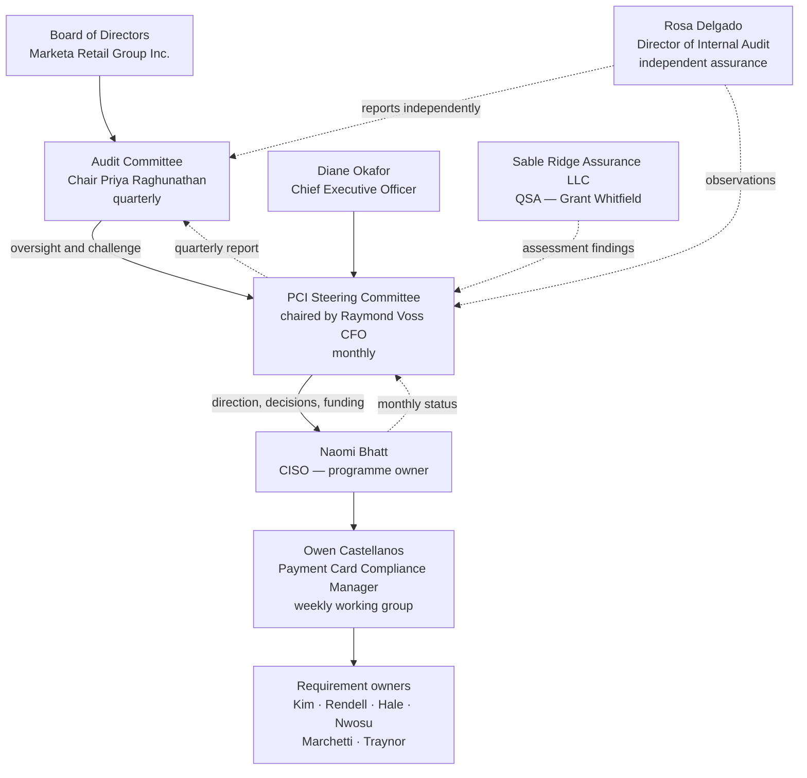
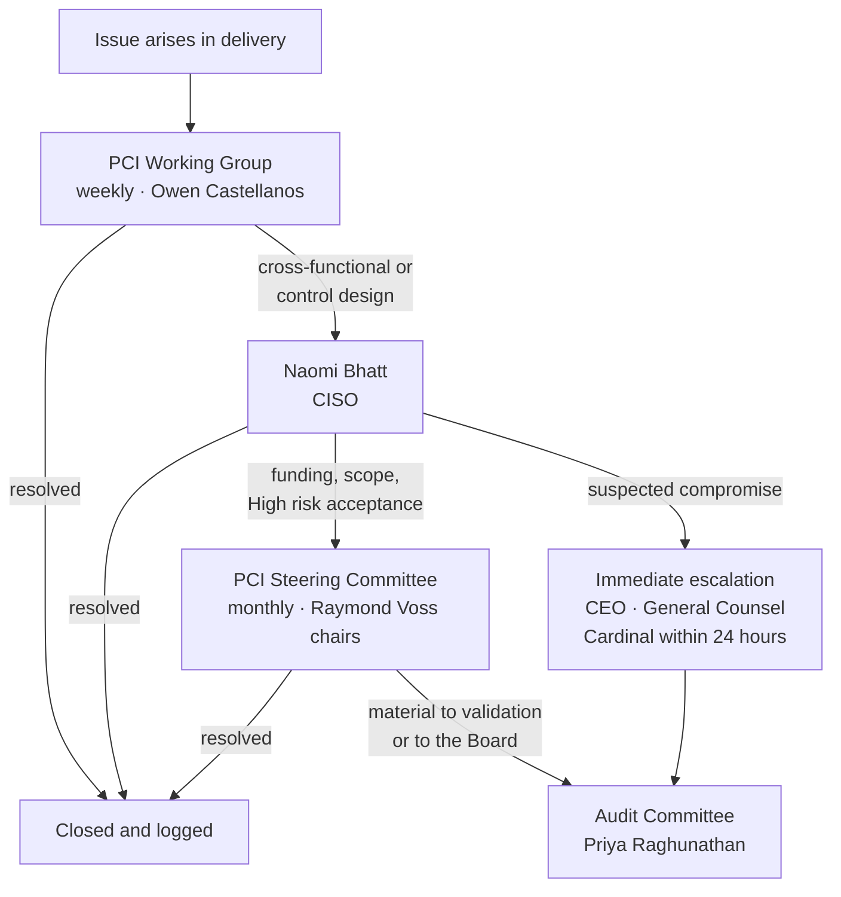

# 01.06 — Program Charter &amp; Objectives

| Field | Value |
|---|---|
| Document ID | MRG-PCI-2026-106 |
| Program | Marketa Retail Group — PCI DSS v4.0.1 Compliance Program |
| Phase | 01 — Program Foundation &amp; PCI Governance |
| Version | 1.0 |
| Status | Approved |
| Owner | Naomi Bhatt, Chief Information Security Officer |
| Approver | Raymond Voss, Chief Financial Officer (Executive Sponsor) |
| Date | 2026-07-15 |
| Classification | Confidential — Cardholder Data Environment // Illustrative Portfolio Sample |

## Purpose

This is the founding charter of the Marketa Retail Group PCI DSS v4.0.1 Compliance Program. It records the mandate, the sponsor, the programme owner, the objectives and how each is measured, the nine-phase structure, what is in and out of scope, the budget and resourcing, decision rights and escalation, the governance forums and their cadence, and the definition of done.

The charter is the authority under which every subsequent phase operates. Where a later document conflicts with it, the charter governs until amended by the PCI Steering Committee.

## 1. Mandate

Marketa Retail Group accepts payment cards through three channels and processes approximately **68.4 million card transactions annually**. It is a **Level 1 merchant** for Visa, Mastercard, American Express and Discover, and is contractually bound to PCI DSS through its merchant agreement with **Cardinal Merchant Bank, N.A.**

Marketa validated as compliant under PCI DSS v3.2.1 in 2023 and 2024. Version 3.2.1 retired on **31 March 2024**, and the fifty-one future-dated requirements of v4 became mandatory on **31 March 2025**. The 2026 assessment is therefore Marketa's **first under PCI DSS v4.0.1 and the first with the full v4 obligation set in force**.

This programme is chartered to reach and sustain that standard.

| Element | Position |
|---|---|
| Chartered by | Diane Okafor, Chief Executive Officer, on the recommendation of the Chief Financial Officer |
| **Executive sponsor** | **Raymond Voss, Chief Financial Officer** — owns the Cardinal Merchant Bank relationship and signs the AOC |
| **Programme owner** | **Naomi Bhatt, Chief Information Security Officer** — accountable for delivery and for the security outcome |
| Programme manager | Owen Castellanos, Payment Card Compliance Manager — day-to-day management, reporting to Naomi Bhatt |
| Business owner of the CDE | Elena Marchetti, VP Payment Operations |
| Board oversight | Audit Committee of the Board, chaired by **Priya Raghunathan** |
| Independent assurance | Rosa Delgado, Director of Internal Audit — reports to the Audit Committee |
| Duration | Approximately 12 months; kickoff **2026-01-12** |
| Authority basis | The Marketa–Cardinal merchant agreement; the card brands' operating rules; PCI DSS v4.0.1 Requirement 12 |

## 2. Mission

To protect the payment card data of Marketa's customers by maintaining a cardholder data environment that is **as small as the business permits, as well controlled as the standard requires, and continuously evidenced** — and to demonstrate that state to Cardinal Merchant Bank and the card brands through an annual Level 1 assessment producing a Report on Compliance and an Attestation of Compliance under PCI DSS v4.0.1.

Three principles follow from that sentence and shape every decision in the programme.

| Principle | What it means in practice |
|---|---|
| **Scope reduction before control implementation** | The cheapest control is the one that is not needed because the system holds no account data. Phase 02 runs before Phases 04–07 for this reason, not for convenience |
| **Continuous compliance, evidenced annually** | The AOC is a by-product of a programme that runs all year, not the objective of a programme that runs in November |
| **Honest findings over convenient ones** | A failed segmentation test found in May is a success. The same hole found by an attacker in November is not. The programme is structured to surface bad news early and treat it as output, not failure |

## 3. Objectives and Success Criteria

Every objective carries a measurable criterion. "Improved," "enhanced" and "strengthened" are not acceptable success criteria in this programme.

| # | Objective | Measurable success criterion | Owner | Primary phase |
|---|---|---|---|---|
| **O1** | Establish programme governance, roles and the regulatory position | Charter approved; PCI Steering Committee constituted and meeting; twelve requirement owners named; Audit Committee reporting line live | Naomi Bhatt | 01 |
| **O2** | Define and minimise the cardholder data environment | Scope documented and confirmed under 12.5.2; PAN discovery across **100% of 1,842 systems** plus 41 network shares and 6 email archives; scope reduced from **604 believed in scope to 71 assessed components (−88.2%)**; all unexpected PAN remediated | Elena Marchetti | 02 |
| **O3** | Design and prove network segmentation | **9 network zones** documented; segmentation validated by penetration test; **a passing segmentation test on re-test after the initial test failed** | Trevor Kim | 03 |
| **O4** | Implement Requirements 1–6 controls | Configuration standards live on all 71 components; 6.4.3 script inventory complete (**38 scripts, 6 templates, 11 third-party**) with all unauthorised scripts removed; 5.3.3 and 5.4.1 mechanisms operating | Trevor Kim / Sonia Rendell | 04 |
| **O5** | Implement Requirements 7–9 controls | **MFA on all access into the CDE (8.4.2)**; 12-character minimum enforced (8.3.6); application and system account governance (8.6.1–8.6.3); quarterly 9.5.1 inspection cycle operating across **1,914 terminals** | Trevor Kim / Adaeze Nwosu | 05 |
| **O6** | Implement Requirements 10–11 and govern third parties | Automated log review under 10.4.1.1; **4 passing quarterly ASV scans**; internal, external and segmentation penetration testing complete with all findings remediated and retested; 11.6.1 payment-page monitoring alerting within 24 hours; TPSP governance under 12.8 for all four providers | Marcus Hale | 06 |
| **O7** | Establish policy, risk management and incident response | Policy suite approved under 12.1; **14 targeted risk analyses** under 12.3.1; **44 risks** registered and treated; 12.10.7 procedures for unexpected PAN in force and exercised; awareness completion **≥ 95%** | Naomi Bhatt | 07 |
| **O8** | Complete the QSA assessment and produce the ROC and AOC | Fieldwork completed **2026-11-02 to 2026-11-20**; ROC and AOC issued **2026-12-11**; every finding assigned a named owner and a date; **re-assessment achieving full compliance 2027-02-18** | Owen Castellanos | 08 |
| **O9** | Report to leadership and sustain compliance | Board and Audit Committee report delivered **2026-12-17**; continuous-compliance calendar operating; risk profile at close **0 High · 13 Moderate · 31 Low**; ≤ 12 open items each with owner and date | Naomi Bhatt | 09 |

```mermaid
flowchart LR
    M["Mission<br/>small CDE, strong controls,<br/>continuous evidence"] --> P1["Phase 01<br/>Governance<br/>and charter"]
    P1 --> P2["Phase 02<br/>Scoping and<br/>CHD discovery"]
    P2 --> P3["Phase 03<br/>Segmentation<br/>architecture"]
    P3 --> P4["Phase 04<br/>Build and maintain<br/>secure systems"]
    P4 --> P5["Phase 05<br/>Access control and<br/>physical security"]
    P5 --> P6["Phase 06<br/>Monitoring, testing<br/>and third parties"]
    P6 --> P7["Phase 07<br/>Policy, risk and<br/>incident response"]
    P7 --> P8["Phase 08<br/>QSA assessment<br/>and ROC"]
    P8 --> P9["Phase 09<br/>Executive reporting and<br/>continuous compliance"]
    P9 -.->|"annual scope reconfirmation<br/>under 12.5.2"| P2
```

## 4. The Nine-Phase Structure

| Phase | Name | Principal output | Key dates |
|---|---|---|---|
| **01** | Program Foundation &amp; PCI Governance | Charter, governance, roles, regulatory position | Kickoff 2026-01-12 |
| **02** | CDE Scoping &amp; Cardholder Data Discovery | Documented scope under 12.5.2; PAN discovery results; 604 → 71 | Complete 2026-02 |
| **03** | Network Segmentation Architecture | 9-zone design; segmentation controls; segmentation test | Design 2026-03; test failed 2026-05, passed 2026-06 |
| **04** | Build &amp; Maintain Secure Systems | Requirements 1–6 controls; 6.4.3 script inventory | 2026-04 → 2026-07; scripts 2026-08 |
| **05** | Access Control &amp; Physical Security | Requirements 7–9 controls; MFA; 9.5.1 programme | 2026-04 → 2026-07 |
| **06** | Monitoring, Testing &amp; Third Parties | Requirements 10–11; ASV; penetration testing; 12.8 governance | Application pen test 2026-09 |
| **07** | Security Policy, Risk &amp; Incident Response | Policy suite; 14 targeted risk analyses; 44-risk register; IR incl. 12.10.7 | 2026-04 → 2026-10 |
| **08** | QSA Assessment &amp; ROC Production | ROC and AOC; findings and remediation; re-assessment | Fieldwork 2026-11-02 → 11-20; issued 2026-12-11; re-assessed 2027-02-18 |
| **09** | Executive Reporting &amp; Continuous Compliance | Board report; continuous-compliance calendar; programme close | Board report 2026-12-17 |

Internal audit's independent review by Rosa Delgado sits between Phases 07 and 08, in October 2026, producing **7 recommendations, none Critical** — deliberately scheduled before QSA fieldwork so that its findings can be acted on rather than merely noted.

## 5. Scope of the Programme

### In scope

| Item | Detail |
|---|---|
| The cardholder data environment | The **8 systems** supporting payment operations, chargebacks, settlement reconciliation and refunds, in the Columbus data centre and AWS |
| Connected-to and security-impacting systems | **63 systems** — Active Directory, SIEM, jump hosts, patching, EDR console, backup, vulnerability scanner |
| **Total assessed system components** | **71** |
| All three payment acceptance channels | Card-present (1,914 lanes, 482 stores), e-commerce (hosted iframe), MOTO (310 agents) |
| POI devices | **1,914 terminals** for 9.5.1 device inspection, inventory and personnel training, and PIM adherence |
| E-commerce payment pages | **6 templates**, **38 scripts** — in scope for 6.4.3 and 11.6.1 notwithstanding that PAN never reaches a Marketa server |
| The telephony payment path | Cadence Voice Solutions media path and the secure payment session mechanism |
| Network segmentation controls | **9 zones**, and the controls that isolate them — subject to penetration testing under 11.4.5 |
| Third-party service providers | Truvance Payments, Cadence Voice Solutions, Verition POS Systems, Northbridge Managed Services, Halberd Data Destruction |
| Workforce | ~34,000 staff plus up to 6,800 seasonal workers for awareness training under 12.6.3; screened populations under 12.7.1 |
| Enterprise estate for discovery purposes | **All 1,842 systems**, 41 network shares and 6 email archives — scanned to prove absence of PAN, not because all are in the CDE |

### Out of scope

| Item | Reason |
|---|---|
| The remainder of the 1,842-system estate after scoping | No account data; no connectivity to the CDE; no ability to affect its security. Proven in Phase 02, not assumed |
| POS lanes and store back-office systems as CDE components | P2PE removes the card-data path; **they remain in scope for segmentation validation and for 9.5.1**, which is a different thing from being in the CDE |
| Call-centre agent desktops | DTMF suppression means no PAN is presented, spoken, displayed or typed. In scope only insofar as they connect to in-scope systems |
| The tokenization vault and token-to-PAN mapping | Operated by Truvance Payments; assessed within Truvance's own service-provider assessment, evidenced to Marketa by AOC under 12.8.4 |
| The P2PE decryption environment and key management | Operated by Verition POS Systems within its validated P2PE solution |
| SOX, SEC and public-company obligations | **Marketa is privately held and not SEC-registered.** No such obligations exist |
| Determination of compliance with any statute | Legal obligations are advised on separately by the General Counsel. Nothing in this programme is a legal determination |
| PIN and PIN-block security beyond PCI DSS | Governed by the PCI PIN Security Requirements and the P2PE programme; Verition's responsibility |

## 6. Governance Structure

### The PCI Steering Committee

| Attribute | Detail |
|---|---|
| Purpose | Direct the programme, take decisions above the programme owner's authority, allocate funding, accept risk within delegated limits, and report to the Audit Committee |
| Chair | **Raymond Voss**, Chief Financial Officer (executive sponsor) |
| Secretary | Owen Castellanos, Payment Card Compliance Manager |
| Cadence | **Monthly**, with ad-hoc sessions on 24 hours' notice for material events |
| Quorum | The Chair or the CISO, plus four other members, of whom at least one must be from outside IT and Security |
| Standing agenda | Programme status against plan; requirement-level readiness; risk register movement; open findings and dates; TPSP status; decisions requested; escalations |
| Minutes | Recorded and retained in `governance/`; decisions logged in the programme decision log |

| Member | Role | Contribution |
|---|---|---|
| **Raymond Voss** | CFO — Chair, executive sponsor | Acquirer relationship; funding; AOC signature |
| **Naomi Bhatt** | CISO — programme owner | Delivery, security outcome, risk |
| **Curtis Lang** | CIO | IT delivery capacity; competing programme priorities |
| **Elena Marchetti** | VP Payment Operations | Business ownership of the CDE; operational impact |
| **Trevor Kim** | Director of Infrastructure &amp; Network | Requirements 1, 2, 7, 8 delivery |
| **Sonia Rendell** | Director of E-Commerce Engineering | Requirements 6.4.3 and 11.6.1; e-commerce change |
| **Marcus Hale** | Security Operations Manager | Requirements 10 and 11; monitoring and testing |
| **Adaeze Nwosu** | Director of Store Operations | 9.5.1 across 482 stores; store-level feasibility |
| **Bill Traynor** | Call Centre Operations Manager | MOTO channel; agent procedure |
| **Frank Mueller** | General Counsel | Contract, legal risk, TPSP agreements |
| **Owen Castellanos** | Payment Card Compliance Manager — Secretary | Programme management, reporting, evidence |
| **Rosa Delgado** | Director of Internal Audit | **Attends as observer.** Independent; does not vote and does not own remediation |

Rosa Delgado's observer status is deliberate. Internal Audit provides second-line and third-line assurance to the Audit Committee; participating in programme decisions would compromise the independence of the October review. She attends to be informed, not to steer.

### Reporting to the Audit Committee

| Attribute | Detail |
|---|---|
| Forum | Audit Committee of the Board, chaired by **Priya Raghunathan** |
| Cadence | **Quarterly**, plus an out-of-cycle report on any material event |
| Presented by | Raymond Voss (sponsor) and Naomi Bhatt (programme owner), jointly |
| Independent input | Rosa Delgado reports separately and directly, without management filtering |
| Standing content | Validation status and forecast; material risks and movement; open findings with dates; TPSP compliance status; incidents; funding variance; the assessment result when issued |
| Escalation trigger | Any event that could jeopardise the annual validation, any suspected account data compromise, or any decision to file a non-compliant AOC |
| 2026 milestone | Board and Audit Committee report delivered **2026-12-17**, six days after the ROC and AOC were issued |

### Other forums

| Forum | Cadence | Purpose |
|---|---|---|
| PCI Working Group | Weekly | Requirement owners and the programme manager; delivery, blockers, evidence readiness |
| Requirement owner one-to-ones | Fortnightly | Naomi Bhatt with each of the twelve requirement owners |
| QSA checkpoint | Monthly from 2026-03 | Sable Ridge Assurance interim review; early identification of evidence gaps |
| TPSP review | Quarterly | Truvance, Cadence, Verition, Northbridge — compliance status and responsibility matrices |
| Store operations readiness call | Monthly | Adaeze Nwosu with regional managers on 9.5.1 execution |

## 7. Decision Rights and Escalation

| Decision | Authority | Consulted | Escalates to |
|---|---|---|---|
| Scope determination — a system in or out of the CDE | Naomi Bhatt | Elena Marchetti, Trevor Kim, QSA | PCI Steering Committee |
| Technical control design | Requirement owner | Naomi Bhatt | Naomi Bhatt |
| Adoption of a compensating control | Naomi Bhatt | QSA, Elena Marchetti | PCI Steering Committee |
| Adoption of a customized approach | **PCI Steering Committee** | QSA, Naomi Bhatt, Frank Mueller | Audit Committee (informed) |
| Acceptance of a **Low or Moderate** residual risk | Naomi Bhatt | Risk owner | PCI Steering Committee (informed) |
| Acceptance of a **High** residual risk | **PCI Steering Committee** | Naomi Bhatt, Frank Mueller | Audit Committee |
| Funding variance up to 10% of phase budget | Owen Castellanos with Naomi Bhatt | Finance | PCI Steering Committee (informed) |
| Funding variance above 10% | **Raymond Voss** | Curtis Lang | Audit Committee if material |
| Engagement of a new third-party service provider | Elena Marchetti | Owen Castellanos, Frank Mueller, Naomi Bhatt | PCI Steering Committee; **Cardinal notified before engagement** |
| Signature of the AOC | **Raymond Voss** | Naomi Bhatt, Frank Mueller, QSA | Audit Committee (informed) |
| **Decision to file a non-compliant AOC** | **PCI Steering Committee**, endorsed by the CEO | QSA, Frank Mueller, Cardinal | **Audit Committee — mandatory** |
| Declaration of a suspected account data compromise | Naomi Bhatt | Marcus Hale, Frank Mueller | CEO and Audit Committee immediately; **Cardinal within 24 hours** |
| Change to this charter | PCI Steering Committee | All members | Audit Committee (informed) |

## 8. Budget and Resourcing

The programme is funded across fiscal years 2026 and 2027 with a total approved envelope of **$4.6 million**, comprising external assessment and testing fees, tooling, network build and internal labour.

| Category | Amount | Detail |
|---|---|---|
| QSA assessment — Sable Ridge Assurance | $385,000 | Annual assessment, interim checkpoints, ROC and AOC production, and the February 2027 re-assessment |
| ASV scanning — Sable Ridge Scanning Services | $28,000 | Four quarterly scans plus rescans |
| Penetration testing — Ironwood Security Labs | $165,000 | Segmentation test, segmentation re-test, application test, and retest of remediated findings |
| Security tooling | $1,240,000 | Payment-page integrity monitoring, PAN discovery, file integrity monitoring, SIEM automated review capability, secrets management, email security for 5.4.1 |
| Network segmentation build | $890,000 | 9-zone design and implementation; store WAN and cloud changes; remediation of the failed segmentation test |
| Internal labour | $1,610,000 | 11.4 FTE-equivalents across security, infrastructure, e-commerce engineering, store operations and payment operations |
| Awareness and training | $95,000 | 12.6.3 delivery across ~34,000 staff plus seasonal workers; 9.5.1 store training materials |
| Contingency | $187,000 | ~4% of the external and capital lines |
| **Total** | **$4,600,000** | Approved by Raymond Voss; variance authority per §7 |

| Resource | Commitment | Note |
|---|---|---|
| Payment Card Compliance Manager | 1.0 FTE dedicated | Owen Castellanos |
| CISO | ~0.3 FTE | Naomi Bhatt |
| Infrastructure and network | ~3.2 FTE-equivalents | Peak during Phases 03–05 |
| Security operations | ~2.4 FTE-equivalents | Peak during Phase 06 |
| E-commerce engineering | ~1.8 FTE-equivalents | Concentrated on 6.4.3 and 11.6.1 |
| Store operations | ~1.5 FTE-equivalents | Distributed across 482 stores for 9.5.1 |
| Payment operations | ~1.2 FTE-equivalents | Elena Marchetti's team, evidence and process |
| Internal audit | ~0.4 FTE | Rosa Delgado, October review; funded outside the programme envelope to preserve independence |

## 9. Definition of Done

The programme is complete when **all** of the following are true. Partial satisfaction is not completion.

| # | Criterion | Evidence |
|---|---|---|
| D1 | Scope documented and confirmed under 12.5.2, with 71 assessed components substantiated | Phase 02 scope document, accepted by the QSA |
| D2 | Segmentation implemented and **proved by a passing penetration test** | Ironwood segmentation re-test report, June 2026 |
| D3 | All 306 applicable sub-requirements assessed, with **zero Not Tested** | ROC |
| D4 | Four passing quarterly ASV scans for the compliance year | ASV attestations |
| D5 | Internal, external and segmentation penetration testing complete, all 19 findings remediated and retested | Ironwood reports and retest evidence |
| D6 | 6.4.3 script inventory complete and 11.6.1 monitoring operating with alerting inside 24 hours | Script inventory; monitoring evidence |
| D7 | 14 targeted risk analyses complete and approved | Phase 07 register |
| D8 | 44 risks registered and treated; **0 High at close** | Risk register, Phase 09 |
| D9 | Awareness training completion **≥ 95%** | Training records — achieved 97.1% |
| D10 | TPSP governance complete under 12.8 for all providers, with responsibility matrices under 12.8.5 | TPSP register and matrices |
| D11 | ROC and AOC issued and filed with Cardinal Merchant Bank | 2026-12-11 filing |
| D12 | **Full compliance achieved** — every Not in Place finding remediated and re-assessed | Revised ROC and AOC, 2027-02-18 |
| D13 | Board and Audit Committee report delivered | 2026-12-17 |
| D14 | Continuous-compliance calendar operating, with ≤ 12 open items each carrying a named owner and a date | Phase 09 handover — 11 open items at close |

## 10. Assumptions, Constraints and Charter Approval

| Type | Statement |
|---|---|
| Assumption | Cardinal Merchant Bank's Level 1 determination and 31 December deadline remain unchanged during the engagement |
| Assumption | Truvance Payments and Cadence Voice Solutions maintain Level 1 service-provider validation and supply current AOCs |
| Assumption | Verition's P2PE solution remains listed by the Council throughout the compliance year |
| Constraint | **Seasonal change freeze, October to January.** No change to store systems during peak trading. This is why control implementation runs April to July and fieldwork is scheduled for early November |
| Constraint | Nine of the 71 components are vendor-managed appliances on which Marketa cannot install an authenticated scanning agent without vendor support — the direct cause of the 11.3.1.2 finding |
| Constraint | Store colleague turnover and the 6,800-person seasonal intake make 100% training completion unattainable; 95% is the charter threshold |
| Constraint | Marketa has no pre-existing external control-attestation programme to draw evidence from; every piece of control evidence must be produced by this programme |

> **Approval.** This charter is owned by Naomi Bhatt, Chief Information Security Officer, sponsored and approved by Raymond Voss, Chief Financial Officer, chartered by Diane Okafor, Chief Executive Officer, and reported to the Audit Committee of the Board (Chair: Priya Raghunathan). It is reviewed at least annually, and on any material change to the payment channels, the cardholder data environment, the acquirer relationship, or the standard.

## Cross-References

| Reference | Relevance |
|---|---|
| 01.01 — Company Profile &amp; Payment Channels | The estate and channels the charter covers |
| 01.03 — Merchant Level Determination &amp; Validation | The Level 1 obligations the charter discharges |
| 01.04 — Acquirer &amp; Card Brand Obligations | Cardinal's deadlines that drive the schedule |
| 01.05 — PCI DSS v4 Requirements Overview | The requirements the objectives deliver |
| 01.07 — Roles, Responsibilities &amp; RACI | Execution accountability under this charter |
| Phase 02 — CDE Scoping | Objective O2, the highest-leverage phase |
| Phase 08 — QSA Assessment &amp; ROC Production | Objective O8 |
| Phase 09 — Executive Reporting &amp; Continuous Compliance | Objective O9 and the definition of done |

---
[⬅ Previous](01.05-pci-dss-v4-requirements-overview.md) · [🏠 Phase 01 Home](01.00-README.md) · [Next ➡](01.07-roles-responsibilities-and-raci.md)
