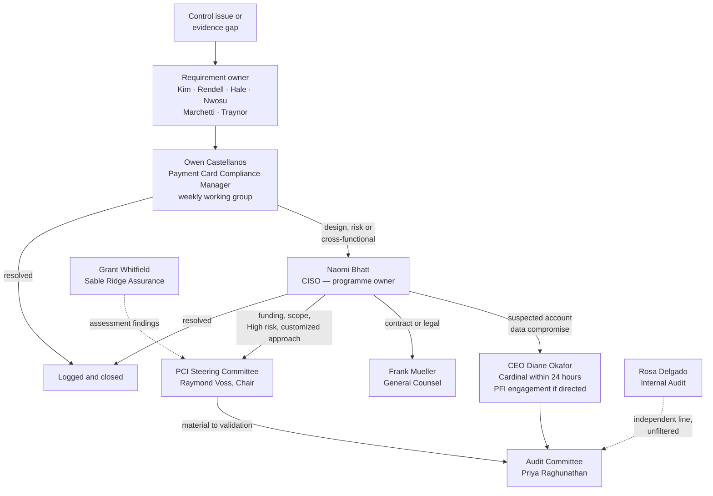

# 01.07 — Roles, Responsibilities &amp; RACI

| Field | Value |
|---|---|
| Document ID | MRG-PCI-2026-107 |
| Program | Marketa Retail Group — PCI DSS v4.0.1 Compliance Program |
| Phase | 01 — Program Foundation &amp; PCI Governance |
| Version | 1.0 |
| Status | Approved |
| Owner | Naomi Bhatt, Chief Information Security Officer |
| Approver | Raymond Voss, Chief Financial Officer (Executive Sponsor) |
| Date | 2026-07-15 |
| Classification | Confidential — Cardholder Data Environment // Illustrative Portfolio Sample |

## Purpose

PCI DSS v4.0.1 places an explicit obligation on the assessed entity, in every one of its twelve requirements, to document, assign and communicate **roles and responsibilities** for the activities that requirement covers (sub-requirement x.1.2). This document discharges that obligation for the programme as a whole. It names every internal role and what it owns, assigns each of the twelve requirements to an accountable owner, sets out a RACI matrix across the major activities of all nine phases, and defines the boundary between Marketa and the external parties — most importantly, the boundary with the Qualified Security Assessor.

## 1. Internal Roles

| Role | Individual | Core accountability in this programme |
|---|---|---|
| Chief Executive Officer | **Diane Okafor** | Charters the programme; accountable to the Board for the Company's payment security posture |
| Chief Financial Officer — **Executive Sponsor** | **Raymond Voss** | Owns the Cardinal Merchant Bank relationship; chairs the PCI Steering Committee; signs the Attestation of Compliance; approves funding |
| Chief Information Security Officer — **Programme Owner** | **Naomi Bhatt** | Accountable for delivery and for the security outcome; owns the risk register, the policy suite and the targeted risk analyses; approves compensating controls |
| Chief Information Officer | **Curtis Lang** | Provides IT delivery capacity; arbitrates between this programme and competing IT priorities; accountable for platform change |
| VP Payment Operations | **Elena Marchetti** | Business owner of the cardholder data environment; owns Requirements 3 and 7 outcomes; owns the settlement, chargeback and refund processes |
| Director of Infrastructure &amp; Network | **Trevor Kim** | Requirements 1, 2, 8 and the technical elements of 7 and 9; segmentation implementation; MFA delivery |
| Director of E-Commerce Engineering | **Sonia Rendell** | Requirement 6, and specifically **6.4.3** and **11.6.1**; the e-commerce SDLC and payment-page integrity |
| Security Operations Manager | **Marcus Hale** | Requirements 5, 10 and 11; logging, monitoring, file integrity monitoring, vulnerability scanning, incident detection |
| Director of Store Operations | **Adaeze Nwosu** | **9.5.1** POI device inspection, inventory and personnel training across 482 stores and 1,914 terminals; PIM adherence in-store |
| Call Centre Operations Manager | **Bill Traynor** | MOTO channel procedure; secure payment session use by 310 agents; detection and correction of bypass |
| Payment Card Compliance Manager — **Programme Manager** | **Owen Castellanos** | Day-to-day programme management; evidence coordination; QSA liaison; TPSP compliance monitoring under 12.8.4; AOC submission. Reports to Naomi Bhatt |
| Director of Internal Audit | **Rosa Delgado** | Independent review (October 2026); reports directly to the Audit Committee; **does not own remediation** |
| General Counsel | **Frank Mueller** | Contractual terms with the acquirer and TPSPs; legal risk; advice on statutory obligations, which are separate from PCI DSS |
| Chair, Audit Committee of the Board | **Priya Raghunathan** | Board-level oversight; receives quarterly reporting and mandatory escalations |

## 2. Requirement Ownership

Sub-requirement x.1.2 is satisfied by a named, accountable owner for each of the twelve requirements. Owners are accountable for the requirement being met and evidenced; they are not necessarily the person who performs every task.

| Requirement | Accountable owner | Delegated performers |
|---|---|---|
| 1 — Network security controls | Trevor Kim | Network engineering; cloud platform team |
| 2 — Secure configurations | Trevor Kim | Server, network and cloud engineering |
| 3 — Protect stored account data | Elena Marchetti | Payment operations; data engineering; Marcus Hale (discovery tooling) |
| 4 — Cryptography in transit | Trevor Kim | Network engineering; Sonia Rendell for the e-commerce tier |
| 5 — Malicious software | Marcus Hale | Endpoint team; DC and store operations for removable media |
| 6 — Secure systems and software | Sonia Rendell | E-commerce engineering; application teams; Trevor Kim for patching |
| 7 — Need-to-know access | Elena Marchetti | Identity team; system owners for access reviews |
| 8 — Identify and authenticate | Trevor Kim | Identity team; application owners for system accounts |
| 9 — Physical access and POI devices | Adaeze Nwosu (stores) / Trevor Kim (data centres) | Store managers; facilities; Halberd Data Destruction for media |
| 10 — Log and monitor | Marcus Hale | SOC; Northbridge Managed Services out of hours |
| 11 — Test regularly | Marcus Hale (scanning, FIM) / Sonia Rendell (11.6.1) | Sable Ridge Scanning Services; Ironwood Security Labs |
| 12 — Policy and programme | Naomi Bhatt | Owen Castellanos; Frank Mueller (12.8 agreements); Bill Traynor and Adaeze Nwosu (12.6 awareness delivery) |

## 3. RACI Legend

| Letter | Meaning |
|---|---|
| **R** | Responsible — performs the work |
| **A** | Accountable — single owner of the outcome; answers for it |
| **C** | Consulted — provides input before the work concludes; two-way |
| **I** | Informed — kept up to date after the fact; one-way |

Each row has exactly one **A**. Where a role is both accountable and performing, it is shown as **A/R**.

## 4. RACI — Phases 01 to 03

| Activity | Voss CFO | Bhatt CISO | Castellanos PCCM | Marchetti PayOps | Kim Infra | Rendell Ecom | Hale SecOps | Nwosu Stores | Traynor CC | Lang CIO | Mueller GC | Delgado IA | Audit Cttee |
|---|---|---|---|---|---|---|---|---|---|---|---|---|---|
| Charter the programme; approve funding | **A** | R | C | C | I | I | I | I | I | C | C | I | I |
| Confirm merchant level with Cardinal | **A/R** | C | R | C | I | I | I | I | I | I | C | I | I |
| Constitute the PCI Steering Committee | **A** | R | R | C | I | I | I | I | I | C | I | I | I |
| Engage the QSA and agree the assessment plan | C | **A** | R | C | I | I | I | I | I | I | C | I | I |
| Define roles and responsibilities (x.1.2) | I | **A** | R | C | C | C | C | C | C | C | I | I | I |
| Document payment channel data flows | I | A | C | **R** | C | C | I | C | C | I | I | I | I |
| PAN discovery across 1,842 systems | I | **A** | C | C | C | C | R | C | C | I | I | I | I |
| Determine and document CDE scope (12.5.2) | I | **A** | R | R | C | C | C | C | C | C | I | C | I |
| Remediate the 4 unexpected PAN locations | I | A | C | **R** | C | R | R | C | R | I | C | I | I |
| Design the 9-zone segmentation architecture | I | A | I | C | **R** | C | C | C | I | C | I | I | I |
| Implement segmentation controls | I | A | I | I | **A/R** | C | C | C | I | C | I | I | I |
| Commission the segmentation penetration test | I | **A** | R | I | C | I | R | I | I | I | I | I | I |
| Remediate the failed segmentation test (R-14) | I | A | I | I | **A/R** | I | C | C | I | C | I | I | I |
| Report Phase 01–03 status to the Board | R | R | C | I | I | I | I | I | I | I | I | C | **A** |

## 5. RACI — Phases 04 to 06

| Activity | Voss CFO | Bhatt CISO | Castellanos PCCM | Marchetti PayOps | Kim Infra | Rendell Ecom | Hale SecOps | Nwosu Stores | Traynor CC | Lang CIO | Mueller GC | Delgado IA | Audit Cttee |
|---|---|---|---|---|---|---|---|---|---|---|---|---|---|
| Configuration standards for 71 components (Req 2) | I | A | I | I | **A/R** | C | C | I | I | C | I | I | I |
| Anti-malware, removable media (5.3.3), anti-phishing (5.4.1) | I | A | I | I | C | I | **A/R** | C | C | I | I | I | I |
| Secure development and patching (Req 6) | I | A | I | I | R | **A/R** | C | I | I | C | I | I | I |
| Payment-page script inventory (6.4.3) | I | A | C | I | I | **A/R** | C | I | I | I | I | I | I |
| Remove the 3 unauthorised scripts | I | A | I | C | I | **A/R** | C | I | I | I | I | I | I |
| Least-privilege and access reviews (Req 7) | I | A | C | **A/R** | R | C | C | C | C | I | I | C | I |
| Deploy MFA for all CDE access (8.4.2) | I | A | I | C | **A/R** | C | C | I | I | C | I | I | I |
| 12-character password standard (8.3.6) | I | A | I | I | **A/R** | C | C | C | C | C | I | I | I |
| Application and system account governance (8.6.x) | I | A | I | C | **A/R** | R | C | I | I | C | I | I | I |
| Customized approach for 8.3.9 | C | **A** | R | I | R | I | C | I | I | C | C | I | I |
| POI device inspection programme (9.5.1), 1,914 terminals | I | A | C | C | C | I | I | **A/R** | I | I | I | I | I |
| Physical security of the CDE facilities | I | A | I | C | **A/R** | I | C | I | I | C | I | I | I |
| Media handling and destruction (Halberd) | I | A | I | C | R | I | C | **R** | I | I | C | I | I |
| Logging and automated log review (10.4.1.1) | I | A | I | I | C | C | **A/R** | I | I | C | I | I | I |
| Quarterly ASV scanning and remediation | I | A | **R** | I | R | R | R | I | I | I | I | I | I |
| Internal and authenticated scanning (11.3.1.x) | I | A | I | I | R | R | **A/R** | C | I | C | I | I | I |
| Penetration testing programme (11.4.x) | I | **A** | R | I | C | C | R | I | I | I | I | C | I |
| Payment-page tamper detection (11.6.1) | I | A | C | I | I | **A/R** | R | I | I | I | I | I | I |
| TPSP due diligence and monitoring (12.8.3, 12.8.4) | C | A | **A/R** | C | I | I | I | I | C | I | R | C | I |
| TPSP written agreements (12.8.2) | C | C | R | C | I | I | I | I | I | I | **A** | I | I |
| Responsibility matrices with TPSPs (12.8.5) | I | A | **R** | C | C | C | C | C | C | I | C | I | I |

## 6. RACI — Phases 07 to 09

| Activity | Voss CFO | Bhatt CISO | Castellanos PCCM | Marchetti PayOps | Kim Infra | Rendell Ecom | Hale SecOps | Nwosu Stores | Traynor CC | Lang CIO | Mueller GC | Delgado IA | Audit Cttee |
|---|---|---|---|---|---|---|---|---|---|---|---|---|---|
| Approve the information security policy suite (12.1) | C | **A** | R | C | C | C | C | C | C | C | C | I | I |
| Produce the 14 targeted risk analyses (12.3.1) | I | **A** | R | C | C | C | C | C | C | I | I | C | I |
| Maintain the 44-risk register and treat risk | I | **A** | R | C | C | C | C | C | C | C | C | C | I |
| Accept a High residual risk | **A** | R | C | C | I | I | I | I | I | C | C | I | I |
| Security awareness training (12.6.3) | I | A | **R** | C | I | I | C | R | R | I | I | I | I |
| Incident response plan and testing (12.10) | I | **A** | C | C | C | C | R | C | C | I | C | C | I |
| Procedures for unexpected PAN (12.10.7) | I | A | C | R | C | C | **A/R** | C | R | I | C | I | I |
| Independent internal audit review | I | C | C | C | C | C | C | C | C | I | I | **A/R** | R |
| Prepare and coordinate QSA fieldwork | C | A | **A/R** | R | R | R | R | R | R | I | C | I | I |
| Provide evidence to the QSA | I | A | **R** | R | R | R | R | R | R | I | C | I | I |
| Review draft ROC findings with owners | I | **A** | R | C | C | C | C | C | C | I | C | C | I |
| Approve compensating controls (3 worksheets) | C | **A** | R | C | C | C | C | I | I | I | C | I | I |
| Decide to file a non-compliant AOC | **A** | R | R | C | C | C | C | I | I | C | C | I | R |
| Sign the AOC | **A/R** | C | R | I | I | I | I | I | I | I | C | I | I |
| Submit the AOC to Cardinal Merchant Bank | A | C | **R** | I | I | I | I | I | I | I | I | I | I |
| Execute remediation to 2027-01-31 | I | **A** | R | C | R | R | R | I | I | C | I | C | I |
| Coordinate the 2027-02-18 re-assessment | C | A | **A/R** | C | R | R | R | I | I | I | I | I | I |
| Board and Audit Committee report (2026-12-17) | R | R | C | I | I | I | I | I | I | I | C | R | **A** |
| Operate the continuous-compliance calendar | I | **A** | R | C | R | R | R | R | R | I | I | C | I |
| Track the 11 open items to closure | I | A | **A/R** | C | C | C | C | C | C | I | I | C | I |

## 7. External Parties and the Boundary

| External party | Engaged for | Governed by | Marketa relationship owner |
|---|---|---|---|
| **Cardinal Merchant Bank, N.A.** | Acquiring; sets the validation deadline; receives the AOC | Merchant agreement | Raymond Voss |
| **Sable Ridge Assurance, LLC** — lead QSA **Grant Whitfield**, QSA **Amara Osei** | Annual on-site assessment; ROC; AOC assessor signature; Appendix E2 testing procedures for the 8.3.9 customized approach | Engagement letter; PCI SSC QSA Qualification Requirements | Owen Castellanos |
| **Sable Ridge Scanning Services** | Quarterly external ASV scanning and attestation | Engagement letter; PCI SSC ASV Program Guide. **Separate practice from the QSA; independence documented and accepted by Cardinal** | Owen Castellanos |
| **Ironwood Security Labs** | Segmentation, internal and external penetration testing; retests | Statement of work; 11.4.1 methodology; organisational independence under 11.4.1 | Marcus Hale |
| **Truvance Payments, Inc.** | Hosted checkout iframe; gateway; tokenization vault. **Level 1 service provider, AOC on file** | 12.8.2 written agreement with security acknowledgement; 12.8.5 responsibility matrix | Elena Marchetti |
| **Cadence Voice Solutions** | DTMF suppression and pause-and-resume recording. **Level 1 service provider, AOC on file** | 12.8.2 written agreement; 12.8.5 responsibility matrix | Bill Traynor |
| **Verition POS Systems** | P2PE-validated solution, POI devices, key management, **P2PE Instruction Manual** | Supply agreement; P2PE programme obligations; PIM adherence | Adaeze Nwosu / Trevor Kim |
| **Northbridge Managed Services** | After-hours SOC monitoring | 12.8.2 written agreement; documented responsibility matrix | Marcus Hale |
| **Halberd Data Destruction** | Certified destruction of media that may bear account data | Service agreement; certificates of destruction retained as 9.4.7 evidence | Adaeze Nwosu |

## 8. What the QSA Does — and Does Not Do

This is the single most important boundary in the programme, and the one most often blurred by well-meaning delivery teams under time pressure.

| The QSA **does** | The QSA **does not** |
|---|---|
| Plan and perform an assessment against PCI DSS v4.0.1 | Design, build, configure or operate Marketa's controls |
| Execute the defined testing procedures — examine, observe, interview, sample | Decide what Marketa's scope is. **Scope is the assessed entity's determination; the QSA validates it** |
| Derive and document bespoke testing procedures for the 8.3.9 customized approach (Appendix E2) | Write Marketa's targeted risk analysis or controls matrix |
| Review Compensating Controls Worksheets and reach a finding on each | Author the worksheets, or invent the constraint that justifies one |
| Reach and document an independent finding for each of the 306 applicable sub-requirements | Negotiate a finding. A control is In Place or it is not |
| Sign the assessor section of the AOC | Sign on Marketa's behalf, or attest to Marketa's ongoing compliance |
| Provide general guidance on the intent of a requirement | Act as Marketa's consultant on the same environment it assesses, in a way that impairs independence |
| Report the assessment result accurately, including Not in Place findings | Suppress, soften or defer a finding because remediation is imminent |
| Retain assessment evidence per the Council's requirements | Guarantee that Marketa will not be compromised |

> **The merchant remains responsible.** Marketa engages Sable Ridge Assurance; Sable Ridge assesses; Marketa answers. If a control is found In Place and later proves not to have been, the consequences under the merchant agreement and the brands' programmes attach to **Marketa**, not to the QSA. The QSA's opinion does not bind Cardinal Merchant Bank or any card brand, and does not transfer responsibility for the environment. This is why the programme's evidence standard is "would this survive a forensic investigator's review two years from now," not "will the QSA accept this."

A corollary that shaped the 2026 outcome: when the assessment found **11.3.1.2 incomplete on 9 of 71 components and 8.6.2 not met in 2 legacy batch integrations**, the correct action was to record both as Not in Place with dated remediation plans and file accordingly. Pressing the assessor for a different characterisation would have transferred nothing and risked everything.

## 9. Shared Responsibility with Third-Party Service Providers

Requirements **12.8** and **12.9** are two halves of one mechanism. 12.8 obliges Marketa, as the customer, to govern its service providers. 12.9 obliges the service providers to make that governance possible. Marketa cannot satisfy 12.8 without the providers meeting 12.9 — and it cannot excuse a 12.8 failure by pointing at a provider's silence.

| Requirement | Falls on | Obligation | Marketa's implementation |
|---|---|---|---|
| 12.8.1 | **Marketa** | Maintain a list of all TPSPs with which account data is shared, or that could affect its security, with a description of each service | TPSP register maintained by Owen Castellanos; reviewed quarterly at the TPSP forum |
| 12.8.2 | **Marketa** | Written agreements including each TPSP's acknowledgement of responsibility for the security of account data it possesses, stores, processes or transmits, or that it could otherwise affect | Frank Mueller accountable; acknowledgement clauses in all five agreements |
| 12.8.3 | **Marketa** | An established engagement process including proper due diligence prior to engagement | Pre-engagement due diligence pack; Cardinal notified before engagement per the merchant agreement |
| 12.8.4 | **Marketa** | A programme to monitor TPSPs' PCI DSS compliance status at least once every 12 months | AOCs collected and reviewed annually, **and independently corroborated against the brands' published service-provider registries** |
| 12.8.5 | **Marketa** | Information maintained about which requirements are managed by each TPSP, which by Marketa, and which are shared | A responsibility matrix per provider, reviewed with the provider and accepted by both parties |
| 12.9.1 | **The TPSP** | Provide written acknowledgements to customers of responsibility for the security of account data | Held on file for Truvance, Cadence and Northbridge |
| 12.9.2 | **The TPSP** | Support customers' information requests to meet 12.8.4 and 12.8.5 | Contractual right to request; exercised annually |

### The responsibility split, in outline

| Provider | Requirements substantially the provider's | Requirements substantially Marketa's | Shared |
|---|---|---|---|
| **Truvance Payments** | 3 (storage of PAN and the token vault), 4 (transmission to and from the iframe), and the security of the hosted payment form | **6.4.3 and 11.6.1 for the pages that embed the iframe** — the point that surprises most merchants; 12.8 governance | Integration configuration; incident notification; change communication |
| **Cadence Voice Solutions** | The telephony media path, DTMF suppression, and transmission to the gateway | Agent procedure and its enforcement (Bill Traynor); the historical recording archive; awareness training | Session initiation controls; recording-pause verification; incident notification |
| **Verition POS Systems** | POI encryption, key injection and management, the decryption environment, solution validation and listing | **9.5.1** inspection, inventory and training; PIM adherence; POI network placement | Device deployment and swap-out; firmware currency; tamper reporting |
| **Northbridge Managed Services** | Out-of-hours detection, triage and escalation against agreed use cases | Requirement 10 log generation, protection and retention; in-hours monitoring; incident decision-making | Use-case tuning; escalation thresholds; hand-over quality |

The recurring failure mode this table exists to prevent is the **assumed** responsibility: both parties believing the other holds a control, and neither operating it. Marketa's rule is that a responsibility matrix is not complete until the provider has signed it, and that any requirement not explicitly allocated is **Marketa's** by default.

## 10. Escalation Paths

## 11. Workforce Baseline Responsibilities

Every Marketa colleague, permanent or seasonal, carries baseline duties enforced through policy and the 12.6 awareness programme. Completion reached **97.1%** across approximately 34,000 staff plus the seasonal intake.

| Duty | Applies to | Requirement anchor |
|---|---|---|
| Never request, record, photograph or write down a full card number | All colleagues | 3.2.1, 3.3.1, 12.6.3 |
| Use the secure payment session for every telephone payment; never accept a spoken card number | Call centre agents | 12.6.3, MOTO channel procedure |
| Inspect POI terminals to the published schedule and report any discrepancy the same day | Store colleagues and managers | 9.5.1, 9.5.1.2, 9.5.1.3 |
| Report suspected tampering, skimming devices or unknown personnel requesting device access | Store colleagues | 9.5.1.3 |
| Report any card number found where it should not be, immediately and without attempting to clean it up | All colleagues | **12.10.7** |
| Use assigned credentials and the required authentication factors; never share accounts | All colleagues with system access | 8.2.1, 8.4.2 |
| Complete security awareness training on hire and at least annually | All colleagues, including seasonal | 12.6.3 |
| Follow the change freeze and change-control process during peak trading | IT and engineering | 6.5.1 |

## 12. Review

This document is maintained by the CISO and reviewed at least annually, on organisational change, and on any change to the payment channels or the TPSP population. It is the authoritative record satisfying sub-requirement x.1.2 across all twelve requirements, and is provided to the QSA as evidence of assigned responsibility.

## Cross-References

| Reference | Relevance |
|---|---|
| 01.01 — Company Profile &amp; Payment Channels | The channels each role owns |
| 01.03 — Merchant Level Determination &amp; Validation | Who signs the ROC, AOC and scan attestations |
| 01.04 — Acquirer &amp; Card Brand Obligations | 12.8 and 12.9 in the contractual chain |
| 01.05 — PCI DSS v4 Requirements Overview | The twelve requirements assigned in §2 |
| 01.06 — Program Charter &amp; Objectives | Governance forums and decision rights |
| Phase 06 — Monitoring, Testing &amp; Third Parties | TPSP governance execution |
| Phase 08 — QSA Assessment &amp; ROC Production | The assessment boundary in practice |

---
[⬅ Previous](01.06-program-charter-and-objectives.md) · [🏠 Phase 01 Home](01.00-README.md) · [Next ➡](01.08-scope-assumptions-and-constraints.md)
