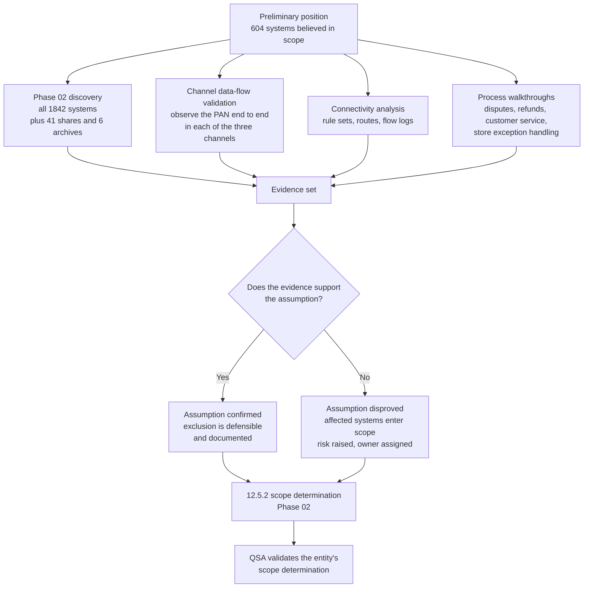

# 01.08 — Scope Assumptions &amp; Constraints

| Field | Value |
|---|---|
| Document ID | MRG-PCI-2026-108 |
| Program | Marketa Retail Group — PCI DSS v4.0.1 Compliance Program |
| Phase | 01 — Program Foundation &amp; PCI Governance |
| Version | 1.0 |
| Status | Approved |
| Owner | Elena Marchetti, VP Payment Operations |
| Approver | Naomi Bhatt, Chief Information Security Officer |
| Date | 2026-07-15 |
| Classification | Confidential — Cardholder Data Environment // Illustrative Portfolio Sample |

## Purpose

This document records Marketa's **preliminary scope position** at programme start: what the Company believes is in scope for PCI DSS v4.0.1, why it believes it, what that belief depends on, and what would have to be true for it to be wrong.

It is deliberately **not** a scope determination. Requirement **12.5.2** obliges the assessed entity to document and confirm the scope of its cardholder data environment at least once every twelve months, and that confirmation must rest on evidence, not on organisational memory. Phase 02 produces the determination. This document produces the **hypothesis Phase 02 is built to attack**, together with the constraints inside which the attack has to be run.

The distinction matters more than it sounds. A programme that opens by asserting its scope spends the rest of the year defending the assertion. A programme that opens by writing down a falsifiable hypothesis spends the year testing it, and treats each disproof as an output. Marketa has chosen the second, and this document is written in that voice throughout.

## 1. The Preliminary Position — 604 Systems

At kickoff on **2026-01-12**, Marketa's working position was that **604 of the 1,842 systems** in the enterprise estate were in scope for PCI DSS. That figure was not produced by analysis. It was assembled from three sources: the scope schedule carried forward from the 2024 assessment under v3.2.1, the configuration management database's "payment" and "retail-critical" tags, and the recollection of the teams who ran the previous validation.

| Component of the 604 | Count | Why it was included |
|---|---|---|
| Store back-office servers | 482 | One per store; carried in the 2024 scope schedule because the POS application talks to them |
| Connected-to and security-impacting infrastructure | 63 | Active Directory, SIEM, jump hosts, patching, EDR console, backup, vulnerability scanner |
| E-commerce web and application tier in AWS | 29 | Serves the pages on which payment is taken |
| Call-centre telephony servers and agent desktop images | 14 | The MOTO channel; the agents are on the phone when payment happens |
| Corporate payment operations systems | 8 | Settlement, chargebacks, reconciliation, refunds |
| Distribution-centre and other systems tagged "payment-adjacent" | 8 | Order fulfilment interfaces; tag origin unknown |
| **Total believed in scope** | **604** | — |

Two notes on what the number counts. First, it counts **hosts and system components**, not devices: the **1,914 POI terminals** are tracked in a separate device inventory under 9.5.1.1 and do not appear in the 604. Second, it counts **systems**, not **data**. That second omission is the reason §3 exists.

> **Status of this figure.** 604 is the number the programme starts with, not the number it expects to finish with. It is recorded here so that the eventual determination can be reconciled against a stated starting point, line by line, rather than presented as if it had always been obvious.

## 2. Why 604 Is Probably Too High

Marketa's three payment channels were each engineered so that primary account numbers do not come to rest on Company systems. If those mechanisms work as designed and are operated as designed, most of the 604 should fall out — not because the programme wishes them out, but because the systems concerned have **no capability to see, decrypt or reconstruct account data**.

| Population | Why it may fall out | Mechanism a QSA can test | Likely residual status |
|---|---|---|---|
| 482 store back-office servers | The store estate carries P2PE ciphertext only; Marketa holds no decryption capability | Verition P2PE solution listing; key-injection controls; PIM adherence; absence of clear-text capture in the lane | Out of CDE; **in scope for segmentation validation** and for 9.5.1 obligations |
| 29 AWS e-commerce hosts | The PAN is posted by the consumer browser to Truvance's origin inside a hosted iframe; it never reaches a Marketa web server | Page source and network capture showing the iframe origin; Truvance integration documentation | Out of CDE for the card-data path; **firmly in scope for 6.4.3 and 11.6.1** |
| 14 call-centre telephony and desktop systems | DTMF suppression means digits are never audible, displayed or recordable on Marketa infrastructure | Cadence service configuration; recorded call sampling; agent procedure observation | Agent desktops out of CDE; the media path and the masking service in scope |
| 8 distribution-centre "payment-adjacent" systems | Order fulfilment operates on tokens and truncated PAN | Data-element inventory; PAN discovery scan | Likely fully out of scope |

If all four rows hold, the CDE reduces to the corporate payment operations systems and the security-impacting infrastructure around them — an order of magnitude smaller than 604. **That is the hypothesis.** It is credible, it is architecturally coherent, and it is completely untested as at the date of this document.

## 3. Why 604 Is Probably Also Too Low

The more interesting failure mode is the opposite one, and it is the one that catches mature programmes. The 604 was derived by asking *which systems are involved in payment processing*. That is the wrong question. The right question is *where does account data actually exist*, and those two sets are not the same.

| Blind spot in the 604 | Why it is a blind spot | What could be hiding there |
|---|---|---|
| It counts systems, not data stores | A file share, a mailbox archive or a recording repository is not a "system" in the CMDB sense and was never tagged | Account data at rest with no owning application |
| The 1,238 excluded systems were excluded on **assertion** | Nobody scanned them. They were excluded because the teams believed they had no payment role | PAN in a place no process put there deliberately |
| Process outputs are invisible to infrastructure inventory | Disputes, chargebacks, refunds and customer service generate documents, exports and attachments | Scanned correspondence, spreadsheets, ad-hoc extracts |
| Historical data predates current controls | A control deployed in year N does nothing about data created in year N−3 | Archives created before tokenisation, masking or suppression existed |
| Decommissioned is a status, not a state | Systems marked retired in the CMDB may still be powered, reachable, and holding their last log files | Debug output, transaction traces, crash dumps |
| Backups and replicas inherit the sins of their sources | A clean production system with a dirty backup is not a clean environment | Restorable copies of anything above |

Each of these is a reason the *denominator* of the discovery exercise must be the entire estate, not the believed-in-scope subset. Marketa's Phase 02 discovery scope is therefore **all 1,842 systems, plus 41 network shares and 6 email archives** — the shares and archives specifically because they appear nowhere in the 604 and would otherwise never be looked at.

> **The asymmetry that governs this document.** A system wrongly *included* in scope costs money — controls, evidence, assessor time. A system wrongly *excluded* costs the assessment. Over-inclusion is a budget problem; under-inclusion is a validity problem. The programme therefore treats the two errors differently: it will spend money proving exclusions, and it will not accept an exclusion supported only by the fact that nobody remembers putting card data there.

## 4. The Assumptions, Written So They Can Be Disproved

Below are the twelve assumptions the 604-system position rests on. Each is stated as a claim about the world, with the evidence that would disprove it and the consequence if it fails. An assumption that cannot be disproved by any conceivable observation is not an assumption; it is a belief, and it has no place in a scope argument.

| ID | Assumption | Basis for believing it now | What would disprove it | Consequence if disproved |
|---|---|---|---|---|
| **A-01** | The Verition P2PE solution is deployed as validated at all 482 stores and all 1,914 lanes, and is operated in accordance with the P2PE Instruction Manual | Solution is listed by the Council; deployment was managed centrally | A lane running a non-listed device or firmware; a POI connected outside the approved network path; a PIM control not performed | The P2PE scope reduction fails **for the affected stores**; those store environments become CDE |
| **A-02** | No account data is captured anywhere in the store lane except inside the POI device | No manual-entry path exists in the POS application; no imprinters in use | A keyed-entry path to a non-POI device; card numbers written on paper at the lane; a receipt printing more than the permitted digits | Store systems re-enter the CDE; Requirement 3 obligations attach to the store estate |
| **A-03** | On all six payment templates, card fields are rendered exclusively inside the Truvance-served iframe, and no Marketa origin collects a card field | Integration design; developer attestation | A template collecting a card field on a Marketa origin; a fallback form; a "manual entry" path for customer service | The AWS e-commerce tier becomes CDE — the single largest possible scope expansion in the programme |
| **A-04** | No account data exists in the call-recording estate, because DTMF suppression prevents spoken and keyed PAN from being recorded | Cadence masking is deployed and in daily use | A recording containing an audible or transcribed card number | The recording archive becomes an account-data store; Requirement 3, 9 and 12.10.7 obligations attach; a **risk is raised, not lowered** |
| **A-05** | Marketa stores only Truvance-issued tokens and truncated PAN; no full PAN exists at rest anywhere in the estate, including email and collaboration platforms | Architecture intent; tokenisation deployed across all three channels | A single instance of full PAN at rest, anywhere, in any format | The holding location enters the CDE and 12.10.7 procedures are invoked; the programme's central claim requires qualification |
| **A-06** | Sensitive authentication data — CVV2, full track, PIN and PIN block — is never stored after authorisation | Requirement 3.3.1 prohibition; no business process requires it | Any SAD found post-authorisation, in any system, log or archive | The most serious finding available to a merchant; immediate escalation under §7 of 01.06 |
| **A-07** | Dispute, chargeback and refund processes operate solely on tokens and truncated PAN; no document held for those processes bears a full card number | Payment operations process documentation | Scanned correspondence, issuer packets or exported files containing full PAN | A previously invisible data store enters the CDE; the "payment operations is 8 systems" position needs restating |
| **A-08** | The 1,238 systems outside the believed-in-scope set have no account data, no connectivity to the CDE, and no ability to affect its security — including systems recorded as decommissioned | CMDB tagging; network design intent | Discovery finding account data on any of them; a network path proving connectivity; a "decommissioned" host still powered and reachable | The system enters scope, and the reliability of the CMDB as a scoping input is itself called into question |
| **A-09** | Store back-office networks are segmented from the corporate CDE, and store guest wireless is segmented from store back-office | Network design and configuration standards | A penetration test proving a reachable path between zones | Segmentation cannot be relied on for scope reduction until remediated and re-tested; every system on the reachable side is in scope in the interim |
| **A-10** | Marketa cannot reverse a Truvance token to a PAN by any means available to it | Contractual position; no key material held | Any Marketa-side capability, API entitlement or cached mapping that permits detokenisation | Tokens become cardholder data in Marketa's hands, and every system storing them enters scope |
| **A-11** | Truvance, Cadence and Verition maintain valid PCI validation, and Verition's P2PE solution remains listed, throughout the compliance year | Current AOCs and listings held on file | A lapsed AOC, a delisted solution, or a validation covering a different service than the one consumed | The relevant scope reduction is unsupported until re-established; Cardinal is notified under obligation C7 |
| **A-12** | Payment acceptance occurs only through the three channels documented in 01.01 — no other business unit, campaign or partner accepts cards on Marketa's behalf | Payment operations owns all merchant IDs | An unrecorded merchant ID, a departmental payment page, an event or pop-up acceptance path | An entire undocumented acceptance channel enters scope, with no controls and no evidence history |

### How these assumptions will be tested

> **Two of these assumptions do not survive Phase 02.** They are not marked here, and marking them would defeat the purpose of the document — which is to record faithfully what the programme believed *before* it tested. Phase 02 records which two, what was found, and what it cost. What can be said in advance is the rule the programme operates under, carried forward from earlier engagements and reaffirmed by the Steering Committee: **when testing disproves an assumption, the associated risk goes up, not down.** A control that was believed to be working and is not was never protecting anything; discovering that fact changes the record, not the reality.

## 5. Constraints

Constraints are not risks. A risk might happen; a constraint is a fixed property of the environment that the plan must be built around. There are nine, and the first two shape the entire programme calendar.

| ID | Constraint | Description | Effect on scope work and delivery |
|---|---|---|---|
| **CON-01** | **Seasonal change freeze, October to January** | No change to store systems, store networks or the POS estate during peak trading. Enforced by Store Operations and Merchandising, not by IT, and not waivable by the programme | All store-side change must complete by **2026-09-30**. It is the reason control implementation runs April to July, why the application penetration test is in September, and why QSA fieldwork is in early November — an assessment observes, it does not change |
| **CON-02** | **482 stores means every store-side change is a 482× rollout** | A change that takes ten minutes per store is 80 hours of field effort before travel, scheduling, verification or failure handling. A change requiring an on-site visit is a multi-week programme in its own right | Favours centrally deployable and observation-based controls. Directly shapes the design of the 9.5.1 inspection regime, which had to be executable by store colleagues on shift rather than by visiting engineers |
| **CON-03** | **Vendor-locked POS back-office appliances** | A subset of store back-office appliances is supplied and maintained by the vendor under terms that prevent Marketa installing agents or holding privileged credentials | Prevents authenticated internal scanning under **11.3.1.2** on the affected components without vendor cooperation. This is a known constraint at programme start, not a surprise discovered later, and it is carried as a delivery risk from day one |
| **CON-04** | **The QSA fieldwork window is fixed** | Sable Ridge Assurance is on site **2026-11-02 to 2026-11-20**. The window was reserved at engagement and cannot be moved late in the year without losing it | Everything is planned backwards from this date. Controls must be operating long enough before it to produce a meaningful sample — see 01.12 |
| **CON-05** | **Cardinal's 31 December filing deadline** | Obligation C3. The AOC is due on or before 31 December each year | Leaves roughly six weeks between the end of fieldwork and the deadline for report production, review and signature — with no room for a second attempt |
| **CON-06** | **Budget of $4,600,000** | Approved envelope across FY2026 and FY2027, with 4% contingency. Variance above 10% of a phase budget requires the CFO | Scope reduction is the primary cost control. Every system that stays in scope carries recurring cost in tooling, scanning, evidence and assessor time — which is why the discovery spend is treated as an investment rather than an overhead |
| **CON-07** | **11.4 FTE-equivalents, drawn from teams with day jobs** | Store operations, e-commerce engineering and infrastructure are all contributing part-time capacity alongside trading-critical work | Sequencing matters more than effort. Two workstreams competing for Trevor Kim's network engineers cannot both be on the critical path |
| **CON-08** | **No pre-existing external attestation to draw on** | Marketa holds no SOC 2, ISO 27001 or equivalent report of its own. It is privately held, is not an SEC registrant, and has no SOX control population to reuse | Every piece of control evidence in the assessment must be produced by this programme from a standing start |
| **CON-09** | **Seasonal workforce of up to 6,800, October to January** | Temporary colleagues join precisely during the freeze and precisely when transaction volume peaks | Awareness training under 12.6.3 and POI inspection under 9.5.1 must both work for people who joined six weeks ago. The charter's 95% completion bar exists because of this constraint |

### The compounding effect

CON-01 and CON-02 compound. A control that must be deployed to stores has to be designed, built, tested, piloted and rolled out to 482 sites **before the end of September**, in a programme that only settles its scope in February and its segmentation design in March. That leaves roughly six months for the store-side critical path, of which the rollout itself consumes a meaningful fraction. The practical consequence, accepted by the Steering Committee at the outset, is that **store-side control design is optimised for deployability over elegance**, and that anything requiring a physical visit to every store is rejected unless there is no alternative.

## 6. What Phase 02 Must Answer

The following questions are the transfer mechanism between this document and the next phase. Each has a named owner, a required evidence type, and a state that would count as an answer. Phase 02 closes when all sixteen are answered — not when the discovery tooling finishes running.

| ID | Question Phase 02 must answer | Tests assumption | Evidence required | Owner |
|---|---|---|---|---|
| **Q-01** | Where does account data exist at rest across the entire estate, including shares and archives? | A-05, A-07, A-08 | Discovery scan results across 1,842 systems, 41 network shares, 6 email archives, with coverage evidence | Marcus Hale |
| **Q-02** | Is any sensitive authentication data stored after authorisation? | A-06 | Discovery pattern results targeting track data, CVV2 and PIN blocks; process walkthroughs | Marcus Hale |
| **Q-03** | Does the PAN ever traverse or rest on a Marketa system in the card-present channel? | A-01, A-02 | Lane-level capture at a sampled set of stores; POI configuration; PIM control checklist | Trevor Kim |
| **Q-04** | Is the payment iframe served from Truvance's origin on all six templates, with no Marketa-origin card field? | A-03 | Page source and browser network capture per template; code review of checkout components | Sonia Rendell |
| **Q-05** | Does any historical or current call recording contain account data? | A-04 | Sampled scan and transcription analysis of the recording estate, including pre-masking archives | Bill Traynor |
| **Q-06** | What documents do dispute, chargeback and refund handling actually create, and what do they contain? | A-07 | End-to-end process walkthrough with document sampling, including the file shares those teams use | Elena Marchetti |
| **Q-07** | Can Marketa detokenise, by any route, entitlement or cached artefact? | A-10 | Truvance API entitlement review; contract review; test attempt with negative result documented | Elena Marchetti |
| **Q-08** | Which systems have network reachability to the corporate CDE, in either direction? | A-08, A-09 | Rule set and route analysis; cloud flow logs; validated network diagram under 1.2.3 and 1.2.4 | Trevor Kim |
| **Q-09** | Which systems, though they hold no account data, can affect the security of the CDE? | A-08 | Administrative-path analysis: identity, patching, monitoring, backup, virtualisation, secrets | Trevor Kim |
| **Q-10** | Is store guest wireless separated from store back-office, and store back-office from corporate? | A-09 | Configuration evidence, then a segmentation penetration test under 11.4.5 — configuration alone does not answer this | Trevor Kim |
| **Q-11** | Are any systems recorded as decommissioned still powered, reachable or holding data? | A-08 | Reconciliation of CMDB status against network discovery and authentication logs | Trevor Kim |
| **Q-12** | Do backups, replicas and disaster-recovery copies at Ashburn contain anything production does not? | A-05, A-08 | Backup catalogue review; restore-and-scan of sampled images | Marcus Hale |
| **Q-13** | Are there acceptance channels or merchant IDs outside the three documented ones? | A-12 | Merchant ID reconciliation with Cardinal; expense and revenue analysis for unrecorded acceptance | Elena Marchetti |
| **Q-14** | Which third parties receive, transmit or can affect account data, and does the TPSP register in 01.09 match reality? | A-11 | Data-flow confirmation with each provider; contract and AOC review | Owen Castellanos |
| **Q-15** | What is the complete population of payment pages and the scripts executing on them? | A-03 | Template enumeration and script inventory under 6.4.3 | Sonia Rendell |
| **Q-16** | Given the answers above, what is the defensible list of assessed system components, and what is the rationale for every exclusion? | All | The 12.5.2 scope document, reviewed with the QSA | Naomi Bhatt |

## 7. How the Scope Will Be Recorded and Kept Current

A scope determination that is correct in February and unmaintained in November is worthless, because the assessment tests the environment as it stands during fieldwork.

| Obligation | Requirement | Marketa's implementation |
|---|---|---|
| Document and confirm scope at least once every 12 months and upon significant change | **12.5.2** | Annual scope confirmation owned by Naomi Bhatt, performed by Elena Marchetti and Owen Castellanos, reviewed with the QSA |
| Maintain an inventory of system components in scope | **12.5.1** | Assessed-component register in `trackers/`, reconciled monthly against the CMDB |
| Six-monthly scope confirmation | 12.5.2.1 | **Not applicable.** This is a service-provider requirement; Marketa is a merchant. Recorded so that no one adopts it by mistake and no one is surprised by its absence |
| Review the impact of significant organisational change on scope | 12.5.3 | **Not applicable** — also service-provider only. The equivalent discipline is applied voluntarily through the change-notification obligation to Cardinal (C7) |
| Notify the acquirer of material change to the CDE | Merchant agreement, obligation **C7** | Within 30 days, owned by Elena Marchetti |

The programme also adopts a standing rule for the year: **any change that could alter scope is treated as scope-affecting until someone demonstrates otherwise.** New integrations, new third parties, new acceptance methods, new data flows and network changes each trigger a scope-delta review before go-live, logged in `logs/`.

## 8. What This Document Does Not Claim

For the avoidance of doubt, and because scope documents are read later by people looking for a commitment:

| This document does **not** claim | Position |
|---|---|
| That 604 is correct | It is the starting hypothesis and is expected to be wrong |
| That the eventual number will be smaller | It is expected to be smaller, but the discovery work can only be relied on if the programme is genuinely willing for it to be larger |
| That the P2PE, iframe and DTMF reductions are established | They are architecturally credible and evidentially untested as at this date |
| That any system is out of scope | No exclusion is effective until it is supported by evidence and accepted in the 12.5.2 determination |
| That the QSA determines scope | **Scope is the assessed entity's determination.** The QSA validates it and may challenge it, but Marketa owns it and answers for it |

## Cross-References

| Reference | Relevance |
|---|---|
| 01.01 — Company Profile &amp; Payment Channels | The channel architecture the hypothesis rests on |
| 01.05 — PCI DSS v4.0.1 Requirements Overview | Requirements 3, 11 and 12.5.2 obligations referenced here |
| 01.06 — Program Charter &amp; Objectives | Objective O2; budget and constraint statements |
| 01.09 — Third-Party Service Provider Register | The providers whose validation assumptions A-11 depends on |
| 01.12 — Program Roadmap &amp; Milestones | How CON-01 and CON-04 shape the schedule |
| Phase 02 — CDE Scoping &amp; Cardholder Data Discovery | Answers Q-01 to Q-16 and produces the 12.5.2 determination |
| Phase 03 — Network Segmentation Architecture | Tests A-09 by penetration test under 11.4.5 |

---
[⬅ Previous](01.07-roles-responsibilities-and-raci.md) · [🏠 Phase 01 Home](01.00-README.md) · [Next ➡](01.09-third-party-service-provider-register.md)
