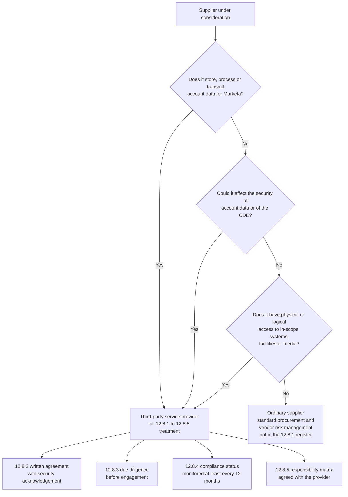

# 01.09 — Third-Party Service Provider Register

| Field | Value |
|---|---|
| Document ID | MRG-PCI-2026-109 |
| Program | Marketa Retail Group — PCI DSS v4.0.1 Compliance Program |
| Phase | 01 — Program Foundation &amp; PCI Governance |
| Version | 1.0 |
| Status | Approved |
| Owner | Owen Castellanos, Payment Card Compliance Manager |
| Approver | Frank Mueller, General Counsel |
| Date | 2026-07-15 |
| Classification | Confidential — Cardholder Data Environment // Illustrative Portfolio Sample |

## Purpose

Marketa's payment architecture works because other people hold the card data. That is a good outcome for the Company's risk profile and a demanding one for its governance, because **PCI DSS does not allow a merchant to outsource accountability along with the data**. Requirement **12.8** obliges Marketa to know exactly who its third-party service providers are, to have written agreements with them, to have performed due diligence before engaging them, to monitor their compliance status, and to know precisely which requirements each of them manages and which remain Marketa's own.

This document is the register that satisfies **12.8.1**, the process description that satisfies **12.8.2 to 12.8.5**, and the shared-responsibility matrix that operationalises **12.8.5** against the providers' corresponding duty under **12.9.2**. Phase 06 executes the monitoring cycle; this document defines what is being monitored and why.

## 1. What Makes a Provider a TPSP

Not every supplier is a third-party service provider in the PCI DSS sense, and treating every supplier as one is as harmful as treating none of them as one — it dilutes the register until nobody can see which relationships actually matter.

The test has two limbs, and either is sufficient:

| Limb | Question | Example at Marketa |
|---|---|---|
| **Data** | Does the provider store, process or transmit account data on Marketa's behalf? | Truvance transmits and stores PAN; Cadence transmits it |
| **Security impact** | Could the provider otherwise **affect the security** of account data or of the cardholder data environment, even without ever touching the data? | Northbridge monitors the logs that would reveal a compromise; Verition holds the keys that make the ciphertext ciphertext |

The second limb is the one organisations underestimate. A provider that never sees a card number but holds administrative access, supplies a security control, or destroys media that might bear account data is squarely within 12.8.1. Conversely, a supplier of shelving, freight or payroll — however commercially significant — is not, and does not belong in this register.

### Suppliers assessed and deliberately excluded

Recording the exclusions is part of the register's credibility. A register that contains only inclusions cannot be reviewed, because there is nothing to check the boundary against.

| Supplier category | Why excluded | Reviewed |
|---|---|---|
| Merchandise vendors and freight carriers | No account data; no access to in-scope systems or facilities | Annually at the TPSP forum |
| Payroll and benefits administration | Holds employee data; no account data; no CDE connectivity | Annually |
| Facilities, cleaning and maintenance at non-CDE sites | No access to CDE facilities. **Contractors with access to the Columbus data centre CDE areas are handled under Requirement 9 visitor and physical-access controls, not under 12.8** | Annually |
| Marketing agencies | Excluded **only** where they have no ability to publish to payment-page templates. Any agency with tag-management or template-publication rights **is** a TPSP under the security-impact limb, because it can alter a payment page | Reviewed on every access grant |
| General SaaS with no CDE connectivity | No account data, no connectivity, no administrative path | Annually |

The marketing row is the one that changed as a result of this analysis. Publication rights to a payment page are the ability to affect the security of account data, whatever the contract says the agency does. That finding feeds directly into the 6.4.3 workstream in Phase 04 and the engagement plan in 01.10.

## 2. Marketa's 12.8 Operating Process

| Requirement | Obligation | How Marketa discharges it | Artefact | Cadence |
|---|---|---|---|---|
| **12.8.1** | Maintain a list of TPSPs with which account data is shared or which could affect its security, including a description of the service provided | This register, held in `trackers/` and mirrored in the programme workbook | TPSP register | Reviewed quarterly; updated on change |
| **12.8.2** | Written agreements including the TPSP's acknowledgement of responsibility for the security of account data it possesses, stores, processes or transmits, or could otherwise affect | Standard PCI security schedule drafted by Frank Mueller, appended to every TPSP agreement | Executed agreement plus security schedule | On engagement; on renewal; on service change |
| **12.8.3** | An established process for engaging TPSPs, including proper due diligence prior to engagement | Pre-engagement due diligence pack; Steering Committee endorsement; **Cardinal notified before engagement under obligation C6** | Due diligence record | Before every engagement |
| **12.8.4** | A programme to monitor TPSPs' PCI DSS compliance status at least once every 12 months | AOC or validation evidence collected and reviewed, then **independently corroborated against the card brands' published service-provider registries** | Validation review memo | At least annually; quarterly status check at the TPSP forum |
| **12.8.5** | Information maintained about which requirements are managed by the TPSP, which by Marketa, and which are shared | A signed responsibility matrix per provider, reproduced in outline at §5 | Responsibility matrix | Annually; on service change |

### Why 12.8.2 written agreements matter more than they look

A 12.8.2 agreement is not a procurement formality. It does four specific jobs, and a programme that treats it as boilerplate will find all four missing at exactly the wrong moment.

| Job | What it achieves | What its absence costs |
|---|---|---|
| **Establishes the acknowledgement** | The provider states in writing that it is responsible for the security of the account data it handles or can affect. This is the corresponding half of the provider's own 12.9.1 duty | Without it, the requirement is simply not met, and no amount of good practice substitutes |
| **Creates the right to information** | Contractual entitlement to AOCs, responsibility matrices, evidence and answers — the mechanism through which 12.8.4 and 12.8.5 are actually obtainable | Marketa is left asking politely for evidence it is obliged to hold |
| **Fixes the notification duties** | Obliges the provider to notify Marketa of a suspected compromise, of a change in validation status, and of material change to the service | Marketa learns about its provider's breach from the acquirer, or from the news |
| **Draws the boundary before the incident** | Records who does what while everyone is calm, rather than during an incident when both parties have an interest in the answer | The recurring failure mode: both parties assume the other operates a control, and neither does |

Marketa's standing drafting rule, set by the General Counsel: **any requirement not explicitly allocated to the provider is Marketa's.** Silence in a contract is not a transfer of responsibility, and a matrix with gaps is a matrix that allocates those gaps to the merchant.

## 3. The Register

Five providers meet the 12.8.1 test. Each is set out below with the service, the account-data relationship, validation status, and the split of requirement ownership.

### 3.1 TPSP-01 — Truvance Payments, Inc.

| Attribute | Detail |
|---|---|
| Service provided | Payment gateway; **hosted checkout iframe** served from Truvance's own origin; authorisation routing to Cardinal Merchant Bank; **the single tokenization vault across all three acceptance channels** |
| Channels served | E-commerce, card-present (receiving decrypted authorisation from Verition), MOTO (receiving account data from Cadence) |
| Account data touched | **Full PAN** — received, transmitted, and stored in the token vault. Holds the token-to-PAN mapping |
| Data Marketa receives back | Authorisation response and **token only** |
| Validation status | **Level 1 service provider**, validated by an independent QSA against PCI DSS v4.0.1 |
| AOC on file | Dated **2026-03-31**, covering the gateway, hosted payment page and tokenization services |
| Corroboration under 12.8.4 | Listed on the Visa Global Registry of Service Providers and the Mastercard SDP compliant service provider list; both checked by Owen Castellanos against the AOC |
| 12.8.2 agreement | Executed, with the security acknowledgement schedule and a 24-hour compromise notification clause |
| 12.9.1 acknowledgement | Held on file |
| Relationship owner | Elena Marchetti, VP Payment Operations |
| **Critical nuance** | Truvance's AOC covers **Truvance's** environment. It says nothing about the Marketa pages that embed the iframe. **6.4.3 and 11.6.1 remain entirely Marketa's** — the single most commonly mis-allocated pair of requirements in hosted-payment-page architectures |

### 3.2 TPSP-02 — Cadence Voice Solutions

| Attribute | Detail |
|---|---|
| Service provided | **Pause-and-resume call recording with DTMF suppression** for the Austin call centre; secure payment session initiation; relay of account data to Truvance for authorisation |
| Channels served | MOTO — approximately 2.1 million transactions annually across 310 agents |
| Account data touched | **Full PAN** — received as DTMF tones from the cardholder's handset, suppressed before reaching the agent or the recorder, transmitted to Truvance |
| Data Marketa receives back | Authorisation response and token, presented to the agent's order screen |
| Validation status | **Level 1 service provider**, validated against PCI DSS v4.0.1 |
| AOC on file | Dated **2026-05-08** |
| Corroboration under 12.8.4 | Confirmed against the brands' published service-provider registries |
| 12.8.2 agreement | Executed, with the security acknowledgement schedule |
| 12.9.1 acknowledgement | Held on file |
| Relationship owner | Bill Traynor, Call Centre Operations Manager |
| **Critical nuance** | The service protects calls **from the moment it is enabled forward**. It makes no claim about recordings made before deployment, and Cadence's AOC cannot be read as an assurance about Marketa's historical recording archive. That archive is Marketa's problem, and Phase 02 treats it as one |

### 3.3 TPSP-03 — Verition POS Systems

| Attribute | Detail |
|---|---|
| Service provided | **PCI P2PE-validated solution** — SRED-capable POI devices, key injection and management, the HSM-based decryption environment, and the **P2PE Instruction Manual (PIM)**. Verition decrypts and hands authorisation to Truvance |
| Channels served | Card-present — 1,914 lanes across 482 stores, approximately 50.6 million transactions annually |
| Account data touched | **Full PAN** — encrypted inside the POI at the moment of read, decrypted only within Verition's environment, which Marketa cannot access |
| Validation status | **P2PE solution listed on the PCI Security Standards Council's website.** Listing verified by Marketa on **2026-06-30** |
| Attestation on file | P2PE Attestation of Validation dated **2025-09-12**; **PIM version 4.2** issued to Marketa and held by Store Operations |
| Corroboration under 12.8.4 | Direct check of the Council's published list of validated P2PE solutions — the authoritative source, checked rather than relying on the vendor's statement |
| 12.8.2 agreement | Executed supply and services agreement with the PCI security schedule and PIM adherence obligations |
| Relationship owner | Adaeze Nwosu (store deployment and inspection) / Trevor Kim (network and integration) |
| **Critical nuance** | A P2PE listing is a property of the **solution as validated**, not a blanket exemption for the merchant. Deviating from the PIM — an unapproved device, an unapproved network path, an uninspected terminal — voids the scope reduction for the affected stores. **9.5.1 inspection, 9.5.1.1 inventory and 9.5.1.3 training remain wholly Marketa's** |

### 3.4 TPSP-04 — Northbridge Managed Services

| Attribute | Detail |
|---|---|
| Service provided | **After-hours security operations centre** — detection, triage and escalation against agreed use cases, outside Marketa SOC hours |
| Channels served | None directly. Monitors the CDE and the connected-to estate |
| Account data touched | **None by design.** Northbridge sees alerts, log metadata and security telemetry. It does **not** receive account data |
| Why it is nonetheless a TPSP | The **security-impact limb**. Northbridge holds read access to the SIEM covering all 71 assessed components and is the detection capability for two thirds of each day. A failure of this service is a failure of Requirement 10 monitoring |
| Validation status | **Not a PCI DSS validated service provider.** Northbridge holds a SOC 2 Type II report dated **2026-02-27**, which is a useful due-diligence input and is **not** PCI validation and is not treated as such |
| How 12.8.4 is satisfied | Under the alternative route the standard provides: where a TPSP has not undergone its own PCI DSS assessment, **the applicable requirements are assessed as part of the customer's assessment**. Northbridge's monitoring activity is therefore in scope of Marketa's own ROC, and Sable Ridge tests it directly during fieldwork |
| 12.8.2 agreement | Executed, with the security acknowledgement schedule, defined use cases, and escalation service levels |
| Relationship owner | Marcus Hale, Security Operations Manager |
| **Critical nuance** | A SOC 2 report answers a different question than an AOC. Accepting one in place of the other is a common and material governance error, and the register records the distinction explicitly so that no future reviewer has to reconstruct it |

### 3.5 TPSP-05 — Halberd Data Destruction

| Attribute | Detail |
|---|---|
| Service provided | Certified destruction of electronic and hard-copy media that may bear account data, collected from the Columbus data centre, the Austin office, the four distribution centres and, on request, from stores |
| Account data touched | **Potentially** — the service exists precisely because media may bear account data. Halberd does not process it, but it takes custody of it |
| Why it is a TPSP | Custody of media that may contain account data is a data relationship, and destruction is a control Marketa relies on to meet **9.4.6 and 9.4.7** |
| Validation status | **Not a PCI DSS validated service provider.** Holds NAID AAA certification for secure destruction |
| How 12.8.4 is satisfied | Requirements relating to the destruction service are covered within Marketa's own assessment. Evidence is the chain-of-custody record plus a **certificate of destruction** for every collection, retained as **9.4.7** evidence |
| 12.8.2 agreement | Executed service agreement with the security acknowledgement schedule and chain-of-custody obligations |
| Relationship owner | Adaeze Nwosu, Director of Store Operations |
| **Critical nuance** | The control Marketa relies on is not "Halberd destroys media." It is "Marketa can evidence, for each item, that it went from a secured container into Halberd's custody and was destroyed." The certificate without the chain of custody proves the second half of a two-part control |

## 4. Validation Status Summary

| ID | Provider | PCI validation held | Evidence type | Evidence date | Next review | 12.8.4 route |
|---|---|---|---|---|---|---|
| TPSP-01 | Truvance Payments, Inc. | Level 1 service provider | AOC | 2026-03-31 | 2027-03-31 | Provider AOC plus brand registry corroboration |
| TPSP-02 | Cadence Voice Solutions | Level 1 service provider | AOC | 2026-05-08 | 2027-05-08 | Provider AOC plus brand registry corroboration |
| TPSP-03 | Verition POS Systems | P2PE solution listed by the Council | P2PE Attestation of Validation; Council listing; PIM v4.2 | 2025-09-12; listing verified 2026-06-30 | 2026-09-30 listing recheck | Council list of validated P2PE solutions |
| TPSP-04 | Northbridge Managed Services | **None** | SOC 2 Type II (not PCI validation) | 2026-02-27 | 2027-02-28 | **Included in Marketa's own assessment** |
| TPSP-05 | Halberd Data Destruction | **None** | NAID AAA certification; certificates of destruction | Certification current; certificates per collection | Annual | **Included in Marketa's own assessment** |

Two of the five providers are not PCI-validated. That is not a defect in the register; it is the honest state of the supply chain, and the standard accommodates it explicitly by requiring those services to be assessed within Marketa's own assessment instead. What would be a defect is holding a SOC 2 report or a NAID certificate in a folder labelled "PCI evidence" and considering the matter closed.

## 5. The Shared Responsibility Matrix

Requirement **12.8.5** obliges Marketa to maintain information about which requirements each provider manages, which Marketa manages, and which are shared. Requirement **12.9.2** obliges the provider to support that request — which is the contractual mechanism that makes the matrix obtainable rather than aspirational.

From the merchant's side, 12.9.2 works like this: Marketa's 12.8.2 agreement incorporates a right to request; Owen Castellanos exercises that right annually and on service change; the provider returns its own allocation; the two are reconciled; disagreements are resolved before signature; and **no matrix is treated as complete until the provider has signed it.** A matrix Marketa wrote and the provider never saw is a Marketa opinion, not a shared understanding.

### Legend

| Code | Meaning |
|---|---|
| **P** | The provider manages this requirement for the service concerned |
| **M** | Marketa manages it |
| **S** | Shared — both parties operate a part, and the split is defined in the provider's signed matrix |
| **—** | Not applicable to this provider's service |

### Matrix

| Requirement area | Truvance | Cadence | Verition | Northbridge | Halberd | Marketa's retained obligation |
|---|---|---|---|---|---|---|
| **1** Network security controls for the provider's environment | P | P | P | P | — | M for Marketa's own 9 zones and every rule set Marketa owns |
| **1** Network placement of the connecting components | S | S | S | — | — | M — POI network path, iframe-hosting tier, telephony path, SIEM feed |
| **2** Secure configuration of provider-operated systems | P | P | P | P | — | M for all 71 assessed components |
| **2** Secure configuration of POI devices | — | — | P | — | — | M — confirm devices are deployed in the configuration the PIM specifies |
| **3** Storage and protection of PAN | **P** | — | — | — | — | M — prove no PAN is stored on Marketa systems, and remediate any found |
| **3** Token vault and token-to-PAN mapping | **P** | — | — | — | — | M — hold no detokenisation capability, and evidence that |
| **3** Masking and truncation on Marketa displays and receipts | S | S | S | — | — | **M** — every display Marketa renders |
| **3** Retention and secure deletion of account data at Marketa | — | — | — | — | S | **M** — retention policy, quarterly verification of deletion under 3.2.1 |
| **4** Cryptography protecting PAN in transit | P | P | P | — | — | M for TLS on Marketa-controlled endpoints and the certificate inventory under 4.2.1.1 |
| **4** POI-to-decryption encryption and key management | — | — | **P** | — | — | M — do not interfere with, substitute or bypass it |
| **5** Anti-malware in the provider's environment | P | P | P | P | — | M for the 71 assessed components, removable media (5.3.3) and anti-phishing (5.4.1) |
| **6** Secure development of the provider's platform | P | P | P | — | — | M for Marketa's e-commerce platform and integrations |
| **6.4.3** Payment-page script inventory, authorisation and integrity | — | — | — | — | — | **M — wholly Marketa's.** The iframe protects the field, not the page around it |
| **7** Access control within the provider's environment | P | P | P | P | P | M for all Marketa access, including to provider consoles |
| **8** Authentication of provider personnel | P | P | P | P | P | M for Marketa personnel, including MFA into the CDE under 8.4.2 |
| **8** Credentials Marketa holds for provider APIs and consoles | S | S | S | S | — | **M** — service-account governance under 8.6.1 to 8.6.3 |
| **9** Physical security of provider facilities | P | P | P | P | P | M for Columbus, Ashburn, Austin and the store estate |
| **9.5.1** POI inspection, inventory and personnel training | — | — | S | — | — | **M — 1,914 terminals, quarterly.** Verition supplies guidance; Marketa performs and evidences |
| **9.4.6 / 9.4.7** Media destruction | — | — | — | — | **P** | **M** — secure containers, chain of custody, retention of certificates |
| **10** Logging within the provider's environment | P | P | P | P | — | M — log generation, protection and 12-month retention across the 71 components |
| **10** Out-of-hours monitoring and escalation | — | — | — | **P** | — | M — in-hours monitoring, use-case definition, incident decisions |
| **11.3** Vulnerability scanning of the provider's environment | P | P | P | P | — | M for the 71 assessed components, internal and ASV |
| **11.4** Penetration testing of the provider's environment | P | P | P | — | — | M — Marketa's own internal, external and segmentation testing under 11.4.5 |
| **11.6.1** Payment-page change and tamper detection | — | — | — | — | — | **M — wholly Marketa's**, on the pages that embed the iframe |
| **12.6** Awareness training | P | P | P | P | P | M for ~34,000 colleagues plus the seasonal intake |
| **12.10** Incident response and compromise notification | S | S | S | S | S | **M owns the incident.** Providers notify; Marketa decides, escalates, and tells Cardinal within 24 hours |

### The cells that generate arguments

| Cell | The argument | Marketa's position |
|---|---|---|
| 6.4.3 and 11.6.1 with Truvance | "You host the payment form, so payment-page security is yours" | The iframe secures the **field**. The page that embeds it is Marketa's code on Marketa's origin, and a skimmer overlaying that page never touches Truvance. Marketa's, without qualification |
| Historical recordings with Cadence | "Your service prevents PAN in recordings" | It prevents PAN in recordings **made after deployment**. Everything before is Marketa's data on Marketa's platform |
| 9.5.1 with Verition | "Your solution is validated, so the terminals are covered" | The solution is validated; the **operation** of it is Marketa's, and inspection against tampering and substitution is explicitly the merchant's requirement |
| Log completeness with Northbridge | "You monitor our environment" | Northbridge can only detect what Marketa's logging produces. Coverage gaps are Marketa's; missed detections within covered use cases are Northbridge's |
| Chain of custody with Halberd | "You destroyed the media" | Destruction is Halberd's; getting the media into a secured container and evidencing custody up to collection is Marketa's |

## 6. Nested and Downstream Providers

Truvance and Cadence each rely on their own subservice organisations — hosting, connectivity, key management. Marketa does not hold direct agreements with those parties and should not pretend to govern them.

| Position | Rationale |
|---|---|
| Marketa governs its **direct** providers | Its contractual relationship, and its right to information, extends one link |
| Each provider is contractually obliged to govern its own | The 12.8.2 schedule requires the provider to impose equivalent obligations downstream, and to confirm annually that it has |
| The provider's **AOC scope statement** is read, not skimmed | Owen Castellanos reads the AOC's description of services and locations to confirm it covers the service Marketa consumes. An AOC that validates a different product line is evidence of nothing relevant |
| Downstream change is a notification trigger | A change of a provider's material subservice organisation is a notifiable event under the agreement, and triggers a scope-delta review |

## 7. Register Maintenance

| Activity | Owner | Cadence | Output |
|---|---|---|---|
| Quarterly TPSP forum — status of all five providers | Owen Castellanos | Quarterly | Minutes in `governance/`; register updated |
| Annual validation review under 12.8.4 | Owen Castellanos | Annually, on each provider's AOC anniversary | Validation review memo |
| Brand registry corroboration | Owen Castellanos | With each validation review, and on any change of status | Registry screenshot with date |
| Responsibility matrix re-confirmation under 12.8.5 | Owen Castellanos with the relationship owner | Annually and on service change | Provider-signed matrix |
| Agreement review for the security schedule | Frank Mueller | On renewal and on service change | Executed agreement |
| Due diligence for any new provider | Elena Marchetti with Owen Castellanos | Before engagement; **Cardinal notified first under C6** | Due diligence pack; Steering Committee endorsement |
| Escalation on a lapsed or withdrawn validation | Naomi Bhatt | On event | Steering Committee; scope-delta review; Cardinal notification under C7 if material |

> **What happens if a provider's validation lapses.** The scope reduction that depends on it is suspended, not deleted. The affected environment is treated as in scope until validation is restored or the requirements are brought inside Marketa's own assessment. This is recorded in advance because the temptation, mid-year and under deadline pressure, is to treat a lapse as an administrative delay rather than a change in the assessed position.

## Cross-References

| Reference | Relevance |
|---|---|
| 01.01 — Company Profile &amp; Payment Channels | What each provider does in the transaction |
| 01.04 — Acquirer &amp; Card Brand Obligations | The contractual chain and obligations C6, C7 and C9 |
| 01.07 — Roles, Responsibilities &amp; RACI | Relationship owners and the 12.8 / 12.9 split |
| 01.08 — Scope Assumptions &amp; Constraints | Assumption A-11 depends on the validation status recorded here |
| 01.11 — Compliance Calendar &amp; Obligations | The 12.8.4 annual review in the recurring calendar |
| Phase 02 — CDE Scoping &amp; Cardholder Data Discovery | Question Q-14 confirms this register against observed data flows |
| Phase 06 — Monitoring, Testing &amp; Third Parties | Execution of the monitoring cycle defined here |

---
[⬅ Previous](01.08-scope-assumptions-and-constraints.md) · [🏠 Phase 01 Home](01.00-README.md) · [Next ➡](01.10-stakeholder-register-and-engagement.md)
