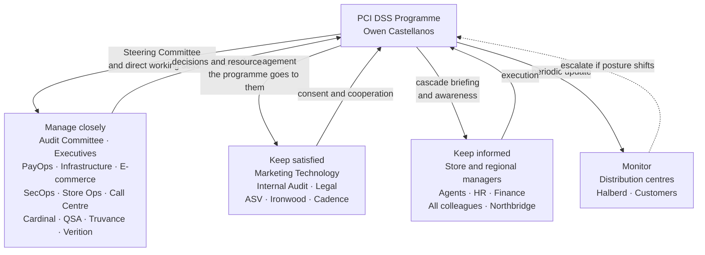

# 01.10 — Stakeholder Register &amp; Engagement

| Field | Value |
|---|---|
| Document ID | MRG-PCI-2026-110 |
| Program | Marketa Retail Group — PCI DSS v4.0.1 Compliance Program |
| Phase | 01 — Program Foundation &amp; PCI Governance |
| Version | 1.0 |
| Status | Approved |
| Owner | Owen Castellanos, Payment Card Compliance Manager |
| Approver | Naomi Bhatt, Chief Information Security Officer |
| Date | 2026-07-15 |
| Classification | Confidential — Cardholder Data Environment // Illustrative Portfolio Sample |

## Purpose

Almost nothing in this programme is delivered by the programme. The people who will actually inspect 1,914 payment terminals, refuse a marketing tag, hold a secure payment session open while a customer finds their card, and produce evidence in November do not report to Naomi Bhatt and were not consulted about the timetable.

This document identifies every group whose cooperation the programme depends on or whose work it disrupts, records what each of them wants and what each of them is being asked to give up, sets out the engagement plan by group, and — most usefully — writes down in advance the objections each group is expected to raise and the answer to each one. Writing the objections down before they are voiced is the difference between a programme that debates the same three points in twelve separate meetings and one that has settled them once.

## 1. Method

Stakeholders are classified on two axes: **influence** over whether the programme succeeds, and **interest** in its outcome. The two are independent, and the most dangerous quadrant is high influence with low interest — a group that can stop the programme without much caring whether it proceeds.

| Classification | Definition | Engagement posture |
|---|---|---|
| **Manage closely** | High influence, high interest | Direct, frequent, two-way. Represented on the Steering Committee |
| **Keep satisfied** | High influence, lower interest | Deliberately cultivated. The programme goes to them; they will not come to it |
| **Keep informed** | Lower influence, high interest | Regular briefing; consulted on design that affects them |
| **Monitor** | Lower influence, lower interest | Periodic awareness; escalate if interest or influence shifts |

Two further attributes are recorded for every group, because they are what actually determine whether engagement works: **what they need from the programme**, and **what the programme needs from them**. A stakeholder plan that only records the second is a demand schedule, and it will be received as one.

## 2. Internal Stakeholder Register

| ID | Stakeholder group | Represented by | Classification | Their interest | What they need from the programme | What the programme needs from them |
|---|---|---|---|---|---|---|
| **S-01** | Board — Audit Committee | Priya Raghunathan | Manage closely | Assurance that a $4.2B retailer's payment exposure is governed | Honest, unfiltered reporting; early warning of any threat to validation | Oversight, challenge, and air cover when an honest finding is unwelcome |
| **S-02** | Executive leadership | Diane Okafor, Raymond Voss, Curtis Lang | Manage closely | Continuity of card acceptance; predictable cost; the acquirer relationship | A credible plan, a stable forecast, no surprises | Funding, mandate, and visible sponsorship at the point where a business unit says no |
| **S-03** | Payment Operations | Elena Marchetti | Manage closely | Settlement, chargebacks and refunds keep working | Controls that do not break daily operations; realistic evidence demands | Business ownership of the CDE; process walkthroughs; the truth about what the team actually does |
| **S-04** | Infrastructure &amp; Network | Trevor Kim | Manage closely | A network they can operate and troubleshoot | Clear scope so segmentation is designed once; protected engineering capacity | Segmentation design and build; MFA; configuration standards; 9 zones delivered by mid-year |
| **S-05** | **E-commerce Engineering** | Sonia Rendell | Manage closely | Release velocity; conversion rate; site stability | Requirements expressed as engineering constraints, not policy prose | 6.4.3 script inventory; 11.6.1 monitoring; control over what executes on payment pages |
| **S-06** | **Marketing Technology** | Function within Merchandising and Digital | **Keep satisfied** | Measurement, personalisation and attribution on the highest-value pages on the site | Advance notice; a workable path to get a legitimate tag approved | Acceptance that payment-page tags become a governed change, not a self-service action |
| **S-07** | Security Operations | Marcus Hale | Manage closely | Signal over noise; tooling that works | Funding for automated log review; scope stability so coverage can be finished | Logging across 71 components; ASV and internal scanning; FIM; incident detection |
| **S-08** | **Store Operations** | Adaeze Nwosu | Manage closely | Selling. Every minute of colleague time is a trading decision | The smallest possible ask, expressed in store language, deliverable on shift | Quarterly inspection of 1,914 terminals; device inventory accuracy; tamper reporting |
| **S-09** | Regional and store managers | Via Adaeze Nwosu, monthly readiness call | Keep informed | Payroll hours; task load; audit outcomes for their region | Tools, training and a task that fits into an existing routine | Actual execution of the inspection cycle in 482 stores |
| **S-10** | **Call Centre** | Bill Traynor | Manage closely | Average handle time; conversion; customer experience | Recognition that the secure payment session costs seconds per call | Zero-tolerance enforcement of the secure payment session; bypass detection |
| **S-11** | Call centre agents | Via Bill Traynor | Keep informed | Getting through the call; hitting targets | Clear rules and a script for the awkward customer moment | Never accepting a spoken card number, even when the customer offers |
| **S-12** | Internal Audit | Rosa Delgado | Keep satisfied | Independent assurance to the Audit Committee | Unfiltered access to evidence and people | An independent October review, timed so its findings can be acted on |
| **S-13** | Legal | Frank Mueller | Keep satisfied | Contractual exposure; provider agreements | Early sight of TPSP agreements and any non-compliant filing decision | 12.8.2 security schedules; advice on statutory obligations, which are separate from PCI DSS |
| **S-14** | Human Resources | HR operations, via Owen Castellanos | Keep informed | Onboarding throughput, especially the seasonal intake | Training that can be delivered inside existing onboarding | 12.6.3 delivery to ~34,000 colleagues plus 6,800 seasonal; 12.7.1 screening records |
| **S-15** | Finance and Procurement | Via Raymond Voss | Keep informed | Spend against the $4.6M envelope; contract terms | Predictable phasing; early notice of variance | Purchase-order velocity that does not delay tooling; PCI schedules in new contracts |
| **S-16** | Distribution centre operations | Via Curtis Lang | Monitor | Throughput; no new IT friction | Confirmation that DC systems are largely out of scope, once proven | Cooperation with discovery scanning and removable-media controls under 5.3.3 |
| **S-17** | All colleagues | Via HR and the awareness programme | Keep informed | Not being blamed for something they were never told | Training that is short, concrete and relevant to their job | Report PAN found where it should not be, under 12.10.7; never write a card number down |

## 3. External Stakeholder Register

| ID | Stakeholder | Relationship owner | Classification | Their interest | What they need from Marketa | What Marketa needs from them |
|---|---|---|---|---|---|---|
| **X-01** | Cardinal Merchant Bank, N.A. | Raymond Voss | Manage closely | Its own exposure to the brands for Marketa's compliance | The AOC by 31 December; ASV attestations within 30 days of quarter end; notification of change and compromise | Confirmation of level and deadlines; acceptance of a dated remediation plan if one is needed |
| **X-02** | Sable Ridge Assurance, LLC — QSA | Owen Castellanos | Manage closely | An assessment it can defend to the Council and the brands | Complete, organised, honest evidence; access to people and systems | Early identification of evidence gaps at the monthly checkpoints, not in November |
| **X-03** | Sable Ridge Scanning Services — ASV | Owen Castellanos | Keep satisfied | Accurate scope for the external scan | A current, complete external IP inventory | Passing scans and attestations inside the 30-day window |
| **X-04** | Ironwood Security Labs | Marcus Hale | Keep satisfied | A well-defined test scope | Clear rules of engagement; a stable environment to test | Honest testing, including of segmentation, and prompt retesting of remediations |
| **X-05** | Truvance Payments, Inc. | Elena Marchetti | Manage closely | Retaining a large merchant; its own compliance posture | Correct integration; timely change notice | Current AOC; responsibility matrix; compromise notification; integration support |
| **X-06** | Cadence Voice Solutions | Bill Traynor | Keep satisfied | Service continuity | Correct agent use of the secure payment session | Current AOC; responsibility matrix; evidence of suppression effectiveness |
| **X-07** | Verition POS Systems | Adaeze Nwosu / Trevor Kim | Manage closely | The P2PE listing and its merchant base | PIM adherence at 482 stores | Continued listing; PIM currency; **support for authenticated scanning on the appliances it locks down** |
| **X-08** | Northbridge Managed Services | Marcus Hale | Keep informed | Contract renewal | Tuned use cases; clean handover | Detection and escalation to service level; cooperation with Marketa's own assessment |
| **X-09** | Halberd Data Destruction | Adaeze Nwosu | Monitor | Collection schedule | Media presented in secured containers | Certificates of destruction and chain-of-custody records |
| **X-10** | Card brands — Visa, Mastercard, American Express, Discover | Indirect, via Cardinal | Keep informed | Programme-wide merchant compliance | Validation reported through the acquirer | Published service-provider registries used for 12.8.4 corroboration |
| **X-11** | Customers | Elena Marchetti / Marketing | Monitor | That paying is safe and easy | Nothing directly; no customer-facing claim is made about PCI status | Tolerance of the few seconds a secure payment session adds |

## 4. The Awkward Ones

Three groups carry a disproportionate share of the programme's delivery risk, not because they are obstructive but because the ask is genuinely costly to them. Pretending otherwise makes the engagement worse, not better.

### 4.1 Store Operations — 482 stores asked to inspect terminals every quarter

**The ask.** Requirement 9.5.1 obliges Marketa to protect POI devices from tampering and substitution: an accurate inventory of every device including make, model, location and serial number (9.5.1.1); periodic inspection of device surfaces to detect tampering and substitution (9.5.1.2), at a frequency Marketa must justify through a targeted risk analysis under 9.5.1.2.1; and training for the personnel who do it (9.5.1.3). Marketa's determined frequency is **quarterly**, across **1,914 terminals in 482 stores**.

**What it costs them.** A store colleague's time is a trading decision. Four inspections a year at 1,914 terminals is roughly 7,700 inspection events, each requiring the colleague to check the device against a reference image, verify the serial number against the inventory, examine seals and cabling, and record the result. It lands on a workforce with high turnover, augmented by 6,800 temporary colleagues during exactly the period when nobody has a spare minute.

**Why it cannot be delegated away.** There is no central control that detects a skimmer glued to a PIN pad in Store 314. The whole of the P2PE scope reduction — the thing that keeps 482 store servers out of the cardholder data environment — rests on the physical integrity of the devices. This is the single control in the programme that cannot be bought.

| Objection expected from Store Operations | The answer |
|---|---|
| "This is corporate work being pushed to the shop floor" | It is shop-floor work. The device is on the shop floor and the tampering happens on the shop floor. What corporate owes the store is a task that takes under two minutes per lane, with a reference image and a one-tap record, and the programme has funded it that way |
| "Our colleagues aren't security people" | They are not being asked to be. They are being asked to notice that a device looks different from the picture, or that a cable now goes somewhere it did not. That is a merchandising skill, and store colleagues are unusually good at it |
| "Quarterly is arbitrary" | It is not arbitrary, and it is documented. **9.5.1.2.1** requires a targeted risk analysis justifying the frequency and type of inspection, taking account of the device location, whether it is attended, and the exposure. That analysis is one of the fourteen produced under 12.3.1, and Store Operations is a contributor to it, not a recipient of it |
| "We can't do this during peak" | Agreed, and the cycle is designed around that. The quarterly cadence is set so that inspections fall outside the October-to-January freeze wherever possible, and the Q4 cycle runs before the seasonal intake arrives |
| "What happens when we find something?" | Report it the same day and stop using the lane. **No store colleague is ever penalised for reporting a suspected tamper that turns out to be maintenance.** Six such reports in Q3 2026 were all cleared as legitimate maintenance, and all six were the right call |
| "Whose budget?" | The programme's. Training materials, reference imagery and the inspection tooling are funded from the $95,000 awareness and training line and the tooling line, not from store payroll |

**Engagement mechanism.** A monthly store readiness call chaired by Adaeze Nwosu with regional managers; inspection built into the existing shift-opening routine rather than created as a new task; regional-level completion reporting, visible to district leadership, because store operations manages by comparison and always has.

### 4.2 E-Commerce Engineering — and the marketing colleagues who lose self-service tagging

**The ask.** Requirement **6.4.3** obliges Marketa to maintain an inventory of every script executing in the consumer's browser on a payment page, to have written justification and authorisation for each, and to assure the integrity of each. Requirement **11.6.1** obliges Marketa to detect and alert on unauthorised modification of HTTP headers and page content on payment pages, checked at least weekly. Both became mandatory on 31 March 2025.

**What it costs.** Marketa's payment pages run **38 scripts across 6 templates, 11 of them third-party**. Today, tags reach those pages through a marketing tag manager that permits self-service publication. After 6.4.3, they cannot: a tag on a payment page becomes a change requiring justification, authorisation and integrity assurance. Marketing loses an hour-to-live capability and gains a change queue. E-commerce Engineering gains a control they must build, operate and answer for.

The honest framing is that **this is a real loss of capability for a team that did nothing wrong**, and it is being imposed because of a threat model those colleagues have never been briefed on.

| Objection expected | The answer |
|---|---|
| "The PAN goes to Truvance, so the payment page isn't in scope" | The PAN's transport is protected. The **page** is not. A skimmer that overlays a fake form on Marketa's own page collects card numbers that never reach the iframe at all, and the iframe cannot see it happen. 6.4.3 and 11.6.1 exist precisely for this architecture |
| "This will destroy our conversion measurement" | It restricts **payment pages**, which are 6 templates. Every other page on the site is unaffected. Measurement of the funnel up to the payment step is untouched, and payment-step outcomes are available from order data |
| "How long will approval take?" | Target of five business days for a routine tag, same-day for an emergency with the CISO's approval. That is the commitment, it is measured, and if it slips the programme has broken its own bargain |
| "We already have a tag manager with governance" | The first inventory found **3 of 38 scripts unauthorised** — a tag manager injecting two undeclared third-party scripts that nobody had approved and nobody could name. The governance existed on paper. That is the evidence, and it is not a criticism of anyone; it is what self-service tagging does at scale |
| "Weekly checking will generate noise" | 11.6.1 sets a floor of weekly. Marketa's implementation alerts within 24 hours of an unauthorised change, and the noise is managed by having an authoritative inventory to compare against — which is exactly what 6.4.3 produces. The two requirements are one control |
| "Can we get an exception for a partner tag?" | Yes, through authorisation — that is what "authorised" means in 6.4.3. What cannot happen is a tag arriving on a payment page without anybody deciding it should |

**Engagement mechanism.** A joint working session between E-commerce Engineering and Marketing Technology before the control is built, not after; the approval path designed with marketing in the room; the script inventory published so that marketing can see what is already there; and a standing item at the weekly PCI Working Group for approval-queue latency.

### 4.3 The Call Centre — 310 agents, 2.1 million transactions, and a few seconds per call

**The ask.** Every telephone payment goes through the Cadence secure payment session. No agent ever hears, types, writes or repeats a card number. There is no "just this once."

**What it costs.** Seconds per call, multiplied by 2.1 million calls, on a function measured by average handle time. It also costs agents the ability to help a struggling customer in the way that feels most natural — reading the number back, taking it verbally when the keypad does not work, offering to enter it for them.

**Why the pressure to bypass is structural.** The bypass is not laziness. It is an agent trying to rescue a sale for a confused customer, under a handle-time target, with a customer who is offering to read the number out. The programme's position is that this makes bypass a **management problem, not a discipline problem** — if agents are rewarded for a metric that the control degrades, some of them will defeat the control.

| Objection expected | The answer |
|---|---|
| "This adds handle time and we're measured on it" | Correct, and the metric moves with it. Bill Traynor and the programme have agreed that secure-payment-session time is excluded from the agent's handle-time measure. If the metric were left unchanged, the programme would be paying agents to bypass the control |
| "Customers get confused and abandon" | Some do. The mitigation is a scripted, confident explanation delivered early in the payment step rather than apologetically at the end, and an agent who stays on the line throughout. Abandonment at the payment step is monitored and reported to the Steering Committee |
| "What if the keypad genuinely doesn't work?" | The call is transferred to the hosted checkout link or completed online. There is no verbal fallback. A documented alternative path is what prevents an undocumented one |
| "We used to take numbers verbally and nothing happened" | Something did happen: it went into the call recordings. Whether historical recordings contain account data is one of the questions Phase 02 exists to answer, and the possibility is exactly why the archive is being scanned rather than assumed clean |
| "Can supervisors override for a VIP customer?" | No. An override capability is a bypass with a nicer name, and the first thing an assessor asks about a control is who can turn it off |
| "Are we being monitored?" | Yes, and openly. Session-initiation rates are compared against payment volumes, and calls are sampled. Monitoring is announced, not covert — agents are told what is measured and why |

**Engagement mechanism.** Briefing delivered by Bill Traynor to team leaders first and agents second; scripting workshopped with agents rather than issued to them; the handle-time exclusion agreed and communicated **before** the enforcement message, because the sequence is the message.

## 5. Consolidated Objection Register

| ID | Group | Objection | Owner of the answer | Answer in one line | Where it is settled |
|---|---|---|---|---|---|
| OB-01 | Store Operations | Corporate work pushed to stores | Adaeze Nwosu | The device is in the store; the task is under two minutes and funded centrally | Store readiness call |
| OB-02 | Store Operations | Quarterly frequency is arbitrary | Naomi Bhatt | Justified by a targeted risk analysis under 9.5.1.2.1, with store input | Phase 07 risk analyses |
| OB-03 | Store managers | Peak trading conflict | Adaeze Nwosu | Cycle scheduled around the freeze; Q4 cycle before the seasonal intake | 01.11 calendar |
| OB-04 | E-commerce | Payment pages are out of scope because the PAN is not ours | Sonia Rendell | The page is in scope under 6.4.3 and 11.6.1 regardless of where the PAN goes | 01.01 §6; Phase 04 |
| OB-05 | Marketing Technology | Loss of self-service tagging | Sonia Rendell | Restricted to 6 payment templates; five-day approval commitment, measured | Joint working session |
| OB-06 | Marketing Technology | Existing tag governance is adequate | Naomi Bhatt | 3 of 38 scripts were unauthorised at first inventory | Script inventory, Phase 04 |
| OB-07 | Call centre | Handle-time impact | Bill Traynor | Secure-session time excluded from the agent measure | Agreed before enforcement |
| OB-08 | Call centre agents | Customer confusion and abandonment | Bill Traynor | Scripted early explanation; abandonment monitored and reported | Steering Committee |
| OB-09 | Call centre | Supervisor override for exceptions | Naomi Bhatt | No override exists. A documented alternative path replaces it | MOTO channel procedure |
| OB-10 | Infrastructure | Competing IT priorities | Curtis Lang | Sequencing arbitrated at the Steering Committee; capacity protected in the plan | Monthly Steering Committee |
| OB-11 | Payment Operations | Evidence collection burden | Owen Castellanos | Evidence templates supplied; collection scheduled, not requested ad hoc | Weekly Working Group |
| OB-12 | HR | Training 6,800 seasonal colleagues at peak | Owen Castellanos | Training embedded in existing onboarding; 95% bar set with the constraint in mind | 12.6.3 delivery plan |
| OB-13 | Finance | Cost of tooling for a small CDE | Raymond Voss | The CDE is small **because** of the discovery spend; the tooling is what keeps it small | Charter budget |
| OB-14 | Distribution centres | Discovery scanning on operational systems | Marcus Hale | Read-only scanning, scheduled outside peak windows, with rollback tested | Phase 02 planning |
| OB-15 | Verition | Reluctance to enable authenticated scanning on locked appliances | Trevor Kim | Escalated as a contractual matter; carried as an open constraint from day one | Vendor escalation; CON-03 |

## 6. Engagement Plan

| Stakeholder group | Channel | Cadence | Owner | Core message |
|---|---|---|---|---|
| Audit Committee | Formal report and presentation | Quarterly, plus out-of-cycle on material events | Raymond Voss and Naomi Bhatt jointly; Rosa Delgado separately | Validation forecast, material risks, honest findings |
| Executive leadership | Steering Committee | Monthly | Raymond Voss | Status against plan; decisions required |
| Requirement owners | PCI Working Group | Weekly | Owen Castellanos | Blockers, evidence readiness, dates |
| Requirement owners | One-to-one | Fortnightly | Naomi Bhatt | Individual accountability and support |
| Store Operations leadership | Store readiness call | Monthly | Adaeze Nwosu | Inspection completion by region; issues from the field |
| Regional and store managers | Operations cascade and district calls | Monthly during rollout | Adaeze Nwosu | What to do, how long it takes, how to report |
| Store colleagues | Shift briefing plus embedded training | On deployment; refreshed annually and at seasonal intake | Store managers | Look at the device; report anything different, same day |
| E-commerce Engineering | Sprint planning integration | Every sprint | Sonia Rendell | Requirements as engineering constraints with acceptance criteria |
| Marketing Technology | Joint working session, then standing forum | Fortnightly from design through go-live | Sonia Rendell | What changes, when, and how to get a tag approved |
| Call centre team leaders | Leader briefing | Before agent rollout, then monthly | Bill Traynor | Why the control exists; the handle-time exclusion |
| Call centre agents | Team huddles and side-by-side coaching | At rollout; ongoing coaching | Team leaders | The script, the alternative path, and the no-exceptions rule |
| All colleagues | Awareness training under 12.6.3 | On hire and at least annually | Owen Castellanos with HR | Never write down a card number; report PAN found anywhere unexpected |
| Legal and Finance | Working sessions | As required, minimum monthly | Owen Castellanos | Agreements, spend, and decisions needing counsel |
| Internal Audit | Independent access | Continuous; formal review October 2026 | Rosa Delgado | Unfiltered evidence access |
| Cardinal Merchant Bank | Written correspondence and scheduled calls | Quarterly, plus obligation-driven notifications | Raymond Voss | Status, submissions, and early warning |
| QSA | Interim checkpoint | Monthly from 2026-03 | Owen Castellanos | Evidence gaps found in March, not November |
| TPSPs | TPSP review forum | Quarterly | Owen Castellanos | Validation status, matrices, changes |

## 7. Engagement Principles

| Principle | What it means in practice |
|---|---|
| **Go to them** | Engagement happens in the store readiness call, the sprint planning session and the agent huddle — in the forums those groups already attend. A programme that only meets in its own forums talks to itself |
| **Name the cost** | Every ask states what it costs the receiving team. A programme that pretends its controls are free loses credibility on the first day of rollout and never recovers it |
| **Change the metric before you change the behaviour** | The handle-time exclusion was agreed before the call-centre enforcement message. Asking people to defeat their own targets is a design error, not a compliance problem |
| **Answer the objection once, in writing** | The register in §5 exists so that the same question is not relitigated in twelve meetings with twelve slightly different answers |
| **Never punish a report** | No store colleague, agent or engineer is penalised for reporting a suspected tamper, a bypass or a card number found somewhere unexpected. Requirement **12.10.7** depends entirely on people telling the programme things it would rather not hear |
| **Make no external claim** | Nothing customer-facing asserts a PCI status. There is no such thing as PCI DSS certification for a merchant, and marketing language that implies one creates exposure with no upside |

## 8. Measuring Whether Engagement Is Working

Engagement is measured by behaviour, not by attendance. Sentiment surveys are not used; the following are.

| Indicator | What it tells the programme | Target | Reported to |
|---|---|---|---|
| 9.5.1 inspection completion by region | Whether stores are actually doing it | 100% of scheduled inspections per cycle | Store readiness call; Steering Committee |
| Tamper reports raised, including false positives | Whether colleagues feel safe reporting | A non-zero and steady rate. **A sudden drop to zero is a warning sign, not a success** | Steering Committee |
| Secure payment session initiation rate against MOTO volume | Whether agents are using the control | Parity within tolerance; every gap investigated | Call centre monthly |
| Payment-page tag approval latency | Whether the programme is keeping its own bargain with marketing | 5 business days routine | Weekly Working Group |
| Unauthorised scripts detected after go-live | Whether the new process is holding | Zero sustained; any detection investigated within 24 hours | Steering Committee |
| 12.6.3 training completion | Reach across ~34,000 plus seasonal | ≥ 95% (charter bar) | Steering Committee; Audit Committee |
| Evidence supplied on first request during QSA fieldwork | Whether the organisation is genuinely ready | Majority first-time; repeat requests analysed | QSA checkpoint |
| Reports of PAN found where unexpected, under 12.10.7 | Whether the message landed with 34,000 people | Non-zero. Each one is a control working, not a failure | Steering Committee |

## Cross-References

| Reference | Relevance |
|---|---|
| 01.01 — Company Profile &amp; Payment Channels | The three channels these groups operate |
| 01.06 — Program Charter &amp; Objectives | Governance forums referenced in the engagement plan |
| 01.07 — Roles, Responsibilities &amp; RACI | Named accountability behind each stakeholder group |
| 01.09 — Third-Party Service Provider Register | External stakeholders X-05 to X-09 |
| 01.11 — Compliance Calendar &amp; Obligations | The recurring asks these groups will carry |
| Phase 05 — Access Control &amp; Physical Security | The 9.5.1 programme Store Operations delivers |
| Phase 07 — Security Policy, Risk &amp; Incident Response | Awareness under 12.6.3 and reporting under 12.10.7 |

---
[⬅ Previous](01.09-third-party-service-provider-register.md) · [🏠 Phase 01 Home](01.00-README.md) · [Next ➡](01.11-compliance-calendar-and-obligations.md)
