# 01.11 — Compliance Calendar &amp; Obligations

| Field | Value |
|---|---|
| Document ID | MRG-PCI-2026-111 |
| Program | Marketa Retail Group — PCI DSS v4.0.1 Compliance Program |
| Phase | 01 — Program Foundation &amp; PCI Governance |
| Version | 1.0 |
| Status | Approved |
| Owner | Owen Castellanos, Payment Card Compliance Manager |
| Approver | Naomi Bhatt, Chief Information Security Officer |
| Date | 2026-07-15 |
| Classification | Confidential — Cardholder Data Environment // Illustrative Portfolio Sample |

## Purpose

PCI DSS is not an annual event. A large proportion of its requirements are **periodic obligations** — things that must happen daily, weekly, monthly, quarterly, semi-annually or annually, and which must be evidenced as having happened at that frequency across the whole assessment period. A merchant who implements every control in October and is assessed in November has not complied; it has staged a demonstration.

This document is the programme's recurring obligation register. It records every periodic requirement applicable to Marketa with its frequency, whether that frequency is fixed by the standard or defined by Marketa, the accountable owner, the evidence artefact produced, and the requirement reference. It then adds Cardinal Merchant Bank's contractual obligations **C1 to C10**, and lays the whole of 2026 out month by month against the October-to-January seasonal change freeze.

The charter's second principle — *continuous compliance, evidenced annually* — is operationalised here. Phase 09 inherits this calendar and runs it after the programme closes.

## 1. Two Kinds of Frequency

Getting this distinction right is a v4.0.1 competence test in itself.

| Kind | What it means | Marketa's obligation | Consequence of getting it wrong |
|---|---|---|---|
| **Standard-defined** | The requirement states the frequency: daily, weekly, every three months, every six months, every twelve months | Perform at that frequency and evidence it | A missed cycle is a finding. The frequency is not negotiable |
| **Entity-defined** | The requirement permits the entity to set the frequency, based on a **targeted risk analysis performed in accordance with 12.3.1** | Perform the analysis, document the justification, set the frequency, perform at it, and review the analysis at least every 12 months | A frequency chosen without a documented targeted risk analysis fails **12.3.1** even if the frequency itself is sensible. This is one of the most common v4 findings |

The second row is new in v4 and is why Marketa produces **14 targeted risk analyses**. A frequency that "we've always done quarterly" is not a justification; it is a habit with a number attached.

## 2. Daily and Continuous Obligations

| Ref | Obligation | Frequency | Set by | Owner | Evidence artefact |
|---|---|---|---|---|---|
| **10.4.1** | Review audit logs of all security events; logs of all system components that store, process or transmit account data; logs of critical system components; and logs of servers performing security functions | **Daily** | Standard | Marcus Hale | Daily review record; SIEM case history |
| **10.4.1.1** | Use **automated mechanisms** to perform the 10.4.1 review | Continuous | Standard (future-dated, now mandatory) | Marcus Hale | SIEM correlation rule set; automated review configuration and output |
| **10.4.3** | Address exceptions and anomalies identified during review | On identification | Standard | Marcus Hale | Investigation records; case closure notes |
| **10.7.2 / 10.7.3** | Detect, alert on, and promptly respond to failures of critical security control systems | Continuous; response prompt | Standard | Marcus Hale | Failure alerts; response records with cause and duration |
| **12.10.5** | Include monitoring and responding to alerts from security monitoring systems in the incident response plan | Continuous | Standard | Marcus Hale | IR plan; alert-handling records |
| 10.6.1–10.6.3 | Time synchronisation across in-scope components | Continuous | Standard | Trevor Kim | NTP configuration; drift monitoring |
| Out-of-hours | Northbridge Managed Services detection, triage and escalation | Continuous outside SOC hours | Contract | Marcus Hale | Northbridge shift reports; escalation records |

## 3. Weekly, Monthly and Semi-Annual Obligations

| Ref | Obligation | Frequency | Set by | Owner | Evidence artefact |
|---|---|---|---|---|---|
| **11.6.1** | Change- and tamper-detection over payment pages, alerting on unauthorised modification of HTTP headers and page content | **At least weekly** (Marketa alerts within 24 hours) | Standard floor; Marketa's tighter cadence justified by targeted risk analysis | Sonia Rendell | Monitoring configuration; alert log; weekly evaluation record |
| **11.5.2** | Change-detection mechanism on critical files, with comparisons performed at least weekly | Weekly | Standard | Marcus Hale | FIM configuration; comparison output |
| **6.3.3** | Install critical and high-security patches within one month of release; other patches within an entity-defined period | Monthly for critical/high | Standard for critical; **entity-defined** for the remainder | Trevor Kim | Patch compliance report; exception register |
| **6.4.3** | Confirm the payment-page script inventory remains complete, authorised and integrity-assured | On every change; reconciled monthly | Standard on change; monthly reconciliation is Marketa's control | Sonia Rendell | Script inventory with justification and authorisation per script |
| **8.2.6** | Remove or disable inactive user accounts within 90 days of inactivity | Monthly sweep | Standard threshold | Trevor Kim | Inactive-account report and action log |
| **1.2.7** | **Review configurations of network security controls** to confirm they remain relevant and effective | **At least once every six months** | Standard | Trevor Kim | Rule-set review record; removals and justifications |
| **7.2.4** | Review all user accounts and related access privileges, confirm appropriateness, and address inappropriate access | **At least once every six months** | Standard | Elena Marchetti | Access review record with manager sign-off |
| 12.5.1 | Reconcile the inventory of in-scope system components | Monthly | Marketa's control | Owen Castellanos | Assessed-component register reconciliation |
| Governance | PCI Steering Committee | Monthly | Charter | Raymond Voss | Minutes; decision log |
| Governance | PCI Working Group | Weekly | Charter | Owen Castellanos | Actions log |
| Governance | QSA interim checkpoint | Monthly from 2026-03 | Charter | Owen Castellanos | Checkpoint notes; evidence gap list |
| Governance | Store operations readiness call | Monthly | Charter | Adaeze Nwosu | Regional completion reporting |

## 4. Quarterly Obligations

| Ref | Obligation | Frequency | Set by | Owner | Evidence artefact |
|---|---|---|---|---|---|
| **11.3.2** | **External vulnerability scans by an ASV** — passing scans required | At least once every three months, and after any significant change | Standard | Owen Castellanos with Sable Ridge Scanning Services | ASV scan report and **Attestation of Scan Compliance** |
| **11.3.2.1** | External scans after significant change until a passing result is obtained. **These may be performed by qualified internal or external personnel; an ASV is not required for the change-driven scan** | On significant change | Standard | Marcus Hale | Change-driven scan report |
| **11.3.1** | **Internal vulnerability scans**, with high-risk and critical vulnerabilities resolved and rescans performed | At least once every three months | Standard | Marcus Hale | Internal scan reports; rescan evidence |
| **11.3.1.2** | Internal scans performed via **authenticated** scanning | Every three months, with each scan | Standard (future-dated, now mandatory) | Marcus Hale | Authenticated scan configuration and results; documented exceptions |
| **11.3.1.3** | Internal scans after any significant change | On significant change | Standard | Marcus Hale | Change-driven scan report |
| **11.2.1 / 11.2.2** | Detect and identify authorised and unauthorised wireless access points; maintain the inventory | At least once every three months | Standard | Trevor Kim | Wireless detection results; authorised AP inventory |
| **9.5.1.2** | **Periodic inspection of POI device surfaces** to detect tampering and substitution, across **1,914 terminals in 482 stores** | **Quarterly** | **Entity-defined**, justified by targeted risk analysis under **9.5.1.2.1** | Adaeze Nwosu | Per-terminal inspection records; discrepancy reports and resolutions |
| **3.2.1** | Verify that stored account data exceeding the defined retention period has been securely deleted or rendered unrecoverable | At least once every three months | Standard | Elena Marchetti | Retention verification record |
| **12.8.1 / 12.8.5** | TPSP review forum — validation status and responsibility matrices for all five providers | Quarterly (Marketa's cadence; the 12.8.4 minimum is annual) | Marketa, above the standard floor | Owen Castellanos | TPSP forum minutes; updated register |
| Governance | Audit Committee report | Quarterly | Charter | Raymond Voss and Naomi Bhatt | Board paper; minutes |
| **C4** | Submit ASV attestation to Cardinal Merchant Bank | Within **30 days of each quarter end** | Acquirer | Owen Castellanos | Submission confirmation |

> **The quarterly ASV scan is the obligation that most often quietly fails.** It fails not because scans are not run but because a quarter passes without a **passing** scan on record. Marketa's Q1 2026 scan failed with three findings and was rescanned clean in eleven days — which is a pass for the quarter, correctly evidenced. A quarter that ends with only a failing scan cannot be repaired retrospectively.

## 5. Annual Obligations

| Ref | Obligation | Frequency | Set by | Owner | Evidence artefact |
|---|---|---|---|---|---|
| **11.4.2** | **Internal penetration testing** per the defined methodology, with exploitable vulnerabilities corrected and testing repeated | At least once every 12 months | Standard | Marcus Hale | Ironwood internal test report; retest evidence |
| **11.4.3** | **External penetration testing** | At least once every 12 months **and after any significant infrastructure or application upgrade or change** | Standard | Marcus Hale | Ironwood external test report |
| **11.4.4** | Correct exploitable vulnerabilities and security weaknesses found by penetration testing, and repeat testing to verify | On finding | Standard | Marcus Hale | Remediation records; retest reports |
| **11.4.5** | **Segmentation testing** — confirm that segmentation controls isolating the CDE from out-of-scope systems are operational and effective | **At least once every 12 months and after any change to segmentation controls or methods** | Standard | Trevor Kim with Ironwood Security Labs | Segmentation test report; scope of the test; remediation and re-test |
| **11.4.1** | Define, document and implement the penetration testing methodology | Reviewed at least every 12 months | Standard | Marcus Hale | Methodology document |
| **12.5.2** | **Scope of PCI DSS is documented and confirmed** | **At least once every 12 months and upon significant change** to the in-scope environment | Standard | Naomi Bhatt | Scope confirmation document; assessed-component register |
| **12.3.1** | **Targeted risk analyses** for every entity-defined frequency, reviewed and updated | At least once every 12 months | Standard | Naomi Bhatt | 14 targeted risk analyses |
| **12.3.2** | Targeted risk analysis supporting each customized approach | At least once every 12 months | Standard | Naomi Bhatt | 8.3.9 targeted risk analysis and Appendix E1 controls matrix |
| **12.3.3** | Review cryptographic cipher suites and protocols in use, and document the plan to respond to anticipated changes | At least once every 12 months | Standard | Trevor Kim | Cryptographic inventory and review record |
| **12.3.4** | Review hardware and software technologies in use for continued vendor support and for security risk | At least once every 12 months | Standard | Trevor Kim | Technology currency review; end-of-life plan |
| **12.6.3** | **Security awareness training** for all personnel | Upon hire and **at least once every 12 months** | Standard | Owen Castellanos with HR | Completion records — **97.1% achieved against a 95% charter bar** |
| **12.6.2** | Review the security awareness programme for currency and to address new threats | At least once every 12 months | Standard | Owen Castellanos | Programme review record |
| **12.6.3.1 / 12.6.3.2** | Training covering phishing and social engineering, and acceptable use of end-user technologies | At least once every 12 months | Standard | Owen Castellanos | Training content and completion records |
| **12.10.2** | **Review and test the incident response plan**, including all elements listed in 12.10.1 | At least once every 12 months | Standard | Naomi Bhatt | Exercise report; plan revision history |
| **12.10.6** | Modify and evolve the incident response plan according to lessons learned and industry developments | At least once every 12 months | Standard | Naomi Bhatt | Revision record with lessons-learned traceability |
| **12.10.4** | Train personnel with incident response responsibilities | Periodically — **frequency entity-defined under 12.10.4.1** | Entity-defined | Marcus Hale | IR training records |
| **12.1.2** | Review the information security policy and update as needed | At least once every 12 months | Standard | Naomi Bhatt | Policy review record; version history |
| **12.8.4** | **Monitor TPSPs' PCI DSS compliance status** | At least once every 12 months | Standard | Owen Castellanos | Validation review memo; AOCs; registry corroboration |
| **9.4.5.1** | Perform inventories of electronic media with cardholder data | At least once every 12 months | Standard | Adaeze Nwosu | Media inventory record |
| **9.5.1.1** | Maintain an up-to-date list of POI devices — make, model, location, serial number | Continuously; reconciled annually | Standard | Adaeze Nwosu | Device inventory reconciliation |
| **9.5.1.3** | Train personnel in POI environments to be aware of attempted tampering or replacement | On hire and at least annually | Standard | Adaeze Nwosu | Store training records |
| **4.2.1.1** | Maintain an inventory of trusted keys and certificates protecting PAN in transit | Maintained; reviewed at least annually | Standard | Trevor Kim | Certificate inventory |
| **12.7.1** | Screen personnel prior to hire for roles with access to the CDE | Prior to hire | Standard | HR with Owen Castellanos | Screening records |
| **Level 1 validation** | On-site assessment by a QSA producing a **ROC**, and an **AOC** | Annual | Card brand programmes via Cardinal | Owen Castellanos | ROC; signed AOC |
| **C3** | Submit the executed AOC to Cardinal Merchant Bank | **On or before 31 December** | Acquirer | Raymond Voss (signature); Owen Castellanos (submission) | Submission confirmation |
| **C9** | Provide TPSP AOCs to Cardinal on request | Annual and on request | Acquirer | Owen Castellanos | TPSP AOC register |

### Requirements deliberately recorded as not applicable

| Ref | Obligation | Why it does not apply to Marketa |
|---|---|---|
| **12.5.2.1** | Scope confirmation every **six** months | Service-provider requirement. Marketa is a merchant |
| **12.5.3** | Review of the impact of significant organisational change on scope | Service-provider requirement |
| **12.4.2** | Quarterly reviews confirming personnel are performing security tasks | Service-provider requirement |
| **11.4.6** | Segmentation testing every **six** months | Service-provider requirement. **11.4.5** — annual and on change — is the merchant obligation, and adopting 11.4.6 by mistake would commit Marketa to an obligation it does not have |
| Appendix **A1** | Multi-tenant service provider requirements | Marketa is not a service provider |
| Appendix **A3** | Designated Entities Supplemental Validation | Applies only on designation by a brand or acquirer. Cardinal has made none |

## 6. The Entity-Defined Frequencies and Their Targeted Risk Analyses

Fourteen targeted risk analyses are produced under 12.3.1 and 12.3.2. Ten are required by a specific requirement; four are elective, performed because the underlying judgement is a risk decision even where the standard does not compel the analysis.

| # | Requirement | The frequency or parameter being set | Marketa's determination | Owner |
|---|---|---|---|---|
| 1 | **5.2.3.1** | Frequency of periodic evaluations of system components not commonly affected by malware | Annual evaluation, with re-evaluation on platform change | Marcus Hale |
| 2 | **5.3.2.1** | Frequency of periodic malware scans where continuous behavioural analysis is not used | Weekly full scan on the relevant population | Marcus Hale |
| 3 | **7.2.5.1** | Frequency of review of application and system account access | Every six months, aligned to the 7.2.4 user review | Elena Marchetti |
| 4 | **8.6.3** | Frequency and complexity of password changes for application and system accounts | Determined per account class; documented in the analysis | Trevor Kim |
| 5 | **9.5.1.2.1** | Frequency and type of POI device inspections | **Quarterly**, full visual and serial verification at all 1,914 terminals | Adaeze Nwosu |
| 6 | **10.4.2.1** | Frequency of periodic log review for system components not covered by 10.4.1 | Monthly, risk-weighted by component class | Marcus Hale |
| 7 | **11.3.1.1** | Frequency of addressing **all other applicable vulnerabilities** not ranked high or critical | Bounded remediation windows by rank; reviewed monthly | Marcus Hale |
| 8 | **11.6.1** | Frequency of the payment-page change- and tamper-detection evaluation | Continuous monitoring with alerting inside **24 hours**, exceeding the weekly floor | Sonia Rendell |
| 9 | **12.10.4.1** | Frequency of training for incident response personnel | Semi-annual for the core team; annual for the extended roster | Marcus Hale |
| 10 | **12.3.2** | The **customized approach** for 8.3.9 — password change frequency replaced by continuous behavioural authentication analytics | Applies to the residual in-scope population where a password remains the sole factor | Trevor Kim |
| 11 | *Elective* — 6.3.3 | Time frame for applying non-critical security patches | Risk-ranked windows by component class | Trevor Kim |
| 12 | *Elective* — 11.4.5 | Whether annual segmentation testing is sufficient given the rate of network change | Annual plus mandatory testing after any segmentation change | Trevor Kim |
| 13 | *Elective* — 12.8.4 | Whether annual TPSP monitoring is sufficient | Annual formal review plus quarterly status check | Owen Castellanos |
| 14 | *Elective* — 12.5.2 | What constitutes a "significant change" triggering scope reconfirmation | Defined trigger list, applied through change control | Naomi Bhatt |

## 7. Cardinal Merchant Bank Obligations in the Calendar

| # | Obligation | Trigger | Deadline | Owner |
|---|---|---|---|---|
| **C1** | Maintain full compliance with PCI DSS at all times | Continuous | Ongoing | Naomi Bhatt |
| **C2** | Validate annually as a Level 1 merchant by on-site assessment | Annual cycle | Annual | Owen Castellanos |
| **C3** | Submit the executed AOC | Annual | **31 December** | Raymond Voss / Owen Castellanos |
| **C4** | Submit quarterly ASV attestations | Quarter end | **Within 30 days** | Owen Castellanos |
| **C5** | Notify a suspected or confirmed account data compromise | On determination | **Within 24 hours** | Naomi Bhatt |
| **C6** | Notify before engaging a new third-party service provider | Pre-engagement | **Before engagement** | Owen Castellanos |
| **C7** | Notify material change to the CDE, channels or processing arrangements | On change | **Within 30 days** | Elena Marchetti |
| **C8** | Maintain and evidence quarterly POI device inspection | Quarterly | Quarterly | Adaeze Nwosu |
| **C9** | Provide TPSP AOCs on request | Annual and on request | On request | Owen Castellanos |
| **C10** | Cooperate with any brand-mandated forensic investigation | On demand | As directed | Frank Mueller / Naomi Bhatt |

```mermaid
flowchart LR
    Q1["Q1<br/>ASV scan · internal scan<br/>POI inspection cycle 1<br/>wireless detection"] --> S1["Submit ASV attestation<br/>by 30 April"]
    Q2["Q2<br/>ASV scan · internal scan<br/>POI inspection cycle 2<br/>NSC review 1.2.7<br/>access review 7.2.4"] --> S2["Submit ASV attestation<br/>by 30 July"]
    Q3["Q3<br/>ASV scan · internal scan<br/>POI inspection cycle 3<br/>penetration testing"] --> S3["Submit ASV attestation<br/>by 30 October"]
    Q4["Q4<br/>ASV scan · internal scan<br/>POI inspection cycle 4<br/>NSC review · access review"] --> S4["Submit ASV attestation<br/>by 30 January"]
    S1 --> Q2
    S2 --> Q3
    S3 --> Q4
    ANN["Annual layer<br/>12.5.2 scope confirmation<br/>12.3.1 risk analyses<br/>12.6.3 awareness<br/>12.10.2 IR testing<br/>12.8.4 TPSP review"] -.-> Q1
    ANN -.-> Q4
    S4 --> AOC["Annual AOC<br/>to Cardinal<br/>by 31 December"]
```

## 8. The 2026 Calendar Month by Month

The freeze runs **October to January**. It is shown against every month because it is the single most consequential planning constraint in the year, and because two freeze periods touch 2026 — the tail of the 2025–26 freeze in January, and the start of the 2026–27 freeze in October.

| Month | Recurring obligations due | Programme milestone | Freeze status and its effect |
|---|---|---|---|
| **January** | Q4 2025 ASV attestation to Cardinal by 30 Jan; daily log review; weekly payment-page checks | **Kickoff 2026-01-12**; QSA engaged | **In freeze.** No store-side change possible — which is exactly why kickoff, scoping preparation and governance set-up were scheduled here. The freeze was used, not fought |
| **February** | Daily and weekly obligations | **Scope analysis and PAN discovery complete**; 12.5.2 determination drafted | **Freeze ends.** Discovery scanning of store systems begins as soon as it lifts |
| **March** | **Q1 ASV scan** — initially failed with 3 findings, clean rescan in 11 days; Q1 internal scan; **Q1 POI inspection cycle**; wireless AP detection | Segmentation design finalised; **QSA monthly checkpoints begin** | Open. First store-side activity of the year |
| **April** | Q1 ASV attestation to Cardinal by 30 Apr; monthly patch cycle | **Control implementation begins** across Requirements 1–12 | Open |
| **May** | Daily, weekly and monthly obligations | **First segmentation penetration test — FAILED.** Remediation begins | Open. The failure lands with four clear months before the freeze — the reason it was scheduled here |
| **June** | **Q2 ASV scan** — passed first time; Q2 internal scan; **Q2 POI inspection cycle**; wireless detection; **1.2.7 NSC configuration review**; **7.2.4 access review** | **Segmentation re-test — passed.** Material change notified to Cardinal under C7 | Open. Heaviest recurring month of the year |
| **July** | Q2 ASV attestation by 30 Jul; monthly obligations | **Control implementation complete 2026-07-31**; policy suite and targeted risk analyses in progress | Open. The hard deadline for anything needing to be observable during fieldwork |
| **August** | Daily, weekly and monthly obligations | **Payment-page script inventory complete and 11.6.1 monitoring live** — 3 of 38 scripts found unauthorised and removed | Open. Last full month for store-side change |
| **September** | **Q3 ASV scan** — passed; Q3 internal scan; **Q3 POI inspection cycle** — 6 terminals with seal discrepancies, all cleared as maintenance; wireless detection | **Application penetration test — 19 findings** (2 Critical, 5 High, 7 Medium, 5 Low) | Open until 30 Sep. **All store-side change must complete this month** |
| **October** | Q3 ASV attestation by 30 Oct; **12.6.3 awareness completion push before the seasonal intake**; 12.10.2 IR plan test | **Internal audit by Rosa Delgado — 7 recommendations, 0 Critical.** Penetration test findings remediated and retested | **Freeze begins.** Assessment and review activity continues; change does not. Seasonal intake of up to 6,800 begins |
| **November** | Daily, weekly and monthly obligations; evidence production | **QSA on-site fieldwork 2026-11-02 to 2026-11-20** | In freeze. Fieldwork is observation, not change — which is why it can run inside the freeze at all |
| **December** | **Q4 ASV scan**; Q4 internal scan; **Q4 POI inspection cycle**; wireless detection; **1.2.7 NSC review**; **7.2.4 access review**; **C3 AOC due 31 Dec** | **ROC and AOC issued 2026-12-11** — non-compliant on 2 requirements with remediation dated 2027-01-31. **Board and Audit Committee report 2026-12-17** | In freeze, at peak trading. The Q4 POI inspection cycle is executed by a workforce that includes recent seasonal joiners — the reason 9.5.1.3 training is embedded in seasonal onboarding |

### And into 2027

| Month | Obligation | Milestone | Freeze |
|---|---|---|---|
| **January 2027** | Q4 2026 ASV attestation to Cardinal by 30 Jan | **Remediation complete 2027-01-31** | In freeze until end of January — which is precisely why the remediation date is the last day of the month. The 11.3.1.2 work touches vendor-locked appliances in the store estate and cannot begin until the freeze lifts |
| **February 2027** | Annual cycle restarts | **Re-assessment 2027-02-18 — full compliance; revised ROC and AOC issued** | Open |

> **The freeze is not a nuisance to be worked around; it is a governance control in its own right.** A retailer that changes store systems during peak trading risks an outage that costs more than any assessment finding. The programme's response was to treat 30 September as the real deadline for store-side delivery and to design the calendar backwards from it — which is the same discipline applied to the QSA fieldwork date in 01.12.

## 9. Evidence, Retention and Ownership

| Dimension | Position |
|---|---|
| Evidence location | `logs/` for operational records, `trackers/` for registers, `governance/` for forum records; assessment evidence assembled into the QSA evidence set by Owen Castellanos |
| Audit log retention | **12 months**, with the most recent **3 months immediately available** for analysis — Requirement **10.5.1** |
| Assessment artefacts | ROC, AOC, ASV reports, penetration test reports and Compensating Controls Worksheets retained for a minimum of three years |
| Evidence standard | Evidence must show **that the activity occurred, when it occurred, who performed it, and what the result was.** A configuration screenshot proves a state, not a cadence; a cadence needs dated records across the period |
| Sampling | Where the QSA samples — POI inspections, store training records, access reviews — the population must be complete and enumerable. **An incomplete population is worse than a small one**, because it invalidates the sample rather than shrinking it |
| Ownership | Each obligation in this document carries a single named owner. Where the owner changes, the calendar is updated within five business days |

## 10. When an Obligation Is Missed

| Situation | Action | Escalation |
|---|---|---|
| A recurring activity is late but the period has not closed | Complete it within the period and record the delay | Weekly Working Group |
| A period closes without the activity performed | Record the gap honestly, perform the activity, and assess the impact on the assessment | Naomi Bhatt; recorded as an open item |
| A quarter closes without a passing ASV scan | Cannot be repaired retrospectively. Notify Cardinal, complete the scan, and record the position in the ROC | **Raymond Voss and Cardinal** |
| An entity-defined frequency was set without a targeted risk analysis | Perform the analysis; the frequency stands only if the analysis supports it | Naomi Bhatt |
| A TPSP validation lapses | Suspend reliance on the associated scope reduction; bring the requirements into Marketa's own assessment or restore validation | Steering Committee; C7 notification if material |
| An obligation is discovered to have never been performed | Record it, perform it, and disclose it to the QSA. **Do not backdate anything** | Naomi Bhatt; Audit Committee if material |

The last row is the one that matters. A missed control is a finding. A fabricated record is a different category of problem entirely, and the programme's position — stated in the charter and repeated here — is that the evidence standard is *would this survive a forensic investigator's review two years from now*, not *will the assessor accept it in November*.

## Cross-References

| Reference | Relevance |
|---|---|
| 01.04 — Acquirer &amp; Card Brand Obligations | Obligations C1 to C10 in their contractual context |
| 01.05 — PCI DSS v4.0.1 Requirements Overview | The requirements whose periodic elements are scheduled here |
| 01.06 — Program Charter &amp; Objectives | The continuous-compliance principle this calendar implements |
| 01.08 — Scope Assumptions &amp; Constraints | Constraint CON-01, the seasonal change freeze |
| 01.09 — Third-Party Service Provider Register | The 12.8.4 annual review and quarterly TPSP forum |
| 01.12 — Program Roadmap &amp; Milestones | How these obligations interleave with delivery |
| Phase 09 — Executive Reporting &amp; Continuous Compliance | Inherits and operates this calendar after programme close |

---
[⬅ Previous](01.10-stakeholder-register-and-engagement.md) · [🏠 Phase 01 Home](01.00-README.md) · [Next ➡](01.12-program-roadmap-and-milestones.md)
