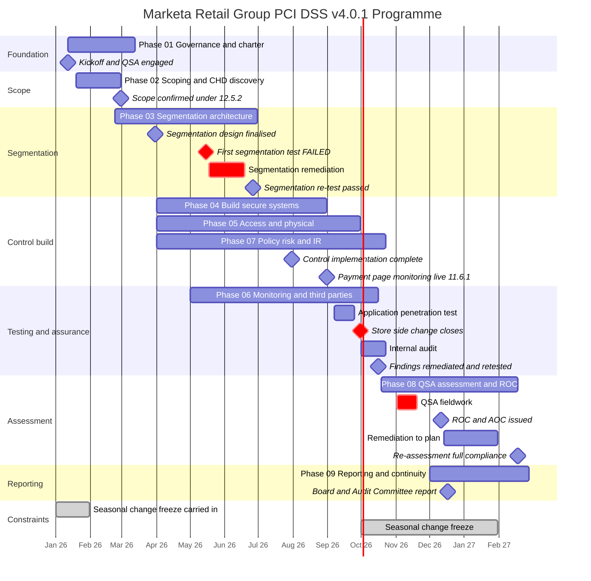
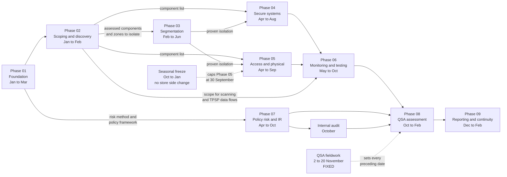

# 01.12 — Program Roadmap &amp; Milestones

| Field | Value |
|---|---|
| Document ID | MRG-PCI-2026-112 |
| Program | Marketa Retail Group — PCI DSS v4.0.1 Compliance Program |
| Phase | 01 — Program Foundation &amp; PCI Governance |
| Version | 1.0 |
| Status | Approved |
| Owner | Owen Castellanos, Payment Card Compliance Manager |
| Approver | Naomi Bhatt, Chief Information Security Officer |
| Date | 2026-07-15 |
| Classification | Confidential — Cardholder Data Environment // Illustrative Portfolio Sample |

## Purpose

This document is the delivery plan: nine phases, their dependencies, the critical path through them, the gates between them, and the risks to getting there. It exists because a programme of this shape has exactly one date it cannot move and one four-month window in which it cannot touch two thirds of its estate, and every other decision in the schedule is a consequence of those two facts.

## 1. The Fixed Point

> **Everything in this programme is planned backwards from 2026-11-02.**

Sable Ridge Assurance begins on-site fieldwork on **2026-11-02** and finishes on **2026-11-20**. That date was reserved at engagement and is treated as immovable, for four reasons that compound:

| Why the date cannot move | Consequence |
|---|---|
| Cardinal's AOC deadline is **31 December** (obligation C3) | Fieldwork ending 20 November leaves three weeks for report production, finding review, signature and submission. Moving fieldwork later removes that margin entirely |
| QSA capacity in Q4 is finite and contested | Level 1 merchants across the industry validate on the same calendar. A slipped window is not rescheduled by a fortnight; it is rescheduled into the following year |
| The assessment must observe a **period**, not a moment | Requirement evidence is cadence evidence. Controls that started operating in October produce one data point, not a quarter's worth |
| The seasonal freeze runs **October to January** | Fieldwork inside the freeze is possible because assessment is observation. Fieldwork *after* the freeze would land in February, past the deadline |

Everything else in the plan is derived. The backward pass below is the derivation, and it is the most load-bearing table in the document.

| Working backwards from | Date | Because |
|---|---|---|
| AOC filed with Cardinal | **2026-12-31** at the latest | Obligation C3 |
| ROC and AOC issued | **2026-12-11** | Twenty days of margin, so that a non-compliant result leaves room for a considered filing and a negotiated remediation plan rather than a scramble |
| Draft ROC findings reviewed with control owners | 2026-11-24 → 2026-12-04 | Owners must see findings before they are final; disputes are resolved on evidence, not in December |
| **QSA fieldwork** | **2026-11-02 → 2026-11-20** | The fixed point |
| Evidence set complete and assessment readiness confirmed | 2026-10-23 | Fieldwork begins with an assembled evidence set, not a scavenger hunt |
| Internal audit complete, recommendations issued | 2026-10-23 | Deliberately before fieldwork, so findings can be acted on rather than merely noted |
| All penetration test findings remediated and retested | 2026-10-16 | 19 findings including 2 Critical. Retest evidence must exist before the assessor asks |
| Application penetration test | **2026-09** | Late enough that the environment is final; early enough that remediation fits before the freeze |
| 11.6.1 payment-page monitoring live | **2026-08** | Needs roughly three months of operating history before fieldwork |
| **All store-side change complete** | **2026-09-30** | **The freeze.** Nothing touches the store estate after this date |
| Control implementation complete across Requirements 1–12 | **2026-07-31** | Controls need to be operating for a full quarter before fieldwork to produce a defensible sample |
| Segmentation re-test passed | **2026-06** | Segmentation must be proven before access and monitoring controls are built on top of it |
| First segmentation penetration test | **2026-05** | Scheduled early precisely so that a failure is recoverable. It failed, and the schedule absorbed it |
| Segmentation design finalised | **2026-03** | Cannot be designed before scope is known |
| Scope determined and PAN discovery complete | **2026-02** | Everything downstream depends on knowing what is in scope |
| Programme kickoff, QSA engaged | **2026-01-12** | During the tail of the 2025–26 freeze, when no store-side change was possible anyway |

## 2. The Compressed Delivery Window

The arithmetic is unforgiving and worth stating plainly.

| Period | Duration | What it must contain |
|---|---|---|
| 2026-01-12 → 2026-02-28 | ~7 weeks | Governance, scope determination, discovery across 1,842 systems, 41 shares and 6 archives, and remediation of anything found |
| 2026-03-01 → 2026-06-30 | 4 months | Segmentation design, build across 9 zones, a failed test, remediation, and a passing re-test |
| **2026-04-01 → 2026-07-31** | **4 months** | **Implementation of controls across all twelve requirements on 71 assessed components, plus store-side controls at 482 sites** |
| 2026-08-01 → 2026-09-30 | 2 months | Payment-page controls live; application penetration testing; store-side change closes |
| 2026-10-01 → 2026-10-31 | 1 month | Internal audit; remediation and retest; evidence assembly. **No change permitted to store systems** |
| 2026-11-02 → 2026-12-31 | 2 months | Fieldwork, reporting, filing, Board report |

Four months of build, overlapping with segmentation delivery, drawing on 11.4 FTE-equivalents from teams with trading-critical day jobs, ending on a hard date. That is the compression the freeze creates. The programme's three responses to it were set at kickoff:

| Response | Rationale |
|---|---|
| **Scope reduction first, always** | Every system removed from scope in February is four months of build effort that never has to be spent. Phase 02 runs before Phases 04–07 for this reason, not for tidiness |
| **Store-side controls designed for deployability over elegance** | With 482 sites and a September deadline, a control that requires a site visit is a control that will not land |
| **Bad news scheduled early** | The segmentation test was booked for May, not September, because a test that fails in May is recoverable and the same failure in September is not |

## 3. The Nine-Phase Roadmap

| Phase | Name | Window | Principal output | Gate |
|---|---|---|---|---|
| **01** | Program Foundation &amp; PCI Governance | 2026-01-12 → 2026-03-13 | Charter, governance, roles, regulatory position, scope hypothesis, TPSP register, calendar, roadmap | **G1** |
| **02** | CDE Scoping &amp; Cardholder Data Discovery | 2026-01-19 → 2026-02-28 | 12.5.2 scope determination; PAN discovery across the full estate; assessed-component register | **G2** |
| **03** | Network Segmentation Architecture | 2026-02-23 → 2026-06-30 | 9-zone design; segmentation controls; segmentation test under 11.4.5, failed then passed | **G3** |
| **04** | Build &amp; Maintain Secure Systems | 2026-04-01 → 2026-08-31 | Requirements 1–6 controls; configuration standards; 6.4.3 script inventory | **G4** |
| **05** | Access Control &amp; Physical Security | 2026-04-01 → 2026-09-30 | Requirements 7–9; MFA under 8.4.2; the 9.5.1 programme across 1,914 terminals | **G5** |
| **06** | Monitoring, Testing &amp; Third Parties | 2026-05-01 → 2026-10-16 | Requirements 10–11; ASV cycle; penetration testing; 11.6.1; 12.8 governance | **G6** |
| **07** | Security Policy, Risk &amp; Incident Response | 2026-04-01 → 2026-10-23 | Policy suite; 14 targeted risk analyses; 44-risk register; incident response including 12.10.7 | **G7** |
| **08** | QSA Assessment &amp; ROC Production | 2026-10-19 → 2027-02-18 | ROC and AOC; findings and remediation; re-assessment | **G8** |
| **09** | Executive Reporting &amp; Continuous Compliance | 2026-12-01 → 2027-02-28 | Board report; continuous-compliance calendar; programme close | **G9** |

## 4. Phase Entry and Exit Criteria

A gate is not a status report. It is a decision, taken by a named person, that the next phase may begin. Where a gate is passed with conditions, the conditions are logged as open items with dates.

| Gate | Phase | Entry criteria | Exit criteria | Gate owner |
|---|---|---|---|---|
| **G1** | 01 — Foundation | Executive mandate; funding approved | Charter approved; Steering Committee constituted and meeting; twelve requirement owners named; scope hypothesis and constraints documented; TPSP register established; obligations calendar and roadmap approved | Raymond Voss |
| **G2** | 02 — Scoping | Charter approved; channel data flows documented; discovery tooling procured | **All sixteen scoping questions answered**; PAN discovery complete across 1,842 systems, 41 shares and 6 archives; every unexpected PAN location remediated; assessed-component register produced; 12.5.2 determination reviewed with the QSA | Naomi Bhatt |
| **G3** | 03 — Segmentation | Scope determined; assessed components known | 9 zones documented; segmentation controls implemented; **segmentation test under 11.4.5 passed** — a failed test does not pass this gate, and did not | Trevor Kim |
| **G4** | 04 — Secure systems | Scope and segmentation stable | Configuration standards applied to all 71 components; patching operating; 6.4.3 inventory complete with all unauthorised scripts removed; 5.3.3 and 5.4.1 mechanisms operating | Trevor Kim and Sonia Rendell |
| **G5** | 05 — Access and physical | Scope determined; identity platform ready | MFA on all CDE access under 8.4.2; 12-character minimum under 8.3.6; application and system account governance under 8.6.x; 9.5.1 inspection cycle operating at all 1,914 terminals; **all store-side change complete before 2026-09-30** | Trevor Kim and Adaeze Nwosu |
| **G6** | 06 — Monitoring and third parties | Components known and logging | Automated log review under 10.4.1.1; four passing quarterly ASV scans; internal, external and segmentation testing complete with all 19 findings remediated and retested; 11.6.1 alerting inside 24 hours; 12.8 governance complete for all five providers | Marcus Hale |
| **G7** | 07 — Policy, risk and IR | Requirement owners assigned; controls being built | Policy suite approved under 12.1; 14 targeted risk analyses complete; 44 risks registered and treated; incident response tested under 12.10.2; 12.10.7 procedures in force | Naomi Bhatt |
| **G8** | 08 — Assessment | Evidence set complete; internal audit recommendations addressed or dated | ROC and AOC issued; every finding assigned a named owner and date; remediation complete; re-assessment achieving full compliance | Owen Castellanos |
| **G9** | 09 — Reporting and continuity | ROC and AOC issued | Board and Audit Committee report delivered; continuous-compliance calendar operating; open items ≤ 12, each with owner and date | Naomi Bhatt |

## 5. Dependencies and the Critical Path

### The critical path

**Phase 02 → Phase 03 → Phase 05 → Phase 06 → Phase 08.**

| Link | Why it is on the critical path | Float |
|---|---|---|
| 02 → 03 | Segmentation cannot be designed for an unknown boundary. Every day scope slips, segmentation design slips | **Zero.** Scope is the first constraint on everything |
| 03 → 05 | Physical and access controls are applied to the components inside the proven zones. Building them against an unproven boundary risks rebuilding them | ~2 weeks, consumed by the May test failure |
| 05 → freeze | The 9.5.1 programme must be operating at 1,914 terminals before 30 September, and needs at least one full quarterly cycle before fieldwork | **Zero after 2026-09-30.** The freeze is a wall, not a stretch |
| 06 → 08 | Penetration test findings must be remediated and retested before fieldwork; four passing ASV scans must exist for the year | ~1 week between retest completion and evidence lock |
| 08 → C3 | ROC and AOC must be issued in time to file by 31 December | 20 days, deliberately reserved |

Phases 04, 07 and 09 carry float. Phase 07's policy and risk work can run in parallel with build because it depends on decisions rather than on infrastructure. Phase 04 has float in its non-store elements and none in the 6.4.3 workstream, which gates 11.6.1 in Phase 06.

### The near-miss the plan was designed to absorb

The segmentation test failed in May. Because the test had been scheduled four months before the freeze rather than one, remediation and a re-test both completed in June without displacing a single downstream date. Had the same test been scheduled in September — which would have been the "efficient" choice, testing a finished environment once — the failure would have arrived with the freeze closing, no time to change store networks, and a segmentation position that could not be evidenced at fieldwork. **The float was the control.**

## 6. Milestone Register

| ID | Milestone | Planned | Owner | Dependency | Evidence |
|---|---|---|---|---|---|
| M-01 | Programme kickoff; QSA engaged | 2026-01-12 | Raymond Voss | Charter and funding | Kickoff minutes; engagement letter |
| M-02 | Scope confirmed under 12.5.2 | 2026-02-28 | Naomi Bhatt | Discovery complete | Scope document; component register |
| M-03 | Segmentation design finalised | 2026-03-31 | Trevor Kim | M-02 | 9-zone design; data-flow diagrams |
| M-04 | QSA monthly checkpoints begin | 2026-03-31 | Owen Castellanos | M-01 | Checkpoint notes |
| M-05 | Control implementation begins | 2026-04-01 | Naomi Bhatt | M-02, M-03 | Workstream plans |
| M-06 | First segmentation penetration test | 2026-05-15 | Marcus Hale | Segmentation implemented | Ironwood report — **FAILED** |
| M-07 | Segmentation re-test passed | 2026-06-26 | Trevor Kim | M-06 remediation | Ironwood re-test report |
| M-08 | Control implementation complete | 2026-07-31 | Naomi Bhatt | M-05 | Control evidence per requirement |
| M-09 | Payment-page script inventory and 11.6.1 live | 2026-08-31 | Sonia Rendell | M-08 | Script inventory; monitoring evidence |
| M-10 | Application penetration test complete | 2026-09-25 | Marcus Hale | M-08, M-09 | Ironwood report — 19 findings |
| M-11 | **Store-side change closes** | 2026-09-30 | Adaeze Nwosu | Freeze | Change freeze declaration |
| M-12 | Internal audit complete | 2026-10-23 | Rosa Delgado | M-08 | 7 recommendations, 0 Critical |
| M-13 | Penetration findings remediated and retested | 2026-10-16 | Marcus Hale | M-10 | Retest evidence |
| M-14 | Evidence set complete; readiness confirmed | 2026-10-23 | Owen Castellanos | All above | Evidence index |
| M-15 | **QSA fieldwork** | 2026-11-02 → 11-20 | Owen Castellanos | M-14 | Fieldwork schedule; interview log |
| M-16 | ROC and AOC issued | 2026-12-11 | Grant Whitfield / Raymond Voss | M-15 | ROC; signed AOC |
| M-17 | AOC filed with Cardinal | By 2026-12-31 | Owen Castellanos | M-16 | Submission confirmation |
| M-18 | Board and Audit Committee report | 2026-12-17 | Raymond Voss and Naomi Bhatt | M-16 | Board paper |
| M-19 | Remediation complete | 2027-01-31 | Naomi Bhatt | M-16 | Remediation evidence |
| M-20 | Re-assessment — full compliance | 2027-02-18 | Owen Castellanos | M-19 | Revised ROC and AOC |

## 7. Top Delivery Risks

These are risks to **delivery of the programme**, distinct from the security risk register produced in Phase 07. Each is scored on the programme's likelihood × impact scale, where High is ≥ 15, Moderate is 8–12 and Low is ≤ 6.

| ID | Delivery risk | Score | Mitigation | Owner | Trigger to escalate |
|---|---|---|---|---|---|
| **D-01** | **Scope proves larger than the hypothesis**, expanding the build population and the assessed component count | High | Discovery runs across the full estate rather than the believed-in-scope subset, so surprises arrive in February when there is still time. Contingency of $187,000 held partly against this | Naomi Bhatt | Any assessed-component count above 120 |
| **D-02** | **Store-side delivery does not complete before 30 September** and is caught by the freeze | High | 9.5.1 designed for shift execution rather than site visits; regional rollout waves with weekly completion reporting from July; freeze date treated as the real deadline, not November | Adaeze Nwosu | Any region below 90% by 2026-09-01 |
| **D-03** | **Segmentation test fails late**, leaving no window to remediate store networks | High | Test scheduled in May with a re-test window built in. **This risk materialised and the mitigation held** | Trevor Kim | A failed test after 2026-08-01 |
| **D-04** | **Authenticated scanning cannot be delivered on vendor-locked appliances** (constraint CON-03), producing an 11.3.1.2 finding | High | Vendor escalation to Verition from Q1; interim compensating measures evaluated; finding accepted and dated rather than concealed if unresolved. **This risk materialised** | Marcus Hale | No vendor commitment by 2026-06-30 |
| **D-05** | Marketing or commercial pressure delays 6.4.3 enforcement on payment pages | Moderate | Joint design with Marketing Technology; a five-day approval commitment the programme is measured against; Steering Committee escalation | Sonia Rendell | Approval latency above 5 days for two consecutive weeks |
| **D-06** | **Competing IT priorities** starve the programme of infrastructure capacity | Moderate | Capacity committed at the Steering Committee and arbitrated by the CIO; sequencing designed so two workstreams never contend for the same engineers | Curtis Lang | Any critical-path task slipping twice for resourcing |
| **D-07** | A **TPSP validation lapses** mid-year, suspending a scope reduction | Moderate | Quarterly status checks above the annual minimum; brand registry corroboration; contractual notification duty | Owen Castellanos | Any provider status change |
| **D-08** | Evidence is incomplete at fieldwork, producing avoidable findings | Moderate | Monthly QSA checkpoints from March specifically to surface evidence gaps early; evidence index maintained continuously, not assembled in October | Owen Castellanos | Any checkpoint identifying more than five gaps |
| **D-09** | **Unexpected account data is found late**, forcing remediation inside the freeze | Moderate | Discovery front-loaded into February; 12.10.7 procedures in force from Phase 07 so a late find is handled as an incident with a defined path | Elena Marchetti | Any PAN discovery after 2026-09-01 |
| **D-10** | Penetration test findings are too numerous or severe to remediate before fieldwork | Moderate | Test scheduled in September with a four-week remediation and retest window; Critical findings escalated within 24 hours of report receipt | Marcus Hale | Any Critical finding open on 2026-10-09 |
| **D-11** | Awareness training completion misses the 95% bar because of seasonal intake timing | Low | Training embedded in seasonal onboarding; completion push in October before the intake peaks; regional reporting | Owen Castellanos | Completion below 90% on 2026-11-01 |
| **D-12** | The QSA fieldwork window is lost to an external event | Low | Window contracted and confirmed; alternate assessor availability discussed with Sable Ridge; Cardinal informed early if it ever becomes real | Owen Castellanos | Any indication of assessor unavailability |

Four of these are scored High at programme start. Three of the four — D-02, D-03 and D-04 — trace directly to constraints CON-01, CON-02 and CON-03 in 01.08. That is the correct relationship: constraints do not appear on a risk register, but the risks they generate do.

## 8. Roadmap Change Control

| Change type | Authority | Notification |
|---|---|---|
| Task-level re-sequencing inside a phase, no milestone impact | Requirement owner with Owen Castellanos | Weekly Working Group |
| Milestone slip with no impact on a gate or on M-15 | Naomi Bhatt | Steering Committee |
| Any change affecting a gate, the critical path, or the evidence period before fieldwork | **PCI Steering Committee** | Audit Committee informed |
| Any change to the fieldwork window or the filing date | **Raymond Voss**, with the QSA and Cardinal | **Audit Committee — mandatory** |
| Budget variance above 10% of a phase budget | Raymond Voss | Audit Committee if material |

The roadmap is reviewed at every Steering Committee against actuals. Slippage is reported as slippage; a plan that is re-baselined every month reports nothing.

## Cross-References

| Reference | Relevance |
|---|---|
| 01.04 — Acquirer &amp; Card Brand Obligations | The 31 December deadline the plan is anchored to |
| 01.06 — Program Charter &amp; Objectives | The nine-phase structure and the definition of done |
| 01.08 — Scope Assumptions &amp; Constraints | Constraints CON-01 to CON-09 that shape this schedule |
| 01.10 — Stakeholder Register &amp; Engagement | The groups whose cooperation the store-side dates depend on |
| 01.11 — Compliance Calendar &amp; Obligations | Recurring obligations interleaved with these milestones |
| 01.13 — Phase Summary &amp; Transition | Gate G1 and the handover to Phase 02 |
| Phase 08 — QSA Assessment &amp; ROC Production | The fixed point everything is planned backwards from |

---
[⬅ Previous](01.11-compliance-calendar-and-obligations.md) · [🏠 Phase 01 Home](01.00-README.md) · [Next ➡](01.13-phase-summary-and-transition.md)
