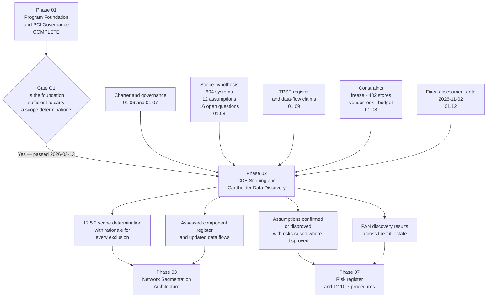

# 01.13 — Phase Summary &amp; Transition

| Field | Value |
|---|---|
| Document ID | MRG-PCI-2026-113 |
| Program | Marketa Retail Group — PCI DSS v4.0.1 Compliance Program |
| Phase | 01 — Program Foundation &amp; PCI Governance |
| Version | 1.0 |
| Status | Approved |
| Owner | Naomi Bhatt, Chief Information Security Officer |
| Approver | Raymond Voss, Chief Financial Officer (Executive Sponsor) |
| Date | 2026-07-15 |
| Classification | Confidential — Cardholder Data Environment // Illustrative Portfolio Sample |

## Purpose

This document closes Phase 01 of the Marketa Retail Group PCI DSS v4.0.1 Compliance Program. It records what the phase committed to and what it produced, registers the deliverables and the decisions taken, lists the questions it could not answer, and hands over formally to **Phase 02 — CDE Scoping &amp; Cardholder Data Discovery**.

It ends with an assurance statement that is deliberately unflattering. Phase 01 has built a governance structure and written down a hypothesis about scope. It has validated nothing. Saying so plainly, at the gate, is the point of having a gate.

## 1. What Phase 01 Committed To

Phase 01 was chartered to deliver Objective **O1**: *establish programme governance, roles and the regulatory position.* The charter's measurable criteria were four, and all four are met.

| Criterion | Status | Evidence |
|---|---|---|
| Charter approved | Met | 01.06, approved by Raymond Voss, chartered by Diane Okafor |
| PCI Steering Committee constituted and meeting monthly | Met | Committee constituted with twelve members; minutes in `governance/` |
| Twelve requirement owners named | Met | 01.07 §2 — a named accountable owner for each of the twelve requirements, satisfying sub-requirement x.1.2 |
| Audit Committee reporting line live | Met | Quarterly reporting agreed with Priya Raghunathan; Rosa Delgado's independent line established |

The phase also delivered four things it was not strictly chartered to produce, because Phase 02 could not sensibly begin without them: the preliminary scope position and its constraints, the third-party service provider register, the recurring obligations calendar, and the backward-planned roadmap.

## 2. Deliverables Register

| # | Document | Document ID | Owner | Approver | Status |
|---|---|---|---|---|---|
| 01.00 | Phase 01 README and navigation | *No ID — the Phase 01 scheme runs 101 to 113* | Owen Castellanos | Naomi Bhatt | Approved |
| 01.01 | Company Profile &amp; Payment Channels | MRG-PCI-2026-101 | Elena Marchetti | Naomi Bhatt | Approved |
| 01.02 | PCI DSS Landscape &amp; v4.0.1 | MRG-PCI-2026-102 | Naomi Bhatt | Frank Mueller | Approved |
| 01.03 | Merchant Level Determination &amp; Validation | MRG-PCI-2026-103 | Owen Castellanos | Raymond Voss | Approved |
| 01.04 | Acquirer &amp; Card Brand Obligations | MRG-PCI-2026-104 | Raymond Voss | Frank Mueller | Approved |
| 01.05 | PCI DSS v4.0.1 Requirements Overview | MRG-PCI-2026-105 | Naomi Bhatt | Curtis Lang | Approved |
| 01.06 | Program Charter &amp; Objectives | MRG-PCI-2026-106 | Naomi Bhatt | Raymond Voss | Approved |
| 01.07 | Roles, Responsibilities &amp; RACI | MRG-PCI-2026-107 | Naomi Bhatt | Raymond Voss | Approved |
| 01.08 | Scope Assumptions &amp; Constraints | MRG-PCI-2026-108 | Elena Marchetti | Naomi Bhatt | Approved |
| 01.09 | Third-Party Service Provider Register | MRG-PCI-2026-109 | Owen Castellanos | Frank Mueller | Approved |
| 01.10 | Stakeholder Register &amp; Engagement | MRG-PCI-2026-110 | Owen Castellanos | Naomi Bhatt | Approved |
| 01.11 | Compliance Calendar &amp; Obligations | MRG-PCI-2026-111 | Owen Castellanos | Naomi Bhatt | Approved |
| 01.12 | Program Roadmap &amp; Milestones | MRG-PCI-2026-112 | Owen Castellanos | Naomi Bhatt | Approved |
| 01.13 | Phase Summary &amp; Transition | MRG-PCI-2026-113 | Naomi Bhatt | Raymond Voss | Approved |

### Supporting artefacts

| Folder | Contents produced in Phase 01 |
|---|---|
| `adr/` | ADR-0001 to ADR-0004 |
| `diagrams/` | Payment channel flows for all three channels; contractual chain; governance structure; escalation paths; programme Gantt |
| `governance/` | Steering Committee terms of reference and minutes; Audit Committee reporting pack template; decision log |
| `trackers/` | TPSP register; obligations calendar; milestone register; delivery risk register; stakeholder register |
| `logs/` | Decision log; assumption log; scope-delta log opened for Phase 02 |
| `templates/` | Evidence request template; targeted risk analysis template; responsibility matrix template; Compensating Controls Worksheet template |

## 3. Decisions Taken

Four architectural and governance decisions were taken in Phase 01 and recorded as ADRs. The Week 7 series begins at **ADR-0001**.

### ADR-0001 — Programme operating model

| Element | Record |
|---|---|
| **Context** | Marketa had no standing payment-compliance function. The 2023 and 2024 v3.2.1 validations were run as projects by whoever was available, and the evidence was assembled in the final six weeks each year |
| **Decision** | Establish a **standing programme** with a dedicated Payment Card Compliance Manager reporting to the CISO, an executive-sponsored Steering Committee chaired by the CFO, a weekly working group, and twelve named requirement owners. Compliance operates all year; the assessment observes it |
| **Alternatives considered** | A project-based model repeated annually (rejected: reproduces the evidence scramble and cannot support v4's periodic obligations). Outsourcing programme management to the QSA (rejected: impairs assessor independence and transfers no accountability) |
| **Consequences** | Higher standing cost, carried in the $1,610,000 internal labour line. In exchange, the recurring obligations in 01.11 have owners on 1 January rather than 1 October, and Phase 09 inherits an operating function rather than a closed project |

### ADR-0002 — The AOC signature sits with the Chief Financial Officer

| Element | Record |
|---|---|
| **Context** | The merchant section of the Attestation of Compliance is an executive assertion about the state of the environment. Someone must sign it, and the choice signals where accountability actually sits |
| **Decision** | **Raymond Voss, Chief Financial Officer**, signs the AOC. He owns the Cardinal Merchant Bank relationship, sponsors the programme and chairs the Steering Committee |
| **Alternatives considered** | The CISO (rejected: makes the assertion look like a security-team opinion rather than a company position, and places the person accountable for delivery in the position of attesting to their own work). The CEO (rejected: too remote from the evidence to make the assertion meaningfully) |
| **Consequences** | The CFO must be close enough to the evidence to sign honestly, which is why the Steering Committee's standing agenda includes requirement-level readiness rather than only RAG status. It also means the decision to file a non-compliant AOC — taken on 2026-12-11 — was taken by the person who signs it |

### ADR-0003 — QSA and ASV from the same firm, with documented independence

| Element | Record |
|---|---|
| **Context** | Sable Ridge Assurance, LLC is the QSA company. Its separate practice, Sable Ridge Scanning Services, is an Approved Scanning Vendor. Using both is commercially and operationally convenient and raises an obvious independence question |
| **Decision** | Engage both, with **independence documented and accepted by Cardinal Merchant Bank in advance**: separate practices, separate engagement letters, separate personnel, no shared reporting line into the assessment, and the ASV attestations treated as evidence the QSA reviews rather than evidence the QSA produced |
| **Alternatives considered** | Separate firms (rejected on balance: coordination cost and scope-inventory duplication outweighed the residual independence concern once documented). Concealing the relationship (never considered; disclosure is the control) |
| **Consequences** | The arrangement must be re-confirmed with Cardinal annually and disclosed in the ROC. If Cardinal's position changes, the ASV engagement moves, not the QSA engagement |

### ADR-0004 — No "Not Tested" findings are permitted

| Element | Record |
|---|---|
| **Context** | PCI DSS permits a finding of *Not Tested* where a requirement was not assessed. It is legitimate in defined circumstances and is also an easy way to make an inconvenient requirement disappear from a report |
| **Decision** | **Zero Not Tested findings.** Every one of the 306 applicable sub-requirements is tested and receives a finding, including those expected to fail |
| **Alternatives considered** | Permitting Not Tested for requirements dependent on unresolved vendor constraints (rejected: this is precisely the case where an untested requirement conceals a real gap) |
| **Consequences** | The 2026 ROC records **In Place 297 · In Place with Compensating Control 3 · Not Applicable 4 · Not Tested 0 · Not in Place 2**. The two Not in Place findings exist in the report because this decision made it impossible for them not to. That is the decision working, not failing |

## 4. What Phase 01 Established

| Baseline element | Position at end of Phase 01 | Owner |
|---|---|---|
| Programme authority | Chartered by the CEO, sponsored by the CFO, owned by the CISO | Naomi Bhatt |
| Governance | Steering Committee monthly · Audit Committee quarterly · Working Group weekly · QSA checkpoint monthly from March · TPSP review quarterly · store readiness call monthly | Raymond Voss |
| Regulatory position | **Level 1 merchant**, validating by QSA on-site assessment producing a ROC and AOC, plus quarterly ASV scans, under a contractual obligation to Cardinal Merchant Bank | Owen Castellanos |
| Standard | **PCI DSS v4.0.1**, with all 51 future-dated requirements in force. **306** applicable sub-requirements | Naomi Bhatt |
| Accountability | Twelve requirement owners named, satisfying sub-requirement x.1.2 across all twelve requirements | Naomi Bhatt |
| **Scope** | **Hypothesis only** — 604 systems believed in scope, resting on twelve stated and untested assumptions | Elena Marchetti |
| Third parties | Five TPSPs registered under 12.8.1, with agreements, validation evidence and draft responsibility matrices | Owen Castellanos |
| Recurring obligations | Full calendar of daily, weekly, monthly, quarterly, semi-annual and annual obligations, with owners and evidence artefacts | Owen Castellanos |
| Plan | Nine phases planned backwards from **2026-11-02**, with gates, critical path and twelve delivery risks | Owen Castellanos |
| Budget | **$4,600,000** approved across FY2026 and FY2027; **11.4 FTE-equivalents** committed | Raymond Voss |

## 5. Open Questions Carried Into Phase 02

| ID | Open question | Why Phase 01 could not answer it | Carried to |
|---|---|---|---|
| **OQ-01** | Where does account data actually exist across the estate? | Requires discovery scanning of 1,842 systems, 41 network shares and 6 email archives. No scan has been run | Phase 02 |
| **OQ-02** | How many systems are genuinely in scope? | 604 is an inherited belief, not a determination. Both directions of error are live | Phase 02 |
| **OQ-03** | Do the P2PE, iframe and DTMF scope reductions hold in practice as they do on paper? | Assumptions A-01 to A-04 are architecturally credible and evidentially untested | Phase 02 |
| **OQ-04** | Is the store estate genuinely segmented from the corporate CDE, and guest wireless from store back-office? | Configuration evidence exists; a penetration test does not. Configuration is not proof | Phase 03 |
| **OQ-05** | What is on the payment pages? | The script inventory under 6.4.3 has not been produced | Phase 02 input, Phase 04 delivery |
| **OQ-06** | Will Verition support authenticated scanning on the appliances it locks down? | Vendor escalation opened; no commitment received. Constraint CON-03 and delivery risk D-04 | Phase 06 |
| **OQ-07** | Are the draft responsibility matrices acceptable to all five providers? | Matrices drafted; not yet counter-signed. **An unsigned matrix is a Marketa opinion** | Phase 06 |
| **OQ-08** | Which entity-defined frequencies will the fourteen targeted risk analyses actually justify? | The analyses have not been performed. Frequencies in 01.11 are proposed, not justified | Phase 07 |
| **OQ-09** | What is the risk baseline? | The 44-risk register does not exist yet. Phase 03 produces the baseline | Phase 03 |
| **OQ-10** | Are there acceptance channels or merchant IDs outside the three documented ones? | Reconciliation with Cardinal not yet complete. Assumption A-12 | Phase 02 |
| **OQ-11** | Can any Marketa system or entitlement reverse a Truvance token? | Contractual position understood; not tested. Assumption A-10 | Phase 02 |
| **OQ-12** | Will store-side controls land at 482 sites before 30 September? | Depends on a design that does not exist yet. Delivery risk D-02 | Phase 05 |

## 6. Transition to Phase 02

### Exactly what Phase 02 must produce

| # | Required output | Requirement anchor | Accepted by |
|---|---|---|---|
| 1 | **A documented and confirmed scope**, stating what is in the cardholder data environment, what is connected-to or security-impacting, and what is out — with a testable rationale for every exclusion | **12.5.2** | Naomi Bhatt, reviewed with Grant Whitfield |
| 2 | **An inventory of in-scope system components**, reconciled to the CMDB and maintained thereafter | 12.5.1 | Owen Castellanos |
| 3 | **PAN discovery results covering 100% of the 1,842-system estate**, plus 41 network shares and 6 email archives, with coverage evidence — not just findings | 3.2.1, 12.5.2 | Marcus Hale |
| 4 | **Confirmation or disproof of each of the twelve assumptions** in 01.08, with evidence, and a risk raised for every disproof | 12.3.1 | Naomi Bhatt |
| 5 | **Answers to all sixteen scoping questions** Q-01 to Q-16 | 12.5.2 | Naomi Bhatt |
| 6 | **Validated data-flow diagrams** for all three payment channels, showing account data at every hop | 1.2.4 | Trevor Kim |
| 7 | **Remediation of every unexpected account-data location found**, each handled under the incident path and each producing a procedure improvement | **12.10.7** | Elena Marchetti |
| 8 | **Confirmation that no sensitive authentication data is stored after authorisation** | 3.3.1 | Elena Marchetti |
| 9 | **Confirmation or correction of the TPSP register** in 01.09 against observed data flows | 12.8.1 | Owen Castellanos |
| 10 | **The zones segmentation must isolate**, handed to Phase 03 | 1.2.3, 11.4.5 | Trevor Kim |

### Phase 02 entry criteria

| Entry criterion | Satisfied by |
|---|---|
| Programme authority and decision rights established | 01.06 §7 |
| Scope determination authority named | 01.06 §7 — Naomi Bhatt, consulted by Elena Marchetti, Trevor Kim and the QSA |
| Preliminary scope position and falsifiable assumptions documented | 01.08 |
| Channel architecture and data-flow claims documented | 01.01 |
| Third-party relationships identified | 01.09 |
| Discovery scope agreed as the **full estate**, not the believed-in-scope subset | 01.08 §3 |
| Constraints understood, including the freeze and the fieldwork date | 01.08 §5, 01.12 §1 |
| Incident path for unexpected account data available before discovery begins | 12.10.7 procedure, drafted in Phase 01 and formalised in Phase 07 |

## 7. What Happens When an Assumption Fails

Phase 01 wrote twelve assumptions so that they could be disproved. Phase 02 will disprove some of them. The programme's standing rule, reaffirmed by the Steering Committee at gate G1 and carried forward in spirit from earlier engagements, governs what happens next:

> **When testing disproves an assumption, the associated risk goes up, not down.**

The logic is worth stating because it is counter-intuitive to people used to reporting progress. If Marketa believed a control was working and it was not, the exposure existed the whole time — the discovery changes the *record*, not the *reality*. Recording a lower risk because "we've found it now and we're fixing it" would mean the register measured the programme's confidence rather than the Company's exposure.

Two consequences follow, and both are accepted in advance:

| Consequence | Position |
|---|---|
| The risk register will get worse before it gets better | The Phase 03 baseline of **9 High · 21 Moderate · 14 Low** is expected to include risks that did not exist as concerns in January because nobody had looked |
| Some risks will be raised **on evidence** rather than on analysis | These are the most valuable entries in the register, because they are the only ones that are certainly real. The Steering Committee is briefed to treat a risk raised on evidence as a working control, not a failure of foresight |

## 8. Gate G1 Decision

| Element | Record |
|---|---|
| Gate | **G1 — Phase 01 exit** |
| Decision | **Passed** |
| Taken by | Raymond Voss, Chief Financial Officer, as Chair of the PCI Steering Committee, on the recommendation of Naomi Bhatt |
| Basis | All four charter criteria for Objective O1 met; the four supporting deliverables produced; twelve open questions transferred with named owners |
| Conditions | None. The twelve open questions are transfers, not conditions — each is Phase 02's or a later phase's work, not unfinished Phase 01 work |
| Observers | Rosa Delgado, Director of Internal Audit, attended and raised no objection to the gate decision |

## 9. Assurance Statement

This is the honest position at the close of Phase 01, and it should be read before any of the more confident statements elsewhere in this phase.

**Marketa has a governance structure and a hypothesis about scope. Nothing has been validated yet.**

| What exists | What does not |
|---|---|
| A chartered programme with an executive sponsor, a named owner, twelve requirement owners and a functioning Steering Committee | Any evidence that a single PCI DSS control is operating effectively |
| A documented understanding of three payment channels and the mechanisms that should keep account data off Marketa systems | Any test confirming that those mechanisms work as described in production |
| A stated belief that 604 systems are in scope | A scope determination. 604 is inherited, unexamined and expected to be wrong in both directions |
| Twelve assumptions written so they can be disproved | Any result from testing them. Some of them will fail |
| A register of five third-party service providers with validation evidence on file | Confirmation that the register matches the data flows that actually exist |
| A recurring obligations calendar with owners and evidence artefacts | A single completed cycle of most of those obligations |
| A plan anchored to a fixed assessment date | Any assurance that the plan will hold. Four delivery risks are scored High at this gate |
| Draft responsibility matrices for each provider | Provider signatures on any of them |

Three further points of accuracy, stated here because a phase-closing document is where they are most likely to be needed later:

1. **PCI DSS is contractual, not statutory.** Marketa's obligation arises from its merchant agreement with Cardinal Merchant Bank and the card brands' operating rules. The PCI Security Standards Council writes the standard and does not enforce it. Nothing in this phase is a legal determination; those are Frank Mueller's to make.
2. **There is no PCI DSS certification for a merchant.** What Marketa will produce is a Report on Compliance and an Attestation of Compliance describing an assessment at a point in time. Neither is a certificate, neither binds a card brand or the acquirer, and neither establishes compliance with any law.
3. **Scope is Marketa's determination, not the assessor's.** Sable Ridge Assurance will validate and may challenge the scope Marketa presents. It will not produce it, and it will not answer for it.

Phase 01 is closed. Phase 02 begins the work of finding out whether any of this is true.

## Cross-References

| Reference | Relevance |
|---|---|
| 01.06 — Program Charter &amp; Objectives | Objective O1, closed out here |
| 01.07 — Roles, Responsibilities &amp; RACI | The accountability model handed to Phase 02 |
| 01.08 — Scope Assumptions &amp; Constraints | The hypothesis and the sixteen questions Phase 02 must answer |
| 01.09 — Third-Party Service Provider Register | The register Phase 02 confirms against observed data flows |
| 01.11 — Compliance Calendar &amp; Obligations | The recurring obligations now owned and running |
| 01.12 — Program Roadmap &amp; Milestones | Gate G1 and the critical path into Phase 02 |
| Phase 02 — CDE Scoping &amp; Cardholder Data Discovery | The receiving phase |
| Phase 03 — Network Segmentation Architecture | Receives the zones and the risk baseline |

---
[⬅ Previous](01.12-program-roadmap-and-milestones.md) · [🏠 Phase 01 Home](01.00-README.md) · [Next ➡](../02-cde-scoping-cardholder-data-discovery/02.00-README.md)
