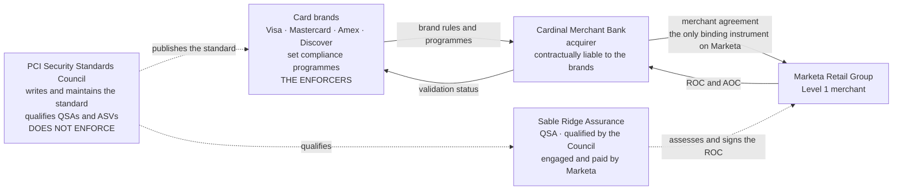

# Who Actually Enforces PCI DSS

## Three statements this diagram exists to make

**PCI DSS is contractual, not statutory.** It reaches Marketa through the merchant agreement with Cardinal Merchant Bank, and through nothing else. It is not a law, and no regulator enforces it.

**The Council does not enforce.** It writes the standard and qualifies assessors. Enforcement runs brand → acquirer → merchant.

**There is no "PCI certification" for a merchant.** A QSA issues a Report on Compliance and an Attestation of Compliance describing a point in time. Neither is a certificate, and neither is a determination of compliance with any law.

## Source
`01.02-pci-dss-landscape-and-v4-0-1.md`, `01.04-acquirer-and-card-brand-obligations.md`.
