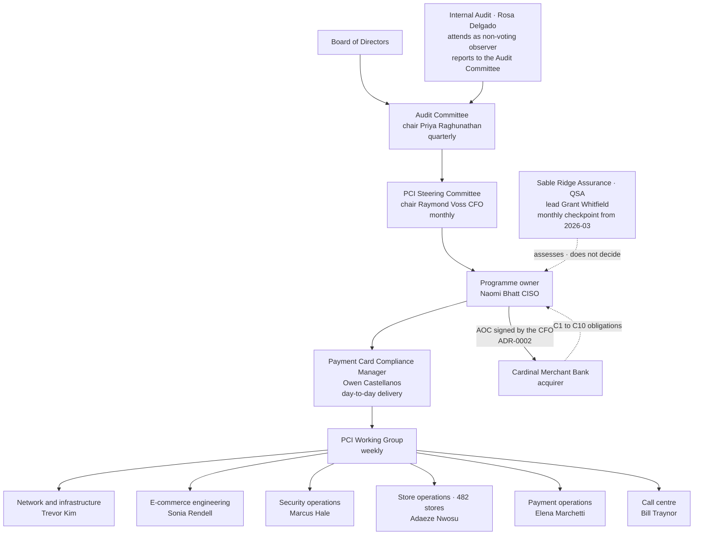

# Governance and Escalation

## The two lines that matter

**Internal Audit does not report to the CISO.** Rosa Delgado reports to the Audit Committee, which is what makes her review of the programme worth anything.

**The QSA assesses; it does not decide.** Sable Ridge determines whether a requirement is met. It does not choose Marketa's controls, and it cannot make Marketa compliant. Responsibility stays with the assessed entity — which is why the AOC is signed by the CFO and not by the assessor.

## Source
`01.06-program-charter-and-objectives.md`, `01.07-roles-responsibilities-and-raci.md`.
