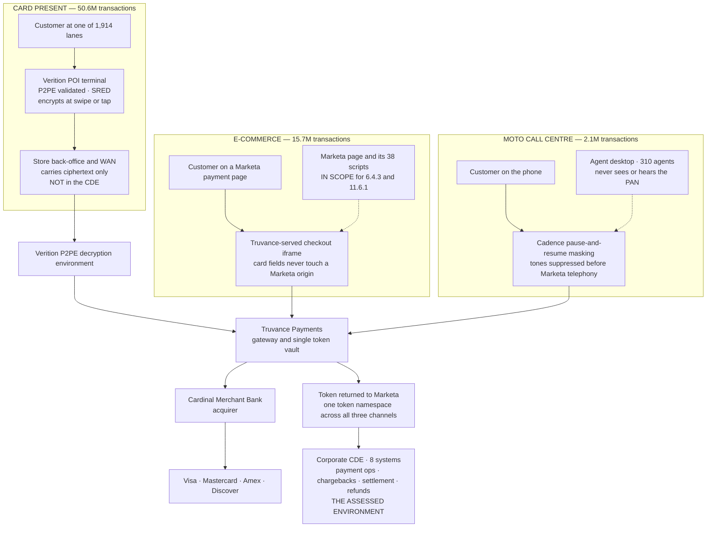

# Payment Channel Flows

## The point of this diagram

Three channels, three different scope-reduction mechanisms, **one token namespace**. In every channel the PAN is taken out of Marketa's hands before it reaches a Marketa system — encrypted at the POI, collected inside a Truvance iframe, or suppressed before the tone reaches the telephony platform.

What remains in the CDE is the **corporate payment operations estate**, because chargebacks, settlement reconciliation and refunds are the one place a human at Marketa legitimately handles account data.

## Source
`01.01-company-profile-and-payment-channels.md`, `FACTS §4`.
