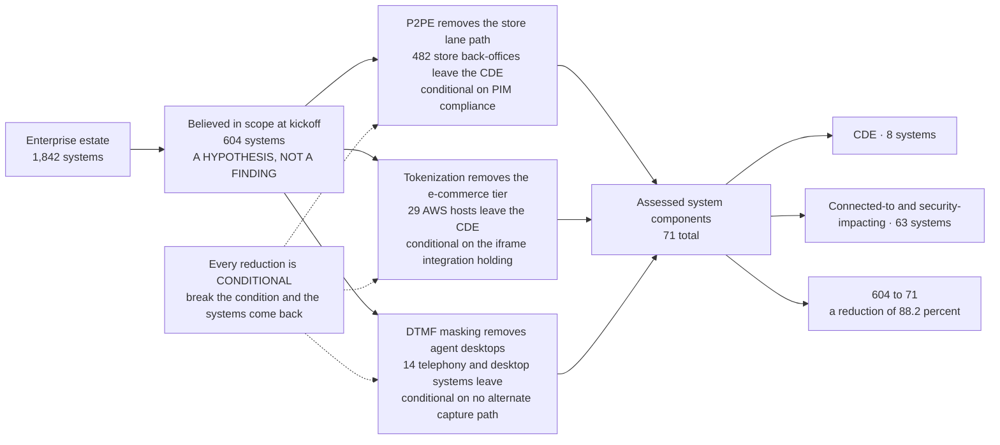

# The Scope Reduction Model

## Why this is the most valuable page in the portfolio

PCI DSS applies to the cardholder data environment. Everything else in the standard follows from where you draw that boundary, which makes **scope reduction the highest-leverage activity available to a merchant** — a control you never have to implement on a system that is not in scope.

The discipline is in the word *conditional*. P2PE does not reduce scope because a terminal is listed; it reduces scope because the solution is deployed as validated **and operated in accordance with the P2PE Instruction Manual**. Phase 02 has to prove each condition, and Phase 08 has to prove it again to a QSA.

## Source
`01.08-scope-assumptions-and-constraints.md`, `FACTS §4`.
