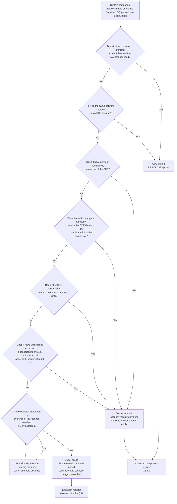

# 02.01 — Scoping Methodology

| Field | Value |
|---|---|
| Document ID | MRG-PCI-2026-201 |
| Program | Marketa Retail Group — PCI DSS v4.0.1 Compliance Program |
| Phase | 02 — CDE Scoping &amp; Cardholder Data Discovery |
| Version | 1.0 |
| Status | Approved |
| Owner | Owen Castellanos, Payment Card Compliance Manager |
| Approver | Naomi Bhatt, Chief Information Security Officer |
| Date | 2026-07-15 |
| Classification | Confidential — Cardholder Data Environment // Illustrative Portfolio Sample |

## Purpose

Phase 01 stated a hypothesis: **604 of 1,842 systems in scope**, resting on twelve assumptions written so they could be disproved. This document defines the method by which that hypothesis was tested, and by which the resulting scope determination was reached, recorded and made defensible to an assessor.

It is the methodology document, not the answer. The answers live in 02.02 through 02.09. What is set out here is the reasoning that makes those answers reviewable: what counts as account data, what the three scope categories are and how a system is placed into one of them, what standard of evidence an exclusion must meet, and the rule that governs every reduction in this phase — **a scope reduction is conditional, and a condition that stops being met brings the systems back**.

## 1. The Governing Principle — Scope Is the Assessed Entity's Determination

PCI DSS is explicit that the assessed entity, not the assessor, is responsible for defining the scope of its cardholder data environment. The QSA validates that determination, challenges it where the evidence does not support it, and records the assessed scope in the ROC. It does not produce the scope on the entity's behalf, and an entity that arrives at fieldwork expecting the assessor to work out where the boundary sits has already failed the exercise.

This has three practical consequences for Marketa, and all three shaped the method.

| Consequence | What it means in practice |
|---|---|
| **The burden of proof sits with Marketa** | Every system placed outside the boundary must be accompanied by the evidence that puts it there. "It has never had card data on it" is a claim, not evidence |
| **The determination must survive a hostile read** | Sable Ridge Assurance is engaged to disagree where disagreement is warranted. The determination is written for a reader looking for the weak exclusion, because that is the reader it will get |
| **The determination has a shelf life** | Requirement **12.5.2** obliges documentation and confirmation of scope **at least once every 12 months and upon significant change to the in-scope environment**. A February determination assessed in November must have been maintained in between |

> **Requirement 12.5.2.1 does not apply.** The six-monthly scope confirmation is a service-provider requirement. Marketa is a merchant. It is recorded here, as it was in 01.08, so that nobody adopts it by mistake and nobody is surprised by its absence from the ROC.

## 2. What "Account Data" Means

Scoping arguments go wrong early when people say "card data" and mean different things. The standard's taxonomy is precise, and the whole method depends on using it precisely.

**Account data** is the umbrella term. It divides into cardholder data and sensitive authentication data.

| Category | Data element | Storage permitted after authorisation? | Protection required when stored |
|---|---|---|---|
| **Cardholder data** | **Primary Account Number (PAN)** | Yes, where there is a documented business need | Rendered unreadable wherever stored (**3.5.1**); masked on display (**3.4.1**); retention limited and disposal evidenced (**3.2.1**) |
| Cardholder data | Cardholder name | Yes | Protected in line with 3.3 and Requirement 7 where stored **with** the PAN |
| Cardholder data | Expiration date | Yes | As above |
| Cardholder data | Service code | Yes | As above |
| **Sensitive authentication data** | Full track data — magnetic-stripe data or the equivalent data on a chip | **No — never after authorisation** (**3.3.1.1**) | Where stored pre-authorisation, protected with strong cryptography (**3.3.2**) |
| Sensitive authentication data | Card verification code — **CAV2 / CVC2 / CVV2 / CID** | **No — never after authorisation** (**3.3.1.2**) | As above |
| Sensitive authentication data | PIN and PIN block | **No — never after authorisation** (**3.3.1.3**) | As above |

Three points follow from that table, and the discovery design in 02.02 was built on them.

**First, the PAN is the trigger element.** Cardholder name, expiration date and service code are cardholder data, but a system holding only those, without a PAN, is not thereby a card data store. A system holding a PAN is, whatever else it holds. Marketa's discovery therefore hunts PANs first and treats the other elements as aggravating context rather than independent triggers.

**Second, the SAD prohibition is absolute for a merchant.** The permission to store SAD after authorisation exists only for issuers and issuer-processing entities with a documented business justification (**3.3.3**), and Marketa is neither. Any SAD found post-authorisation is the most serious finding available to an organisation of this shape, which is why it is tested for separately and explicitly under Q-02 rather than being folded into the PAN search.

**Third, a token is not cardholder data — provided the entity cannot reverse it.** Marketa stores Truvance-issued tokens across order management, the data warehouse and finance. Those tokens carry no mathematical relationship to the PAN and the mapping sits in Truvance's vault. That is the basis on which every token-holding system stays out of scope, and it is a *conditional* basis: if Marketa acquired a detokenisation entitlement, a cached mapping or an API route back to the PAN, the tokens would become cardholder data in Marketa's hands and every system holding them would enter scope. Q-07 exists to test that condition, not to assume it.

## 3. The Three Categories the Standard Recognises

Scope is not binary. The Council's scoping guidance recognises three categories, and the middle one is where most merchant assessments are won or lost, because it captures systems that have never seen a card number in their lives.

| Category | Definition | The test applied at Marketa |
|---|---|---|
| **CDE systems** | System components that **store, process or transmit** account data, **or** that are on the **same network segment** as systems that do — for example the same subnet or VLAN | Two limbs, either sufficient. Limb 1: does account data exist on it, pass through it, or get acted on by it, in a form Marketa can read? Limb 2: does it sit in a network segment shared with a system for which limb 1 is true? Limb 2 catches the file server that happens to live in the payment operations VLAN |
| **Connected-to / security-impacting systems** | Systems that do not themselves hold account data but that **have connectivity to the CDE**, or that **could affect the security** of the CDE or of account data | Four sub-tests: (a) network connectivity into or out of the CDE; (b) provision of a security service the CDE relies on — identity, patching, logging, anti-malware, monitoring; (c) administrative or management access into CDE components; (d) the ability to influence CDE configuration, code or content, including build pipelines and content-publication paths |
| **Out of scope** | Systems meeting **all** of the exclusion criteria below | Failing any one criterion means the system is not out of scope, however sympathetic the argument for excluding it |

### The out-of-scope test, in full

A system component is out of scope only if **every** one of the following is true. This is a conjunction, not a menu.

| # | Criterion | How Marketa tested it |
|---|---|---|
| 1 | It does not store, process or transmit account data | PAN discovery scanning across 100% of the estate — 02.02 |
| 2 | It is not on the same network segment as any system that does | Segment membership analysis against the nine-zone model — 02.07 and Phase 03 |
| 3 | It cannot connect to or access any system in the CDE | Rule-set, route and cloud flow-log analysis — Q-08 |
| 4 | It does not meet any criterion for a connected-to or security-impacting system | Administrative-path analysis across identity, patching, monitoring, backup, virtualisation and secrets — Q-09 |
| 5 | It does not have unrestricted access to a connected-to or security-impacting system such that it could affect CDE security through it | Second-order path analysis — the "system that can reach the system that can reach the CDE" case |

Criterion 5 is the one that is routinely skipped, and it is the reason a jump host with a weak upstream is not a boundary. Marketa applied it explicitly: the analysis in 02.07 walks two hops out from the CDE, not one.

## 4. The Scoping Decision Tree

Every one of the 1,842 systems, the 41 network shares and the 6 email archives was placed by the same decision procedure, applied in the same order, with the outcome recorded. Applying the tests in a fixed order matters: asking "is it connected?" before "does it hold data?" produces different classifications for the same system, because a system with data is CDE regardless of its connectivity.

The `HOLD` state is deliberate and it is the operational heart of the method. A system whose exclusion is architecturally obvious but evidentially unsupported is **in scope until the evidence exists**. It is not out of scope with a note. Sixty-one systems sat in `HOLD` at some point during February 2026; all were resolved before the determination was issued, and the log of what moved them is retained in `logs/`.

## 5. The Evidence Standard — Scope Is Proven, Not Asserted

The single most consequential decision in this phase was to grade evidence and to publish the grading, so that anyone reading a scope decision can see what it rests on without reconstructing it.

| Grade | Evidence type | Weight | Sufficient on its own to support an exclusion? |
|---|---|---|---|
| **E1** | Direct observation or test result produced by the programme — packet capture, discovery scan output, test transaction, penetration test result | Highest | **Yes** |
| **E2** | System-generated record not authored for this purpose — flow logs, authentication logs, configuration extracts, build manifests, vendor telemetry | High | **Yes**, where coverage and completeness of the record are themselves evidenced |
| **E3** | Third-party attestation covering the specific service consumed — an AOC, a Council listing, a P2PE Attestation of Validation | High for the provider's environment; **nil** for Marketa's | **No** — it evidences the provider's position, never Marketa's operation of it |
| **E4** | Marketa-authored documentation — architecture diagrams, design documents, runbooks, process maps | Moderate | **No** — it evidences intent, and intent is what the discovery exercise exists to test |
| **E5** | Interview, recollection, CMDB tag, prior-year scope schedule | Lowest | **No, in any circumstance** |

The rule the programme adopted, and enforced: **no exclusion is effective on E4 or E5 evidence alone.** The 604-system starting position was built almost entirely on E5 — a carried-forward schedule, CMDB tags and institutional memory — and 01.08 said as much. Rebuilding the position on E1 and E2 is the work of this phase and the reason the discovery spend was treated as an investment rather than an overhead.

Two corollaries were also adopted.

**A negative result must be evidenced as thoroughly as a positive one.** "We scanned and found nothing" is worth nothing without coverage evidence — what was scanned, what was not, why not, and what alternative assurance covers the gap. 02.02 §6 exists for exactly this reason.

**An absent record is not a clean record.** Where a log, catalogue or inventory did not exist or did not go back far enough, the programme recorded the gap rather than inferring an answer from it. Three of the four unexpected PAN locations in 02.03 lived in places that no inventory covered, which is a general lesson rather than a coincidence.

## 6. The 12.5.2 Confirmation and What It Must Contain

Requirement 12.5.2 is not satisfied by a diagram. It specifies what the confirmation must include, and Phase 02's deliverable set is organised to produce each element.

| 12.5.2 element | Marketa's artefact | Document |
|---|---|---|
| Identify all data flows across the payment stages and acceptance channels | Three channel data-flow analyses, each traced end to end with observed evidence | 02.04, 02.05, 02.06 |
| Update all data-flow diagrams under **1.2.4** | Channel diagrams re-drawn from observation, not from design intent | 02.04–02.06, `diagrams/` |
| Identify all locations where account data is stored, processed or transmitted, **including locations outside the currently defined CDE** | The estate-wide discovery exercise and its findings | 02.02, 02.03 |
| Identify all system components in the CDE, connected to it, or able to affect its security | Assessed component register — 8 CDE, 63 connected-to, **71** total | 02.07, 02.09 |
| Identify all segmentation controls and the environments segmented out, with justification for out-of-scope environments | Segmentation control register and the exclusion rationale | 02.07, 02.08, Phase 03 |
| Identify all connections from third parties with access to the CDE | Confirmation of the 01.09 register against observed flows — Q-14 | 02.07 |
| Confirm all of the above are documented, in scope where they should be, and accurately reflect the current environment | The determination itself, reviewed with Sable Ridge Assurance | 02.09 |

The word doing the work in the third row is **"including locations outside the currently defined CDE."** A discovery exercise bounded by the believed-in-scope population can only ever confirm what is already known. Marketa's denominator was the whole estate for this reason, and all four unexpected PAN locations were found outside the 604.

## 7. The Six Workstreams, and the Questions They Answer

Phase 02 ran six parallel workstreams between **2026-01-19** and **2026-02-20**, converging on a single determination. Each maps to the questions handed over in 01.08 §6.

| # | Workstream | Method | Questions answered | Lead |
|---|---|---|---|---|
| **W1** | Account data discovery | Automated pattern discovery across 1,842 systems, 41 shares, 6 email archives, plus audio analysis of the recording estate | Q-01, Q-02, Q-11, Q-12 | Marcus Hale |
| **W2** | Channel data-flow validation | Observation of an actual payment, end to end, in each channel — capture, not documentation | Q-03, Q-04, Q-05, Q-15 | Trevor Kim / Sonia Rendell / Bill Traynor |
| **W3** | Connectivity analysis | Firewall and security-group rule sets, routing tables, cloud flow logs, DNS and authentication telemetry | Q-08, Q-10, Q-11 | Trevor Kim |
| **W4** | Process walkthroughs | End-to-end walkthroughs of disputes, chargebacks, refunds, customer service and store exception handling, with document sampling | Q-06, Q-13 | Elena Marchetti |
| **W5** | Third-party confirmation | Data-flow confirmation with each provider against the 01.09 register; entitlement and contract review | Q-07, Q-14 | Owen Castellanos |
| **W6** | Determination and challenge | Consolidation, Scope Decision Records, QSA review, Steering Committee endorsement | Q-16 | Naomi Bhatt |

W2 deserves a note. The temptation in a channel analysis is to read the integration documentation and describe what it says. Marketa's method required a **capture**: a real or test transaction, observed at the wire or in the browser, with the artefact retained. Documentation describes what someone intended to build. A capture describes what is running. The distance between the two is where scope findings live, and in the e-commerce channel it was exactly where two undeclared third-party scripts were found.

## 8. Scope Decision Records

Every classification decision that is not self-evident — and every exclusion without exception — is recorded on a **Scope Decision Record (SDR)**. The template lives in `templates/`; the register lives in `trackers/`.

| Field | Purpose |
|---|---|
| SDR reference and date | Traceability |
| Population covered | A named system, a class of systems, or an environment — with the count |
| Proposed classification | CDE, connected-to, or out of scope |
| The specific test applied | Which limb of §3, and which of the five out-of-scope criteria |
| Evidence relied on, with grade | E1–E5 per §5; an SDR resting only on E4 or E5 cannot be approved |
| **Conditions the classification depends on** | The heart of the record — see §9 |
| **Verification method and frequency for each condition** | How Marketa knows the condition still holds |
| **Collapse trigger** | The observation that would return the population to scope, stated in advance |
| Owner and approver | Named individual; Naomi Bhatt approves every exclusion covering more than 10 systems |
| QSA review status | Reviewed, challenged, or accepted — with the date and the assessor |

The discipline the SDR enforces is that an exclusion cannot be written without stating what would undo it. An analyst who cannot describe the collapse trigger has not understood the reduction well enough to claim it.

## 9. Conditionality — Every Reduction Has a Price

This is the intellectual spine of the phase, and it is worth stating as plainly as possible.

> **A scope reduction is not a property of a system. It is a property of a system operating under conditions.** P2PE does not reduce scope because a terminal appears on a list; it reduces scope because a listed solution is deployed as validated and operated in accordance with the P2PE Instruction Manual. A hosted iframe does not reduce scope because the integration document says so; it reduces scope because the card fields are, today, served from the provider's origin on every template. DTMF suppression does not reduce scope because a service is contracted; it reduces scope because the digits are, in the calls actually being taken, inaudible and unrecordable on Marketa infrastructure.
>
> **Every one of those conditions can stop being true without anybody deciding that it should.** A contractor replaces a store switch. A developer adds a script to a shared template. An agent finds a workaround for a customer who cannot use their keypad. None of those is a change request, and none of them arrives labelled as a scope event.

Phase 02 therefore produces, alongside the determination, a **condition register**: every condition on which a reduction depends, with a verification method, a frequency, an owner and a collapse trigger. It is the artefact that turns a February determination into a November-defensible position, and it is the direct input to the continuous compliance model in Phase 09.

| Reduction | Conditions recorded | Where set out |
|---|---|---|
| P2PE at 1,914 lanes across 482 stores | 9 | 02.04 §7 |
| Hosted checkout iframe across 6 templates | 7 | 02.05 §7 |
| DTMF suppression across 310 agents | 8 | 02.06 §7 |
| Tokenization across all three channels | 5 | 02.07 |
| Network segmentation across 9 zones | 6 | 02.08 and Phase 03 |

An honest observation about the register: the conditions are not equally observable. "The solution remains listed by the Council" is checked in a minute from a public page. "No agent ever takes a card number verbally" is a statement about 310 people on 2.1 million calls a year, and can only be approached through sampling, reconciliation and monitoring. The register records the strength of each verification method as well as its existence, because a condition that is verified weakly is a weaker reduction, and pretending otherwise is how programmes surprise themselves.

## 10. Segmentation, Sampling and What Is Not Being Claimed

**Segmentation is optional; relying on it is not.** PCI DSS does not require network segmentation. It permits an entity to use segmentation to reduce scope, and then requires that the segmentation actually work. Two consequences follow, and both are recorded now so that Phase 03 does not have to re-argue them:

- **Segmentation controls are always in scope.** The device or configuration that enforces the boundary is, by definition, security-impacting. It cannot be on the excluded side of a boundary it creates.
- **Segmentation must be tested, not configured.** Requirement **11.4.5** obliges a merchant to test segmentation controls at least once every twelve months and after any change to segmentation controls or methods. Configuration review is not a substitute. Marketa's first segmentation test failed; that outcome is Phase 03's to report, and it is the clearest possible illustration of why configuration evidence was not accepted here as proof of isolation.

**On sampling.** The standard permits an assessor to sample business facilities and system components where the entity has standardised, centrally managed processes, with documented justification. Marketa applied sampling in two places and refused it in one.

| Activity | Sampled? | Rationale |
|---|---|---|
| Account data discovery across the estate | **No — 100% coverage** | The exercise exists to find data nobody expected. A sample can only confirm the expected distribution; it cannot find the outlier, and the outlier is the point |
| Lane-level capture testing across 1,914 lanes | Yes — 24 stores, 96 lanes | The estate is centrally deployed and centrally configured; sampling is justified and stratified. Documentary and telemetric verification was nonetheless applied to **100%** of lanes |
| Call-recording adjudication | Yes, in part | Automated detection ran across the whole pre-masking population; manual adjudication ran over a statistically sized sample plus every automated hit |

**What this methodology does not claim.** It does not claim that a small scope is a safe scope; a compact CDE with weak controls is worse than a large one with strong ones. It does not claim that the determination is permanent. And it does not claim that the QSA's acceptance of a scope makes it correct — the assessor validates the entity's determination, and the entity answers for it.

## 11. Who Decides What

| Party | Role in scoping | What it cannot do |
|---|---|---|
| **Marketa** | Defines the scope, produces the evidence, owns the determination and its consequences | Delegate the determination to anybody else |
| **Sable Ridge Assurance (QSA)** | Reviews the determination, challenges exclusions, tests the supporting evidence, records the assessed scope in the ROC | Define the scope on Marketa's behalf, or make an unsupported exclusion supportable by accepting it |
| **Truvance, Cadence, Verition** | Provide the mechanisms on which three reductions rest, and the attestations that evidence **their** side of them | Attest to Marketa's operation of those mechanisms. An AOC covers the provider's environment and nothing else |
| **Cardinal Merchant Bank** | Receives the AOC; must be notified of material change to the CDE within 30 days under obligation **C7** | Approve or ratify the scope; the acquirer receives a result, it does not co-author one |

## 12. Keeping the Determination Current

The determination is dated **2026-02-20** and confirmed under 12.5.2. Between then and fieldwork in November it is maintained by four mechanisms.

| Mechanism | Trigger | Owner | Output |
|---|---|---|---|
| Scope-delta review | Any change that could alter scope — new integration, new third party, new acceptance method, new data flow, network change | Owen Castellanos | Scope-delta record in `logs/`; SDR amendment where the classification moves |
| Condition verification cycle | The frequencies recorded in the condition register — ranging from continuous to annual | Condition owners | Verification evidence retained against each condition |
| Monthly component reconciliation | Assessed component register against the CMDB and cloud inventory under **12.5.1** | Marcus Hale | Reconciliation report; unexplained additions investigated |
| Annual confirmation | **12.5.2**, at least every 12 months | Naomi Bhatt | Re-issued determination |

The standing rule from 01.08 carries into execution unchanged: **any change that could alter scope is treated as scope-affecting until someone demonstrates otherwise.** The demonstration is an SDR amendment with evidence, not an opinion in a change ticket.

## Cross-References

| Reference | Relevance |
|---|---|
| 01.08 — Scope Assumptions &amp; Constraints | The 604 hypothesis, the 12 assumptions and the 16 questions this method tests |
| 01.05 — PCI DSS v4.0.1 Requirements Overview | Requirements 3, 11.4.5, 12.5.1 and 12.5.2 as introduced |
| 01.09 — Third-Party Service Provider Register | The E3 attestations relied on, and their limits |
| 02.02 — Cardholder Data Discovery | Workstream W1 and the coverage evidence standard set in §5 |
| 02.03 — Unexpected PAN Locations &amp; Response | What the method found where the CMDB said there was nothing |
| 02.04 — Card-Present Channel Scope | The P2PE reduction and its nine conditions |
| 02.05 — E-Commerce Channel Scope | The iframe reduction and its seven conditions |
| 02.06 — Call Centre / MOTO Channel Scope | The DTMF reduction and its eight conditions |
| Phase 03 — Network Segmentation Architecture | Tests the segmentation on which §10 depends, under 11.4.5 |
| Phase 09 — Executive Reporting &amp; Continuous Compliance | Inherits the condition register as the continuous compliance model |

---
[⬅ Previous](02.00-README.md) · [🏠 Phase 02 Home](02.00-README.md) · [Next ➡](02.02-cardholder-data-discovery.md)
