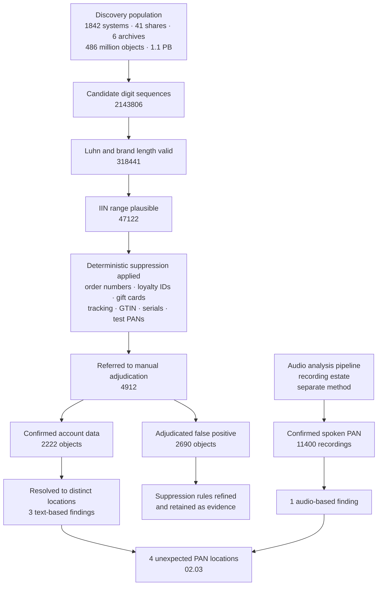

# 02.02 — Cardholder Data Discovery

| Field | Value |
|---|---|
| Document ID | MRG-PCI-2026-202 |
| Program | Marketa Retail Group — PCI DSS v4.0.1 Compliance Program |
| Phase | 02 — CDE Scoping &amp; Cardholder Data Discovery |
| Version | 1.0 |
| Status | Approved |
| Owner | Marcus Hale, Security Operations Manager |
| Approver | Naomi Bhatt, Chief Information Security Officer |
| Date | 2026-07-15 |
| Classification | Confidential — Cardholder Data Environment // Illustrative Portfolio Sample |

## Purpose

This document reports the account data discovery exercise: what was searched, how, with what coverage, and what was found. It answers four of the sixteen questions handed over from 01.08 — **Q-01** (where does account data exist at rest across the entire estate), **Q-02** (is any sensitive authentication data stored after authorisation), **Q-11** (are systems recorded as decommissioned still powered, reachable or holding data) and **Q-12** (do backups and replicas at Ashburn contain anything production does not).

The headline is stated up front, because burying it would be a poor way to demonstrate the point the exercise makes. **Coverage was 1,842 of 1,842 systems — 100% — plus 41 network shares and 6 email archives. Four unexpected PAN locations were found. No sensitive authentication data was found anywhere in the estate.** The four locations are summarised here and worked end to end in 02.03.

## 1. Why the Denominator Was the Whole Estate

The single most important design decision was made before any tool was configured: **the discovery population is the entire enterprise estate, not the believed-in-scope subset.**

The argument for scanning only the 604 is superficially strong — it is cheaper, faster, and covers everywhere card data is supposed to be. It is also circular. A discovery exercise scoped by the current scope belief can confirm that belief and can never falsify it. The systems most likely to hold account data nobody expected are, by construction, the systems nobody thought to include.

| Population | Count | Included? | Why |
|---|---|---|---|
| Systems believed in scope at kickoff | 604 | Yes | The hypothesis under test |
| Systems believed out of scope at kickoff | 1,238 | **Yes** | Excluded on assertion in the 2024 schedule; never scanned; the higher-yield population |
| Network file shares | 41 | **Yes** | Appear in no system inventory. A share is not a "system" in CMDB terms and was never tagged |
| Email archives and journals | 6 | **Yes** | Account data arrives by message whether or not anyone asks it to |
| Backup sets and DR replicas at Ashburn | 4,318 sets | Sampled restore-and-scan | A clean production system with a dirty backup is not a clean environment |
| POI devices | 1,914 | Out of this exercise | Tracked separately under 9.5.1.1; no readable storage available to Marketa. Covered in 02.04 |

All four unexpected PAN locations were found outside the 604. Three of them were in populations that no system inventory covered at all. That result is the justification for the design, and it is reported before the findings so that the design does not look retrospectively lucky.

## 2. The Discovery Population in Detail

| Estate segment | Systems | Discovery method | Notes |
|---|---|---|---|
| Store back-office servers | 482 | Agent-based, scheduled outside trading hours | One per store; scanned in seven regional waves |
| Store-estate network and infrastructure appliances | 496 | Agentless — read-only configuration and filesystem inspection | Includes the vendor-locked appliances under constraint CON-03 |
| Columbus data centre servers and appliances | 337 | Agent-based | Includes the 8 corporate payment operations systems |
| Ashburn co-location — DR and edge | 118 | Agent-based, plus backup catalogue analysis | See §7 |
| AWS us-east-1 and us-west-2 workloads | 246 | Agent-based for EC2; API-driven object scanning for S3, RDS and EBS snapshots | Includes stopped instances and retained volumes — see §6 |
| Distribution centre systems | 96 | Agent-based | Four sites |
| Corporate office systems — Columbus HQ and Austin | 53 | Agent-based | Excludes end-user devices, which are covered through the mail and collaboration estate |
| Call-centre telephony and desktop infrastructure | 14 | Agent-based, plus separate audio analysis of the recording estate | See §5 |
| **Total systems** | **1,842** | — | **100% covered** |
| Network file shares | 41 | Crawler with read-only service account | 2.9 billion objects enumerated |
| Email archives and journals | 6 | Native e-discovery search plus export-and-scan | Covers current cloud mailboxes and legacy on-premises journals |

The store back-office wave scheduling was dictated by constraint **CON-02**: 482 sites cannot be scanned simultaneously without saturating store links during replenishment windows. The exercise was designed to complete inside the January–February window without a single trading-hours impact, and it did.

## 3. Tooling and the Pattern Approach

Discovery ran on a commercial data-discovery platform operating in three modes — agent-based filesystem and database inspection, agentless read-only inspection for appliances, and API-driven scanning for cloud object and block storage — supplemented by two purpose-built components: an audio analysis pipeline for the recording estate and a message-archive search harness.

### 3.1 What was searched for

| Pattern class | Target | Detection logic |
|---|---|---|
| **PAN** | 13–19 digit sequences matching the brand IIN ranges for Visa, Mastercard, American Express and Discover | Regex candidate extraction, tolerant of common separators — space, hyphen, no separator — followed by **Luhn (mod 10) check-digit validation**, brand length validation, and IIN plausibility |
| **Track 1 data** | `%B` start sentinel, format code, PAN, field separator `^`, name, `^`, expiry, service code, discretionary data, end sentinel `?` | Structural pattern, not a digit search. Track data has a shape; the shape is what is detected |
| **Track 2 data** | `;` sentinel, PAN, `=` separator, expiry, service code, discretionary data, `?` | As above |
| **Card verification code** | Three- or four-digit value in proximity to a PAN candidate or to labelling terms | Proximity-and-context rule only; a bare three-digit number is not detectable and must not be treated as if it were |
| **PIN block** | ISO format 0–4 block structures in proximity to a PAN candidate | Structural; extremely low base rate, and correspondingly low false-positive tolerance |
| **Contextual reinforcement** | Field labels, column headers and filenames — `cardnumber`, `ccnum`, `pan`, `cvv`, `card_no`, `dispute`, `chargeback` | Raises confidence on a candidate; never creates a finding on its own |

### 3.2 Why naive PAN regex fails badly at a retailer

This is worth setting out in detail, because it is the difference between a discovery exercise that produces a determination and one that produces an unmanageable queue nobody works through.

A retailer's data is full of sixteen-digit numbers, and a meaningful proportion of them **pass the Luhn check on purpose**. Luhn is not a card-specific algorithm; it is a generic check-digit scheme, and it was adopted for exactly the same reason by the schemes that generate loyalty numbers, closed-loop gift cards, and several identifier standards. A pipeline that treats "sixteen digits, Luhn-valid" as a finding will drown.

| Source of false positives at Marketa | Why it matches | Why it is not account data |
|---|---|---|
| Purchase order and order reference numbers | 16 digits; the legacy order sequence includes a trailing check digit | Internally generated; no IIN relationship; deterministic prefix structure |
| **Loyalty programme member IDs** | 16 digits, **Luhn-valid by design** — the scheme was specified that way to catch keying errors at the till | A loyalty number is not a payment card account number and has no issuer |
| **Closed-loop gift card numbers** | 16 digits, Luhn-valid, and frequently stored alongside order data | Marketa-issued closed-loop stored value. Not a brand PAN, and outside PCI DSS scope as account data — though it carries its own fraud considerations |
| Carrier tracking and consignment numbers | Length overlap in some carrier formats | No IIN match; carrier-specific prefixes |
| GTIN, UPC and vendor SKU strings | Long numeric runs, sometimes concatenated in export files | Length and prefix analysis excludes them |
| Device serials and IMEIs | 15–16 digits; **IMEI is Luhn-valid** | Structural prefix analysis excludes them |
| **Test PANs in code, fixtures and documentation** | They are real, valid card number formats — they are supposed to be | Publicly published test values from the brands' test suites. Not cardholder data, but flagged for hygiene: a test PAN in production configuration is a code-quality signal worth acting on |

Marketa's response was a layered suppression model rather than a single filter. Deterministic suppression lists were built from the actual generators — the order-number format specification, the loyalty scheme specification, the gift card BIN range, the carrier prefix lists — so that a suppressed match could always be traced to the rule that suppressed it, and the rule to the specification that justified it. **Suppression by pattern is auditable; suppression by tuning is not.**

## 4. The Funnel, and the Adjudication That Followed

Automation narrows; it does not decide. Every candidate surviving suppression was adjudicated by a human being, and the adjudication record is retained.

### 4.1 Adjudicated false positives

| Category | Objects | Adjudication basis |
|---|---|---|
| Purchase order and order reference numbers | 1,104 | Matched the documented order-number format including prefix and sequence range |
| Loyalty programme member IDs | 812 | Matched the loyalty scheme's issued range; cross-checked against the loyalty master |
| Closed-loop gift card numbers | 419 | Within Marketa's own issued gift card range |
| Carrier tracking and consignment numbers | 187 | Carrier prefix match |
| Device serials and IMEIs | 96 | Structural prefix match |
| Test PANs in code, fixtures and documentation | 72 | Published brand test values; **raised separately as a code-hygiene action, not as a card data finding** |
| **Total** | **2,690** | — |

### 4.2 Adjudication rules

Four rules governed the manual stage, and they were written down before adjudication began so that the standard could not drift as the queue grew.

| Rule | Statement |
|---|---|
| **Two-person adjudication for positives** | A candidate is only confirmed as account data by two adjudicators independently. A single adjudicator may dismiss, but dismissals were sampled at 10% by the second adjudicator |
| **Minimum-exposure handling** | Adjudicators worked on masked extracts wherever the pattern alone settled the question. Full values were revealed only where classification genuinely required it, on a logged, dual-controlled basis, from a quarantine volume inside the CDE |
| **Doubt resolves against exclusion** | A candidate that cannot be positively attributed to a non-card generator is treated as account data. The cost of a false positive is adjudication effort; the cost of a false negative is the assessment |
| **Every suppression traces to a specification** | No candidate was suppressed on the adjudicator's judgement alone. If no documented generator explained the value, it went to the positive queue |

## 5. Sensitive Authentication Data — Q-02

SAD was searched for separately, with its own patterns, its own population and its own reporting line, rather than being treated as a by-product of the PAN search. The reason is proportionality: a merchant storing SAD after authorisation has a finding of a different order from a merchant storing a PAN, and it warrants an independent search that cannot be crowded out by PAN queue volume.

| SAD element | Method | Population | Result |
|---|---|---|---|
| Full track data — Track 1 and Track 2 | Structural sentinel-and-separator pattern | All 1,842 systems, 41 shares, 6 archives, sampled backup restores | **None found** |
| Card verification code — CAV2 / CVC2 / CVV2 / CID | Proximity and context rule around PAN candidates and labelled fields; plus targeted review of every confirmed PAN location | As above, plus the 11,400 confirmed audio findings and a 384-recording statistical sample of the wider pre-masking population | **None found** |
| PIN and PIN block | ISO block structure in proximity to a PAN candidate; plus review of POS and store-server logging configuration | As above | **None found** |
| Process confirmation | Walkthroughs of MOTO order capture, dispute handling, refunds and store exception handling, testing whether any process *asks for* a verification code and retains it | Four process areas | No retention path identified |

**Assumption A-06 survived.** It is important to record *how* narrowly, because the reason turned out to be an accident of application design rather than a designed control.

In the pre-masking MOTO process — the process that produced finding PAN-01 in 02.03 — agents took PANs verbally in exception cases. They did not take card verification codes verbally, and the reason is that **the agent order screen had no field to put one in**. The payment application collected the verification code only through a keypad-entry step; there was no manual-entry path, so there was nothing an agent could do with a code read aloud. The same allow-list accident protected the debug log in finding PAN-03, where the logging library's redaction list happened to include the field name `cvv` and happened not to include `cardNumber`.

Two near misses, in opposite directions, from the same class of cause. The programme has recorded A-06 as **confirmed** — because the evidence supports it — and has simultaneously recorded that it was confirmed by good fortune in application design rather than by an intentional control, and that this is not a state to leave undocumented. Requirement 3.3.1 controls are now specified deliberately in the Phase 04 build rather than being relied on as an emergent property.

## 6. Decommissioned System Reconciliation — Q-11

01.08 put it precisely: **decommissioned is a status, not a state.** A CMDB record saying a system is retired is a statement about a database row, not about a machine.

The reconciliation compared the CMDB's decommissioned population against six independent sources of evidence that a machine still exists.

| Source | What it reveals |
|---|---|
| DHCP leases and DNS records, 90 days | A host that is still asking for an address |
| Active Directory computer objects and last-logon timestamps | A host that is still authenticating |
| Switch MAC address tables and port utilisation | A host that is still physically connected |
| Authentication and VPN logs | A host that is still being logged into |
| AWS EC2, EBS and snapshot inventory, including **stopped** instances and **retained** volumes | The cloud-specific failure mode |
| Backup catalogue job history | A host that is still being backed up, which means something still thinks it exists |

| Result | Count |
|---|---|
| Systems recorded as decommissioned in the preceding 36 months | 137 |
| Confirmed genuinely decommissioned and disposed | 131 |
| **Still powered, reachable, or holding retained storage** | **6** |
| Of those six, physical hosts in the Columbus data centre still powered | 2 |
| Of those six, AWS instances **stopped but not terminated**, with EBS volumes retained | 3 |
| Of those six, a store-estate appliance replaced but left connected | 1 |
| **Of those six, holding account data** | **1** — finding PAN-03, worked in 02.03 |

The cloud sub-case deserves its own note because it generalises. A **stopped** EC2 instance incurs no compute charge, so no cost-management process flags it; it disappears from operational dashboards that filter on running state; and its EBS volumes persist with their contents intact. Nothing in the organisation was looking at it. Three of the six were in exactly that condition, and one of them held the debug log. The decommissioning procedure change this drove is recorded in 02.03 §5.

## 7. Backups, Replicas and the Ashburn Estate — Q-12

Backups are the discovery blind spot with the longest tail, because they preserve the environment as it was, including the parts that have since been cleaned up. A backup is a time machine pointed at your worst configuration.

| Activity | Detail | Result |
|---|---|---|
| Backup catalogue analysis | All 4,318 backup sets held at Ashburn and in cloud object storage, analysed by source system, date range, retention class and encryption state | Catalogue reconciled against the 1,842-system inventory; **no orphan sources** — every backup set traced to a known source |
| Encryption state review | Whether each backup set is encrypted at rest and who holds the keys | 4,290 encrypted; **28 legacy sets unencrypted**, all from pre-2021 tape-to-disk migration, all remediated |
| Restore-and-scan | 21 backup sets restored to an isolated scanning enclave and scanned with the full pattern set. Selection: risk-weighted toward legacy sources, unencrypted sets, and the sources of confirmed findings | **33 objects** of confirmed account data found — all copies of the chargeback dispute documents in finding PAN-02 |
| Replication review | Ashburn DR replicas of the 8 corporate payment operations systems | No account data present that is not present in production; replication is synchronous and holds nothing additional |
| Cloud snapshot review | EBS snapshots and RDS automated backups across both regions | Included the retained volumes of the stopped instances in §6; source of one of the copies of finding PAN-03 |

The 33 Ashburn copies matter disproportionately to the response, and 02.03 §4 explains why: **surgical deletion from an immutable, retention-locked backup set is generally not available.** The honest handling of that constraint — a documented exception, restricted restore, and tracking to natural expiry — is one of the more transferable outputs of this phase.

## 8. Coverage Evidence — Q-01

A discovery result is worth exactly as much as its coverage evidence. "We scanned everything and found four things" is an assertion; the table below is the argument.

| Coverage question | Evidence | Result |
|---|---|---|
| What was the denominator, and how do we know it is complete? | CMDB reconciled against three independent sources — AD computer objects, network discovery sweeps of all routed ranges, and cloud provider inventory APIs. Reconciliation differences investigated individually | **1,842 systems**, of which 19 were added to the CMDB during reconciliation because discovery found them and the CMDB did not |
| Was every system in the denominator actually scanned? | Per-system scan record with start time, completion status, object count and bytes scanned, exported from the platform and reconciled line by line against the inventory | **1,842 of 1,842 — 100%** |
| Were any systems scanned by a reduced method? | 51 systems could not take an agent: 9 vendor-locked POS back-office appliances under **CON-03**, 34 network appliances with no general-purpose filesystem, and 8 embedded systems | Covered by read-only configuration export and vendor-supported filesystem listing; method and its limits recorded per system |
| How were the 41 shares enumerated, and is 41 the right number? | DFS namespace enumeration, SMB share enumeration across all server hosts, and a review of mapped-drive Group Policy objects — three methods reconciled | 41 shares, of which **3 were unowned and appeared in no register**; one of the three was the source of finding PAN-02 |
| How were the 6 email archives identified? | Messaging platform inventory plus a review of every retention and journaling policy, current and lapsed | 6 archives: 1 current cloud journal, 2 legacy on-premises journals, 1 legal-hold set, 2 shared-mailbox archives |
| Were partial or failed scans re-run? | Failure and retry log | 63 initial partial completions, all re-run to successful completion; none carried forward as partial |
| Who can attest to the coverage? | Scan evidence pack indexed and provided to Sable Ridge Assurance; coverage reconciliation walked through at the March QSA checkpoint | Accepted without qualification |

> **The 19 systems the CMDB did not know about.** None held account data, and none entered scope. They are reported anyway, because the more useful finding is not the 19 systems — it is that the CMDB, which supplied the tagging that produced the 604, was not a complete inventory of the estate it was being used to scope. That is a Requirement **12.5.1** observation as much as a discovery one, and it is why the assessed component register is reconciled monthly rather than annually.

## 9. Results Summary

### 9.1 Account data found

| # | Location | Channel origin | Volume | Data elements | SAD present? | Status |
|---|---|---|---|---|---|---|
| **PAN-01** | Call-centre QA call-recording archive, Austin | MOTO | **~11,400 recordings** | Spoken PAN; expiry in 8,940 | **No** | Remediated; drove risk **R-31** to be raised |
| **PAN-02** | Legacy chargeback dispute file share, Columbus | Card-present and e-commerce disputes | **2,187 scanned documents** (plus 33 backup copies at Ashburn) | PAN, cardholder name, expiry | **No** | Remediated; backup copies tracked to expiry |
| **PAN-03** | Application debug log on a decommissioned e-commerce host, AWS us-east-1 | E-commerce, pre-iframe | **1 log file, 1,143 PAN instances** | PAN, expiry | **No** — verification code redacted by field name | Remediated; host terminated |
| **PAN-04** | Store manager's emailed spreadsheet | Customer-initiated email | **34 records**, 11 copies across mailboxes and archives | PAN, cardholder name, expiry | **No** | Remediated; DLP deployed |

### 9.2 What was **not** found

| Searched for | Result |
|---|---|
| Sensitive authentication data of any kind, anywhere, at any time | **None** |
| PAN in the 8 corporate payment operations systems beyond the tokens and truncated values expected there | **None** — the CDE contained exactly what the architecture said it should |
| PAN on any of the 482 store back-office servers | **None** |
| PAN on any of the 246 AWS e-commerce and platform workloads in current use | **None** — the single finding was on a decommissioned host predating the iframe |
| PAN in the data warehouse, analytics or reporting estate | **None** — tokens and last-four only |
| PAN on any of the 96 distribution centre systems | **None**, confirming the "payment-adjacent" tag on 8 of them was a legacy artefact with no data behind it |
| A detokenisation capability of any kind — Q-07 | **None**; reported in 02.07 |

### 9.3 What the results mean for the assumptions

| Assumption | Bearing on it | Outcome |
|---|---|---|
| **A-04** — no account data in the call-recording estate | PAN-01 | **Disproved** — 02.03 §7 |
| **A-07** — dispute and chargeback processes hold no full PAN | PAN-02 | **Disproved** — 02.03 §7 |
| **A-05** — no full PAN at rest anywhere | All four findings | Treated as an umbrella over A-04 and A-07 rather than a third independent disproof; the reasoning, which a reviewer is invited to challenge, is set out in 02.03 §7 |
| **A-06** — no SAD stored after authorisation | Full SAD search | **Confirmed**, narrowly and by accident — §5 above |
| **A-08** — excluded systems hold no account data | PAN-03; the 6 live "decommissioned" systems; the 19 unknown systems | **Confirmed for account data with one exception**; the reliability of the CMDB as a scoping input is separately qualified |

## 10. What the Exercise Cost, and What It Bought

| Input | Quantity |
|---|---|
| Elapsed duration | 2026-01-19 to 2026-02-20 — 33 days |
| Objects enumerated | ~486 million across 1.1 PB |
| Manual adjudication effort | 4,912 candidates; approximately 310 person-hours across four adjudicators |
| Audio analysed | 214,900 pre-masking recordings passed through the detection pipeline; 384-recording statistical sample plus every hit adjudicated |
| Restores performed | 21 backup sets into an isolated enclave |
| Trading-hours impact | None; all store-side scanning ran in overnight waves under CON-02 |

What it bought is the difference between a scope determination that can be defended and one that can only be asserted. It also bought four findings that a scan of the 604 would have missed entirely, three of which sat in populations that no inventory covered. The exercise is the evidentiary foundation for everything in 02.07 through 02.09, and it will be repeated annually under **12.5.2**, with the frequency of the intermediate re-scans set by a targeted risk analysis under **12.3.1**.

## Cross-References

| Reference | Relevance |
|---|---|
| 01.08 — Scope Assumptions &amp; Constraints | Questions Q-01, Q-02, Q-11 and Q-12; assumptions A-05 to A-08; constraints CON-02 and CON-03 |
| 02.01 — Scoping Methodology | The evidence standard and the 100%-coverage decision this exercise implements |
| 02.03 — Unexpected PAN Locations &amp; Response | All four findings worked end to end, with root cause and 12.10.7 outcomes |
| 02.04 — Card-Present Channel Scope | Why no account data was found on the store estate |
| 02.05 — E-Commerce Channel Scope | Why finding PAN-03 does not disprove the iframe position |
| 02.06 — Call Centre / MOTO Channel Scope | The recording estate, and the distinction between current calls and the archive |
| 02.08 — Connected-To &amp; Security-Impacting Systems | Q-07, Q-08, Q-09 and Q-14, which this exercise feeds |
| Phase 04 — Build &amp; Maintain Secure Systems | Requirement 3 controls specified deliberately following §5 |
| Phase 09 — Executive Reporting &amp; Continuous Compliance | The annual re-scan and its 12.3.1 frequency justification |

---
[⬅ Previous](02.01-scoping-methodology.md) · [🏠 Phase 02 Home](02.00-README.md) · [Next ➡](02.03-unexpected-pan-locations-and-response.md)
