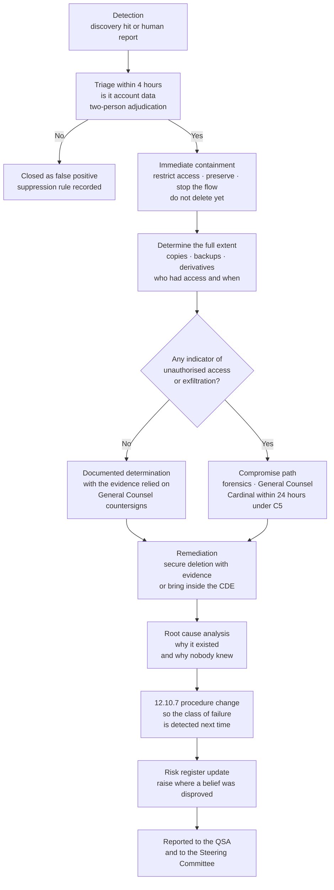

# 02.03 — Unexpected PAN Locations &amp; Response

| Field | Value |
|---|---|
| Document ID | MRG-PCI-2026-203 |
| Program | Marketa Retail Group — PCI DSS v4.0.1 Compliance Program |
| Phase | 02 — CDE Scoping &amp; Cardholder Data Discovery |
| Version | 1.0 |
| Status | Approved |
| Owner | Elena Marchetti, VP Payment Operations |
| Approver | Naomi Bhatt, Chief Information Security Officer |
| Date | 2026-07-15 |
| Classification | Confidential — Cardholder Data Environment // Illustrative Portfolio Sample |

## Purpose

The discovery exercise in 02.02 found account data in **four places Marketa did not expect it to be**. This document works each one from detection to closure: how it was found, why it existed, why nobody knew, what the root cause was, what was done immediately, what was done properly, and what procedure changed as a result under Requirement **12.10.7**.

It then does the harder thing. Two of the twelve assumptions in 01.08 did not survive these findings, and one risk went **up** as a direct consequence. Remediation is complete on all four. That fact repairs the data. It does not repair the belief, and §7 says so at length rather than in a footnote.

## 1. How These Four Are Being Reported

Requirement **12.10.7** — one of the 51 requirements that became mandatory on 2025-03-31 — obliges an entity to have incident response procedures in place, to be initiated upon the detection of stored PAN anywhere it is not expected. Marketa did not have such a procedure at the start of Phase 02. It had a general incident response plan under 12.10.1 that assumed an incident meant an attacker.

The four findings were therefore handled under a procedure written mid-exercise, on 2026-01-29, the day after the first finding. That is not the order in which anyone would choose to do it, and it is recorded honestly for the same reason the rest of this document is: a programme that only reports the things it did in the right order is not reporting.

Two features of that flow were decided deliberately and are worth calling out. **Containment precedes deletion, always** — the instinct on finding a card number is to delete it, and deleting it destroys the evidence needed to establish extent, access history and root cause. And **the decision not to escalate is documented as carefully as a decision to escalate**, because "we concluded there was no compromise" is a determination someone will want to see the basis for, possibly years later.

## 2. Finding PAN-01 — Spoken PAN in the QA Call-Recording Archive

| Attribute | Detail |
|---|---|
| Location | Call-centre quality-assurance call-recording archive, Austin technology office; primary storage on the recording platform, with a secondary copy in the Austin archive tier |
| Volume | **~11,400 recordings** containing an audible primary account number |
| Data elements | PAN in all 11,400; expiration date additionally in 8,940. **No card verification code, no track data, no PIN** |
| Date range of affected recordings | 2019-03 to 2023-06 — the period between the archive's retention horizon and the Cadence DTMF suppression go-live |
| Detected | 2026-02-03 |
| Contained | 2026-02-03, same day |
| Remediation complete | 2026-03-27 |
| Assumption affected | **A-04 — disproved** |
| Risk consequence | **R-31 raised** |

### How it was found

Not by the text discovery pipeline, which cannot read audio. The recording estate was brought into the discovery population as a deliberate act, precisely because 01.08 §3 listed "historical data predates current controls" as a blind spot in the 604. A separate audio pipeline was built: automatic speech recognition over the pre-masking population, followed by a digit-sequence grammar tuned for spoken card numbers — including the ways people actually say them, in groups of four, with corrections, restarts and read-backs.

The population was risk-targeted rather than exhaustive. Of 1.62 million recordings in the archive, **214,900** carried a payment-completion event in the associated order record within the pre-masking date range. Those 214,900 were processed in full. **11,400 — 5.3% — contained an audible PAN.** A 384-recording statistical sample of the remaining population was processed as a control and produced no hits, supporting the conclusion that the payment-event association was a sound filter.

### Why it existed

Before Cadence, Marketa's MOTO payment control was **manual pause-and-resume**: the agent pressed a control in the desktop client to stop the recording before taking card details, and pressed it again afterwards. The digits themselves were then keyed by the customer into an automated leg where the flow worked, but in exception cases — an invalid entry, a timeout, an accessibility need, a customer on a handset with unreliable tone generation — the agent took the PAN verbally.

Two failure modes therefore combined. The exception path put spoken PANs into the audio. The manual pause put the recorder's state in the hands of a person who was simultaneously handling a customer, and who sometimes paused late, resumed early, or did not pause at all.

**5.3% is what a manual control operated by human beings under time pressure actually achieves.** That number is the finding, more than the 11,400 is.

### Why nobody knew

| Reason | Explanation |
|---|---|
| The control that replaced it was believed to be retrospective | The organisation's mental model was "we have DTMF masking, therefore recordings do not contain card numbers." The masking is forward-looking and always was. Cadence's own AOC says nothing about Marketa's historical archive, as 01.09 §3.2 records |
| The archive is not a system in the CMDB sense | It is a storage tier belonging to an application. It carried no data-classification tag and appeared in no data inventory |
| Nobody had ever listened to a representative sample for this purpose | QA listened to recordings to assess agent performance, with a script that did not mention card data. An assessor had never sampled the archive because the archive had never been in scope |
| The retention rule outlived the process it served | Seven-year retention had been set for dispute and QA purposes and was never revisited when the payment process changed in 2023 |

### Root cause

**Primary:** a control whose effectiveness depended on an operator performing an action correctly during a customer interaction, with no automated enforcement and no exception detection.

**Contributing:** the absence of a retrospective review when the control changed in 2023. Deploying DTMF suppression was treated as a project with a go-live date, not as a change that raised a question about everything that came before it.

### Immediate containment

| Action | Timing |
|---|---|
| Archive access reduced to a two-person investigation group; all other access revoked, including QA and workforce management | Within 3 hours of adjudication |
| Legal hold check performed with the General Counsel to identify any recording subject to a preservation obligation | Same day |
| Export, download and playback disabled at the platform level for the affected date range | Same day |
| Access history for the affected date range retrieved and reviewed for indicators of bulk access or export | Completed 2026-02-05 — no bulk access, no export, no anomalous pattern |

### Remediation

Every one of the 11,400 recordings was **securely deleted**, with a deletion manifest retained listing the recording identifier, date, duration and deletion timestamp — the manifest itself carrying no account data. Eleven recordings were under a live preservation obligation; those were moved to an encrypted, access-controlled hold location inside the CDE, with a documented review date, rather than deleted. Secondary copies in the Austin archive tier were deleted on the same manifest. Backup sets containing the affected date range were reviewed; the recording platform's backups had already aged out of the affected window under a 90-day retention rule.

Retention was then reduced from seven years to **13 months** for QA purposes, justified by a targeted risk analysis under **12.3.1** and endorsed by Payment Operations and the General Counsel.

### The 12.10.7 procedure change it drove

**Procedure P-1 — account data discovered in media.** The general incident procedure assumed a file. This one covers audio, video and image media: how to quarantine a recording estate without breaking the contact centre, how to adjudicate audio under dual control, how to build a deletion manifest that evidences destruction without reproducing the data, and how to handle preservation obligations that conflict with a deletion instruction.

It also introduced a standing rule with wider application than the finding: **any change to a control that affects what is captured or recorded triggers a retrospective review of the data captured before the change.** Deploying a control creates a boundary in time, and the data on the far side of it is still yours.

## 3. Finding PAN-02 — The Legacy Chargeback Dispute File Share

| Attribute | Detail |
|---|---|
| Location | Legacy chargeback dispute file share, Columbus data centre — an SMB share with no owning application |
| Volume | **2,187 scanned documents**, plus **33 copies** in backup sets at Ashburn |
| Data elements | Full PAN, cardholder name, expiration date — legible on scanned issuer dispute packets, retrieval requests and signed sales drafts |
| Date range | 2017 to 2021 |
| Encryption at rest | **None.** Plain files on an unencrypted volume |
| Access | A security group with 63 members, of whom **22** no longer had any dispute-handling role |
| Detected | 2026-01-28 |
| Contained | 2026-01-28, same day |
| Remediation complete | 2026-02-13; Ashburn backup copies tracked to natural expiry **2026-05-31** |
| Assumption affected | **A-07 — disproved** |

### How it was found

By the share crawler, on the first pass. This was the earliest of the four findings and the one that reset the programme's expectations about the whole exercise, five days into it.

The share was one of the **three unowned shares** identified during share enumeration in 02.02 §8 — present in the DFS namespace, absent from every register, with no owner recorded and no retention rule applied. It was scanned because the enumeration used three independent methods and reconciled them, not because anybody knew it was there.

The documents are scans, so the pattern match ran over the output of optical character recognition rather than over text. That introduced its own adjudication burden: OCR of a faxed issuer packet is imperfect, and a proportion of candidates were malformed digit strings requiring visual confirmation. Every one of the 2,187 was visually confirmed by two adjudicators working from a quarantine copy inside the CDE.

### Why it existed

Because that is how chargebacks worked before 2021. An issuer raising a dispute sent a retrieval request or a dispute packet — frequently by fax, sometimes by post — and those documents bore the full account number, because they were generated by an issuer for whom the account number is the reference. Marketa's disputes team scanned them, filed them on the share, and worked from them.

In 2021 the process migrated to Truvance's dispute portal, where cases are referenced by token and by the last four digits. The migration was completed properly. **The archive was simply never dispositioned.** It stopped being written to and nobody was assigned to decide what should happen to it.

### Why nobody knew

| Reason | Explanation |
|---|---|
| A share is not a system | The CMDB records systems. The share sat on a file server that *was* in the CMDB, but the CMDB has no concept of "what is in the directories" |
| The owner had left | The disputes manager who created the share left Marketa in 2022. Ownership was recorded as a department, not a person, and a department cannot make a retention decision |
| The retention policy pointed at nobody | Payment Operations' retention schedule listed "dispute correspondence — 7 years" without naming a system, a location or an accountable individual |
| The 2021 migration had no data-disposition step | The project's definition of done was "cases are in the portal." It was not "the old data is gone" |
| Access was inherited, not granted | The 63-member group had accreted through role changes and group nesting. Nobody had reviewed it because nobody owned it |

### Root cause

**Primary:** a business process that legitimately received full PAN from a third party, with no defined end-of-life for the artefacts it created.

**Contributing:** the absence of an ownership requirement for unstructured data repositories, and a migration project scoped to move the process rather than to retire the data.

### Immediate containment

| Action | Timing |
|---|---|
| Share set to read-only, then all access revoked except a two-person investigation group | Within 90 minutes of adjudication |
| Working copy taken to an encrypted quarantine volume inside the CDE for adjudication; original preserved unaltered | Same day |
| File-server access logs for 24 months retrieved and analysed for read, copy and enumeration events | Completed 2026-02-02 — access confined to 4 accounts, all disputes personnel, all consistent with historical case work, no bulk copy, no external transfer |
| Ashburn backup catalogue searched for sets containing the share path | Completed 2026-01-30 — 33 sets identified |

### Remediation

The 2,187 documents were **securely deleted** from the primary share, evidenced by a deletion manifest and by a post-deletion re-scan of the volume producing zero hits. The share itself was removed from the DFS namespace and decommissioned. Nineteen documents relating to two disputes still within their chargeback lifecycle were re-created in the Truvance portal by case reference and the originals destroyed.

The Ashburn backup copies could not be treated the same way, and this is the part worth reading twice.

> **Surgical deletion from an immutable backup set is generally not available.** The 33 sets were written under retention lock as part of the very control regime that protects backups from ransomware and from insider deletion. Purging selected objects would have required either breaking the retention lock — degrading a control that matters more than the finding does — or restoring, editing and rewriting whole sets, which multiplies handling of the data it is meant to protect.
>
> Marketa took the third option and documented it: **a formal exception, restricted restore, and tracking to natural expiry.** Restore rights on those 33 sets were reduced to two named individuals with dual authorisation; a technical control was placed on the backup platform requiring a documented approval for any restore of the affected sets; the exception was recorded in the risk register with an owner and an expiry date; and the last affected set aged out on **2026-05-31**, five months before QSA fieldwork. Expiry was verified by catalogue evidence, not assumed from the retention policy.

### The 12.10.7 procedure change it drove

**Procedure P-2 — account data in unstructured repositories with no owning application.** Its operative provisions: every network share, collaboration site and document repository must have a **named individual owner** and an explicit retention rule; unowned repositories are a standing quarterly discovery task rather than an annual one; deletion must be evidenced by manifest **and** by post-deletion re-scan; and any data-migration project must carry a data-disposition step in its definition of done, signed off by the receiving process owner.

It also added the backup exception pattern above as a documented, pre-approved handling route, so that the next team facing an immutable copy does not have to invent the answer under pressure.

## 4. Finding PAN-03 — Debug Log on a Decommissioned E-Commerce Host

| Attribute | Detail |
|---|---|
| Location | Application debug log on a decommissioned e-commerce application host, AWS us-east-1 — an EC2 instance stopped in August 2024 with its EBS volume retained, plus one EBS snapshot |
| Volume | **1 log file, 1.4 GB, containing 1,143 distinct PAN instances** |
| Data elements | PAN and expiration date. **The card verification code field was redacted** — see below |
| Date range of log entries | 2022-04 to 2022-11-14 |
| Detected | 2026-02-09 |
| Contained | 2026-02-09, same day |
| Remediation complete | 2026-02-16 |
| Assumption affected | A-08, qualified — the host was in the 1,238 believed out of scope |

### How it was found

Through the decommissioned-system reconciliation described in 02.02 §6. The CMDB recorded the host as decommissioned on 2024-09-02. The AWS inventory API recorded the instance as **stopped**, not terminated, with a 400 GB EBS volume attached and one snapshot retained by a lifecycle policy. It was one of six systems in the estate whose CMDB status and actual state disagreed, and the only one of the six holding account data.

The volume was scanned by attaching a read-only copy to a scanning instance in an isolated subnet. The log was found in the application's log directory.

### Why it existed

The host predates the hosted checkout iframe. Until the Truvance iframe went live on **2022-11-14**, Marketa's e-commerce checkout used a **server-side integration** in which the card details were posted to Marketa's application tier and forwarded to the gateway. In that architecture the PAN legitimately transited Marketa systems — which is precisely the exposure the iframe migration was undertaken to remove.

In April 2022, during troubleshooting of an intermittent authorisation failure, a developer raised the checkout service's log level to `DEBUG` in production. At `DEBUG`, the service logged the full outbound gateway request payload. The change was made under a ticket, the incident was resolved, and **the log level was never reverted.** It stayed at `DEBUG` for seven months until the service was decommissioned at the iframe cutover.

The redaction detail is the instructive part. The logging library applied field-level redaction against a **deny-list of field names**: `cvv`, `cvc`, `securityCode`, `pin`. The gateway payload's card number field was named `cardNumber`, which was not on the list. So the verification code was redacted in every one of the 1,143 records and the PAN was not.

**A deny-list redacts what someone remembered. An allow-list emits only what someone authorised.** The difference decided whether this finding involved sensitive authentication data, and it was decided by a naming convention.

### Why nobody knew

| Reason | Explanation |
|---|---|
| The host was "decommissioned" | A status in a database. Nothing in the organisation reconciled that status against the cloud provider's inventory |
| A stopped instance costs almost nothing | No cost-management alert fired. Stopped instances are filtered out of most operational dashboards by default |
| The volume outlived the instance | EBS volumes persist independently. The snapshot lifecycle policy kept a copy, faithfully, for a system nobody believed existed |
| The log was inside a filesystem | No inventory, tag or classification scheme reaches inside a block volume |
| The debug change had no closure check | The change record was closed when the incident was resolved. Nothing verified that the temporary configuration had been reverted |

### Root cause

**Primary:** verbose diagnostic logging enabled in production and never reverted, with no automated detection of a non-standard log level.

**Contributing:** redaction implemented as a field-name deny-list rather than a pattern-based control; a decommissioning process with no data-destruction gate; and cloud resource lifecycle management that treated "stopped" as an end state.

### Immediate containment

| Action | Timing |
|---|---|
| Instance and volume isolated — security group set to deny all, IAM access restricted to two named engineers | Within 1 hour |
| Forensic copy of the volume taken to an encrypted, isolated analysis environment inside the CDE | Same day |
| CloudTrail history for the volume and snapshot reviewed for attach, copy, share and download events across the full retention period | Completed 2026-02-11 — no attach outside the original instance, no snapshot sharing, no cross-account copy, no public exposure at any point |
| Estate-wide search for other stopped instances with retained volumes | Completed 2026-02-12 — the other two identified in 02.02 §6 were scanned and were clean |

### Remediation

The log file was securely deleted; the EBS volume was deleted; the snapshot was deleted; the instance was terminated. AWS deletion evidence — API call records with timestamps and resource identifiers — was retained as the destruction record, because in cloud storage the deletion evidence is the API log, not a certificate.

Three preventive changes followed, all delivered in Phase 04: pattern-based log redaction replacing the deny-list; a pipeline guardrail rejecting any deployment configured with a debug log level for a production environment; and a change-closure check requiring temporary configuration changes to carry a revert action with a verification step.

### The 12.10.7 procedure change it drove

**Procedure P-3 — decommissioning as a data event.** No system may have its CMDB status changed to decommissioned without (a) a completed discovery scan of every attached storage volume, (b) a data-destruction attestation naming the individual who performed it, and (c) for cloud resources, evidence of **termination and volume and snapshot deletion**, not merely stopping. The procedure carries a standing rule expressed in five words that the infrastructure team now quotes back at people: **stopped is not terminated.**

## 5. Finding PAN-04 — The Store Manager's Emailed Spreadsheet

| Attribute | Detail |
|---|---|
| Location | A spreadsheet attachment, `special-orders-holiday-2025.xlsx`, present in 3 mailboxes and 2 email archives — **11 copies** in total once forwards and journal copies were counted |
| Volume | **34 records** |
| Data elements | PAN, cardholder name, expiration date, order reference |
| Origin | Customer-initiated. 34 customers emailed their own card details to a store's published special-orders address |
| Detected | 2026-02-11 |
| Contained | 2026-02-12 |
| Remediation complete | 2026-02-24; DLP enforcement live 2026-04-10 |
| Requirement breached | **4.2.2** — PAN sent by end-user messaging technologies |

### How it was found

By the email archive search. Three of the six archives returned hits on the same attachment hash, which is what made the copy-proliferation visible: the original message, four forwards, three mailbox copies and three journal copies of the same file.

### Why it existed

Marketa publishes a store email address for special orders and product enquiries. Between October and November 2025, 34 customers used it to send card details unprompted — some in response to being told a special order required prepayment, some simply because it seemed convenient. Nobody asked them to. The store manager at store #0317, wanting to get the orders processed before the seasonal cut-off, collated the details from those 34 emails into a spreadsheet and sent it to a district manager and to a corporate customer-service shared mailbox, so that Payment Operations could key them through the call-centre secure payment session.

The payments themselves were taken correctly, through the documented MOTO channel with the secure session. **No undocumented acceptance channel was created.** The failure was entirely in what happened to the data before it reached the channel.

### Why nobody knew

| Reason | Explanation |
|---|---|
| No procedure covered inbound account data | Awareness training said "never ask a customer for card details by email." It did not say what to do when a customer sends them anyway, which is the situation that actually occurs |
| The store manager was solving a real problem | 34 customers wanted their orders processed. Nothing in the tooling offered a compliant route that was as fast as the non-compliant one |
| No DLP rule existed for PAN in mail | Neither inbound quarantine nor outbound blocking was configured. There was nothing to detect the message, let alone stop it |
| Journal copies are invisible to the sender | Deleting the message from a mailbox does nothing to the journal archive. The people involved would have believed the data was gone |

### Root cause

**Primary:** no defined, trained and tooled procedure for handling account data received unsolicited from a customer, combined with no technical detection of PAN in the messaging estate.

**Contributing:** an awareness programme that covered the prohibition without covering the response. Telling people what not to do, without telling them what to do instead, produces improvisation — and improvisation by a capable person under time pressure produces a spreadsheet.

### Immediate containment

| Action | Timing |
|---|---|
| Attachment hash searched across the full messaging estate, including all archives and journals | Completed 2026-02-12 — 11 copies located |
| All copies placed on administrative hold and removed from user-accessible mailboxes | 2026-02-12 |
| The 34 originating customer emails located and handled under the same process | 2026-02-13 |
| Mail flow and audit logs reviewed for external forwarding of any of the 11 copies | Completed 2026-02-13 — **no external transmission**; all recipients internal |
| Store 0317 and the district contacted; the manager interviewed. Handled as a process failure, not a disciplinary matter | 2026-02-12 |

The decision to treat it as a process failure was made explicitly by the CISO and recorded. A programme that disciplines the first person to be caught improvising guarantees that the next one hides it, and the entire value of 12.10.7 depends on people reporting account data where they find it.

### Remediation

All 11 copies were purged with e-discovery evidence retained — search parameters, hit list, purge confirmation and post-purge re-search returning zero. The originating customer emails were purged on the same basis. Data loss prevention rules went live on 2026-04-10: **inbound** messages containing a Luhn-valid PAN are quarantined and the sender receives an automated reply explaining how to pay securely; **outbound and internal** messages containing one are blocked, with the sender and the security operations team notified.

A published procedure and a short store-facing training module followed, and store special-order handling was changed so that a customer wanting to prepay is sent a Truvance-hosted payment link rather than being left to work out their own route. **The compliant path is now the fast path**, which is the only kind of control that survives a seasonal peak.

### The 12.10.7 procedure change it drove

**Procedure P-4 — unsolicited account data received by message.** Do not forward, do not reply with the data quoted, do not print. Report to the security operations team within one hour. The team purges every copy including journals, evidences the purge, and responds to the customer with a safe alternative. The procedure explicitly instructs colleagues that **reporting is expected and is never penalised**, and that instruction is repeated in the 12.6.3 awareness content.

## 6. Requirement 3 and Requirement 4 Implications

The four findings are not only scope events. Each one, for the period it existed, put Marketa on the wrong side of specific requirements. Recording that plainly is part of the honesty of the exercise.

| Requirement | Obligation | Which findings breached it, and how |
|---|---|---|
| **3.2.1** | Account data storage kept to a minimum through retention and disposal policies, with a defined retention period and processes for secure deletion when no longer needed | **All four.** None of the four locations had a defined retention period tied to a business need. PAN-02 is the clearest case — a seven-year retention rule applied to data whose business purpose ended in 2021 |
| **3.3.1** | SAD not retained after authorisation | **None breached.** Verified in 02.02 §5 — and, in PAN-01 and PAN-03, avoided by accident rather than by design |
| **3.4.1** | PAN masked when displayed, no more than first six and last four to those without a business need | **PAN-02 and PAN-04.** The dispute documents and the spreadsheet displayed the full PAN to a population far wider than any business need supported — 63 group members for PAN-02, of whom 22 had no dispute role |
| **3.5.1** | PAN rendered unreadable anywhere it is stored | **PAN-02, PAN-03 and PAN-04.** All three were stored in clear. The dispute share sat on an unencrypted volume; the debug log was plain text; the spreadsheet was unprotected. PAN-01 is a different case — the recordings were encrypted at rest by the platform, so the failure there is 3.2.1 retention rather than 3.5.1 protection |
| **4.2.1** | Strong cryptography during transmission over open, public networks | **Not breached.** No affected data crossed a public network unprotected; PAN-04's copies all travelled inside Marketa's tenant over TLS |
| **4.2.2** | **PAN never sent by end-user messaging technologies** — email, instant messaging, SMS, chat | **PAN-04, squarely.** Both inbound, by 34 customers, and internally, when the spreadsheet was emailed onward. 4.2.2 admits no exception for internal mail and none for a customer who started it |
| **7.2.1 / 7.2.2** | Access by business need to know and least privilege | **PAN-02.** A 63-member inherited group over a card data store |
| **9.4.x** | Media handling, storage and destruction | Considered and confirmed not engaged. No hard-copy originals were retained; the dispute packets were scanned on receipt and the paper destroyed through Halberd at the time |
| **12.5.2** | Scope documented and confirmed | Each finding, at the moment of confirmation, made its host location a CDE system. Each was brought inside the CDE boundary until remediated, and each exited on deletion — recorded as scope transitions in the determination, not quietly reversed |

That last row is a point of method worth stating separately. **A location holding account data is a CDE system for as long as it holds it.** The quarantine volumes, the isolated analysis environment and the hold location for the 11 preserved recordings were all treated as CDE during the response and controlled accordingly. Handling a card data finding in an uncontrolled environment because it is "only temporary" is how a discovery exercise creates the exposure it was run to find.

## 7. The Honest Section — Two Assumptions Disproved, One Risk Raised

### 7.1 A-04 is disproved

> **A-04:** *No account data exists in the call-recording estate, because DTMF suppression prevents spoken and keyed PAN from being recorded.*

It does exist. It existed in approximately 11,400 recordings for between three and seven years, on a platform whose access group was wider than the investigation group that later reviewed it.

The assumption failed for a reason worth naming precisely, because the reasoning error is more portable than the finding. **The assumption reasoned from a control to a state of the world, and the control was newer than the world.** DTMF suppression prevents account data entering recordings made after it was deployed. It has no retrospective effect and never claimed one — Cadence's own position, recorded in 01.09 §3.2 before any of this was found, is that the service protects calls from the moment it is enabled forward. The organisation knew that fact and did not apply it.

### 7.2 A-07 is disproved

> **A-07:** *Dispute, chargeback and refund processes operate solely on tokens and truncated PAN; no document held for those processes bears a full card number.*

2,187 documents bore a full card number, with cardholder name and expiry alongside.

The reasoning error here is different and, if anything, more common. **The assumption described the process as it currently runs and treated that as a description of the data the process holds.** The 2021 migration to the Truvance portal genuinely did move disputes onto tokens; every statement in A-07 was true of the process on the day it was written. It was false about the estate, because a process that changes leaves its previous outputs behind, and nobody had been given the job of deciding what happened to them.

### 7.3 What about A-05?

> **A-05:** *Marketa stores only Truvance-issued tokens and truncated PAN; no full PAN exists at rest anywhere in the estate, including email and collaboration platforms.*

A-05 is contradicted by all four findings, and a reader is entitled to ask why the register records two disproofs rather than three.

The programme's position, stated so it can be argued with rather than discovered by inference: **A-05 is an umbrella restatement of the programme's overall claim, not an independent testable mechanism.** Every instance that contradicts it is an instance of A-04 failing, or of A-07 failing, or of a data-hygiene lapse — PAN-03 and PAN-04 — that A-05 did not attempt to model and that no control was ever asserted to prevent. Counting A-05 as a third disproof would count the same evidence twice and would overstate the number of *mechanisms* that failed, which is the thing the register exists to track.

A-05 has therefore been **restated in testable form** for Phase 03 onward, split into three separate claims each with its own verification method: no PAN in the corporate CDE beyond what the architecture specifies; no PAN in the messaging and collaboration estate, verified by continuous DLP telemetry rather than by belief; and no PAN in unstructured repositories, verified by quarterly discovery. A reviewer who thinks this is a distinction without a difference is invited to say so at the next Steering Committee; the reasoning is on the record specifically so that it can be challenged.

### 7.4 Risk R-31 was RAISED

Risk **R-31 — historical account data persisting in the call-recording estate** was raised on **2026-02-05**, two days after PAN-01 was confirmed. It was scored **likelihood 4 × impact 4 = 16**, which is **High** under the programme's scoring model.

It was raised, not lowered, and it stayed High through remediation. This is the standing rule the portfolio operates under, and this is the finding that made it real:

> **When testing disproves an assumption, the associated risk goes up.**
>
> A control that was believed to be working and was not was never protecting anything. The exposure was the same on 2026-02-02 as it was on 2026-02-04. What changed on 2026-02-03 was Marketa's knowledge of it. Risk registers exist to record what the organisation knows, and the honest movement on discovering an unprotected exposure is upward.

The temptation to do the opposite is strong and should be named. Every incentive in a compliance programme pushes toward reporting a finding and its remediation in the same breath, netting them off, and showing a risk that was briefly elevated and is now closed. It reads better. It is also a lie of composition, because it presents the *discovery* as the risk event when the discovery was the mitigation.

### 7.5 Remediation does not repair a disproved belief

All four findings are remediated. The data is gone, the deletions are evidenced, the preventive controls are built, and four new procedures exist under 12.10.7. Every one of those statements is true and verifiable.

**None of it makes A-04 true again.**

The distinction matters because of what the two things license. Remediation licenses a statement about the data: there is no longer account data in those four locations, and here is the evidence. A restored assumption would license something much larger — a statement about the *reliability of the organisation's beliefs about itself*, and specifically the belief that a deployed control describes the state of the environment. That belief was wrong, and deleting 11,400 recordings does not make it right.

What actually follows from the disproof is a change in method, and it is the most valuable thing this phase produced:

| Before Phase 02 | After Phase 02 |
|---|---|
| A deployed control was treated as evidence of the state of the environment | A deployed control is evidence of what happens **after its deployment date**. The state of the environment is evidenced by discovery |
| Data inventories were derived from system inventories | Data inventories are derived from **searching**, over a denominator that includes everything the system inventory does not cover |
| A process change was scoped to the process | A process change carries a **data-disposition step** in its definition of done |
| Assumptions were reviewed when someone remembered | The assumption register is reviewed at every scope-delta review, and any assumption resting on E4 or E5 evidence is flagged for re-testing |

Both A-04 and A-07 are now recorded in the register as **disproved on 2026-02-03 and 2026-01-28 respectively, remediated, and not reinstated.** They will not be reinstated. The controls that now cover those areas stand on their own evidence, and the register carries the disproof permanently, because the fact that the organisation once believed those things — with good reason, sincerely, and wrongly — is exactly the kind of thing a future scope review needs to know.

## 8. The 12.10.7 Procedure Set

Marketa entered Phase 02 without a 12.10.7 procedure and left it with five: a general one and one per finding class.

| Procedure | Trigger | Key provisions | Driven by |
|---|---|---|---|
| **P-0 — General** | Any detection of stored PAN where it is not expected | Triage within 4 hours; two-person adjudication; containment precedes deletion; documented determination on compromise; root cause required before closure; risk register update mandatory | The absence of any procedure at all |
| **P-1 — Media** | Account data in audio, video or image media | Estate quarantine without service interruption; dual-control audio adjudication; deletion manifest; preservation-obligation conflict handling; **retrospective review whenever a capture-affecting control changes** | PAN-01 |
| **P-2 — Unstructured repositories** | Account data in a share, site or repository with no owning application | Named individual owner and retention rule mandatory for every repository; quarterly unowned-repository discovery; deletion evidenced by manifest **and** re-scan; the immutable-backup exception pattern | PAN-02 |
| **P-3 — Decommissioning** | Status change to decommissioned; discovery of a live "decommissioned" system | Discovery scan of all attached storage; named data-destruction attestation; for cloud, termination plus volume and snapshot deletion evidence. **Stopped is not terminated** | PAN-03 |
| **P-4 — Unsolicited account data by message** | PAN arriving by email, chat or message, from anyone | Do not forward, quote or print; report within one hour; purge all copies including journals with e-discovery evidence; respond to the customer with a safe payment route; **reporting is never penalised** | PAN-04 |

All five are exercised in the Phase 07 incident response programme and tested by the QSA during fieldwork. Each is owned by Naomi Bhatt with a named operational lead, and each carries the same closure condition: **the procedure is not complete until the root cause is recorded and a preventive control is assigned an owner and a date.**

## 9. Notification, and the Decision Not To

Each finding was assessed against Marketa's compromise-notification obligation to Cardinal Merchant Bank — 24 hours from a suspected or confirmed compromise of account data.

| Finding | Access history evidence | Determination |
|---|---|---|
| PAN-01 | Platform access logs for the affected range; no bulk access, no export, no anomalous pattern | No indicator of compromise |
| PAN-02 | 24 months of file-server access logs; 4 accounts, all disputes personnel, no bulk copy, no external transfer. **Logs before that window did not exist — recorded as a limitation, not resolved by inference** | No indicator of compromise within the evidenced period; the limitation is stated |
| PAN-03 | Full-period CloudTrail; no attach outside the original instance, no snapshot sharing, no cross-account copy, no public exposure | No indicator of compromise |
| PAN-04 | Mail flow and audit logs; all 11 copies internal, no external transmission | No indicator of compromise |

The determination in each case, made jointly by the CISO and the General Counsel and countersigned by both, was that **no compromise had occurred and the 24-hour notification was not triggered.** All four findings were nonetheless disclosed to Cardinal in the scheduled programme update, disclosed in full to Sable Ridge Assurance at the March QSA checkpoint, and reported to the Steering Committee and the Audit Committee.

The reasoning is recorded with the evidence it rests on, including the PAN-02 log-retention limitation. A decision not to notify is a decision, and it needs to be as evidenced as the alternative — particularly the one where the evidence has a hole in it and the determination was made anyway.

## Cross-References

| Reference | Relevance |
|---|---|
| 01.08 — Scope Assumptions &amp; Constraints | Assumptions A-04, A-05, A-06, A-07 and A-08; the standing rule that disproof raises risk |
| 01.09 — Third-Party Service Provider Register | Cadence's forward-only position, recorded before PAN-01 was found |
| 02.01 — Scoping Methodology | The evidence standard, and why a location holding account data is CDE while it holds it |
| 02.02 — Cardholder Data Discovery | How each finding was detected, and the SAD result that spared three of them |
| 02.06 — Call Centre / MOTO Channel Scope | The current-versus-historic distinction that PAN-01 turns on |
| Phase 03 — Network Segmentation Architecture | Risk R-31 in the baseline register; risk R-14 raised on the failed segmentation test |
| Phase 04 — Build &amp; Maintain Secure Systems | Pattern-based log redaction, pipeline guardrails, DLP enforcement, Requirement 3 controls |
| Phase 07 — Security Policy, Risk &amp; Incident Response | The five 12.10.7 procedures, exercised and tested |
| Phase 08 — QSA Assessment &amp; ROC Production | How the findings and the disproofs were presented to the assessor |

---
[⬅ Previous](02.02-cardholder-data-discovery.md) · [🏠 Phase 02 Home](02.00-README.md) · [Next ➡](02.04-card-present-channel-scope.md)
