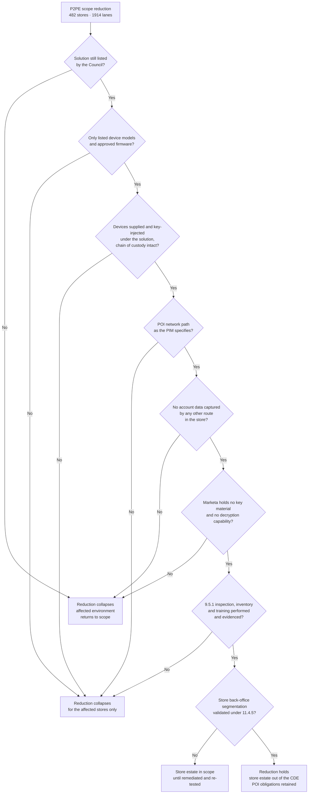

# 02.04 — Card-Present Channel Scope

| Field | Value |
|---|---|
| Document ID | MRG-PCI-2026-204 |
| Program | Marketa Retail Group — PCI DSS v4.0.1 Compliance Program |
| Phase | 02 — CDE Scoping &amp; Cardholder Data Discovery |
| Version | 1.0 |
| Status | Approved |
| Owner | Trevor Kim, Director of Infrastructure &amp; Network |
| Approver | Naomi Bhatt, Chief Information Security Officer |
| Date | 2026-07-15 |
| Classification | Confidential — Cardholder Data Environment // Illustrative Portfolio Sample |

## Purpose

This document answers **Q-03**: *does the PAN ever traverse or rest on a Marketa system in the card-present channel?* It tests assumptions **A-01** and **A-02**, and it establishes the largest single scope reduction in the programme — **482 store back-office servers and 496 store-estate network appliances, covering 1,914 lanes and 74% of Marketa's transaction volume, removed from the cardholder data environment.**

The answer to Q-03 is **no**, and the evidence is set out below. The more important content is what that answer depends on, because a reduction of this size is only as good as the conditions holding it up.

## 1. What Is Being Claimed, and What Is Not

| Claim | Status |
|---|---|
| Account data is encrypted inside the POI device at the moment of read, and Marketa holds no capability to decrypt it | **Claimed and evidenced** |
| The POS lane, store server, store LAN and corporate WAN carry only ciphertext Marketa cannot read | **Claimed and evidenced** |
| Those systems are therefore outside the CDE | **Claimed, conditionally** — see §8 |
| The store estate is outside the assessment | **Not claimed.** POI obligations under 9.5.1 remain; segmentation must be validated; the segmentation controls themselves are in scope |
| P2PE removes Marketa's Requirement 3 obligations for the store estate | **Not claimed.** It removes them only for as long as no account data is captured in the store by any other route — which is what A-02 asserts and §6 tests |
| The Verition attestation evidences Marketa's position | **Not claimed.** It is E3 evidence under 02.01 §5 — it evidences Verition's environment. Marketa's operation of the solution is Marketa's to evidence |

## 2. What a PCI-Listed P2PE Solution Actually Buys

Point-to-point encryption is not part of PCI DSS. It is a separate standard, with its own validation programme, its own assessor qualification — a **P2PE QSA**, not a PCI DSS QSA — and its own published list of validated solutions maintained by the Council. A merchant does not "have P2PE." A merchant **uses a listed solution**, supplied by a solution provider who has been assessed against the P2PE standard.

What that listing represents is a set of validated properties, and it is worth being specific about which of them do the scope work.

| Validated property | What it means | Why it matters to scope |
|---|---|---|
| Encryption occurs **inside the POI device**, at the point of interaction | The account data is enciphered by a SRED-capable device before it leaves the reader. There is no window during which clear-text account data exists on the lane | Nothing downstream ever holds readable account data |
| Keys are injected and managed **by the solution provider**, under assessed key-management controls | Marketa neither generates, holds, escrows nor can obtain the keys | The merchant environment cannot decrypt, so it cannot be said to process account data |
| The **decryption environment is outside the merchant's control** | Verition operates an HSM-based decryption environment and hands the authorisation to Truvance | The decryption boundary is the scope boundary, and it sits outside Marketa |
| The solution as a whole — devices, applications, key management, decryption, and the **P2PE Instruction Manual** — has been assessed together | The listing is of a *solution*, not of a device | Substituting any component steps outside what was validated |

The consequence, stated as the Council's guidance states it: systems that receive, store or transmit only account data encrypted by a listed P2PE solution, where the merchant has no ability to decrypt, are **out of the merchant's cardholder data environment**. That is the whole of the reduction, and it is entirely conditional on the merchant having no decryption capability and operating the solution as validated.

## 3. P2PE Versus Plain Point-to-Point Encryption

Marketa's programme insists on the distinction in writing, because the two are routinely conflated by vendors, and occasionally by merchants who have read a datasheet rather than a listing.

| Dimension | **PCI-listed P2PE solution** | Non-listed encryption — often marketed as "end-to-end" or "P2PE-like" |
|---|---|---|
| Assessed against the P2PE standard | Yes, by a P2PE QSA | No |
| Appears on the Council's list of validated solutions | Yes | No |
| Key management assessed | Yes, as part of the solution | Vendor's own assertion |
| P2PE Instruction Manual issued to the merchant | Yes — a required deliverable of the programme | Usually no equivalent, or an informal deployment guide |
| Scope reduction | Recognised, subject to the merchant operating per the PIM | **Not automatic.** The merchant must analyse and evidence it, and the QSA determines whether and how far scope is reduced |
| How a merchant establishes reduction | Points to the listing, evidences PIM adherence | Commissions an assessment of the encryption solution — the Council's guidance for non-listed encryption solutions describes this route — and presents it to the assessor, who is not obliged to agree |
| Practical position for a Level 1 merchant | Defensible, repeatable, and cheap to re-evidence annually | Defensible only if the analysis is done properly, and expensive to re-evidence every year |

The honest summary Marketa uses internally: **an encryption product may be excellent and still buy no scope reduction.** Encryption strength is not the question the listing answers. The listing answers whether an independent assessor has verified, against a published standard, that the merchant cannot decrypt and that the operating conditions are specified. Marketa uses a listed solution from Verition POS Systems, verified against the Council's published list on **2026-06-30**, with the P2PE Attestation of Validation dated **2025-09-12** on file.

## 4. The P2PE Instruction Manual — Where the Conditionality Lives

The PIM is the document that converts a validated solution into a validated deployment. It is issued by the solution provider, it is specific to the solution, and it tells the merchant what it must do for the solution to remain the thing that was assessed. Marketa holds **PIM version 4.2**, issued by Verition and held by Store Operations.

Deviating from the PIM does not necessarily break the encryption. It breaks the basis on which the scope reduction was claimed, which for assessment purposes amounts to the same thing.

### The PIM control checklist

Marketa converted the PIM into an operational checklist with a named owner, a verification method and a frequency for every control. This is the artefact the QSA tests, and it is the reason the reduction can be re-evidenced annually without re-running the whole analysis.

| # | PIM control | Verification method | Frequency | Owner |
|---|---|---|---|---|
| PIM-01 | Only POI device models included in the listed solution are deployed | Device inventory reconciled against the solution's listed component set | Monthly | Adaeze Nwosu |
| PIM-02 | Only firmware versions within the listed solution's approved range are running | Verition estate-management telemetry, reconciled against the listing | Monthly | Trevor Kim |
| PIM-03 | Devices are received, inspected and recorded against the shipping manifest before deployment | Receipt records with serial reconciliation | Per delivery | Adaeze Nwosu |
| PIM-04 | Chain of custody maintained from provider to lane, and for every subsequent move | Device movement log | Per movement | Adaeze Nwosu |
| PIM-05 | POI devices are connected only through the network path the PIM specifies | Store network configuration review plus flow analysis | Quarterly, and on any store network change | Trevor Kim |
| PIM-06 | Devices are physically secured and protected from substitution | Store physical control standard; inspection regime under 9.5.1 | Quarterly inspection | Adaeze Nwosu |
| PIM-07 | Personnel are trained to identify tampering and substitution and to report it | Training completion records under 9.5.1.3 | On hire, then annually | Adaeze Nwosu |
| PIM-08 | Tamper indications and suspected substitutions are reported to Verition and to Marketa security within the PIM's timescale | Incident records; escalation evidence | Per event | Adaeze Nwosu / Marcus Hale |
| PIM-09 | Devices are decommissioned and returned or destroyed per the PIM | Return manifests; destruction certificates from Halberd where applicable | Per decommission | Adaeze Nwosu |
| PIM-10 | No account data is captured by any means other than the POI device | Lane-level capture testing; POS application configuration review; store process walkthrough | Annually, and on any POS application change | Trevor Kim |
| PIM-11 | Marketa holds no cryptographic key material and no decryption capability | Key-management attestation; negative testing; contract review | Annually | Trevor Kim |
| PIM-12 | The solution remains listed by the Council | Direct check of the Council's published list | Quarterly, and on any provider announcement | Owen Castellanos |

PIM-10 and PIM-11 are the two that decide whether the reduction exists at all. The others decide whether it exists **at a given store**.

## 5. Per-Store Verification Across 482 Stores and 1,914 Lanes

Constraint **CON-02** governs everything about how this was done: 482 stores means a change or a visit is a 482-fold operation. A verification design requiring an engineer at every store would have consumed the phase and most of the budget, so the design separates what must be verified everywhere from what can be verified by sample.

| Verification layer | Coverage | Method | What it establishes |
|---|---|---|---|
| **Documentary and telemetric** | **100% — all 482 stores, all 1,914 lanes** | Device inventory reconciliation; firmware and model telemetry from Verition's estate management; store network configuration extracts; POS application version and configuration reporting | That every lane runs a listed device on approved firmware, connected through the specified path, with the POS application in the configuration the PIM assumes |
| **Network path validation** | **100% of stores** | Configuration analysis of every store switch and router, plus NetFlow analysis of POI-sourced traffic against expected destinations | That no POI is reachable from, or reaching, anywhere the PIM does not permit |
| **Discovery scanning** | **100% of store back-office servers and appliances** | The exercise in 02.02 | That no account data is at rest anywhere in the store estate |
| **On-site lane-level capture testing** | **Sample — 24 stores, 96 lanes** | Physical capture at the lane and at the store switch, with test transactions across every acceptance mode | That what is actually on the wire is ciphertext, in every acceptance mode, including the ones nobody thinks about |
| **Process walkthrough** | **Sample — the same 24 stores** | Observation of a full trading shift, including exception handling, refunds, price overrides, offline mode and end-of-day | That there is no human or procedural path by which a card number is captured outside the POI |

### Sample design

The 24 stores were selected on a stratified basis, so that the sample answers a question about the estate rather than about 24 stores.

| Stratum | Stores selected | Rationale |
|---|---|---|
| Store format — large format, standard, compact | 12 | Lane counts and back-office topology differ by format |
| Geography — one store from each of the seven regional operating areas, plus overlap | 7 | Regional field teams perform installations; a regional practice difference would show here |
| Installation wave — earliest, middle and most recent P2PE deployment waves | 6 | The earliest installations are the most likely to have drifted |
| Judgemental additions | 4 | The three oldest installations in the estate, and one store that had a full network refresh in November 2025 |
| Overlap between strata | −5 | Several stores satisfy more than one criterion |
| **Total** | **24 stores — 5.0% of the estate; 96 lanes — 5.0% of lanes** | Sampling justification documented for the QSA under the standard's sampling provisions |

## 6. Lane-Level Capture Testing

This is the E1 evidence on which the whole reduction ultimately rests: not a diagram, not an attestation, but a packet capture showing what leaves the PIN pad.

| Parameter | Detail |
|---|---|
| Capture points | Two per lane — the POI-to-lane segment, and the store-server-to-WAN segment at the store switch, via a mirrored port |
| Test transactions | **3,840** — 40 per lane across 96 lanes |
| Acceptance modes tested | EMV contact, EMV contactless, mobile wallet contactless, magnetic-stripe fallback, and **manual key entry performed on the POI keypad** |
| Transaction types | Sale, refund, void, partial approval, declined authorisation, and offline store-and-forward |
| Volume captured | ~1.9 TB |
| Analysis | Full-payload search for Luhn-valid 13–19 digit sequences and for track-data structures; plus structural validation that every payload matched the expected P2PE ciphertext envelope |
| **Clear-text PAN observed** | **Zero** |
| **Track data observed** | **Zero** |
| Payloads not matching the expected ciphertext envelope | Zero |

Four aspects of the design are there because they are the ways this test is usually got wrong.

**Manual key entry was tested deliberately.** The obvious worry in a card-present environment is a keyed-entry path that bypasses the reader. Marketa's answer is that manual entry is performed *on the POI keypad*, so the digits are enciphered by the same SRED function that handles a swipe. The test confirmed that: keyed transactions produced ciphertext indistinguishable in structure from dipped ones. A keyed-entry path on the POS terminal keyboard, by contrast, would have put clear-text PAN into the lane and would have collapsed the reduction for the entire estate. There is no such path, and the POS application configuration review confirmed the field does not exist.

**Magnetic-stripe fallback was tested,** because it is the mode most likely to behave differently and the one least often exercised.

**Offline store-and-forward was tested,** because a lane that cannot reach the network must hold the transaction somewhere until it can. The capture confirmed that what is held is the ciphertext envelope, not the account data.

**Receipts were examined** at every sampled lane. Customer and merchant copies print no more than the last four digits, consistent with **3.4.1** and with the brands' receipt requirements. Reprints, gift receipts and the store copy of a refund voucher were checked individually, because a receipt variant is the classic place a truncation rule is missed.

## 7. Device Inventory Under 9.5.1

Requirement **9.5.1** obliges the merchant to protect POI devices from tampering and substitution — a requirement that P2PE does not touch, because it is precisely the requirement that guards the assumption P2PE rests on. Its sub-requirements are **9.5.1.1** (an up-to-date list of devices), **9.5.1.2** (periodic inspection to detect tampering and substitution) and **9.5.1.3** (training for personnel to be aware of attempted tampering and to report it).

| Inventory attribute | Held? | Source of truth |
|---|---|---|
| Make and model | Yes | Verition estate management, reconciled to physical |
| Serial number | Yes | Physical label and device-reported serial, both captured |
| Location — store number and lane identifier | Yes | Store Operations device register |
| Firmware version | Yes | Verition telemetry, refreshed daily |
| Deployment date and installation wave | Yes | Device movement log |
| Last inspection date and outcome | Yes | Inspection records under 9.5.1.2 |
| Chain-of-custody history | Yes | Device movement log |

The reconciliation performed in February compared the register against physical and telemetric reality across all 1,914 devices.

| Reconciliation result | Count | Disposition |
|---|---|---|
| Register entry matches physical device and telemetry | 1,907 | — |
| **Serial number mismatch** | **7** | All traced to like-for-like device swaps performed by field engineering during fault replacement, where the new serial was not recorded. Devices confirmed as listed models on approved firmware, received through the proper chain of custody. Register corrected; the swap procedure now requires serial capture before the replacement is put into service |
| Devices in the register not physically present | 0 | — |
| Devices physically present not in the register | 0 | — |

Seven mismatches out of 1,914 is a 0.37% error rate and none of them was a substitution. It is reported anyway, because **an inventory that cannot detect a swap cannot detect a substitution**, and those are the same technical event with different intent. The procedural fix matters more than the finding.

The quarterly inspection regime itself, its design for a workforce that includes 6,800 seasonal colleagues under constraint **CON-09**, and the six tamper-evident seal discrepancies found in Q3 are Phase 05's subject matter.

## 8. The Nine Conditions, and What Collapses the Reduction

| # | Condition | Verification | Frequency | Collapse consequence |
|---|---|---|---|---|
| **P2PE-C1** | The Verition solution remains listed by the Council | Direct check of the published list | Quarterly and on announcement | Estate-wide. Reduction suspended until restored; Cardinal notified under **C7** |
| **P2PE-C2** | Only listed device models and approved firmware are deployed | Telemetry reconciled to the listing | Monthly | Store-level, for the affected stores |
| **P2PE-C3** | Devices are the ones supplied and key-injected under the solution, with an unbroken chain of custody | Device movement log; receipt reconciliation | Per movement | Store-level |
| **P2PE-C4** | The POI network path is as the PIM specifies | Configuration and flow analysis | Quarterly and on store network change | Store-level |
| **P2PE-C5** | No account data is captured in the store by any means other than the POI | Capture testing; POS configuration review; process walkthrough; discovery scanning | Annually, on POS change, and continuously through discovery | **Estate-wide** — a capture path in the POS application exists everywhere the application does |
| **P2PE-C6** | Marketa holds no key material and no decryption capability | Attestation, contract review and negative testing | Annually | **Estate-wide.** This is the condition the entire reduction is built on |
| **P2PE-C7** | 9.5.1 inspection, inventory and training are performed and evidenced | Inspection records; register reconciliation; training completion | Quarterly / continuous | Store-level, and a Requirement 9 finding regardless of scope effect |
| **P2PE-C8** | Store back-office segmentation from corporate and from guest wireless is validated | Penetration test under **11.4.5** | At least annually and after change | Store estate in scope until remediated and re-tested |
| **P2PE-C9** | No secondary card acceptance method operates in the store — no undocumented terminal, no departmental acceptance, no event or pop-up path | Merchant ID reconciliation with Cardinal; revenue and expense analysis; store walkthrough | Annually — Q-13 | Store-level or channel-level depending on what is found |

Note the asymmetry between store-level and estate-wide collapse, because it is the difference between an inconvenience and an emergency. Conditions about **deployment** fail locally: a store with the wrong firmware is a store-shaped problem. Conditions about **capability** fail globally: if Marketa could decrypt, or if the POS application had a clear-text capture path, the problem exists everywhere the software does.

## 9. Findings from Verification

Two conditions were found not to be holding, in a small number of places, and the handling of both illustrates the method better than a clean result would have.

### 9.1 Three stores with a non-conforming POI network path — condition P2PE-C4

Network path validation across all 482 stores identified **three stores** where a POI device was connected through a network path the PIM does not permit. In each case a local contractor had replaced a failed store switch and re-patched the POI into the store's general data VLAN rather than the dedicated POI VLAN the PIM specifies.

The account data was still encrypted. The SRED function in the POI is indifferent to which VLAN the ciphertext travels over, and there was no exposure of account data at any point.

Marketa nonetheless treated the three store environments as **in scope pending correction**, and recorded them that way. The reasoning: the reduction is claimed on the basis of operating the solution in accordance with the PIM, and for those three stores Marketa was not doing that. A reduction claimed on a condition that is not being met is not a reduction, whatever the underlying cryptography is doing. The conservative reading is the correct one, and it is also the one an assessor will take.

| Action | Date |
|---|---|
| Non-conformance identified through configuration and flow analysis | 2026-02-06 |
| Three store environments recorded as in scope; Steering Committee informed | 2026-02-06 |
| Re-patching completed at all three stores | 2026-02-15 — 9 days |
| Configuration and flow re-verification | 2026-02-16 |
| Scope Decision Record amended; stores returned to the reduced position | 2026-02-17 |
| Contractor change-control procedure amended to require POI port verification before sign-off, and store network change notification to the PCI programme | 2026-03 |

### 9.2 Seven device register mismatches — condition P2PE-C7

Described in §7. Corrected, with a procedural change to the swap process.

### 9.3 What was not found

| Tested for | Result |
|---|---|
| A lane running a device model outside the listed solution | None |
| A lane running firmware outside the approved range | None |
| A keyed-entry path to a non-POI device | None — the field does not exist in the POS application |
| Card imprinters or manual paper capture in any of the 24 sampled stores | None |
| Card numbers written down at the lane, in the back office, or in the safe | None observed in 24 full-shift walkthroughs |
| Account data at rest on any store back-office server | None — 02.02 |
| Any Marketa-side decryption capability or key material | None |
| Receipts printing more than the last four digits | None across all variants tested |

## 10. Where the Store Estate Lands

The reduction holds. Its consequences for classification need stating carefully, because "out of the CDE" and "out of the assessment" are different statements and the store estate is the clearest case in the programme of the first without the second.

| Population | Classification | Why |
|---|---|---|
| **1,914 POI devices** | Not assessed system components, but **squarely in the assessment** | They hold no account data available to Marketa, but 9.5.1, 9.5.1.1, 9.5.1.2 and 9.5.1.3 apply to them in full, and the PIM obligations attach to their operation |
| **482 store back-office servers** | **Out of the CDE.** Carried in the **connected-to band for governance purposes** — segmentation validated annually under 11.4.5, POI obligations retained, and failure of either condition brings them back | They carry only ciphertext Marketa cannot read, hold no account data at rest, and are segmented from the corporate CDE. They are not enumerated individually among the 71 assessed components; what is assessed is the boundary that keeps them out and the shared services that cross it |
| **496 store-estate network appliances** | As above | Same reasoning; the segmentation-enforcing devices among them are a separate case, below |
| **The segmentation controls between the store estate, corporate and the CDE** | **In scope, without qualification** | A control that creates a boundary cannot sit on the excluded side of it. Enumerated in the connected-to population in 02.07 |
| **Shared administrative services reaching into the store estate and into the CDE** — identity, patching, monitoring, EDR | **In scope** as security-impacting | They span the boundary. Enumerated in 02.07 |
| **Store guest wireless** | Out of scope, **subject to proof of separation** | Configuration evidence is not sufficient. This is tested by penetration test under 11.4.5, and Phase 03 reports what that test found |

> **The store estate leaves the cardholder data environment. It does not leave the assessment, and it does not leave the risk register.** Seventy-four percent of Marketa's transactions pass through it. The reduction is real, it is worth having, and it is held up by nine conditions of which two are verified continuously and seven are verified on a cycle. The programme's position is that a reduction of this size should feel like an obligation rather than a relief.

## Cross-References

| Reference | Relevance |
|---|---|
| 01.01 — Company Profile &amp; Payment Channels | The card-present channel architecture and the retained obligations table |
| 01.08 — Scope Assumptions &amp; Constraints | Question Q-03; assumptions A-01 and A-02; constraints CON-01 and CON-02 |
| 01.09 — Third-Party Service Provider Register | Verition as TPSP-03; the PIM v4.2 and the Council listing check |
| 02.01 — Scoping Methodology | The evidence grades, the conditionality principle and the sampling policy applied here |
| 02.02 — Cardholder Data Discovery | The store-estate discovery result underpinning condition P2PE-C5 |
| 02.08 — Connected-To &amp; Security-Impacting Systems | Where the segmentation controls and shared services are enumerated |
| Phase 03 — Network Segmentation Architecture | Condition P2PE-C8 and the 11.4.5 segmentation test |
| Phase 05 — Access Control &amp; Physical Security | The 9.5.1 inspection regime across 1,914 terminals |

---
[⬅ Previous](02.03-unexpected-pan-locations-and-response.md) · [🏠 Phase 02 Home](02.00-README.md) · [Next ➡](02.05-ecommerce-channel-scope.md)
