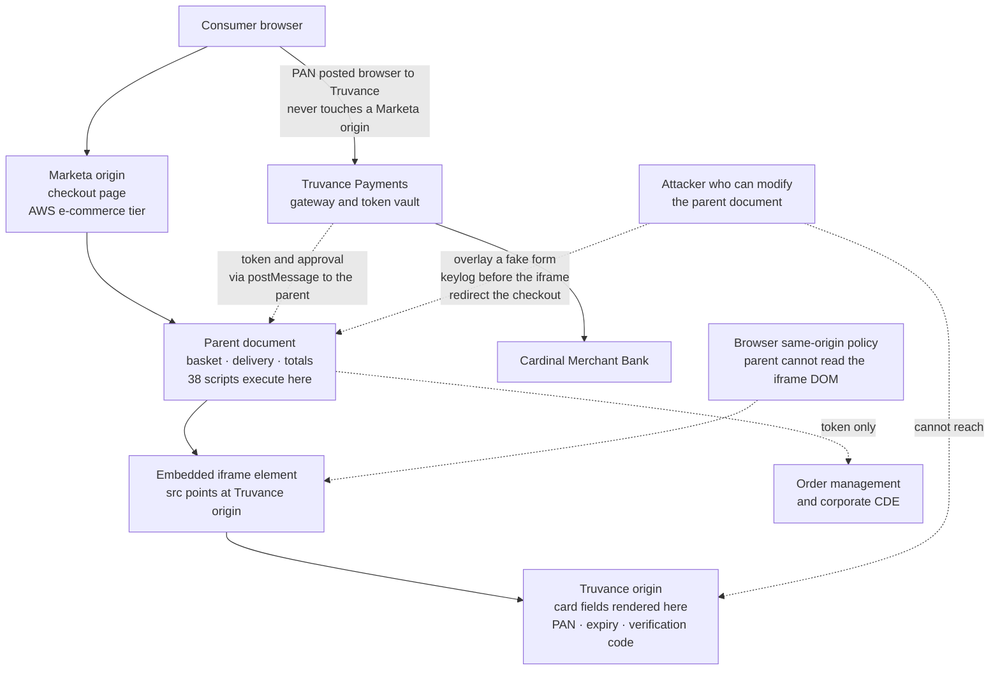

# 02.05 — E-Commerce Channel Scope

| Field | Value |
|---|---|
| Document ID | MRG-PCI-2026-205 |
| Program | Marketa Retail Group — PCI DSS v4.0.1 Compliance Program |
| Phase | 02 — CDE Scoping &amp; Cardholder Data Discovery |
| Version | 1.0 |
| Status | Approved |
| Owner | Sonia Rendell, Director of E-Commerce Engineering |
| Approver | Naomi Bhatt, Chief Information Security Officer |
| Date | 2026-07-15 |
| Classification | Confidential — Cardholder Data Environment // Illustrative Portfolio Sample |

## Purpose

This document answers two of the sixteen questions from 01.08. **Q-04**: *is the payment iframe served from Truvance's origin on all six templates, with no Marketa-origin card field?* And **Q-15**: *what is the complete population of payment pages and the scripts executing on them?*

The two answers point in opposite directions, and that is the entire content of this document. The card data answer is that **the PAN never reaches a Marketa system**, so the AWS e-commerce tier is out of the cardholder data environment. The scope answer is that **the Marketa payment pages are in scope anyway**, fully and without qualification, for Requirements **6.4.3** and **11.6.1**.

This is the single most misunderstood boundary in modern PCI DSS. It is worth the space it takes here, because getting it wrong is not a documentation error — it is the difference between having a control against digital skimming and believing you have one.

## 1. What Is Being Claimed, and What Is Not

| Claim | Status |
|---|---|
| Card fields are rendered inside an iframe served from Truvance's origin on all six payment templates | **Claimed and evidenced** |
| The PAN is posted by the consumer's browser directly to Truvance and never traverses a Marketa origin | **Claimed and evidenced** |
| The AWS e-commerce web and application tier is therefore outside the CDE | **Claimed, conditionally** — see §8 |
| Marketa's payment pages are out of scope | **Emphatically not claimed.** They are in scope for 6.4.3 and 11.6.1, and the components that can modify them are in scope as security-impacting |
| Truvance's AOC covers Marketa's payment pages | **Not claimed.** It covers Truvance's environment. 01.09 §3.1 recorded this before the analysis began, and the analysis confirmed it |
| A hosted iframe protects against digital skimming | **Not claimed.** It protects the *field*. It does nothing for the *page* — see §4 |

## 2. The Iframe Boundary — Where the PAN Actually Goes

Marketa's e-commerce platform runs in AWS across us-east-1 and us-west-2, serving approximately **15.7 million transactions and $924 million** a year. Customers browse, build a basket and enter delivery details on Marketa-controlled pages served from a Marketa origin. At the payment step, the page embeds an `iframe` whose `src` points at Truvance's origin. The card number, expiry and verification code fields exist inside that document. When the customer submits, the browser posts those values to Truvance.

The browser's same-origin policy is what makes this a boundary rather than a convention. A document served from Marketa's origin cannot read the DOM of a document served from Truvance's origin, cannot read its form values, and cannot intercept its submission. The separation is enforced by the browser, not by agreement.

The diagram's two dotted paths are the whole argument. The same-origin policy stops the parent reading the iframe. It does not stop an attacker who controls the parent from **replacing** the iframe with something else, drawing a convincing form on top of it, capturing keystrokes on the page before the customer ever reaches the iframe, or sending the customer somewhere different entirely.

## 3. How It Was Verified — Six Templates, Observed

Under the evidence standard in 02.01 §5, integration documentation is E4 evidence and cannot support an exclusion of this magnitude. The verification was therefore observational, on all six templates, with the artefacts retained.

| Method | What it produced | Grade |
|---|---|---|
| **Browser network capture per template** — full HAR capture of a complete checkout, executed on each of the six templates across three geographies, four device profiles and both consent states | Every request the browser makes, with origin, method and payload. Confirmed the card field submission goes to a Truvance origin on every template and in every combination | **E1** |
| **Rendered DOM inspection** | Confirmed the card input elements exist only inside the cross-origin frame document on all six templates. No Marketa-origin `input` element accepts a card number on any of them | **E1** |
| **Code review of checkout components** | Source review of the six templates and their shared components, looking for a fallback form, a manual-entry path, a customer-service override, or any handler that reads card-shaped input | **E1** — no such path found |
| **Server-side parameter analysis** | Automated submission of card-shaped values to every parameter of every checkout endpoint, checking whether any Marketa endpoint accepts, validates, logs or stores a card number | **E1** — no endpoint accepts one |
| **90-day retrospective log analysis** | Search of ALB access logs, WAF logs and application logs across the e-commerce tier for Luhn-valid PAN-shaped values in URLs, headers, bodies and error traces | **E2** — zero occurrences in 90 days of production traffic |
| **Discovery scanning of the e-commerce tier** | The exercise in 02.02 across all 246 AWS workloads | **E1** — no account data at rest on any workload in current use |
| **Truvance integration confirmation** | Written confirmation from Truvance of the integration type in use for each of Marketa's six templates, reconciled against the observed captures | **E3** — corroborating, not load-bearing |

The one finding of account data anywhere in the e-commerce estate — **PAN-03**, the debug log in 02.03 §4 — sits on a host decommissioned in 2024, holding log entries from **before the iframe cutover on 2022-11-14**, when Marketa used a server-side integration in which the PAN legitimately did transit its application tier. It is evidence about the architecture the iframe replaced. It is not evidence against the iframe.

**Assumption A-03 is confirmed.**

## 4. Why the Pages Remain in Scope

Here is the sentence that carries the whole document: **the iframe protects the transport of the PAN; it does not protect the page from being rewritten around it.**

Consider what an attacker who has achieved the ability to modify Marketa's checkout page can do without ever touching Truvance, without ever defeating the same-origin policy, and without Truvance's environment being involved in any way.

| Attack | Mechanism | Does the iframe help? |
|---|---|---|
| **Form overlay** | Draw a pixel-accurate fake card form on top of the real iframe, absolutely positioned. The customer types into the attacker's form. The attacker harvests the PAN, then relays it into the real iframe so the transaction completes normally and nobody notices | **No.** The real iframe is untouched and functioning perfectly |
| **Keylogging the parent** | Attach a global keystroke listener to the parent document. Capture what is typed while the customer's focus is anywhere on the page | **No** for anything typed outside the frame — and an overlay makes everything outside the frame |
| **Iframe replacement** | Remove the Truvance `iframe` element and substitute one pointing at the attacker's origin, styled identically | **No.** Nothing prevents the parent from manipulating its own DOM |
| **Checkout redirection** | Rewrite the checkout flow to send the customer to a lookalike payment page on a domain the attacker controls | **No** |
| **Data exfiltration from the parent** | Harvest cardholder name, address, email, phone and order value from the parent page and pair it with a PAN captured by any of the above | **No** |
| **Silent script injection through a third party** | A compromised or careless third-party script — a tag manager, an analytics library, a chat widget — loads additional script that does any of the above | **No.** And this is the most common real-world route |

Every attack in that table is an attack on Marketa's page, executes in Marketa's origin, and is Marketa's to prevent. It is why Requirements 6.4.3 and 11.6.1 exist, why they are future-dated to give merchants time to build capability they did not have, and why they became mandatory on 2025-03-31.

| Requirement | Obligation | Why the iframe does not discharge it |
|---|---|---|
| **6.4.3** | For all payment pages: manage a **method to confirm each script is authorised**, a **method to assure the integrity of each script**, and an **inventory of all scripts with written business or technical justification** for each | The scripts execute in the parent document. Truvance neither knows about them nor can affect them |
| **11.6.1** | Deploy a **change- and tamper-detection mechanism** that alerts on unauthorised modification — including indicators of compromise — to the **HTTP headers and the contents of payment pages** as received by the consumer browser, evaluated at least every seven days or at a frequency defined by a targeted risk analysis under **12.3.1** | The thing being tampered with is the page Marketa serves. Detecting that requires observing Marketa's own output as the consumer receives it |

Note the definition of a payment page that both requirements use, because it is what makes this bite: a payment page includes **the page that contains the iframe**, not only the document in which card data is entered. A merchant reading "we do not have a payment page, our provider does" has read the wrong definition.

## 5. The Payment-Page Population — Q-15

| Metric | Value |
|---|---|
| Payment page templates | **6** |
| Unique scripts executing across those templates | **38** |
| Of which first-party — Marketa-authored or Marketa-hosted | 27 |
| **Of which third-party** | **11** |
| Unauthorised at first inventory | **3** — a marketing tag manager operating on payment templates without authorisation, and two undeclared third-party scripts it was injecting |

### 5.1 The six templates

| ID | Template | Why it qualifies as a payment page | Scripts on it |
|---|---|---|---|
| **TPL-01** | Standard desktop checkout — payment step | Contains the Truvance iframe | 31 |
| **TPL-02** | Mobile web express checkout, single page | Contains the Truvance iframe | 26 |
| **TPL-03** | Guest checkout — payment step | Contains the Truvance iframe; distinct template with its own shared-component set | 29 |
| **TPL-04** | My Account — add a payment method | Contains the Truvance iframe in card-on-file registration mode. **Frequently missed**, because no order is being placed | 18 |
| **TPL-05** | Order modification and balance payment — customer self-service | Contains the Truvance iframe for the balance due on an amended order | 17 |
| **TPL-06** | Split tender — gift card plus card | Contains the Truvance iframe alongside a Marketa-origin gift card field. The gift card number is closed-loop stored value, **not** a PAN | 22 |

TPL-04 and TPL-05 are the ones that were not on anybody's list at the start of the exercise. Both were found by the enumeration method rather than being supplied by the team. The generalisable lesson: **a payment page population derived from asking "where do customers check out?" will miss the account-management and self-service paths**, and those are exactly the low-traffic pages where a script change goes unnoticed longest.

TPL-06 needed a specific decision. The gift card field is a Marketa-origin input accepting a 16-digit Luhn-valid number, which is precisely the shape of a PAN. The determination is that closed-loop stored value issued by Marketa is not a brand account number and is not cardholder data, so the field does not put the page in the CDE. It does not affect the page's status under 6.4.3 and 11.6.1, which apply to the template regardless.

### 5.2 The 11 third-party scripts

| Category | Count | Business justification recorded under 6.4.3 | Risk note |
|---|---|---|---|
| Analytics and measurement | 3 | Conversion measurement and funnel analysis | Two are configured with the payment step excluded from data capture; the configuration is itself a control and is verified |
| Tag management | 1 | Marketing tag deployment | **The highest-risk script on any payment page.** A tag manager is, by design, a mechanism for loading arbitrary code chosen by someone who is not a developer. This one was the source of all three first-inventory findings |
| Session replay | 1 | Support and usability diagnostics | Cannot see into the cross-origin iframe, but can record everything on the parent document. Configured with input masking enforced on the payment templates, verified by capture rather than by console setting |
| Fraud and device intelligence | 1 | Device fingerprinting for authorisation risk scoring — a legitimate reason to be on a payment page | Justified, authorised, and integrity-monitored like everything else |
| Consent management | 1 | Consent capture and preference enforcement | Loads before other tags by design, which makes its own integrity load-bearing |
| Customer chat and support | 1 | Live assistance during checkout | Reviewed specifically for whether an agent can see typed input. It cannot see into the iframe; parent-page input masking is enforced |
| Advertising and conversion pixels | 2 | Campaign attribution | The category with the weakest justification relative to its risk. Both were re-justified rather than grandfathered |
| Hosted library from a public CDN | 1 | Shared UI library | Pinned to a specific version with subresource integrity applied |

### 5.3 The three unauthorised scripts

The tag manager was present on all six payment templates, had been deployed by the marketing team through a self-service console, and had **never been authorised for use on payment pages** — it had been authorised for the site generally, which is not the same permission. It was injecting two further third-party scripts that appeared in no inventory, no change record and no contract.

They were removed in March 2026. The 6.4.3 authorisation workflow, the integrity assurance mechanism and the 11.6.1 monitoring that would detect a recurrence are Phase 04 deliverables, live from **August 2026**, alerting within 24 hours. This document records the population and the method; Phase 04 records the control.

One governance consequence belongs here rather than there. 01.09 §1 recorded that a marketing agency with tag-management or template-publication rights is a TPSP under the security-impact limb, because it can alter a payment page. This finding is what that entry was written for, and it moved from a theoretical categorisation to an access review with names attached.

## 6. The Inventory Approach

A script inventory built by one method is a list of the scripts that method can see. Marketa used three, independently, and **required them to reconcile** — the reconciliation gaps are where the findings were.

| Method | What it sees | What it misses |
|---|---|---|
| **Static — source and build manifest analysis** | Every script referenced in the six templates and their shared components, as committed and as built | Anything injected at runtime by another script. Invisible to this method by construction |
| **Dynamic — instrumented headless browser** | Every script request actually made, plus every `script` element added to the DOM after load, captured with a `MutationObserver`. Run across 3 geographies, 4 device profiles, 2 consent states, 6 templates, repeated across a week | Anything that fires only for real users — a geography not tested, a cohort in an experiment, a tag with a targeting rule that a synthetic session does not satisfy |
| **Field telemetry — Content Security Policy in report-only mode** | Every script source that real consumer browsers actually load, reported from real sessions at real scale | Nothing about intent or justification; produces sources, not authorisations |

The two undeclared scripts appeared in the CSP field telemetry and in some dynamic runs, and in **neither** the build manifest nor the earliest synthetic runs — they were being injected by the tag manager under a targeting rule that synthetic sessions did not initially match. A static-only inventory would have declared the payment pages clean. That is the argument for triangulation, stated as concretely as it can be stated.

The resulting inventory record for each of the 38 scripts carries: script identity and source URL, first-party or third-party, which of the six templates it executes on, the business or technical justification, the authorising individual and date, the integrity assurance method, the responsible owner, and the date of last review.

## 7. Integrity Assurance, and Why SRI Is Not the Whole Answer

Requirement 6.4.3 asks for a method to assure the integrity of each script. Subresource integrity — a cryptographic hash in the `script` tag that the browser verifies before execution — is the obvious mechanism, and it works beautifully for the scripts it can be applied to.

It cannot be applied to the scripts that most need watching.

| Script type | SRI viable? | Why | Marketa's integrity method |
|---|---|---|---|
| First-party, built and versioned by Marketa | **Yes** | Content is fixed at build time; the hash is generated in the pipeline | SRI hash injected at build; pipeline fails if a referenced asset's hash changes without a corresponding change record |
| Pinned third-party library from a CDN | **Yes** | Version-pinned and immutable | SRI hash pinned to the version |
| Tag manager | **No** | Its content is intended to change whenever a non-developer publishes a tag. A hash would break the product's purpose on its first legitimate use | CSP source allow-list; container change alerting; publication rights restricted and reviewed; weekly diff of the rendered payment page; **removed from payment templates entirely as the primary mitigation** |
| Analytics, chat, fraud, consent, pixels | **No, in practice** | The vendor updates the file without notice; a pinned hash would break the page at the vendor's convenience | CSP allow-list constraining where script may load from; change detection on the fetched content under 11.6.1; contractual change notification; periodic review of the fetched artefact |

The honest position, and the reason 6.4.3 is hard rather than merely tedious: **for the highest-risk scripts on a payment page, integrity assurance is a monitoring problem rather than a prevention problem.** You cannot pin what the vendor intends to change. What you can do is constrain where script may come from, detect when what arrives differs from what arrived last time, and make sure a human sees that difference quickly. Marketa's 11.6.1 mechanism is therefore not an adjunct to 6.4.3 — it is the enforcement arm for the majority of the population.

Frequency is set by targeted risk analysis under **12.3.1**, as 11.6.1 permits. Marketa's analysis concluded that the seven-day minimum is too slow for a checkout handling 15.7 million transactions a year, and set evaluation at least daily with continuous CSP field reporting alongside, alerting within 24 hours of a detected change.

## 8. The Seven Conditions

| # | Condition the reduction depends on | Verification | Frequency | Collapse consequence |
|---|---|---|---|---|
| **ECOM-C1** | Card fields are rendered exclusively inside the Truvance-served iframe on all six templates | Browser network capture and DOM inspection per template | Per release, and monthly | The AWS e-commerce tier becomes CDE — the largest possible scope expansion in the programme |
| **ECOM-C2** | No Marketa endpoint accepts, logs or stores a card-shaped value | Server-side parameter analysis; log analysis for PAN-shaped values | Per release, and continuously in log monitoring | As above |
| **ECOM-C3** | No new payment page template is introduced without entering the 6.4.3 inventory | Template enumeration reconciled against the release pipeline | Per release | An unmonitored payment page — the failure that 11.6.1 exists to catch |
| **ECOM-C4** | Every script on every payment template is inventoried, justified and authorised | Triangulated inventory across the three methods in §6 | Per release, and weekly in field telemetry | 6.4.3 not met; unauthorised code executing in the consumer browser |
| **ECOM-C5** | Integrity assurance is in force for every script, by the method appropriate to it | Build-pipeline SRI enforcement; CSP allow-list; content diffing | Continuous | 6.4.3 not met |
| **ECOM-C6** | Change and tamper detection is operating over headers and page content, with alerting | 11.6.1 mechanism health monitoring; deliberate test modifications to confirm detection fires | Daily evaluation; detection tested quarterly | 11.6.1 not met, and the compensating visibility for ECOM-C5 is lost |
| **ECOM-C7** | Truvance's validation remains current and covers the hosted payment page service actually consumed | AOC review and brand registry corroboration under 12.8.4 | Annually and on change | The reduction is suspended until restored; Cardinal notified under **C7** |

ECOM-C6 carries a provision the programme insists on: **a detection mechanism that has never fired is not evidence of a clean page.** The 11.6.1 mechanism is tested quarterly by making a controlled, authorised modification to a payment page in a production-equivalent environment and confirming the alert arrives within the expected window. A monitoring control is only evidenced by its detections, and if it has none, it needs manufactured ones.

## 9. SAQ-Style Reasoning, and Why It Does Not Apply Here

The self-assessment questionnaires are not available to Marketa. **Marketa is a Level 1 merchant and validates by an on-site assessment producing a ROC and an AOC.** All 306 applicable sub-requirements are assessed. No SAQ eligibility criterion changes that, and nothing in this section should be read as suggesting a reduced requirement set applies.

The SAQ framework is nonetheless useful as *reasoning*, because the eligibility criteria encode the Council's own analysis of where the e-commerce risk boundary sits, and that analysis is instructive whether or not the questionnaire applies.

| Integration pattern | The reasoning the SAQ framework encodes | Marketa's position |
|---|---|---|
| Full redirect — the customer leaves the merchant's site entirely | The merchant's page cannot influence card entry, because card entry happens elsewhere. The narrowest exposure | Not Marketa's pattern |
| **Hosted iframe — card fields in a provider-served frame on a merchant page** | The PAN does not traverse the merchant's systems, **but the merchant's page controls the context in which entry happens**. This is the pattern the payment-page requirements were written for | **Marketa's pattern on all six templates** |
| Direct post — card fields on the merchant's page, posted to the provider | The merchant's page renders the card fields themselves. Materially more exposed; a much larger requirement set has always been recognised as applying | Marketa's pattern **before 2022-11-14** — and the reason finding PAN-03 exists |
| Full merchant capture — the PAN reaches the merchant's servers | The merchant is in the card data business, and the full standard applies to the whole tier | Not Marketa's pattern in any channel |

The instructive part is how contested this boundary has been in the standard's own drafting. The Council's revisions to SAQ A first brought 6.4.3 and 11.6.1 into a questionnaire that had historically asked very little of iframe merchants, and subsequently replaced them with an eligibility criterion requiring the merchant to confirm its site is not susceptible to script attacks affecting the payment page. The direction of travel is unambiguous even where the mechanism has moved: **the industry no longer accepts "the PAN does not touch our servers" as the end of the e-commerce analysis.**

For Marketa the drafting history is background reading only. **6.4.3 and 11.6.1 are assessed in full, in the ROC, in the defined approach, with no compensating control and no reliance on Truvance's validation.**

## 10. Where the E-Commerce Estate Lands

| Population | Classification | Why |
|---|---|---|
| **The Truvance-served iframe and everything inside it** | Truvance's CDE, not Marketa's | Covered by Truvance's AOC dated 2026-03-31 |
| **The 6 payment page templates** | **In scope** for 6.4.3 and 11.6.1 | They are payment pages by definition, whoever renders the card fields |
| **The AWS e-commerce workloads that neither serve nor can modify a payment page** — catalogue, search, recommendations, content | **Out of scope** | No account data, no CDE connectivity, no ability to alter a payment page |
| **The subset of the e-commerce delivery path that can modify a payment page** — the storefront rendering service, its build and deployment pipeline, the CDN and edge configuration, the CMS and the tag-management console | **In scope as security-impacting** | Each is a route by which the content of a payment page can be changed. Enumerated in the connected-to population in 02.07 |
| **Order management and the systems receiving the token** | Out of the CDE; in scope only where they are connected-to on other grounds | Tokens are not cardholder data while Marketa cannot reverse them — condition tested under Q-07 in 02.07 |
| **The decommissioned host from finding PAN-03** | Terminated, volumes and snapshots deleted | Ceased to exist on 2026-02-16 |

> **The e-commerce channel is the clearest illustration in the portfolio of the difference between a data boundary and a scope boundary.** The PAN never touches a Marketa origin, and 246 AWS workloads leave the CDE on that basis. Six page templates, 38 scripts and the entire path by which those pages are built and delivered stay in the assessment, because the page a customer types into is Marketa's, and an attacker who owns it does not need the PAN to pass through Marketa's servers in order to take it.

## Cross-References

| Reference | Relevance |
|---|---|
| 01.01 — Company Profile &amp; Payment Channels | The e-commerce channel architecture and the 6.4.3 / 11.6.1 nuance |
| 01.03 — Merchant Level Determination &amp; Validation | Why a ROC, and not an SAQ, is the validation route |
| 01.08 — Scope Assumptions &amp; Constraints | Questions Q-04 and Q-15; assumption A-03 |
| 01.09 — Third-Party Service Provider Register | Truvance as TPSP-01; the 6.4.3 / 11.6.1 allocation; agencies with publication rights as TPSPs |
| 02.01 — Scoping Methodology | The evidence grades and the requirement for observation over documentation |
| 02.03 — Unexpected PAN Locations &amp; Response | Finding PAN-03 and why it is evidence about the pre-iframe architecture |
| 02.08 — Connected-To &amp; Security-Impacting Systems | Where the page-modification path components are enumerated |
| Phase 04 — Build &amp; Maintain Secure Systems | The 6.4.3 authorisation workflow and integrity mechanism |
| Phase 06 — Monitoring, Testing &amp; Third Parties | 11.6.1 monitoring in operation; the application penetration test |

---
[⬅ Previous](02.04-card-present-channel-scope.md) · [🏠 Phase 02 Home](02.00-README.md) · [Next ➡](02.06-call-centre-moto-channel-scope.md)
