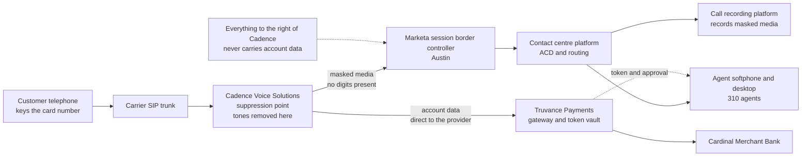

# 02.06 — Call Centre / MOTO Channel Scope

| Field | Value |
|---|---|
| Document ID | MRG-PCI-2026-206 |
| Program | Marketa Retail Group — PCI DSS v4.0.1 Compliance Program |
| Phase | 02 — CDE Scoping &amp; Cardholder Data Discovery |
| Version | 1.0 |
| Status | Approved |
| Owner | Bill Traynor, Call Centre Operations Manager |
| Approver | Naomi Bhatt, Chief Information Security Officer |
| Date | 2026-07-15 |
| Classification | Confidential — Cardholder Data Environment // Illustrative Portfolio Sample |

## Purpose

This document answers **Q-05**: *does any historical or current call recording contain account data?* It tests assumption **A-04**, and it establishes the scope position for the smallest of Marketa's three channels — **310 agents in Austin, approximately 2.1 million transactions a year, 3% of volume**.

The answer to Q-05 has two halves, and they differ. For **current** calls, no: the DTMF suppression control works, it was tested, and the agent estate is out of the cardholder data environment. For the **historic archive**, yes — approximately 11,400 recordings contained spoken PANs, which is finding PAN-01 in 02.03 and the reason risk R-31 was raised.

The channel is 3% of transactions and it produced the phase's most consequential finding. That ratio is not a coincidence. It is what happens when a channel's controls are newer than its data.

## 1. What Is Being Claimed, and What Is Not

| Claim | Status |
|---|---|
| DTMF tones carrying account data are suppressed before the media reaches Marketa infrastructure | **Claimed and evidenced** |
| Agents cannot hear, see, type or otherwise obtain the account data during a secure payment session | **Claimed and evidenced** |
| The 310 agent desktops, agent headsets and the contact-centre platform are outside the CDE | **Claimed, conditionally** — see §9 |
| The recording platform is outside the CDE **for calls made after the masking go-live** | **Claimed, conditionally** |
| The recording platform was outside the CDE for calls made before it | **Disproved.** See §6 and 02.03 §2 |
| The telephony path is out of scope | **Not claimed.** The telephony path and the Cadence service are in scope; they are not CDE, which is a different statement |
| Cadence's AOC evidences Marketa's historical position | **Not claimed**, and 01.09 §3.2 said so before the archive was searched |

## 2. How Pause-and-Resume DTMF Masking Works

A customer telephones the Austin call centre, an agent takes the order, and at the payment step the agent initiates a **secure payment session** from the order screen. What happens next takes about forty seconds and involves the agent doing nothing except staying on the line.

| Step | What happens | Where the account data is |
|---|---|---|
| 1 | The agent clicks "take payment" in the order screen. An API call to Cadence begins a secure session against the order reference and amount | Nowhere yet |
| 2 | Cadence, already in the media path, begins **DTMF suppression** on the customer leg and simultaneously **pauses** the recording | — |
| 3 | The customer is prompted to key the card number, expiry and verification code on their telephone keypad | Customer handset → Cadence |
| 4 | Cadence detects each DTMF tone, **removes it from the media forwarded onward**, and substitutes a flat tone so the agent and the customer both hear that something is happening | Cadence only |
| 5 | Cadence assembles the account data and transmits it to Truvance for authorisation | Cadence → Truvance |
| 6 | Truvance authorises through Cardinal and returns an approval and a **token** | Truvance |
| 7 | The token and approval appear on the agent's order screen; suppression ends; recording resumes | Marketa holds a token, never a PAN |

The agent remains on the call throughout, which is the operational reason this pattern is preferred over transferring the customer to an automated payment leg: no transfer, no abandonment, no dead air, and the agent can help if the customer's keypad misbehaves.

## 3. Suppression Versus Pause — the Distinction That Decides the Scope

"Pause and resume" and "DTMF masking" are habitually used as if they were one control. They are two, they remove different exposures, and only one of them takes the agent out of the data path.

| Control | What it does | What it removes from scope | What it leaves exposed |
|---|---|---|---|
| **Pause and resume, alone** | Stops the recorder for the duration of the payment step | The **recording** of the account data | Everything else. The agent still hears the digits or the spoken number; the agent's memory, notepad, screen and desk are all capture paths; the media still traverses whatever it traversed before |
| **DTMF suppression, alone** | Removes the tones from the media stream before it is forwarded | The agent's exposure, the recording's exposure, and the exposure of every system downstream of the suppression point | Nothing material, provided the suppression point sits upstream of Marketa's infrastructure |
| **Both together — Marketa's configuration** | Suppression removes the data; pause provides a second, independent barrier at the recorder | Both of the above | The paths that bypass the mechanism entirely — §7 |

The distinction determines whether **310 agents** are inside or outside the cardholder data environment. Under pause-only, they are inside: a person who hears a card number is a component that processes account data, and every control around that person — screen, desk, notepad, phone, supervision — becomes a PCI DSS control. Under suppression, they are outside, because the data never reaches them in any form.

Marketa runs both. The programme deliberately tested whether suppression works **with the pause disabled**, in a controlled test tenant, to establish that the reduction rests on suppression and not on the recorder's state. It does. The pause is defence in depth, not the load-bearing control, and knowing which is which matters when one of them fails.

## 4. Where the Suppression Point Sits, and Why It Decides Everything

This is the architectural question that a MOTO scope analysis lives or dies on, and it is routinely not asked.

DTMF tones carrying a card number are account data in transit. Every component the media traverses **before** suppression is handling account data and is in the cardholder data environment. Every component **after** it is not. So the whole reduction depends on one thing: where in the path the suppression happens.

Marketa's topology places Cadence **at the carrier hand-off**, upstream of Marketa's own session border controller. The consequence is that Marketa's telephony infrastructure never carries DTMF-encoded account data at all.

Had the media instead reached Marketa's SBC first and been forwarded to Cadence from there — a common and superficially equivalent deployment — the SBC, and arguably the routing infrastructure behind it, would be **CDE systems**, because unmasked account data would traverse them. The same product, the same contract, the same agent experience, and a materially different scope outcome, decided entirely by where the media is intercepted.

| Verification | Method | Result |
|---|---|---|
| Signalling and media path analysis | SIP signalling trace and RTP media path mapping from the carrier hand-off through to the agent leg, for a live call | Suppression confirmed upstream of Marketa's SBC |
| Test-call capture at the Marketa SBC | Packet capture at the SBC ingress during 60 test calls, with a DTMF decoder run over the captured RTP | **Zero digits recoverable** in any of the 60 |
| Provider confirmation | Cadence's written description of the deployed topology, reconciled against the observed traces | Consistent |

The middle row deserves its own note, because it is the test most often skipped. Suppression that **attenuates** a tone rather than removing it can leave a signal a decoder still recovers, so listening to a recording and hearing nothing recognisable is not the test. The test is to run an automated DTMF decoder over the captured audio and confirm zero digit recovery. Marketa ran that test at three points — the SBC ingress, the agent leg and the recorder output — across 60 calls covering every agent group and both shift patterns.

## 5. What the Analysis Removed From Scope

| Population | Classification | Basis |
|---|---|---|
| **310 agent desktops** | **Out of the CDE** | No account data reaches them in any form. Tokens and last-four only on the order screen |
| Agent headsets and softphones | **Out of the CDE** | The media they receive is masked |
| The contact-centre platform — ACD, routing, workforce management | **Out of the CDE** | Downstream of the suppression point |
| The call recording platform, **for calls after the masking go-live** | **Out of the CDE** | Records masked media only. Verified by decoder analysis of recorder output |
| The call recording platform's **pre-masking archive** | **Was CDE while it held account data** | Finding PAN-01. Exited on completion of deletion, 2026-03-27 |
| Marketa's session border controller and Austin telephony infrastructure | **In scope — not CDE** | No account data traverses them, but they are the path the masked media takes and a change to that path could move the suppression point. Security-impacting; enumerated in 02.07 |
| The Cadence service itself | Cadence's CDE, not Marketa's | Level 1 service provider, AOC dated **2026-05-08** |
| The order management system receiving the token | Out of the CDE | Tokens only |

Of the **14 call-centre telephony and desktop systems** carried in the original 604, the agent desktop images and the contact-centre platform components fall out; a small number of telephony components remain in scope as security-impacting and are enumerated in 02.07.

## 6. Current Calls Versus the Historic Archive

Everything in §2 to §5 is a statement about calls taken **today**. It is not a statement about the recording estate, and conflating the two is precisely the error that produced assumption A-04 and finding PAN-01.

| Dimension | Current calls | The historic archive |
|---|---|---|
| Control in force | Cadence DTMF suppression plus recorder pause, automated | Manual pause-and-resume, operated by the agent |
| Enforcement | Technical, in the media path, upstream of Marketa | Procedural, performed by a person handling a customer |
| Observed failure rate | Zero in 60 test calls and zero unmatched authorisations in a 90-day reconciliation | **5.3%** of payment-associated recordings contained an audible PAN |
| Volume affected | — | **~11,400 recordings**, 2019-03 to 2023-06 |
| Scope status | Out of the CDE | **Was in the CDE** for as long as it held account data |
| Status now | Operating | Deleted with manifest evidence; retention reduced from 7 years to 13 months |

> **A control has a start date. Your data does not.** DTMF suppression prevents account data entering recordings made after it was switched on. It has no effect whatever on recordings made before, and it never claimed to — Cadence's position, recorded in the TPSP register in Phase 01, is explicitly forward-only. The organisation held the correct fact and drew the wrong conclusion from it, which is a more uncomfortable finding than not knowing.

The 12.10.7 procedure change this drove, **P-1**, carries a standing rule that generalises well beyond call recording: **any change to a control that affects what is captured or recorded triggers a retrospective review of what was captured before the change.** The full treatment of the finding — detection, containment, deletion, root cause, and the disproof of A-04 — is in 02.03 §2 and §7.

## 7. Alternate Capture Paths

DTMF suppression removes one route by which a card number reaches Marketa. A MOTO channel has many, and every one of them has to be closed for the reduction to mean anything. This analysis was run as a structured walkthrough with agents, team leaders and Bill Traynor, and it is deliberately exhaustive rather than tidy.

| # | Path | How the account data would arrive | Control | Verification |
|---|---|---|---|---|
| 1 | **The customer reads the number aloud before the secure session starts** | Spoken, into a live recorded call | Agent script interrupts immediately and moves to the secure session; the agent is trained to stop the customer mid-number. Where a number is nonetheless spoken, the agent flags the call and the recording is quarantined and deleted under P-1 | QA sampling of 200 calls per month specifically for this pattern; 4 flagged and deleted in the first quarter of operation |
| 2 | **The agent writes it down** | Paper at the desk | Clear-desk policy in the payment floor area; no personal paper or pens at agent positions; lockers outside the floor; supervisor floor-walks; shredding bins under Halberd chain of custody for anything generated | Physical inspection at three unannounced observations during the walkthrough; nothing found |
| 3 | **The agent types it into a free-text field** | CRM notes, order comments, case description | **Technical control:** PAN detection on save. Any free-text field containing a Luhn-valid 13–19 digit sequence is rejected at save with an explanatory message, and the attempt is logged to the SIEM | Tested with a published brand test PAN in each of the 7 free-text fields on the order and case screens; all 7 rejected |
| 4 | **The customer emails the card number** | Inbound mail to a shared or personal mailbox | DLP inbound quarantine with an automated reply directing the customer to a secure route; procedure **P-4**; no forwarding, no quoting | This is the path that produced finding PAN-04. DLP live 2026-04-10 |
| 5 | **The customer sends it by post or fax** | Paper into the mail room | No fax number is published for orders and the inbound fax service was retired. Post containing card details is handled as media under Requirement 9 — logged, secured, and destroyed via Halberd with a certificate; the customer is contacted with a safe route | Mail room walkthrough; 2 instances in the preceding 12 months, both destroyed, no record retained |
| 6 | **The customer leaves a card number on voicemail** | Recorded audio outside the masked path | Order-line voicemail is disabled; out-of-hours callers receive an announcement and a callback option | Configuration verified; 30-day sample of voicemail boxes in the call-centre tenant scanned by the audio pipeline — clean |
| 7 | **The agent uses a personal mobile phone to photograph a screen or note a number** | Camera | Personal devices are not permitted at agent positions on the payment floor; lockers provided; policy signed at induction and reinforced in 12.6.3 training | Observation during the walkthrough; enforcement is procedural and is recorded as the weakest control in the table |
| 8 | **Co-browse or screen share exposes typed input** | Support tooling | Co-browse is configured to mask all input fields and is unavailable during an active secure payment session | Tested during the walkthrough |
| 9 | **The call is transferred mid-payment to another team** | The receiving agent is outside the secure session | Transfer terminates the secure session; the receiving agent must initiate a new one. There is no way to hand over a live session | Tested with 6 transfer scenarios |
| 10 | **A supervisor barges or whispers during a payment session** | Third party on the media path | Barge and whisper are technically blocked while a secure session is active | Tested; the function is unavailable during the session |
| 11 | **An interpreter or relay service is on the line** | A third human hearing the call | Suppression applies to the whole conference, so the interpreter hears the same flat tones as the agent. Interpreter engagements are contracted with a confidentiality schedule | Verified on a test call with a three-party conference |
| 12 | **A legacy administrative screen with a card number field** | Manual entry into an application | Every order and payment screen was reviewed for a card number input. **None exists** — the same absence that, in the pre-masking era, is why no card verification code ever entered the archive | Application screen inventory and code review; corroborated by the SAD result in 02.02 §5 |
| 13 | **An agent bypasses the secure session deliberately** | Any of the above | Reconciliation of authorisations against secure-session events — §8 | 90-day reconciliation performed |

Two honest observations about that table.

**Path 7 is the weakest row and is marked as such.** A personal-device prohibition on a floor of 310 people is a policy backed by observation, not a technical control. It is recorded in the risk register with that characterisation rather than being presented as equivalent to the field-level PAN rejection in path 3.

**Path 3 is the strongest and was the cheapest.** Rejecting a Luhn-valid digit sequence at save, across seven free-text fields, took a fortnight of engineering and removes an entire class of exposure permanently, without depending on anyone remembering anything. Where a capture path can be closed technically, it should be — the ones left to procedure should be the ones with no technical answer.

## 8. Bypass Detection

A secure payment session that an agent does not initiate produces exactly the exposure the architecture removes. Detection therefore cannot rely on agents reporting their own bypasses.

The mechanism is a reconciliation. Cadence emits a per-transaction event record whenever a secure session is initiated and completed. Truvance's authorisation records show every MOTO authorisation. **Every MOTO authorisation should have a matching secure-session event**, and an authorisation without one is either a bypass or a data quality problem.

| Reconciliation over 90 days | Result |
|---|---|
| MOTO authorisations in the period | 518,400 |
| Matched to a Cadence secure-session event | 518,388 |
| **Unmatched** | **12** |
| Investigated and explained | 12 — all traced to sessions initiated, abandoned by the customer, and successfully retried, where the event correlation identifier changed between attempts |
| **Confirmed bypasses** | **0** |

The correlation defect that produced the 12 was fixed rather than tolerated, because a reconciliation with a known benign false-positive rate degrades into a reconciliation nobody investigates. The control now runs daily, with unmatched authorisations raised to the security operations team the following morning and to Bill Traynor for operational follow-up.

## 9. The Eight Conditions

| # | Condition the reduction depends on | Verification | Frequency | Collapse consequence |
|---|---|---|---|---|
| **MOTO-C1** | DTMF suppression is applied to every payment interaction, with no configuration exempting a queue, agent group or call type | Cadence configuration review; per-transaction event coverage | Monthly, and on any telephony change | Agent estate returns to the CDE |
| **MOTO-C2** | The suppression point remains **upstream** of Marketa's session border controller | SIP signalling and media path analysis; test-call capture at the SBC | Quarterly, and on any telephony or carrier change | Marketa's telephony infrastructure becomes CDE |
| **MOTO-C3** | Suppressed audio yields no recoverable digits | Automated DTMF decoder run over captured media at three points | Quarterly | The reduction fails at its foundation |
| **MOTO-C4** | Recording pause operates as a second barrier | Recording metadata review against secure-session events | Monthly | Defence in depth lost; MOTO-C3 becomes single-point |
| **MOTO-C5** | No alternate capture path is open — the thirteen in §7 | Walkthrough, technical testing, QA sampling, physical observation | Annually in full; continuously for the technical controls | Depends on the path; paths 1, 2, 3 and 7 would put agents back in the CDE |
| **MOTO-C6** | No authorisation occurs without a secure session | Daily authorisation-to-session reconciliation | Daily | A bypass is a live exposure, not a reporting defect |
| **MOTO-C7** | No account data remains in the recording estate, including archives | Audio discovery over the retained population; retention rule enforcement at 13 months | Annually, and on any change affecting recording | The recording platform re-enters the CDE — this is the condition that failed historically |
| **MOTO-C8** | Cadence's validation remains current and covers the service consumed | AOC review and brand registry corroboration under **12.8.4** | Annually and on change | The reduction is suspended until restored; Cardinal notified under **C7** |

MOTO-C7 is the condition that had already failed before anybody wrote it down, which is the strongest argument available for writing conditions down.

## 10. Where the Call Centre Lands

| Population | Classification |
|---|---|
| 310 agent desktops, headsets and softphones | **Out of the CDE**, conditional on MOTO-C1 to MOTO-C6 |
| Contact-centre platform — ACD, routing, workforce management | **Out of the CDE** |
| Call recording platform, forward | **Out of the CDE**, conditional on MOTO-C7 |
| Marketa session border controller and Austin telephony infrastructure | **In scope as security-impacting** — not CDE. Enumerated in 02.07 |
| Cadence Voice Solutions | Cadence's CDE; TPSP-02; AOC dated 2026-05-08 |
| The pre-masking recording archive | Was CDE; remediated; **assumption A-04 disproved and not reinstated** |

> **Three percent of transactions, and the largest single finding in the phase.** The card-present and e-commerce channels were engineered by projects with architects and change boards. The MOTO channel accumulated — a manual control, then an automated one, with an archive underneath that nobody had a reason to look at until somebody was made to. The reduction claimed here is real and it is well evidenced for calls taken today. What it took to establish that was searching the place the architecture said there was nothing to find.

## Cross-References

| Reference | Relevance |
|---|---|
| 01.01 — Company Profile &amp; Payment Channels | The MOTO channel flow and the two qualifications recorded at the outset |
| 01.08 — Scope Assumptions &amp; Constraints | Question Q-05; assumption A-04 |
| 01.09 — Third-Party Service Provider Register | Cadence as TPSP-02; the forward-only nuance recorded before the archive was searched |
| 02.02 — Cardholder Data Discovery | The audio pipeline, and the SAD result that path 12 explains |
| 02.03 — Unexpected PAN Locations &amp; Response | Finding PAN-01 worked end to end; procedures P-1 and P-4; risk R-31 |
| 02.05 — E-Commerce Channel Scope | The other channel where a provider's AOC does not cover Marketa's obligations |
| 02.08 — Connected-To &amp; Security-Impacting Systems | Where the telephony components are enumerated |
| Phase 05 — Access Control &amp; Physical Security | Physical controls on the Austin payment floor |
| Phase 07 — Security Policy, Risk &amp; Incident Response | Procedures P-1 to P-4 exercised; risk R-31 in the register |

---
[⬅ Previous](02.05-ecommerce-channel-scope.md) · [🏠 Phase 02 Home](02.00-README.md) · [Next ➡](02.08-connected-to-and-security-impacting-systems.md)
