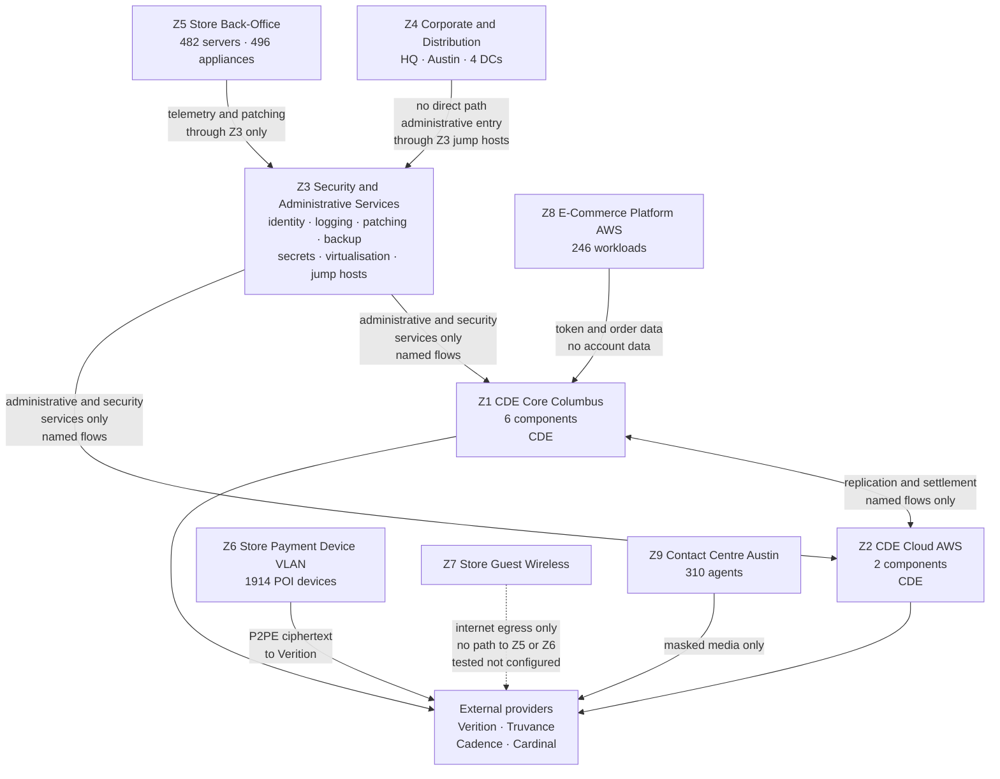
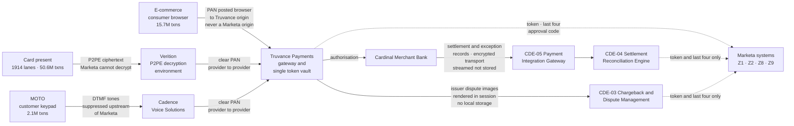
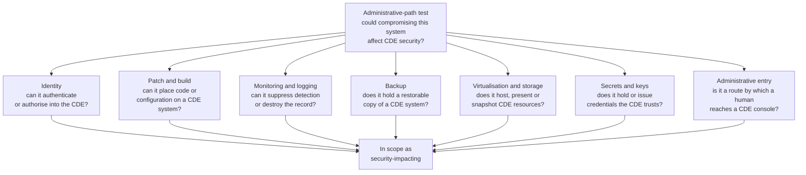

# 02.07 — Data Flows &amp; Network Reachability

| Field | Value |
|---|---|
| Document ID | MRG-PCI-2026-207 |
| Program | Marketa Retail Group — PCI DSS v4.0.1 Compliance Program |
| Phase | 02 — CDE Scoping &amp; Cardholder Data Discovery |
| Version | 1.0 |
| Status | Approved |
| Owner | Trevor Kim, Director of Infrastructure &amp; Network |
| Approver | Naomi Bhatt, Chief Information Security Officer |
| Date | 2026-07-15 |
| Classification | Confidential — Cardholder Data Environment // Illustrative Portfolio Sample |

## Purpose

The three channel documents established where account data goes. This document establishes where everything **else** can go, and it answers the two questions on which the connected-to population depends.

**Q-08**: *which systems have network reachability to the corporate CDE, in either direction?* **Q-09**: *which systems, though they hold no account data, can affect the security of the CDE?*

It also closes two questions the channel documents deferred: **Q-07**, whether Marketa can detokenise by any route, and **Q-14**, whether the third-party register in 01.09 matches the connections that actually exist.

The output is the **nine-zone network model**, the account-data flow diagrams required by **1.2.4**, the validated network diagram required by **1.2.3**, and the **identification** of the 63 connected-to and security-impacting components. The identification is here; the enumeration, justification and requirement mapping for each of the 63 is in 02.08, and the definitive assessed inventory is in 02.09.

## 1. The Two Diagram Requirements, and Why They Are Different

Requirements 1.2.3 and 1.2.4 are habitually satisfied with the same picture. They ask for different things and they fail in different ways.

| Requirement | What it obliges | What it must show | The failure mode |
|---|---|---|---|
| **1.2.3** | An **accurate network diagram** showing all connections between networks, including to wireless networks, kept current | Networks, zones, boundaries, the controls at each boundary, and every connection that crosses one — including the ones nobody is proud of | A diagram drawn once, at design time, describing the network somebody intended to build |
| **1.2.4** | An **accurate data-flow diagram** showing all account data flows across systems and networks, kept current | The movement of account data specifically — where it enters, what it traverses, where it comes to rest, where it leaves, and to whom | A diagram of the *application* rather than of the *data*, showing boxes and arrows with no statement of what is in the arrows |

Both requirements carry the same three words: **"kept current."** That is the operative obligation and it is where merchants lose the point.

> **A diagram that is not maintained is not evidence — it is a claim about the past.** Its value in an assessment is exactly the value of the process that keeps it true. Marketa's position, adopted in this phase and enforced from it, is that a diagram is an *output* of the network change process, not an artefact somebody updates before an audit. Every change that touches a zone boundary, a routing domain, a security group or a payment integration carries a diagram update as a completion criterion, verified by the change approver. A change closed without it is reopened.
>
> The corollary is uncomfortable and is recorded deliberately: at kickoff on 2026-01-12, Marketa's network diagram was **eleven months out of date** and its data-flow diagram described the pre-2022 server-side e-commerce integration that finding **PAN-03** is a relic of. Neither was fit to submit. Both were rebuilt in this phase from observed configuration and observed traffic rather than from their predecessors, because a diagram rebuilt from a wrong diagram inherits the wrongness and hides it under a fresh revision date.

## 2. The Nine Network Zones

Marketa's estate is modelled as nine zones. A zone is defined by a common trust level and a common boundary-enforcement policy — not by geography, not by business unit, and not by the accident of which switch something is plugged into. Two systems in the same building can be in different zones; two systems on different continents can be in the same one.

| Zone | Name | Contents | Classification | Boundary enforcement |
|---|---|---|---|---|
| **Z1** | **CDE Core — Columbus** | The six Columbus payment operations components; dedicated physical hardware in dedicated cabinets | **CDE** | Segmentation firewall cluster CT-43; VLAN access control lists at the core switching layer CT-46; deny by default in both directions |
| **Z2** | **CDE Cloud — AWS** | The two AWS payment components in a dedicated VPC, us-east-1 with a us-west-2 standby | **CDE** | AWS Network Firewall and security-group control plane CT-50; no internet gateway; egress only through inspected paths |
| **Z3** | **Security &amp; Administrative Services** | Identity, logging, patching, monitoring, backup, secrets, virtualisation management, jump hosts — Columbus, Ashburn and AWS | **Connected-to / security-impacting** | Firewall policy at Z1 and Z2 boundaries; administrative access only from CT-08 to CT-13 |
| **Z4** | **Corporate &amp; Distribution** | Columbus HQ, Austin office, four distribution centres, end-user computing, back-office business systems | Out of scope, conditionally | Firewall to Z3; **no path to Z1 or Z2 except through Z3 administrative entry points** |
| **Z5** | **Store Back-Office** | 482 store servers and 496 store-estate appliances | Out of CDE; **connected-to band for governance** (02.04 §10) | Store-estate policy controller CT-48; WAN aggregation and SD-WAN boundary CT-47 |
| **Z6** | **Store Payment Device VLAN** | 1,914 POI devices on the dedicated VLAN the PIM specifies | Out of CDE; POI obligations under 9.5.1 retained | Store switch VLAN policy pushed by CT-48; permitted destinations restricted to the P2PE path |
| **Z7** | **Store Guest Wireless** | Customer and colleague personal-device wireless at 482 stores | Out of scope, **subject to proof of separation** | Wireless LAN controller CT-49; validated by penetration test under 11.4.5, not by configuration |
| **Z8** | **E-Commerce Platform — AWS** | 246 AWS workloads serving the storefront, catalogue, search, content and order capture | Out of CDE; the payment-page delivery subset is connected-to | Transit gateway and route-table control CT-51; security-group policy CT-50 |
| **Z9** | **Contact Centre — Austin** | 310 agent desktops, contact-centre platform, recording platform, telephony boundary | Out of CDE; the telephony boundary is connected-to | Session border controller CT-58; media path terminates upstream at Cadence |

Three properties of the model are load-bearing and are stated so an assessor can test them individually.

**Z4 has no path to Z1 or Z2.** Corporate end-user computing cannot reach the cardholder data environment at all. Administrative access originates in Z4, authenticates into a Z3 jump host, and proceeds from there — which is why the jump hosts are in scope and the laptops are not. Break that property and 1,100 corporate endpoints enter the assessment.

**Z3 is the only zone with a routed path into Z1 and Z2.** That is a deliberate concentration. It makes the connected-to population enumerable, it makes the boundary testable, and it makes Z3 the most attractive target in the estate — a trade the programme made knowingly and recorded in the risk register rather than presenting as an unmixed good.

**Z5, Z6 and Z7 are three zones, not one store network.** The clearest way to fail a segmentation test at a retailer is to treat "the store" as a single trust domain. The two Critical findings that the 2026 penetration testing programme produced include a store back-office VLAN reachable from guest wireless through a misconfigured trunk — the precise failure this three-zone split exists to prevent, occurring anyway, at one store, because a zone model is a statement of intent until somebody tries to break it.

## 3. Account-Data Flow Diagrams — Requirement 1.2.4

Marketa maintains four account-data flow diagrams: one per acceptance channel, plus one for the exception and back-office flows that do not belong to a channel. All four were rebuilt in this phase from observed evidence — the packet captures in 02.04 §6, the HAR captures in 02.05 §3, the SIP and RTP traces in 02.06 §4, and the process walkthroughs in 02.03 — rather than from the diagrams they replace.

Each diagram is annotated with what is **in** the arrow, which is the discipline that separates a data-flow diagram from an architecture diagram.

### 3.1 The consolidated account-data flow

**Read the solid arrows and the dotted arrows differently.** Solid arrows carry account data. Dotted arrows carry tokens, truncated values and approval metadata. There are exactly **three** solid arrows terminating on a Marketa component, and all three land inside Z1: the settlement and exception record feed from Cardinal, the issuer dispute images rendered from the Truvance portal, and the exception refund path described in 02.09 §3. Everything else Marketa holds is a token.

### 3.2 The flow inventory, in words

| Flow | Origin | Destination | Content | Protection | Zones traversed |
|---|---|---|---|---|---|
| **F-01** | POI device, Z6 | Verition decryption environment | P2PE ciphertext | Encryption inside the POI at read; Marketa holds no keys | Z6 → Z5 → external |
| **F-02** | Consumer browser | Truvance origin | PAN, expiry, verification code | TLS; cross-origin iframe; no Marketa origin in the path | External only |
| **F-03** | Customer handset | Cadence | DTMF-encoded account data | Suppressed upstream of Marketa's SBC | External only |
| **F-04** | Cardinal | CDE-05, Z1 | Settlement and exception records including full PAN on a subset of exception items | Encrypted transport and encrypted payload; streamed to CDE-04, never written to disk in clear | External → Z1 |
| **F-05** | Truvance portal | CDE-03, Z1 | Issuer dispute images bearing full PAN | TLS; rendered in-session on a hardened workstation; local save and print blocked by technical control | External → Z1 |
| **F-06** | CDE-03, Z1 | Truvance | Exception refund to an original card, keyed into a provider-hosted virtual terminal | TLS; provider-hosted field; no Marketa storage | Z1 → external |
| **F-07** | Truvance | Z1, Z2, Z8, Z9 | Tokens, last four, approval codes | Not account data while TOK-C1 to TOK-C5 hold | External → multiple |
| **F-08** | Z1 | Z2 | Replication and reconciliation traffic — tokens only | Mutual TLS; named flow only | Z1 ↔ Z2 |

F-04, F-05 and F-06 are the whole reason a corporate CDE exists at Marketa. Remove them and there is no cardholder data environment at all — a position the programme examined and rejected in 02.10 §7, because the exception paths are business-necessary and engineering them away would move the problem rather than solve it.

## 4. Reachability Analysis — Q-08

Reachability was established four ways, and the requirement was that all four agree. Where they disagreed, the disagreement was the finding.

| Method | What it establishes | Evidence grade | Coverage |
|---|---|---|---|
| **Rule-set analysis** | What the configuration *permits* | E2 | Every firewall, ACL, security group, NACL and route table in the estate — 41 policy sets, 11,847 rules |
| **Route analysis** | Whether a permitted flow has a path to take | E2 | Full routing table extraction across all routing domains, plus BGP and SD-WAN policy |
| **Flow-log analysis** | What traffic *actually occurred* | E2 | 90 days of AWS VPC Flow Logs across both regions; 90 days of NetFlow across the on-premises estate and the store WAN |
| **Active reachability testing** | Whether a path works when exercised | **E1** | Authenticated probing from 47 source positions across all nine zones, in both directions |

### 4.1 Rule-set and route analysis

The rule-set extraction produced 11,847 rules across 41 policy sets. Analysing them by reading them was rejected as a method: a human reading a firewall policy tests the rules the human thinks to test.

The analysis was instead performed as a **reachability computation**. Every rule set and route table was loaded into a model of the estate, and the model was queried for the transitive closure of "what can reach Z1 or Z2, through any sequence of permitted hops." That query is the one a reader of the policy will not think to run, because it crosses devices, and because criterion 5 of the out-of-scope test in 02.01 §3 — *unrestricted access to a connected-to system such that CDE security could be affected through it* — is a second-order property that no single device's policy displays.

| Rule-set finding | Count | Disposition |
|---|---|---|
| Rules permitting traffic to or from Z1 or Z2 | 214 | Each mapped to a named, justified flow; 31 had no documented business justification and were removed |
| **Shadowed rules — permitted by an earlier rule, never evaluated** | 1,286 | Removed. A shadowed rule is a future exposure waiting for a reordering |
| **Overly permissive rules — `any` in a source, destination or service field on a boundary policy** | 63 | 47 tightened to named endpoints and ports; 16 justified and documented under 1.2.5, with a review date |
| Rules referencing decommissioned objects | 402 | Removed; two referenced the host from finding PAN-03 |
| **Routes providing a path into Z1 or Z2 not present in the zone model** | **2** | Both investigated — see §4.4 |
| Store-estate policy divergence — stores whose deployed ACL set differed from the controller's intended policy | 3 | The three stores in 02.04 §9.1, already identified through the POI path analysis, confirmed independently by this method |

The 1,286 shadowed rules are not a scope finding and they are reported anyway, because they are the strongest available evidence about the quality of the rule base the scope determination rests on. A boundary policy with 11% dead rules has not been reviewed in the way Requirement 1.2.7 contemplates, and the six-monthly review cycle Phase 03 implements exists because of this number.

### 4.2 AWS flow-log analysis

Cloud reachability is a different problem from on-premises reachability and was analysed separately, because the cloud failure modes have no on-premises equivalent.

| Analysis | Method | Result |
|---|---|---|
| Accepted flows into and out of the Z2 CDE VPC | 90 days of VPC Flow Logs, aggregated by source, destination, port and account | 19 distinct flow patterns; 17 matched a documented flow; **2 did not** — see §4.4 |
| **Rejected** flows against the Z2 boundary | Same source | 2.7 million rejects across 90 days, from 3,140 distinct sources. Analysed for intent rather than volume; all attributable to scanning, misconfigured clients or retry storms; **no evidence of a successful path** |
| VPC peering, transit gateway attachments and route propagation | Configuration extract reconciled against the intended topology | One transit gateway attachment propagating a route from Z8 to Z2 that the design did not call for — see §4.4 |
| VPC endpoints and PrivateLink services reachable from Z2 | Endpoint policy review | 6 endpoints; all justified; endpoint policies tightened to specific principals |
| IAM-based reachability — who can change the Z2 network configuration from anywhere | Policy analysis across the AWS organisation | 14 principals; reduced to 5; the organisation management account CT-41 identified as security-impacting on this basis alone |
| Cross-account access to Z2 resources | Resource policy and trust policy analysis | 3 cross-account trusts; 1 removed as unused; 2 retained and documented |

The IAM row deserves emphasis, because it is the row that has no on-premises analogue and the one most often left out of a merchant's reachability analysis. **In a cloud environment, network reachability is not only a property of the network.** A principal who can modify a security group has reachability to everything that security group protects, from wherever that principal can authenticate. Marketa's analysis therefore treated identity-based paths as reachability paths, which is why the AWS organisation control plane, the infrastructure-as-code pipeline and the cloud identity federation service are all in the connected-to population.

### 4.3 Both directions, deliberately

Reachability analyses are habitually run inbound. Marketa ran every test in both directions and found the outbound direction more informative.

| Direction | Question | Why it matters | Result |
|---|---|---|---|
| **Inbound** — can something reach the CDE? | Which sources can initiate a connection into Z1 or Z2? | The obvious question. Determines the connected-to population by the connectivity limb | 6 source populations, all in Z3, all through named flows |
| **Outbound** — can the CDE reach something? | Where can a CDE component initiate a connection to? | **This is the exfiltration path and the second-order scope path.** A CDE system that can reach an out-of-scope system means the out-of-scope system is a destination for whatever leaves the CDE, and a staging point for whatever comes back | 9 destination patterns; 2 removed as unjustified; egress restricted to named destinations with inspection |

The outbound analysis produced the more uncomfortable observation. Before remediation, a Z1 component could initiate an outbound connection to a general internet proxy in Z4 for operating-system update retrieval — a flow nobody had thought of as a CDE boundary crossing because it was categorised as "patching," and patching is a thing one does *to* the CDE rather than a thing the CDE does. It was a fully functional egress path from the cardholder data environment to the internet, mediated only by a proxy that was not treated as security-impacting. It is now: patch content is staged into Z3 by CT-26 and pulled from there, and the proxy path from Z1 is closed.

**The lesson generalises and is recorded as such: a flow named after its business purpose stops being examined as a network path.** "Patching," "backup," "monitoring" and "replication" are the four labels under which unexamined boundary crossings live at every organisation the programme's team has worked in.

### 4.4 The reachability findings

Four paths were found that the zone model did not describe. All four are reported with what they were, how they arose and what was done.

| # | Finding | How it arose | Was it exploitable? | Disposition |
|---|---|---|---|---|
| **RCH-01** | A transit gateway route propagating Z8 to Z2, permitting the e-commerce platform to initiate connections to the CDE VPC on any port permitted by the security group | Route propagation enabled by default on a transit gateway attachment created during a 2025 platform migration; the security group happened to be restrictive, so nothing broke and nobody noticed | Not in practice — the security group denied. **In principle, yes**, and a single permissive security-group change would have made it real | Propagation disabled; explicit route table with named destinations; attachment reviewed. Closed 2026-02-11 |
| **RCH-02** | An on-premises route from Z4 into the Z3 management network via a legacy management VLAN retained after a 2023 datacentre refresh | A VLAN that was supposed to be deleted at the end of a migration and was left in place because deleting it was nobody's task | Yes. A Z4 host on that VLAN could reach Z3 management interfaces directly, bypassing the jump hosts | VLAN removed; the 14 hosts on it re-homed; jump-host-only access re-established. Closed 2026-02-09. **Recorded as a second-order scope finding** — those 14 hosts were in scope from the moment the path was confirmed until it was closed |
| **RCH-03** | Egress from Z1 to the Z4 internet proxy for patch retrieval | Described in §4.3 | Yes, as an egress path | Closed; patch staging moved to CT-26 in Z3. Closed 2026-02-18 |
| **RCH-04** | A vendor support tunnel from the store-estate policy controller reachable from Z5, permitting the POS vendor's support platform a path toward Z3 | Established under a support contract in 2022; documented in the contract, documented nowhere in the network estate | Yes, subject to vendor-side authentication | Tunnel terminated into a dedicated inspected segment with named destinations; the vendor's access recorded in the TPSP register — see §7 |

None of the four involved account data and none produced any indicator of unauthorised use. All four were paths the configuration permitted and the diagram did not show, which is the entire argument of §1 restated as evidence.

## 5. The Administrative-Path Test — Q-09

Connectivity is the easier limb. The harder one is the second: systems that hold no account data, may have no network path into the CDE at all, and can nonetheless destroy it.

The test Marketa applied, to every system in the estate, is a single question:

> **Could compromising this system affect the security of the cardholder data environment or of account data?**

If the answer is yes, the system is in scope as security-impacting, whatever its network position and whatever it stores. The question is deliberately about the *consequence of compromise* rather than about connectivity, because the highest-leverage attacks on a card data environment do not traverse the boundary — they arrive through a service the boundary trusts.

### 5.1 The seven administrative paths, worked

| Path | The question in operational terms | Why a "no network path" argument fails here | Components identified |
|---|---|---|---|
| **Identity** | Can this system create, modify or authenticate a principal that a CDE component will trust? | A domain controller does not need a path to the payment database. The payment database has a path to *it*, and believes what it says | 7 — group **G1** in 02.08 |
| **Patch, build and configuration** | Can this system cause code or configuration to arrive on a CDE component, or execute code on one? | A build pipeline compromises the CDE by being trusted, not by being reachable. This is the software-supply-chain path and it is the one that has produced the industry's worst outcomes. **The endpoint-protection management estate belongs here as much as in detection** — an EDR console is a remote code execution platform with an approval workflow | 8 — groups **G6** and **G5** |
| **Monitoring, logging and detection** | Can this system suppress an alert, alter a log, blind the organisation to an intrusion, or hold the privileged credentials that testing requires? | A SIEM that is compromised does not attack the CDE. It removes the organisation's ability to know that something else did. Requirement 10.3.2 exists for this reason. **Authenticated vulnerability scanners belong here too**, and they hold privileged credentials to every component they scan | 8 — groups **G4** and **G7** |
| **Backup and recovery** | Does this system hold, or can it produce, a restorable copy of a CDE component? | **A backup of a CDE system is a CDE system that has been flattened into a file.** Whoever can restore it has the data. This is the path most often missed entirely | 4 — group **G8** |
| **Virtualisation, storage and cloud control plane** | Can this system host, present, snapshot, clone or provision a CDE resource? | A hypervisor administrator does not need credentials to the guest. A storage administrator does not need credentials to the volume. Both can take a copy | 5 — group **G9** |
| **Secrets, keys and certificates** | Does this system hold, issue or broker a credential, key or certificate that a CDE component trusts? | A certificate authority that issues a certificate a CDE component trusts can impersonate anything in the environment | 4 — group **G3** |
| **Administrative entry** | Is this a route by which a human being reaches an administrative interface in the CDE? | This is the jump host case, and criterion 5 of the out-of-scope test applies to whatever can reach the jump host | 6 — group **G2** |

Three further groups arise from limbs other than the seven administrative paths, and they are what distinguishes a retailer's connected-to population from a generic one: the **segmentation and boundary enforcement** controls (9 components, group G10 — a control that creates a boundary cannot sit on the excluded side of it), the **payment-page delivery and publication path** (6 components, group G11 — anything that can alter what executes in the consumer browser on a payment page), and the **contact-centre telephony boundary** (3 components, group G12 — the path whose configuration decides where the suppression point sits). **Core network foundation services** (3 components, group G13) complete the population.

**Total identified: 63.** The enumeration, the per-component justification and the requirement mapping are in 02.08.

### 5.2 What the store estate is, and is not, in this population

This needs restating precisely, because it is the single most likely point of confusion in the phase and 02.04 §10 and 02.05 §10 have already established the position.

> **The 482 store back-office servers are not among the 63.** They sit in the connected-to *band* for governance — segmentation validated annually under 11.4.5, POI obligations under 9.5.1 retained, discovery re-run annually, and failure of either condition brings them back. What is enumerated among the 63 is the **boundary that keeps them out and the shared administrative services that cross it**: the store-estate policy controller, the WAN aggregation and SD-WAN boundary, the wireless controller, and the identity, patching, monitoring and endpoint-protection services that reach into Z5 and also into Z1.
>
> The distinction is not a technicality. Assessing 482 servers as connected-to would mean 482 authenticated scans, 482 FIM baselines, 482 patch attestations and 482 sampling positions for the assessor. Assessing the controller that configures all 482, plus the services that administer them, tests the same security property at 1% of the evidence cost — **provided the segmentation is proved rather than configured**, which is the condition the whole arrangement rests on and the one that Phase 03 reports the failure of.

## 6. Tokenization — Q-07, and the Five Conditions

Every token-holding system in Marketa's estate — order management, the data warehouse, finance, the loyalty platform, the e-commerce order capture path — stays out of scope on one basis: **Marketa cannot reverse a token to a PAN.** Assumption A-10 asserted it. Q-07 tested it.

| Test | Method | Result |
|---|---|---|
| Contractual review | Marketa's Truvance agreement and service schedules reviewed by the General Counsel for any detokenisation right, entitlement or optional service | No detokenisation right is granted. The agreement is explicit that the mapping is Truvance's |
| API entitlement review | Every Truvance API credential held by Marketa enumerated, with its granted scopes listed by Truvance in writing | 11 credentials; none carries a detokenisation scope. Truvance confirmed the scope is not enabled at the account level |
| **Negative test** | An actual attempt, from a Marketa system with a production credential, to call the detokenisation endpoint | **HTTP 403, entitlement not present.** Request and response retained as E1 evidence. This is the only test in the set that is not somebody's assertion |
| Token structure analysis | 2,000 sampled tokens analysed for any mathematical or positional relationship to a PAN | Format-preserving, last four preserved by design, first six not preserved; no recoverable relationship. A token is a random surrogate held against a vault entry |
| Cached-mapping search | Discovery patterns targeting token-and-PAN pairs in proximity across all 1,842 systems, 41 shares and 6 archives | None found. Had one existed, every system holding it would have entered the CDE |
| Business-process review | Walkthroughs of disputes, refunds, fraud, finance and customer service, testing whether any process obtains a PAN back from Truvance | One path exists — the exception refund F-06, in which Payment Operations keys a PAN into a **Truvance-hosted** virtual terminal. Marketa never receives a PAN; it transmits one it was given by the customer. Recorded, controlled, and confined to CDE-03 |

**Assumption A-10 is confirmed.** The reduction it supports is the largest by system count after P2PE and it rests on five conditions.

| # | Condition | Verification | Frequency | Collapse consequence |
|---|---|---|---|---|
| **TOK-C1** | No Marketa credential carries a detokenisation entitlement | Credential and scope enumeration with Truvance; repeat negative test | Quarterly, and on any new integration | Every token-holding system enters the CDE. This is the largest latent scope expansion in the estate |
| **TOK-C2** | No cached, derived or reconstructable token-to-PAN mapping exists in any Marketa system | Discovery patterns targeting proximate token-and-PAN pairs | Continuous through discovery; annually in full | The holding system enters the CDE and 12.10.7 is invoked |
| **TOK-C3** | Tokens remain irreversible without the vault — no change to the token scheme introduces a recoverable relationship | Token structure analysis on a fresh sample; provider change notification | Annually, and on any provider scheme change | Tokens become cardholder data; every holder enters scope |
| **TOK-C4** | Truvance's validation remains current and covers the tokenization service actually consumed, not merely gateway services | AOC review and brand registry corroboration under **12.8.4** | Annually and on change | Reduction suspended until restored; Cardinal notified under **C7** |
| **TOK-C5** | No business process requests, receives or stores a PAN returned from Truvance | Process walkthrough; egress content inspection; DLP telemetry | Annually in full; continuously through DLP | The receiving process and its systems enter the CDE |

TOK-C1 is the condition to watch, and the reason is organisational rather than technical. **A detokenisation entitlement is a support ticket away.** It is the kind of thing that gets enabled during a data-migration project, by somebody solving a real problem, with a provider who is being helpful. Marketa's control is contractual as well as technical: the agreement requires Truvance to refuse any enablement request not countersigned by the VP Payment Operations, and Owen Castellanos re-confirms the entitlement position quarterly in the TPSP review.

## 7. Third-Party Connections — Q-14

Requirement 12.5.2 obliges the scope confirmation to identify **all connections from third parties with access to the CDE**. The register in 01.09 was written from contracts. This test compared it against observed reality.

| Provider | Register position | Observed connection | Reconciles? |
|---|---|---|---|
| **Truvance Payments** | TPSP-01 — gateway, hosted iframe, token vault | Outbound API from Z1, Z2 and Z8; inbound webhook to a Z2 endpoint; portal access from CDE-03 | Yes |
| **Cadence Voice Solutions** | TPSP-02 — DTMF suppression | Media path terminates upstream of the Austin SBC; event API to Z9 | Yes |
| **Verition POS Systems** | TPSP-03 — P2PE solution, PIM | P2PE ciphertext path from Z6; estate-management telemetry from Z5. **Plus the support tunnel in RCH-04, which the register did not record** | **No — corrected** |
| **Cardinal Merchant Bank** | Acquirer | Encrypted file exchange with CDE-05 | Yes |
| **Northbridge Managed Services** | TPSP-04 — after-hours SOC | Access gateway CT-13 into Z3 with read access to the SIEM. Scope of access narrower than the responsibility matrix implied | Partially — matrix clarified |
| **Sable Ridge Assurance / Scanning Services** | QSA and ASV | ASV scanning from the internet only; no internal connectivity. QSA access is read-only evidence review during fieldwork | Yes |
| **Halberd Data Destruction** | Media destruction | No system connectivity of any kind | Yes |
| **Marketing agency with tag-management rights** | Recorded in 01.09 §1 under the security-impact limb | Console access to CT-56, which can alter a payment page | Yes — and the access was reduced following 02.05 §5.3 |

Two corrections resulted. The Verition support tunnel was added to the register with a named business owner, a defined access window and inspection at the termination point. The Northbridge responsibility matrix was clarified to state which requirements Northbridge performs, which it supports, and which remain wholly Marketa's — the discipline Requirement **12.8.5** exists to enforce and which Phase 06 carries forward.

> **A TPSP register built from contracts records the relationships procurement knows about.** A TPSP register reconciled against observed network flows records the relationships that exist. Marketa's differed by one connection, which is a good result and not a clean one, and the one it differed by had been open for four years.

## 8. What This Document Establishes

| Question | Answer | Where the detail lives |
|---|---|---|
| **Q-07** — can Marketa detokenise? | **No**, by contract, by entitlement, by structure and by negative test. Five conditions recorded | §6 |
| **Q-08** — what can reach the CDE, in either direction? | Inbound: six source populations, all in Z3, through 214 rules reduced to named justified flows. Outbound: nine destination patterns, two removed. Four undocumented paths found and closed | §4 |
| **Q-09** — what can affect CDE security without holding account data? | **63 components** across 13 functional groups, identified by the administrative-path test | §5, enumerated in 02.08 |
| **Q-14** — does the TPSP register match reality? | Almost. One unrecorded connection found and added; one responsibility matrix clarified | §7 |
| 1.2.3 network diagram | Rebuilt from observed configuration; maintained as an output of change control | §1, §2, `diagrams/` |
| 1.2.4 data-flow diagrams | Four diagrams rebuilt from observed evidence; eight named flows, three of which carry account data to a Marketa component | §3, `diagrams/` |

## Cross-References

| Reference | Relevance |
|---|---|
| 01.08 — Scope Assumptions &amp; Constraints | Questions Q-07, Q-08, Q-09 and Q-14; assumptions A-08, A-09 and A-10 |
| 01.09 — Third-Party Service Provider Register | The register this analysis reconciled against, and the two corrections |
| 02.01 — Scoping Methodology | The five out-of-scope criteria, and criterion 5 which the reachability computation implements |
| 02.04 — Card-Present Channel Scope | The store-estate classification this document is consistent with |
| 02.05 — E-Commerce Channel Scope | The payment-page delivery path identified here as group G11 |
| 02.06 — Call Centre / MOTO Channel Scope | The telephony boundary identified here as group G12 |
| 02.08 — Connected-To &amp; Security-Impacting Systems | The enumeration and justification of the 63 identified here |
| 02.09 — Assessed System Component Inventory | The definitive 71-component register |
| Phase 03 — Network Segmentation Architecture | The nine-zone model built out, and the 11.4.5 segmentation test |
| Phase 06 — Monitoring, Testing &amp; Third Parties | Requirement 12.8 assurance over the providers identified in §7 |

---
[⬅ Previous](02.06-call-centre-moto-channel-scope.md) · [🏠 Phase 02 Home](02.00-README.md) · [Next ➡](02.08-connected-to-and-security-impacting-systems.md)
