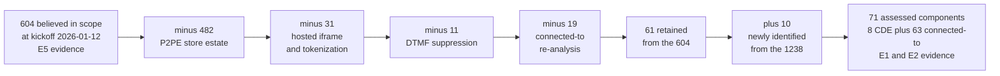

# 02.10 — Scope Reduction Analysis

| Field | Value |
|---|---|
| Document ID | MRG-PCI-2026-210 |
| Program | Marketa Retail Group — PCI DSS v4.0.1 Compliance Program |
| Phase | 02 — CDE Scoping &amp; Cardholder Data Discovery |
| Version | 1.0 |
| Status | Approved |
| Owner | Naomi Bhatt, Chief Information Security Officer |
| Approver | Raymond Voss, Chief Financial Officer |
| Date | 2026-07-15 |
| Classification | Confidential — Cardholder Data Environment // Illustrative Portfolio Sample |

## Purpose

This is the headline result of Phase 02 and the document most likely to be quoted out of context, so it is written to make that difficult.

**604 believed in scope. 71 assessed. A reduction of 533 components — 88.2%.**

The document attributes that reduction to each mechanism that produced it, quantifies each, states the conditions each depends on, records how each condition is verified and what would bring the systems back, sets out the economic argument that justified the investment, and then argues against itself. The counter-argument is not a rhetorical flourish. **Scope reduction is not risk reduction.** The account data still exists; it is held by somebody else; and Marketa has converted a technical control problem it could solve with engineering into a third-party assurance problem it can only manage with governance.

Both halves are true simultaneously. A reader who takes only the first half has taken the dangerous half.

## 1. The Reduction

| Mechanism | Components removed | Share of the reduction | Evidence grade supporting it |
|---|---|---|---|
| **P2PE — Verition listed solution across 482 stores and 1,914 lanes** | **482** | 88.8% | **E1** — lane-level packet capture, 3,840 test transactions |
| **Hosted checkout iframe and tokenization** | **31** | 5.7% | **E1** — HAR capture per template, server-side parameter analysis, negative detokenisation test |
| **DTMF suppression across 310 agents** | **11** | 2.0% | **E1** — DTMF decoder analysis at three capture points across 60 calls |
| **Connected-to re-analysis** — components that never had a CDE path | **19** | 3.5% | **E2** — reachability computation and administrative-path test |
| **Total removed** | **543** | 100% | |
| **Added** — identified by the analysis, never previously in scope | **+10** | — | **E2** — second-order reachability and administrative-path test |
| **Net reduction** | **533** | **−88.2%** | |

Two observations before the mechanism-by-mechanism analysis.

**The reduction is overwhelmingly one mechanism.** P2PE accounts for nearly nine tenths of it. Everything else is rounding by comparison. That concentration is itself a risk position: a single provider relationship, a single Council listing and a single instruction manual carry 88.8% of Marketa's scope reduction, and condition **P2PE-C1** — the solution remaining listed — is checked quarterly against a public web page.

**The analysis added components as well as removing them.** Ten components entered the assessment from the population that had been excluded on assertion. An exercise that only ever subtracts is not an analysis; it is an argument. That the same exercise which produced an 88.2% reduction also found ten systems nobody had scoped is the best available evidence that the method was applied rather than performed.

## 2. Mechanism 1 — P2PE: 482 Components

| Attribute | Value |
|---|---|
| What it removes | The 482 store back-office servers from the CDE, and with them the store LAN and store WAN as card-data-bearing paths. The 496 store-estate appliances and 1,914 POI devices were never counted in the 604 as components but are governed by the same conditions |
| Why it works | Account data is enciphered inside a SRED-capable POI device at the moment of read, by a solution assessed against the P2PE standard, whose keys are injected and held by the provider and whose decryption environment is outside Marketa's control. Marketa **cannot decrypt**, so it cannot be said to process account data downstream of the reader |
| Volume behind it | **74% of Marketa's transactions** — approximately 50.6 million a year |
| Conditions | **Nine** — P2PE-C1 to P2PE-C9, 02.04 §8 |
| Verified how | Two conditions continuously, seven on a cycle: Council listing check quarterly; device and firmware telemetry monthly; chain of custody per movement; network path analysis quarterly and on store network change; capture testing annually and on POS change; key-capability attestation and negative test annually; 9.5.1 inspection quarterly; segmentation penetration test at least annually under 11.4.5; merchant ID reconciliation annually |
| What brings the systems back | **Estate-wide**: delisting of the solution, any Marketa decryption capability, or a clear-text capture path in the POS application. **Store-level**: non-listed device or firmware, broken chain of custody, non-conforming POI network path, or failed 9.5.1 obligations at a site |
| Already observed to fail | **Yes, twice.** Three stores with a non-conforming POI network path, in scope from 2026-02-06 to 2026-02-17. Seven device register serial mismatches. Neither exposed account data; both suspended the claim while they lasted |

The asymmetry between store-level and estate-wide collapse, set out in 02.04 §8, is the operative risk statement. **Deployment conditions fail locally; capability conditions fail globally.** A store with the wrong firmware is a store-shaped problem taking nine days to fix. A clear-text capture path in the POS application would return 482 servers, 496 appliances and 1,914 lanes to the cardholder data environment in a single moment, six weeks before a fieldwork window that cannot be moved under **CON-04**.

## 3. Mechanism 2 — Hosted Iframe and Tokenization: 31 Components

These are treated together because they are one commercial relationship — Truvance is both the hosted checkout provider and the **single token vault across all three channels** — and because the components they remove overlap.

| Attribute | Value |
|---|---|
| What it removes | 23 of the 29 AWS e-commerce web and application hosts, and the 8 distribution-centre systems tagged "payment-adjacent." It also keeps out of scope populations that were never in the 604 at all: order management, the enterprise data warehouse, the loyalty platform, finance and the reporting estate — several thousand token-holding records-per-second and not one card number |
| Why the iframe works | Card fields are rendered inside a document served from Truvance's origin. The browser's same-origin policy prevents the Marketa parent document from reading them, and the PAN is posted by the consumer's browser directly to Truvance. No Marketa origin is in the card-data path |
| Why tokenization works | Marketa holds surrogates with no recoverable relationship to a PAN and no entitlement to reverse them. Verified contractually, by API scope enumeration, by token structure analysis, by a cached-mapping search across the whole estate, and by an **actual failed detokenisation attempt** returning HTTP 403 |
| Volume behind it | **23% of transactions** through the iframe; **100% of transactions** eventually represented as a token |
| Conditions | **Seven** for the iframe — ECOM-C1 to ECOM-C7, 02.05 §8. **Five** for tokenization — TOK-C1 to TOK-C5, 02.07 §6 |
| Verified how | Iframe: browser capture and DOM inspection per release and monthly; server-side parameter analysis per release; template enumeration against the release pipeline; script inventory triangulated three ways; 11.6.1 daily evaluation with quarterly detection testing. Tokenization: quarterly entitlement enumeration and repeat negative test; continuous cached-mapping discovery; annual token structure analysis; annual AOC review under 12.8.4; continuous DLP egress inspection |
| What brings the systems back | A Marketa-origin card field on any template, or any endpoint accepting a card-shaped value, returns the **entire AWS e-commerce tier** to the CDE — the largest single latent expansion in the programme. A detokenisation entitlement returns **every token-holding system in the estate**, which is a larger population than the 604 ever was |
| Already observed to fail | **Not the reduction itself.** But three of the 38 payment-page scripts were unauthorised at first inventory, which is a failure of ECOM-C4 rather than of ECOM-C1 — and the distinction matters, because the pages stayed out of the CDE while unauthorised code executed on them |

**What this mechanism does not remove is the reason 02.05 exists.** Six payment page templates, 38 scripts and six delivery-path components stay in the assessment under **6.4.3** and **11.6.1**. The iframe protects the transport of the PAN. It does nothing about the page being rewritten around it, and the reduction claimed here is explicitly a reduction in the *cardholder data environment*, not in the *assessment*.

## 4. Mechanism 3 — DTMF Suppression: 11 Components

| Attribute | Value |
|---|---|
| What it removes | 11 of the 14 call-centre telephony and agent desktop systems — the agent desktop images, the contact-centre platform and the routing estate. It also removes **310 agents** as processing components, which is a scope reduction that does not appear in any component count and is the larger part of the value |
| Why it works | Cadence sits at the carrier hand-off, **upstream of Marketa's session border controller**, and removes DTMF tones from the media before it reaches Marketa infrastructure at all. The agent hears a flat tone. No account data reaches any Marketa system in any form |
| Volume behind it | **3% of transactions** — approximately 2.1 million a year |
| Conditions | **Eight** — MOTO-C1 to MOTO-C8, 02.06 §9 |
| Verified how | Configuration and per-transaction event coverage monthly; SIP and RTP path analysis quarterly and on any telephony or carrier change; automated DTMF decoder analysis at three points quarterly; recording metadata reconciliation monthly; alternate-capture-path walkthrough annually with the technical controls verified continuously; **daily** authorisation-to-secure-session reconciliation; annual audio discovery over the retained recording population; annual AOC review |
| What brings the systems back | Suppression exempting any queue, agent group or call type; the suppression point moving downstream of Marketa's SBC — a routing change, not a project; recoverable digits in suppressed audio; any of the thirteen alternate capture paths opening; or account data re-entering the recording estate |
| Already observed to fail | **Yes — historically, and catastrophically for the assumption.** Condition MOTO-C7 had already failed before it was written down. Approximately 11,400 pre-masking recordings contained audible PANs. Assumption **A-04 was disproved** and risk **R-31 was raised to High** |

The MOTO reduction is the smallest of the three by component count and the most instructive of the three by a distance. It is the one where the control was real, the reduction was genuine, the evidence for current calls was strong — and the organisation had nonetheless drawn a conclusion about its data from a fact about its control. **A control has a start date. Data does not.**

## 5. Mechanism 4 — Connected-To Re-Analysis: 19 Out, 19 In

| Attribute | Value |
|---|---|
| What it removes | 19 components carried in the 2024 connected-to list that have no CDE connectivity, no administrative path and no security impact. Four of them no longer existed |
| What it adds back | 19 components: 6 payment-page delivery components previously counted among the AWS e-commerce hosts, 3 telephony boundary components previously counted among the call-centre systems, and **10 from the 1,238 believed out of scope** |
| Why it is listed as a mechanism | Because a re-analysis that produced a net movement of zero components hid a substitution of 30% of the population. Reporting the net and not the gross would have been the single most misleading available presentation of this phase |
| Conditions | The reachability and administrative-path determinations behind each — SEG-C1 to SEG-C6, 02.08 §12.1 |
| Verified how | Quarterly reachability computation across two hops; quarterly administrative-source analysis; six-monthly rule review under 1.2.7; monthly register reconciliation against four inventory sources |
| What brings systems back | Any new administrative path, any new boundary crossing, any second-order path from an out-of-scope system to a connected-to system. Finding **RCH-02** is exactly this: 14 corporate hosts were in scope from the moment a legacy management VLAN was proved reachable until it was removed |

## 6. The Conditions, Consolidated

Thirty-five conditions hold up the 88.2%. They are listed together here because no other document in the portfolio shows the whole load-bearing structure at once.

| Reduction | Conditions | Continuously verified | Verified on a cycle | Verified annually only |
|---|---|---|---|---|
| P2PE — 482 components | 9 | 1 | 6 | 2 |
| Hosted iframe — 23 components and 6 templates | 7 | 3 | 3 | 1 |
| Tokenization — 8 components and the wider token estate | 5 | 1 | 2 | 2 |
| DTMF suppression — 11 components and 310 agents | 8 | 2 | 4 | 2 |
| Segmentation — enables all of the above | 6 | 1 | 4 | 1 |
| **Total** | **35** | **8** | **19** | **8** |

**Eight conditions are verified once a year.** Those eight are the weakest points in the structure, and they include two of the most consequential: that Marketa holds no decryption capability (P2PE-C6) and that no account data remains in the recording estate (MOTO-C7). A condition verified annually can be false for eleven months without anybody knowing, and MOTO-C7 was false for seven years.

The programme's response is not to pretend the annual conditions are stronger than they are. It is to pair each with a **detective control that runs faster than the verification cycle**: continuous DLP telemetry, continuous discovery on high-risk repositories, the daily authorisation-to-session reconciliation, and the 10.7.2 monitoring-failure alerting. A condition verified annually and monitored continuously is a different proposition from one verified annually and otherwise unobserved.

## 7. What Was Considered and Not Done

A scope reduction analysis that does not record the reductions the entity declined is incomplete.

| Option examined | What it would have achieved | Why it was not done |
|---|---|---|
| **Eliminate the settlement exception path (F-04)** by asking Cardinal to supply exception records referenced by token | Would remove CDE-04 and CDE-05 from the CDE and reduce the CDE to a token environment | The record layout is the brand's, not Cardinal's, and the exception cases are precisely the ones where the account number is the only reliable reference. The change is not in Marketa's gift and would not be in Cardinal's either |
| **Eliminate the dispute image path (F-05)** by working disputes only from tokenised metadata | Would remove CDE-03 and CDE-06 | Issuer dispute packets are generated by issuers. A merchant that declines to look at them loses representments it would otherwise win. The commercial cost was assessed by Payment Operations as materially exceeding the compliance saving |
| **Outsource dispute handling entirely to a fourth party** | Would remove the CDE almost completely | Would convert the last technical control problem in the estate into a further third-party assurance problem, in the one process where Marketa's own judgement produces the commercial outcome. Rejected on the reasoning in §9 |
| **Move the Columbus CDE into the cloud entirely** | Would consolidate to a single zone | Rejected as a scope decision. It is a valid architecture decision and it will be taken on architecture grounds, not to make a register shorter |
| **Assess the 482 store servers individually as connected-to** | Would have removed the need to prove segmentation | Rejected. It multiplies the evidence burden by 482 without improving security, and it is the opposite of a reduction |

The third row is the one the Steering Committee spent the most time on, and the reasoning behind rejecting it is §9.

## 8. The Economic Argument

Every system that stays in scope carries **recurring** cost. Not project cost — recurring, annual, in perpetuity, for as long as the component exists and the organisation processes cards.

| Cost carrier | What it obliges per assessed component, every year |
|---|---|
| Configuration standard | A documented standard, applied, and evidenced as applied — **2.2.x** |
| Vulnerability scanning | Four authenticated internal scans, plus rescans to clean, plus remediation tracking including "all other applicable vulnerabilities" under **11.3.1.1** |
| Patch management | Critical and high-risk patches within one month, evidenced per component — **6.3.3** |
| Anti-malware | Agent deployed and current, or a documented 5.2.3.1 determination reviewed annually |
| Logging | Log source onboarded, parsed, retained twelve months with three immediately available, and included in the **10.4.1.1** automated review |
| File integrity monitoring | Baseline established, drift alerted, alerts triaged — **11.5.2** |
| Access review | Privileges reviewed at least every six months, evidenced per component — **7.2.4** |
| Account governance | Application and system accounts inventoried and managed under **8.6.1–8.6.3** |
| Change control | Every change assessed for scope impact, with the 1.2.3 and 1.2.4 diagrams updated |
| Evidence production | Screenshots, extracts, configuration dumps and interview time, refreshed for each assessment |
| Assessor time | Sampling, examination, testing procedures and observation, per component, per year |

Marketa does not publish a per-component unit cost, and this document deliberately does not invent one. What it records is the shape of the arithmetic: **the same basket, applied to 604 components instead of 71, is an eight-and-a-half-fold multiplier on a recurring annual obligation**, against a programme envelope of **$4,600,000** of which security tooling is $1,240,000 and QSA fees are $385,000. Constraint **CON-06** named scope reduction as the primary cost control at programme start, and this is the analysis that discharges it.

Two further economic effects are less obvious and larger than the licence arithmetic.

**Scope reduction buys assessment quality, not just assessment cost.** With 71 components the assessor examines nearly the whole population rather than sampling it. There is more scrutiny per component and no argument about the representativeness of a sample — 02.09 §6 makes the point in full. A merchant with 604 in-scope components spends part of every assessment negotiating about coverage.

**Scope reduction buys change velocity.** A component outside the CDE can be changed by the team that owns it, at that team's cadence. A component inside it carries change control, scope-delta review, potential segmentation retesting under 11.4.5, and evidence capture. For an organisation with a mandatory **October-to-January change freeze** under CON-01, the number of systems subject to CDE change control is directly a constraint on how much work the business can do in the eight months it has.

## 9. The Counter-Argument — Scope Reduction Is Not Risk Reduction

Everything above is an argument for a smaller scope. This section is the argument against believing it means what it appears to mean, and it is the position the CISO required to be written into the phase's own headline document rather than into a risk appendix.

> **The account data still exists. Every one of Marketa's 68.4 million annual transactions still produces a primary account number. Not one of them has been eliminated. They have been moved.**
>
> The card-present PANs are enciphered by Verition and decrypted in Verition's environment. The e-commerce PANs are posted to Truvance and held in Truvance's vault. The MOTO PANs are assembled by Cadence and passed to Truvance. Marketa has 8 components in its cardholder data environment because three organisations have taken responsibility for the other 68.4 million card numbers a year.
>
> **What Marketa has done is convert a technical control problem into a third-party assurance problem.** The first kind is solved with engineering: encryption, segmentation, monitoring, access control — things Marketa can build, test and observe directly. The second kind cannot be solved with engineering at all. It is solved, imperfectly, with contracts, attestations, responsibility matrices and periodic review. It is a governance problem, and governance problems fail more quietly than technical ones.

The concrete consequences are these.

| Consequence | Explanation | Where it is managed |
|---|---|---|
| **Marketa's exposure to a provider breach is undiminished** | If Truvance's vault is compromised, the affected cardholders are Marketa's customers, the brand damage is Marketa's, and the acquirer relationship in question is Marketa's. A provider's AOC is not indemnity and is not insurance | **12.8.2** written agreements; Phase 06 |
| **Marketa's ability to detect a provider failure is very limited** | Marketa observes its own environment continuously and its providers' environments once a year through a document. The detection asymmetry between the two is enormous and cannot be engineered away | **12.8.4** monitoring of provider validation status; contractual notification obligations |
| **Concentration risk is real and is now measurable** | Truvance is the single token vault across all three channels. Verition carries 88.8% of the scope reduction. Two providers hold nearly the whole position | Risk register; TPSP review quarterly |
| **Responsibility gaps are the characteristic failure** | The failure mode is not a provider doing its job badly. It is both parties believing the other one owns a control. **12.8.5** exists precisely for this and Marketa's Northbridge matrix needed clarifying, as 02.07 §7 records | **12.8.5** responsibility matrices per provider |
| **The provider's obligations toward Marketa are theirs to meet, not Marketa's to assume** | Requirement **12.9** obliges service providers to acknowledge in writing their responsibility for the account data they hold on the customer's behalf, and to support the customer's request for validation status. It is a service provider requirement. What Marketa can do is **require it and hold the evidence** — which it does, per provider | **12.9.1, 12.9.2** obtained from providers; Marketa's own obligation is 12.8 |
| **A provider changing its service can change Marketa's scope without Marketa doing anything** | A P2PE solution delisted, a token scheme altered, a suppression point moved during a provider's own network change. None of these is a Marketa change record | Conditions P2PE-C1, TOK-C3, TOK-C4, MOTO-C2, MOTO-C8, ECOM-C7 |

**The honest net position, which is the sentence the Steering Committee endorsed:**

> Marketa has an 88.2% smaller assessed environment and approximately the same amount of cardholder data risk in the world. What has changed is who is positioned to control it, and Marketa's job has shifted from operating those controls to obtaining and testing assurance that somebody else is. That is a good trade — three specialist providers operate those environments better than a specialty retailer would — but it is a trade, and it is not a reduction in the exposure of Marketa's customers.

This is why Phase 06 carries the third-party programme and why it is sized as it is. It is also why the programme rejected outsourcing dispute handling in §7: at some point the answer to "who is accountable" has to be somebody inside the company, and moving the last process out would have left Marketa with a compliance position and no operational relationship to the data at all.

## 10. Reversal Triggers, Consolidated

Every reduction in this phase can be undone. The triggers are stated in advance so that recognising one is a matter of observation rather than judgement.

| Trigger | Immediate scope effect | Components returning | Detection |
|---|---|---|---|
| Verition solution delisted by the Council | P2PE reduction suspended estate-wide | 482 + 496 + 1,914 devices | Quarterly listing check; provider announcement |
| Any Marketa decryption capability or key material acquired | P2PE reduction fails estate-wide | As above | Annual attestation and negative test; contract change review |
| Clear-text capture path introduced in the POS application | P2PE reduction fails estate-wide | As above | POS change review; annual capture testing; discovery |
| Non-listed device, firmware or POI network path at a site | Reduction fails at that site | Per store | Monthly telemetry; quarterly path analysis |
| A Marketa-origin card field on any payment template | E-commerce tier becomes CDE | 246 AWS workloads | Per-release capture and DOM inspection; parameter analysis |
| A Marketa endpoint accepting or logging a card-shaped value | As above | As above | Continuous log monitoring; per-release parameter analysis |
| Detokenisation entitlement enabled on any credential | **Every token-holding system enters the CDE** | Larger than the original 604 | Quarterly entitlement enumeration and negative test |
| A cached token-to-PAN mapping found anywhere | The holding system enters the CDE | Per finding | Continuous discovery; 12.10.7 procedure invoked |
| Suppression point moves downstream of the Austin SBC | Marketa telephony becomes CDE | Austin telephony estate | Quarterly path analysis; telephony change review |
| Suppression exemption for any queue, group or call type | Agent estate returns to the CDE | 310 agents and desktops | Monthly configuration review; daily reconciliation |
| Account data found in the recording estate | Recording platform re-enters the CDE | Recording estate | Annual audio discovery; QA sampling |
| Segmentation proved ineffective by penetration test | Everything on the reachable side is in scope until remediated and re-tested | Depends on the path | **11.4.5** test — and this is the trigger that fired |
| An undocumented boundary crossing or second-order path found | The source population enters scope | Per finding | Quarterly reachability computation |
| Provider AOC lapses or ceases to cover the service consumed | The dependent reduction is suspended | Per provider | Annual review under 12.8.4; Cardinal notified under **C7** |

The penultimate row is not hypothetical and the row before it is not either. **RCH-02** put 14 corporate hosts in scope for eleven days in February. The **11.4.5** segmentation test found a real path in May. Reversal triggers are not a theoretical construct in this programme; two of them fired within four months of the determination.

## 11. What This Analysis Does Not Claim

| Claim | Position |
|---|---|
| That an 88.2% reduction makes Marketa 88.2% safer | It does not. See §9. It makes Marketa's assessed environment 88.2% smaller |
| That the reduction is permanent | Thirty-five conditions hold it up, eight of them verified only annually |
| That the reduction was free | It cost the discovery exercise, the condition register, the verification cycles, and a permanent third-party assurance programme that did not previously exist |
| That a small CDE is a secure CDE | A compact environment with weak controls is worse than a large one with strong ones. Phases 03 to 07 build the controls; this phase only draws the boundary |
| That the providers' controls are Marketa's controls | They are not, and no attestation makes them so. **E3 evidence** under 02.01 §5 evidences the provider's environment and nothing about Marketa's operation of it |

## Cross-References

| Reference | Relevance |
|---|---|
| 01.06 — Program Charter &amp; Objectives | Objective O2 and the budget envelope this analysis discharges |
| 01.08 — Scope Assumptions &amp; Constraints | The 604 starting position and constraint CON-06 naming scope reduction as the primary cost control |
| 01.09 — Third-Party Service Provider Register | The providers who now hold the data, and the limits of their attestations |
| 02.04 — Card-Present Channel Scope | The nine P2PE conditions and the two that already failed |
| 02.05 — E-Commerce Channel Scope | The seven iframe conditions and what stays in scope regardless |
| 02.06 — Call Centre / MOTO Channel Scope | The eight DTMF conditions, and MOTO-C7 which had already failed |
| 02.07 — Data Flows &amp; Network Reachability | The five tokenization conditions and findings RCH-01 to RCH-04 |
| 02.08 — Connected-To &amp; Security-Impacting Systems | The six segmentation conditions and the 19-out-19-in substitution |
| 02.09 — Assessed System Component Inventory | The 604 → 71 reconciliation in register form |
| Phase 06 — Monitoring, Testing &amp; Third Parties | Requirement 12.8 assurance — the programme §9 argues is now the main event |
| Phase 09 — Executive Reporting &amp; Continuous Compliance | The condition register operated as the continuous compliance model |

---
[⬅ Previous](02.09-assessed-system-component-inventory.md) · [🏠 Phase 02 Home](02.00-README.md) · [Next ➡](02.11-assumption-test-results.md)
