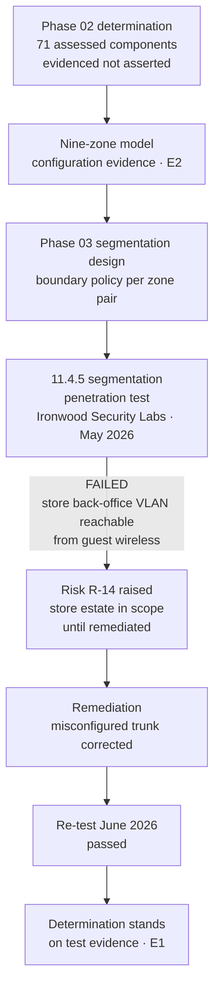

# 02.12 — Scope Validation &amp; Phase Summary

| Field | Value |
|---|---|
| Document ID | MRG-PCI-2026-212 |
| Program | Marketa Retail Group — PCI DSS v4.0.1 Compliance Program |
| Phase | 02 — CDE Scoping &amp; Cardholder Data Discovery |
| Version | 1.0 |
| Status | Approved |
| Owner | Naomi Bhatt, Chief Information Security Officer |
| Approver | Raymond Voss, Chief Financial Officer |
| Date | 2026-07-15 |
| Classification | Confidential — Cardholder Data Environment // Illustrative Portfolio Sample |

## Purpose

This document closes Phase 02. It records the **12.5.2 annual scope confirmation**, the QSA's review of the determination and the three places Sable Ridge Assurance challenged it, what the phase committed to and what it delivered, the deliverables register, the open items carried forward, and the transition to Phase 03.

It ends with an assurance statement written to be uncomfortable. The scope is now **evidenced** rather than asserted, which is a genuine change of state and the point of the phase. But segmentation — the mechanism on which the largest reductions rest — has been verified by **configuration only**, and configuration is not proof.

## 1. What Phase 02 Was For

Phase 01 produced a hypothesis: 604 of 1,842 systems in scope, resting on twelve assumptions and built almost entirely on **E5** evidence — a carried-forward scope schedule, CMDB tags and institutional memory. Phase 02's job was to test it and replace it with a determination that rests on **E1** and **E2**.

| Phase 01 position | Phase 02 determination |
|---|---|
| 604 systems believed in scope | **71 assessed system components** — 8 CDE, 63 connected-to |
| Basis: tags, a prior-year schedule and recollection | Basis: 100% discovery coverage, observed channel captures, reachability computation, administrative-path analysis |
| Twelve untested assumptions | Two disproved, seven qualified, two confirmed, one restated |
| No condition register | **Thirty-five conditions** with owners, verification methods, frequencies and reversal triggers |
| A network diagram eleven months out of date and a data-flow diagram describing a 2022 architecture | Both rebuilt from observed evidence, maintained as an output of change control |

## 2. The 12.5.2 Scope Confirmation Record

Requirement **12.5.2** obliges PCI DSS scope to be documented and confirmed at least once every twelve months and upon significant change to the in-scope environment, and it specifies what the confirmation must contain. This is the record.

| Attribute | Value |
|---|---|
| Confirmation type | Annual confirmation under **12.5.2** |
| Scope determination date | **2026-02-20** |
| Confirmation performed by | Elena Marchetti, VP Payment Operations, and Owen Castellanos, Payment Card Compliance Manager |
| Confirmed and approved by | **Naomi Bhatt, Chief Information Security Officer** |
| Endorsed by | PCI Steering Committee, chaired by Raymond Voss |
| Reviewed with | Sable Ridge Assurance, LLC — lead QSA Grant Whitfield, QSA Amara Osei |
| Assessment period covered | 2026 assessment year, fieldwork **2026-11-02 to 2026-11-20** |
| Next confirmation due | Within twelve months, and on significant change to the in-scope environment |
| **12.5.2.1** six-monthly confirmation | **Not applicable — service provider requirement.** Marketa is a merchant. Recorded so nobody adopts it by mistake and nobody is surprised by its absence from the ROC |
| **12.5.3** organisational-change review | **Not applicable — service provider requirement.** The equivalent discipline is applied voluntarily through acquirer obligation **C7** |

### 2.1 The seven elements, and where each is evidenced

| # | 12.5.2 element | Marketa's evidence | Document | Status |
|---|---|---|---|---|
| 1 | Identify all data flows across payment stages and acceptance channels | Three channel analyses traced end to end from observed captures, plus the exception and back-office flows | 02.04, 02.05, 02.06, 02.07 §3 | **Complete** |
| 2 | Update all data-flow diagrams under **1.2.4** | Four diagrams rebuilt from packet, browser and media captures; eight named flows, three carrying account data to a Marketa component | 02.07 §3, `diagrams/` | **Complete** |
| 3 | Identify all locations where account data is stored, processed or transmitted, **including outside the currently defined CDE** | 100% discovery across 1,842 systems, 41 shares, 6 archives, plus restore-and-scan of 21 backup sets. Four unexpected locations found, all outside the 604 | 02.02, 02.03 | **Complete** |
| 4 | Identify all system components in the CDE, connected to it, or able to affect its security | 71 components — 8 CDE, 63 connected-to across 13 functional groups | 02.07 §5, 02.08, 02.09 | **Complete** |
| 5 | Identify all segmentation controls and the environments segmented out, with justification for out-of-scope environments | Nine-zone model; nine segmentation-enforcing components in group G10; every exclusion recorded with its reason and its condition | 02.07 §2, 02.08 §12, 02.08 §16 | **Complete — qualified.** Justification rests on configuration evidence pending the 11.4.5 test |
| 6 | Identify all connections from third parties with access to the CDE | TPSP register reconciled against observed flows; one unrecorded connection found and added; one responsibility matrix clarified | 02.07 §7 | **Complete** |
| 7 | Confirm the above are documented, in scope where they should be, and accurately reflect the current environment | This confirmation, with the register reconciled monthly against four inventory sources | 02.09 §7, this document | **Complete** |

Element 5 carries the only qualification, and it is not a minor one. It is the subject of §8.

## 3. QSA Review of the Determination

Sable Ridge Assurance reviewed the determination at the March QSA checkpoint and again in a dedicated scope walkthrough. The engagement was structured so the assessor's job was to disagree where disagreement was warranted, and the record of what was challenged is more informative than the record of what was accepted.

### 3.1 The three formal challenges

| # | Challenge | Marketa's response | Outcome |
|---|---|---|---|
| **QC-01** | **Why are the 482 store back-office servers not enumerated among the 63 connected-to components?** The assessor's position: they have connectivity to shared administrative services that also reach the CDE, which is a connected-to characteristic | The store servers are out of the CDE on P2PE grounds and sit in the connected-to **band for governance**. What is enumerated is the boundary that keeps them out — CT-47, CT-48, CT-49 — and the shared services that cross it. Assessing 482 servers individually would multiply the evidence burden by 482 while testing the same security property that CT-48 and the 11.4.5 test already test. **Marketa additionally committed that a failed segmentation test returns the store estate to scope until remediated and re-tested** | **Accepted**, on the express condition of the 11.4.5 commitment. Recorded in the ROC scope narrative in those terms |
| **QC-02** | **The corporate end-user estate — approximately 1,100 laptops — is the largest exclusion in the determination and rests on a single architectural property.** The assessor asked what happens if that property fails | It had already failed once. Finding **RCH-02** proved a legacy management VLAN permitting 14 corporate hosts to reach Z3 management interfaces directly, bypassing the jump hosts. Those 14 were **recorded as in scope for the eleven days** between confirmation and closure, and the exclusion was reinstated on evidence, not on the fix being applied | **Accepted.** The assessor recorded the handling of RCH-02 as the reason for acceptance, and specifically that the population was placed in scope rather than described as a temporary exception |
| **QC-03** | **The A-05 accounting.** The assessor questioned recording two disproofs where four findings each contradict a third assumption | Marketa's reasoning is at 02.03 §7.3 and 02.11 §5: A-05 is an umbrella restatement, not an independent testable mechanism, and counting it would count the same evidence twice. A-05 has been retired and replaced by three separately testable claims with their own verification methods | **Noted, not contested.** The assessor's position: the accounting convention does not affect the assessed scope or any requirement outcome, and the reasoning is documented well enough to be reviewed. Recorded as an entity accounting convention, not as an assessor conclusion |

### 3.2 Two observations short of a challenge

| Observation | Marketa's action |
|---|---|
| **The CMDB's reliability as a scoping input.** The assessor noted 19 systems added during reconciliation and 6 "decommissioned" systems still live, and observed that both are **12.5.1** matters as much as discovery matters | Monthly reconciliation against **four** inventory sources rather than the CMDB alone; procedure **P-3** requiring termination and volume and snapshot deletion evidence before a decommissioned status is accepted |
| **Eight of thirty-five reduction conditions are verified annually only.** The assessor observed that an annual verification can be false for eleven months | Each annual condition paired with a detective control running faster than its verification cycle — continuous DLP telemetry, continuous discovery on high-risk repositories, daily authorisation-to-session reconciliation, and **10.7.2** monitoring-failure alerting |

### 3.3 What the QSA review does and does not mean

| Position | Statement |
|---|---|
| The scope is Marketa's determination | It is. The QSA validates it, challenges it, tests the evidence behind it and records the assessed scope in the ROC. It does not produce the scope and cannot make an unsupported exclusion supportable by accepting it |
| Acceptance is not correctness | An exclusion accepted at the March checkpoint remains Marketa's to defend at fieldwork in November against the environment as it then stands |
| The ROC records the assessed scope | Phase 08's subject. The scope narrative in the ROC reflects this determination and the QC-01 condition |
| No opinion here binds anyone | PCI DSS is contractual, not statutory. The Council writes the standard and does not enforce it. There is **no PCI DSS certification for a merchant**, and no attestation is a determination of compliance with any law |

## 4. Committed and Delivered

| Phase 02 commitment from 01.12 | Delivered | Evidence |
|---|---|---|
| Discovery across 100% of the estate, not the believed-in-scope subset | **Yes** — 1,842 of 1,842 systems, plus 41 shares and 6 email archives | 02.02 §8 coverage table, accepted by the QSA without qualification |
| Answer all sixteen questions from 01.08 §6 | **Yes** — fifteen answered on E1 or E2 evidence; Q-10 answered conditionally and handed to Phase 03 | 02.11 §2 |
| Disposition all twelve assumptions | **Yes** — 2 disproved, 7 qualified, 2 confirmed, 1 restated | 02.11 §3 |
| Produce a 12.5.2 scope determination reviewed with the QSA | **Yes** — determination dated 2026-02-20; three formal challenges, all resolved | §2, §3 |
| Produce the 12.5.1 assessed component inventory | **Yes** — 71 components, reconciled monthly against four sources | 02.09 |
| Rebuild the 1.2.3 and 1.2.4 diagrams from observation | **Yes** — both rebuilt; maintenance made a change-control completion criterion | 02.07 §1 to §3 |
| Establish the condition register | **Yes** — 35 conditions with owners, methods, frequencies and reversal triggers | 02.10 §6 |
| Complete inside the January–February window with no trading-hours impact | **Yes** — 2026-01-19 to 2026-02-20, 33 days, no trading-hours impact under CON-02 | 02.02 §10 |
| Establish **12.10.7** procedures | **Exceeded** — the phase began with none and produced five, P-0 to P-4 | 02.03 §8 |
| Remediate any account data found | **Yes** — all four locations remediated; the last backup copies aged out 2026-05-31 | 02.03 |

## 5. Deliverables Register

| Document | Title | ID | Owner | Status |
|---|---|---|---|---|
| 02.00 | Phase README and reading order | — | Owen Castellanos | Approved |
| 02.01 | Scoping Methodology | MRG-PCI-2026-201 | Owen Castellanos | Approved |
| 02.02 | Cardholder Data Discovery | MRG-PCI-2026-202 | Marcus Hale | Approved |
| 02.03 | Unexpected PAN Locations &amp; Response | MRG-PCI-2026-203 | Elena Marchetti | Approved |
| 02.04 | Card-Present Channel Scope | MRG-PCI-2026-204 | Trevor Kim | Approved |
| 02.05 | E-Commerce Channel Scope | MRG-PCI-2026-205 | Sonia Rendell | Approved |
| 02.06 | Call Centre / MOTO Channel Scope | MRG-PCI-2026-206 | Bill Traynor | Approved |
| 02.07 | Data Flows &amp; Network Reachability | MRG-PCI-2026-207 | Trevor Kim | Approved |
| 02.08 | Connected-To &amp; Security-Impacting Systems | MRG-PCI-2026-208 | Trevor Kim | Approved |
| 02.09 | Assessed System Component Inventory | MRG-PCI-2026-209 | Owen Castellanos | Approved |
| 02.10 | Scope Reduction Analysis | MRG-PCI-2026-210 | Naomi Bhatt | Approved |
| 02.11 | Assumption Test Results | MRG-PCI-2026-211 | Owen Castellanos | Approved |
| 02.12 | Scope Validation &amp; Phase Summary | MRG-PCI-2026-212 | Naomi Bhatt | Approved |

### 5.1 Supporting artefacts

| Folder | Contents |
|---|---|
| `diagrams/` | The **1.2.3** network diagram; four **1.2.4** account-data flow diagrams; the nine-zone model; the reachability model output |
| `trackers/` | Assessed component register — 71 entries under the eleven-attribute schema; the condition register — 35 conditions; the Scope Decision Record register; the exclusion register; the payment-page script inventory — 38 entries |
| `logs/` | Discovery coverage and scan-completion evidence; adjudication records; the `HOLD`-state resolution log; scope-delta records; deletion manifests |
| `governance/` | The 12.5.2 confirmation record; QSA checkpoint minutes and challenge responses; Steering Committee endorsement |
| `adr/` | Phase 02 architecture decision records, continuing the Week 7 series from **ADR-0004** |
| `templates/` | Scope Decision Record template; condition register template; scope-delta review template; monthly reconciliation checklist |

## 6. Open Items Carried Forward

| # | Item | Owner | Due | Carried to |
|---|---|---|---|---|
| **OI-02-01** | **11.4.5 segmentation penetration test** to convert A-09 from configuration evidence to test evidence | Trevor Kim | 2026-05 | Phase 03 |
| **OI-02-02** | Authenticated internal scanning on the **9 vendor-locked POS back-office appliances** under CON-03 — vendor engagement to obtain credentialed access | Trevor Kim | 2027-01-31 | Phase 06, ROC finding in Phase 08 |
| **OI-02-03** | Verition **P2PE Attestation of Validation** renewal tracking; AoV on file dated 2025-09-12 requires renewal inside the compliance year | Owen Castellanos | Quarterly review | Phase 06 |
| **OI-02-04** | **6.4.3** script authorisation workflow and integrity assurance mechanism to go live; **11.6.1** monitoring live from August 2026 | Sonia Rendell | 2026-08 | Phase 04 |
| **OI-02-05** | Removal of the marketing tag manager from all six payment templates confirmed by field telemetry, not by console setting | Sonia Rendell | 2026-08 | Phase 04 |
| **OI-02-06** | Six-monthly firewall rule review under **1.2.7** established as a standing cycle, following the 1,286 shadowed rules removed | Trevor Kim | 2026-08 | Phase 03 |
| **OI-02-07** | Condition register operationalised — every one of the 35 conditions with a live verification cadence and evidence store | Owen Castellanos | 2026-09 | Phase 09 |

## 7. Transition to Phase 03

Phase 03 — **Network Segmentation &amp; Architecture** — inherits the following and is the phase in which the determination is either proved or corrected.

| Input | What Phase 03 does with it |
|---|---|
| The **nine-zone model** | Builds it out as a designed architecture with documented boundary policy per zone pair, replacing the model that was reverse-engineered from configuration |
| The **63 connected-to components** and the 9 in group G10 | Designs the segmentation controls properly, including the concentration risk that Z3 is the only zone with a path into Z1 and Z2 |
| Findings **RCH-01 to RCH-04** | Confirms closure and builds the detection that would have found them sooner |
| **Condition SEG-C4** | Commissions the **11.4.5** penetration test from Ironwood Security Labs |
| Risk **R-31** | Enters the baseline register at 16, High |
| Risk **R-14** | Raised on the segmentation test result and entered in the baseline |
| The **1,286 shadowed and 63 overly permissive rules** | Rule base rationalisation and the standing 1.2.7 review cycle |
| The **35 conditions** | Verification cadences stood up as operational controls |

## 8. Assurance Statement

Written by the CISO, approved by the CFO, and reproduced without softening.

**What has changed.** At kickoff, Marketa's scope was a number carried forward from a previous assessment, supported by database tags and the memory of the people who had run it. It is now a determination: 71 components, each with a recorded classification, a named owner, the evidence grade behind it, and the conditions it depends on. Every exclusion has a written reason and a stated trigger that would reverse it. Every reduction has a verification method and a frequency. The scope is **evidenced rather than asserted**, and that is a different kind of object from what the programme started with.

**What has not changed.** The account data still exists. Sixty-eight point four million card numbers a year are still created, still transmitted and still stored — by Verition, by Truvance and by Cadence. Marketa has an 88.2% smaller assessed environment and approximately the same amount of cardholder data risk in the world. What has moved is who is positioned to control it, and Marketa's obligation has shifted from operating those controls to obtaining and testing assurance that somebody else does. That is Requirement 12.8, that is Phase 06, and it is a harder discipline to sustain than the one it replaced because its failures are quiet.

**What this phase could not prove.** The largest reductions in the programme rest on segmentation. Segmentation has been verified across all nine zones and all 482 sites by configuration extraction, rule-set analysis over 11,847 rules, route analysis, ninety days of flow logs and a reachability computation across two hops. That is thorough, it is **E2**, and it is not a test.

> **Configuration is not proof.** A rule set is a statement of intent, executed by devices that may be misconfigured, mis-cabled, or interacting in ways that neither device's configuration describes. Configuration review can only find the errors that are visible in the artefacts it reads. Requirement **11.4.5** obliges a merchant to test segmentation controls at least annually and after any change to them, and the requirement is written that way because the industry's experience is that configuration review and penetration testing do not find the same things.
>
> **The first segmentation penetration test, conducted by Ironwood Security Labs in May 2026, failed.** One path proved the segmentation was not effective: a store back-office VLAN reachable from the guest Wi-Fi VLAN through a misconfigured trunk — precisely the boundary between Z7 and Z5 that 02.08 §16 recorded as the most conditional exclusion in the determination, and precisely the failure the three-zone store model was designed to prevent. Risk **R-14** was raised. The store estate was returned to scope until remediation and a clean re-test in June.
>
> **This is the honest outcome and the programme records it as such.** A first segmentation test that finds nothing usually means the test was scoped to confirm rather than to break. Marketa's determination was correct in its structure and wrong in one place, and it took a test to find out which place. Everything in this phase that rests on segmentation was, until June 2026, resting on an assumption that had been carefully evidenced and was false at one of 482 sites.

**What the reader should take from Phase 02.** Not that the scope is small. That the scope is *known*, that what it depends on is written down, and that the organisation has demonstrated twice — with A-04, with A-07, and a third time with the segmentation test — that it will record a disproof rather than absorb it. A scope determination is only as good as the willingness of the entity to be told it is wrong.

## Cross-References

| Reference | Relevance |
|---|---|
| 01.08 — Scope Assumptions &amp; Constraints | The hypothesis this phase tested and the sixteen questions it answered |
| 01.12 — Program Roadmap &amp; Milestones | The Phase 02 commitments discharged in §4 |
| 01.13 — Phase Summary &amp; Transition | The handover this document answers |
| 02.01 — Scoping Methodology | The method, the evidence standard and the conditionality principle |
| 02.09 — Assessed System Component Inventory | The 71 components confirmed under 12.5.2 |
| 02.10 — Scope Reduction Analysis | The 88.2% and the argument against over-reading it |
| 02.11 — Assumption Test Results | The dispositions the QSA reviewed under QC-03 |
| Phase 03 — Network Segmentation &amp; Architecture | The 11.4.5 test, risks R-14 and R-31, and the nine-zone build-out |
| Phase 06 — Monitoring, Testing &amp; Third Parties | Requirement 12.8 assurance over the providers now holding the data |
| Phase 08 — QSA Assessment &amp; ROC Production | The assessed scope as recorded in the ROC, including the QC-01 condition |
| Phase 09 — Executive Reporting &amp; Continuous Compliance | The condition register operated as the continuous compliance model |

---
[⬅ Previous](02.11-assumption-test-results.md) · [🏠 Phase 02 Home](02.00-README.md) · [Next ➡](../03-network-segmentation-architecture/03.00-README.md)
