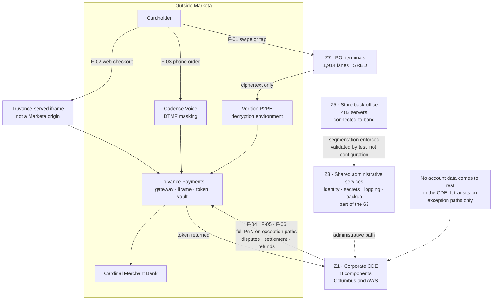

# Account Data Flows and the Nine Zones

## The claim this diagram has to support

Requirement **1.2.4** requires a data-flow diagram covering all account data flows. Requirement **1.2.3** requires a network diagram, kept current — and a diagram that is not maintained is not evidence, it is a drawing.

The load-bearing assertion here is that **no account data comes to rest in the CDE**. PAN transits the corporate environment only on exception paths — disputes, settlement reconciliation and refunds — and is not stored. Phase 02 proves that by discovery; Phase 04 has to keep proving it.

## Source
`02.07-data-flows-and-network-reachability.md`, `02.09-assessed-system-component-inventory.md`.
