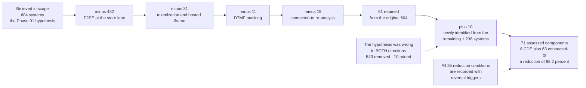

# Scope Reduction — 604 to 71

## The detail that matters more than the headline

The headline is **−88.2%**. The more useful number is **+10** — systems that were never in the 604 at all and had to be discovered. A scoping exercise that only ever removes systems has not tested the hypothesis; it has confirmed a preference.

## Source
`02.10-scope-reduction-analysis.md`, `02.09-assessed-system-component-inventory.md`.
