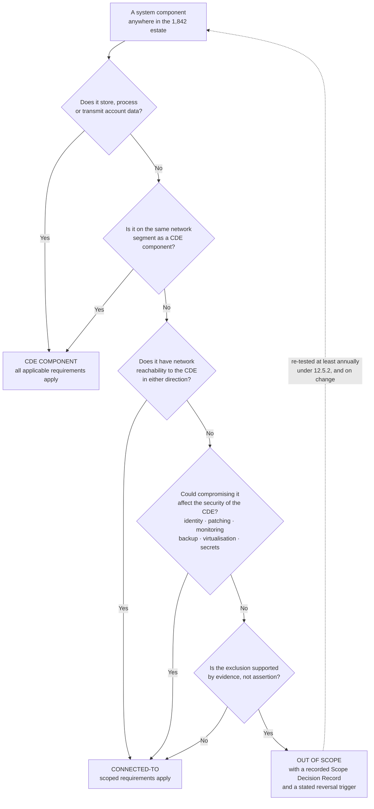

# The Scoping Decision Tree

## The two questions entities skip

**Question 4** is where under-scoping happens. A system holding no account data at all can still be in scope, because compromising it would let an attacker reach or weaken the CDE. Identity, patching, monitoring, backup, virtualisation and secrets management are all in scope at Marketa for exactly this reason, and none of them touches a PAN.

**Question 5** is the discipline that makes the rest defensible. An exclusion without a recorded reason is not a determination — it is an omission that happens to be written down.

## Source
`02.01-scoping-methodology.md`, `02.08-connected-to-and-security-impacting-systems.md`.
