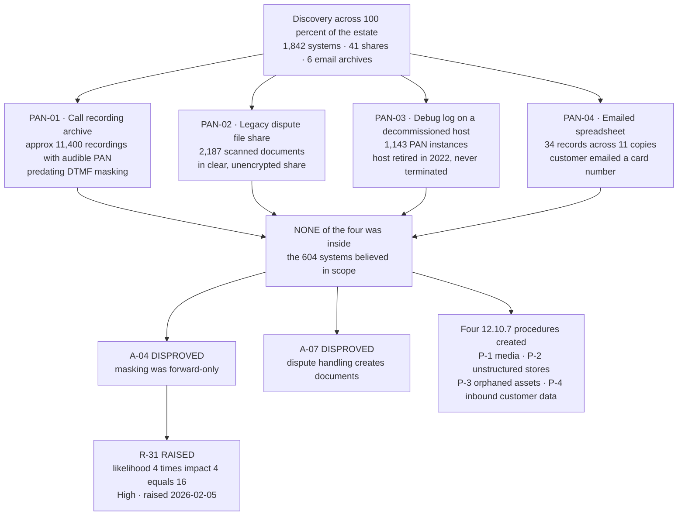

# Where the Account Data Actually Was

## Why the risk went up after everything was fixed

All four locations were remediated. The archive is gone, the share is destroyed, the host is terminated, the spreadsheet copies are purged.

**The risk still rose**, because the Low rating attached to historical account data had rested on a belief — that DTMF masking had solved the problem — and the belief was wrong. Fixing four locations does not restore confidence in an estate nobody had ever searched. That confidence returns when the search runs again and finds nothing, not when the first search is cleaned up.

## Source
`02.03-unexpected-pan-locations-and-response.md`, `02.11-assumption-test-results.md`.
