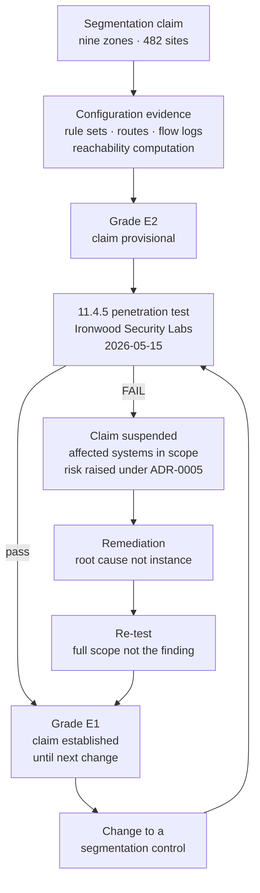

# 03.01 — Segmentation Strategy &amp; Principles

| Field | Value |
|---|---|
| Document ID | MRG-PCI-2026-301 |
| Program | Marketa Retail Group — PCI DSS v4.0.1 Compliance Program |
| Phase | 03 — Network Segmentation &amp; Architecture |
| Version | 1.0 |
| Status | Approved |
| Owner | Naomi Bhatt, Chief Information Security Officer |
| Approver | Raymond Voss, Chief Financial Officer |
| Date | 2026-07-15 |
| Classification | Confidential — Cardholder Data Environment // Illustrative Portfolio Sample |

## Purpose

Phase 02 produced a scope determination of **71 assessed system components** — 8 in the cardholder data environment, 63 connected-to — reduced from a starting hypothesis of 604. The largest reductions in that determination do not rest on cryptography or on tokenisation. They rest on **segmentation**: on the claim that certain networks cannot reach the cardholder data environment, and that the systems on them are therefore outside it.

This document states what that claim is, what the standard requires of an entity that makes it, what Marketa's design principles are, and what happens if the claim is false. It is the strategy document for the phase and it is deliberately written before the architecture, the standards and the test, because everything that follows is an implementation of the position taken here.

It states one thing plainly at the outset, because the rest of the phase is an argument for it: **configuration is not proof.**

## 1. Segmentation Is Not a PCI DSS Requirement

This is the most commonly misunderstood point in the standard, and getting it wrong in either direction is expensive.

| Position | Correct? | Consequence of believing it |
|---|---|---|
| PCI DSS requires network segmentation | **No** | An entity builds segmentation to satisfy a requirement that does not exist, and then treats the build as the deliverable rather than the evidence |
| Segmentation is optional, and an entity may therefore skip the associated testing | **No** | Segmentation is optional. **Relying on it is not.** An entity that claims scope reduction from segmentation has adopted an obligation it cannot then decline |
| Segmentation is an optional method of reducing the scope of the assessment; if it is used, its effectiveness must be verified by penetration testing under **11.4.5** | **Yes** | This is Marketa's position and the basis of the entire phase |

The standard's own framing is unambiguous. Network segmentation is described as **not a PCI DSS requirement** but as a method by which an entity may reduce the scope of its assessment, the number of systems requiring controls, and the cost and difficulty of maintaining them. An entity is perfectly entitled to declare its whole network in scope, apply every requirement everywhere, and never draw a boundary. That entity has a larger, more expensive assessment and no segmentation obligations whatsoever.

The moment an entity says *"those systems are out of scope because they are segmented from the CDE"*, three things become true simultaneously:

| # | What becomes true | Requirement |
|---|---|---|
| 1 | The segmentation controls themselves are **in scope** — a control that creates a boundary cannot sit on the excluded side of it | Requirement 1 in full; enumerated as group **G10** in 02.08 §12 |
| 2 | The segmentation must be **identified and justified** in the annual scope confirmation | **12.5.2**, element 5 |
| 3 | The effectiveness of the segmentation must be **verified by penetration testing** at least annually and after any change to segmentation controls or methods | **11.4.5** |

Marketa chose segmentation. Marketa therefore owns all three. The choice was made because the alternative — treating 1,842 systems as one flat in-scope estate — is not an assessment that could be completed, evidenced or maintained by an organisation of Marketa's shape, and because it would make no one safer.

### 1.1 The testing obligation, stated precisely

Requirement **11.4.5** obliges an entity that uses segmentation to isolate the CDE from other networks to perform penetration testing on the segmentation controls and methods **at least once every twelve months and after any changes to segmentation controls or methods**; to cover all segmentation controls and methods in use; to verify that the segmentation methods are operational and effective and isolate all out-of-scope systems from systems in the CDE; and to have the testing performed by a qualified internal resource or qualified external third party with organisational independence.

Requirement **11.4.6** shortens that cadence to **at least once every six months and after any changes to segmentation controls or methods**. It is a **service provider requirement**. Marketa is a Level 1 **merchant**. 11.4.6 does not apply, and the programme records the distinction in writing so that nobody adopts a six-month cycle believing it is compulsory, and nobody is surprised when the requirement is marked not applicable in the Report on Compliance.

| Requirement | Applies to | Cadence | Marketa's position |
|---|---|---|---|
| **11.4.5** | All entities using segmentation for scope reduction | At least every 12 months **and after change** | **Applicable.** The obligation this phase discharges |
| **11.4.6** | **Service providers only** | At least every 6 months and after change | **Not applicable.** Merchant. Recorded in the ROC as N/A with the reasoning |
| **11.4.1** | All entities | Methodology defining scope, testing from inside and outside, application- and network-layer testing | Applicable; the methodology governs both the segmentation and application tests |

The phrase **"and after any changes"** does more work than the annual cadence does. An annual test proves a property about a network that existed on the day of the test. Marketa's estate changes daily, and a single trunk port, route propagation or security group rule can undo the property between tests. The change-triggered limb is what makes 11.4.5 a control rather than a ceremony, and 03.03 §4 defines what Marketa classifies as a segmentation-affecting change.

## 2. Segmentation Versus Filtering

Marketa's programme insists on a distinction that vendor material tends to blur, because the blur is where failed segmentation tests come from.

| Dimension | **Filtering** | **Segmentation** |
|---|---|---|
| What it does | Restricts which traffic is permitted between networks that remain mutually reachable | Removes the ability of one network to reach another at all, except through a defined, enforced and monitored path |
| Default posture | Frequently permit-with-exceptions | **Deny by default, in both directions**, with named exceptions |
| Failure mode | A rule is added, reordered, shadowed or bypassed, and the traffic flows | The path itself must be created before anything can flow |
| What a misconfiguration costs | One unintended flow | The boundary |
| Does it support scope reduction? | **Only if it achieves isolation and is tested as such.** A filter that permits general access is not segmentation whatever the device is called | Yes, where isolation is demonstrated |
| Evidence it produces | A rule base | A tested inability to reach |

The practical test Marketa applies is a single question, asked of every boundary in the estate:

> **If every rule on this device were removed, would the two networks still be unable to reach each other?**

Where the answer is **yes** — different routing domains, no route, no shared broadcast domain, an air gap, a physically distinct switch fabric — the isolation is structural, and the device is a second layer. Where the answer is **no** — the networks are routable to one another and only the rule base stands between them — the isolation is *policy*, and the boundary is exactly as strong as the configuration management around it.

Marketa has both kinds. Z1's isolation from Z4 is structural: there is no route, and there never was a design in which there was one. Z7's isolation from Z5 inside a store is **policy expressed in switch port configuration**, which is to say it is one line of configuration deep. §5 of this document says what follows from that, and 03.07 reports what happened.

## 3. What "Adequate Isolation" Means

The standard's guidance describes the condition an entity must achieve as **adequate network isolation** — the out-of-scope network must not be able to affect the security of the CDE, and connectivity between the segmented environment and the CDE must be effectively prevented. It does not prescribe a technology. It does not certify a product. Marketa converted the concept into five testable properties, so that "adequate" is something an engineer can build to and an assessor can test.

| # | Property | How Marketa tests it | Evidence grade |
|---|---|---|---|
| **AI-1** | **No routed path exists** from the out-of-scope network to the CDE, in either direction, through any sequence of permitted hops | Reachability computation across the transitive closure of all rule sets and route tables — 02.07 §4.1 | E2 |
| **AI-2** | **No shared layer-2 domain** — no VLAN, trunk, bridge, tunnel or wireless SSID carries both an out-of-scope network and an in-scope one | Switch and controller configuration extraction; VLAN membership analysis; trunk allowed-list review | E2 |
| **AI-3** | **No shared infrastructure component whose compromise crosses the boundary** — no hypervisor hosting both sides, no load balancer terminating both, no management plane spanning both without control | Component-level analysis; the administrative-path test in 02.07 §5 | E2 |
| **AI-4** | **No identity or administrative path** by which control of an out-of-scope system yields control of the boundary or of an in-scope system | Privilege and trust-relationship analysis; SEG-C5 | E2 |
| **AI-5** | **The isolation survives being attacked**, from a position an adversary could realistically occupy, by a tester trying to break it rather than to confirm it | **Penetration testing under 11.4.5** | **E1** |

AI-1 to AI-4 are what Phase 02 completed. All four are **E2** under the evidence standard in 02.01 §5: configuration extracts, route tables, flow logs, policy analysis. They are thorough, they were performed across 11,847 rules and 41 policy sets, and they are the right work.

**AI-5 is the only one of the five that is a test, and it is the only one graded E1.** Phase 02 could not discharge it and said so. It is condition **SEG-C4** in 02.08 §12.1, open item **OI-02-01**, and the reason this phase exists.

## 4. Configuration Is Not Proof

This is the intellectual spine of Phase 03 and it deserves more than an aphorism.

A configuration review answers the question *"what does this device's policy permit?"* It is a good question. It is not the same question as *"what can an attacker do from there?"*, and the gap between the two is where segmentation failures live.

| What configuration review can find | What only testing can find |
|---|---|
| A rule permitting traffic that should not be permitted | A path composed of two devices each of whose configuration is individually correct |
| An `any` in a source, destination or service field | A device whose running configuration differs from the configuration the management system believes it has |
| A route that should not exist in a route table | A cable in the wrong port |
| A missing deny at the end of a policy | A default that was never written down anywhere, because it is a default |
| A shadowed rule that will become live on a reorder | A control that is present, correct and **not actually enforcing**, because it was never committed, never applied, or applied to the wrong interface |
| A documented flow with no business justification | An undocumented behaviour of the platform itself |

Marketa's Phase 02 reachability computation was better than most merchants' configuration reviews. It was not a human reading a rule base — it was a model of the estate queried for transitive reachability, which is precisely the analysis that catches multi-device paths. It found four undocumented paths, **RCH-01** to **RCH-04**, all closed.

It did not find the trunk port at store 0417, and the reason is structural rather than a failing of diligence: **the analysis read the configuration the store-estate policy controller believed it had pushed, and the store switch was carrying a VLAN the controller's model did not know it was carrying.** A model built from configuration cannot detect a divergence between configuration and behaviour, because the divergence is invisible in the input.

> **Reading a rule set is exactly what missed the trunk.** The programme states this without hedging because it is the phase's whole lesson. Phase 02 verified segmentation across nine zones and 482 sites by reading rule sets, routes and flow logs — 11,847 rules, 41 policy sets, 90 days of NetFlow, a two-hop reachability closure — and concluded that the store estate was isolated. The conclusion was correct at 481 sites and wrong at one, and no amount of additional reading would have found the one. It took a tester with an association to a guest SSID and an afternoon.

The corollary is a rule the programme now operates: **a segmentation claim is asserted at E2 and confirmed at E1, and the gap between the assertion and the confirmation is a period during which the claim is provisional.** Phase 02's determination was published as provisional on exactly this basis. That was not modesty. It was accurate.

## 5. The Stakes

Segmentation at Marketa is not a defence-in-depth nicety. It is load-bearing for the scope determination, and the load is measurable.

| What segmentation removes from the assessment | Count | The boundary it depends on | Where it is argued |
|---|---|---|---|
| **Store back-office servers** | **482** | Z5 isolated from Z4, and Z5 isolated from Z7 | ADR-0006; 02.04 §10 |
| Store-estate network appliances | 496 | As above | 02.04 §10 |
| **AWS e-commerce workloads** | **246** | Z8 isolated from Z2 | 02.05 §10; RCH-01 |
| Corporate end-user laptops | ~1,100 | Z4 has no path to Z1 or Z2 except through Z3 jump hosts | 02.08 §16; RCH-02 |
| Contact-centre agent desktops | 310 | Z9 carries no account data; the suppression point sits upstream | 02.06 |
| Distribution-centre systems | 96 | Z4 boundary | 02.08 §16 |
| Store POI devices, as assessed components | 1,914 | P2PE; Z6 restricted to the PIM-specified path | 02.04 |

**482 store servers stay out of scope only while the Z5 boundary holds.** That is the plainest statement of the stakes available and it is worth following through to what "in scope" would actually mean, because the number 482 conveys less than the consequence does.

| If the store estate re-enters scope | Consequence |
|---|---|
| Assessed component population | **71 → 553**, an increase of 679% |
| Authenticated internal vulnerability scans under 11.3.1.2 | 482 additional targets, on appliances already the subject of constraint **CON-03** and one of the two eventual Not in Place findings |
| File integrity monitoring baselines under 11.5.2 | 482 additional baselines to establish, tune and respond to |
| Configuration standards evidence under 2.2.x | 482 additional attestations |
| Patch evidence under 6.3.3 | 482 additional monthly attestations, across a WAN estate with a change freeze from October to January |
| QSA sampling | A store-server sample the assessor selects, with site visits, inside a three-week fieldwork window |
| Programme cost and schedule | Not survivable inside the 2026 assessment year without moving the fieldwork date, which the Cardinal AOC deadline of 31 December does not permit |

There is no version of this in which the store estate is quietly absorbed. **ADR-0006 is explicit that the classification collapses if the segmentation test fails**, and the QSA accepted the classification on exactly that condition, noting that it "depends entirely on the May test."

Marketa also refuses the framing in which this is only an audit problem. The security consequence is the real one: a guest wireless network in a retail store is the most accessible network Marketa operates. Anybody can walk into a store, associate with it, and take as long as they like. If that network can reach the store back-office estate, then the effective perimeter of 482 buildings is a customer's phone.

## 6. Marketa's Design Principles

Nine principles govern the architecture in 03.02, the standards in 03.03, the store build in 03.04, the cloud design in 03.05 and the wireless position in 03.06. Each is stated as a rule an engineer can be held to, not as an aspiration.

| # | Principle | What it means in practice | Where it is implemented |
|---|---|---|---|
| **SP-1** | **Deny by default, in both directions** | Every boundary policy terminates in an explicit deny-and-log. Outbound is written with the same discipline as inbound, because the outbound direction is the exfiltration path and the second-order scope path | 03.03 §5; every boundary in 03.02 §4 |
| **SP-2** | **A flow exists because it is named, not because it works** | Every permitted flow carries an identifier, a business justification, a named owner, a defined source, destination, protocol and port, and a review date. A flow nobody will claim is removed | 03.03 §3; the 214 CDE-adjacent rules reduced in 02.07 §4.1 |
| **SP-3** | **Structural isolation before policy isolation** | Where an isolation can be achieved by not having a route, it is achieved that way. Policy is the second layer, never the only one. Where policy is the only layer — as it is inside a store — the fact is recorded as a design weakness rather than described as a control | 03.02 §3; 03.04 §4 |
| **SP-4** | **Concentrate the crossings** | Z3 is the only zone with a routed path into Z1 and Z2. This makes the connected-to population enumerable and the boundary testable, and it makes Z3 the highest-value target in the estate. The trade is recorded in the risk register rather than presented as an unmixed good | 03.02 §5 |
| **SP-5** | **The boundary is in scope** | Every device, controller, control plane, pipeline and identity that can alter a boundary is an assessed component. Nine such components are enumerated as group G10; the infrastructure-as-code pipeline CT-30 and the AWS organisation account CT-41 are there for this reason | 02.08 §12; 03.05 §6 |
| **SP-6** | **Identity is a segmentation control** | A security group means nothing if a principal can rewrite it. Reachability is computed over identity paths as well as network paths, and the ability to change a boundary is governed as tightly as the ability to cross one | 03.05 §6 |
| **SP-7** | **Configuration is not proof** | Every segmentation claim carries an evidence grade. No claim is treated as established on E2 alone. The 11.4.5 test is the confirming control and its result governs the claim | §4; 03.07 |
| **SP-8** | **Change is a scope event** | Any change to a segmentation control or method triggers a scope-delta review, a diagram update as a completion criterion, and an assessment of whether an 11.4.5 re-test is required. The IaC pipeline raises the obligation automatically rather than relying on somebody recognising the significance of a pull request | 03.03 §4; 02.08 §8 |
| **SP-9** | **Design for 482** | No store control is adopted unless it can be deployed, verified and rolled back across 482 sites from a central controller, with per-site evidence. A control that requires an engineer in a store is not a control at this scale; it is a project | 03.04 §7 |

SP-3 and SP-9 pull against each other and the tension is deliberate. Structural isolation inside a store would mean physically separate switch fabrics for the back office, the payment device VLAN and guest wireless — three sets of hardware in 482 stockrooms. Marketa did not do that, and 03.04 §4 records the decision, the cost that justified it, and the residual risk it accepted. **The residual risk is the one that materialised.**

## 7. What This Phase Claims, and On What Evidence

The phase is written so that a reader can see the state of every claim at the point it is made.

| Claim | Evidence at the close of Phase 02 | Evidence at the close of Phase 03 |
|---|---|---|
| The nine-zone model describes the deployed estate | E2 — configuration extraction | E2, plus E1 for the boundaries the test exercised |
| Z1 and Z2 are unreachable except through named Z3 flows | E2 | **E1 — tested, no path found** |
| Z8 cannot reach Z2 | E2, after RCH-01 closure | **E1 — tested, no path found** |
| Z4 cannot reach Z1 or Z2 except through jump hosts | E2, after RCH-02 closure | **E1 — tested, no path found** |
| **Z7 cannot reach Z5** | E2 | **E1 — tested, PATH FOUND. Claim false. See 03.07** |
| Z7 cannot reach Z6 | E2 | E1 — tested, no path found |
| Z5 cannot reach Z1 or Z2 | E2 | E1 — tested, no path found |

Six of seven boundaries were confirmed by test. One was disproved. The phase reports the one, and 03.07 is the document that does it.

> **A first segmentation penetration test that passes cleanly usually means it was scoped to pass.** That is not cynicism; it is a statement about what testing is for. A test whose scope, timing and starting positions are chosen by the party being tested, against a network that party has just finished configuring, is an exercise in confirmation. Marketa's rules of engagement were written to make failure possible — every out-of-scope zone as a starting position, no pre-notification to store operations, no exclusions for systems in production — and the test found something. The finding is the return on the design of the test, and the programme treats it as the phase's most valuable output rather than as its embarrassment.

## Cross-References

| Reference | Relevance |
|---|---|
| 02.01 — Scoping Methodology | The E1–E5 evidence standard used throughout this phase |
| 02.04 — Card-Present Channel Scope | Condition P2PE-C8, and what the store estate is and is not |
| 02.07 — Data Flows &amp; Network Reachability | The nine zones, the reachability computation, findings RCH-01 to RCH-04 |
| 02.08 — Connected-To &amp; Security-Impacting Systems | Group G10, the nine segmentation-enforcing components, and conditions SEG-C1 to SEG-C6 |
| 02.12 — Scope Validation &amp; Phase Summary | The configuration-only qualification on element 5 of the 12.5.2 confirmation |
| ADR-0005 — Raise a Risk When Discovery Disproves an Assumption | The rule under which R-14 is raised in 03.07 |
| ADR-0006 — Store Estate Classification | The classification contingent on the 11.4.5 test |
| 03.02 — Nine-Zone Architecture | The architecture these principles govern |
| 03.03 — Network Security Control Standards | Requirement 1 as Marketa implements it |
| 03.07 — Segmentation Penetration Test | The test, the failure, and the consequences |

---
[⬅ Previous](03.00-README.md) · [🏠 Phase 03 Home](03.00-README.md) · [Next ➡](03.02-nine-zone-architecture.md)
