# 03.02 — Nine-Zone Architecture

| Field | Value |
|---|---|
| Document ID | MRG-PCI-2026-302 |
| Program | Marketa Retail Group — PCI DSS v4.0.1 Compliance Program |
| Phase | 03 — Network Segmentation &amp; Architecture |
| Version | 1.0 |
| Status | Approved |
| Owner | Trevor Kim, Director of Infrastructure &amp; Network |
| Approver | Naomi Bhatt, Chief Information Security Officer |
| Date | 2026-07-15 |
| Classification | Confidential — Cardholder Data Environment // Illustrative Portfolio Sample |

## Purpose

02.07 §2 defined nine zones, **Z1** to **Z9**, by reverse-engineering the deployed estate from configuration. This document takes those nine zones exactly as defined — no renumbering, no redefinition — and specifies them as a designed architecture: purpose, membership, trust level, the enforcement at every boundary, and the complete set of permitted flows expressed as a zone-to-zone matrix.

It also does two things the Phase 02 model did not. It states the **design rationale for each boundary** — why the boundary is where it is rather than somewhere else — and it states **what each zone would cost if it were breached**, in scope and control terms rather than in currency, because Marketa's programme states no monetary figures for compliance or breach consequences anywhere.

## 1. The Zone Concept

A zone is defined by a **common trust level and a common boundary-enforcement policy**. It is not defined by geography, by business unit, by IP supernet, or by the accident of which switch something is plugged into. Two systems in the same building can be in different zones; two systems in different AWS regions can be in the same one.

| Attribute a zone has | Attribute a zone does not have |
|---|---|
| A single trust classification — CDE, connected-to, or out of scope subject to conditions | A single location |
| A single boundary policy applied at every point where it meets another zone | A single subnet |
| A named owner accountable for its membership | A single technology |
| An enumerated set of permitted flows in and out | An implicit right to reach anything it can route to |
| A stated consequence if it is breached | An exemption from the deny-by-default rule |

Membership is governed. A system moves between zones only through change control with a scope-delta review under **SP-8**, because a zone change is a scope change and 02.07 §1 makes the diagram update a completion criterion of the change rather than an activity that follows it.

## 2. The Nine Zones Specified

| Zone | Name | Purpose | Membership | Trust level | Zone owner |
|---|---|---|---|---|---|
| **Z1** | CDE Core — Columbus | The primary cardholder data environment. Runs payment operations, chargeback and dispute handling, settlement reconciliation, the payment integration gateway and the secure desktop pool | **CDE-01 to CDE-06**; dedicated physical hardware in dedicated cabinets. No shared hypervisor, no shared storage fabric with a non-CDE tenant | **CDE — highest** | Elena Marchetti |
| **Z2** | CDE Cloud — AWS | The cloud cardholder data environment. Refunds and adjustments, running in a dedicated AWS account and dedicated VPC, us-east-1 primary with a us-west-2 standby | **CDE-07, CDE-08**, plus the boundary and control-plane components CT-10, CT-15, CT-28, CT-32, CT-36, CT-40, CT-50 | **CDE — highest** | Elena Marchetti |
| **Z3** | Security &amp; Administrative Services | The only zone with a routed path into Z1 and Z2. Identity, logging, patching, monitoring, backup, secrets, certificate issuance, virtualisation management and privileged access brokering | The majority of the 63 connected-to components — groups G1 to G9 and G13 | **Connected-to — high** | Trevor Kim |
| **Z4** | Corporate &amp; Distribution | General business computing. Columbus HQ, the Austin technology office, four distribution centres, approximately 1,100 end-user laptops, and the back-office business systems | Out-of-scope corporate systems; the 96 distribution-centre systems; end-user computing | **Out of scope, conditionally** | Curtis Lang |
| **Z5** | Store Back-Office | The operational network of a store. Store server, inventory, timeclock, workforce management, printing, digital signage uplink, colleague devices | **482 store servers and 496 store-estate appliances** across 38 states | **Out of CDE; connected-to band for governance** | Adaeze Nwosu |
| **Z6** | Store Payment Device VLAN | The dedicated VLAN the P2PE Instruction Manual specifies for point-of-interaction devices. Carries P2PE ciphertext and nothing else | **1,914 POI devices** across 482 stores | **Out of CDE; 9.5.1 obligations retained** | Adaeze Nwosu |
| **Z7** | Store Guest Wireless | Customer and colleague personal-device wireless at every store. Internet access, nothing else | Untrusted client devices; no Marketa-managed asset is a member | **Untrusted — treated as hostile** | Trevor Kim |
| **Z8** | E-Commerce Platform — AWS | The storefront. Catalogue, search, content, order capture and payment-page delivery | **246 AWS workloads**; the payment-page delivery subset CT-52 to CT-55 is connected-to | **Out of CDE; the delivery subset is connected-to** | Sonia Rendell |
| **Z9** | Contact Centre — Austin | Order taking and order support by telephone. Agent desktops, the contact-centre platform, the recording platform and the telephony boundary | **310 agent desktops**; CT-58, CT-59, CT-60 | **Out of CDE; the telephony boundary is connected-to** | Bill Traynor |

### 2.1 Trust levels, and what a level entitles a zone to

Marketa grades trust on four levels, and the grade determines the default posture at every boundary the zone touches.

| Level | Zones | Default posture toward this zone | What membership entitles a system to |
|---|---|---|---|
| **T1 — CDE** | Z1, Z2 | Nothing reaches it that is not a named flow from Z3, from the peer CDE zone, or from an approved external provider | Full requirement set; dedicated infrastructure; the strictest change control in the estate |
| **T2 — Connected-to** | Z3, and the connected-to subsets of Z8 and Z9 | Reaches T1 only through named flows; is itself protected as though it were the target, because it is | The connected-to requirement set in 02.08 §1 |
| **T3 — Governed, out of CDE** | Z4, Z5, Z6 | No path to T1. Reaches T2 only through named flows | Configuration standards, monitoring, patching, and the governance band; not individually assessed where ADR-0006 applies |
| **T4 — Untrusted** | Z7 | **Assumed hostile.** No path to any other Marketa zone. Internet egress only | Nothing. A T4 zone is a network Marketa operates for customers, not a network Marketa trusts |

Z7 is the only T4 zone and the classification is deliberate in its bluntness. Guest wireless in a retail store is the most accessible network Marketa runs: anyone can enter a store during trading hours, associate, and stay. The correct security posture toward it is the posture one takes toward the public internet, and the architecture is designed on that basis. **03.07 records what happened when the design and the deployment differed.**

## 3. The Architecture

```mermaid
flowchart TD
    Z7["Z7 Store Guest Wireless<br/>T4 untrusted<br/>482 stores"]
    Z6["Z6 Store Payment Device VLAN<br/>T3 · 1914 POI devices"]
    Z5["Z5 Store Back-Office<br/>T3 · 482 servers<br/>496 appliances"]
    Z4["Z4 Corporate and Distribution<br/>T3 · HQ · Austin · 4 DCs<br/>~1100 laptops"]
    Z9["Z9 Contact Centre Austin<br/>T3 · 310 agents"]
    Z8["Z8 E-Commerce Platform AWS<br/>T3 · 246 workloads<br/>delivery subset T2"]
    Z3["Z3 Security and Administrative Services<br/>T2 connected-to<br/>the only routed path into the CDE"]
    Z1["Z1 CDE Core Columbus<br/>T1 · CDE-01 to CDE-06<br/>dedicated hardware"]
    Z2["Z2 CDE Cloud AWS<br/>T1 · CDE-07 CDE-08<br/>dedicated account and VPC"]
    EXT["External providers<br/>Verition · Truvance<br/>Cadence · Cardinal"]
    NET["Internet"]
    Z7 -->|"B-09 internet egress only<br/>no path to any Marketa zone"| NET
    Z6 -->|"B-07 P2PE ciphertext transit<br/>named destinations only"| Z5
    Z5 -->|"B-06 telemetry · patch · log<br/>through Z3 only"| Z3
    Z4 -->|"B-04 brokered administrative entry<br/>jump hosts only · MFA"| Z3
    Z9 -->|"B-11 masked media and signalling"| EXT
    Z9 -->|"B-12 logging and administration"| Z3
    Z8 -->|"B-10 token and order data<br/>unidirectional API"| Z1
    Z8 -->|"B-13 telemetry and administration"| Z3
    Z3 -->|"B-01 named administrative<br/>and security flows"| Z1
    Z3 -->|"B-02 named administrative<br/>and security flows"| Z2
    Z1 <-->|"B-03 replication and reconciliation<br/>mutual TLS · tokens only"| Z2
    Z1 -->|"B-14 settlement · disputes · refunds"| EXT
    Z2 -->|"B-15 token and refund API"| EXT
    Z5 -->|"B-08 WAN egress<br/>named destinations"| EXT
```

Three properties of the picture are load-bearing, and 02.07 §2 stated all three. They are restated here as design commitments rather than as observations, because this document is where they become things the architecture is built to.

**Z4 has no path to Z1 or Z2.** Corporate end-user computing cannot reach the cardholder data environment. An administrator's session originates in Z4, terminates on a Z3 jump host with MFA and no clipboard, drive or file-transfer redirection under **3.4.2**, and continues from there. This is why the jump hosts are assessed components and the ~1,100 laptops are not. Finding **RCH-02** proved the property could fail — a legacy management VLAN gave 14 corporate hosts direct reach to Z3 management interfaces — and those 14 hosts were recorded as in scope for the eleven days it took to close it.

**Z3 is the only zone with a routed path into Z1 and Z2.** This is principle SP-4 and it is a deliberate concentration of risk. It makes the connected-to population enumerable, it makes the boundary testable, and it makes Z3 the single most attractive target in the estate. The programme records the trade rather than presenting it as an unmixed good.

**Z5, Z6 and Z7 are three zones, not one store network.** The fastest way for a retailer to fail a segmentation test is to treat "the store" as a single trust domain. The three-zone split exists precisely to prevent guest wireless reaching the back office. It is the boundary that failed.

## 4. Boundaries and Their Enforcement

Fifteen boundaries carry policy. Each has an identifier, an enforcing component drawn from group G10, a rationale and a stated consequence of failure.

| ID | Boundary | Enforcing components | Enforcement mechanism | Design rationale |
|---|---|---|---|---|
| **B-01** | Z3 → Z1 | **CT-43**, CT-46 | Stateful firewall cluster with a terminating deny-and-log; VLAN access control lists at the core switching layer as a second, independent layer | The CDE must be reachable for administration, patching and monitoring, and by nothing else. Two enforcement layers from different vendors on different management planes, so that one misconfiguration is not sufficient |
| **B-02** | Z3 → Z2 | **CT-50**, CT-07 | AWS Network Firewall with a stateful rule group; security groups as the instance-level layer; IAM condition keys restricting who may alter either | The cloud equivalent of B-01, with the identity plane treated as a third enforcement layer under SP-6 |
| **B-03** | Z1 ↔ Z2 | CT-43, CT-50, CT-37 | Site-to-site IPsec with mutual TLS above it; a single named flow pair; no general routing between the two CDE zones | The two CDE zones are peers, not one zone. Replication and reconciliation are named flows; everything else is denied, so a compromise of one CDE zone does not deliver the other |
| **B-04** | Z4 → Z3 | CT-44, CT-08 to CT-12 | Administrative entry only, to the jump-host and PAM addresses, with MFA under 8.4.2 and session recording; no other Z4-to-Z3 flow | The largest exclusion in the determination — ~1,100 laptops — rests on this boundary alone. It is deliberately narrow so that its failure is visible |
| **B-05** | Z4 ↔ internet | **CT-44** | Perimeter firewall cluster; the DMZ construct under 1.3.1; egress proxying with inspection; anti-spoofing under 1.4.3 | The general corporate perimeter. Since **RCH-03** it no longer serves Z1: patch content is staged into Z3 by CT-26 and pulled from there |
| **B-06** | Z5 → Z3 | **CT-47**, CT-48 | SD-WAN overlay with per-flow policy from the store estate to named Z3 service endpoints; no general store-to-corporate routing | Stores need patching, monitoring, identity and telemetry. They need nothing else in the corporate estate, and 482 sites of general routing would make the connected-to population unbounded |
| **B-07** | Z6 → Z5 | **CT-48** | Store switch VLAN policy: the POI VLAN may reach the WAN edge destinations the PIM specifies, transiting the store fabric, and may reach nothing in Z5 | The PIM specifies the POI network path. Condition **P2PE-C4** is this boundary; the three stores in 02.04 §9.1 are what its failure looks like |
| **B-08** | Z5 → external | CT-47 | Named-destination WAN egress: Verition, Truvance telemetry, vendor update services. Deny by default; no general internet from a store server | A store server with general internet egress is an exfiltration path from 482 buildings |
| **B-09** | **Z7 → everything** | **CT-49**, CT-48 | Guest SSID anchored to the wireless controller, tunnelled to a dedicated internet break-out, client isolation on, and — by design — **no VLAN carrying Z7 traffic present on any store switch port serving Z5 or Z6** | Z7 is T4. The design intent is that guest traffic never exists as a local VLAN inside the store fabric at all. **This is the boundary the penetration test broke. See 03.04 §5 and 03.07 §5** |
| **B-10** | Z8 → Z1 | CT-43, CT-51 | A unidirectional API flow carrying tokens and order data to a single Z1 endpoint on a single port; no reverse initiation; **transit gateway route propagation disabled** | Finding **RCH-01** was a propagated route permitting Z8 to initiate to Z2 on anything the security group allowed. The rebuild replaces propagation with explicit route tables |
| **B-11** | Z9 → external | **CT-58**, CT-59 | Session border controller with a fixed media path to Cadence; the suppression point sits upstream of Marketa | Condition **MOTO-C2**: a routing change here moves the suppression point and puts spoken PAN into Marketa's telephony |
| **B-12** | Z9 → Z3 | CT-44 | Named flows for logging, identity and endpoint management only | Agent desktops are out of the CDE and stay that way by having nothing to reach |
| **B-13** | Z8 → Z3 | CT-51, CT-50 | Named flows for logging, identity, deployment and posture management | The e-commerce estate is administered by the same services that administer the CDE; that is what makes those services connected-to |
| **B-14** | Z1 → external | CT-43 | Named destinations only — Cardinal file exchange, Truvance API and portal — with inspection and egress logging | This is the exfiltration path. It is written with the same discipline as the inbound policy under SP-1 |
| **B-15** | Z2 → external | CT-50 | VPC endpoints and named egress through the firewall; **no internet gateway attached to the CDE VPC** | Structural isolation before policy isolation, under SP-3: the CDE VPC cannot route to the internet because there is nothing to route through |

### 4.1 Two layers, two management planes

Every T1 boundary carries **two independent enforcement layers on two independent management planes**. B-01 is a firewall cluster and a switch ACL set; B-02 is a network firewall, security groups and an IAM policy layer. The reasoning is stated as a design rule rather than as good practice:

> **A single misconfiguration should not be sufficient to open a boundary.** The store trunk finding in 03.07 is a single-layer failure: inside a store, the VLAN configuration on the switch is the only thing separating Z7 from Z5. There is no second layer, because a second layer inside 482 stockrooms was rejected on cost in 03.04 §4. That decision is defensible and it was made with the residual risk written down. The residual risk materialised, which is the strongest available argument for the rule at the boundaries where Marketa did apply it.

## 5. The Zone-to-Zone Matrix

The complete permitted-flow position. **Rows are the initiating zone; columns are the destination.** Every cell not carrying a named flow is deny by default, in both directions, terminating in an explicit deny-and-log under SP-1.

| From ↓ / To → | **Z1** | **Z2** | **Z3** | **Z4** | **Z5** | **Z6** | **Z7** | **Z8** | **Z9** | **External** |
|---|---|---|---|---|---|---|---|---|---|---|
| **Z1** CDE Core | — | NF-10 | NF-05 to NF-09 | ✖ | ✖ | ✖ | ✖ | ✖ | ✖ | NF-11, NF-12 |
| **Z2** CDE Cloud | NF-10 | — | NF-24 | ✖ | ✖ | ✖ | ✖ | ✖ | ✖ | NF-13 |
| **Z3** Security &amp; Admin | NF-01 to NF-04 | NF-25 | — | NF-28 | NF-16 | NF-16 | ✖ | NF-27 | NF-27 | NF-29 |
| **Z4** Corporate | ✖ | ✖ | NF-14 | — | ✖ | ✖ | ✖ | ✖ | ✖ | NF-30 |
| **Z5** Store Back-Office | ✖ | ✖ | NF-15 | ✖ | — | ✖ | ✖ | ✖ | ✖ | NF-17 |
| **Z6** Store POI VLAN | ✖ | ✖ | ✖ | ✖ | **NF-18 transit only** | — | ✖ | ✖ | ✖ | NF-18 |
| **Z7** Guest Wireless | ✖ | ✖ | ✖ | ✖ | **✖ — the boundary that failed** | ✖ | — | ✖ | ✖ | NF-19 |
| **Z8** E-Commerce | NF-20 | ✖ | NF-21 | ✖ | ✖ | ✖ | ✖ | — | ✖ | NF-22 |
| **Z9** Contact Centre | ✖ | ✖ | NF-23 | ✖ | ✖ | ✖ | ✖ | NF-26 | — | NF-31 |

### 5.1 The named flow register

Thirty-one named flows exist in the estate. Each carries a business justification, a named owner, a defined source and destination, a protocol and port set, and a review date under **1.2.5**. The flows crossing a T1 boundary are enumerated here in full; the remainder are summarised by group and held in the flow register in `trackers/`.

| Flow | Path | Content | Protocol | Justification owner |
|---|---|---|---|---|
| **NF-01** | Z3 → Z1 | Brokered administrative sessions from CT-08 and CT-11 to the six Z1 components | SSH, RDP over the PAM broker; no direct protocol exposure | Trevor Kim |
| **NF-02** | Z3 → Z1 | Configuration management and EDR agent control from CT-23 and CT-27 | Agent protocol, mutually authenticated | Marcus Hale |
| **NF-03** | Z3 → Z1 | Authenticated vulnerability scanning from CT-31 under 11.3.1.2 | Scanner protocol; credentialed | Marcus Hale |
| **NF-04** | Z3 → Z1 | File integrity and intrusion detection management from CT-21 and CT-22 | Agent protocol | Marcus Hale |
| **NF-05** | Z1 → Z3 | Audit log forwarding to CT-20 and onward to CT-18 | Syslog over TLS | Marcus Hale |
| **NF-06** | Z1 → Z3 | Directory authentication and authorisation against CT-01 to CT-03 | LDAPS, Kerberos | Trevor Kim |
| **NF-07** | Z1 → Z3 | Patch retrieval from the CT-26 staging repository. **The remediation for RCH-03** | HTTPS to a single endpoint | Trevor Kim |
| **NF-08** | Z1 → Z3 | Backup to CT-34 and CT-35 | Backup transport, encrypted | Trevor Kim |
| **NF-09** | Z1 → Z3 | Time from CT-62 and name resolution from CT-61 | NTP, DNS to named servers only | Trevor Kim |
| **NF-10** | Z1 ↔ Z2 | Replication and reconciliation — tokens only, no account data. Flow **F-08** in 02.07 §3.2 | Mutual TLS over IPsec | Elena Marchetti |
| **NF-11** | Z1 → external | Cardinal settlement and exception file exchange. Flow **F-04** | Encrypted transport, encrypted payload | Elena Marchetti |
| **NF-12** | Z1 → external | Truvance API and dispute portal. Flows **F-05** and **F-06** | HTTPS, mutually authenticated | Elena Marchetti |
| **NF-13** | Z2 → external | Truvance token and refund API | HTTPS, mutually authenticated | Elena Marchetti |
| **NF-20** | Z8 → Z1 | Token and order data to a single Z1 endpoint; unidirectional, no reverse initiation | HTTPS, mutually authenticated | Sonia Rendell |
| **NF-24 / NF-25** | Z2 ↔ Z3 | The Z2 equivalents of NF-01 to NF-09, via CT-10 and CT-07 | As above | Trevor Kim |
| NF-14 to NF-19, NF-21 to NF-23, NF-26 to NF-31 | Non-T1 boundaries | Administrative entry, store telemetry, POI transit, guest internet egress, storefront delivery, telephony and corporate egress | Per the flow register | Zone owners |

**Sixteen of thirty-one flows cross a T1 boundary.** Every one of the sixteen was reviewed against a business justification in Phase 02, when 214 rules touching Z1 or Z2 were reduced to the named set and 31 rules with no documented justification were removed. The register is reviewed six-monthly under **1.2.7**, and the first cycle is 03.03 §8.

## 6. What Each Zone Would Cost If It Were Breached

Marketa states consequence in scope, control and operational terms. **No monetary figure is stated anywhere in the programme** for a compliance or breach consequence; the costs a card brand programme assesses against an acquirer, and which an acquirer passes through under a merchant agreement, are described as categories and not as amounts.

| Zone | Immediate security consequence | Scope consequence | Programme consequence |
|---|---|---|---|
| **Z1** | Direct access to the environment where flows F-04, F-05 and F-06 land — full PAN in settlement exceptions and dispute images. **The worst outcome available in the estate** | None — it is already the CDE | Compromise notification to Cardinal within **24 hours** under obligation **C1**; forensic investigation; the assessment position becomes a breach position |
| **Z2** | Access to refunds and adjustments, tokens, and the AWS key administration boundary CT-15 governing decryption of Z2 storage | None | As Z1, with the added difficulty that cloud forensics depends on CloudTrail and flow logs having been configured before the event |
| **Z3** | The highest-leverage compromise in the estate short of Z1 itself. Identity, patching, EDR, backup, secrets, virtualisation and the jump hosts — **seven administrative paths into the CDE, all at once** | None directly; but a Z3 compromise makes every Z3-reachable claim unreliable, which is most of them | Every segmentation and administrative claim in the determination is suspended until re-established. This is the concentration cost of SP-4 |
| **Z4** | ~1,100 endpoints, corporate data, business systems. No direct CDE path | **~1,100 endpoints enter scope** if the jump-host property is disproved rather than merely stressed | The largest single exclusion in the determination collapses. Finding **RCH-02** is a rehearsal of exactly this |
| **Z5** | 482 store servers, inventory, timeclock and the local operational estate of a trading store. **No account data** — the P2PE ciphertext is unreadable | **482 servers plus 496 appliances enter scope**; assessed population 71 → 553; ADR-0006 collapses | Assessment schedule not survivable inside the 2026 year. **This is the consequence 03.07 actually triggered** |
| **Z6** | The POI network path. No readable account data — encryption occurs inside the device at read — but device substitution and tamper risk become live | Condition **P2PE-C4** fails for affected stores; those store environments in scope pending correction | A 9.5.1 and PIM matter as much as a segmentation matter; Verition notification under the PIM |
| **Z7** | Nothing, if the design holds. Guest wireless carries no Marketa asset and reaches nothing | **None, if the design holds.** If it does not, Z7 is a starting position for a Z5 compromise available to any member of the public in any store | **The design did not hold at one store.** 03.07 |
| **Z8** | 246 workloads, the storefront, and — critically — the payment-page delivery path. An attacker who controls what executes in the consumer browser does not need the PAN to traverse a Marketa server | The delivery subset is already connected-to. A broader compromise puts **6.4.3** and **11.6.1** into a live incident | The e-commerce channel is 22% of revenue and 15.7M transactions; a page-integrity incident is a customer-facing event |
| **Z9** | 310 agent desktops and the recording platform. Spoken account data if the suppression point has moved | Condition **MOTO-C2** or **MOTO-C7** fails; the contact-centre estate enters scope | Finding **PAN-01** is what a historic failure of this zone's assumptions looks like — 11,400 recordings |

Two entries deserve emphasis. **Z3's consequence is not proportional to its size** — it holds no account data and it is the zone whose compromise does the most damage, which is the entire justification for the administrative-path test in 02.07 §5. And **Z7's consequence is zero or catastrophic with nothing in between**: either the isolation is real, in which case guest wireless is a public amenity of no security consequence, or it is not, in which case Marketa's store perimeter is a customer's phone. There is no partial outcome, and that binary is why Z7 was the boundary the penetration test was pointed at.

## 7. Where the Nine Zones Meet the 71 Components

| Zone | CDE components | Connected-to components | Governed but not individually assessed |
|---|---|---|---|
| Z1 | **6** — CDE-01 to CDE-06 | CT-20, CT-37, CT-43, CT-45, CT-46 | — |
| Z2 | **2** — CDE-07, CDE-08 | CT-07, CT-10, CT-15, CT-28, CT-32, CT-36, CT-40, CT-50, CT-51 | — |
| Z3 | 0 | The bulk of groups G1 to G9 and G13 | — |
| Z4 | 0 | 0 | ~1,100 endpoints; 96 DC systems |
| Z5 | 0 | CT-47, CT-48 enforce its boundary | **482 servers, 496 appliances** |
| Z6 | 0 | CT-48 | **1,914 POI devices** — in the assessment under 9.5.1, not assessed components |
| Z7 | 0 | CT-49 | No Marketa asset |
| Z8 | 0 | CT-52 to CT-55 | 246 workloads, less the delivery subset |
| Z9 | 0 | CT-58, CT-59, CT-60 | 310 agent desktops |
| **Total** | **8** | **63** | — |

The pattern is the argument of ADR-0006 stated as a table. **In the three zones with the largest system populations — Z4, Z5 and Z8 — what is assessed is the boundary, not the population.** That arrangement tests the same security property at a fraction of the evidence cost, and it is valid for exactly as long as the boundary is proved rather than configured.

## Cross-References

| Reference | Relevance |
|---|---|
| 02.07 — Data Flows &amp; Network Reachability | Where Z1 to Z9 were defined; the flows F-01 to F-08; findings RCH-01 to RCH-04 |
| 02.08 — Connected-To &amp; Security-Impacting Systems | Group G10 — the nine components enforcing the boundaries specified here |
| 02.09 — Assessed System Component Inventory | The 71 components mapped to zones in §7 |
| ADR-0006 — Store Estate Classification | The Z5 position and its contingency |
| 03.01 — Segmentation Strategy &amp; Principles | Principles SP-1 to SP-9, which this architecture implements |
| 03.03 — Network Security Control Standards | The Requirement 1 standards applied at every boundary in §4 |
| 03.04 — Store Network Architecture | Z5, Z6 and Z7 as they are actually built in 482 stores |
| 03.05 — Cloud Segmentation | Z2 and Z8, and why B-02, B-10 and B-15 are harder to prove |
| 03.07 — Segmentation Penetration Test | Boundary B-09, and the finding |

---
[⬅ Previous](03.01-segmentation-strategy-and-principles.md) · [🏠 Phase 03 Home](03.00-README.md) · [Next ➡](03.03-network-security-control-standards.md)
