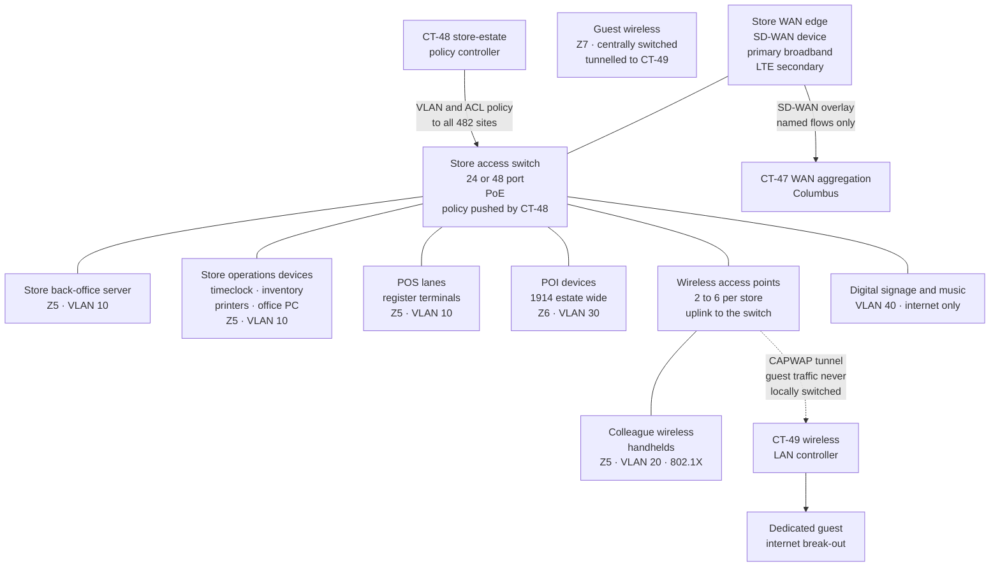

# 03.04 — Store Network Architecture

| Field | Value |
|---|---|
| Document ID | MRG-PCI-2026-304 |
| Program | Marketa Retail Group — PCI DSS v4.0.1 Compliance Program |
| Phase | 03 — Network Segmentation &amp; Architecture |
| Version | 1.0 |
| Status | Approved |
| Owner | Trevor Kim, Director of Infrastructure &amp; Network |
| Approver | Naomi Bhatt, Chief Information Security Officer |
| Date | 2026-07-15 |
| Classification | Confidential — Cardholder Data Environment // Illustrative Portfolio Sample |

## Purpose

Three of Marketa's nine zones live inside a shop. **Z5** is the store back-office network, **Z6** is the payment device VLAN the P2PE Instruction Manual specifies, and **Z7** is guest wireless. They are replicated 482 times, across 38 states, in buildings Marketa mostly does not own, maintained by field engineering and by local contractors, and carrying 74% of the company's transaction volume.

This document specifies how a Marketa store network is built: the standard topology, the VLAN plan, the WAN path back to Columbus, what the PIM requires of the point-of-interaction network path, and the operational constraint that governs every decision in the estate — **any change is a 482-fold rollout**.

It also records, in §5, the design decision that left one boundary inside the store enforced by a single layer of switch configuration, and the latent defect in the store build image that made that single layer fail. **03.07 reports what a penetration tester did with it.** This document exists to make that finding legible rather than surprising.

## 1. The Estate

| Attribute | Value |
|---|---|
| Stores | **482**, across 38 states |
| POS lanes | **1,914**, averaging 4.0 per store |
| Store back-office servers | **482** — one per store |
| Store-estate network appliances | **496** — switches, WAN edge devices and wireless access points beyond the one-per-store baseline |
| POI devices | **1,914**, all on the listed Verition P2PE solution |
| Store formats | Large format, standard, compact — differing in lane count, switch port count and access point count |
| Store colleagues | ≈29,600, plus up to 6,800 seasonal from October to January |
| Governing constraint | **CON-02** — 482 sites means every change, verification or visit is a 482-fold operation |
| Change freeze | **October to January**, under the seasonal trading freeze in the programme charter |

The estate is not exotic. It is a chain of ordinary shops with ordinary network equipment in the stockroom, and that is precisely what makes it the hardest part of the environment to assure. A data centre has two engineers, a change window and a console. A store has a stockroom, a locked cabinet, a colleague with a key, and a contractor who was there in November to replace a switch.

## 2. Standard Store Topology

Every store is built to one topology. Format differences change port counts and access point counts; they do not change the structure.

| Element | Standard build | Zone |
|---|---|---|
| WAN edge | SD-WAN device with a primary broadband circuit and an LTE secondary; overlay tunnels to two Columbus aggregation points | Boundary |
| Access switch | One 24-port or 48-port PoE switch by format; larger stores carry a second in a stack | Boundary enforcement inside the store |
| Store back-office server | One physical server running inventory, workforce, print and POS support services | **Z5** |
| POS registers | Lane terminals running the Verition POS application | **Z5** |
| POI devices | SRED-capable PIN pads on the listed P2PE solution, one to six per store | **Z6** |
| Access points | Two to six by format, broadcasting three SSIDs | Z5 for colleague, **Z7** for guest |
| Signage and music | Media players on an internet-only VLAN | Out of scope, VLAN 40 |

## 3. The VLAN Plan

The VLAN plan is the segmentation model inside a store. It is small, deliberately, because a plan an engineer can hold in their head is a plan an engineer can implement correctly at 3 a.m. in a stockroom in Reno.

| VLAN | Name | Zone | Membership | Gateway | Permitted destinations |
|---|---|---|---|---|---|
| **10** | Store operations | **Z5** | Store server, POS registers, timeclock, inventory devices, office PC, printers | Store switch SVI | Named Z3 services via the SD-WAN overlay; named vendor endpoints; **no general internet** |
| **20** | Colleague wireless | **Z5** | 802.1X-authenticated handhelds and colleague devices with a device certificate | Store switch SVI | Store server and named Z3 services only |
| **30** | **Payment devices** | **Z6** | POI devices only. Static port assignment; port security with a MAC limit of one | Store switch SVI, ACL-restricted | **The P2PE path only** — the Verition endpoints the PIM specifies, via the WAN edge. Nothing in VLAN 10 or 20 |
| **40** | Signage and media | Out of scope | Media players, music appliance | Store switch SVI | Internet only, through the WAN edge; no path to VLAN 10, 20 or 30 |
| **99** | Management | Boundary | Switch, WAN edge and access point management interfaces | Store switch SVI, ACL-restricted | CT-48, CT-49, CT-47 and the Z3 monitoring endpoints only |
| **999** | Black hole | — | Every unused switch port, administratively shut | None | None |
| **— (none)** | **Guest wireless** | **Z7** | **By design, guest wireless has no VLAN inside the store.** Guest traffic is bridged into a CAPWAP tunnel at the access point and terminated at CT-49 in Columbus, then handed to a dedicated internet break-out | Not local | Internet only |

The last row is the whole design intent of boundary **B-09**, and it is worth stating as a positive claim rather than as an absence:

> **Guest wireless traffic is not supposed to exist as a VLAN inside a Marketa store at all.** It enters the access point radio, is encapsulated immediately, and leaves the building inside a tunnel. There is no guest VLAN on the store switch, no guest SVI, no guest DHCP scope, and therefore nothing for inter-VLAN routing to route. The isolation is intended to be structural — principle **SP-3** — rather than a rule that denies traffic between two VLANs that both exist.

That is the design. §5 is about what happens when the deployment differs from it.

### 3.1 Inter-VLAN policy inside the store

The store switch performs inter-VLAN routing for VLANs 10, 20, 30, 40 and 99, with a VLAN access control list applied at each SVI. The intended matrix is small:

| From ↓ / To → | 10 Ops | 20 Colleague | 30 POI | 40 Media | 99 Mgmt | WAN |
|---|---|---|---|---|---|---|
| **10 Ops** | — | ✖ | ✖ | ✖ | ✖ | Named Z3 and vendor endpoints |
| **20 Colleague** | Store server, named ports | — | ✖ | ✖ | ✖ | Named Z3 endpoints |
| **30 POI** | ✖ | ✖ | — | ✖ | ✖ | **P2PE path only** |
| **40 Media** | ✖ | ✖ | ✖ | — | ✖ | Internet only |
| **99 Mgmt** | ✖ | ✖ | ✖ | ✖ | — | CT-47, CT-48, CT-49 |

Two properties of this matrix are load-bearing and both were verified across all 482 stores in Phase 02 by configuration analysis and NetFlow. **VLAN 30 reaches nothing inside the store** — the POI devices talk past the store entirely, to the Verition decryption environment, and condition **P2PE-C4** is that property. And **no VLAN reaches VLAN 10 from an untrusted position**, because the design says no untrusted VLAN exists inside the store.

The matrix has no row and no column for guest wireless. That is not an omission in this document. It is an accurate reproduction of the design, and it is the reason nothing in the store's ACL set denies guest-to-operations traffic: **you do not write a deny rule for a VLAN you have decided will never exist.**

## 4. The WAN Back to Columbus

| Element | Design |
|---|---|
| Transport | Two paths per store — a primary broadband circuit and an LTE secondary — with the overlay running across both |
| Overlay | SD-WAN tunnels from every store WAN edge to two aggregation points at Columbus, terminating on **CT-47** |
| Encryption | IPsec on every overlay tunnel; **4.2.1** applies to the store-to-corporate path because it traverses public networks |
| Policy | Per-flow policy at the overlay edge. A store may reach the named Z3 service endpoints in **NF-15**, the vendor endpoints for POI and estate telemetry, and nothing else. **No general internet egress from VLAN 10 or 20** |
| Anti-spoofing | Ingress filter on every store WAN interface at CT-47 permitting only that store's own address allocation, generated from IPAM CT-63 rather than hand-maintained — **1.4.3** |
| Addressing | Each store carries a distinct allocation from a contiguous supernet, so that a store's traffic is identifiable by address and a store can be isolated by a single prefix withdrawal |
| Isolation capability | **A store can be removed from the overlay in under five minutes from CT-47**, from Columbus, without a site visit. This is the containment control the segmentation test's remediation depended on |
| Boundary from Z5 to Z3 | **B-06**; from Z5 to external, **B-08** |

The last two rows matter more than they look. An estate of 482 sites needs a containment story that does not begin with a flight to Ohio. Marketa's is prefix-based: a compromised or suspect store is withdrawn from the overlay centrally, which severs its path to Z3 and to the vendor endpoints while leaving the local network running so the store can trade offline through the POS application's store-and-forward mode. That capability was exercised for real on 2026-05-15.

## 5. Guest Wireless Inside a Store — the Boundary That Failed

### 5.1 The decision that made the boundary single-layer

Principle **SP-3** says structural isolation before policy isolation. Inside a store, Marketa did not achieve structural isolation between Z7 and Z5, and the decision was made deliberately with the reasoning recorded.

| Option considered | What it would have meant | Why it was not adopted |
|---|---|---|
| **Physically separate switch fabric for guest wireless** | A second switch, second cabling run and second WAN circuit in each of 482 stockrooms, with its own power, its own management and its own lifecycle | Capital and operational cost across 482 sites; stockroom space and power are genuinely constrained in the compact format; a second unmanaged device in every store is its own risk |
| **Separate access points for guest wireless** | Dedicated guest radios cabled to a dedicated uplink | Halves the useful radio density or doubles the AP count; 482-fold installation; still shares the same switch unless the uplink is also separate |
| **Guest wireless delivered over a dedicated broadband circuit** | A second circuit per store terminating on a separate device | Recurring circuit cost across 482 sites; and the guest network would still terminate on the same access point hardware |
| **Adopted — centrally switched guest wireless over a CAPWAP tunnel** | Guest traffic is encapsulated at the access point and never exists as a local VLAN. Structural in effect, achieved in software | **Adopted.** Delivers the isolation property at no incremental hardware cost, and is centrally configurable across 482 sites from CT-49 |

The adopted option is a good design. It is worth saying so, because the failure that follows is not a failure of the design.

Its weakness is stated in one sentence and was stated in the design record before the test: **the isolation depends on two configuration properties holding simultaneously at every one of 482 sites — that the guest SSID remains centrally switched, and that the access point uplink port does not carry any VLAN it should not.** Neither property is structural. Both are configuration. Both are enforced by NSCs the store never sees and the store staff cannot inspect.

The residual risk was recorded in the design as follows, and is reproduced verbatim from the network design review of 2026-03-19:

> *"Guest isolation inside the store is single-layer. There is no second enforcement plane between the guest SSID and the store operations VLAN — if the SSID's switching mode or the AP uplink port configuration is wrong, there is nothing behind them. Mitigation is configuration assurance at CT-48 and CT-49 plus the 11.4.5 test. Accepted on that basis."*

That acceptance was correct in form — the risk was identified, mitigated as far as the architecture allowed, and pointed at the test. **It was also the thing that went wrong**, and the honest reading of the sequence is that the design review predicted the failure mode and the assurance layer did not catch it, because the assurance layer was configuration review and 03.01 §4 says what configuration review cannot see.

### 5.2 The store build image, and the trunk

Every store switch is provisioned from a **store build image** — a baseline configuration template held by the store-estate policy controller **CT-48** and applied at build, at rebuild, and at hardware replacement. The image defines the VLAN plan, the SVIs, the VLAN access control lists, port security, the management VLAN, and a set of **port role templates** that determine how each physical port is configured.

| Port role | Configuration | Applied to |
|---|---|---|
| `ROLE-SERVER` | Access port, VLAN 10, port security | Store server, office devices |
| `ROLE-LANE` | Access port, VLAN 10, port security, PoE | POS register |
| `ROLE-POI` | Access port, **VLAN 30**, port security with a MAC limit of one, VLAN ACL applied | POI device |
| `ROLE-MEDIA` | Access port, VLAN 40 | Signage and music |
| `ROLE-AP` | **Trunk port**, PoE, native VLAN 99 | Wireless access point uplink |
| `ROLE-UNUSED` | Administratively shut, VLAN 999 | Every unused port |

`ROLE-AP` is a trunk because the access point must carry two things over one cable: the colleague SSID's dynamically assigned VLAN 20 traffic, and its own management traffic on VLAN 99. A trunk is the correct construct.

**In store build image version SB-4.1, the `ROLE-AP` template was written without an allowed-VLAN list.**

| Property | SB-3.6 and earlier | **SB-4.1** |
|---|---|---|
| `ROLE-AP` port mode | Trunk | Trunk |
| Native VLAN | 99 | 99 |
| **Allowed VLAN list** | **Explicit — 20 and 99 only** | **Absent** |
| Effective behaviour | The port carries VLAN 20 and VLAN 99. Nothing else | **The port carries every VLAN defined on the switch** |
| Why the change was made | — | SB-4.1 reworked the wireless port roles to support a planned second colleague SSID. The allowed-VLAN list was removed during the rework and not restored. **A trunk with no allowed-VLAN list permits all VLANs, which is a platform default rather than a decision anybody made** |

SB-4.1 was released in **November 2024** and applied to stores as they were built, rebuilt or had their switch replaced. At the time of the May 2026 penetration test it was the running image at **37 of 482 stores**.

At the remaining 445 stores the earlier image's explicit allowed-VLAN list was still in place. This is why the defect is described as latent rather than as estate-wide, and why the population is 37 rather than 482 or 1.

### 5.3 Why a latent defect at 37 stores became a live path at one

A permissive trunk on the access point uplink is a precondition, not an exploit. For guest wireless to reach the store operations VLAN, a second thing has to be true: **the guest traffic has to be locally switched onto a VLAN that exists on the store switch.** While the guest SSID stays centrally switched, guest frames are encapsulated at the access point and never appear on the trunk as guest frames at all — so a permissive trunk carries nothing to exploit.

| Precondition | Present at | Source |
|---|---|---|
| **P1** — `ROLE-AP` trunk with no allowed-VLAN list | **37 stores** | Store build image **SB-4.1**, a central platform change |
| **P2** — guest SSID configured for **local switching** rather than central switching | **1 store** | A local change made at a single site |
| **Both P1 and P2 together** | **1 store — 0417, Dayton, Ohio** | — |

The second precondition arrived at store 0417 in **September 2025**. The store had a persistent guest wireless performance complaint — the CAPWAP tunnel back to Columbus was adding latency over a congested local circuit — and a field engineer resolved it by switching that store's guest SSID from central switching to **local switching** at CT-49. That change did exactly what it was meant to do: guest traffic stopped traversing the WAN and broke out locally. It also did something nobody considered: it created a guest VLAN inside the store, on a switch whose access point trunk permitted every VLAN, in a fabric that performs inter-VLAN routing and has no access control list denying guest-to-operations traffic because the design said the guest VLAN would never exist.

Three ordinary decisions, each defensible on its own terms, composing into a path:

| Decision | Made by | Individually reasonable? |
|---|---|---|
| Make `ROLE-AP` a trunk | Network engineering, 2019 | Yes. The access point needs two VLANs over one cable |
| Remove the allowed-VLAN list during the SB-4.1 rework | Platform engineering, November 2024 | **No — this is the defect.** But it produced no symptom and broke nothing |
| Move store 0417's guest SSID to local switching to fix latency | Field engineering, September 2025 | Yes, on its own terms. It was a performance fix on a network classified as untrusted and therefore not treated as a segmentation change |

None of the three was reviewed as a segmentation change, because Marketa's change classification in **1.2.2** did not, at the time, list "change to a trunk allowed-VLAN list", "change to an SSID switching mode" or "store build image revision affecting network configuration" as segmentation-affecting. **All three were added to the classification list in June 2026** — 03.03 §4.1 — and their addition is a direct consequence of the test.

> **Nothing about this is exotic.** There is no zero-day, no sophisticated adversary and no insider. There is a template that lost a line, a helpful engineer fixing a latency complaint, and a change process that did not recognise either as a boundary event. That is what a real segmentation failure looks like, and it is why 11.4.5 exists as a test rather than as a review.

## 6. What the PIM Requires of the POI Network Path

The Verition **P2PE Instruction Manual version 4.2** is what converts a validated solution into a validated deployment. Its network requirements are the reason Z6 exists as a separate zone rather than as a set of ports in Z5.

| PIM requirement | Marketa's implementation | Verification |
|---|---|---|
| POI devices connect only through the network path the PIM specifies — **PIM-05** | VLAN 30 with the `ROLE-POI` port template; static port assignment; port security with a MAC limit of one | Configuration analysis across all 482 stores, plus NetFlow analysis of POI-sourced traffic against expected destinations. Quarterly and on any store network change |
| The POI network path reaches the solution's endpoints and nothing else | VLAN ACL at the VLAN 30 SVI permitting the Verition endpoints via the WAN edge; explicit deny to VLANs 10, 20, 40 and 99 | Configuration extract; flow analysis |
| No general-purpose device shares the POI network path | Port security, MAC limit of one, and the port role template. A device that is not a POI cannot obtain an address on VLAN 30 | Port-role assertion in the daily drift check |
| Device inventory and chain of custody maintained | **9.5.1.1** register, reconciled to Verition telemetry across all 1,914 devices | Monthly reconciliation |
| Deviation from the specified path suspends the reduction for the affected store | Three stores were found in this position on 2026-02-06 and **recorded as in scope until corrected** on 2026-02-15 | 02.04 §9.1 |

The three stores in 02.04 §9.1 are worth revisiting here for what they demonstrate about the estate rather than about the finding. In each case a local contractor replaced a failed switch and re-patched the POI into the general data VLAN, because the replacement switch did not have the build image and the contractor patched by cable colour. The encryption was unaffected — the SRED function does not care which VLAN carries the ciphertext — but the basis of the scope claim was. **The store estate's failure mode is not attack. It is entropy.**

That is also the reason condition **P2PE-C4** is verified quarterly and on change rather than annually, and the reason the daily drift check in 03.03 §7 now includes port-role assertion at every store.

## 7. The 482× Problem

Constraint **CON-02** governs the store estate absolutely, and principle **SP-9** is its answer: no store control is adopted unless it can be deployed, verified and rolled back centrally, with per-site evidence.

| Operation | At one site | At 482 sites | Consequence for design |
|---|---|---|---|
| Push a configuration change | Minutes | Minutes, from CT-48 — **or months, if it needs a visit** | Everything is centrally pushed or it does not happen |
| Verify a configuration change | Read the running configuration | 482 running configurations, compared against intent, daily | Verification must be automated and assertive, not sampled and reported |
| Replace a switch | An engineer, an hour | 482 engineer-days plus travel, scheduled around trading | Hardware refresh is a multi-quarter programme, which is why NSC-EX-01 exists |
| Roll back a bad change | Restore the previous configuration | **A bad push reaches 482 stores simultaneously** | Staged rollout waves, and a tested rollback, are mandatory for any CT-48 change |
| Investigate an anomaly at one site | Log in and look | Find the site first | Per-store telemetry with per-store identity, and prefix-based isolation |
| Trading impact of an error | One store cannot sell | **482 stores cannot sell** | CT-48 is the highest-leverage component in the assessed inventory, and 02.08 §12 says so |

Marketa's rollout discipline for any store network change:

| Wave | Stores | Soak | Gate to proceed |
|---|---|---|---|
| **W0 — lab** | 0, a reference store build in the Columbus lab | 5 working days | Functional and boundary test pass |
| **W1 — pilot** | 4, one per store format plus one compact | 10 trading days | Zero incidents; drift check clean; boundary verification pass |
| **W2 — regional** | 48, one region | 10 trading days | Zero incidents; drift check clean across all 48 |
| **W3 — estate** | The remaining 430, in nightly tranches of 60 | — | Rollback available for 30 days |

**Store build image SB-4.1 went through all four waves and passed every gate**, because the gates tested whether the store worked and whether the intended flows flowed. None of them tested whether a flow that should have been impossible was now possible. The gates now include a boundary verification step that attempts to reach VLAN 10 from a client on each SSID — the check the waves did not have, added in June 2026 as part of the remediation in 03.08.

The seasonal change freeze compounds all of this. From October to January the estate is frozen: no store network changes except emergency fixes, on the busiest trading quarter of the year. A defect introduced in November 2024, as SB-4.1 was, sits through a freeze before anybody looks at it again — and a remediation that misses the freeze waits until February.

## 8. Store Network Monitoring

| Control | Implementation | Cadence |
|---|---|---|
| Configuration drift — running versus intended | Full running configuration retrieved from every store switch, WAN edge and access point and compared against the CT-48 intended policy | **Daily, all 482 stores** — new in this phase |
| Port-role assertion | Every port's role compared against the expected role for that store's layout; unexpected trunks flagged | **Daily** — new in this phase |
| Trunk allowed-VLAN assertion | Every trunk port asserted to have a non-empty explicit allowed-VLAN list, and that list compared against the expected set | **Daily** — new in this phase, and the specific control that would have found SB-4.1 |
| SSID switching-mode assertion | Every guest SSID at every site asserted to be centrally switched | **Daily** — new in this phase |
| Flow telemetry | NetFlow from every store WAN edge, analysed for unexpected source VLANs, unexpected destinations and volume anomalies | Continuous |
| Rogue access point detection | **11.2.1** quarterly scanning, plus continuous over-the-air monitoring from the store access points — 03.06 §5 | Quarterly and continuous |
| Authenticated vulnerability scanning | CT-31 against the store estate; incomplete on the 9 vendor-locked appliances under **CON-03** | Quarterly |
| Segmentation testing | **11.4.5**, by Ironwood Security Labs, with the store estate as a primary target | At least annually and after change |

Four of these eight controls did not exist before this phase, and three of the four exist because of the finding in 03.07. The programme records that sequence rather than presenting the monitoring set as though it had always been the design: **the trunk assertion is the control that would have found SB-4.1 in November 2024, and Marketa did not have it until June 2026.**

## Cross-References

| Reference | Relevance |
|---|---|
| 02.04 — Card-Present Channel Scope | P2PE, the PIM control checklist, conditions P2PE-C1 to P2PE-C9, and the three stores with a non-conforming POI path |
| 02.07 — Data Flows &amp; Network Reachability | Zones Z5, Z6 and Z7 as defined; flow F-01; finding RCH-04 |
| 02.08 — Connected-To &amp; Security-Impacting Systems | CT-47, CT-48 and CT-49; why CT-48 is the highest-leverage component in the inventory |
| ADR-0006 — Store Estate Classification | The classification this architecture supports, and its contingency on the 11.4.5 test |
| 03.01 — Segmentation Strategy &amp; Principles | Principles SP-3 and SP-9, and the stakes of the Z5 boundary |
| 03.02 — Nine-Zone Architecture | Boundaries B-06 to B-09 |
| 03.03 — Network Security Control Standards | Standard NSC-13; the four change classifications added in June 2026; daily drift detection under 1.2.8 |
| 03.06 — Wireless Security | CT-49, the SSID design, 11.2.1 detection and the 214 legacy PSK devices |
| 03.07 — Segmentation Penetration Test | The attack path built on preconditions P1 and P2 |

---
[⬅ Previous](03.03-network-security-control-standards.md) · [🏠 Phase 03 Home](03.00-README.md) · [Next ➡](03.05-cloud-segmentation.md)
