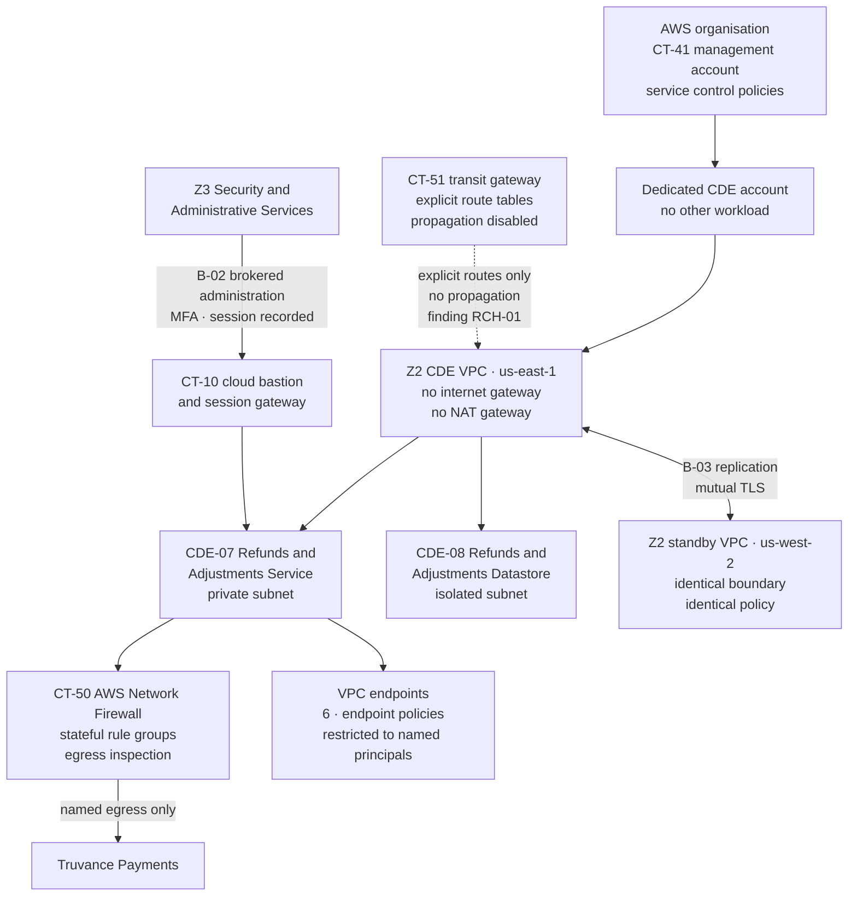

# 03.05 — Cloud Segmentation

| Field | Value |
|---|---|
| Document ID | MRG-PCI-2026-305 |
| Program | Marketa Retail Group — PCI DSS v4.0.1 Compliance Program |
| Phase | 03 — Network Segmentation &amp; Architecture |
| Version | 1.0 |
| Status | Approved |
| Owner | Trevor Kim, Director of Infrastructure &amp; Network |
| Approver | Naomi Bhatt, Chief Information Security Officer |
| Date | 2026-07-15 |
| Classification | Confidential — Cardholder Data Environment // Illustrative Portfolio Sample |

## Purpose

Two of Marketa's nine zones are in AWS and they are not the same kind of problem.

**Z2** is a cardholder data environment: two assessed components, **CDE-07** and **CDE-08**, running refunds and adjustments in a dedicated AWS account and a dedicated VPC, us-east-1 primary with a us-west-2 standby. It is small, tightly held and heavily controlled.

**Z8** is the e-commerce platform: **246 AWS workloads** serving the storefront, catalogue, search, content and order capture, of which a six-component subset — CT-52 to CT-55 and the pipeline that builds them — is connected-to because it can change what executes in a consumer's browser on a payment page.

This document specifies the segmentation between them, between each of them and everything else, and the evidence model that supports the claim. It is also the document that says why **cloud segmentation is harder to prove than physical segmentation**, which is a statement about evidence rather than about security, and which is why finding **RCH-01** existed for a year without anybody noticing.

## 1. The Two Cloud Zones

| Attribute | **Z2 — CDE Cloud** | **Z8 — E-Commerce Platform** |
|---|---|---|
| AWS account | A dedicated account holding nothing else | Two accounts — production and non-production |
| Region | us-east-1 primary; **us-west-2 standby** | us-east-1 primary; us-west-2 for content and failover |
| VPC | One dedicated VPC per region | Multiple VPCs by tier |
| Assessed components | **CDE-07, CDE-08** plus 9 connected-to components | 6 connected-to components — CT-52 to CT-55, plus CT-53's pipeline and CT-51 |
| Workloads | Two, plus their managed dependencies | **246** |
| Internet gateway | **None. There is no internet gateway attached to the CDE VPC in either region** | Yes, behind an edge and a load balancing tier |
| Account data | Tokens, last four, refund state, approval codes. No full PAN | **None.** The PAN posts from the consumer browser to Truvance's origin and never touches a Marketa origin |
| Trust level | **T1** | T3, with a T2 subset |
| Zone owner | Elena Marchetti | Sonia Rendell |

The asymmetry is the point. Z2 is a small environment that must be provably isolated. Z8 is a large environment that must be provably unable to reach the small one. Those are different engineering problems and they get different controls.

## 2. Z2 — The CDE VPC

| Design element | Decision | Reason |
|---|---|---|
| **Account isolation** | The CDE runs in an AWS account containing nothing else | An account is the strongest isolation boundary AWS offers. IAM policy, service quotas, service control policies and billing all follow the account, and a blast radius that stops at an account boundary is a blast radius somebody can describe |
| **No internet gateway** | Neither the primary nor the standby VPC has an internet gateway or a NAT gateway attached | **SP-3 — structural before policy.** The VPC cannot route to the internet because there is nothing to route through. This is the cloud equivalent of not having a cable, and it is the strongest control in the design |
| **Private and isolated subnets** | CDE-07 in a private subnet; CDE-08 in an isolated subnet with no route to anything except the application subnet and the endpoint subnet | Tiering inside the VPC, so that a compromise of the application tier does not deliver the data tier by routing |
| **Egress through inspection** | All egress traverses **CT-50**, AWS Network Firewall, with stateful rule groups limiting destinations to the Truvance endpoints and the Z3 service endpoints | 1.3.2 outbound restriction. The exfiltration path is named, inspected and logged |
| **VPC endpoints** | Six interface and gateway endpoints for the AWS services Z2 consumes, each with an endpoint policy restricting the principals and actions permitted | Consuming AWS services without egress to the public service endpoints, and without a NAT gateway |
| **Administrative entry** | Only through **CT-10**, the cloud bastion and session gateway, brokered by CT-11, with MFA under 8.4.2 and session recording | The cloud analogue of the jump-host model that keeps ~1,100 laptops out of scope |
| **Key administration** | Customer-managed keys with key policy under **CT-15**, subject to the full 3.6 and 3.7 key-management set | Whoever controls key policy controls decryption. The keys protect account data; the requirements follow the keys |
| **Standby region** | us-west-2 carries an identical VPC, identical boundary policy, identical firewall rule groups, deployed from the same infrastructure-as-code definition | A DR environment is not a lesser environment. §8 |

## 3. Security Groups, NACLs and Network Firewall

Three AWS constructs enforce network policy and they are not interchangeable. Marketa's standard states which does what, because the commonest cloud segmentation error is treating a security group as though it were a firewall.

| Property | **Security group** | **Network ACL** | **AWS Network Firewall** |
|---|---|---|---|
| Scope | Elastic network interface | Subnet | VPC, via a firewall endpoint in a dedicated subnet |
| State | Stateful — a permitted outbound gets its response back automatically | **Stateless — return traffic needs its own rule** | Stateful, with deep inspection |
| Rules | Allow only. There is no deny rule | Allow **and deny**, evaluated in order | Allow, deny, alert; domain lists; protocol inspection; Suricata-compatible signatures |
| Default | Deny inbound, **allow all outbound** | Default NACL allows everything | Deny by default in Marketa's configuration |
| Can reference | Other security groups, prefix lists | CIDR only | CIDR, domain, protocol, application-layer content |
| Visibility of what it blocked | **None natively** — a security group produces no deny log | Flow logs show rejects | Full alert and flow logging |
| Marketa's use | The instance-level layer at every Z2 interface. **Outbound explicitly restricted, because the default is to allow all outbound and that default is a 1.3.2 failure** | The subnet-level layer, with an explicit deny at the end of each list, and an explicit deny of the Z8 supernet in the CDE VPC's lists | **The boundary.** All Z2 egress and all inter-VPC traffic traverses it; the stateful rule groups implement the named-flow register |
| Enforcement layer under 03.02 §4.1 | Layer 2 of 3 | Layer 1 of 3 | Layer 3 of 3, with IAM as the fourth |

Three positions in that table are Marketa standards rather than descriptions.

**Outbound is explicitly restricted on every security group in Z2.** AWS's default outbound rule permits all traffic to `0.0.0.0/0`. Leaving it in place while claiming compliance with 1.3.2 is one of the most common defects in a cloud CDE, and it is invisible in a review that only reads inbound rules.

**Network ACLs carry an explicit deny of the Z8 address space in the CDE VPC**, even though no route to Z8 exists. It is a redundant control by design: if a route were ever created — which is precisely what finding **RCH-01** was — the NACL would still deny, and the deny would appear in the flow logs as a reject with an obvious signature. **RCH-01 was harmless in practice because a security group happened to be restrictive.** Marketa did not want the next one to depend on a happenstance, so the deny is now explicit at a layer nobody edits during routine work.

**A security group produces no deny log.** This is the single most consequential operational difference between a security group and a firewall, and it means that in a security-group-only design, an attempted lateral movement leaves no record. Marketa's answer is VPC Flow Logs capturing **both accepted and rejected** flows, which is the only place the rejects appear.

## 4. The Shared Responsibility Boundary

| Layer | AWS | Marketa | Assessed by the QSA as |
|---|---|---|---|
| Physical facilities, hardware, hypervisor, network fabric | **AWS** | Nothing | AWS's responsibility, evidenced by AWS's own PCI DSS attestation — **E3** evidence under 02.01 §5 |
| Managed service platform — the database engine behind CDE-08, the container runtime | **AWS** for the platform | **Marketa** for its configuration, encryption settings, access policy and logging | Shared. Marketa evidences its side |
| VPC, subnets, route tables, security groups, NACLs, firewall policy | Nothing | **Marketa, entirely** | **Marketa's, in full.** This is the segmentation control set |
| IAM principals, policies, roles, trust relationships | Nothing | **Marketa, entirely** | Marketa's, in full — and under **SP-6** it is a segmentation control |
| Data, keys, key policy | Nothing | **Marketa** | Marketa's, in full |
| Logging configuration and retention | Platform capability | **Marketa** must enable, configure, protect and retain | Marketa's, in full |

Two things must be said plainly about the top row, because merchants get both wrong.

**AWS's attestation evidences AWS's environment and says nothing about Marketa's.** It is **E3** evidence: high for the provider, nil for the customer. It does not make a Marketa VPC compliant, it does not reduce Marketa's scope, and it cannot be offered in place of Marketa's own configuration evidence. AWS is recorded in the TPSP register and reviewed under **12.8.4** like any other provider.

**Everything above the hypervisor is Marketa's.** Every segmentation control in Z2 — the absent internet gateway, the route tables, the security groups, the NACLs, the firewall policy, the endpoint policies, the IAM boundary — is configured by Marketa, changed by Marketa, and is Marketa's to evidence and to have tested under **11.4.5**. There is no part of the cloud segmentation claim that AWS's compliance supports.

## 5. Peering, Transit and the RCH-01 Lesson

| Connectivity construct | Marketa's position | Reason |
|---|---|---|
| **VPC peering into Z2** | **None.** No peering connection terminates on a CDE VPC in either region | Peering is a full routing adjacency with no inspection point. There is nowhere to put a firewall |
| **Transit gateway attachment for Z2** | One, per region, with an **explicit route table containing only named destinations** and **route propagation disabled** | Propagation is the default and the default is wrong for a CDE. RCH-01 was propagation doing exactly what propagation does |
| Transit gateway attachment for Z8 | Yes, in a separate route table that has no route to the Z2 CIDR | Route table separation is the structural control; the NACL deny and the firewall policy are the second and third |
| PrivateLink into Z2 | Two services, both consumed rather than offered, with endpoint policies restricted to named principals | PrivateLink is a unidirectional, service-scoped path with no routing adjacency. It is preferred over peering for exactly that reason |
| Cross-account resource access | Three trusts existed; one removed as unused; two retained, documented and reviewed | A cross-account trust is a reachability path that appears in no route table |
| Direct Connect or VPN to on-premises | One IPsec path per region carrying **B-03** replication and **B-02** administration, terminating on CT-50 | Named flows only; the tunnel is not a general routing adjacency |

Finding **RCH-01** deserves its own paragraph because it is the canonical cloud segmentation failure and it was found by analysis rather than by test.

A transit gateway attachment created during a 2025 platform migration had **route propagation enabled by default**. That propagated a route from Z8 into the Z2 route table, giving the 246-workload e-commerce platform a routed path to the cardholder data environment. Nothing broke, because the Z2 security groups happened to be restrictive enough that no connection succeeded. Nobody noticed, because a route table entry generates no alert, no log and no symptom. The path existed for approximately a year.

> **The finding was not exploitable and it was not safe.** A single permissive security-group change — one line, by an engineer with legitimate access, solving a legitimate problem — would have converted a latent route into a live path from the storefront to the CDE. Marketa's remediation was not to remove the route; it was to disable propagation, replace it with an explicit route table, add the NACL deny, and treat route-table changes as segmentation-affecting under 1.2.2. **The pattern is identical to the store trunk in 03.04 §5: a default that nobody chose, a precondition sitting harmlessly until a second ordinary change makes it live.**

## 6. Identity as a Segmentation Control

This is the section with no on-premises analogue and it is the one most often missing from a merchant's cloud segmentation position.

> **A security group means nothing if an IAM principal can rewrite it.** In a data centre, an attacker who wants to change a firewall rule must reach the firewall's management interface, which is on a management VLAN, behind an access control list, through a jump host, with MFA. In AWS, an attacker who holds a principal with `ec2:AuthorizeSecurityGroupIngress` changes the boundary with one API call, from anywhere on the internet, against a control plane that is public by design.

Marketa therefore computes reachability over **identity paths as well as network paths** — 02.07 §4.2 — and governs the ability to change a boundary as tightly as the ability to cross one.

| Control | Implementation |
|---|---|
| **Who can change the Z2 boundary** | Analysis across the AWS organisation identified **14 principals** able to modify Z2 network configuration from anywhere. **Reduced to 5**, all human, all federated through CT-07, all requiring MFA under 8.4.2, all brokered through CT-11 with session recording |
| **Service control policies** | The organisation management account **CT-41** applies SCPs to the CDE account denying: detachment or creation of an internet gateway, creation of a peering connection, disabling of CloudTrail or flow logs, deletion of a firewall policy, and modification of the CDE key policy — **for every principal, including the account root** |
| **Permission boundaries** | Every role that can create roles in the CDE account carries a permission boundary preventing privilege escalation through role creation |
| **Console change denial** | Boundary resources in Z2 are managed exclusively through the **CT-30** infrastructure-as-code pipeline. Manual console or CLI modification of a boundary resource is denied by SCP; a change that must be made by hand requires a break-glass procedure with dual authorisation and a post-hoc reconciliation |
| **Cross-account trust review** | Every trust policy naming an external principal reviewed six-monthly on the 1.2.7 cycle |
| **Workload identity** | Instance and task roles scoped to named resources and actions; no long-lived access keys in Z2; **8.6.1 to 8.6.3** application and system account governance applies |
| **Federation** | No IAM users with console access in the CDE account. Human access is federated through CT-07 from the corporate identity provider, which is why CT-07 is a connected-to component |

The reduction from 14 principals to 5 is the single most valuable segmentation change made in the cloud environment this phase, and it is invisible in every network diagram Marketa produces. That is worth stating explicitly, because it is the reason the 1.2.3 diagram is necessary and not sufficient: **the diagram shows the boundary; it does not show who can move it.**

CT-41 is in the assessed inventory on this basis alone. It has no route to Z2, holds no account data, and can alter Z2's network configuration, service boundaries and key policy from outside it.

## 7. Evidence — CloudTrail and Flow Logs

In a data centre, the evidence of last resort is a packet capture: a physical tap on a physical wire, producing a record nobody's configuration can suppress. **In AWS there is no wire.** The evidence of last resort is the platform's own logging, which means it is a control that must be configured, protected and monitored like any other — and which an attacker with sufficient privilege can turn off.

| Evidence source | Configuration | What it evidences | Protection |
|---|---|---|---|
| **CloudTrail** | Organisation-wide trail, all regions, management and data events for the CDE account, delivered to a dedicated log account and forwarded to CT-18 | Every API call that created, changed or deleted a boundary resource, with the principal, source IP, time and result | **Log file validation enabled**; delivery to an account no CDE principal can write to; deletion denied by SCP; absence of the trail alerted as a **10.7.2** control failure |
| **VPC Flow Logs** | Both VPCs, both regions, **all traffic — accepted and rejected** — at VPC level, delivered to the log account and forwarded to CT-18 | What actually traversed the boundary, including the rejects that a security group would otherwise record nowhere | As above |
| **Network Firewall alert and flow logs** | Full logging from CT-50 | Application-layer visibility on egress; the named-flow register verified against observed behaviour | As above |
| **Config and posture** | Continuous configuration recording, with rules asserting the boundary properties, monitored by CT-33 | Drift in a boundary resource, detected within minutes | Findings to CT-18 |
| **IaC plan-diff** | Continuous comparison of the CT-30 definition against deployed state | Divergence between the declared boundary and the deployed boundary — the cloud equivalent of the 1.2.8 drift check | Pipeline records |
| **DNS query logging** | Resolver query logs for both VPCs | Egress attempts by name, including to destinations the firewall denied | As above |

The **10.7.2** obligation applies to all six. A logging source that stops is a critical security control failure and must be detected, alerted and responded to promptly — which in a cloud environment is not a theoretical concern, because disabling logging is a documented first step in the attack pattern the logs exist to detect.

## 8. The Standby Region

| Property | Position |
|---|---|
| What us-west-2 holds | An identical Z2 VPC, identical boundary policy, identical firewall rule groups, an identical key hierarchy, and a standby copy of CDE-07 and CDE-08 |
| Scope | **In scope, fully.** A standby CDE is a CDE. It holds the same data classes and is reachable by the same administrative paths |
| Deployment | From the same CT-30 infrastructure-as-code definition, with region as a parameter. There is no separately maintained DR configuration |
| Testing | Included in the **11.4.5** scope. A DR boundary tested only in the primary region is an untested boundary |
| Failover as a change | A regional failover is a segmentation-affecting change under 03.03 §4.1 and carries a post-failover boundary verification |

The single-definition rule is the important one. The classic DR segmentation failure is a standby environment built once, by hand, during a project, and then diverging quietly for years — so that the environment the business fails over to during its worst week is the one nobody has configuration-managed. Marketa's standby cannot diverge without the plan-diff detecting it, because it is the same code.

## 9. Why Cloud Segmentation Is Harder to Prove

The controls are not weaker. The **evidence** is harder, and a merchant who does not understand why will produce a cloud segmentation position that looks complete and proves nothing.

| Difficulty | Physical estate | Cloud estate | What Marketa does about it |
|---|---|---|---|
| **There is no wire** | A tap on a span port produces ground truth nobody can suppress | The only record is the platform's own logging, which is a configured control | Log file validation; delivery to an account no CDE principal can write to; deletion denied by SCP; **10.7.2** alerting on absence |
| **The control plane is public** | The firewall management interface is on a management VLAN behind a jump host | The AWS API is reachable from the internet by design, for anyone holding a valid credential | SP-6: identity treated as a segmentation control; 5 principals; MFA; SCPs; console change denial |
| **The boundary is an API call away** | Changing a boundary means reaching a device | Changing a boundary means one authorised call, completing in under a second, with no outage and no symptom | IaC-only boundary management; continuous plan-diff; boundary changes classified as segmentation-affecting with automatic re-test triggers |
| **Defaults are permissive** | A new firewall denies everything until configured | A new security group allows all outbound; a new transit gateway attachment propagates routes; a default NACL allows everything | Explicit standards for each default; assertion rules in CT-33; the RCH-01 remediation |
| **Reachability is not only network reachability** | Reachability is a routing question | A principal with the right permission has reachability to everything a control protects, from anywhere | Identity-path reachability computation; the 14-to-5 reduction |
| **Trust is implicit and nested** | A trust relationship is a configured tunnel | Service-linked roles, resource policies, endpoint policies, cross-account trusts, organisation policy inheritance | Full trust-policy analysis; endpoint policies scoped to named principals; six-monthly review |
| **Resources are ephemeral** | A server tested in May is the server assessed in November | A task lives for minutes. The instance a tester probed may not exist an hour later | Test the **boundary and the definition**, not the instance. Evidence is drawn from the IaC definition plus flow logs plus configuration recording, not from a point-in-time host list |
| **The tester's position is ambiguous** | "Inside Z7" means a laptop on a store's guest Wi-Fi | "Inside Z8" means a workload identity, a subnet, a role and a set of resource policies — all of which must be specified before a test result means anything | The 11.4.5 rules of engagement in 03.07 §3 specify cloud starting positions as **identity plus network position**, not as an IP address |
| **Provider testing constraints** | Test whatever is yours | Some categories of testing against a provider's infrastructure are constrained by the provider's policies | Scope agreed with Ironwood against the provider's customer testing policy; constraints recorded in the report's limitations section rather than left implicit |

> **Cloud segmentation is provable. It is provable through different artefacts than physical segmentation, and a merchant who tries to prove it with a network diagram and a security group export will produce something that satisfies a reader and would not survive a tester.** Marketa's cloud evidence set is the IaC definition, the deployed-state diff, the identity-path analysis, the flow logs including rejects, the CloudTrail record of who could have changed the boundary, and the 11.4.5 test result. Five of those six have no on-premises equivalent.

## 10. Cloud Segmentation Test Results

The 11.4.5 test covered both cloud zones, in both regions, from six Z8 starting positions including a compromised workload identity and a compromised build-pipeline role, plus three attempted identity-path escalations toward boundary-modifying permissions. **The cloud result was PASS** — no unauthorised path to Z2 by any network or identity route, no egress from Z2 except to named destinations, and the RCH-01 remediation verified by test rather than by configuration. The full boundary-by-boundary result set is in 03.07 §10.

The cloud environment passed. The store environment did not, and the contrast is instructive rather than reassuring: **the cloud boundary was harder to prove and easier to hold, because it is defined in code, deployed from one definition, and monitored continuously. The store boundary was easier to describe and harder to hold, because it is deployed 482 times into buildings, by people, using cables.**

## Cross-References

| Reference | Relevance |
|---|---|
| 02.05 — E-Commerce Channel Scope | Why 246 workloads are out of the CDE and the payment pages are still in scope for 6.4.3 and 11.6.1 |
| 02.07 — Data Flows &amp; Network Reachability | The AWS flow-log analysis, the IAM reachability position, and finding RCH-01 |
| 02.08 — Connected-To &amp; Security-Impacting Systems | CT-07, CT-10, CT-15, CT-28, CT-30, CT-32, CT-33, CT-36, CT-40, CT-41, CT-50, CT-51 |
| 02.09 — Assessed System Component Inventory | CDE-07 and CDE-08 |
| 03.01 — Segmentation Strategy &amp; Principles | Principles SP-3, SP-5, SP-6 and SP-7 |
| 03.02 — Nine-Zone Architecture | Boundaries B-02, B-03, B-10, B-13 and B-15 |
| 03.03 — Network Security Control Standards | The NSC standards applied to CT-50, CT-51, CT-30 and CT-41 |
| 03.07 — Segmentation Penetration Test | The cloud rules of engagement and the full result set |
| Phase 06 — Monitoring, Testing &amp; Third Parties | Requirement 12.8 assurance over AWS as a provider, and the 10.7.2 monitoring of the log sources |

---
[⬅ Previous](03.04-store-network-architecture.md) · [🏠 Phase 03 Home](03.00-README.md) · [Next ➡](03.06-wireless-security.md)
