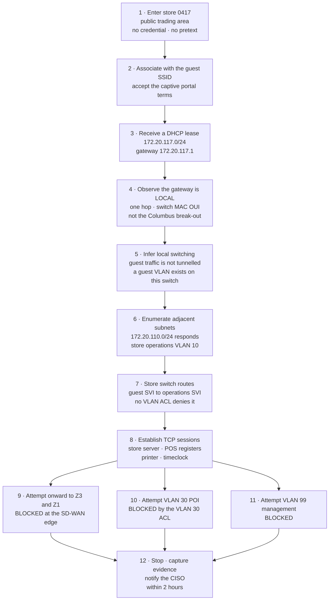

# 03.07 — Segmentation Penetration Test

| Field | Value |
|---|---|
| Document ID | MRG-PCI-2026-307 |
| Program | Marketa Retail Group — PCI DSS v4.0.1 Compliance Program |
| Phase | 03 — Network Segmentation &amp; Architecture |
| Version | 1.0 |
| Status | Approved |
| Owner | Naomi Bhatt, Chief Information Security Officer |
| Approver | Raymond Voss, Chief Financial Officer |
| Date | 2026-07-15 |
| Classification | Confidential — Cardholder Data Environment // Illustrative Portfolio Sample |

## Purpose

This document records the **11.4.5** segmentation penetration test performed by **Ironwood Security Labs** in May 2026, the finding it produced, and the consequences of that finding for Marketa's scope determination.

**The test failed.**

Everything else in this document is detail. The detail matters — what was tested, from where, what was proved, what was not proved, and what happened next — but the headline is not softened, buried or qualified, and the programme's position is that the failure is the most valuable single output of the phase.

## 1. Result

| Field | Value |
|---|---|
| Requirement | **11.4.5** — penetration testing on segmentation controls and methods |
| Tester | **Ironwood Security Labs** |
| Engagement reference | IWSL-MRG-2026-SEG-01 |
| Fieldwork | 2026-05-11 to 2026-05-22 |
| **Critical finding demonstrated** | **2026-05-15** |
| Report issued | 2026-05-29 |
| Findings | **8** — 1 Critical, 2 High, 3 Medium, 2 Low |
| **Test result** | **FAIL** |
| Failed boundary | **B-09** — store guest wireless (Z7) to store back-office (Z5) |
| Consequence | Phase 02 scope determination **provisionally suspended** for the store estate; **risk R-14 raised** under ADR-0005; **ADR-0006 classification collapsed** pending remediation and re-test |
| Re-test | 2026-06; reported in 03.08 |

> **A store back-office VLAN was reachable from the store guest wireless VLAN through a misconfigured trunk port.** Nineteen minutes after walking into a Marketa store as an ordinary member of the public, with no credential, no pretext and no social engineering, Ironwood's tester had established TCP sessions to services on the store back-office network — the network that 482 store servers occupy and that ADR-0006 classifies as out of the cardholder data environment on the strength of exactly that boundary.
>
> The tester did **not** reach the cardholder data environment. No account data was accessed, exposed or at risk at any point. That is the accurate statement of what happened and it is not a mitigation, because the classification that keeps 482 servers out of scope does not depend on whether Z7 can reach the CDE. **It depends on whether Z7 can reach Z5, and it could.**

## 2. Why This Test Exists

Marketa uses segmentation to reduce the scope of its assessment. **Segmentation is not a PCI DSS requirement** — it is an optional method of scope reduction, and an entity that does not use it owes nothing under 11.4.5. An entity that does use it owes the test, and owes it on the standard's terms rather than on its own.

| Obligation under 11.4.5 | Marketa's discharge |
|---|---|
| Perform penetration testing on segmentation controls and methods | This engagement |
| **At least once every twelve months and after any changes** to segmentation controls or methods | Annual baseline established here; change-triggered re-tests governed by the classification list in 03.03 §4.1 |
| Cover all segmentation controls and methods in use | All nine group **G10** components; all fifteen boundaries in 03.02 §4; both cloud regions |
| Verify that the segmentation methods are **operational and effective** and isolate all out-of-scope systems from systems in the CDE | The methodology in §4 — attempt to reach the CDE from every out-of-scope zone |
| Performed by a **qualified internal resource or qualified external third party**, with **organisational independence** | Ironwood Security Labs — external, independent of Marketa and of the design and build teams, and independent of the QSA. Independence documented in the engagement letter |
| Follow the 11.4.1 methodology | Documented methodology covering scope, testing from inside and outside the network, application- and network-layer testing, and retention of results and remediation activities for twelve months |

**11.4.6** shortens the cadence to six months. It is a **service provider** requirement. Marketa is a Level 1 **merchant** and 11.4.6 does not apply — recorded here, and in the ROC as not applicable with the reasoning, alongside the equivalent determinations for 12.5.2.1 and 12.5.3. The programme states this every time the subject arises, because adopting a service-provider cadence by mistake is a common and expensive error and because being unable to explain why a requirement is marked N/A is a worse one.

A note on qualification that merchants routinely get wrong: **11.4.5 does not require a QSA.** It requires a qualified resource with organisational independence. A QSA company may perform it; so may a specialist testing firm; so may an internal team that is genuinely independent of the people who built the thing. Marketa used an external firm because independence is easier to evidence than to argue, and because the same firm's Week 6 engagement history gives the programme a comparable baseline.

## 3. Scope and Rules of Engagement

### 3.1 The design intent of the rules

The rules of engagement were written to make failure possible. That sentence is the reason the test was worth commissioning.

> **A first segmentation penetration test that passes cleanly usually means it was scoped to pass.** Give a tester a narrow window, a pre-announced date, a list of permitted starting positions chosen by the network team, a production carve-out for anything sensitive, and a target list drawn from the diagram, and the tester will confirm the diagram. That is not a test; it is a rehearsal with an audience.
>
> Marketa's rules did the opposite: every out-of-scope zone as a starting position, unannounced store visits, no exclusion for production systems, and an explicit instruction that the diagram was a hypothesis rather than a scope statement. The test found something, and it found it in a place the diagram said was impossible. That is the return on how the test was scoped, and Naomi Bhatt's instruction to the Steering Committee before fieldwork is recorded because it set the tone: *"If they come back with nothing, my first question is what we stopped them from looking at."*

### 3.2 Rules of engagement

| Parameter | Position |
|---|---|
| Objective | Determine whether any out-of-scope or lower-trust zone can reach the cardholder data environment, or can reach a zone from which the CDE becomes reachable |
| **Starting positions** | **Every out-of-scope zone, in both directions.** Z4, Z5, Z6, Z7, Z8, Z9, plus external internet and plus an assumed-compromise position inside Z3 |
| Store selection | **14 stores of 482 (2.9%)**, stratified — see §3.3. **Ironwood selected the stores; Marketa did not** |
| Store notification | **None.** Store Operations, field engineering and regional management were not informed. Only Naomi Bhatt, Trevor Kim, Owen Castellanos and the Ironwood team knew which sites and which days |
| Physical access | Public trading areas only. No badge, no pretext, no social engineering, no entry to staff-only areas, no physical interference with any device or cable |
| Credentials supplied | **None** for the untrusted positions. Standard colleague and standard corporate credentials supplied only for the positions where an authenticated starting point is the realistic one |
| Production systems | **No exclusions.** Testing ran against production, during trading hours, because that is when the network is in the state that matters |
| Exploitation depth | Reachability and service identification. **Proof of access, not exploitation of it** — no data retrieval, no credential harvesting beyond what an unauthenticated protocol volunteers, no persistence, no denial of service |
| Cloud positions | Specified as **identity plus network position**, not as an IP address — 03.05 §9. Includes assumed-compromise of a Z8 workload identity and of a build-pipeline role |
| Testing against provider infrastructure | Constrained to Marketa-controlled resources in accordance with the cloud provider's customer testing policy; the constraint is recorded in the report's limitations section |
| **Critical finding notification** | **Immediate — within 2 hours of demonstration**, direct to the CISO, before any report |
| Stop conditions | Any evidence of a pre-existing compromise; any material risk to trading; any indication of account data exposure |
| Evidence retention | Full command logs, packet captures, screenshots and timestamps retained for twelve months under 11.4.1 |

### 3.3 Store sample design

Fourteen stores is 2.9% of the estate. A sample that small only means something if it is selected to find things, so it was stratified against the properties that make a store network drift.

| Stratum | Stores | Rationale |
|---|---|---|
| Store format — large, standard, compact | 3 | Topology and port counts differ by format |
| Geography — one per regional operating area | 7 | Field teams are regional; a regional practice difference shows here |
| **Stores with a local network change ticket in the previous 18 months** | **4** | **Deliberate selection for entropy.** The store estate's failure mode is drift, and drift follows changes |
| Stores on the most recent build image | 3 | A new image is a new set of defaults |
| Stores with a history of connectivity complaints | 2 | A complaint is often resolved by a local workaround |
| Overlap | −5 | Several stores satisfy more than one criterion |
| **Total** | **14** | — |

**Store 0417, Dayton, Ohio, satisfied three strata**: it was on the most recent build image, it carried a local network change ticket, and it had a documented history of guest wireless performance complaints. It was not selected at random and the finding was not luck. It was selected because the sample design asked *where would drift be, if there were drift*, and that is where it was.

## 4. Methodology

The test's structuring question was inverted from the way segmentation is usually verified. Rather than asking *is the boundary configured correctly*, Ironwood asked, from each of eight starting positions in turn:

> **What can I reach from here, and does any of it get me closer to the cardholder data environment?**

| Phase | Activity | Positions |
|---|---|---|
| **1 — Position establishment** | Obtain the network position an adversary in that zone would realistically hold: an address, an identity, or both | All 8 |
| **2 — Local enumeration** | Discover the local segment, its gateway, its addressing, its neighbours and its routing behaviour. **Establish where the gateway actually is**, which is the question that found the finding | All 8 |
| **3 — Adjacency probing** | Systematically probe adjacent address space, other VLANs, other subnets, other accounts and other regions for any response | All 8 |
| **4 — Boundary traversal** | Attempt to cross each boundary in 03.02 §4 that the position touches, at layer 2, layer 3 and layer 7, including VLAN hopping, tagged-frame injection, DHCP and ARP manipulation, and routing-protocol interaction | All 8 |
| **5 — Identity traversal** | In the cloud positions, attempt to reach or modify a boundary through an identity path rather than a network path | All 8 |
| **6 — Onward movement** | Where a boundary was crossed, determine what is reachable from the new position and whether the CDE becomes reachable from it | All 8 |
| **7 — Evidence and stop** | Capture proof of reachability and stop. No exploitation beyond proof | All 8 |

Six starting positions produced nothing. One produced the Critical finding. One produced two of the Medium findings.

## 5. The Finding — SEG-PT-01

| Field | Value |
|---|---|
| Reference | **SEG-PT-01** |
| Severity | **Critical** |
| Title | Store back-office VLAN reachable from store guest wireless VLAN through a misconfigured trunk port |
| Site demonstrated | **Store 0417, Dayton, Ohio** |
| Date and time | **2026-05-15, 10:42 to 11:01 local** |
| Boundary | **B-09** — Z7 to Z5 |
| Requirement engaged | **11.4.5**; consequentially **12.5.2** element 5, and the ADR-0006 classification |
| Account data involved | **None** |
| Time from entering the store to first reachability | **19 minutes** |

### 5.1 The attack path, step by step

**Step 1 — entry.** The tester entered store 0417 during trading hours through the front door, as any customer does. No badge, no uniform, no conversation with a colleague, no access to any staff-only area. Total prerequisites: being in Ohio and being awake.

**Step 2 — association.** The store's guest SSID was open, as designed, with a captive portal requiring acceptance of terms. The tester accepted them, as designed.

**Step 3 — addressing.** The tester received a DHCP lease in `172.20.117.0/24` with a default gateway of `172.20.117.1`. At the thirteen other tested stores, the guest lease came from the Columbus break-out range and the gateway was a controller-side address several hops away. **Here it was a local address, one hop away.**

**Step 4 — the tell.** A single traceroute to a public destination returned a first hop of `172.20.117.1` with a round-trip time consistent with a device in the same building, and an ARP lookup returned a MAC address whose organisationally unique identifier matched the store switch vendor rather than the wireless controller vendor. That is the entire discovery: **the gateway for guest wireless was the store's own switch.** It took under a minute and it is the observation that no configuration review performed against the wireless controller's intended policy could have made, because the controller's intended policy said central switching.

**Step 5 — the inference.** If the store switch is routing guest traffic, then a guest VLAN exists on the store switch — which the design says is impossible, because guest traffic is supposed to be encapsulated at the access point and never appear locally. The tester's working hypothesis from that point was that the access point uplink was carrying a VLAN it should not, and that hypothesis was correct.

**Step 6 — enumeration.** The tester probed adjacent address space in the store's allocation. `172.20.110.0/24` responded — the store operations VLAN, VLAN 10, carrying the store back-office server, four POS register terminals, a network printer and a timeclock.

**Step 7 — the crossing.** No exploitation was required and none was attempted. The store switch performs inter-VLAN routing for every VLAN with an SVI, and the VLAN access control lists at each SVI deny the pairs the design contemplates. **There is no rule denying guest-to-operations traffic**, because the design says the guest VLAN does not exist inside the store, and — as 03.04 §3.1 puts it — you do not write a deny rule for a VLAN you have decided will never exist. The switch routed the traffic because routing is what it does.

**Step 8 — reachability proved.** The tester established TCP sessions to services on VLAN 10: SMB on the store back-office server, an HTTP management interface on the same host, the print service, and the POS register terminals' remote support listener. An unauthenticated SMB session returned the server's hostname, domain membership and share names. **That is where the tester stopped.** No credential attack, no data retrieval, no persistence — the rules of engagement required proof of access rather than exploitation of it, and proof of access had been obtained.

**Steps 9 to 11 — the boundaries that held.** From the Z5 position the tester attempted to continue. Traffic toward the Z3 service endpoints and toward Z1 was denied at the SD-WAN edge by the per-flow policy on boundary **B-06** — a store may reach the named Z3 endpoints in NF-15 and nothing else, and the tester's source was not a permitted source for any of them. Traffic toward VLAN 30, the POI payment device VLAN, was denied by the VLAN access control list at the VLAN 30 SVI — boundary **B-07** held, and condition **P2PE-C4** with it. Traffic toward the management VLAN 99 was denied.

**Step 12 — notification.** The tester stopped, captured evidence, and notified the CISO at 12:38 local, one hour and thirty-seven minutes after first reachability and inside the two-hour requirement in the rules of engagement.

### 5.2 Root cause

The root cause is set out in full in 03.04 §5.2 and §5.3 and is summarised here.

| Layer | Cause |
|---|---|
| **Immediate** | The access point uplink port at store 0417 was a trunk with **no allowed-VLAN list**, and therefore carried every VLAN defined on the switch — including the locally switched guest VLAN |
| **Contributing** | The store's guest SSID had been changed from **central switching to local switching** in September 2025 to resolve a latency complaint, creating a guest VLAN inside the store where the design says none exists |
| **Root** | **Store build image SB-4.1**, released November 2024, reworked the `ROLE-AP` port template and **dropped the explicit allowed-VLAN list**. A trunk with no allowed-VLAN list permits all VLANs — a platform default, not a decision anybody made or recorded |
| **Systemic** | Marketa's **1.2.2** change classification did not treat a build image revision, a trunk allowed-VLAN change or an SSID switching-mode change as segmentation-affecting. None of the three changes received a scope-delta review, and none raised an 11.4.5 re-test obligation |
| **Assurance** | Phase 02's verification was a **reachability computation over the controller's intended policy**. The switch's running configuration differed from that intent, and a model built from configuration cannot detect a divergence between configuration and behaviour |

### 5.3 Population — proven at one store, latent at thirty-seven

Following the finding, Marketa extracted the running configuration of every switch at all 482 stores within 36 hours.

| Population | Count | Status |
|---|---|---|
| Stores running build image **SB-4.1** with a permissive `ROLE-AP` trunk — **precondition P1** | **37** | Latent defect. The permissive trunk was present |
| Stores with a guest SSID configured for **local switching** — **precondition P2** | **1** | Store 0417 |
| **Stores where both preconditions coincided and the path was live** | **1 — store 0417** | **Proven by test** |
| Stores where the earlier image's explicit allowed-VLAN list was intact | 445 | No precondition present |

The distinction between the 37 and the 1 is stated carefully in both directions, because it can be misused in either.

**It is not a mitigation.** Thirty-seven stores were one ordinary local change away from the same outcome, and the change in question — moving a guest SSID to local switching to fix a latency complaint — is the kind of change a competent field engineer makes on a Tuesday. The exposure was not "one store"; it was "one store today, and thirty-seven stores one helpful decision away."

**Nor is it an exaggeration.** The path was demonstrated at one site. Marketa does not claim thirty-seven breached boundaries and the report does not say so. What the estate-wide extraction established is the size of the *latent* population, which is the number that governs remediation scope, and remediation was applied to **all 482 stores** regardless, because the defect is in the image and the image is the thing to fix.

## 6. What the Test Proved, and What It Did Not

| Proved | Not proved |
|---|---|
| A routed path existed from Z7 to Z5 at store 0417 | Any path from Z7, or from Z5, to Z1 or Z2 |
| **Segmentation between Z7 and Z5 was demonstrably not effective** | That segmentation between Z5 and Z3, or Z5 and Z1, was ineffective — both held under test |
| The exclusion of store guest wireless recorded in 02.08 §16 as "out of scope, subject to proof of separation" was **false at one site** | That the exclusion is false generally. It held at thirteen of fourteen tested sites and at 445 sites by configuration |
| The isolation depended on a single configuration layer, and that layer failed | That an adversary had ever used the path. **No evidence of unauthorised use was found — see the limitation in §10** |
| Configuration-based verification did not, and structurally could not, detect the divergence | That the Phase 02 analysis was performed badly. It was performed well, against the wrong artefact |
| The **1.2.2** change classification had a gap covering three change types | That change control was absent. It operated; it did not classify these changes as boundary events |
| Boundaries B-06, B-07, B-01, B-02, B-03, B-04, B-10 and B-15 held under direct attack | That they will hold after the next change. **11.4.5 is annual and after change for exactly this reason** |

### 6.1 The temptation this document refuses

There is an available reading of this finding that makes it smaller: *the tester reached a store back-office network that holds no account data, that carries only P2PE ciphertext Marketa cannot decrypt, and from which the cardholder data environment was unreachable. No card data was ever at risk. Requirement 1.3.3 was not breached, because no wireless network obtained a path to the CDE.*

Every clause of that is true and the programme rejects the conclusion, for three reasons.

**ADR-0006 makes the Z7-to-Z5 boundary the load-bearing one.** The 482 store servers are out of the assessed population because the boundary around them is effective and is *tested*. The QSA accepted the classification on the express condition that a failed segmentation test returns the store estate to scope until remediated and re-tested — challenge **QC-01** in 02.12 §3.1, accepted in exactly those terms. The condition was not decorative and Marketa does not get to renegotiate it after the result.

**Z5 is a starting position, not a destination.** An adversary who holds a store back-office network has a managed Windows host, domain membership, four POS terminals, credentials in memory, and unlimited dwell time at 482 unattended locations. That B-06 held on the day is a good outcome and it is not a permanent property; it is one more configuration boundary, subject to the same class of drift that produced this finding.

**The purpose of a segmentation boundary is to be effective.** A boundary that is ineffective in a way that happens not to reach the CDE this time is an ineffective boundary. The standard asks whether the segmentation methods are operational and effective and isolate all out-of-scope systems from systems in the CDE. At store 0417, the method was not operational and not effective. **The answer is no, and the result is FAIL.**

## 7. Requirement and Classification Mapping

| Requirement | Position |
|---|---|
| **11.4.5** | **Not met at the time of the test.** Segmentation methods were not effective at all tested sites. Re-tested in June — 03.08 |
| **12.5.2**, element 5 | The identification of segmentation controls and the justification for out-of-scope environments was accurate in structure and false at one site. Scope confirmation amended; the amendment is 03.08's record |
| **1.2.2** | Gap identified — three change types not classified as segmentation-affecting. Remediated 2026-06 |
| **1.2.8** | Gap identified — running configuration was not compared against intended configuration across the store estate. Daily drift detection implemented — 03.03 §7 |
| **1.3.3** | **Met.** No wireless network obtained a path to the CDE. Recorded accurately rather than conservatively; the failure belongs to 11.4.5 |
| **1.2.1** | Standard amended — **NSC-13** now makes an absent trunk allowed-VLAN list a positive defect with a daily assertion behind it |
| **P2PE-C4 / 1.3.x** | **Held.** The POI VLAN was not reachable; the P2PE reduction is unaffected |
| **SEG-C4** | **Failed.** This is the condition 02.08 §12.1 said the phase could not discharge, failing in the manner it was written to detect |

## 8. Immediate Consequences

All eight actions below were taken within four days of the demonstration, and three of them within twenty-four hours.

| # | Consequence | Date | Detail |
|---|---|---|---|
| **1** | **Store 0417 isolated** | 2026-05-15, 13:19 | Withdrawn from the SD-WAN overlay from Columbus in 41 minutes from notification, severing its path to Z3 and to the vendor endpoints. The store continued trading through the POS application's store-and-forward mode. **No site visit required** — the containment capability in 03.04 §4 |
| **2** | **Guest SSID returned to central switching at store 0417; estate-wide extraction commenced** | 2026-05-15, 14:05 | Immediate configuration fix at the affected site, and running-configuration extraction across all 482 stores completed within 36 hours |
| **3** | **Test result recorded as FAIL** | 2026-05-15 | Recorded on the day, before the report, before remediation, and before anybody had a view on how bad it was |
| **4** | **Phase 02 scope determination provisionally suspended for the store estate** | 2026-05-15 | **482 store servers and 496 store-estate appliances recorded as in scope** from 2026-05-15 until remediation and a clean re-test. Assessed population recorded as **553** for the duration. ADR-0006's classification collapsed on its own stated terms |
| **5** | **Risk R-14 raised** | 2026-05-18 | Under **ADR-0005**. See §8.1 |
| **6** | QSA notified | 2026-05-18 | Sable Ridge Assurance informed at the May checkpoint. Challenge **QC-01**'s condition invoked by Marketa rather than by the assessor |
| **7** | Acquirer notified | 2026-05-27 | Cardinal Merchant Bank notified under obligation **C7**, as a suspension of a claimed scope reduction. **Not** a compromise notification under **C1** — there was no compromise, and misclassifying it as one would be inaccurate |
| **8** | Steering Committee extraordinary session | 2026-05-19 | Chaired by Raymond Voss; remediation plan and re-test commissioning approved; Audit Committee informed by Rosa Delgado |

### 8.1 Risk R-14

**ADR-0005** establishes the standing rule: where independent discovery or testing **disproves an assumption** underlying a risk rating, the rating is raised or restored, regardless of whether the specific instance has been remediated. The ADR anticipated this exact invocation, noting that *"Phase 03's segmentation test will invoke it again."*

| Field | Value |
|---|---|
| Risk | **R-14** — Segmentation controls in the store estate may not be effective, permitting a lower-trust zone to reach a governed zone |
| Raised | **2026-05-18** |
| Rating | **Likelihood 4 × Impact 4 = 16 — High** |
| Basis | Not the single store. **The disproved assumption**: that configuration verification across 482 sites establishes segmentation effectiveness |
| Why it is not lowered on remediation | Store 0417 was fixed on the day and the estate within weeks. That removes the instance. It does not restore the belief, because the belief was never about store 0417 — it was about whether Marketa knew the state of its own store networks. **It did not** |
| Exit criterion | **Evidence-based and dated.** R-14 comes down on a clean 11.4.5 re-test across an expanded store sample, plus ninety consecutive days of clean daily drift, port-role and trunk assertions across all 482 stores. Not on the fix |
| Owner | Trevor Kim |
| Position in the Phase 03 baseline | One of the **9 High** risks in the baseline register of 44 |

## 9. The Other Seven Findings

| Ref | Severity | Finding | Boundary | Disposition |
|---|---|---|---|---|
| **SEG-PT-01** | **Critical** | Store back-office VLAN reachable from guest wireless through a misconfigured trunk | B-09 | §5. Remediated estate-wide; re-tested June |
| **SEG-PT-02** | High | Permissive `ROLE-AP` trunk configuration — no allowed-VLAN list — present at **37 stores** as a latent precondition | B-09 | Build image corrected to SB-4.2; explicit allowed-VLAN list restored and pushed to all 482 stores; daily assertion added |
| **SEG-PT-03** | High | SNMPv2c read access obtainable from the colleague wireless VLAN at **6 stores**, disclosing switch configuration including full VLAN topology and trunk membership — a **1.4.5** internal-topology disclosure and a reconnaissance accelerant | B-06 | Community strings rotated; polling ACL corrected to permit only CT-48 source addresses; exception **NSC-EX-01** re-scoped and its review cadence shortened |
| **SEG-PT-04** | Medium | Guest captive portal permitted DNS resolution before terms acceptance, allowing name-based egress from Z7 prior to authorisation | B-09 | Portal walled-garden tightened; DNS restricted to the portal resolver until acceptance |
| **SEG-PT-05** | Medium | Unused switch ports live rather than administratively shut at **9 of 14** tested stores, permitting an unauthenticated device patched into a stockroom port to obtain a VLAN 10 address | Internal to Z5 | Port-state assertion implemented daily across all 482 stores; unused ports shut and assigned to VLAN 999 |
| **SEG-PT-06** | Medium | Internal private addressing and infrastructure hostnames disclosed in an unhandled error response from a Z8 storefront service — **1.4.5** | B-13 | Error handling corrected; response inspection added to the edge configuration; retested |
| **SEG-PT-07** | Low | Deprecated cipher suite offered by the management interface of the store WAN edge device on the management VLAN | Z5 management | Cipher configuration hardened in the build image |
| **SEG-PT-08** | Low | Verbose SIP responses from the Austin session border controller disclosing platform and version | B-11 | Response headers suppressed |

### 9.1 How these eight reconcile with the programme's nineteen

The programme's penetration testing produced **19 findings — 2 Critical, 5 High, 7 Medium, 5 Low** across two engagements. The arithmetic is recorded here so that no reader has to reconstruct it.

| Engagement | Date | Critical | High | Medium | Low | Total |
|---|---|---|---|---|---|---|
| **Segmentation test** — this document | 2026-05 | **1** | 2 | 3 | 2 | **8** |
| **Application test** — Phase 06 | 2026-09 | **1** | 3 | 4 | 3 | **11** |
| **Programme total** | | **2** | **5** | **7** | **5** | **19** |

The two Critical findings are the trunk misconfiguration recorded here and an unauthenticated administrative interface on the chargeback application found in September. Both were remediated and re-tested.

## 10. Boundaries That Held, and Limitations

| Boundary | Attacked from | Result |
|---|---|---|
| **B-01** Z3 → Z1 | Assumed-compromise position inside Z3 without brokered credentials | No path. Administrative entry enforced through CT-08 and CT-11 with MFA |
| **B-02** Z3 → Z2 | Same | No path |
| **B-03** Z1 ↔ Z2 | From an assumed position in each CDE zone | Named flow only; no general routing between the CDE zones |
| **B-04** Z4 → Z1 / Z2 | Corporate laptop, standard user, and an assumed-compromise corporate host | **No path.** The property that keeps ~1,100 endpoints out of scope held under direct attack. Finding RCH-02 confirmed closed |
| **B-06** Z5 → Z3 / Z1 | From the compromised Z5 position at store 0417, and from a wired position at three other stores | **No path.** Per-flow SD-WAN policy held |
| **B-07** Z6 ↔ Z5 | Wired position on VLAN 10; wired position on VLAN 30 | No path in either direction. Condition P2PE-C4 held |
| **B-09** Z7 → Z6 | Guest wireless at 14 stores including 0417 | **No path to the POI VLAN at any store**, including 0417 |
| **B-10 / B-13** Z8 → Z1 / Z2 | Six Z8 positions including a compromised workload identity and a build-pipeline role | No path. RCH-01 remediation verified by test |
| **B-15** Z2 → internet | Inside the Z2 VPC | No egress except named destinations. No internet gateway to find |
| Identity paths, AWS | Three Z8 roles attempting escalation toward boundary-modifying permissions | No path. Permission boundaries and SCPs held |
| Z9 → Z1 / Z2 | Agent desktop position | No path |
| External internet → Z1 / Z2 | Unauthenticated, from the internet | No path. No publicly accessible interface on any Z1 or Z2 component |

**Eleven of twelve boundary classes held under direct attack. One did not, and the one that did not is the one the scope determination leaned on hardest.** That is a recurring shape in security testing and it is worth naming: the boundary that fails is rarely the one that gets the most engineering attention. It is usually the one that got a design decision, an accepted residual risk, and then no further thought.

### 10.1 Limitations

Stated because a test's limitations are part of its result.

| Limitation | Consequence |
|---|---|
| **14 of 482 stores tested — 2.9%** | The result is a statement about the estate inferred from a stratified sample, not a statement about every store. The estate-wide configuration extraction in §5.3 is what converts it into an estate-wide finding, and that extraction is **E2** |
| Point in time | Fieldwork covered twelve days. A change on day thirteen is outside the result. This is what the "and after changes" limb of 11.4.5 is for |
| No exploitation beyond proof of reachability | The test establishes that a path existed. It does not establish everything an adversary could have done with it, and the report does not speculate |
| **No evidence of prior unauthorised use of the path — with a stated caveat** | Store-level network logging at 0417 did not extend back to September 2025 when the SSID change was made. **The programme records the absence of evidence rather than inferring an absence of use**, on the same discipline 02.03 applied to the dispute share |
| Cloud provider testing constraints | Certain test categories against provider infrastructure were out of bounds under the provider's customer testing policy. Recorded, not worked around |
| No social engineering, no physical interference | Realistic for the threat model tested; excludes an adversary willing to do either |

## 11. What the Programme Takes From This

**The test worked.** It was commissioned to answer a question Phase 02 could not answer, it was scoped so that an uncomfortable answer was possible, and it produced one. Every rule of engagement that made the finding possible — unannounced sites, tester-selected sample, no production carve-out, entropy as a stratum — was a decision made before anybody knew what would be found.

**Configuration was not proof, exactly as predicted.** 02.12 §8 was written to say so, in terms, before the result was known: *"a rule set is a statement of intent, executed by devices that may be misconfigured, mis-cabled, or interacting in ways that neither device's configuration describes."* The prediction was correct, and being correct in advance is not the same as being protected. **Marketa read 11,847 rules and missed one missing line in a port template.**

**The organisation recorded the disproof rather than absorbing it.** The result was recorded as FAIL on the day. The scope determination was suspended on the day. The risk was raised three days later, under a rule written in February for precisely this purpose, and it will not be lowered on remediation. The QSA was told by Marketa rather than discovering it in November. **That behaviour, repeated three times now across A-04, A-07 and this test, is the thing the portfolio is actually about.**

**And a first segmentation test that passes cleanly usually means it was scoped to pass.** Marketa's did not pass. The programme is better for it, the store estate is materially safer than it was on 2026-05-14, and four monitoring controls now exist that would have found this defect in November 2024. None of that would have been true if the test had been designed to confirm the diagram.

Remediation, the estate-wide corrective work, the re-test in June and the restoration of the scope determination are **03.08**.

## Cross-References

| Reference | Relevance |
|---|---|
| 02.04 — Card-Present Channel Scope | Condition P2PE-C8; the store estate classification this finding suspended |
| 02.07 — Data Flows &amp; Network Reachability | The nine zones; the reachability computation that did not find this |
| 02.08 — Connected-To &amp; Security-Impacting Systems | Condition **SEG-C4** — the condition that failed; the guest wireless exclusion in §16 |
| 02.12 — Scope Validation &amp; Phase Summary | The configuration-only qualification; challenge QC-01 and its express condition |
| ADR-0005 — Raise a Risk When Discovery Disproves an Assumption | The rule under which R-14 was raised, and its anticipation of this test |
| ADR-0006 — Store Estate Classification | The classification that collapsed on its own stated terms |
| 03.01 — Segmentation Strategy &amp; Principles | 11.4.5 and 11.4.6; "configuration is not proof"; the stakes |
| 03.02 — Nine-Zone Architecture | Boundaries B-01 to B-15, and what each zone costs if breached |
| 03.03 — Network Security Control Standards | NSC-13 and the four change classifications added in June 2026 |
| 03.04 — Store Network Architecture | The build image, the `ROLE-AP` template, and preconditions P1 and P2 |
| 03.05 — Cloud Segmentation | The cloud boundaries that held, and RCH-01 verified by test |
| 03.06 — Wireless Security | The single-layer guest isolation, and the SSID switching mode as a segmentation control |
| 03.08 — Remediation &amp; Re-Test | The corrective programme, the June re-test, and the restoration of the determination |
| Phase 06 — Monitoring, Testing &amp; Third Parties | The September application test and the consolidated 19-finding position |
| Phase 08 — QSA Assessment &amp; ROC Production | How this result is recorded in the ROC scope narrative |

---
[⬅ Previous](03.06-wireless-security.md) · [🏠 Phase 03 Home](03.00-README.md) · [Next ➡](03.08-remediation-and-retest.md)
