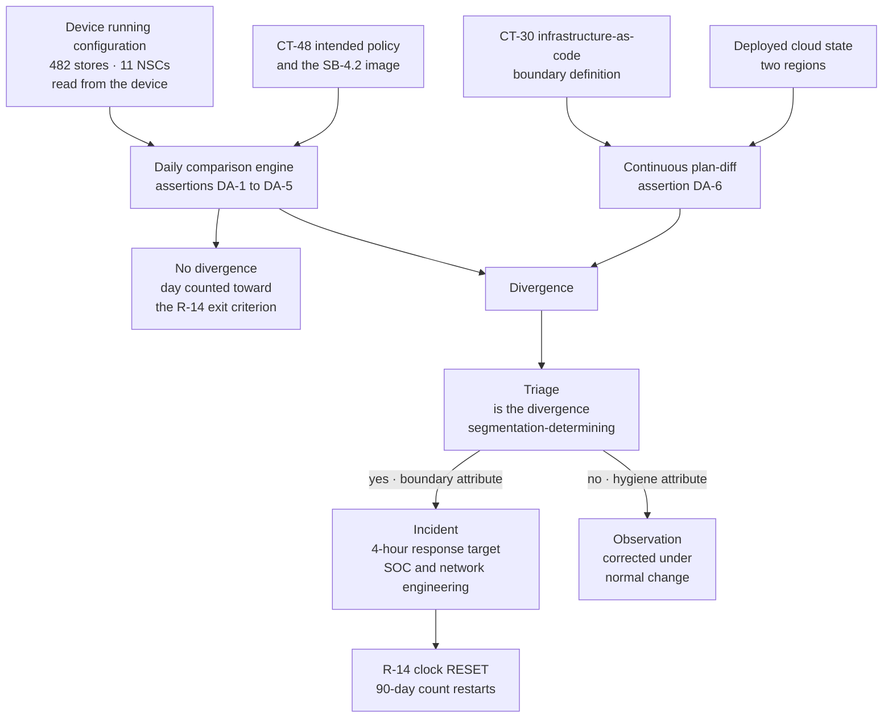

# 03.08 — Remediation &amp; Re-Test

| Field | Value |
|---|---|
| Document ID | MRG-PCI-2026-308 |
| Program | Marketa Retail Group — PCI DSS v4.0.1 Compliance Program |
| Phase | 03 — Network Segmentation &amp; Architecture |
| Version | 1.0 |
| Status | Approved |
| Owner | Trevor Kim, Director of Infrastructure &amp; Network |
| Approver | Naomi Bhatt, Chief Information Security Officer |
| Date | 2026-07-15 |
| Classification | Confidential — Cardholder Data Environment // Illustrative Portfolio Sample |

## Purpose

03.07 recorded a failed **11.4.5** segmentation penetration test. This document records what Marketa did about it and what the evidence now supports.

It is organised around a distinction the programme insists on and will keep insisting on:

> **The re-test proves the boundary. It does not prove the process that let the boundary rot.** A clean test on 2026-06-26 establishes that no path existed from Z7 to Z5 at forty-one stores on five days in June. It establishes nothing whatever about whether Marketa will notice the next time a template loses a line. Only operating history does that, and operating history is a thing you accumulate, not a thing you commission.

The remediation was therefore built in two halves. The first half closed the defect. The second half built the control that finds the next one, and the second half is the more important of the two.

## 1. What Was Actually Wrong

Restated in one paragraph so that the remediation can be read against it. Store build image **SB-4.1**, released November 2024, reworked the `ROLE-AP` wireless uplink port template and dropped its explicit allowed-VLAN list. A trunk with no allowed-VLAN list carries every VLAN defined on the switch — a platform default, not an administrator's decision. That defect was present at **37 of 482 stores**, and it was inert everywhere, because guest wireless does not exist as a local VLAN in a Marketa store. In September 2025 a field engineer at **store 0417, Dayton, Ohio** moved that store's guest SSID from central switching to local switching to resolve a latency complaint. The change created a guest VLAN inside the store, on a switch whose access point trunk permitted every VLAN, in a fabric that performs inter-VLAN routing and had no rule denying guest-to-operations traffic because the design said the guest VLAN would never exist. Ironwood's tester walked in on 2026-05-15 and had TCP sessions to the store back-office network nineteen minutes later.

| Layer of the problem | What remediation had to achieve |
|---|---|
| **The instance** — store 0417 | Remove the path at that site, immediately, without waiting for anything else |
| **The precondition** — 37 stores with a permissive `ROLE-AP` trunk | Remove the precondition wherever it exists, before it meets its counterpart |
| **The root** — the build image that produced it | Correct the artefact, so that no future build, rebuild or switch replacement reintroduces it |
| **The systemic gap** — change classification | Make the three change types that composed the path into boundary events with a re-test obligation |
| **The assurance gap** — nobody would have found this | Build a control that detects the defect class continuously, so it is Marketa that finds the next one |
| **The claim** — ADR-0006 and the scope determination | Re-establish the segmentation claim on **test** evidence, and re-state the condition it now rests on |

Five of the six were achievable inside eight weeks. The sixth — assurance — is not a thing that completes; it is a thing that starts running. §6 is honest about the difference.

## 2. Immediate Containment

03.07 §8 records the first four actions on the day. They are summarised here for continuity and then carried forward, because containment is where this document begins rather than where it ends.

| # | Action | Timestamp | Elapsed from notification |
|---|---|---|---|
| 1 | CISO notified by Ironwood | 2026-05-15, 12:38 | — |
| 2 | Store 0417 withdrawn from the SD-WAN overlay at CT-47, severing its path to Z3 and to the vendor endpoints. Store continued trading in the POS application's store-and-forward mode | 2026-05-15, 13:19 | **41 minutes** |
| 3 | Store 0417's guest SSID returned to central switching at CT-49; the local guest VLAN and its SVI removed from the store switch; the `ROLE-AP` trunk given an explicit allowed-VLAN list of 20 and 99 | 2026-05-15, 14:05 | 1 h 27 m |
| 4 | Running-configuration extraction commenced across all 482 stores — every switch, WAN edge device and access point | 2026-05-15, 14:22 | 1 h 44 m |
| 5 | Extraction complete; population established at **37 latent, 1 live** | 2026-05-17, 02:10 | **35 h 32 m** |
| 6 | Store 0417 verified by an independent re-read of running configuration, then re-admitted to the overlay | 2026-05-18, 09:40 | 3 days |
| 7 | Test result recorded as **FAIL**; scope determination suspended for the store estate; assessed population recorded as **553** | 2026-05-15 | Same day |
| 8 | Risk **R-14** raised at 4 × 4 = 16, High, under **ADR-0005** | 2026-05-18 | 3 days |
| 9 | Steering Committee extraordinary session; remediation plan and re-test commissioning approved | 2026-05-19 | 4 days |
| 10 | Cardinal Merchant Bank notified under obligation **C7** as a suspension of a claimed scope reduction — **not** a compromise notification under C1 | 2026-05-27 | 12 days |

Two things about the containment are worth naming rather than assuming.

**The isolation capability was designed before it was needed.** 03.04 §4 specifies prefix-based withdrawal from the SD-WAN overlay as a central operation completing in under five minutes without a site visit. It took forty-one minutes from notification on the day, of which thirty-four were decision and seven were execution. An estate of 482 sites without that capability contains a store by sending somebody to Ohio.

**The store kept trading.** Containment that stops a shop selling is containment nobody will authorise at 13:19 on a Friday, which means in practice it is containment that does not exist. The store-and-forward mode in the POS application is what made the decision easy, and it is the reason the decision took thirty-four minutes rather than three days.

## 3. Track A — Close the Precondition Before Anything Else

The instinct after a finding of this kind is to fix the build image and roll it out. Marketa deliberately did not lead with that, and the reasoning is **CON-02** — the 482× problem.

A full store build image is a large change to 482 production networks. 03.04 §7 governs it with four waves and twenty-five days of soak precisely because a bad push reaches 482 stores simultaneously and 482 stores that cannot sell is a materially worse day than the one Marketa had just had. Compressing those gates to move fast on a Critical finding trades one risk for a larger one.

So the remediation was split. **Track A** was a single narrow configuration change with a small blast radius, applied first. **Track B** was the corrected image, applied at the normal cadence behind it.

| Attribute | **Track A** — restore the allowed-VLAN list | **Track B** — store build image SB-4.2 |
|---|---|---|
| Scope of change | One line per `ROLE-AP` trunk port: an explicit allowed-VLAN list of 20 and 99 | The full corrected build image, including four other hardening changes |
| Population | **37 stores** carrying precondition P1, plus assertion across the other 445 | **All 482 stores** |
| Blast radius if wrong | The wireless access points at 37 stores lose colleague Wi-Fi. Recoverable in minutes, per site, centrally | Every store network in the chain |
| Rollback | Immediate, per store, from CT-48 | Staged, 30-day rollback window |
| Governance | Emergency change under the standing authority, two named approvers, Steering Committee informed | Normal segmentation-affecting change with a scope-delta review |
| Dates | **2026-05-19 → 2026-05-20** | 2026-05-20 → **2026-07-06** |

### 3.1 Track A execution

| Step | Date and time | Detail |
|---|---|---|
| Change raised, classified segmentation-affecting, scope-delta review completed | 2026-05-18 | Approvers: Trevor Kim as zone owner, Owen Castellanos as Payment Card Compliance Manager. The two-approver rule in 03.03 §4 applied without exception despite the urgency |
| Tranche 1 — 5 stores | 2026-05-19, 06:00–06:20 | Applied outside trading hours; colleague wireless verified functional at each site before proceeding |
| Tranche 2 — remaining 32 stores | 2026-05-19, 22:00–23:15 | Applied overnight |
| Independent verification — running configuration re-read at all 37 | 2026-05-20, 05:00–08:40 | Read back from the device, **not** from the controller's intended policy. This distinction is the whole lesson of 03.07 and it governed every verification step in the remediation |
| Assertion across the other 445 stores | 2026-05-20 | Explicit allowed-VLAN list confirmed present and correct at all 445; **no exceptions found** |
| SSID switching-mode audit, all 482 stores, all SSIDs | 2026-05-20 | **One** store configured for local guest switching — 0417, already corrected on 2026-05-15. No others |
| Unused-port state remediation — finding SEG-PT-05 | 2026-05-21 → 2026-05-26 | Unused ports administratively shut and assigned to VLAN 999 across all 482 stores |

**Track A closed the exposure on 2026-05-20 at 08:40, five days after the finding.** From that date, precondition P1 did not exist anywhere in the estate, and a repeat of the store 0417 SSID change would have produced no path.

That last sentence is doing more work than it appears to, and §5.3 returns to it with evidence, because it happened.

## 4. Track B — Store Build Image SB-4.2

### 4.1 What changed in the image

| Change | Origin | Effect |
|---|---|---|
| `ROLE-AP` trunk carries an **explicit allowed-VLAN list of 20 and 99** | SEG-PT-01 / SEG-PT-02 | The defect, corrected at source. A rebuild or switch replacement can no longer reintroduce it |
| A build-time assertion that **every trunk port on the switch has a non-empty allowed-VLAN list** | NSC-13, as rewritten | The image refuses to apply if the assertion fails. A template cannot silently lose the line again |
| Unused ports administratively shut and assigned to VLAN 999 as a build-time default | SEG-PT-05 | Closes the stockroom-port path found at 9 of 14 tested stores |
| SNMP polling ACL restricted to the CT-48 source addresses; community strings rotated | SEG-PT-03 | Closes the 1.4.5 topology disclosure from colleague wireless at 6 stores |
| Management-interface cipher configuration hardened on the store WAN edge | SEG-PT-07 | Closes the deprecated cipher suite finding |
| Guest SSID switching mode pinned in the image and flagged as a boundary attribute at CT-49 | Root cause, second precondition | A local change to switching mode is now visible as a divergence from the image rather than as a routine wireless tweak |

Five of the eight segmentation findings are closed by the image. The other three — SEG-PT-04 captive portal DNS, SEG-PT-06 Z8 error handling, SEG-PT-08 SIP response headers — sit outside the store switch and were remediated separately; §7 tabulates all eight.

### 4.2 The rollout, at 482×

The wave model in 03.04 §7 was followed without compression. This is recorded deliberately, because the pressure to compress it was real and the Steering Committee's decision on 2026-05-19 to refuse was a decision with a stated reason: **Track A had already removed the exposure, so there was nothing left that speed would buy.**

| Wave | Stores | Period | Soak | Gate result |
|---|---|---|---|---|
| **W0 — lab** | Reference store build, Columbus lab | 2026-05-20 → 05-26 | 5 working days | Pass. Functional and **boundary** verification, including the new step in §4.3 |
| **W1 — pilot** | 4 — one per format plus one compact | 2026-05-27 → 06-09 | 10 trading days | Pass. Zero incidents; drift checks clean; boundary verification pass at all 4 |
| **W2 — regional** | 48 — one regional operating area | 2026-06-10 → 06-23 | 10 trading days | Pass. One deferral: 1 store held back for an unrelated circuit fault, applied 06-25 |
| **W3 — estate** | Remaining 430, in nightly tranches of 60 | 2026-06-24 → **07-06** | — | Complete. Rollback available to 2026-08-05 |

| Rollout metric | Value |
|---|---|
| Stores on SB-4.2 at the re-test date, 2026-06-26 | **150** |
| Stores on the earlier image **with the Track A correction applied or verified** at the re-test date | **332** |
| Stores in the estate with precondition P1 present at the re-test date | **0** |
| Stores requiring a site visit at any point in the remediation | **0** |
| Trading impact attributable to the rollout | **None recorded** |
| Rollback invocations | **0** |

The middle rows are the point. At the moment of the re-test the estate was **split across two image versions and one manual correction**, and that is the normal condition of a 482-site estate mid-rollout rather than an untidiness to be apologised for. §5.2 explains why the re-test sample was designed to cover both populations, and why testing the estate in the state it was actually in is worth more than testing it in the state a diagram would prefer.

### 4.3 The gate that did not exist before

SB-4.1 passed all four waves in 2024. It passed them because the gates asked whether the store worked and whether the intended flows flowed. **No gate asked whether a flow that should have been impossible had become possible.**

| Gate step | Present in 2024? | Present from 2026-05-20 |
|---|---|---|
| Functional test — POS, inventory, print, timeclock | Yes | Yes |
| Intended-flow test — store reaches the named Z3 endpoints and the vendor endpoints | Yes | Yes |
| **Negative boundary test — a client on each SSID attempts to reach VLAN 10, VLAN 30 and VLAN 99, and must fail** | **No** | **Yes, at every wave, from a real client association** |
| **Trunk assertion — every trunk port has a non-empty explicit allowed-VLAN list matching the expected set** | No | Yes, at every wave and daily thereafter |
| **Port-role assertion — every port matches the expected role for that store's layout** | No | Yes |
| Running-configuration read-back from the device rather than from the controller | Partial | **Mandatory** |

A negative test is the cheapest control in this document and it is the one whose absence cost the most. It takes a laptop, an association and four minutes.

## 5. The Re-Test

### 5.1 Result

| Field | Value |
|---|---|
| Requirement | **11.4.5** — penetration testing on segmentation controls and methods, following change |
| Tester | **Ironwood Security Labs** — same firm, same lead tester, deliberately |
| Engagement reference | **IWSL-MRG-2026-SEG-02** |
| Fieldwork | **2026-06-22 → 2026-06-26** |
| **Result date** | **2026-06-26** |
| **Result** | **PASS** |
| Findings | **None.** No Critical, High, Medium or Low finding was raised |
| Store sample | **41 stores — 8.5% of the estate**, against 14 stores and 2.9% in May |
| Report issued | 2026-07-03 |
| Cost | Within the programme's **$165,000** penetration testing line; no supplementary funding requested |

The re-test raised **zero findings**, and the programme's cumulative penetration testing position is therefore unchanged: **19 findings across two engagements — 8 from the May segmentation test and 11 from the September application test — 2 Critical, 5 High, 7 Medium, 5 Low**, exactly as reconciled in 03.07 §9.1. A re-test that produces no findings adds nothing to that arithmetic, and the programme states so rather than leaving a reader to wonder whether a nineteenth-and-twentieth finding is hiding somewhere.

### 5.2 What the re-test covered

A clean result from a re-test is worth precisely as much as the scope it was run against, so the scope is stated in full.

| Parameter | May test | **June re-test** | Why |
|---|---|---|---|
| Stores sampled | 14 (2.9%) | **41 (8.5%)** | A re-test scoped to the site that failed proves only that one site was fixed |
| **All 37 stores that carried precondition P1** | 3 of them | **All 37** | The latent population is the population that must be proved clean, not the single site that was proved dirty |
| Additional stores selected by Ironwood from the other 445 | 11 | **4** | Independent selection retained, so the sample is not entirely Marketa-defined |
| Store selection authority | Ironwood | **Ironwood**, from a population Marketa disclosed in full | Marketa disclosed the 37 rather than letting the tester find them. Concealing the latent population to make the sample look independent would have been theatre |
| Stores on SB-4.2 at time of test | — | **19 of 41** | Deliberate. The property had to hold on both image versions |
| Stores on the earlier image with the Track A correction | — | **22 of 41** | As above |
| Store notification | None | **None** | Unchanged |
| Starting positions | 8 | **8**, unchanged — every out-of-scope zone, external internet, assumed-compromise inside Z3 | A re-test narrowed to the failed boundary would not have re-established the other eleven boundary classes |
| Cloud positions | 6 Z8 positions plus 3 identity-path escalations | **Repeated in full** | Cloud passed in May; re-testing it costs little and a partial re-test creates an evidentiary gap |
| Physical access | Public trading areas only | Unchanged | |
| Production carve-outs | None | **None** | |
| Exploitation depth | Proof of reachability, not exploitation | Unchanged | |

| Boundary class | May | **June** |
|---|---|---|
| **B-09** Z7 → Z5, at 41 stores | **FAIL at 1 of 14** | **No path at 41 of 41** |
| B-09 Z7 → Z6, at 41 stores | No path | No path |
| B-06 Z5 → Z3 / Z1 | No path | No path |
| B-07 Z6 ↔ Z5 | No path | No path |
| B-04 Z4 → Z1 / Z2 | No path | No path |
| B-01, B-02, B-03 Z3 and CDE boundaries | No path beyond named flows | No path beyond named flows |
| B-10 / B-13 Z8 → Z1 / Z2, including identity paths | No path | No path |
| B-15 Z2 → internet | No egress beyond named destinations | No egress beyond named destinations |
| Z9 → Z1 / Z2 | No path | No path |
| External internet → Z1 / Z2 | No path | No path |
| Internal-to-Z5 stockroom port position — SEG-PT-05 | **Address obtained on VLAN 10 at 9 of 14** | **No address obtained at 41 of 41** |
| SNMPv2c from colleague wireless — SEG-PT-03 | **Configuration disclosed at 6 of 14** | **No response at 41 of 41** |

### 5.3 The thing that happened during the re-test, and is reported anyway

On **2026-06-24**, day three of the re-test fieldwork, the newly live daily drift assertion raised a divergence at **store 1183**: an access switch replaced by a local contractor two days earlier, imaged from a stock configuration that was neither SB-4.1 nor SB-4.2, carrying a `ROLE-AP` trunk **with no allowed-VLAN list**.

Precondition P1, back in the estate, thirty-five days after it was supposedly eliminated, while a penetration test was in progress to confirm that it had been.

| Fact | Detail |
|---|---|
| Detected by | Daily trunk allowed-VLAN assertion **DA-3**, on its first pass after the change |
| Time from change to detection | Under 24 hours |
| Time from detection to correction | **2 h 51 m** — inside the four-hour response target |
| Was a path live at store 1183? | **No.** The store's guest SSID was centrally switched, so precondition P2 was absent. There was no guest VLAN on the switch for the permissive trunk to carry |
| Was store 1183 in the re-test sample? | **No** |
| Disclosed to Ironwood? | **Yes, on the day.** Recorded in the re-test report's limitations section at Marketa's request |

Marketa reports this for three reasons, none of them comfortable.

**Because the honest reading is that the re-test could have failed again.** Had Ironwood selected store 1183, and had that store's guest SSID also been locally switched, the June test would have produced a second Critical finding. It did not, and the reason it did not is that the second precondition was absent — which is defence in depth working, not remediation working.

**Because it is the strongest available evidence that fixing the root cause was the right call.** The corrected image and the Track A push removed P1 from the estate; a contractor with a spare switch put it back at one site. What stopped it becoming a path was that P2 was not there. Marketa fixed the image *and* pinned the SSID switching mode *and* built an assertion for each, and it took all three.

**Because it is the fact that justifies R-14 staying High.** A programme that reported a clean re-test and closed the risk would be reporting the boundary and ignoring the process. The process produced a permissive trunk again inside five weeks. That is not a failure of remediation; it is the estate behaving the way a 482-site estate maintained by contractors behaves, and it is exactly what the drift control exists to absorb.

### 5.4 What the re-test does not claim

| The re-test proves | The re-test does not prove |
|---|---|
| No path existed from Z7 to Z5 at 41 stores between 2026-06-22 and 2026-06-26 | That no path exists at the other 441 stores. That claim rests on estate-wide configuration assertion — **E2** — plus the drift control |
| The property held on both image versions and under the Track A correction | That it will hold after the next switch replacement, contractor visit or latency complaint |
| Eleven other boundary classes held under direct attack a second time | That they will hold after the next change. **11.4.5 is annual and after change for exactly this reason** |
| The estate-wide corrective work was effective against the defect class it targeted | That there is not a second, different defect class nobody has looked for. A tester finds what a tester looks for |
| Marketa's remediation reached the root cause rather than the instance | **That the process which produced the root cause has been fixed.** The change classification is amended and the assertions are running. Neither has operating history |
| The scope determination can be restored | That it can be restored unconditionally. §8 states the condition it now carries |

> **A passed test is a photograph, not a guarantee.** It is a high-quality photograph — 41 sites, tester-selected, unannounced, no carve-outs, eight starting positions, taken by a firm that had already proved it would find something. It is still a photograph, and the store estate changes every day. The control that converts a photograph into a film is §6, and it is the deliverable of this document that matters in five years.

## 6. Continuous Configuration-Drift Detection

### 6.1 Why this is the real remediation

03.04 §8 lists eight store network monitoring controls. Four did not exist before this phase and three exist because of SEG-PT-01. Consolidated, they are one control with six daily assertions, and the programme now refers to the set as **segmentation drift detection** — assertions **DA-1** to **DA-6**.

The design rule behind all six is a single sentence: **every assertion reads the device, never the controller.** Phase 02's reachability computation was excellent analysis performed against the store-estate policy controller's *intended* policy, and it was blind to store 0417 because the switch was carrying a VLAN the controller's model did not know about. An assurance control built from the same artefact would have inherited the same blindness.

| ID | Assertion | Population | Cadence | Divergence handling | Would it have found SB-4.1? |
|---|---|---|---|---|---|
| **DA-1** | Running configuration retrieved from the device and compared against the CT-48 intended policy, including observed VLAN membership per port | 482 stores — all switches, WAN edge devices and access points; plus all 11 NSCs | **Daily** | Incident, 4-hour response target | **Yes** |
| **DA-2** | Every port's role compared against the expected role for that store's layout; any unexpected trunk flagged | All store switch ports | Daily | Incident | Yes |
| **DA-3** | Every trunk port asserted to carry a **non-empty explicit allowed-VLAN list**, and that list compared against the expected set | All trunk ports, estate-wide | Daily | Incident | **Yes — this is the specific control** |
| **DA-4** | Every guest SSID at every site asserted to be **centrally switched** | 482 stores, all SSIDs, at CT-49 | Daily | Incident | It would have found precondition P2 at store 0417 in September 2025 |
| **DA-5** | Every unused port asserted administratively shut and assigned to VLAN 999 | All store switch ports | Daily | Incident | Finds the SEG-PT-05 class |
| **DA-6** | Continuous plan-diff of the CT-30 infrastructure-as-code definition against deployed cloud state for all boundary resources | Z2 and Z8 boundary resources, both regions | **Continuous** | Pipeline failure plus incident | The cloud equivalent; existed in part, extended here |

### 6.2 What "clean" means, precisely

03.07 §8.1 set R-14's exit criterion as a clean re-test **plus ninety consecutive days of clean daily drift, port-role and trunk assertions across all 482 stores**. That wording needs one clarification, and the clarification is recorded here rather than applied silently, because tightening a criterion after the fact and loosening one after the fact look identical if nobody writes down which was done.

| Term | Definition adopted 2026-06-15 | Effect on the criterion |
|---|---|---|
| **Segmentation-determining divergence** | A divergence in an attribute that can create or remove a path between zones: trunk allowed-VLAN lists (DA-3), SSID switching mode (DA-4), VLAN membership or SVI presence (DA-1), an access port assigned to a VLAN it should not carry (DA-2), or a boundary resource diff (DA-6) | **Resets the ninety-day count to zero** |
| **Hygiene divergence** | A divergence with no capacity to create a path — an unused port left administratively up but assigned to VLAN 999, a description field, a non-boundary timer, an NTP source | Corrected under normal change; recorded; **does not reset the count** |
| **Clean day** | A day on which every assertion ran across the full population and raised no segmentation-determining divergence | Counts toward ninety |
| **Missed day** | A day on which an assertion did not run, or ran against an incomplete population | **Treated as a failed day and resets the count.** An assertion that did not run is not a clean result |

The last row exists because the most common way a monitoring control fails is silently. A drift check that stops running produces the same output as a drift check that finds nothing.

### 6.3 First thirty-one days of operating history

The assertion set went live estate-wide on **2026-06-15**. As at the date of this document, 2026-07-15, it has thirty-one days of history.

| Metric | Value |
|---|---|
| Store-days asserted | **14,942** — 482 stores × 31 days |
| Assertion coverage — days on which all five store assertions ran against the full population | **31 of 31** |
| Divergences raised | **11**, at 9 stores |
| Of which **segmentation-determining** | **2** |
| Of which hygiene | 9 |
| Median time from change to detection | **under 24 hours** — the cadence bound |
| Median time from detection to closure, segmentation-determining | **1 h 59 m** against a 4-hour target |
| Median time from detection to closure, hygiene | 3.4 days, under normal change |
| False-positive rate after the first week's tuning | 4 of 11 initial alerts in week one, reduced to 0 in weeks two to four |

The two segmentation-determining divergences, in full:

| Date | Site | Divergence | Cause | Path live? | Closed |
|---|---|---|---|---|---|
| **2026-06-24** | Store 1183 | `ROLE-AP` trunk with no allowed-VLAN list — **DA-3** | Contractor replaced a failed access switch from a stock configuration carrying neither image | **No** — guest SSID was centrally switched, so P2 absent | 2 h 51 m |
| **2026-07-02** | Store 0629 | Guest SSID moved from central to **local switching** at CT-49 — **DA-4** | A field engineer resolving a guest wireless latency complaint | **No** — the `ROLE-AP` trunk carried an explicit allowed-VLAN list, so P1 absent | 1 h 08 m |

Read those two rows together. **Within five weeks of the re-test, both preconditions of SEG-PT-01 recurred independently at different stores, and neither produced a path, because in each case the other precondition had been eliminated.** The 2026-07-02 event is the same change, made for the same reason, by the same category of competent engineer, as the change that caused the original finding at store 0417 in September 2025.

| Consequence | Detail |
|---|---|
| **R-14's ninety-day count reset** | Last segmentation-determining divergence 2026-07-02. Count restarts **2026-07-03**; earliest exit **2026-09-30** |
| R-14 rating at the Phase 03 baseline | **Unchanged at 4 × 4 = 16, High.** It does not come down on the re-test |
| Change classification reinforced | The SSID switching-mode change at store 0629 **was** raised as a change and **was** classified as segmentation-affecting under the June amendment to 03.03 §4.1 — the classification worked. The engineer applied it before the review completed, which is a different failure and is being addressed as a workflow enforcement change at CT-49 |
| What the programme concluded | The technical remediation is complete and effective. **The process is not yet demonstrably reliable**, and the register says so |

### 6.4 What the drift control costs, and what it does not do

| Property | Position |
|---|---|
| Deployment model | Central, from CT-48 and CT-49; **no site visit for any store** — principle SP-9 satisfied |
| Marginal cost per store | Effectively zero; the constraint is the comparison engine and the triage capacity, not the estate size |
| Operating load | Triage of roughly 0.35 divergences per day across 482 stores, against an estimated steady state of 0.2 to 0.5 |
| **What it cannot do** | Detect a defect in the **intended** policy itself. If CT-48's intended policy is wrong, DA-1 reports agreement between two wrong things |
| Mitigation for that gap | The SB-4.2 build-time assertion; NSC-13; the negative boundary test at every rollout wave; and **11.4.5**, annually and on change. **The test remains the only control that reads the network from the outside** |
| Relationship to 1.2.8 | This is the second limb of 1.2.8 — configurations kept consistent with active network configurations — implemented as an assertion rather than as a report |

The fourth row deserves its own emphasis because it is the honest limit of the whole approach. Drift detection compares the network to what Marketa believes the network should be. It is a comparison between two Marketa artefacts, and it will never catch an error that exists in both. **That is the permanent argument for penetration testing, and it is why 11.4.5's annual cadence is a floor rather than a ceiling.**

## 7. Disposition of All Eight Segmentation Findings

| Ref | Severity | Remediation | Verified how | Verified when | Status |
|---|---|---|---|---|---|
| **SEG-PT-01** | Critical | Store 0417 corrected on the day; Track A across 37 stores; SB-4.2 estate-wide; DA-3 and DA-4 daily | **Re-test at 41 stores including all 37**, plus estate-wide configuration assertion | 2026-06-26 | **Closed** |
| **SEG-PT-02** | High | Explicit allowed-VLAN list restored on every `ROLE-AP` trunk; build-time assertion added; DA-3 daily | Configuration read-back at all 482; re-test at 41 | 2026-05-20 / 2026-06-26 | **Closed** |
| **SEG-PT-03** | High | Community strings rotated; polling ACL restricted to CT-48 sources; **NSC-EX-01** re-scoped with the review cadence shortened to quarterly | Re-test attempted SNMP from colleague wireless at 41 stores — no response | 2026-06-26 | **Closed**, exception remains open to the FY2027 refresh |
| **SEG-PT-04** | Medium | Captive portal walled garden tightened; DNS restricted to the portal resolver until terms acceptance | Re-test attempted pre-acceptance name resolution at 41 stores | 2026-06-26 | **Closed** |
| **SEG-PT-05** | Medium | Unused ports shut and assigned to VLAN 999 estate-wide; DA-5 daily | Re-test attempted a stockroom-port position at 41 stores — no address obtained | 2026-06-26 | **Closed** |
| **SEG-PT-06** | Medium | Error handling corrected on the Z8 storefront service; response inspection added at the edge | Re-test repeated the request set | 2026-06-26 | **Closed** |
| **SEG-PT-07** | Low | Cipher configuration hardened in SB-4.2 | Configuration assertion; re-test scan of the management VLAN | 2026-07-06 | **Closed** |
| **SEG-PT-08** | Low | SIP response headers suppressed at the Austin session border controller | Re-test repeated the signalling probe | 2026-06-26 | **Closed** |

**Eight of eight closed and verified by test rather than by assertion of completion.** The distinction matters: six were verified by Ironwood attempting the original attack again, one by configuration assertion across the full population, and one by both. No finding was closed on the strength of a change record alone.

## 8. Restoration of the Scope Determination

| Item | Position on 2026-05-15 | Position on 2026-06-26 | Position at this document's date |
|---|---|---|---|
| **11.4.5** | **Not met** | Met | Met, with a re-test obligation on every change classified under 03.03 §4.1 |
| Assessed component population | **553** — 71 plus 482 store servers | **71** | **71** |
| Store-estate appliances in scope | 496 additional | Governed, not enumerated | Governed, not enumerated |
| **12.5.2** element 5 — segmentation identified and justified | Accurate in structure, **false at one site** | Amended and accurate | Amended; the amendment records the failure, the remediation and the re-test rather than presenting a clean position |
| **SEG-C4** — the Phase 02 condition | **Failed** | **Discharged by test** | Discharged, and now carrying a continuous verification obligation |
| **A-09** — the Phase 02 assumption | Confirmed with qualification, configuration only; then **disproved by test** | Not reinstated | **Permanently recorded as disproved.** ADR-0005 |
| **ADR-0006** — store estate classification | **Collapsed on its own stated terms** | Restored | **Restored and amended** — 03.13 §4 |
| R-14 | Raised, 16, High | 16, High | **16, High.** Exit no earlier than 2026-09-30 |
| Cardinal notification under **C7** | Suspension notified 2026-05-27 | Restoration notified 2026-07-02 | Both notifications on file |
| QSA position | Challenge **QC-01**'s condition invoked | Re-test report provided to Sable Ridge 2026-07-06 | Accepted as evidence for the 12.5.2 confirmation; the ROC scope narrative will carry the failure and the re-test, not the re-test alone |

Two of those rows are refusals rather than restorations, and they are the ones a reader should weigh.

**A-09 is not reinstated.** The assumption that configuration verification across 482 sites establishes segmentation effectiveness was disproved on 2026-05-15 and stays disproved. What Marketa has now is not the restored assumption but a different and better thing: a tested claim with a continuous verification control behind it. The distinction is ADR-0005's whole content and it survived contact with the most convenient possible moment to abandon it.

**R-14 does not come down on the re-test.** The exit criterion was written on 2026-05-18, before anybody knew the re-test would pass, and it requires operating history that on 2026-07-15 Marketa does not have — and that a contractor's spare switch and a helpful field engineer have already reset once.

## 9. What This Cost, and What It Bought

| Dimension | Position |
|---|---|
| Elapsed time, finding to clean re-test | **42 days** — 2026-05-15 to 2026-06-26 |
| Elapsed time, finding to exposure closed estate-wide | **5 days** — Track A complete 2026-05-20 |
| Elapsed time, finding to full image rollout | **52 days** — SB-4.2 complete 2026-07-06 |
| Site visits required | **0** |
| Trading impact | **None recorded** at any store, at any wave, including the containment at store 0417 |
| Financial | Absorbed within the segmentation build and penetration testing lines of the approved programme budget. No supplementary funding requested |
| Schedule | Completed inside the April-to-July control implementation window and clear of the **October-to-January seasonal freeze** under CON-01. A finding of the same class in September would not have been remediable estate-wide before the freeze |
| Controls that now exist and did not on 2026-05-14 | Six daily or continuous assertions; a build-time trunk assertion; a negative boundary test at every rollout gate; four amended change classifications; NSC-13 in its current form |
| **Requirement coverage improved** | **1.2.2**, **1.2.8**, **1.2.1** and **11.4.5** are all in a materially stronger position than they were before the test failed |

The last row is the argument of the entire phase compressed into a sentence, and it is worth stating without hedging: **Marketa's Requirement 1 posture is better because the test failed.** A clean May result would have produced a satisfied Steering Committee, no NSC-13 rewrite, no change-classification amendments, no daily assertions, and a permissive trunk sitting at 37 stores waiting for the next latency complaint. The programme did not get lucky. It got tested, by a test designed so that an uncomfortable answer was possible, and the uncomfortable answer was the return on that design.

## 10. Open Items From This Document

| ID | Item | Owner | Due | Carried to |
|---|---|---|---|---|
| **OI-03-01** | R-14 exit criterion — ninety consecutive days with no segmentation-determining divergence. Count restarted 2026-07-03 | Trevor Kim | **2026-09-30** at the earliest | Phase 06 |
| **OI-03-02** | Workflow enforcement at CT-49 so that an SSID switching-mode change cannot be applied before its scope-delta review completes — the store 0629 failure mode | Trevor Kim | 2026-09-30 | Phase 04 |
| **OI-03-03** | Contractor switch-replacement procedure to require imaging from CT-48 before patching, with a pre-handover trunk assertion — the store 1183 failure mode | Adaeze Nwosu | 2026-09-30 | Phase 05 |
| **OI-03-04** | Second 11.4.5 test cycle scheduled and budgeted for 2027, plus the change-triggered re-test register operating continuously | Trevor Kim | 2026-12-31 | Phase 06 |
| **OI-03-05** | NSC-EX-01 SNMPv2c exception — quarterly review until the FY2027 store refresh replaces the 496 appliances | Trevor Kim | Quarterly | Phase 06 |

## Cross-References

| Reference | Relevance |
|---|---|
| 02.08 — Connected-To &amp; Security-Impacting Systems | Condition SEG-C4, discharged here by test; CT-47, CT-48 and CT-49 |
| 02.11 — Assumption Test Results | A-09, disproved and not reinstated; the ADR-0005 rule applied at the most inconvenient moment |
| 02.12 — Scope Validation &amp; Phase Summary | Open item OI-02-01, closed by the re-test; challenge QC-01 and its condition |
| ADR-0005 — Raise a Risk When Discovery Disproves an Assumption | Why R-14 does not come down on a clean re-test |
| ADR-0006 — Store Estate Classification | Collapsed on 2026-05-15, restored here, amended in 03.13 §4 |
| 03.01 — Segmentation Strategy &amp; Principles | Principles SP-3, SP-7, SP-8 and SP-9; "configuration is not proof" |
| 03.03 — Network Security Control Standards | NSC-13; the four June change classifications; 1.2.8 daily drift |
| 03.04 — Store Network Architecture | The `ROLE-AP` template, preconditions P1 and P2, the wave model and the 482× problem |
| 03.06 — Wireless Security | CT-49, SSID switching mode as a segmentation control, and the 214 legacy PSK devices |
| 03.07 — Segmentation Penetration Test | The failure this document remediates |
| 03.09 — NSC Ruleset Governance | Who may change a rule, and the governance the drift control reports into |
| 03.11 — Risk Register | R-14 at the baseline, and its exit criterion |
| Phase 06 — Monitoring, Testing &amp; Third Parties | The R-14 exit evidence, the 2027 test cycle, and CAP-05 |

---
[⬅ Previous](03.07-segmentation-penetration-test.md) · [🏠 Phase 03 Home](03.00-README.md) · [Next ➡](03.09-nsc-ruleset-governance.md)
