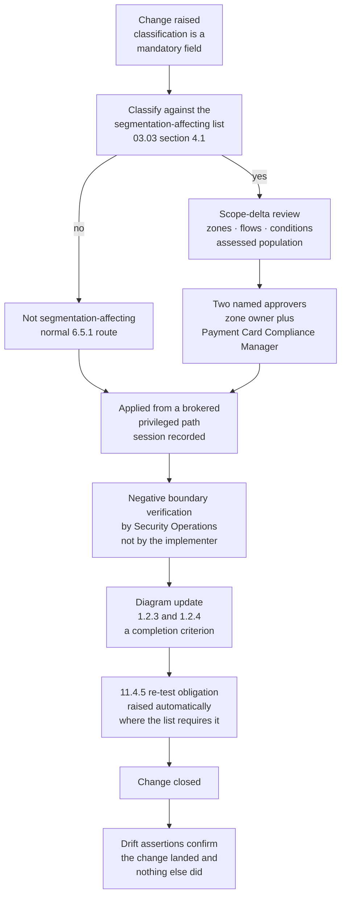

# 03.09 — NSC Ruleset Governance

| Field | Value |
|---|---|
| Document ID | MRG-PCI-2026-309 |
| Program | Marketa Retail Group — PCI DSS v4.0.1 Compliance Program |
| Phase | 03 — Network Segmentation &amp; Architecture |
| Version | 1.0 |
| Status | Approved |
| Owner | Trevor Kim, Director of Infrastructure &amp; Network |
| Approver | Naomi Bhatt, Chief Information Security Officer |
| Date | 2026-07-15 |
| Classification | Confidential — Cardholder Data Environment // Illustrative Portfolio Sample |

## Purpose

03.03 is the standard. This document is the **governance around the standard** — who may change a network security control, what happens when they do, who reviews the result, on what cadence, and what happens when a device or a business need cannot meet the standard.

It covers **1.2.7** six-monthly NSC ruleset review, **1.2.2** change control for network changes, the enforcement mechanism behind the **1.2.1** configuration standards, the drift-detection control introduced after SEG-PT-01, and the exception process. It also states one thing about targeted risk analyses that entities routinely get wrong in both directions.

The document exists because a rule base is not a static object. Marketa's eleven NSCs carry **10,128 rules** after the first review cycle, spread across three firewall clusters, a switching layer, two WAN and store policy controllers, a wireless controller, a cloud firewall and routing control plane, and two configuration-generation paths. Something in that estate changes most working days. **Segmentation is a property that has to be re-earned continuously, and governance is how it is re-earned between penetration tests.**

## 1. The Governance Question, Stated Plainly

03.07 did not find a clever attack. It found a template that lost a line in November 2024, a helpful engineer fixing a latency complaint in September 2025, and a change process that classified neither as a boundary event. Every one of those is a governance artefact, not a technology artefact.

| The technical question | The governance question behind it |
|---|---|
| Is the rule correct? | Who was allowed to write it, and who checked? |
| Is the boundary configured? | What happens to the boundary the next time somebody has a good reason to change it? |
| Was the change applied? | Was the change **classified** before it was applied, and did the classification carry an obligation? |
| Is the running configuration right? | How long would it take Marketa to notice if it were not? |
| Is the exception justified? | When does the exception expire, and who has to make a fresh decision to keep it? |
| Did the review happen? | Did the reviewer have any incentive to find something? |

This document answers the right-hand column.

## 2. Who May Change a Network Rule

### 2.1 The authority model

Marketa separates four things that are frequently held by one person in a network team: the right to **request** a change, the right to **approve** it, the right to **apply** it, and the right to **verify** it.

| Role | Held by | May request | May approve | May apply | May verify |
|---|---|---|---|---|---|
| Network engineer | Trevor Kim's team, 9 named individuals | Yes | No | Yes, from a brokered privileged path | No — not their own change |
| **Zone owner** | Per 03.02 §2 — Elena Marchetti, Trevor Kim, Curtis Lang, Adaeze Nwosu, Sonia Rendell, Bill Traynor | Yes | **Yes**, for changes affecting their zone | No | No |
| **Payment Card Compliance Manager** | Owen Castellanos | Yes | **Yes** — the second mandatory approver for any segmentation-affecting change | No | No |
| Security Operations | Marcus Hale's team | Yes | No | No | **Yes** — post-change boundary verification |
| Cloud platform engineering | 5 named principals with boundary-modifying permissions | Yes | No | Through the CT-30 pipeline only; console changes to boundary resources denied by service control policy | No |
| Internal Audit | Rosa Delgado | No | No | No | Read access to every artefact in this document; attends the review cycle as observer |
| Vendors and contractors | Under NSC-EX-02 and the store refresh programme | **No** | No | Only within a time-boxed, ticketed, brokered and recorded window | No |

Three rules make the table more than an org chart.

**No engineer approves their own change.** Approval by the requester's own management is explicitly insufficient for a segmentation-affecting change; the zone owner and the Payment Card Compliance Manager are both required, and they are in different reporting lines.

**Nobody verifies their own change.** Post-change boundary verification is performed by Security Operations against the affected boundary, and it is a **negative** test — an attempt to reach what should be unreachable — not a confirmation that the intended flow flows. 03.08 §4.3 records what the absence of that step cost.

**The store estate has no local change authority at all.** A store colleague, a regional manager and a field contractor have no ability to alter VLAN, trunk or ACL configuration. This is principle SP-9 expressed as an access-control decision, and it is the reason the store 1183 event in 03.08 §5.3 was a *contractor imaging a switch from stock* rather than a contractor editing a configuration: the only way to get a wrong configuration into a store is to bring one with you, which is a narrower attack surface and a more detectable one.

### 2.2 The Boundary Change Authority

Segmentation-affecting changes are reviewed by a standing forum rather than by an ad-hoc pairing, because the scope-delta judgement is the part that went wrong in 2024 and 2025 and it needs the same people making it every week.

| Attribute | Position |
|---|---|
| Name | **Boundary Change Authority (BCA)** |
| Established | 2026-06-01, following the Steering Committee's extraordinary session of 2026-05-19 |
| Chair | Trevor Kim |
| Mandatory members | Owen Castellanos; the zone owner of every zone the change touches; a Security Operations representative from Marcus Hale's team |
| Observer | Rosa Delgado, Internal Audit — non-voting, with standing access to the record |
| Cadence | **Weekly**, sitting inside the PCI Working Group's weekly slot; emergency path available at any time with two approvers and retrospective ratification at the next sitting |
| Decision record | Every change classified, every scope-delta review recorded, every 11.4.5 re-test obligation raised or explicitly declined **with a reason** |
| Reports to | PCI Steering Committee monthly; escalates any declined re-test obligation |
| Standing agenda item | Divergences raised by the drift assertions in the preceding week — §5 |

The emergency path is worth naming because emergency paths are where governance goes to die. Marketa's has three properties: it requires the same two approvers, only the timing changes; it produces the same records, only later; and **every emergency change is reviewed at the next BCA sitting and the reviewer asks whether it was genuinely an emergency**. Track A in 03.08 §3.1 went through the emergency path on 2026-05-18 and was ratified on 2026-06-03 as correctly classified.

## 3. Change Control — Requirement 1.2.2

### 3.1 The obligation

Requirement **1.2.2** obliges all changes to network connections and to NSC configurations to be approved and managed in accordance with the change control process defined at **6.5.1**. It is a short requirement with an expensive failure mode, and Marketa's implementation adds a segmentation-specific layer on top of the general change process because principle **SP-8** treats a boundary change as a **scope event**.

### 3.2 Classification is the control

The single most consequential field in Marketa's change record is the segmentation classification, because everything downstream — the scope-delta review, the second approver, the negative verification, the re-test obligation — hangs off it. The field cannot be left blank and it cannot be set by the requester alone for any change touching an NSC in the inventory.

**Four change types were added to the classification list in June 2026**, each because SEG-PT-01 demonstrated it could open a boundary and Marketa's process had not previously recognised it:

| Added change type | Why it was not classified before | What it now triggers |
|---|---|---|
| Change to a **trunk allowed-VLAN list** anywhere in the estate | It is a switch port attribute, not a rule. Rule-base governance never saw it | Scope-delta review; two approvers; **11.4.5 re-test obligation** |
| **SSID creation, deletion, or a change to SSID-to-VLAN mapping or switching mode** | Wireless was managed as a service quality domain. Guest wireless was classified untrusted and therefore treated as *not worth reviewing*, which is the inversion of the correct conclusion | Scope-delta review; two approvers; **re-test obligation** |
| **Store build image revision** affecting network configuration | A build image was a platform-engineering artefact. It is in fact **a change to 482 networks executed once** | Scope-delta review; two approvers; **re-test obligation**; full wave model with the negative boundary gate |
| Firmware or software upgrade of an NSC where the platform's **default behaviour** changes | Upgrades were assessed for functionality and vulnerability, not for changed defaults | Assessed case by case; re-test where a default changes |

The second row is the one with the widest application beyond Marketa. **A network classified as untrusted attracts less change scrutiny precisely because it is untrusted**, and that is exactly backwards: the untrusted network is the one whose containment is load-bearing. Z7 carries no Marketa asset and no data, and it is the zone from which the only successful boundary crossing in the estate was launched.

### 3.3 Change volume and classification outcomes

| Period | NSC changes raised | Classified segmentation-affecting | Scope-delta reviews | 11.4.5 re-test obligations raised | Obligations discharged by the June re-test |
|---|---|---|---|---|---|
| 2026-01 → 2026-05-14, before the amendment | 214 | 61 (28.5%) | 61 | 9 | — |
| **2026-05-15 → 2026-07-15, after the amendment** | **148** | **77 (52.0%)** | **77** | **14** | **11**; 3 open, covered by OI-03-04 |
| Change to the classification rate | — | **+23.5 percentage points** | — | — | — |

The classification rate did not rise because the network got more dangerous. It rose because three change types that were always boundary events are now recognised as boundary events. **Twenty-three and a half percentage points is the size of the blind spot**, measured after the fact, and it is a more useful number than any assurance statement about the change process.

One honest note on the discharge column. Eleven of fourteen re-test obligations were satisfied by the June engagement because they concerned boundaries the re-test exercised. Three were not, and rather than declaring them covered by proximity, they are carried as open items to the next test cycle. **A re-test discharges the obligations it actually covers**, and the register records which.

### 3.4 Where change control did and did not work in the store 0629 event

03.08 §6.3 records a guest SSID moved to local switching at store 0629 on 2026-07-02 — the same change, made for the same reason, as the one that caused the original finding.

| Element | Worked? |
|---|---|
| Was the change raised? | **Yes** |
| Was it classified as segmentation-affecting? | **Yes** — under the June amendment. The classification list did its job |
| Was a scope-delta review opened? | Yes |
| Was it approved by two approvers before application? | **No. The engineer applied the change while the review was open** |
| Was it detected? | **Yes, by DA-4, within 24 hours** |
| Was it reverted? | Yes, in 1 h 08 m |
| Did it create a path? | **No** — the corrected trunk configuration meant precondition P1 was absent |

The failure moved. It is no longer a classification gap; it is a **sequencing enforcement gap**, and the difference matters because the fixes are different. A classification gap is fixed by amending a list. A sequencing gap is fixed by making the platform refuse the change until the approval exists, which is **OI-03-02** and is a CT-49 workflow change rather than a policy change. Governance that relies on an engineer waiting is governance with a queue-length dependency.

## 4. Configuration Standards Enforcement — Requirement 1.2.1

03.03 §2 defines fourteen mandatory NSC settings, NSC-01 to NSC-14. A standard nobody asserts against is a document. The enforcement model is what makes it a control.

| Standard group | Enforcement mechanism | Cadence | Failure handling |
|---|---|---|---|
| NSC-01, NSC-02, NSC-03, NSC-04, NSC-05 — management plane, authentication, MFA, defaults, protocols | Configuration extract compared against the standard; authenticated scan from CT-31; AAA and CT-11 session records | **Monthly** extract; continuous session evidence | Deviation raises an incident; a device out of standard is not administered until corrected |
| NSC-06, NSC-07 — terminating deny-and-log, five metadata fields | Automated rule-base assertion | **Nightly** | A rule missing metadata is quarantined at the next 1.2.7 review; a policy without a terminating deny-and-log is a same-day fix |
| **NSC-08 — no `any` on a T1 boundary** | Automated rule-base assertion | **Nightly** | Any occurrence is a defect, not a finding for discussion. Zero tolerated on T1 |
| NSC-09 — object hygiene | Reconciliation against IPAM CT-63 | Monthly | Decommissioned objects removed within 30 days |
| NSC-10, NSC-11 — logging and time | Heartbeat reconciliation to CT-20 and CT-18; log volume banding; time source assertion | Continuous, with 10.7.2 alerting on absence | Loss of a log source is an incident under 10.7.2, not a ticket |
| **NSC-12, NSC-13 — running-versus-stored configuration, port and trunk roles** | **The drift assertions in §5** | **Daily** | Incident with a four-hour response target |
| NSC-14 — supported firmware and patching | Version telemetry; authenticated scan | Monthly, patched within one month under 6.3.3 | Escalated where the constraint is vendor-side — NSC-EX-02 |

| Assertion metric, 2026-06-15 to 2026-07-15 | Value |
|---|---|
| Nightly NSC-08 assertions run | 31 of 31 |
| `any` occurrences found on a T1 boundary | **0** |
| Rules quarantined for incomplete NSC-07 metadata | 38, all in the non-T1 population; 31 reclaimed by an owner, 7 removed |
| Policies found without a terminating deny-and-log | 0 |
| Monthly configuration extracts completed across all 11 NSCs | 11 of 11 |
| Devices found out of standard on NSC-05 outside the NSC-EX-01 population | 0 |

## 5. Drift Detection as a Governance Control

The technical specification of the six assertions **DA-1** to **DA-6** is 03.08 §6. This section is about what happens to a divergence once it exists, because a detection control with no defined response is a source of alerts rather than a control.

| Stage | Owner | Target | Rule |
|---|---|---|---|
| Detection | Automated, daily for DA-1 to DA-5, continuous for DA-6 | ≤24 hours from change | A day on which an assertion did not run against the full population is a **failed day**, not a quiet one |
| Triage — is this **segmentation-determining** or **hygiene**? | Security Operations, on the 03.08 §6.2 definitions | 30 minutes | Triage is performed against a written definition, not a judgement call, so that the R-14 clock cannot be managed by reclassification |
| Response, segmentation-determining | Network engineering, brokered privileged path | **4 hours** to correction | Treated as an **incident**, entering the 12.10 process, not as a report line |
| Response, hygiene | Network engineering | Next normal change window | Recorded; does not reset the R-14 count |
| Root-cause review | **Boundary Change Authority**, standing weekly agenda item | Next sitting | Every segmentation-determining divergence gets a root cause and, where the root cause is a process, a corrective action |
| Escalation | CISO, then Steering Committee | Any divergence not closed inside target, or any second occurrence of the same root cause | Repetition is the signal, not volume |

**The link to the risk register is explicit and one-directional.** A segmentation-determining divergence resets R-14's ninety-day exit count. Nothing in the operational process can shorten that count, and no one in the operational chain has authority to reclassify a divergence in order to protect it. That separation exists because the alternative — the team that owns the risk also owning the definition of clean — is the standard way an exit criterion quietly stops meaning anything.

Two segmentation-determining divergences and nine hygiene divergences in the first thirty-one days are recorded in 03.08 §6.3. The BCA's root-cause reviews produced **OI-03-02** and **OI-03-03**.

## 6. NSC Ruleset Review — Requirement 1.2.7

### 6.1 The obligation, and why no targeted risk analysis arises

Requirement **1.2.7** obliges the configurations of NSCs to be reviewed **at least once every six months** to confirm they are relevant and effective. The cadence is written into the requirement.

This matters more than it sounds, and Marketa states it explicitly because merchants get it wrong in both directions.

| Position | Correct? | Consequence |
|---|---|---|
| 1.2.7's six-monthly cadence is entity-defined, so a **12.3.1 targeted risk analysis** is required to justify it | **No** | The entity produces a targeted risk analysis nobody needed, and — worse — creates the impression that the cadence is negotiable |
| The entity may extend beyond six months if a targeted risk analysis supports it | **No** | 12.3.1 lets an entity define a frequency **where the requirement permits it**. It is not a mechanism for relaxing a stated cadence |
| The cadence is **fixed by the standard**; no 12.3.1 analysis arises; more frequent review is permitted and needs no justification | **Yes** | Marketa's position |

Marketa's programme performs **14** targeted risk analyses under 12.3.1. **None of them arises from Requirement 1.** Every frequency in Requirement 1 and in the segmentation-adjacent requirements is either fixed by the standard or continuous by Marketa's own choice:

| Requirement | Cadence | Source of the cadence | 12.3.1 analysis required? |
|---|---|---|---|
| **1.2.7** — NSC ruleset review | At least every 6 months | **The standard** | **No** |
| **11.4.5** — segmentation testing, merchants | At least every 12 months **and after change** | **The standard** | **No** |
| **11.4.6** — segmentation testing, service providers | At least every 6 months and after change | The standard | **Not applicable — Marketa is a merchant** |
| **11.2.1** — unauthorised wireless access point detection | At least every 3 months | The standard | **No** |
| **1.2.8** — configurations kept consistent with active configurations | No frequency stated | **Marketa's choice: daily** | **No** — the requirement states no entity-defined frequency, so 12.3.1 is not engaged |
| Monthly NSC configuration extract under 1.2.1 | Monthly | Marketa's choice | No |

The **1.2.8** row is the interesting one and the programme records its reasoning rather than assuming it. Requirement 12.3.1 attaches to requirements that expressly permit the entity to define a frequency. 1.2.8 does not state a frequency at all; it states a property — consistency — that must hold. Marketa nonetheless documented the rationale for daily rather than weekly or continuous assertion, because a defensible cadence should have a written reason even where no requirement compels one, and because the QSA will ask. **The rationale is recorded as an engineering decision, not counted among the 14 targeted risk analyses**, and that distinction keeps the 12.3.1 population honest.

### 6.2 What the review actually does

| Review element | Method | Why it earns its place |
|---|---|---|
| **Rule relevance** | Every rule tested against its recorded business justification; the named owner re-confirms in writing. Unclaimed rules quarantined 30 days, then removed | A rule nobody will claim is a rule nobody is managing |
| **Rule effectiveness** | Hit-counter analysis over the period. A **permit** rule with zero hits is challenged as unnecessary; a **deny** rule with zero hits is challenged differently, because zero hits on a deny may mean the traffic is being permitted by an earlier rule | The asymmetry is the part most reviews miss |
| **Shadowing and redundancy** | Automated analysis for rules unreachable behind an earlier rule, and for rules made redundant by a broader one | Shadowed rules become live on a reorder. They are not dead; they are dormant |
| **Permissiveness** | Assertion against NSC-08; every `any` on a T1 boundary is a defect; every `any` elsewhere requires a dated justification | |
| **Object hygiene** | Objects reconciled against IPAM CT-63; decommissioned objects removed | An object pointing at a reassigned address is a rule pointing somewhere new |
| **Metadata completeness** | Assertion against NSC-07's five fields | A rule with no owner cannot be reviewed at the next cycle either |
| **Cloud rulesets** | Security groups, NACLs, network firewall rule groups and route tables reviewed **from the deployed state**, not from the IaC source | Reviewing the source proves the source is tidy. RCH-01 was a propagated route that no source file described |
| **Store estate** | Reviewed as a **policy set** at CT-48 rather than as 482 rule bases, plus the assertion evidence from DA-1 to DA-5 | 482 near-identical reviews test the same thing 482 times |

### 6.3 First cycle results

The Phase 02 rule-base rationalisation was adopted as the first 1.2.7 cycle. Adopting it rather than repeating it was a decision with a reason: it examined every rule in the estate against every element in §6.2, it was performed and evidenced, and running a second full review eight weeks later would have produced a cleaner-looking record and no additional assurance.

| Cycle | Period | Rules reviewed | Removed | Tightened | Reviewer | Approver |
|---|---|---|---|---|---|---|
| **2026 H1** | Phase 02 rule-base rationalisation, adopted as cycle 1 | **11,847** | **1,719** | 47 narrowed; 16 justified and dated | Trevor Kim's team | Naomi Bhatt |
| **2026 H2** | Standing cycle, commences 2026-08 | **10,128** | Reported in Phase 06 | Reported in Phase 06 | Network engineering, **independent reviewer** | Naomi Bhatt |

| First-cycle finding | Count | Share of base | Disposition |
|---|---|---|---|
| **Shadowed rules** — unreachable behind an earlier rule | **1,286** | 10.9% | Removed |
| **Stale objects** — objects referencing decommissioned or reassigned resources | **402** | 3.4% | Removed |
| **Unjustified rules** — no documented business justification, no owner willing to claim them | **31** | 0.3% | **Removed rather than researched.** None caused an incident |
| Subtotal removed | **1,719** | **14.5%** | — |
| **Overly permissive rules narrowed** | **47** | 0.4% | Tightened to named sources, destinations or services |
| Permissive rules **justified and dated** rather than narrowed | **16** | 0.1% | Retained with a written justification and a review date under 1.2.5 |
| Rules touching Z1 or Z2 before rationalisation | 214 | — | Reduced to the **31 named flows** in 03.02 §5.1 |
| **Base after cycle 1** | **10,128** | — | 11,847 − 1,719 |

Three observations from the first cycle that the second will be measured against.

**An 11% shadowed-rule rate is a review-cadence finding, not a rule-writing finding.** Shadowed rules accumulate when rules are added and never reordered or retired. They are the fossil record of a rule base that has been maintained but not reviewed, and the number is the strongest single piece of evidence that 1.2.7 had not previously been performed in the way the requirement contemplates.

**The 31 unjustified rules were removed, not investigated.** The alternative — carrying them on a list of items to research — is how a rule base acquires a permanent tail of unexplained permissions. None of the 31 removals caused an incident, which is the usual outcome and the reason the practice is now standing policy.

**The review found nothing resembling SEG-PT-01, and could not have.** A trunk allowed-VLAN list is not a rule. It appears in no rule base, has no hit counter, casts no shadow and carries no metadata. The 1.2.7 review is a good control that is structurally incapable of finding the defect that broke the boundary, and **that is precisely why NSC-13 and assertion DA-3 exist as separate controls rather than as review checklist items.**

### 6.4 Independence inside the review

| Cycle | Reviewer relationship to the rule base |
|---|---|
| 2026 H1 | Performed by the team that maintains the rules, as part of a rationalisation exercise with an external driver |
| **2026 H2 onward** | Performed by **an engineer who did not author the rules under review**; findings approved by the CISO; Internal Audit has read access to the working papers |

Independence within a review is a small discipline with a disproportionate effect. **An author reviewing their own rule base tests the rules they remember writing**, and the rules that matter are the ones nobody remembers.

## 7. The Exception Process

An exception register is where a standards document meets an estate that was built before the standard existed. Marketa's discipline is that an exception records **the requirement that is not met**, rather than redefining the standard so that the estate meets it.

| Element | Rule |
|---|---|
| Who may request | Any zone owner or the network engineering lead |
| Who approves | **CISO**, on the recommendation of the Boundary Change Authority. Not the requesting manager |
| What must be recorded | The standard not met; the population affected; the reason it cannot be met; the **compensating position**; the residual risk and its register entry; the review cadence; a **hard expiry date** |
| Maximum term | **12 months.** An exception does not roll over; continuation requires a fresh decision on fresh evidence |
| Review cadence | Quarterly by default; shortened where a test or an incident has touched the exception |
| Relationship to the risk register | Every open exception maps to a register entry. An exception with no risk entry is an exception nobody has priced |
| Relationship to compensating controls | An exception is **not** a PCI DSS compensating control. Where a requirement is not met and a compensating control is claimed, a Compensating Controls Worksheet is produced and assessed by the QSA. Marketa has **3** such worksheets, and neither NSC exception is among them |

| Exception | Population | Standard not met | Compensating position | Expiry | Review | Register link |
|---|---|---|---|---|---|---|
| **NSC-EX-01** | 496 store-estate appliances of a generation without SNMPv3 | **NSC-05** — SNMPv2c in use for read-only monitoring | Read-only community; non-default string rotated **quarterly**; ACL restricting source to CT-48 polling addresses; management VLAN only; write access disabled at the platform; 1.2.6 security features applied | FY2027 store refresh | **Quarterly, shortened from annual after SEG-PT-03** | R-15, R-03 |
| **NSC-EX-02** | 9 vendor-locked POS back-office appliances under **CON-03** | **NSC-02** and **NSC-14** partially — vendor retains a support account and controls firmware cadence | Vendor account disabled between support windows and enabled by ticket; sessions brokered through CT-11 and recorded; firmware tracked in the quarterly TPSP review | Tied to **OI-02-02**, 2027-01-31 | Quarterly | **R-36**, R-30 |

**SEG-PT-03 changed NSC-EX-01 and the change is worth recording.** The penetration test obtained SNMPv2c read access from the colleague wireless VLAN at 6 stores and read the full VLAN topology and trunk membership of those switches — which is to say, the exception was not merely a monitoring compromise, it was a reconnaissance accelerant that would have shortened the path to the finding. The exception survived, because the alternative is replacing 496 appliances at 482 sites inside a compliance year, but its scope was tightened to the CT-48 polling addresses and its review cadence moved from annual to quarterly. **An exception that a test has touched should not keep the review cadence it had before the test.**

## 8. Governance Metrics

Metrics that can only go one way are not metrics. Each of these can report a bad number, and one of them does.

| Metric | Target | Actual, 2026-05-15 → 2026-07-15 | Reported to |
|---|---|---|---|
| NSC changes classified before application | 100% | **100%** — 148 of 148 | BCA weekly |
| Segmentation-affecting changes with two named approvers **before** application | 100% | **98.7%** — 76 of 77. The exception is store 0629 | BCA weekly; Steering Committee monthly |
| Scope-delta reviews completed for segmentation-affecting changes | 100% | 100% — 77 of 77 | BCA weekly |
| Changes closed with the 1.2.3 / 1.2.4 diagram update as a completion criterion | 100% | 100% | BCA weekly |
| Post-change **negative** boundary verification performed by a party other than the implementer | 100% | 100% — 77 of 77 | BCA weekly |
| 11.4.5 re-test obligations raised and tracked | 100% of qualifying changes | 14 raised; **11 discharged, 3 open** | Steering Committee |
| Drift assertion coverage — days all assertions ran against the full population | 100% | **100%** — 31 of 31 days | SOC daily; BCA weekly |
| Segmentation-determining divergences closed inside 4 hours | 100% | **100%** — 2 of 2, median 1 h 59 m | BCA weekly |
| Consecutive days with no segmentation-determining divergence | ≥90 for the R-14 exit | **13 as at 2026-07-15**; count restarted 2026-07-03 | Steering Committee monthly |
| `any` occurrences on a T1 boundary | 0 | 0 | Nightly assertion; BCA weekly |
| Open NSC exceptions | Minimise; none beyond expiry | 2, both inside term | Steering Committee quarterly |

The **98.7%** is the honest number, and it is one change out of seventy-seven. Reporting it as 99% rounds away the only governance failure of the period, and reporting it as a percentage at all slightly misses the point: the failure was not statistical, it was a specific engineer applying a specific change at store 0629 before its approval completed, and it is fixed by a platform enforcement change rather than by a reminder.

## 9. How This Governance Would Have Behaved in 2024

A fair test of a governance model is to run the known failure through it.

| Event | Under the 2024 process | **Under this process** |
|---|---|---|
| SB-4.1 reworks the `ROLE-AP` template and drops the allowed-VLAN list, November 2024 | Platform-engineering artefact. No classification, no scope-delta review, no second approver | **Classified segmentation-affecting** — store build image revision. Scope-delta review. Two approvers. **11.4.5 re-test obligation raised** |
| SB-4.1 goes through four rollout waves | Gates test function and intended flows. All pass | **Negative boundary gate at W0 and W1** — a client on the guest SSID attempts VLAN 10 and must fail. In a lab store with a locally switched guest SSID, this gate fails at W0 |
| SB-4.1 lands at 37 stores over 18 months | Invisible | **DA-3 raises a divergence on the first daily pass at the first store**, because the trunk has no allowed-VLAN list. Incident, 4-hour target |
| Store 0417's guest SSID moved to local switching, September 2025 | Wireless service quality change. Not classified. Not reviewed | **Classified segmentation-affecting** — SSID switching-mode change. Scope-delta review, two approvers, re-test obligation. And independently, **DA-4 raises a divergence within 24 hours** |
| The path exists for eight months | Undetected until a tester walks in | **The path does not get created**; and if it did, two independent daily assertions would surface it inside a day |

Four independent controls now stand where none stood. The programme states the corollary rather than leaving it implied: **all four exist because a tester found the path, and none of them would exist if the May test had been scoped to pass.**

## Cross-References

| Reference | Relevance |
|---|---|
| 02.07 — Data Flows &amp; Network Reachability | The 11,847 rules, the 1,286 shadowed rules, the 214 CDE-adjacent rules and finding RCH-01 |
| 02.08 — Connected-To &amp; Security-Impacting Systems | Group G10; CT-30 and CT-41 as NSC configuration sources; condition SEG-C5 |
| 02.12 — Scope Validation &amp; Phase Summary | Open item OI-02-06 — the 1.2.7 cycle stood up here |
| 03.02 — Nine-Zone Architecture | The zone owners who approve changes affecting their zone; the 31 named flows |
| 03.03 — Network Security Control Standards | NSC-01 to NSC-14; the segmentation-affecting change list; the two exceptions |
| 03.04 — Store Network Architecture | The wave model, the 482× problem and the build image |
| 03.06 — Wireless Security | SSID switching mode; NSC-EX-01's population; CAP-05 |
| 03.08 — Remediation &amp; Re-Test | Assertions DA-1 to DA-6; the store 0629 and store 1183 divergences |
| 03.10 — Risk Assessment Methodology | Why 12.3.1 targeted risk analyses are a different object from the risk register |
| 03.11 — Risk Register | R-03, R-15, R-25, R-30, R-32 and R-36, all treated by controls in this document |
| Phase 06 — Monitoring, Testing &amp; Third Parties | The 2026 H2 review cycle results and the R-14 exit evidence |
| Phase 08 — QSA Assessment &amp; ROC Production | How 1.2.1, 1.2.2 and 1.2.7 evidence is presented to the assessor |

---
[⬅ Previous](03.08-remediation-and-retest.md) · [🏠 Phase 03 Home](03.00-README.md) · [Next ➡](03.10-risk-assessment-methodology.md)
