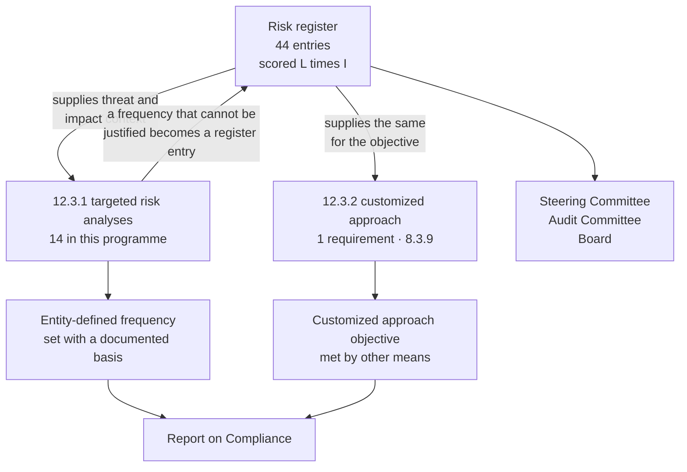

# 03.10 — Risk Assessment Methodology

| Field | Value |
|---|---|
| Document ID | MRG-PCI-2026-310 |
| Program | Marketa Retail Group — PCI DSS v4.0.1 Compliance Program |
| Phase | 03 — Network Segmentation &amp; Architecture |
| Version | 1.0 |
| Status | Approved |
| Owner | Owen Castellanos, Payment Card Compliance Manager |
| Approver | Naomi Bhatt, Chief Information Security Officer |
| Date | 2026-07-15 |
| Classification | Confidential — Cardholder Data Environment // Illustrative Portfolio Sample |

## Purpose

This document defines how Marketa scores, owns, moves and retires a risk. It is written before **03.11** rather than after it, because a register produced without a stated method is a list of opinions with numbers attached, and the first question a QSA, an internal auditor or a board member asks of a risk rated High is *"compared with what?"*

It covers the scoring model and the definitions behind every level; the impact dimension, which for a card-accepting retailer is not simply disclosure; how PCI DSS's **12.3** targeted risk analyses relate to — and differ from — an enterprise risk register; how the scores were calibrated so that two assessors reach the same number; who owns a risk and what ownership obliges; and the rule carried from **ADR-0005** that testing which disproves an assumption **raises** a rating.

## 1. What This Register Is, and Is Not

| The Phase 03 risk register **is** | The Phase 03 risk register **is not** |
|---|---|
| The programme's view of exposure across the payment estate, expressed so it can be compared, prioritised and tracked | A PCI DSS requirement in itself. **12.3.1** obliges targeted risk analyses; it does not oblige an enterprise register in this form |
| A **current residual** view — what the exposure is with the controls that exist today | An inherent-risk view. Nothing here is scored as though no control existed |
| Scored on evidence where evidence exists, and on structured judgement where it does not, with the basis stated | A quantitative model. No monetary figure appears in any entry |
| Owned line by line by a named executive who can direct the treatment | A security team artefact that other functions read |
| A document that goes **up** when the organisation learns something bad about itself | A progress report |
| The input to **12.3.1** analyses, to the QSA's understanding of the environment, and to the Board reporting in Phase 09 | A substitute for any of them |

The second row governs everything else. Marketa scores **residual** risk — the exposure that remains given the controls actually operating on the scoring date. An inherent-risk register, scored as though no control existed, produces a page of Highs, tells nobody anything they did not already know, and cannot move. The cost of scoring residually is that the register must be re-scored as controls land, which is why the baseline is dated and why Phase 09 reports the movement.

## 2. The Scoring Model

### 2.1 Likelihood × Impact

**Score = Likelihood (1–5) × Impact (1–5).**

| Band | Score | Meaning |
|---|---|---|
| **High** | **≥ 15** | Requires an owner, a dated treatment plan, and monthly reporting to the PCI Steering Committee. Cannot be accepted without CFO sign-off |
| **Moderate** | **8 – 12** | Requires an owner and a treatment plan with a target date. Reported quarterly |
| **Low** | **≤ 6** | Managed within business-as-usual controls. Reviewed at each register refresh; reported by exception |

A property of the model worth stating because it removes an argument: **the achievable products of two integers from 1 to 5 are 1, 2, 3, 4, 5, 6, 8, 9, 10, 12, 15, 16, 20 and 25.** There is no product of 7, 13 or 14. The bands therefore have no boundary cases and no gaps — every possible score falls unambiguously into one band, and no risk can sit "just below High" in a way that invites negotiation. A score of 12 is Moderate and a score of 15 is High, and nothing lies between them.

### 2.2 Likelihood

Likelihood is the probability that the risk **materialises to a degree that matters within twelve months**, assessed against the controls actually in place.

| Level | Label | Definition | Anchors from Marketa's own estate |
|---|---|---|---|
| **1** | Rare | No plausible pathway with current controls; would require a combination of failures with no precedent anywhere in the industry | A path from the internet directly to a Z1 component with no publicly accessible interface |
| **2** | Unlikely | A pathway exists but requires multiple independent control failures, or a capability, position or motivation Marketa's threat model does not attribute to a realistic adversary | Two independent enforcement layers on different management planes both misconfigured at a T1 boundary |
| **3** | Possible | A single credible pathway exists; comparable events occur across the retail sector; a plausible sequence of ordinary decisions could produce it | A contractor replaces a switch and patches by cable colour — **this happened at three stores in February 2026** |
| **4** | Likely | Expected to occur within the period absent further treatment; precursors are already observable in Marketa's environment or in its sector at high frequency | A marketing tag manager adding an undeclared script to a payment template — **3 of 38 scripts were unauthorised at first inventory** |
| **5** | Almost certain | Occurring now, or certain to occur within the period; the only open questions are scale and detection | Reserved. **No risk in the baseline register is scored 5 for likelihood** |

No baseline entry carries likelihood 5, and that is a deliberate discipline rather than optimism. A likelihood of 5 says the event is happening; if the programme believes that, the correct response is an incident, not a register row.

### 2.3 Impact — the retailer's version

This is where a generic model fails a card-accepting merchant. A confidentiality-integrity-availability scale calibrated for an information asset does not describe what actually happens to a Level 1 retailer when account data is exposed. **The worst case is not disclosure. It is a forensic investigation, a card reissuance population, brand-programme assessments passed through by the acquirer under the merchant agreement, and a payment channel that cannot trade while it is being investigated — simultaneously, during the quarter that carries the year.**

Marketa's impact dimension therefore has three components, and a level is assigned on **the highest** component that applies, not on an average.

| Component | What it measures |
|---|---|
| **A — Cardholder data exposure** | The volume, sensitivity and recoverability of account data placed at risk; whether sensitive authentication data is involved; whether the exposure is detectable and bounded |
| **B — Brand-programme consequence** | Obligations triggered under the card brand programmes and passed through by Cardinal under the merchant agreement — forensic investigation by a PFI, account data compromise reporting, reissuance populations, programme assessments, and validation status. **Described as categories. No amount is stated anywhere in this programme** |
| **C — Business interruption** | Loss of the ability to accept payment, in a channel or across the estate; store trading downtime; e-commerce availability; contact-centre availability; and the seasonal amplification from October to January |

| Level | Label | **A — data exposure** | **B — brand-programme consequence** | **C — business interruption** |
|---|---|---|---|---|
| **1** | Negligible | No account data involved | No obligation triggered | No customer-visible effect |
| **2** | Minor | Truncated PAN, tokens, or data from which account data cannot be reconstructed | Internal remediation; no external notification | Localised, short, recoverable within the day; one store or one function |
| **3** | Moderate | Account data exposure limited in volume and bounded in population; contained and evidenced | Acquirer notification under a defined obligation; a documented remediation plan; no forensic investigation | A channel degraded, or a region of stores affected, for hours |
| **4** | Major | Substantial account data exposure, or exposure whose bounds cannot be evidenced; historic data of unknown reach | Forensic investigation; **compliance validation status affected**; reporting obligations across multiple brands | A payment channel unavailable for a day or more, or the store estate degraded during trading |
| **5** | Severe | Full PAN at volume, or PAN with expiry and name, or any sensitive authentication data, with an unbounded or unprovable population | Forensic investigation, card reissuance across a large population, brand-programme assessments passed through under the merchant agreement, and a validation position that has to be rebuilt from a breach footing | Payment acceptance materially impaired across channels, or store estate unable to trade, **or any of the above during the October-to-January peak** |

Three notes on how this scale is applied, each of which changed at least one score in 03.11.

**Component B is why a scope-only failure is not automatically low impact.** SEG-PT-01 exposed no account data. Its impact was nonetheless rated 4, because the classification of 482 servers, the 12.5.2 confirmation and the validation position all rested on the boundary it broke. A merchant whose scope determination is unreliable has a compliance position it cannot defend, and that is a component-B consequence with no component-A content.

**Component C is rated against the seasonal calendar, not against an average day.** The same outage in March and in November are not the same event. Constraint **CON-01** — the October-to-January change freeze — exists because the business cannot absorb disruption in that quarter, and the impact scale reflects it explicitly in level 5.

**Impact is not reduced by the fact that a control is expected to prevent it.** That is what likelihood is for. Scoring impact "down" because a control exists double-counts the control and is the most common way a residual register quietly becomes optimistic.

### 2.4 Why no monetary quantification

| Reason | Detail |
|---|---|
| **No amount is stated anywhere in this programme** | Non-compliance and breach costs are described only as categories assessed against the acquirer and passed through under the merchant agreement. Inventing figures would misrepresent a contractual relationship whose terms are commercial and confidential |
| PCI DSS is **contractual, not statutory** | The Council writes the standard and does not enforce it; the card brands and the acquirer operate the programmes. There is **no PCI DSS certification for a merchant** and no fine schedule to model |
| Marketa is **privately held** | Not an SEC registrant; no SOX control population; no statutory disclosure model against which to calibrate a financial loss estimate |
| Precision would be false | A quantified register implies a confidence interval the underlying data does not support. The register is used to prioritise treatment, and an ordinal scale prioritises just as well without pretending to a precision it lacks |

## 3. PCI DSS 12.3 Targeted Risk Analyses Versus This Register

These are different objects with different purposes, and conflating them produces either a register that satisfies no requirement or fourteen documents nobody uses.

| Dimension | **12.3 targeted risk analysis** | **This risk register** |
|---|---|---|
| Required by the standard? | **Yes.** 12.3.1 for every requirement that permits an entity-defined frequency; 12.3.2 for every customized approach | **No.** 12.3.1 does not oblige an enterprise register in this form. Marketa maintains one because it is how the organisation manages, not because a requirement compels it |
| Unit of analysis | **One requirement**, and specifically the frequency or the objective of one requirement | **One exposure**, which may touch many requirements or none |
| Question answered | *Is this frequency, or this alternative control design, defensible for this asset and this threat?* | *Where is Marketa most exposed, and who is fixing it?* |
| Output | A documented analysis identifying the assets, the threats, the factors contributing to likelihood and impact, the resulting frequency or control design, and a review at least every 12 months | A scored, owned, dated register entry with a treatment plan |
| Audience | The QSA, in the Report on Compliance | The Steering Committee, the Audit Committee, the Board, and the QSA as context |
| Count in this programme | **14** targeted risk analyses under 12.3.1, plus **1** customized approach under 12.3.2 for **8.3.9** | **44** register entries at the Phase 03 baseline |
| Consequence of getting it wrong | The requirement is not met; the frequency has no defensible basis | The organisation prioritises the wrong work |

### 3.1 How they connect

The relationship runs in both directions and the register makes it explicit.

| Direction | Mechanism | Example |
|---|---|---|
| Register → targeted risk analysis | The register supplies the asset, threat and impact context a 12.3.1 analysis must document, so the analyses share one calibrated view rather than each inventing its own | The 13-month call-recording retention rule set under a 12.3.1 analysis draws its impact reasoning from **R-31** |
| Targeted risk analysis → register | Where an analysis concludes that a defensible frequency cannot be achieved with current capability, the shortfall becomes a register entry rather than a footnote | The **11.3.1.2** authenticated-scanning constraint on 9 vendor-locked appliances is **R-36** |
| Neither → the other | Some requirements have a cadence fixed by the standard and generate **no** targeted risk analysis at all | **1.2.7** six-monthly review, **11.4.5** annual-and-on-change testing, **11.2.1** quarterly wireless detection. 03.09 §6.1 states this in full: **Requirement 1 generates none of the 14** |

The third row is the one that keeps the count of 14 honest. A programme that produces a targeted risk analysis for every frequency in the standard, including the fixed ones, has misunderstood 12.3.1 and has produced evidence that will confuse an assessor rather than satisfy one.

## 4. Calibration

A five-by-five model is only as good as the consistency with which two people apply it. Marketa's calibration discipline has four parts.

| Mechanism | How it works |
|---|---|
| **Anchored definitions** | Every likelihood and impact level carries a definition and, where possible, an anchor drawn from an event that actually happened in Marketa's estate — see the right-hand column of §2.2. Assessors score against the anchor, not against the adjective |
| **Reference cases** | Five entries are designated reference cases and are re-scored at every register refresh by two assessors independently. Divergence greater than one level on either axis triggers a definition review rather than a negotiation |
| **Two-assessor scoring** | Every entry is scored by the risk owner's delegate **and** by the Payment Card Compliance Manager, independently, before the values meet. Differences are resolved by argument recorded in the entry's basis field, not by averaging |
| **Distribution challenge** | The completed register's distribution is challenged as a whole. A register with 30 Highs has not prioritised anything; a register with 2 has not looked. **9 of 44 High — 20.5% — was tested against the argument that it is too many and against the argument that it is too few, and both challenges are recorded** |

### 4.1 The reference cases

| Reference | Risk | Score | Why it is an anchor |
|---|---|---|---|
| **RC-1** | **R-14** — store segmentation ineffective | 4 × 4 = 16, High | The only entry whose likelihood is grounded in a demonstrated event rather than an estimate. It anchors likelihood 4 |
| **RC-2** | **R-01** — payment-page script injection | 4 × 5 = 20, High | Highest score in the register. It anchors impact 5 and the top of the scale |
| **RC-3** | **R-19** — decommissioned assets remaining live | 3 × 3 = 9, Moderate | Carried unchanged from Phase 02 with a measured base rate — 6 of 137, 4.4%. It anchors likelihood 3 with real data |
| **RC-4** | **R-40** — awareness completion falls below the charter bar | 2 × 2 = 4, Low | Measured at 97.1% against a 95% bar. It anchors the bottom of the scale and demonstrates that Low means Low, not unexamined |
| **RC-5** | **R-09** — TPSP concentration on a single provider | 3 × 5 = 15, High | A structural risk with no treatment that reduces it below Moderate. It anchors the distinction between *untreated* and *irreducible* |

### 4.2 The distribution challenge, recorded

| Challenge | Response |
|---|---|
| *"Nine High risks in a programme this far advanced is too many. It reads as a programme that is behind."* | Two of the nine were **raised on evidence** and cannot come down without operating history. Four are **structural** and reduce to Moderate at best. The remaining three are the two eventual Not-in-Place ROC items and the payment-page exposure that the future-dated requirements 6.4.3 and 11.6.1 exist to address, none of which is fully treated at 2026-07-15. A distribution that showed fewer would be describing a different July |
| *"Nine High is too few for a first-year v4.0.1 programme with 51 future-dated requirements newly in force."* | The register is scored **residual**, and by July the Requirement 1 controls, the scope reduction, P2PE, tokenisation and DTMF masking are all operating. An inherent-risk register for the same estate would carry substantially more Highs and would not be a useful management document |
| *"Fourteen Low entries look like padding."* | Each of the fourteen has an owner, a treating requirement and a measured or evidenced basis. A register that omits low-scored exposures cannot demonstrate coverage, and coverage is what §3 of 03.12 tests in reverse |

## 5. Ownership

| Rule | Detail |
|---|---|
| **Every risk has exactly one owner** | A named individual from the register in FACTS §5, not a team, a function or a committee. Shared ownership is unowned |
| **The owner is the person who can direct the treatment** | Not the person closest to the technology. R-13, seasonal workforce access, is owned by the Director of Store Operations rather than by security, because store operations controls the onboarding process |
| **The risk owner and the control owner may differ** | The owner is accountable for the exposure; control owners are accountable for the mechanisms. 03.12 maps both |
| **Only the owner may propose a score change**, and only with evidence | The Payment Card Compliance Manager records it; the CISO approves any movement into or out of the High band |
| **Acceptance is an executive act** | A High risk can be accepted only by the CFO as executive sponsor, in writing, with an expiry date. No High risk in the baseline register is accepted |
| **Ownership is confirmed at each refresh** | An owner who has moved role, or who declines the entry, is a register defect and is escalated at the next Steering Committee |

| Owner | Baseline entries | Of which High |
|---|---|---|
| Trevor Kim — Director of Infrastructure &amp; Network | 13 | 4 |
| Marcus Hale — Security Operations Manager | 10 | 0 |
| Owen Castellanos — Payment Card Compliance Manager | 6 | 1 |
| Adaeze Nwosu — Director of Store Operations | 5 | 2 |
| Bill Traynor — Call Centre Operations Manager | 4 | 1 |
| Elena Marchetti — VP Payment Operations | 3 | 0 |
| Sonia Rendell — Director of E-Commerce Engineering | 3 | 1 |
| **Total** | **44** | **9** |

The concentration on Trevor Kim is visible and is recorded as a delivery concern rather than presented as a coincidence: four of nine High risks sit with the network director in a programme where **CON-07** already flags competing demands on the same nine network engineers. It is why **R-41** exists and why sequencing rather than effort is the constraint the Steering Committee manages.

## 6. Movement — What Raises and Lowers a Score

### 6.1 The rule carried from ADR-0005

> **Where independent discovery or testing disproves an assumption underlying a risk rating, the rating is raised or restored — regardless of whether the specific instance has been remediated.**

The reasoning is short and it does not weaken on repetition. A risk rating is not a statement about one location or one device. It is a statement about a **class of exposure across an environment**, and it encodes a belief about how well that environment is understood. Remediating the instance removes the instance. It does not restore the belief, because the belief was never about the instance.

| Entry | Assumption disproved | Rating | What remediation did and did not do |
|---|---|---|---|
| R-31 | **A-04** — DTMF masking had eliminated spoken account data from the call estate. The control was forward-only and had never been applied to what already existed | Raised to 4 × 4 = 16 on **2026-02-05**, two days after confirmation and while remediation was already running | Deleting 11,400 recordings removed the recordings. It did not establish that Marketa knows what it holds. **Exit: a second full discovery run returning nothing, due 2026-08-31** |
| R-14 | **A-09** — configuration verification across 482 sites establishes segmentation effectiveness | Raised to 4 × 4 = 16 on **2026-05-18**, three days after the demonstration | Fixing store 0417 and the estate removed the path. It did not establish that Marketa would notice the next one. **Exit: a clean re-test plus 90 consecutive days with no segmentation-determining divergence — count reset 2026-07-03 by a real recurrence** |

Both entries sit at High in a register published after both were fully remediated. That is the intended result, it looks worse than the alternative, and it is more accurate. **The exposure on the day before a discovery and the day after are identical; what changes is what the organisation knows, and a register exists to record what the organisation knows.**

### 6.2 The general movement rules

| Movement | Trigger | Evidence required |
|---|---|---|
| **Raise** | An assumption is disproved by testing or discovery; an incident occurs in the class; a control is found not to be operating; the threat environment for the class changes materially | The disproof itself. **No corroboration is required to raise a rating** |
| **Raise** | A control the score depended on is withdrawn, deferred beyond its target date, or found to have a coverage gap | The delivery record |
| **Lower — likelihood** | A treating control is **operating**, with evidence, for a defined period appropriate to the control's cadence | Operating evidence, not implementation evidence. A control implemented last week has no operating history |
| **Lower — impact** | The population, data or dependency has genuinely changed — scope reduced, data eliminated, dependency removed | Discovery or inventory evidence |
| **Lower an evidence-raised entry** | **Only on the entry's own stated exit criterion.** Never on remediation of the triggering instance | The named criterion, met and dated |
| **Close** | The exposure no longer exists because the asset, process or dependency is gone | Decommission or contract-termination evidence |
| **Accept** | Business decision that the residual is tolerable | Written acceptance; CFO for High; expiry date; re-presented at expiry |

The asymmetry between raising and lowering is deliberate and is stated as a principle: **a rating goes up on a single piece of evidence and comes down on a pattern.** One disproof is sufficient to conclude the environment was misunderstood. One clean test is not sufficient to conclude it is now understood — which is exactly the distinction 03.08 draws between proving the boundary and proving the process.

### 6.3 Refresh cadence

| Event | Action |
|---|---|
| **Baseline** | Established at Phase 03, dated **2026-07-15**. 44 entries, 9 High, 21 Moderate, 14 Low |
| Monthly | High entries reviewed at the PCI Steering Committee with movement, evidence and dates |
| Quarterly | Full register refresh; all entries re-scored where evidence has changed; Audit Committee reporting |
| **On event** | Any disproved assumption, penetration test finding, incident, or control-coverage gap triggers an immediate out-of-cycle entry or re-score. R-14 was raised three days after the demonstration under this rule |
| At programme close | Phase 09 reports the movement from baseline, entry by entry, with the evidence for every reduction |

## 7. What the Methodology Deliberately Does Not Do

| Omission | Reason |
|---|---|
| No inherent-risk column | It would be a column of Highs, it would not move, and nobody would use it to make a decision |
| No risk appetite statement expressed as a numeric threshold | Marketa's appetite is expressed as governance: High risks require CFO acceptance and none is accepted. A numeric appetite invites scoring to the threshold |
| No aggregation of scores into a single index | Summing ordinal scores produces a number with no meaning that moves for reasons nobody can explain |
| No probability percentages | The organisation does not have the base-rate data to support them for most entries, and asserting them would be the false-precision problem in §2.4 |
| No automatic reduction on control implementation | Implementation is not operation. A control reduces likelihood when it has run and produced evidence, not when it is deployed |
| No netting of a discovery against its remediation | 02.11 §6 sets this out at length. Presenting a discovery and its fix as a single closed item presents the **discovery** as the risk event, when the discovery was the mitigation |

## Cross-References

| Reference | Relevance |
|---|---|
| 01.06 — Program Charter &amp; Objectives | Governance cadence; the Steering Committee and Audit Committee reporting lines |
| 01.08 — Scope Assumptions &amp; Constraints | Constraints CON-01, CON-02, CON-03, CON-07 and CON-09, which several entries are scored against |
| 02.03 — Unexpected PAN Locations &amp; Response | R-31's basis and the reasoning against netting discovery off against remediation |
| 02.11 — Assumption Test Results | The disposition taxonomy; A-04 and A-07 disproved; R-08, R-19 and R-22 created |
| ADR-0005 — Raise a Risk When Discovery Disproves an Assumption | The rule in §6.1, applied to both evidence-raised entries |
| 03.07 — Segmentation Penetration Test | R-14's basis and its exit criterion |
| 03.08 — Remediation &amp; Re-Test | Why a clean re-test does not lower an evidence-raised entry |
| 03.09 — NSC Ruleset Governance | Why Requirement 1 generates none of the 14 targeted risk analyses |
| 03.11 — Risk Register | The 44 entries scored under this methodology |
| 03.12 — Control-to-Risk Traceability | How each entry is treated, and which entries are structural |
| Phase 07 — Security Policy, Risk &amp; Incident Response | Where the register is formally adopted into the policy set and 12.3 is discharged in full |
| Phase 09 — Executive Reporting &amp; Continuous Compliance | Movement from this baseline to the close position |

---
[⬅ Previous](03.09-nsc-ruleset-governance.md) · [🏠 Phase 03 Home](03.00-README.md) · [Next ➡](03.11-risk-register.md)
