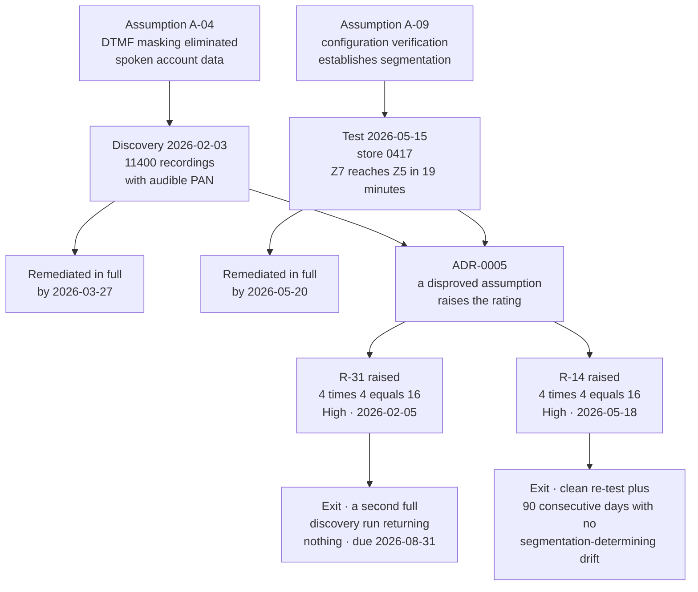

# 03.11 — Risk Register

| Field | Value |
|---|---|
| Document ID | MRG-PCI-2026-311 |
| Program | Marketa Retail Group — PCI DSS v4.0.1 Compliance Program |
| Phase | 03 — Network Segmentation &amp; Architecture |
| Version | 1.0 |
| Status | Approved |
| Owner | Owen Castellanos, Payment Card Compliance Manager |
| Approver | Naomi Bhatt, Chief Information Security Officer |
| Date | 2026-07-15 |
| Classification | Confidential — Cardholder Data Environment // Illustrative Portfolio Sample |

## Purpose

The **baseline risk register** for the Marketa Retail Group PCI DSS v4.0.1 programme: **44 risks — 9 High, 21 Moderate, 14 Low**, scored under the methodology in 03.10, each with a named owner and the requirement or requirements that will treat it.

It is a baseline in the strict sense. It is dated **2026-07-15**, it reflects the controls actually operating on that date, and every later movement is measured against it. Phase 09 reports the close position; the treatment mapping and the expected residual are 03.12.

The register is specific to what Marketa is: a **Level 1 omnichannel specialty retailer** with 482 stores, 1,914 lanes, a hosted-iframe e-commerce channel, an in-house contact centre, a single tokenisation provider across all three channels, a seasonal workforce of up to 6,800, and an estate that has just failed and passed a segmentation penetration test. A generic register would not contain half of these entries, and the half it would omit is the half that describes this company.

**Two entries — R-14 and R-31 — were raised on evidence rather than identified in analysis.** They are marked **‡** and are the subject of §4. Both are High, both are High *after* complete remediation, and both stay High until an exit criterion that has nothing to do with remediation is met.

## 1. Distribution

| Rating | Score range | Count | Share |
|---|---|---|---|
| **High** | ≥ 15 | **9** | 20.5% |
| **Moderate** | 8 – 12 | **21** | 47.7% |
| **Low** | ≤ 6 | **14** | 31.8% |
| **Total** | | **44** | 100% |

| Category | Entries | High | Moderate | Low |
|---|---|---|---|---|
| Account Data | 6 | 1 | 3 | 2 |
| Network &amp; Segmentation | 5 | 2 | 3 | 0 |
| Identity &amp; Access | 5 | 1 | 4 | 0 |
| Payment Channel | 5 | 2 | 2 | 1 |
| Vulnerability &amp; Change | 6 | 1 | 4 | 1 |
| Third Party | 3 | 1 | 1 | 1 |
| Physical &amp; Device | 3 | 1 | 0 | 2 |
| Monitoring &amp; Detection | 4 | 0 | 1 | 3 |
| Cloud | 2 | 0 | 2 | 0 |
| Governance &amp; People | 5 | 0 | 1 | 4 |
| **Total** | **44** | **9** | **21** | **14** |

| Owner | Entries | High |
|---|---|---|
| Trevor Kim — Director of Infrastructure &amp; Network | 13 | 4 |
| Marcus Hale — Security Operations Manager | 10 | 0 |
| Owen Castellanos — Payment Card Compliance Manager | 6 | 1 |
| Adaeze Nwosu — Director of Store Operations | 5 | 2 |
| Bill Traynor — Call Centre Operations Manager | 4 | 1 |
| Elena Marchetti — VP Payment Operations | 3 | 0 |
| Sonia Rendell — Director of E-Commerce Engineering | 3 | 1 |
| **Total** | **44** | **9** |

## 2. The Register

Scored **Likelihood (1–5) × Impact (1–5)**. **High ≥ 15 · Moderate 8–12 · Low ≤ 6.** Impact is assessed on the highest of three components — cardholder data exposure, brand-programme consequence, and business interruption — per 03.10 §2.3. **‡** marks an entry raised on evidence rather than identified in analysis.

| ID | Risk | Category | L | I | Score | Rating | Owner | Treating requirement(s) |
|---|---|---|---|---|---|---|---|---|
| **R-01** | Unauthorised or malicious script executing in the consumer browser on a payment page harvests card data before it reaches the Truvance iframe — PAN never touches a Marketa server and Marketa is still the party that served the page | Payment Channel | 4 | 5 | 20 | High | Sonia Rendell | 6.4.3, 11.6.1, 6.4.1, 6.4.2, 6.5.1, 12.10.1 |
| **R-02** | POI device tampering, skimmer overlay or whole-device substitution across 1,914 terminals in 482 buildings that are unattended overnight and staffed by a workforce that turns over seasonally | Physical &amp; Device | 3 | 5 | 15 | High | Adaeze Nwosu | 9.5.1, 9.5.1.1, 9.5.1.2, 9.5.1.3, 12.10.4, 12.6.3 |
| **R-03** | Store network flatness — the store fabric is one switch performing inter-VLAN routing, so guest, colleague, operations, payment-device and management traffic are separated by a single configuration layer with no second enforcement plane | Network &amp; Segmentation | 3 | 4 | 12 | Moderate | Trevor Kim | 1.2.1, 1.3.1, 1.3.3, 1.4.1, 11.4.5 |
| **R-04** | Configuration drift returns to the store estate faster than assurance detects it, because 482 sites are maintained by field engineering and local contractors carrying their own stock configurations | Network &amp; Segmentation | 3 | 4 | 12 | Moderate | Trevor Kim | 1.2.8, 1.2.2, 2.2.1, 11.4.5 |
| **R-05** | A P2PE condition fails at one or more stores — a POI patched into the general data VLAN, an unlisted device, a lapsed solution listing — invalidating the card-present scope reduction that removes 1,914 lanes and 482 servers from the assessed population | Payment Channel | 3 | 5 | 15 | High | Adaeze Nwosu | 12.5.2, 9.5.1.1, 1.3.1, 11.4.5, 12.8.4 |
| **R-06** | New unstructured repositories — shares, sites, document stores, ticket attachments — accumulate account data faster than quarterly discovery finds them | Account Data | 3 | 4 | 12 | Moderate | Marcus Hale | 3.2.1, 3.3.1, 9.4.1, 12.5.2, 12.10.7 |
| **R-07** | Account data arrives in the messaging and collaboration estate from a customer or a colleague and comes to rest in a mailbox or archive | Account Data | 2 | 3 | 6 | Low | Marcus Hale | 3.2.1, 12.10.7, 12.6.3, 5.4.1 |
| **R-08** | Account data is created as a by-product of a business process nobody has mapped — a report, an export, a reconciliation artefact, a scanned attachment | Account Data | 3 | 4 | 12 | Moderate | Elena Marchetti | 12.5.2, 3.2.1, 3.3.1, 12.10.7 |
| **R-09** | Third-party service provider concentration — Truvance Payments is hosted checkout, gateway and the single token vault across card-present, e-commerce and MOTO simultaneously; a failure, breach or contractual discontinuity at one provider affects every channel at once | Third Party | 3 | 5 | 15 | High | Owen Castellanos | 12.8.1, 12.8.2, 12.8.3, 12.8.4, 12.8.5, 12.10.1 |
| **R-10** | A provider's validation lapses inside the compliance year — a P2PE Attestation of Validation, a service provider AOC, or a Council listing — and Marketa continues to rely on a reduction that no longer has a basis | Third Party | 3 | 4 | 12 | Moderate | Elena Marchetti | 12.8.4, 12.8.5, 12.5.2 |
| **R-11** | Responsibility gap between Marketa and Northbridge Managed Services for after-hours detection, triage and escalation, such that an event is seen by neither party | Third Party | 2 | 3 | 6 | Low | Marcus Hale | 12.8.2, 12.8.5, 12.10.1, 10.4.1 |
| **R-12** | Insider misuse in dispute, chargeback and refund handling, where full PAN is legitimately visible to a person doing their job and the control is authorisation and monitoring rather than elimination | Identity &amp; Access | 3 | 4 | 12 | Moderate | Elena Marchetti | 7.2.1, 7.2.2, 7.2.4, 8.2.1, 10.2.1, 3.4.1 |
| **R-13** | Seasonal workforce access — up to 6,800 temporary colleagues onboarded at speed in October and offboarded slowly or not at all in February, inside the change freeze and at peak transaction volume | Identity &amp; Access | 4 | 3 | 12 | Moderate | Adaeze Nwosu | 8.2.4, 8.2.5, 8.2.6, 7.2.4, 7.2.5, 12.6.3 |
| **R-14** | **‡** Segmentation controls in the store estate are not effective, permitting a lower-trust zone to reach a governed zone. **Raised on evidence 2026-05-18** under ADR-0005, on the disproof of the assumption that configuration verification across 482 sites establishes segmentation effectiveness | Network &amp; Segmentation | 4 | 4 | 16 | High | Trevor Kim | 11.4.5, 1.2.2, 1.2.8, 1.3.3, 12.5.2 |
| **R-15** | The legacy pre-shared key remnant — 214 store appliances at 138 stores sharing one static WPA2-PSK that cannot be revoked for one holder, attributed to one holder, or rotated without a field operation across 138 sites | Network &amp; Segmentation | 3 | 4 | 12 | Moderate | Trevor Kim | 2.3.2, 1.3.3, 1.2.6, 11.2.1, CAP-05 |
| **R-16** | An unauthorised wireless access point is installed in a store — by a colleague solving a coverage problem or by an adversary — and is not detected before the next quarterly scan | Monitoring &amp; Detection | 2 | 3 | 6 | Low | Trevor Kim | 11.2.1, 11.2.2, 12.10.5, 1.3.3 |
| **R-17** | Application and system accounts hold embedded, non-rotatable credentials in legacy batch integrations, with interactive use possible and no individual attribution | Identity &amp; Access | 4 | 4 | 16 | High | Trevor Kim | 8.6.1, 8.6.2, 8.6.3, 2.2.2, 8.3.6 |
| **R-18** | Privileged access to an NSC management plane — including CT-48, which determines the segmentation state of 978 store systems and 1,914 POI devices — is obtained from a workstation that also carries general network and email access | Identity &amp; Access | 3 | 4 | 12 | Moderate | Trevor Kim | 1.5.1, 8.4.2, 8.4.3, 7.2.2, 2.2.7 |
| **R-19** | Assets recorded as decommissioned remain powered, network-reachable or holding retained storage, and are therefore excluded from scanning, patching and monitoring while still being part of the estate | Vulnerability &amp; Change | 3 | 3 | 9 | Moderate | Trevor Kim | 12.5.1, 12.5.2, 9.4.6, 2.2.1, 11.3.1 |
| **R-20** | Destructive or extortion malware interrupts trading across the store estate or the distribution network, with recovery competing against the trading calendar | Vulnerability &amp; Change | 3 | 4 | 12 | Moderate | Marcus Hale | 5.2.1, 5.3.1, 5.3.2, 5.3.3, 12.10.1, 12.10.3, 12.10.5 |
| **R-21** | Phishing delivers a foothold in corporate end-user computing that is used to reach administrative services and, from there, the brokered path toward the CDE | Identity &amp; Access | 4 | 3 | 12 | Moderate | Marcus Hale | 5.4.1, 8.4.2, 12.6.3, 1.5.1, 5.2.1 |
| **R-22** | Customer-initiated account data arrives by email, web form free-text field or special-order note, creating PAN in a system that was never designed to hold it | Account Data | 3 | 3 | 9 | Moderate | Bill Traynor | 3.2.1, 12.10.7, 12.6.3, 6.4.1 |
| **R-23** | A telephony routing or platform change moves the DTMF suppression point downstream of Marketa, putting spoken account data into Marketa's telephony and recording estate — condition MOTO-C2 | Payment Channel | 2 | 5 | 10 | Moderate | Bill Traynor | 12.5.2, 1.2.2, 3.2.1, 12.8.5, 12.10.7 |
| **R-24** | Call recordings are retained beyond the thirteen-month rule because a platform default, a legal hold or a migration reinstates the previous retention period | Account Data | 2 | 2 | 4 | Low | Bill Traynor | 3.2.1, 9.4.7, 12.3.1, 3.1.1 |
| **R-25** | A cloud segmentation boundary is changed by a single authorised API call that completes in under a second, with no outage, no symptom and no artefact other than a log entry | Cloud | 3 | 4 | 12 | Moderate | Trevor Kim | 1.2.2, 1.2.8, 10.2.1, 11.4.5, 7.2.2 |
| **R-26** | Cloud logging is disabled, diverted, or not monitored for absence, removing the only record that a boundary was changed or a principal acted | Cloud | 2 | 4 | 8 | Moderate | Marcus Hale | 10.2.1, 10.3.2, 10.3.4, 10.5.1, 10.7.2 |
| **R-27** | Compromise of the security and administrative services zone yields the identity, patching, endpoint, backup, secrets and privileged-brokering paths into the CDE simultaneously — the concentration cost of routing every crossing through one zone | Network &amp; Segmentation | 3 | 5 | 15 | High | Trevor Kim | 7.2.2, 8.4.2, 1.3.1, 10.2.1, 11.4.5, 6.3.3 |
| **R-28** | Automated log review fails silently — a parser breaks, a source stops, a rule stops matching — and a detection gap persists undetected behind a dashboard that still looks healthy | Monitoring &amp; Detection | 3 | 4 | 12 | Moderate | Marcus Hale | 10.4.1, 10.4.1.1, 10.4.2, 10.7.2, 10.7.3 |
| **R-29** | A quarterly ASV scan fails and remediation plus rescan is not achieved inside the thirty-day attestation window under obligation C4 | Vulnerability &amp; Change | 3 | 2 | 6 | Low | Owen Castellanos | 11.3.2, 11.3.2.1, 6.3.3, 6.5.1 |
| **R-30** | High and critical vulnerabilities are not remediated within one month across the store and appliance estate, because patching 482 sites competes with trading and stops entirely from October to January | Vulnerability &amp; Change | 3 | 4 | 12 | Moderate | Trevor Kim | 6.3.1, 6.3.3, 11.3.1, 11.3.1.1, 6.3.2 |
| **R-31** | **‡** Historical account data persists in the call-recording estate and in other unstructured stores, beyond the reach of a forward-only control. **Raised on evidence 2026-02-05** under ADR-0005, on the disproof of the assumption that DTMF masking had eliminated spoken account data | Account Data | 4 | 4 | 16 | High | Bill Traynor | 3.2.1, 12.10.7, 9.4.7, 12.3.1, 12.5.2 |
| **R-32** | A boundary-affecting change is classified as routine, receives no scope-delta review, no second approver and no re-test obligation, and quietly alters what a zone can reach | Vulnerability &amp; Change | 3 | 4 | 12 | Moderate | Trevor Kim | 1.2.2, 6.5.1, 11.4.5, 12.5.2, 1.2.3 |
| **R-33** | Scope creep — a new system, integration, acquisition channel or merchant identifier enters the estate without a scope determination, and the assessed population no longer describes the environment | Governance &amp; People | 3 | 4 | 12 | Moderate | Owen Castellanos | 12.5.1, 12.5.2, 6.5.1, 12.8.1 |
| **R-34** | The payment-page script inventory drifts as marketing and analytics tooling is added through a tag manager by people who do not know a payment template from a product page | Payment Channel | 4 | 3 | 12 | Moderate | Sonia Rendell | 6.4.3, 11.6.1, 6.5.1, 12.6.3 |
| **R-35** | An application flaw in the storefront exposes order data, tokens or customer records — no PAN, because the iframe holds it, and a customer-facing incident nonetheless | Payment Channel | 3 | 2 | 6 | Low | Sonia Rendell | 6.2.1, 6.2.4, 6.3.2, 6.4.1, 11.3.2 |
| **R-36** | Nine vendor-locked POS back-office appliances cannot be authenticated-scanned under constraint CON-03, leaving their vulnerability state unknown on components that are inside the assessed population | Vulnerability &amp; Change | 4 | 4 | 16 | High | Trevor Kim | 11.3.1.2, 6.3.3, 2.2.1, 12.8.5, 11.3.1.1 |
| **R-37** | File integrity and change-detection coverage lapses on a CDE component — an agent stops, a baseline is not re-established after a change, an exclusion is widened | Monitoring &amp; Detection | 2 | 3 | 6 | Low | Marcus Hale | 11.5.2, 10.3.4, 10.7.2, 6.5.1 |
| **R-38** | Physical access to store stockrooms and network cabinets is not controlled to the standard the network design depends on, so a person with a cable has the access the segmentation model assumes they do not | Physical &amp; Device | 3 | 2 | 6 | Low | Adaeze Nwosu | 9.1.1, 9.2.1, 9.2.2, 9.3.1, 9.5.1 |
| **R-39** | Media containing account data — dispute paperwork, signed drafts, retired drives, receipt stock — is disposed of without a certificate of destruction or is held past its retention period | Physical &amp; Device | 2 | 3 | 6 | Low | Adaeze Nwosu | 9.4.5, 9.4.6, 9.4.7, 3.2.1 |
| **R-40** | Security awareness completion falls below the charter bar during seasonal onboarding, when the population most likely to encounter a skimmer or a social-engineering attempt is the newest | Governance &amp; People | 2 | 2 | 4 | Low | Owen Castellanos | 12.6.1, 12.6.2, 12.6.3, 12.6.3.1 |
| **R-41** | Programme capacity is lost to trading-critical work and a store-side control misses the 2026-09-30 cut-off imposed by the seasonal freeze, leaving it without operating history before QSA fieldwork | Governance &amp; People | 3 | 2 | 6 | Low | Owen Castellanos | 12.1.1, 12.4.1, 12.5.2 |
| **R-42** | Evidence produced during the year is not retained in a form the assessor can sample in November — screenshots without dates, reports without populations, attestations without a named attester | Governance &amp; People | 2 | 3 | 6 | Low | Owen Castellanos | 12.5.2, 11.4.1, 10.5.1, 12.1.1 |
| **R-43** | Incident response procedures are documented but not exercised against the scenarios this estate actually produces — PAN found where it is not expected, a POI substitution, a rogue access point, a failed segmentation boundary | Governance &amp; People | 2 | 3 | 6 | Low | Marcus Hale | 12.10.1, 12.10.2, 12.10.4, 12.10.5, 12.10.7 |
| **R-44** | Time synchronisation drifts or a log source is lost without alerting, degrading the forensic record on which any investigation of the entries above would depend | Monitoring &amp; Detection | 2 | 2 | 4 | Low | Marcus Hale | 10.6.1, 10.6.2, 10.6.3, 10.7.2, 10.5.1 |

## 3. The Nine High Risks

| ID | Risk, in short | Score | Owner | Why it is High rather than Moderate |
|---|---|---|---|---|
| R-01 | Payment-page script injection | 20 | Sonia Rendell | The only entry at impact 5 **and** likelihood 4. Marketa serves the page; 38 scripts across 6 templates, 11 third-party; **3 were unauthorised at first inventory**, which is a measured likelihood rather than an estimate. The iframe protects the field, not the page |
| R-02 | POI tampering and substitution | 15 | Adaeze Nwosu | 1,914 devices, 482 buildings, a public-facing surface, and a workforce that grows by 6,800 in the quarter when the devices are least watched. Impact 5 because a substituted device captures data before the SRED function ever sees it |
| R-05 | P2PE condition failure | 15 | Adaeze Nwosu | The single largest scope reduction in the programme rests on conditions that are operational, not cryptographic. **Three stores were already found in a non-conforming state in February 2026** |
| R-09 | TPSP concentration | 15 | Owen Castellanos | One provider is checkout, gateway and token vault across all three channels. Marketa's controls cannot reduce this below Moderate; only a second provider could, and that is a multi-year commercial decision |
| R-14 ‡ | Store segmentation ineffective | 16 | Trevor Kim | **Raised on evidence.** Likelihood 4 is not a forecast — the event occurred on 2026-05-15 and both preconditions recurred independently within five weeks of the re-test |
| R-17 | Embedded credentials in system accounts | 16 | Trevor Kim | A known, located, enumerated gap in two legacy batch integrations that becomes one of the **two Not in Place findings** in the ROC. Scoring it below High would be scoring against the evidence |
| R-27 | Administrative-services zone concentration | 15 | Trevor Kim | Deliberate design under principle SP-4. Concentrating the crossings makes the boundary testable and makes one zone worth seven paths. The register prices the trade rather than presenting it as an unmixed good |
| R-31 ‡ | Historical unstructured account data | 16 | Bill Traynor | **Raised on evidence.** Approximately 11,400 recordings and 2,187 documents found in populations no inventory covered. Remediated in full, and still High |
| R-36 | Vendor-locked appliances unscannable | 16 | Trevor Kim | Nine of 71 assessed components whose vulnerability state is unknown, under a constraint that predates the programme. The **second Not in Place finding** in the ROC |

**No High risk in this register is accepted.** Every one carries a treatment plan, an owner and a date, and the CFO acceptance route in 03.10 §5 has not been used.

## 4. The Two Entries Raised on Evidence

Forty-two of these entries were identified by analysis — by walking a data flow, reading a requirement, modelling a threat, or asking what a competent adversary would try. Two were not. Two exist because Marketa went looking, found something, and wrote down what the finding meant rather than what the fix achieved.

| Dimension | R-31 | R-14 |
|---|---|---|
| Assumption disproved | **A-04** — no account data in the call-recording estate | **A-09** — store back-office segmented from corporate, and guest wireless from back-office |
| How it was disproved | Audio discovery pipeline built specifically because 01.08 listed historical data as a blind spot | **11.4.5** penetration test scoped so that failure was possible |
| Date of disproof | 2026-02-03 | 2026-05-15 |
| Date raised | **2026-02-05** — two days later, while remediation was already running | **2026-05-18** — three days later |
| Instance remediated | Yes, in full, by 2026-03-27 | Yes, in full, by 2026-05-20 |
| Rating after remediation | **16, High** | **16, High** |
| What the rating is about | Not the 11,400 recordings. Whether Marketa knows what it holds | Not store 0417. Whether Marketa knows the state of its own store networks |
| Exit criterion | A **second full discovery run** across the same populations returning nothing — due 2026-08-31 | A clean re-test **plus** 90 consecutive days with no segmentation-determining divergence across 482 stores |
| Exit status at baseline | Open. Second run scheduled | Open. Re-test passed 2026-06-26; **the 90-day count was reset on 2026-07-03** by a real recurrence at store 0629. Earliest exit 2026-09-30 |

The register's most uncomfortable property is visible in the last two rows of that table. **Both of these risks are High in a document published after both were completely remediated, and one of them has already had its exit clock reset by the estate doing the same thing again.** A register that netted discovery off against remediation would show two closed items and a tidier distribution. It would also be describing an organisation that had learned nothing, and the whole argument for ADR-0005 is that the learning is the thing worth recording.

## 5. What Is Deliberately Not in This Register

Naming the omissions is part of demonstrating coverage.

| Not included | Why |
|---|---|
| Risks arising from statutory or regulatory obligations | PCI DSS is **contractual, not statutory**. Marketa is privately held, is not an SEC registrant and has no SOX control population. Statutory privacy and consumer obligations are managed by the General Counsel's function and sit in a different register |
| A risk that "Marketa fails the assessment" | Not a risk; an outcome of the risks already listed. Treating it as an entry would double-count every other line and would invite the register to be managed toward an audit result rather than toward exposure |
| Monetary loss estimates against any entry | No amount is stated anywhere in this programme. Brand-programme consequences are described as categories assessed against the acquirer and passed through under the merchant agreement |
| A separate entry for each of the four PAN discovery findings | R-06, R-08, R-19, R-22 and R-31 carry the distinct **root causes**; the findings themselves are closed. ADR-0005 records the decision to create risks by root cause rather than by instance |
| Inherent-risk scores | 03.10 §7. They would be a column of Highs that never moves |
| Risks owned outside the payment estate | Supply chain, merchandising, property, employment. Real, and not this register's subject |

## 6. Register Governance

| Element | Position |
|---|---|
| Baseline date | **2026-07-15** |
| Review cadence | High entries monthly at the PCI Steering Committee; full refresh quarterly; Audit Committee quarterly; out-of-cycle on any disproved assumption, penetration test finding, incident or control-coverage gap |
| Score changes | Proposed only by the risk owner, with evidence; recorded by the Payment Card Compliance Manager; movement into or out of the High band approved by the CISO |
| Acceptance | High requires written CFO acceptance with an expiry date. **None accepted at baseline** |
| Relationship to 12.3 | The register supplies context to the **14** targeted risk analyses under 12.3.1 and the **1** customized approach under 12.3.2; it does not replace them — 03.10 §3 |
| Formal adoption into the policy set | Phase 07, where 12.3 is discharged in full |
| Close position | Reported in Phase 09 against this baseline, entry by entry, with the evidence for every reduction |
| Tracker | Generated by parsing this document's table, with assertions on the counts, so the workbook cannot drift from the prose |

## Cross-References

| Reference | Relevance |
|---|---|
| 01.08 — Scope Assumptions &amp; Constraints | Constraints CON-01, CON-02, CON-03, CON-07 and CON-09 behind R-04, R-13, R-30, R-36 and R-41 |
| 02.03 — Unexpected PAN Locations &amp; Response | The four findings behind R-06, R-08, R-19, R-22 and R-31 |
| 02.04 — Card-Present Channel Scope | P2PE conditions behind R-05; the three non-conforming stores of February 2026 |
| 02.05 — E-Commerce Channel Scope | The 38 scripts and 6 templates behind R-01 and R-34 |
| 02.06 — Call Centre / MOTO Channel Scope | Condition MOTO-C2 behind R-23; the recording estate behind R-24 and R-31 |
| 02.08 — Connected-To &amp; Security-Impacting Systems | Group G10 and condition SEG-C5 behind R-18; the 63 connected-to components |
| 02.11 — Assumption Test Results | R-08, R-19, R-22 as created there; R-31's basis; ADR-0005 in operation |
| ADR-0005 — Raise a Risk When Discovery Disproves an Assumption | The rule that produced the two **‡** entries |
| 03.06 — Wireless Security | The 214 legacy PSK devices behind R-15; 11.2.1 detection behind R-16 |
| 03.07 — Segmentation Penetration Test | R-14's origin and rating basis |
| 03.08 — Remediation &amp; Re-Test | R-14's exit criterion and the reset of its 90-day count |
| 03.10 — Risk Assessment Methodology | The scoring model, the impact dimension and the movement rules applied here |
| 03.12 — Control-to-Risk Traceability | Every entry mapped to its treating controls, delivering phase and expected residual |
| Phase 07 — Security Policy, Risk &amp; Incident Response | Formal adoption of the register and the discharge of 12.3 |
| Phase 09 — Executive Reporting &amp; Continuous Compliance | The close position measured against this baseline |

---
[⬅ Previous](03.10-risk-assessment-methodology.md) · [🏠 Phase 03 Home](03.00-README.md) · [Next ➡](03.12-control-to-risk-traceability.md)
