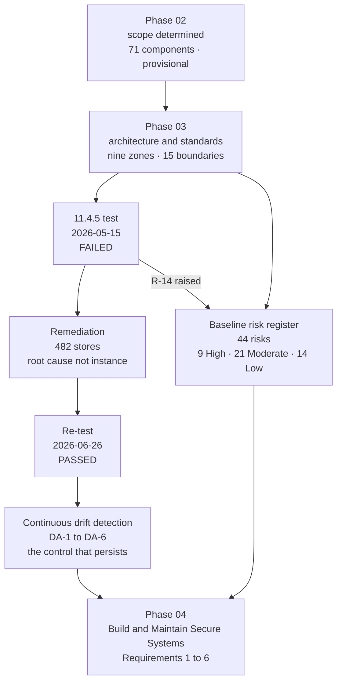

# 03.13 — Phase Summary &amp; Transition

| Field | Value |
|---|---|
| Document ID | MRG-PCI-2026-313 |
| Program | Marketa Retail Group — PCI DSS v4.0.1 Compliance Program |
| Phase | 03 — Network Segmentation &amp; Architecture |
| Version | 1.0 |
| Status | Approved |
| Owner | Naomi Bhatt, Chief Information Security Officer |
| Approver | Raymond Voss, Chief Financial Officer |
| Date | 2026-07-15 |
| Classification | Confidential — Cardholder Data Environment // Illustrative Portfolio Sample |

## Purpose

The close of Phase 03. What the phase committed to, what it delivered, what it found, what it did about what it found, and what Phase 04 inherits.

Phase 02 ended with a scope determination of **71 assessed system components** that was explicitly provisional, because its largest exclusions rested on a segmentation claim supported by configuration evidence and nothing else. Phase 03's job was to convert that claim from **E2** to **E1** — from *asserted* to *tested*.

It did. The conversion cost a failed penetration test, a suspended scope determination, a collapsed architecture decision, a High risk that will not come down for months, and forty-two days of remediation across 482 stores.

**That is the phase working, not the phase failing**, and this document is written on that basis throughout.

## 1. What Phase 03 Committed To

Six commitments were carried into this phase, five from Phase 02's handover and one from the programme charter.

| # | Commitment | Source | Status |
|---|---|---|---|
| **1** | Perform the **11.4.5** segmentation penetration test and convert assumption **A-09** from configuration evidence to test evidence | **OI-02-01**; condition **SEG-C4** | **Delivered — and the answer was no.** 03.07 |
| **2** | Specify the nine-zone model as a designed architecture with enforcement at every boundary, rather than as a reverse-engineered description | 02.07 §2; charter | **Delivered.** 03.02 — 15 boundaries, 31 named flows, a complete zone-to-zone matrix |
| **3** | Implement Requirement 1 in full — configuration standards, change control, services and ports, insecure protocols, configuration security, ruleset review, wireless, trusted and untrusted networks, dual-connected devices | Charter; 306 applicable sub-requirements | **Delivered.** 03.03, with the standard **amended by what the test found** |
| **4** | Establish the six-monthly **1.2.7** NSC ruleset review as a standing cycle | **OI-02-06** | **Delivered.** 03.09 §6 — cycle 1 adopted and evidenced; cycle 2 commences 2026-08 with an independent reviewer |
| **5** | Resolve **ADR-0006** — the store estate classification, explicitly contingent on this phase's test | ADR-0006; QSA challenge **QC-01** | **Resolved. Restored and amended.** §4 |
| **6** | Produce the programme's **baseline risk register** with a stated methodology | Charter; ADR-0005 | **Delivered.** 03.10 and 03.11 — **44 risks, 9 High, 21 Moderate, 14 Low** |

## 2. What the Phase Delivered

### 2.1 Deliverables register

| Doc | Title | Owner | What it establishes |
|---|---|---|---|
| **03.01** | Segmentation Strategy &amp; Principles | Naomi Bhatt | Segmentation is **optional**; relying on it is not. Principles SP-1 to SP-9. **Configuration is not proof** |
| **03.02** | Nine-Zone Architecture | Trevor Kim | Z1 to Z9 as a designed architecture; 15 boundaries; 31 named flows; the zone-to-zone matrix; what each zone costs if breached |
| **03.03** | Network Security Control Standards | Trevor Kim | Requirement 1 as implemented — 14 NSC standards, the services and ports register, insecure protocols, drift, ruleset review, wireless, the 1.4 family, 1.5.1 |
| **03.04** | Store Network Architecture | Trevor Kim | The 482-store build: topology, VLAN plan, WAN, the PIM path, the 482× problem — **and the build image defect that broke the boundary** |
| **03.05** | Cloud Segmentation | Trevor Kim | Z2 and Z8; identity as a segmentation control; why cloud segmentation is harder to prove and easier to hold |
| **03.06** | Wireless Security | Trevor Kim | 1.3.3, 2.3.1, 2.3.2, 11.2.1, 11.2.2; the guest design; **214 legacy PSK devices** named before anybody found them |
| **03.07** | Segmentation Penetration Test | Naomi Bhatt | **The test, and the failure.** SEG-PT-01 to SEG-PT-08; R-14 raised; the scope determination suspended |
| **03.08** | Remediation &amp; Re-Test | Trevor Kim | Containment, Track A, SB-4.2 across 482 stores, six drift assertions, **the re-test passed 2026-06-26** — and what it does not claim |
| **03.09** | NSC Ruleset Governance | Trevor Kim | Who may change a rule; 1.2.2 classification; 1.2.7 cycle one; the exception process; **why Requirement 1 generates no 12.3.1 analysis** |
| **03.10** | Risk Assessment Methodology | Owen Castellanos | 5 × 5 scoring; the three-component retail impact dimension; 12.3 versus the register; calibration; the ADR-0005 rule |
| **03.11** | Risk Register | Owen Castellanos | **44 risks — 9 High, 21 Moderate, 14 Low.** The baseline |
| **03.12** | Control-to-Risk Traceability | Owen Castellanos | All 44 mapped; **no High untreated**; the reverse test; the thirteen that stay Moderate |
| **03.13** | Phase Summary &amp; Transition | Naomi Bhatt | This document |

### 2.2 The phase in numbers

| Metric | Value |
|---|---|
| Zones specified | **9** |
| Boundaries with enforcement, rationale and stated failure consequence | **15** |
| Named flows in the register | **31**, of which **16** cross a T1 boundary |
| NSC components in the inventory | **11** |
| NSC configuration standards | **14**, with **2** exceptions, both dated |
| Rules reviewed in 1.2.7 cycle 1 | **11,847**; **1,719** removed; **47** narrowed; base now **10,128** |
| Segmentation-affecting change types added to the 1.2.2 classification list | **4** |
| Penetration test starting positions | **8**, in both engagements |
| Stores tested — first test | **14 (2.9%)** |
| Stores tested — re-test | **41 (8.5%)** |
| **Segmentation test findings** | **8 — 1 Critical, 2 High, 3 Medium, 2 Low.** All closed and verified |
| **Re-test findings** | **0.** Programme total stands at **19 — 2 Critical, 5 High, 7 Medium, 5 Low** |
| Stores with the latent precondition | **37**; stores with a live path **1** |
| Stores remediated | **482** |
| Site visits required for remediation | **0** |
| Daily or continuous drift assertions now running | **6** |
| Store-days asserted since 2026-06-15 | **14,942** |
| Segmentation-determining divergences found by the new control in its first 31 days | **2** |
| Baseline risk register | **44 — 9 High, 21 Moderate, 14 Low** |
| Risks raised on evidence | **2** — R-14 and R-31 |
| Assessed component population, at phase close | **71** |

## 3. What the Phase Found

The finding is the phase's most valuable output and it is worth restating in one place at the end, because a reader who takes only one thing from Phase 03 should take this.

| Element | Fact |
|---|---|
| Where | **Store 0417, Dayton, Ohio** |
| When | **2026-05-15, 10:42 to 11:01 local** |
| What | Store back-office VLAN (Z5) reachable from store guest wireless (Z7) through a misconfigured trunk — boundary **B-09**, finding **SEG-PT-01**, Critical |
| Prerequisites for the tester | Being in Ohio and being awake. No badge, no credential, no pretext, no social engineering |
| Time from front door to TCP session on the store server | **19 minutes** |
| Account data involved | **None.** The tester did not reach the CDE, and no account data was at risk at any point |
| Root cause | Build image **SB-4.1** reworked the `ROLE-AP` port template and dropped the explicit allowed-VLAN list. A trunk with no allowed-VLAN list permits all VLANs — a platform default, not a decision |
| Second precondition | A field engineer moved that store's guest SSID to local switching in September 2025, to fix a latency complaint |
| Population | Latent at **37** stores; live at **1** |
| Why configuration review missed it | Phase 02 modelled the **controller's intended policy**. The switch was carrying a VLAN the controller's model did not know about. A model built from configuration cannot detect a divergence between configuration and behaviour |
| Consequence | Scope determination suspended for the store estate; assessed population recorded as **553**; **ADR-0006 collapsed on its own stated terms**; risk **R-14** raised at 16, High; Cardinal notified under **C7** |

**Nothing about this is exotic.** No zero-day, no sophisticated adversary, no insider. A template that lost a line, a helpful engineer fixing a performance complaint, and a change process that recognised neither as a boundary event. That is what a real segmentation failure looks like, and it is the reason 11.4.5 is a **test** rather than a review.

## 4. The Resolution of ADR-0006

This is the decision the phase existed to resolve, and it is resolved rather than deferred.

### 4.1 What ADR-0006 said

ADR-0006, accepted 2026-02-14, classified the store estate in the **connected-to band for governance** — segmentation validated, 9.5.1 obligations retained, configuration standards applied — while enumerating among the 63 connected-to components the **segmentation controls that keep the estate out** rather than the 482 servers themselves. The assessed population is 71, not 553.

Its consequences section carried this clause, in the ADR's own words:

> *"**The position is explicitly contingent.** If the segmentation penetration test fails, the boundary is not effective and this classification collapses — the store estate re-enters scope. The QSA accepted the position on exactly that basis, noting it 'depends entirely on the May test.'"*

### 4.2 What happened to it

| Date | Event | Effect on ADR-0006 |
|---|---|---|
| 2026-05-15 | Segmentation test **failed** at store 0417 | **Collapsed on its own stated terms.** No interpretation, no negotiation, no grace period. 482 servers and 496 appliances recorded as in scope from that day; assessed population **553** |
| 2026-05-15 → 05-20 | Containment; Track A across 37 stores; estate-wide assertion | Exposure closed; classification still collapsed |
| 2026-06-26 | **11.4.5 re-test passed** across 41 stores including all 37 latent sites | Condition satisfied. Classification eligible for restoration |
| 2026-07-06 | Steering Committee resolved the ADR, chaired by Raymond Voss, with Rosa Delgado present | **Restored and amended** — see §4.3 |
| 2026-07-02 | Cardinal notified of the restoration under obligation **C7**, as the counterpart to the 2026-05-27 suspension notification | Both notifications on file |
| 2026-07-06 | Re-test report provided to Sable Ridge Assurance | Accepted as evidence for the **12.5.2** confirmation |

**The classification survives. It survives only because remediation and a clean re-test restored the boundary**, and it is worth being precise about the counterfactual: had the re-test found a path at any of the 41 stores, the store estate would have remained in scope, the assessed population would have stood at 553, and the 2026 assessment would not have been completable inside the year that Cardinal's 31 December deadline defines. The classification was one tester's afternoon away from being untenable.

### 4.3 The amendment

The decision itself is unchanged and is not re-argued. **What changes is the condition it rests on**, because the original condition has been discharged and cannot be discharged twice, and because a one-off test is now known to be an insufficient basis for a claim about 482 sites on 365 days.

| | **Original condition, 2026-02-14** | **Amended condition, 2026-07-06** |
|---|---|---|
| The classification depends on | The segmentation penetration test not failing | **(a)** an **11.4.5** test passing, at least annually **and after every change** classified as segmentation-affecting; **and (b)** the continuous drift-detection control **DA-1** to **DA-6** operating, with assertion coverage evidenced daily |
| Collapse trigger | A failed segmentation test | A failed segmentation test; **or** a segmentation-determining divergence that is undetected, unremediated beyond the four-hour target, or systemic across the estate; **or** loss of assertion coverage for more than five consecutive days |
| Scope of collapse | The whole store estate | The whole store estate, unless the affected population is bounded and evidenced — as it was on 2026-05-15, when 37 stores were the latent population and 482 were remediated regardless |
| Evidence grade | **E1**, point in time | **E1** point in time, **plus E2 continuous** — and the programme states plainly that the second is what makes the first mean anything between tests |
| Review | On the next annual test | **Monthly** at the Steering Committee for as long as R-14 is High; then at each 11.4.5 cycle |

The amendment is recorded against ADR-0006 rather than issued as a superseding decision, and the reason is stated so it can be challenged: **the decision did not change.** Marketa still classifies the store estate in the connected-to band and still enumerates the boundary rather than the population. Issuing a new ADR would imply a reconsideration that did not occur and would bury the more interesting fact, which is that the original ADR's contingency clause worked exactly as written — it collapsed the classification automatically, on the day, without anybody having to argue for it.

> **The classification is now conditional on a control that runs every day, not on a test that ran once.** That is a materially stronger position than the one ADR-0006 was accepted on in February, and it exists because the February position was tested and found wanting.

## 5. Requirement Coverage at Phase Close

| Requirement | Position at phase close | Evidence |
|---|---|---|
| **1.1.1, 1.1.2** | Met — governance model and assigned roles | Phase 01 policy set and RACI |
| **1.2.1** | Met — 14 NSC standards with monthly and nightly assertion; 2 dated exceptions | Configuration extracts; assertion output |
| **1.2.2** | Met — classification, scope-delta review, two approvers, negative verification, automatic re-test obligation. **Four change types added June 2026** | Change records; BCA minutes |
| **1.2.3, 1.2.4** | Met — diagram updates as change completion criteria | Diagram revision history |
| **1.2.5** | Met — services, protocols and ports register with per-entry justification, owner and review date | Register |
| **1.2.6** | Met — six insecure services with security features and targets, including the 214-device PSK remnant | Insecure-service register |
| **1.2.7** | Met — cycle 1 evidenced; cycle 2 from 2026-08 with an independent reviewer. **Cadence fixed by the standard; no 12.3.1 analysis arises** | Review records; removal logs |
| **1.2.8** | Met — version-controlled store, signed commits, **daily running-versus-intended assertion across 482 stores and 11 NSCs** | Drift reports; incident records |
| **1.3.1, 1.3.2** | Met — 4 inbound flows to Z1, 2 to Z2; no general egress; 7 named external destinations | Rule-base extracts; egress logs |
| **1.3.3** | Met — and **met throughout**, including on 2026-05-15. No wireless network obtained a path to the CDE at any point. The failure belonged to 11.4.5 | Wireless controller configuration; both test results |
| **1.4.1, 1.4.2** | Met — NSCs between trusted and untrusted networks; inbound from untrusted restricted to the DMZ-terminated public services | Boundary configuration |
| **1.4.3** | Met — **anti-spoofing**: uRPF strict mode, bogon and RFC 1918 ingress filtering, per-store IPAM-generated ingress filters at CT-47 | Interface configuration |
| **1.4.4, 1.4.5** | Met — no publicly accessible interface on any Z1 or Z2 component; disclosure limited, with SEG-PT-03 and SEG-PT-06 closed | Reachability computation; test results |
| **1.5.1** | Met — no device connects to both an untrusted network and the CDE; administrative endpoint controls enforced | Endpoint policy; 3.4.2 test |
| **11.4.5** | **Met.** Failed 2026-05-15, remediated, **re-tested clean 2026-06-26**, with an on-change obligation operating | Ironwood reports IWSL-MRG-2026-SEG-01 and **-02** |
| **11.4.6** | **Not applicable** — service provider requirement. Marketa is a Level 1 merchant. Recorded in the ROC as N/A with the reasoning | Determination record |
| **12.5.2** element 5 | Amended and accurate. The confirmation **records the failure, the remediation and the re-test** — not the re-test alone | Scope confirmation |

## 6. Open Items Carried Out of Phase 03

| ID | Item | Owner | Due | Goes to |
|---|---|---|---|---|
| **OI-03-01** | R-14 exit — 90 consecutive days with no segmentation-determining divergence. **Count reset 2026-07-03**; earliest exit 2026-09-30 | Trevor Kim | 2026-09-30 | Phase 06 |
| **OI-03-02** | CT-49 workflow enforcement so an SSID switching-mode change cannot be applied before its scope-delta review completes — the **store 0629** failure mode | Trevor Kim | 2026-09-30 | Phase 04 |
| **OI-03-03** | Contractor switch-replacement procedure requiring imaging from CT-48 before patching, with a pre-handover trunk assertion — the **store 1183** failure mode | Adaeze Nwosu | 2026-09-30 | Phase 05 |
| **OI-03-04** | Second 11.4.5 cycle scheduled and budgeted for 2027; the change-triggered re-test register operating; **3 re-test obligations still open** | Trevor Kim | 2026-12-31 | Phase 06 |
| **OI-03-05** | **NSC-EX-01** SNMPv2c exception — quarterly review until the FY2027 refresh replaces 496 appliances | Trevor Kim | Quarterly | Phase 06 |
| **OI-03-06** | 1.2.7 cycle 2 completed with an independent reviewer, against a base of 10,128 rules | Trevor Kim | 2026-10-31 | Phase 06 |
| **OI-03-07** | Risk register formally adopted into the policy set and reconciled with the 14 targeted risk analyses under 12.3 | Owen Castellanos | 2026-09-30 | Phase 07 |
| **OI-03-08** | **CAP-05** — eliminate the 214-device legacy pre-shared key population across 138 stores | Trevor Kim | FY2027 refresh | Phase 06, closure reported Phase 09 |

## 7. Transition to Phase 04

Phase 04 is **Build &amp; Maintain Secure Systems — Requirements 1 to 6**. Requirement 1 is complete and is handed over as an operating control set rather than as a design; Phase 04 picks up Requirements 2, 3, 4, 5 and 6 for the systems that sit **behind** the boundaries this phase built.

### 7.1 What Phase 04 inherits

| Inheritance | Detail |
|---|---|
| **A tested boundary set** | Nine zones, 15 boundaries, 31 named flows, eleven of twelve boundary classes held under direct attack twice. Phase 04 configures systems inside a perimeter that has been attacked rather than described |
| **An assessed population of 71** | 8 CDE, 63 connected-to. Requirements 2, 3, 5 and 6 apply to that population, and the population is stable because the boundary that defines it is tested |
| **A drift-detection pattern** | The DA-1 to DA-5 model — read the device, assert against intent, treat divergence as an incident — generalises directly to Requirement 2 configuration standards. Phase 04 should not invent a second pattern |
| **The change-control spine** | 1.2.2 classification, scope-delta review, two approvers, negative verification. **6.5.1** is the same process seen from the application side |
| **The risk register** | 44 entries, of which **R-17** (8.6.1 to 8.6.3), **R-20** (5.2 and 5.3), **R-21** (5.4.1), **R-30** (6.3), **R-34** (6.4.3) and **R-37** (11.5.2) are Phase 04's to treat |
| **Four Phase 03 open items** | OI-03-02 in Phase 04; OI-03-03 to Phase 05; OI-03-01, -04, -05, -06, -08 to Phase 06; OI-03-07 to Phase 07 |
| **A schedule constraint** | Everything store-side must complete by **2026-09-30**. Constraint **CON-01** freezes the estate from October to January, and QSA fieldwork begins **2026-11-02** |

### 7.2 What Phase 04 must not assume

| Do not assume | Because |
|---|---|
| That the boundary is now a solved problem | The re-test proves the boundary. It does not prove the process. **Both preconditions of SEG-PT-01 recurred independently within five weeks of the re-test**, and R-14's exit clock has already been reset once |
| That a configuration standard implemented is a configuration standard operating | The whole lesson of 03.07. SB-4.1 was a correctly deployed, fully rolled-out, gate-passed build image with a defect in it for eighteen months |
| That the store estate behaves like the data centre | 482 sites, contractors, cable colours, a change freeze and a 482× multiplier on every action. Principle **SP-9** applies to every Phase 04 store-side control without exception |
| That Requirement 2 hardening can be evidenced by policy | Requirement 2 needs the same treatment Requirement 1 got: a standard, an assertion, and a defect definition. **A default is not a decision** |
| That the 9 vendor-locked appliances will resolve themselves | **R-36** is one of the two eventual Not in Place findings, with a remediation date of 2027-01-31. Phase 04 should plan around the constraint, not around its removal |

## 8. Assurance Statement

Marketa Retail Group uses network segmentation to reduce the scope of its PCI DSS v4.0.1 assessment. **Segmentation is not a PCI DSS requirement.** It is an optional method of scope reduction, and an entity that adopts it takes on three obligations it cannot then decline: the segmentation controls are in scope, the segmentation must be identified and justified in the annual scope confirmation under **12.5.2**, and its effectiveness must be verified by penetration testing under **11.4.5** at least once every twelve months and after any change to segmentation controls or methods. **11.4.6**'s six-month cadence is a service provider requirement and does not apply to Marketa as a Level 1 merchant.

As at 2026-07-15:

- The segmentation architecture is specified, implemented and documented across nine zones, fifteen boundaries and thirty-one named flows.
- Requirement 1 is implemented in full, with fourteen configuration standards, two dated exceptions, a six-monthly ruleset review cycle, and daily assertion of running configuration against intent across 482 stores and eleven network security controls.
- The **11.4.5** test was performed by an independent qualified third party on **2026-05-15** and **it failed**. One path proved segmentation was not effective. The result was recorded as FAIL on the day, the scope determination was suspended on the day, the acquirer was notified, the QSA was told by Marketa rather than discovering it in November, and a risk was raised three days later under a rule written in February for this purpose.
- Remediation addressed the root cause across all 482 stores without a site visit, and the **re-test on 2026-06-26 passed** across a sample of 41 stores including all 37 that carried the latent defect.
- **ADR-0006's store estate classification is restored, and amended** — it now rests on a continuously operating drift-detection control as well as on a periodic test.
- Risk **R-14** remains **High**, and will until ninety consecutive days pass with no segmentation-determining divergence. That count was reset on 2026-07-03 by a real recurrence.

No statement in this phase asserts that a PCI DSS Attestation of Compliance constitutes compliance with any law, that the QSA's opinion binds a card brand or an acquirer, or that a merchant can be certified against PCI DSS. PCI DSS is **contractual, not statutory**; the Council writes the standard and does not enforce it.

And the sentence the whole phase exists to earn:

> **Marketa's segmentation is tested, not merely configured.**
>
> That sentence is worth something only because the test could have gone the other way, and did. A first segmentation penetration test that passes cleanly usually means it was scoped to pass — narrow window, announced date, starting positions chosen by the team being tested, production carved out, target list drawn from the diagram. Marketa's rules of engagement were written to make failure possible: every out-of-scope zone as a starting position, tester-selected stores, no notification to store operations, no production exclusions, and entropy as a deliberate sampling stratum. The test found something, in a place the diagram said was impossible, nineteen minutes after a stranger walked through the front door of a shop in Dayton.
>
> **The test had to fail first for the sentence to mean anything.** A programme that reports only confirmations has not tested anything; it has rehearsed. Marketa's store estate is materially safer than it was on 2026-05-14, four monitoring controls now exist that would have caught this defect in November 2024, and the organisation has demonstrated — three times now, across A-04, A-07 and this test — that when it discovers it was wrong, it writes that down and raises the risk instead of netting the discovery off against the fix.
>
> That behaviour, and not the clean re-test, is the assurance this phase actually offers.

## Cross-References

| Reference | Relevance |
|---|---|
| 01.06 — Program Charter &amp; Objectives | The commitments Phase 03 was accountable for |
| 01.08 — Scope Assumptions &amp; Constraints | Constraints CON-01 to CON-09, and assumption A-09 |
| 02.08 — Connected-To &amp; Security-Impacting Systems | Conditions SEG-C1 to SEG-C6; group G10 |
| 02.11 — Assumption Test Results | A-09 disproved and not reinstated; R-14 and R-31 as the two evidence-raised risks |
| 02.12 — Scope Validation &amp; Phase Summary | Open items OI-02-01 and OI-02-06, both closed here; challenge QC-01 |
| ADR-0005 — Raise a Risk When Discovery Disproves an Assumption | The rule behind R-14 and R-31 |
| **ADR-0006 — Store Estate Classification** | **Collapsed 2026-05-15; restored and amended 2026-07-06 — §4** |
| 03.01 — Segmentation Strategy &amp; Principles | The claim structure this document closes out |
| 03.07 — Segmentation Penetration Test | The failure |
| 03.08 — Remediation &amp; Re-Test | The remediation, the re-test, and the drift control the amended ADR now depends on |
| 03.11 — Risk Register | The 44-risk baseline handed to every later phase |
| 03.12 — Control-to-Risk Traceability | Which phase treats which risk |
| Phase 04 — Build &amp; Maintain Secure Systems | Requirements 2 to 6 for the systems behind these boundaries |
| Phase 06 — Monitoring, Testing &amp; Third Parties | R-14's exit evidence, the 1.2.7 second cycle, CAP-05 and the 2027 test |
| Phase 08 — QSA Assessment &amp; ROC Production | How the failure, the remediation and the re-test are recorded in the ROC scope narrative |

---
[⬅ Previous](03.12-control-to-risk-traceability.md) · [🏠 Phase 03 Home](03.00-README.md) · [Next ➡](../04-build-maintain-secure-systems/04.00-README.md)
