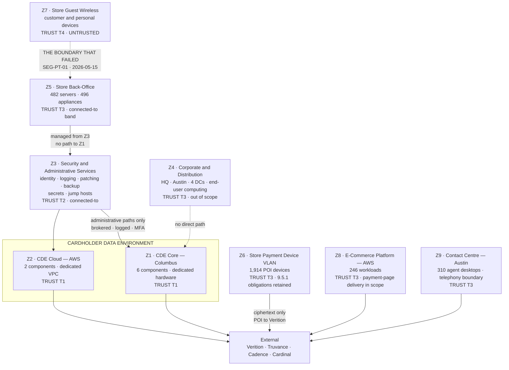

# The Nine-Zone Architecture

## The boundary that failed

**Z7 → Z5.** Guest wireless to store back-office, through a trunk port whose allowed-VLAN list had been lost in a build image. Configuration review said the boundary was closed. It was not.

The tester never reached the CDE. That is not the point — under **ADR-0006** the store estate's out-of-scope classification rested on exactly that boundary being effective, and it demonstrably was not.

## Source
`03.02-nine-zone-architecture.md`, `03.07-segmentation-penetration-test.md`.
