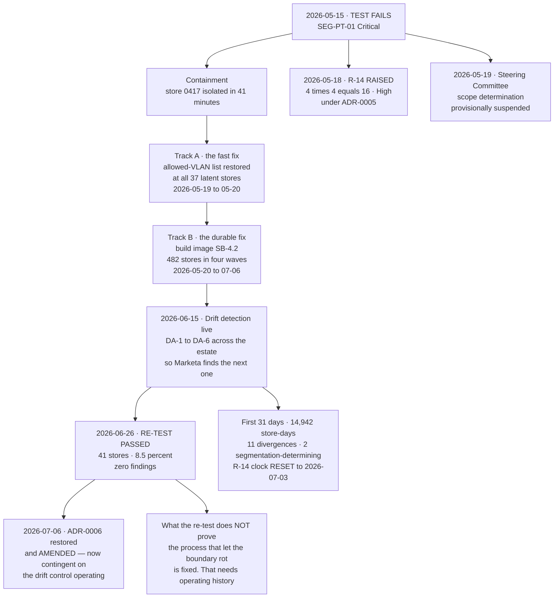

# From Failure to Tested Boundary

## The distinction that matters

The re-test proves **the boundary holds today**. It does not prove the process that allowed a build image to silently drop an allowed-VLAN list for eighteen months has been fixed. Only operating history proves that, which is why **R-14 stays High** with a 90-day clean-operation exit criterion — and why that clock was **reset** when two further divergences appeared in the first month.

A clock that never resets is not a clock.

## Source
`03.08-remediation-and-retest.md`, `03.09-nsc-ruleset-governance.md`.
