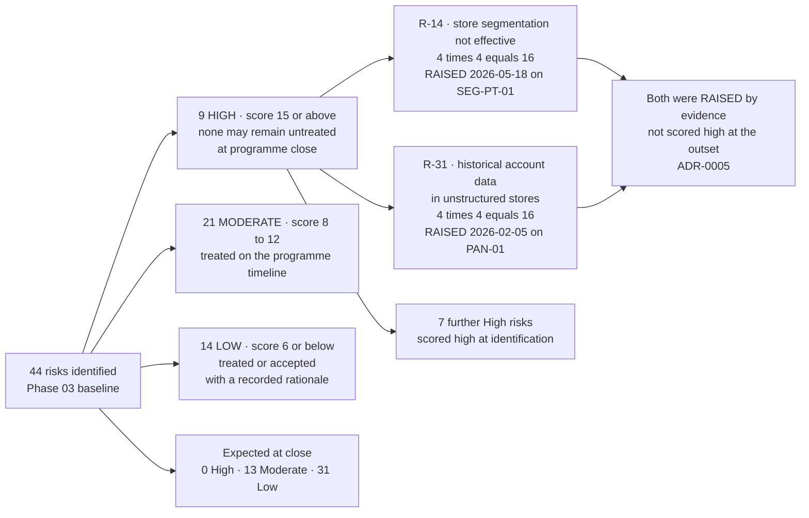

# The Baseline Risk Register

## Scoring, and why impact is not just disclosure

Likelihood 1–5 × impact 1–5. **High ≥ 15 · Moderate 8–12 · Low ≤ 6.**

Impact is scored on three dimensions, not one: **cardholder data exposure, brand-programme penalties, and business interruption.** A retailer's worst case is not a disclosure notice — it is a forensic investigation, card reissuance costs and brand assessments passed through by the acquirer, arriving at the same time as the operational disruption of a compromised payment estate.

## Source
`03.10-risk-assessment-methodology.md`, `03.11-risk-register.md`, `03.12-control-to-risk-traceability.md`.
