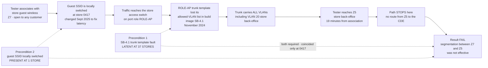

# SEG-PT-01 — The Attack Path

## What it proved, precisely

The tester reached the **store back-office**, not the cardholder data environment. Marketa deliberately refused to use "only one store" as a mitigation, and recorded why: the fault needed two preconditions, one of which was **latent at 37 stores**. The single site where both coincided is a fact about coincidence, not about control effectiveness.

**Detection time: 19 minutes** from associating with a guest wireless network any customer can join. Notified at 12:38, store isolated at 13:19 — **41 minutes to containment**.

## Source
`03.07-segmentation-penetration-test.md`, `03.08-remediation-and-retest.md`.
