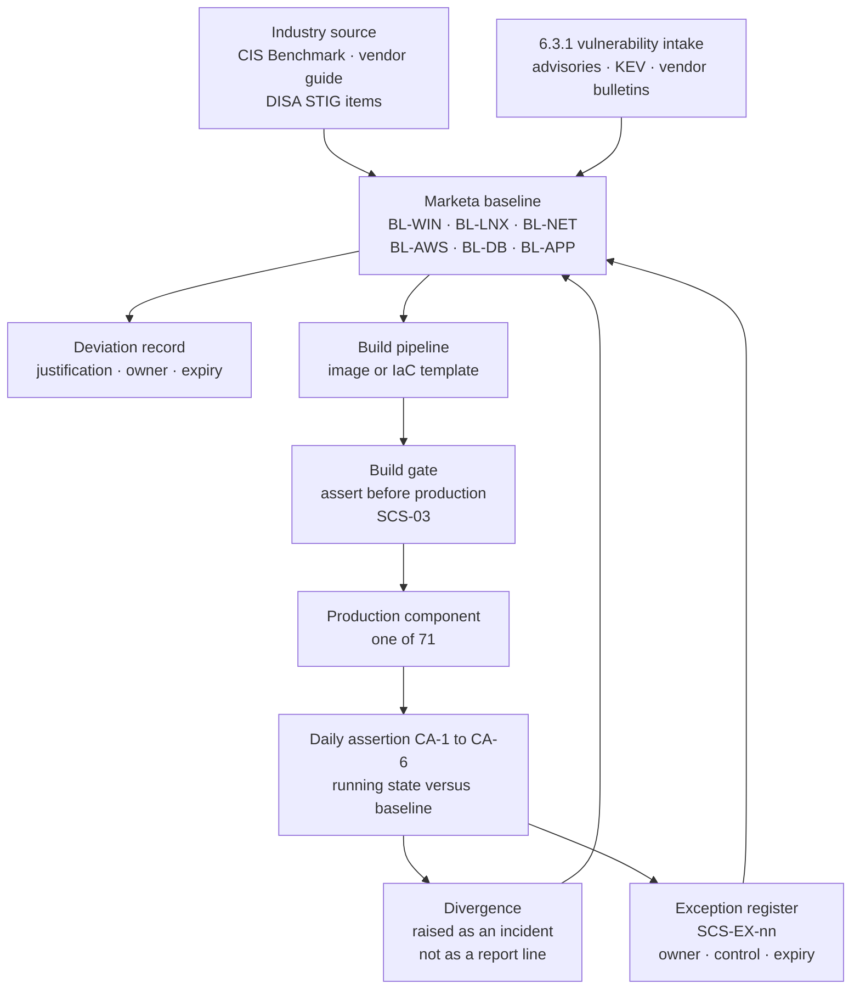

# 04.01 — Secure Configuration Standards

| Field | Value |
|---|---|
| Document ID | MRG-PCI-2026-401 |
| Program | Marketa Retail Group — PCI DSS v4.0.1 Compliance Program |
| Phase | 04 — Build &amp; Maintain Secure Systems |
| Version | 1.0 |
| Status | Approved |
| Owner | Trevor Kim, Director of Infrastructure &amp; Network |
| Approver | Naomi Bhatt, Chief Information Security Officer |
| Date | 2026-07-15 |
| Classification | Confidential — Cardholder Data Environment // Illustrative Portfolio Sample |

## Purpose

Requirement 2 — *apply secure configurations to all system components* — as Marketa implements it across the **71 assessed system components**: 8 CDE and 63 connected-to or security-impacting. This document contains the standard, not a restatement of the standard. Where Requirement 2.2.1 says configuration standards must exist, the standards are here, by platform, with their derivation, their verification method and their exceptions.

**Requirement 1 was delivered in Phase 03** and is not re-delivered. Document 03.03 holds the fourteen NSC standards, the services-protocols-ports register under 1.2.5 and the insecure-service position under 1.2.6 for the eleven network security controls. This document governs everything those boundaries contain, and it deliberately inherits Phase 03's method rather than inventing a second one: **read the device, assert against intent, treat divergence as an incident.**

It covers **2.2.1** to **2.2.7** and **2.3.1** to **2.3.2**. Requirements 2.1.1 and 2.1.2 — documented, in-use processes with assigned roles — are discharged by the governance model in Phase 01 and cross-referenced.

## 1. The Sentence This Document Exists To Prevent

Phase 03 handed Phase 04 a warning, and it is the first line of this standard:

> **A default is not a decision.**

Build image SB-4.1 was correctly authored, correctly gated, correctly deployed to 482 stores, and carried a trunk port with no allowed-VLAN list for eighteen months. Nobody chose that. It was what the platform did when nobody chose. Requirement 2 exists because the state a system arrives in is the vendor's convenience, not the entity's risk appetite, and the gap between those two things is where the assessment lives.

The practical consequence for this standard is that every baseline is written as an **assertion set** rather than as a document. A setting Marketa cannot machine-verify on a running component is a setting Marketa does not claim.

## 2. The Baseline Set — 2.2.1

Requirement 2.2.1 obliges configuration standards that cover all system components, address all known security vulnerabilities, are consistent with industry-accepted hardening standards or vendor hardening recommendations, are updated as new vulnerability issues are identified under 6.3.1, and are applied when new systems are configured and verified in place before or immediately after the component is connected to production.

Marketa maintains **six platform baselines**, and one recorded position for components it cannot configure at all.

| Baseline | Platform scope | Assessed components | Derived from | Marketa deviation from source |
|---|---|---|---|---|
| **BL-WIN** | Windows Server 2022, Windows 11 Enterprise, including the CDE-06 desktop image | **18** | CIS Microsoft Windows Benchmarks, Level 1 for member servers, with named Level 2 items adopted for Z1 and Z2 | 31 Level 2 items adopted; 6 Level 1 items relaxed with justification and expiry |
| **BL-LNX** | Red Hat Enterprise Linux 9, Amazon Linux 2023 | **15** | CIS Benchmarks Level 1, with selected DISA STIG items for Z1 hosts | 22 STIG items adopted; SELinux enforcing is mandatory and is not relaxable |
| **BL-NET** | Routing, switching, wireless and firewall platforms | **11** | Vendor hardening guides plus the fourteen NSC standards in 03.03 §2 | None — **BL-NET is NSC-01 to NSC-14 restated as a build artefact**, so the two cannot diverge |
| **BL-AWS** | Cloud account, network, container and pipeline control planes | **6** | CIS AWS Foundations Benchmark plus the Marketa cloud control set from 03.05 | 14 additional controls covering the Z2 boundary and the IaC path |
| **BL-DB** | Managed and self-managed database platforms behind CDE-02 and CDE-08 | **3** | CIS Benchmarks and vendor security guides | Native audit and TDE mandatory; no relaxations approved |
| **BL-APP** | Vendor-supplied appliances — telephony boundary, storage, POS back-office | **12** | Vendor hardening documentation only. **No industry benchmark exists for most of this class** | Recorded per appliance; 9 of the 12 are the CON-03 population — §7 |
| *(no baseline)* | Vendor-hosted SaaS control planes | **6** | Not applicable — Marketa cannot configure the platform | Governed by tenant-configuration standards and 12.8.5 assurance — §6 |
| | **Total** | **71** | | |

Two design choices in that table are worth defending because an assessor will test them.

**BL-NET is not a second network standard.** It is the same fourteen settings Phase 03 published, expressed in the form the build and assertion tooling consumes. Publishing a separate Requirement 2 network baseline would have created two documents that could disagree, and the first time they disagreed nobody would know which one was the standard.

**BL-APP is honest about having no benchmark.** Requirement 2.2.1 permits derivation from vendor hardening recommendations where no industry standard exists. For twelve appliance components that is genuinely the situation, and the standard says so rather than dressing a vendor PDF up as a benchmark.

### 2.1 The eleven mandatory settings

Every baseline implements these eleven controls. A baseline that cannot implement one carries a registered exception under §8.

| # | Control | Requirement | Verification |
|---|---|---|---|
| **SCS-01** and **SCS-02** | A named baseline exists for every assessed component and every component maps to exactly one baseline; the baseline names its industry or vendor source, its version, and every deviation from that source with a justification and an owner | 2.2.1 | Register reconciliation against the 12.5.1 inventory, monthly; baseline document review, six-monthly |
| **SCS-03** | The baseline is applied by the build pipeline and **verified in place before the component reaches a production network**, not after | 2.2.1 | Build gate output; first-boot assertion record |
| **SCS-04** | The baseline is reviewed and updated when the 6.3.1 vulnerability intake produces an issue the baseline can mitigate | 2.2.1 | Baseline change log correlated to the 6.3.1 intake register |
| **SCS-05** | Vendor default accounts are removed or disabled. Where a default account must be retained, its credential is changed and meets **8.3.6** | 2.2.2 | Account enumeration by authenticated scan; local account inventory |
| **SCS-06** | All other vendor defaults are replaced — SNMP community strings, default certificates and keys, default API tokens, default encryption keys, default management URLs and ports | 2.2.2, 2.3.1 | Configuration extract; authenticated scan from CT-31 |
| **SCS-07** | One primary function per server, or functions of differing security levels isolated, or all functions secured to the highest level required | 2.2.3 | Function register per component; hypervisor placement report |
| **SCS-08** | Services, protocols, daemons and functions run from a per-baseline **allow-list**. Anything running that is not on the list is a defect | 2.2.4 | Running-service enumeration asserted against the allow-list, daily |
| **SCS-09** | Any insecure service in use is registered with a business justification and the additional security features that reduce its risk | 2.2.5 | Insecure-service register — §5 |
| **SCS-10** | The platform's named security parameter set is applied and asserted | 2.2.6 | Parameter assertion, daily |
| **SCS-11** | All non-console administrative access is encrypted with strong cryptography; cleartext administrative protocols are absent, not merely unused | 2.2.7 | Configuration extract plus port scan from an adjacent segment |

SCS-08's phrasing is deliberate. A deny-list of forbidden services describes what somebody remembered; an allow-list of permitted services describes what somebody authorised. That distinction is the same one that decided whether finding **PAN-03** involved sensitive authentication data, and the programme has adopted it as a general rule.

## 3. Where the Baselines Come From, and How They Are Kept

The assertion layer is **CA-1 to CA-6**, and it is deliberately the same pattern as the DA-1 to DA-6 drift controls that Phase 03 built after the segmentation failure. Phase 03's transition note instructed Phase 04 not to invent a second pattern; this is the honouring of that instruction.

| Check | What it asserts | Frequency | Divergence handling |
|---|---|---|---|
| **CA-1** | Every component in the 12.5.1 inventory reported an assertion result in the period | Daily | Silence is a finding. A component that stops reporting is treated as failing until proven otherwise |
| **CA-2** | Running configuration matches the baseline's parameter set — SCS-10 | Daily | Incident; auto-remediation permitted for reversible settings, ticketed for all others |
| **CA-3** | Running services and listening ports match the SCS-08 allow-list | Daily | Incident. An unexpected listener on a Z1 or Z2 component is a P2 |
| **CA-4** | No vendor default account, credential, certificate, key or community string is present — SCS-05, SCS-06 | Weekly, authenticated | Incident; credential rotated within 24 hours |
| **CA-5** | Administrative access paths are encrypted and cleartext services are absent — SCS-11 | Weekly, from an adjacent segment | Incident; the service is disabled, then the cause is investigated |
| **CA-6** | Baseline version deployed matches the current approved baseline version | Weekly | Scheduled remediation; an out-of-date baseline is a backlog item, not an incident, unless it is more than two versions behind |

**Operating result to 2026-07-15.** Across 71 components and 96 days of operation, CA-1 to CA-6 produced **2,214 assertion runs** and **74 divergences**. Of those, 61 were reversible parameter drift auto-remediated within the hour, 9 were unexpected listeners (7 of them a monitoring agent's diagnostic port enabled by an upgrade), 3 were default credentials reintroduced by a vendor appliance firmware update, and 1 was a Z1 host that stopped reporting for four days after a hypervisor migration and was found to have been rebuilt from a stale image.

That last one is the finding worth reading. **A component rebuilt from a stale image passes every functional test and fails SCS-03.** It was caught by CA-1's silence rule, which exists because Phase 03 learned that a control which reports nothing looks exactly like a control with nothing to report.

## 4. Primary Functions and Isolation — 2.2.3

Requirement 2.2.3 obliges primary functions requiring different security levels to be isolated, or all secured to the level of the highest. Marketa satisfies it three different ways, and records which applies to each component rather than asserting the requirement globally.

| Position | Components | How 2.2.3 is met | Evidence |
|---|---|---|---|
| One primary function per server | The 8 CDE components | Each runs a single application role on dedicated hardware in dedicated Z1 cabinets, or a single managed service in the dedicated Z2 account | Function register; hypervisor placement report |
| Isolation of differing levels | The virtualisation estate, CT-38 to CT-42 | **A dedicated CDE cluster.** No CDE guest shares a hypervisor, storage array or management cluster with a non-CDE guest | Cluster membership extract, asserted daily by CA-2 |
| All secured to the highest level | The G3 secrets estate and the G4 logging estate | Components serving both CDE and non-CDE consumers are built to the CDE baseline in full, so there is no lower level present to isolate from | Baseline mapping; scan results identical to Z1 hosts |

The hypervisor position is the one merchants most often get wrong, and the reasoning is worth stating. A hypervisor hosting a CDE guest alongside a general corporate guest makes the hypervisor a CDE component and makes every guest on it reachable from the same management plane. Marketa's dedicated cluster costs more capacity than a mixed one. It buys a boundary that can be drawn on a diagram and verified from an inventory, which is a property the 2026 assessment needed and the 2024 estate did not have.

## 5. Insecure Services, Protocols and Daemons — 2.2.4 and 2.2.5

2.2.4 obliges unnecessary functionality to be removed or disabled. 2.2.5 does not prohibit insecure services; it obliges the entity to document the business justification and to implement additional security features that reduce the risk.

### 5.1 What was removed

| Service or function | Where found | Disposition | Date |
|---|---|---|---|
| SMBv1 | 4 Windows components, all connected-to | Removed from the feature set, not merely disabled; BL-WIN now asserts absence | 2026-05-08 |
| Telnet listener, and unauthenticated HTTP management UI | 2 and 4 components respectively | Telnet disabled at the vendor configuration layer and confirmed closed from an adjacent segment; HTTP redirected to HTTPS with the plaintext listener removed where the platform permits — 1 exception, see §5.2 | 2026-04-22 and 2026-05-19 |
| TLS 1.0 and TLS 1.1 | 11 components offering them on management or service listeners | Disabled estate-wide; asserted weekly by CA-5 | 2026-04-30 |
| Sample applications, default web content and vendor demo databases | 6 components | Removed | 2026-04-15 |
| Unused local accounts and dormant service accounts | 38 accounts across 21 components | Removed. The 2 that could not be removed are R-17's population and are 8.6.2 work in Phase 05 | 2026-06-02 |

### 5.2 What remains, and what compensates

| Insecure service | Where | Business justification | Additional security features — 2.2.5 | Target |
|---|---|---|---|---|
| **SNMPv2c, read-only** | 12 BL-APP appliances, and the 496 store-estate appliances under NSC-EX-01 | Environmental and availability monitoring on appliance generations with no SNMPv3 support; loss of monitoring on the store estate is a trading risk | Non-default community string rotated quarterly; read-only view restricted to a named OID subtree; source ACL to the polling addresses; management VLAN only; no write community defined anywhere in the estate | FY2027 refresh — **CAP-05** for the store population |
| **SMTP relay on port 25, opportunistic TLS** | 5 appliances emitting device alerts | The appliances cannot authenticate to the corporate mail platform and cannot be reconfigured by Marketa | Relay confined to the management VLAN with a single permitted destination; recipient allow-list; alert body templates reviewed and confirmed to contain no account data; relay logs to CT-18 | Replaced with the platform's API alerting at the next major version |
| **NTLM authentication** | 1 vendor appliance management interface | The vendor's management client supports no other mechanism | NTLMv2 only, LM and NTLMv1 refused; SMB signing and channel binding enforced; the account is non-privileged and used only by the management client; sessions brokered through CT-11 and recorded | Vendor commitment sought under CAP-06 |
| **HTTP listener on port 80** | Public edge of the e-commerce tier | Redirect to HTTPS for customers arriving on a bare hostname | Serves nothing but a 301; HSTS with a one-year max-age and preload; no payment page reachable over the plaintext listener; asserted daily | Retained — this is the correct configuration, and it is registered so it is not mistaken for a lapse |

The last row is registered deliberately. A port-80 listener will appear in every scan Marketa's assessor runs, and a register that omits it invites the same question four times. **Explaining a benign finding once, in writing, is cheaper than explaining it in fieldwork.**

## 6. Security Parameters and Administrative Access — 2.2.6 and 2.2.7

| Baseline | Representative 2.2.6 parameter set | 2.2.7 administrative access position |
|---|---|---|
| **BL-WIN** | Credential Guard and LSA protection enabled; SMB signing required; LM and NTLMv1 refused; PowerShell script-block and module logging on; application allow-listing in enforce mode; screen lock at 15 minutes; SCHANNEL restricted to TLS 1.2 and 1.3 with an AEAD cipher list | RDP with Network Level Authentication over TLS 1.2 minimum, brokered through CT-11 only; WinRM over HTTPS with certificate authentication; no unencrypted management path exists |
| **BL-LNX** | SELinux enforcing; kernel hardening sysctl set; root SSH login disabled; password authentication disabled in favour of certificates; auditd rule set aligned to the Requirement 10 event list; `umask 027`; FIPS-validated cryptographic modules in Z1 | SSHv2 only, certificate authentication, brokered through CT-11, ciphers and key-exchange algorithms restricted to an AEAD allow-list |
| **BL-NET** | The NSC-01 to NSC-14 set from 03.03 §2 | SSHv2 and HTTPS with TLS 1.2 or above; SNMPv3 authPriv where supported; Telnet, HTTP and SNMPv1 or v2c absent from the management plane |
| **BL-AWS** | EBS default encryption enforced; IMDSv2 required; S3 public access blocked at the account and organisation level; no long-lived IAM access keys permitted; CloudTrail organisation trail immutable; service control policies deny the disabling of logging | Console and API access federated through CT-01 with MFA under 8.4.2; no IAM user with a console password exists in the CDE account; session credentials are short-lived |
| **BL-DB** | Native audit enabled to the Requirement 10 event list; transparent data encryption on; sample schemas removed; network encryption required on every connection; no direct interactive access from outside the brokered path | Administrative connections over TLS 1.2 minimum with certificate validation, from the brokered path only |
| **BL-APP** | The vendor's hardening set, item by item, with each item recorded as applied, not applicable, or exception | Management interfaces over HTTPS with TLS 1.2 minimum; the single NTLM exception is registered in §5.2 |

The 2.2.7 position is short because Phase 03 already made it structural. **No administrative path into Z1 or Z2 exists other than through the CT-11 broker**, so the encryption question is answered once at the broker and once at the target, and there is no third arrangement to audit. That treats risk **R-18**, which is about privileged access originating from a workstation that also carries general network and email access.

## 7. The Vendor-Locked Appliances — CON-03 and CAP-06

Nine of the twelve BL-APP components are the population Phase 01 named as constraint **CON-03** before the programme started: POS back-office appliances supplied and maintained by the vendor under terms that prevent Marketa installing agents or holding privileged credentials.

This is the constraint that becomes corrective action **CAP-06**, and it is stated here in full because Requirement 2 is where the constraint first bites.

| Dimension | Position |
|---|---|
| What Marketa cannot do | Install an agent of any kind — endpoint protection, file integrity, configuration management, log forwarding. Hold a privileged credential. Change the firmware cadence. Read the running configuration through an authenticated channel |
| What Marketa can do | Observe from the outside; control what the appliance can reach; obtain the vendor's own attestation; verify what the vendor asserts against externally observable evidence |
| Requirement 2 consequence | SCS-03, SCS-04, SCS-08 and SCS-10 cannot be asserted from inside the component. Verification changes from assertion to **observation** |
| Substituted verification | Unauthenticated service enumeration from an adjacent segment, weekly; vendor configuration attestation obtained quarterly under 12.8.5 and reconciled against the observed service set; firmware version confirmed from the management console and checked against the vendor's advisory feed |
| Requirement 5 consequence | No anti-malware agent is possible. A 5.2.3 evaluation governs the class — 04.05 §4 |
| Requirement 6 consequence | Patch cadence is the vendor's, not Marketa's — 04.06 §7 |
| Requirement 11 consequence | Authenticated internal scanning under **11.3.1.2** is not achievable. **This becomes one of the two Not in Place findings in the ROC**, with a remediation date of 2027-01-31 |
| Risk | **R-36** — 16, High. Nine of 71 assessed components whose configuration and vulnerability state is known only by inference |
| Corrective action | **CAP-06** — obtain, at the FY2027 contract renewal, a contractual right to credentialed scanning and agent installation, or replace the platform. Owner Trevor Kim. Tracked to Phase 06 and reported at Phase 09 |
| Interim exception record | **SCS-EX-02**, reviewed quarterly, aligned with NSC-EX-02 in 03.03 §2.1 |

The programme's position on this, recorded so that it cannot be softened later: **an appliance nobody can inspect is not an appliance that is secure. It is an appliance whose state is unknown, inside the assessed population, and the register says so.** Phase 03's transition note instructed Phase 04 to plan around the constraint rather than around its removal, and every control in this phase that names the nine does so as an accommodation, never as a treatment.

## 8. Deviation and Exception Authorisation

A standard with no exception route produces undocumented exceptions. Marketa's route is narrow, dated and owned.

| Element | Rule |
|---|---|
| What may be excepted | An individual baseline setting on a named component or component class. **Never a whole control (SCS-01 to SCS-11), and never the requirement itself** |
| Who approves | CISO for any CDE component or any exception affecting 2.2.2, 2.2.5 or 2.2.7. Director of Infrastructure &amp; Network for connected-to components otherwise. **Never the requesting engineer's own line manager alone** |
| Mandatory content, and maximum life | Setting, population, reason, additional security features, owner, expiry, review cadence. **12 months maximum.** An exception is renewed by re-approval with fresh evidence, not by inheritance; a third renewal goes to the PCI Steering Committee |
| Register | `trackers/` — parsed from this document and from the baseline set, with assertion on counts |
| Relationship to compensating controls | An exception is **not** a compensating control. Where a requirement is not met and the entity relies on an alternative, a Compensating Controls Worksheet is produced under the standard's rules and assessed by the QSA. The programme has three such worksheets and none of them is a configuration exception |

### 8.1 The current exception register

| ID | Population | Setting not met | Additional security features | Owner | Expiry |
|---|---|---|---|---|---|
| **SCS-EX-01** | 12 BL-APP appliances plus the 496 store appliances under NSC-EX-01 | SCS-06 — SNMPv3 unsupported, SNMPv2c retained | As §5.2, row 1 | Trevor Kim | 2027-06-30, quarterly review |
| **SCS-EX-02** | 9 CON-03 vendor-locked appliances | SCS-03, SCS-04, SCS-08, SCS-10 cannot be asserted internally | As §7 | Trevor Kim | 2027-01-31, aligned to CAP-06 |
| **SCS-EX-03** | 1 vendor appliance management interface | SCS-11 partially — NTLM authentication | As §5.2, row 3 | Trevor Kim | 2027-01-31 |
| **SCS-EX-04** | 6 BL-WIN Level 1 items on the CDE-06 desktop image | Relaxed to permit the dispute-image rendering path to function | Compensated by the 3.4.2 controls in 04.02 §6 and by non-persistence of the desktop | Elena Marchetti | 2027-03-31 |

Four exceptions across 71 components, each with a named owner and a date. That number is reported rather than celebrated: a register with zero exceptions in an estate containing twelve vendor appliances would mean the standard had been written to fit the estate, which 03.03 §2.1 already identified as the way a gap is made invisible.

## 9. Wireless Defaults — 2.3.1 and 2.3.2

Requirement 2.3 attaches to wireless environments connected to the CDE or transmitting account data. Marketa's determination, recorded in 03.06, is that **no wireless network at Marketa is connected to the CDE and none transmits account data.** All 1,914 lanes are wired to the payment-device VLAN.

Marketa nonetheless applies 2.3 to every wireless environment in the estate, and the reason is a lesson from Phase 03 rather than a reading of the standard. **Connectivity is a configuration state, and configuration states change.** On 2026-05-15 a guest wireless network that the design said could not reach the store back-office reached it in nineteen minutes. A control regime scoped strictly to the requirement's applicability note would have left the wireless defaults on the far side of a boundary that turned out to be permeable.

| Requirement | Obligation | Marketa's position | Evidence |
|---|---|---|---|
| **2.3.1** | Wireless vendor defaults changed at installation or confirmed secure — default encryption keys, access point passwords, SNMP defaults, other security-related defaults | Applied to all **1,612 authorised access points** and to the wireless controller CT-49. Default administrative credentials, default SNMP strings, default certificates and default SSIDs replaced at provisioning by the controller template; asserted by CA-4 | Controller configuration extract; provisioning template; weekly assertion |
| **2.3.2** | Wireless encryption keys changed whenever personnel with knowledge of the key leave the company or change role, and whenever a key is suspected or known to be compromised | Satisfied structurally for the 802.1X estate — **there is no shared key to know.** Not satisfiable for the 214-device legacy PSK population at 138 stores, which shares one static key that cannot be attributed to a holder | 802.1X configuration; the PSK population inventory |
| **2.3.2 residual** | — | **R-15**, Moderate 12. Confined to a dedicated internet-only VLAN with explicit deny to the operations, payment-device and management VLANs; key rotated on a scheduled basis; population inventoried and shrinking; eliminated by **CAP-05** in the FY2027 refresh | 03.06 §6; the CAP-05 corrective action record |

The honest statement, carried forward unchanged from 03.06: a pre-shared key that 214 devices know is a key that cannot be rotated in response to a leaver, because there is no leaver-shaped subset of 214 appliances. Rotation is a field operation across 138 sites. **2.3.2 is met by the design that removes shared keys, and is not met by the population that still has one.** Only CAP-05 closes it.

## 10. Requirement 2 Coverage Summary

| Requirement | Position at 2026-07-15 | Evidence |
|---|---|---|
| **2.1.1, 2.1.2** | Met — processes documented and roles assigned in the Phase 01 governance model and the Phase 07 policy suite | Policy set; RACI |
| **2.2.1** | Met — six baselines covering 65 of 71 components, a recorded position for the 6 SaaS control planes, derivation named, build gate at SCS-03, 6.3.1-driven refresh at SCS-04 | Baseline documents; build gate output; CA-1 to CA-6 |
| **2.2.2** | Met — SCS-05 and SCS-06, asserted weekly by CA-4. **3 reintroductions by firmware update detected and remediated** in the operating period | Account enumeration; CA-4 output; incident records |
| **2.2.3** | Met — three recorded positions in §4; dedicated CDE hypervisor cluster | Function register; cluster membership extract |
| **2.2.4**, **2.2.5** and **2.2.6** | Met — the SCS-08 service allow-list asserted daily with the §5.1 removal record; four insecure services registered with justification and additional security features; SCS-10 parameter sets per baseline asserted daily | Service enumeration; CA-2 and CA-3 output; insecure-service register |
| **2.2.7** | Met — SCS-11; no cleartext administrative path exists on any assessed component; one registered NTLM exception on an appliance management interface | CA-5 output; port scan from adjacent segment |
| **2.3.1** | Met across 1,612 access points and CT-49 | Controller configuration; provisioning template |
| **2.3.2** | Met for the 802.1X estate; **known weakness** for the 214-device legacy PSK population under CAP-05 | 03.06 §6; CAP-05 record |
| **2.2.x on the 9 CON-03 appliances** | **Verified by observation, not assertion.** Registered as SCS-EX-02; the related 11.3.1.2 gap is a Not in Place finding with a 2027-01-31 remediation date | Observed service enumeration; vendor attestation; CAP-06 |

## 11. Risks Treated

| Risk | Rating at baseline | How this document treats it | Residual expectation |
|---|---|---|---|
| **R-04** — configuration drift returns to the store estate faster than assurance detects it | Moderate 12 | CA-1 to CA-6 extend the Phase 03 drift pattern from network intent to full configuration state, with silence treated as failure | Moderate, pending operating history |
| **R-17** — embedded, non-rotatable credentials in legacy batch integrations | High 16 | SCS-05 and SCS-06 remove the default-credential class; the 2 remaining hard-coded credentials are 8.6.2 work in Phase 05 and remain a Not in Place finding | High until Phase 05 closes 8.6.2 |
| **R-18** — privileged access to a management plane from a general-purpose workstation | Moderate 12 | SCS-11 and the single brokered administrative path; no cleartext management channel exists | Moderate |
| **R-19** — assets recorded as decommissioned remain powered and reachable | Moderate 9 | CA-1's silence rule and the SCS-01 reconciliation against the 12.5.1 inventory; procedure P-3's "stopped is not terminated". **R-15**, the 214-device legacy pre-shared key remnant, is treated at §9 — 2.3.1 applied, 2.3.2 not achievable, isolation and CAP-05 | Low by Phase 06; R-15 Moderate until CAP-05 |
| **R-36** — vendor-locked appliances unassessable | High 16 | Accommodated, not treated. Observation-based verification, vendor attestation, CAP-06 | High until CAP-06 |

## Cross-References

| Reference | Relevance |
|---|---|
| 01.08 — Scope Assumptions &amp; Constraints | **CON-01** the seasonal freeze, **CON-02** the 482× multiplier, **CON-03** the vendor-locked appliances behind CAP-06 |
| 02.09 — Assessed System Component Inventory | The 71 components this standard covers, and the six vendor-hosted control planes with no Marketa baseline |
| 03.03 — Network Security Control Standards | **Requirement 1 in full.** NSC-01 to NSC-14, restated as BL-NET; exceptions NSC-EX-01 and NSC-EX-02 |
| 03.06 — Wireless Security | The 2.3 applicability determination, the 1,612 access points and the 214-device PSK population behind CAP-05 |
| 03.08 — Remediation &amp; Re-Test | The DA-1 to DA-6 drift pattern that CA-1 to CA-6 extend |
| 03.11 — Risk Register | R-04, R-15, R-17, R-18, R-19, R-36 |
| 04.05 — Anti-Malware &amp; Phishing | The 5.2.3 evaluation covering the appliance and network classes that cannot take an agent |
| 04.06 — Vulnerability Management | 6.3.1 intake driving SCS-04; the patch position for the CON-03 appliances |
| 04.08 — Change Control | 6.5.1 change management; the change-closure verification that PAN-03 required |
| Phase 06 — Monitoring, Testing &amp; Third Parties | 11.3.1.2 authenticated scanning and the nine exceptions; CAP-06 tracking |

---
[⬅ Previous](04.00-README.md) · [🏠 Phase 04 Home](04.00-README.md) · [Next ➡](04.02-protect-stored-account-data.md)
