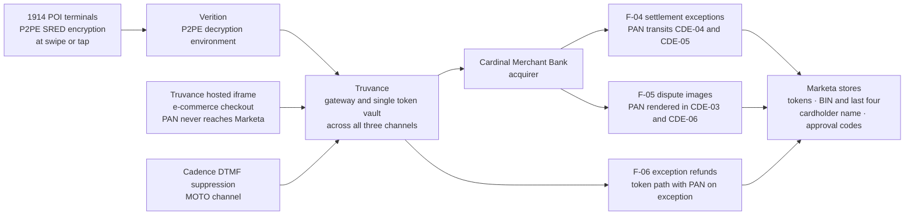

# 04.02 — Protect Stored Account Data

| Field | Value |
|---|---|
| Document ID | MRG-PCI-2026-402 |
| Program | Marketa Retail Group — PCI DSS v4.0.1 Compliance Program |
| Phase | 04 — Build &amp; Maintain Secure Systems |
| Version | 1.0 |
| Status | Approved |
| Owner | Elena Marchetti, VP Payment Operations |
| Approver | Naomi Bhatt, Chief Information Security Officer |
| Date | 2026-07-15 |
| Classification | Confidential — Cardholder Data Environment // Illustrative Portfolio Sample |

## Purpose

Requirement 3 — *protect stored account data* — as it applies to an environment that has been engineered so that almost nothing is stored. This document covers **3.1**, **3.2.1**, the **3.3** family, **3.4.1**, **3.4.2** and **3.5.1**. Cryptographic key management under **3.6** and **3.7** is 04.03.

Requirement 3 is the lightest requirement in Marketa's assessment, and the reason is architectural rather than fortunate. P2PE removes account data from the card-present channel at the point of interaction. A hosted checkout iframe removes it from the e-commerce channel before it reaches a Marketa server. DTMF suppression removes it from the MOTO channel before it reaches Marketa's telephony. A single tokenisation vault at Truvance means that what Marketa keeps is a token, a truncation and an approval code.

**No account data comes to rest in Marketa's CDE.** Phase 02 proved that by discovery across 1,842 systems, 41 network shares and 6 email archives. This phase has to keep proving it, and the interesting content of this document is not the storage controls — it is what would break the claim, and what Marketa does to notice.

## 1. What "Light" Means, and What It Does Not Mean

A merchant that stores no PAN is sometimes told that Requirement 3 does not apply. That is wrong in three specific ways, and each of them generates work in this document.

| The tempting shortcut | Why it fails | What Marketa does instead |
|---|---|---|
| "We store no PAN, so Requirement 3 is not applicable" | 3.2.1 obliges retention and disposal policies covering **all locations of stored account data** — and the obligation to know there are none is itself the control. 3.3.1 obliges SAD not to be retained, which is a statement about a process, not about a store | Maintains the policy, runs the verification, and evidences the negative |
| "Discovery found nothing in February, so nothing is there in November" | Discovery is a point in time. Four of Marketa's own findings existed for between three and nine years before anyone looked | Continuous DLP telemetry, quarterly unowned-repository discovery, annual full discovery, and the P-1 to P-4 procedures under 12.10.7 |
| "PAN transits the CDE but is not stored, so masking and copy controls are moot" | 3.4.1 and 3.4.2 attach to **display** and to **remote access**, not to storage. Marketa's dispute analysts see full PAN on screen every working day | The CDE-06 non-persistent desktop, the 3.4.2 technical control set, and a quarterly test of both |

The programme's framing, stated once so that no later document has to re-argue it:

> **Requirement 3 is light because of where the data is not. It is not light because of what Marketa does not do.**

## 2. Where Account Data Actually Is

The three flows on the right are the whole of Marketa's account-data exposure, and all three are **exception paths**. They exist because the card brands and the issuer generate records that carry a full account number, and a merchant cannot decline to receive them.

| Flow | What carries PAN | Which components | Does it come to rest? |
|---|---|---|---|
| **F-04** — settlement and interchange exceptions | A subset of Cardinal's exception records, because the brand record layout supplies the account number | CDE-05 receives; CDE-04 processes | **No.** Streamed in memory from CDE-05 and tokenised on ingest. Verified by discovery scanning during an active settlement window |
| **F-05** — dispute and retrieval imagery | Issuer-generated retrieval requests, representment packets and signed sales drafts, which bear the full PAN because the issuer generated them | CDE-03 renders; CDE-06 displays | **No.** Rendered in session from the Truvance portal. Local save, print, clipboard and drive redirection are blocked by technical control, and the control is tested |
| **F-06** — exception refunds and adjustments | Token-based in the normal case; PAN appears only where a refund must be issued against a card the token no longer resolves | CDE-01 initiates; CDE-07 executes | **No.** Handled inside the session; no artefact is written |

What Marketa does store, on CDE-02 and CDE-08, is listed in the retention schedule in §3: tokens, BIN and last four, cardholder name where an order requires it, approval codes and settlement state. **None of it is a full primary account number**, and none of it is sensitive authentication data.

## 3. Minimising Storage — 3.2.1

3.2.1 obliges account data storage to be kept to a minimum through retention and disposal policies, procedures and processes covering all locations of stored account data; limits on the amount stored and the time it is retained to what legal, regulatory or business requirements demand; specific retention requirements defining length and criteria; processes for secure deletion when data is no longer needed; and **a process for verifying, at least once every three months, that stored account data exceeding the defined retention period has been securely deleted or rendered unrecoverable.**

### 3.1 The retention schedule

| Data class | Where held | Account data? | Retention | Basis | Disposal method |
|---|---|---|---|---|---|
| Truvance tokens | CDE-02, CDE-08, order systems | No — a token is not account data outside the vault | 7 years from order completion | Tax, warranty and returns | Logical purge on schedule, evidenced by count |
| BIN and last four, and cardholder name | CDE-02, CDE-08, order and CRM systems | Yes — truncated PAN and name are cardholder data | 7 years from order completion | Dispute defence, order fulfilment, customer service, reconciliation | Purge with the parent order record |
| Approval codes and settlement state | CDE-02, CDE-04 | No | 7 years | Financial reconciliation | Purge with the settlement period |
| Full PAN, and sensitive authentication data | **Nowhere at rest**; SAD nowhere at any point | Yes | **Zero.** PAN in memory and in session only; SAD zero before and after authorisation | The architecture provides for no persistence; see §4 | Not applicable — the control is that no write path exists |
| Call recordings, QA | Cadence platform and the Austin archive tier | No, since 2023; historically yes — finding PAN-01 | **13 months**, reduced from 7 years | Targeted risk analysis under 12.3.1, endorsed by Payment Operations and the General Counsel | Platform-enforced expiry with a monthly deletion manifest |
| Dispute imagery | Rendered from the Truvance portal | Yes, transiently | **Zero.** Not downloaded, not cached | 3.4.2 controls in §6 | Not applicable |
| Backup sets containing CDE-02 and CDE-08, and investigation or quarantine volumes | CT-34, CT-35, Ashburn; volumes created only during a 12.10.7 response | Truncated PAN and name in backups; whatever was found, in a quarantine volume | 35 days operational and 13 months archive; life of the investigation to a 90-day maximum | Recovery objectives in the payment operations continuity plan; procedure P-0 | Retention-lock expiry verified by catalogue evidence; secure deletion with manifest and post-deletion re-scan |

Two entries in that table are the ones an assessor will press.

**The zero rows are claims, and claims need evidence.** "Full PAN — nowhere at rest" is evidenced by the Phase 02 discovery result across 100% of the estate, by the settlement-window scan of CDE-04 and CDE-05, by the absence of a write path in the application design, and by the continuing discovery programme in §7. It is not evidenced by the architecture diagram, because a diagram describes intent and PAN-03 was a log file nobody intended.

**The investigation-volume row exists because Phase 02 needed it.** A location holding account data is a CDE system for as long as it holds it. Quarantine volumes created during the four PAN responses were treated as CDE and controlled accordingly, and the retention schedule now covers them in advance so that the next team does not improvise the answer under pressure.

### 3.2 The quarterly verification

| Element | Implementation |
|---|---|
| What is verified | That no stored account data exceeds its defined retention period, at every location the schedule names |
| How | An automated retention-expiry assertion over CDE-02, CDE-08, the order estate and the backup catalogue, producing a count of records past retention — expected zero — plus the quarterly unowned-repository discovery run under procedure **P-2** |
| Frequency | Quarterly, on the fifth working day of the month following quarter end. **The frequency is fixed by the standard; no 12.3.1 targeted risk analysis arises** |
| Owner | Elena Marchetti, with Marcus Hale for the discovery limb |
| Evidence | Assertion output with record counts by location, the discovery run report, and the deletion manifest where anything was found |
| Results to date | Q1 2026: 4,118 order records past retention, purged, re-verified at zero. Q2 2026: 0 past retention; discovery run identified 2 new shares with no named owner, both classified and neither containing account data |

The Q1 number is reported rather than smoothed. A first run of a retention control that finds nothing usually means the control is not looking; 4,118 records is what happens when a purge job has been running against a seven-year rule that changed to a different seven-year rule in 2023 and nobody reconciled the boundary condition.

## 4. Sensitive Authentication Data — 3.3.1 and 3.3.2

3.3.1 obliges SAD not to be retained after authorisation, even if encrypted, and obliges all SAD received to be rendered unrecoverable on completion of authorisation. Marketa's position is stronger than the requirement and it is stronger for a structural reason: **Marketa never receives sensitive authentication data on any channel.**

| Sub-requirement | Element | Where it would enter | Why it does not | Evidence |
|---|---|---|---|---|
| **3.3.1.1** | Full track data from the magnetic stripe or chip equivalent | The card-present channel | The Verition P2PE solution's SRED-capable PIN pads encrypt at swipe or tap. Track data is encrypted inside the device before it crosses any Marketa wire, and **Marketa holds no decryption key** — Verition operates the decryption environment | P2PE solution listing; the PIM; 02.04 |
| **3.3.1.2** | Card verification code | E-commerce and MOTO | E-commerce codes are entered in the Truvance iframe and posted to Truvance, not to Marketa. MOTO codes are keyed by the customer and suppressed by Cadence before they reach Marketa's telephony | 02.05, 02.06; discovery result in 02.02 §5 |
| **3.3.1.3** | PIN and PIN block | The card-present channel | The PIN block never leaves the PIN pad other than encrypted under the P2PE key set. Marketa has no PIN-handling application and no PIN-capable interface | P2PE solution listing; component inventory |
| **3.3.2** | SAD stored electronically **prior** to completion of authorisation must be encrypted with strong cryptography | Nowhere | Marketa performs no pre-authorisation storage of any kind. Authorisation happens at Truvance; Marketa holds an authorisation result, not an authorisation request | Application design records; discovery |

Discovery in 02.02 §5 searched for SAD patterns as well as PAN across the full 1,842-system estate and found none. That result is the one Marketa relies on, and it survived a genuine test: the debug log in finding **PAN-03** logged the full outbound gateway request payload for seven months and still contained no verification code, because the logging library's redaction deny-list happened to include `cvv`, `cvc`, `securityCode` and `pin`.

> **That was luck, and the programme records it as luck.** The field was called `cardNumber`, which was not on the list, so 1,143 PANs were written in clear. A deny-list redacts what someone remembered. If the payload's verification-code field had been named `cardSecurityValue`, finding PAN-03 would have been a sensitive-authentication-data retention finding, and the conversation with Cardinal Merchant Bank would have been a different one.

The corrective control is in 04.07 §8: pattern-based redaction replacing the deny-list, applied at the logging library rather than at the field name.

## 5. Masking on Display — 3.4.1

3.4.1 obliges PAN to be masked when displayed, with **BIN and last four the maximum** any display may show, and with more than that visible only to personnel with a documented, legitimate business need.

| Population | What they see | Basis | Count |
|---|---|---|---|
| Store colleagues, all channels | Last four only, on the receipt and the POS display | No business need for more; the terminal never presents more | ~29,600 |
| Contact-centre agents, and e-commerce customer service | Last four only, in the order record. The agent never sees the number the customer keys | Suppression at Cadence removes the digits before the agent's desktop; order records carry a token and a truncation | 310 and ~180 |
| Payment Operations analysts, general | BIN and last four | The 3.4.1 maximum; sufficient for reconciliation, routing and customer identification | 22 |
| **Dispute analysts** | **Full PAN**, on issuer-generated imagery only, rendered in a CDE-06 session | Documented business need — an issuer dispute packet must be read as the issuer produced it, and the account number is the issuer's case reference | **9** |
| **Settlement exception analysts** | **Full PAN**, on brand exception records only, inside CDE-04 | Documented business need — an exception record cannot be resolved without the identifier the brand supplied | **4** |
| **VP Payment Operations** | Full PAN, on escalation | Documented business need; used rarely and logged individually | **1** |

**Fourteen people in an organisation of 34,000 may see a full account number**, all of them in Payment Operations, all of them inside a CDE session, all of their views logged under 10.2.1.1. The authorisation is reviewed at each quarterly access review under Requirement 7, revoked on role change within one working day, and re-authorised annually by Elena Marchetti in writing.

This treats **R-12** — insider misuse in dispute, chargeback and refund handling, where full PAN is legitimately visible to a person doing their job and the control is authorisation and monitoring rather than elimination. The register scores it Moderate 12 and the programme does not claim to have reduced it below that, because the only control that would is one that removes the business need, and the business need is imposed by the dispute process rather than chosen by Marketa.

Finding **PAN-02** is the counter-example that gives the number meaning. A file share of 2,187 scanned dispute documents was readable by a security group with 63 members, of whom 22 had no dispute-handling role. That is 63 people with an unlogged, unreviewed, unlimited view of full account numbers, against 14 with a named, logged, annually re-authorised one.

## 6. Preventing Copy and Relocation During Remote Access — 3.4.2

3.4.2 is one of the 51 future-dated requirements now in force. It obliges technical controls to prevent the copy or relocation of PAN when using remote-access technologies, except for personnel with documented, explicit authorisation and a legitimate defined business need.

This is the requirement that does the most work in Marketa's environment, because the entire full-PAN population in §5 works through a remote-access technology by design.

| Control | Implementation on CDE-06 | Verified how |
|---|---|---|
| No local persistence | Non-persistent desktop pool. The session is discarded on logoff and rebuilt from the golden image | Pool configuration; image hash |
| Clipboard, drive and device redirection | Clipboard redirection disabled in both directions at the broker and the guest policy layer; client drive mapping, USB redirection and printer redirection disabled | Quarterly test — attempt each, confirm failure |
| Printing | No print queue exists in the session. Nothing in the dispute workflow requires paper | Session image inventory |
| Screen capture | Blocked at the guest; the client agent applies a capture-protection flag to the session window | Quarterly test |
| File download from the Truvance portal | Blocked by browser policy in the session; the portal is configured for render-only access | Portal configuration; browser policy |
| Watermarking | Every session window carries the user identifier, workstation identifier and timestamp, visible in any photograph of the screen | Screenshot evidence |
| Session recording | All CDE-06 sessions recorded through CT-11 and retained under 10.5.1 | Recording index |
| Egress | No general internet egress from Z1. A session cannot reach a personal mail service, a file-sharing site or a chat platform | 03.03 §5; boundary rule base |
| The residual: a camera | **Not preventable by technical control.** Addressed by the watermark, by the clean-desk and device policy in Phase 05, and by the awareness content under 12.6.3 | Named as a residual, not as a control |

### 6.1 The 3.4.2 test

The controls above are configuration. What makes them evidence is that they are attacked on a schedule.

| Element | Detail |
|---|---|
| Frequency | Quarterly, and after any change to the desktop image, the broker or the browser policy |
| Performed by | Security Operations, independently of the platform team that maintains the pool |
| Method | Twelve attempts to remove a rendered PAN from a CDE-06 session by copy, drive mapping, print, download, screen capture, remote-control tooling, browser developer tools, email client, a mounted USB device, a second remote session chained out of the first, a cloud sync client, and a mapped network location |
| Pass condition | All twelve fail, and each failure is visible in the logs of CT-11 or CT-18 |
| Result 2026-Q2 | **11 of 12 blocked at first attempt.** Browser developer tools permitted a rendered image to be saved to the session's temporary profile — a location that is discarded at logoff and never reaches the client, but which meant the data was written to disk inside the session. Developer tools were disabled by policy on 2026-06-18 and the test re-run clean |
| Result 2026-Q3 | Scheduled 2026-09; the four Phase 03 store-side deadlines do not apply, but the test must have two clean cycles before QSA fieldwork |

The Q2 finding is minor and is reported in full because the reporting is the point. A control set tested only by reading its configuration would have passed. **A control tested by trying to defeat it found something in the first cycle**, which is the same lesson the segmentation penetration test taught in May, arriving in a much smaller package.

## 7. Rendering PAN Unreadable — 3.5.1

3.5.1 obliges PAN to be rendered unreadable anywhere it is stored, by one-way hashes based on strong cryptography over the entire PAN, by truncation, by index tokens, or by strong cryptography with associated key-management processes.

| Method the standard permits | Marketa's use | Why |
|---|---|---|
| **Truncation** | **Primary method.** BIN and last four is the maximum stored anywhere in the estate | It is the only method that removes the data rather than protecting it. A truncated PAN cannot be un-truncated |
| **Index tokens** | **Primary method.** Truvance-issued tokens across all three channels | The token-to-PAN mapping is held by the TPSP. Marketa holds neither the mapping nor the ability to reverse it |
| **Strong cryptography with key management** | Used for the CDE-05 staging area and for backup sets containing CDE-02 and CDE-08 — see 04.03 | Applies to data that is already truncated. It is defence in depth, not the 3.5.1 mechanism |
| **Keyed one-way hashes over the entire PAN — 3.5.1.1** | **Not used.** No hashing of PAN occurs anywhere in the estate | Recorded as a determination rather than left unstated. Where an entity hashes, 3.5.1.1 obliges the hash to be **keyed**, with key management under 3.6 and 3.7. Marketa has nothing to key |
| **Disk or partition-level encryption — 3.5.1.2 and 3.5.1.3** | Full-volume encryption is deployed on Z1 and Z2 storage, **but it is not relied on as the 3.5.1 mechanism** | 3.5.1.2 permits disk-level encryption as the 3.5.1 mechanism only for removable media; for non-removable media the PAN must also be rendered unreadable another way. Marketa satisfies that because everything stored is already truncated or tokenised. Where volume encryption is used, 3.5.1.3's separation of logical access from native OS authentication is met — the keys are held in CT-17 and CT-15 and are not associated with user accounts |

The row worth reading twice is the last one. Full-disk encryption is the control merchants most often present as their answer to 3.5.1, and it is the one the standard most narrowly constrains. **A volume-encrypted server with a clear-text PAN in a file is a server on which the PAN is readable to every process and every logged-on administrator**, because the volume is mounted. Marketa deploys volume encryption for media-disposal and physical-theft reasons under Requirement 9, and says so, rather than counting it toward Requirement 3.

## 8. What the Four PAN Findings Mean for Requirement 3

Phase 02 recorded which requirements each finding breached while it existed. This section takes the next step and states what each finding obliges Requirement 3 to do **from now on**.

| Finding | Requirement breached while it existed | The standing obligation it creates |
|---|---|---|
| **PAN-01** — 11,400 call recordings with audible PAN | **3.2.1.** The recordings were encrypted at rest by the platform, so 3.5.1 was met; the failure was a seven-year retention rule serving a business purpose that had ended | Retention rules must name a location, a length, a criterion and an accountable individual. **Any change to a control that affects what is captured triggers a retrospective review of what was captured before it** — procedure P-1 |
| **PAN-02** — 2,187 scanned dispute documents | **3.2.1, 3.4.1, 3.5.1**, plus 7.2.1 and 7.2.2. Stored in clear on an unencrypted volume, visible to 63 people, retained past any business need | Every unstructured repository has a named individual owner and an explicit retention rule; unowned repositories are a **quarterly** discovery task; a migration project is not complete until the old data is dispositioned — procedure P-2 |
| **PAN-03** — 1.4 GB debug log, 1,143 PAN instances | **3.2.1 and 3.5.1.** Plain text on a retained EBS volume belonging to an instance the CMDB called decommissioned | Redaction is pattern-based, not name-based; production log levels are enforced by pipeline guardrail; decommissioning is a data event and **stopped is not terminated** — procedure P-3 |
| **PAN-04** — 34 records in an emailed spreadsheet, 11 copies | **3.2.1, 3.4.1, 3.5.1** and, squarely, **4.2.2** | Continuous DLP telemetry over the messaging estate rather than periodic search; a published, trained route for unsolicited account data; **reporting is never penalised** — procedure P-4. The 4.2.2 limb is 04.04 §7 |

Three of the four were stored in clear. That is the sentence Requirement 3 exists for, and it is worth noticing that none of the three was in a system anybody would have described as a card data store. They were a file share, a log file and a spreadsheet.

### 8.1 The six ways account data comes to rest at Marketa

Naming the failure modes is the control. Each maps to a register entry and to a detection mechanism.

| # | Failure mode | Risk | What detects it |
|---|---|---|---|
| 1 | A diagnostic setting writes a payload that normally is not written | R-19, and the PAN-03 root cause | Pipeline guardrail rejecting non-production log levels; pattern-based redaction; log-content sampling |
| 2 | A business process creates an artefact nobody mapped — a report, an export, a reconciliation file | **R-08**, Moderate 12 | Quarterly unowned-repository discovery; the scope-delta review on any new integration |
| 3 | A repository accumulates faster than discovery finds it | **R-06**, Moderate 12 | Quarterly discovery under P-2; named-owner requirement for every share, site and document store |
| 4 | Account data arrives from outside — a customer, a colleague, an issuer | **R-07** Low 6, **R-22** Moderate 9 | DLP on the messaging estate, live 2026-04-10; procedure P-4; the store special-order payment link |
| 5 | A telephony or platform change moves the suppression point downstream of Marketa | **R-23**, Moderate 10 | Condition MOTO-C2 verification; the 12.5.2 scope-delta review on any telephony change |
| 6 | Historical data survives a control change that only looks forward | **R-31 ‡**, High 16 | The P-1 standing rule; the second full discovery run due 2026-08-31, which is R-31's exit criterion |

**R-31 is the register's most uncomfortable entry and it belongs in this document.** It is High, after complete remediation, because the rating is not about the 11,400 recordings. It is about whether Marketa knows what it holds. Requirement 3's control at Marketa is not a storage control; it is a **discovery** control, and R-31 stays High until a second full discovery run across the same populations returns nothing.

## 9. Requirement 3 Coverage Summary

| Requirement | Position at 2026-07-15 | Evidence |
|---|---|---|
| **3.1.1, 3.1.2** | Met — processes and roles in the Phase 07 policy suite; data-handling responsibilities named per data class | Policy set; RACI |
| **3.2.1** | Met — retention schedule covering all locations, defined lengths and criteria, secure deletion processes, and the quarterly past-retention verification | Retention schedule; quarterly assertion output; deletion manifests |
| **3.3.1, 3.3.1.1, 3.3.1.2, 3.3.1.3** | Met — no SAD is received on any channel. Confirmed by discovery across 1,842 systems | P2PE solution listing; Cadence and Truvance AOCs; discovery results |
| **3.3.2** and **3.3.3** | 3.3.2 met vacuously — no pre-authorisation storage exists, and **the determination is recorded rather than the requirement treated as absent**. 3.3.3 **not applicable** — an issuer requirement, and Marketa supports no issuing function | Application design records; data-flow evidence; determination records |
| **3.4.1** | Met — BIN and last four maximum on display; 14 named individuals authorised to see more, with annual re-authorisation and per-view logging under 10.2.1.1 | Authorisation register; access review records; log samples |
| **3.4.2** | Met — the CDE-06 technical control set, **tested quarterly by attack rather than by configuration review**. One finding in the first cycle, remediated 2026-06-18 | Test reports Q2 and Q3; broker and guest policy extracts |
| **3.5.1** | Met — truncation and index tokens as the primary methods; strong cryptography as defence in depth on the staging area and backups | Data dictionary; discovery results; 04.03 |
| **3.5.1.1** | **Not applicable** — no hashing of PAN is performed anywhere in the estate | Determination record; discovery of hash-shaped fields returned none |
| **3.5.1.2, 3.5.1.3** | Met — volume encryption is deployed but is not the 3.5.1 mechanism; key access is separate from native OS authentication and keys are not tied to user accounts | Key policy in 04.03; volume configuration |

## 10. What This Document Does Not Claim

| Claim | Position |
|---|---|
| That Marketa cannot hold account data | It can, and it has, four times. The architecture makes it improbable and the discovery programme makes it findable. Neither makes it impossible |
| That the CDE is small because Requirement 3 is light | The causation runs the other way. Requirement 3 is light because the CDE is small, and the CDE is small because of P2PE, the iframe, DTMF suppression and a single token vault — every one of which is a **condition** that can fail. R-05, R-09, R-10 and R-23 price those failures |
| That a token is out of scope in all circumstances | Marketa holds tokens and not the mapping. If Marketa ever held both, the token would be account data. The token's status depends on the separation, and the separation is contractual |
| That "no PAN at rest" was proved once | It was proved in February and is re-proved continuously by DLP, quarterly by repository discovery and annually by full discovery. **R-31 exists because the organisation once believed a control's deployment date described the state of the world** |

## Cross-References

| Reference | Relevance |
|---|---|
| 02.02 — Cardholder Data Discovery | The 100% estate scan, the SAD result, and the evidence behind every zero row in §3.1 |
| 02.03 — Unexpected PAN Locations &amp; Response | The four findings, the P-0 to P-4 procedures, and the requirement-by-requirement breach analysis this document builds on |
| 02.04 — Card-Present Channel Scope | P2PE and why Marketa never receives track data or PIN blocks |
| 02.06 — Call Centre / MOTO Channel Scope | DTMF suppression, condition MOTO-C2 behind R-23, and the 13-month recording retention |
| 02.07 — Data Flows &amp; Network Reachability | Flows F-04, F-05 and F-06 |
| 02.09 — Assessed System Component Inventory | The account-data relationship recorded per CDE component |
| 03.11 — Risk Register | R-06, R-07, R-08, R-12, R-22, R-23, R-24, R-31, R-39 |
| 04.03 — Cryptographic Key Management | 3.6 and 3.7, and why Marketa's key estate is mostly not about stored account data |
| 04.04 — Transmission Security | 4.2.2, the DLP control, and the PAN-04 limb this document defers |
| 04.07 — Secure Software Development | Pattern-based log redaction, the pipeline guardrail, and 6.5.5 live PAN in test environments |
| Phase 05 — Access Control &amp; Physical Security | Requirement 7 and 9 controls over the 14 authorised full-PAN viewers and over media |
| Phase 07 — Security Policy, Risk &amp; Incident Response | The 12.10.7 procedure set and the 12.3.1 analysis behind the 13-month recording retention |

---
[⬅ Previous](04.01-secure-configuration-standards.md) · [🏠 Phase 04 Home](04.00-README.md) · [Next ➡](04.03-cryptographic-key-management.md)
