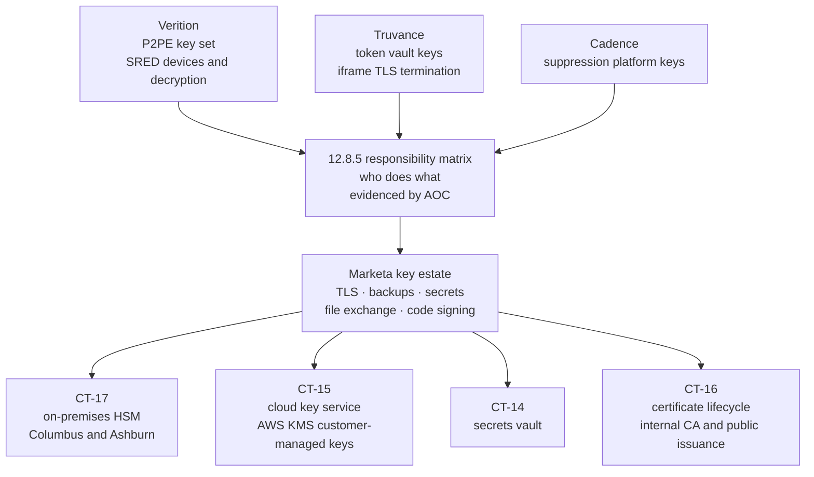
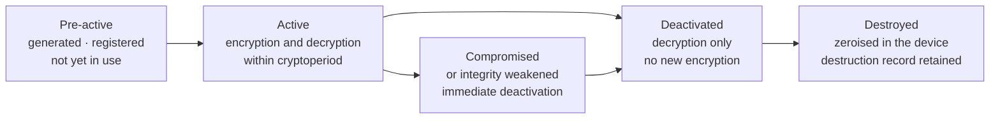

# 04.03 — Cryptographic Key Management

| Field | Value |
|---|---|
| Document ID | MRG-PCI-2026-403 |
| Program | Marketa Retail Group — PCI DSS v4.0.1 Compliance Program |
| Phase | 04 — Build &amp; Maintain Secure Systems |
| Version | 1.0 |
| Status | Approved |
| Owner | Trevor Kim, Director of Infrastructure &amp; Network |
| Approver | Naomi Bhatt, Chief Information Security Officer |
| Date | 2026-07-15 |
| Classification | Confidential — Cardholder Data Environment // Illustrative Portfolio Sample |

## Purpose

Requirements **3.6** and **3.7** — protecting the cryptographic keys used to protect stored account data, and the key-management procedures that govern their whole lifecycle.

This document has an unusual job, because the honest answer to "which keys does Marketa use to protect stored account data?" is **almost none**. Marketa stores no full primary account numbers. What it stores is truncated PAN and Truvance-issued tokens, and neither is protected by a Marketa key. **The keys that matter to Marketa's cardholder data are held by Verition and by Truvance**, under solution and service-provider arrangements that place them deliberately out of Marketa's reach.

That is the position this document states plainly, rather than inventing a key ceremony Marketa does not perform. What Marketa does hold is a real and non-trivial key estate — TLS, backup encryption, secrets, file-exchange keys and code signing — and 3.6 and 3.7 are applied to it in full, both because parts of it genuinely touch cardholder data and because a key-management regime that is only as good as its narrowest applicability argument is a regime waiting for a scope change.

## 1. The Honest Position

| Question an assessor will ask | Marketa's answer |
|---|---|
| Which keys protect stored account data? | The only account data Marketa stores is truncated PAN and cardholder name on CDE-02 and CDE-08. Those are rendered unreadable by **truncation**, which uses no key. The datastores are additionally encrypted at rest under CT-15 and CT-17 keys, which is defence in depth rather than the 3.5.1 mechanism |
| Who holds the P2PE keys? | **Verition.** The P2PE solution's SRED devices encrypt at swipe or tap and Verition operates the decryption environment. Marketa holding a decryption key would invalidate the P2PE scope reduction that removes 1,914 lanes and 482 servers from the assessed population |
| Who holds the tokenisation keys, and the keys that suppress spoken card data? | **Truvance** and **Cadence** respectively. The token-to-PAN mapping is the vault's; Marketa holds tokens and no means of reversing them, and suppression happens upstream of Marketa's telephony |
| So does 3.6 apply to Marketa at all? | Yes — to the key-encrypting and data-encrypting keys used on the CDE-05 staging area and on backup sets containing CDE-02 and CDE-08, both of which hold cardholder data. It applies to a small, named key population, and this document names it |
| Does 3.7 apply? | Yes, and to a wider population, because Marketa applies the 3.7 procedures uniformly to its whole key estate rather than only to the subset the applicability test reaches |
| Does Marketa perform a key ceremony? | **For two operations only** — see §6. Everything else is generated inside a hardware security module or a cloud key service and never exists in cleartext outside it. There is no theatre in this document |

> **A merchant that does not hold the keys should say so.** Presenting a borrowed cryptographic architecture as one's own is a way of failing an assessment slowly: the QSA asks to see the custodian acknowledgements, then the ceremony records, then the split-knowledge evidence, and each answer is a smaller version of the previous one. Marketa's position is that the reduction is the achievement, and the correct evidence for it is the third-party assurance in 12.8 plus a rigorous regime over what Marketa actually holds.

## 2. Who Holds What

Requirement 12.8.5 obliges the entity to maintain information about which PCI DSS requirements are managed by each TPSP, which are managed by the entity, and which are shared. Key management is the clearest case in Marketa's programme of a requirement that is **wholly** the provider's, and the responsibility matrix records it as such — with the provider AOC as the evidence, not the provider's marketing.

| Requirement | Marketa | Verition | Truvance | Cadence |
|---|---|---|---|---|
| 3.6.1 protection of keys used to protect stored account data | Shared — Marketa's backup and staging keys | **Provider** — P2PE key set | **Provider** — vault keys | Not engaged |
| 3.7.1 to 3.7.8 key-management procedures | Marketa, for its own estate | **Provider** | **Provider** | **Provider** |
| P2PE key injection and device key management | Not permitted to Marketa | **Provider**, under the P2PE solution listing | Not engaged | Not engaged |
| 4.2.1 keys and certificates safeguarding PAN in transit | Shared — 04.04 | Shared | Shared | Shared |

**R-09** — third-party service provider concentration, High 15 — is the register entry that prices this arrangement. One provider is hosted checkout, gateway and the single token vault across all three channels, which means one provider's key estate is the single point on which Marketa's account-data protection rests. Marketa's controls cannot reduce that below Moderate; only a second provider could, and that is a multi-year commercial decision rather than a Phase 04 control.

## 3. The Marketa Key Inventory

Ten key classes. Every one has a named custodian group, a storage location, a strength, a cryptoperiod and a rotation method.

| ID | Key class | Purpose | Generated and stored | Algorithm and strength | Cryptoperiod | Rotation |
|---|---|---|---|---|---|---|
| **K-01** | Acquirer file-exchange key pair | Encrypting and signing settlement, interchange and exception payloads exchanged by CDE-05 with Cardinal | Generated in **CT-17**, private key non-exportable | OpenPGP, RSA-4096 | **24 months** | Scheduled, with a dual-key overlap period so no file fails in transit |
| **K-02** | Public TLS server certificates | The e-commerce tier, the payment page templates and every internet-facing listener | Keys generated on the terminating host or in CT-15; certificates issued by a public CA through **CT-16** | ECDSA P-256, RSA-2048 where a partner requires it | **90 days** | Automated ACME renewal; **82%** of the estate fully automated |
| **K-03** | Internal TLS server certificates | Component-to-component TLS inside Z1, Z2 and Z3 | Internal CA in **CT-16**, root offline in CT-17 | ECDSA P-256 | **12 months** | Automated through the certificate agent; manual for 9 appliances |
| **K-04** | Mutual-TLS client certificates | CDE-05 authenticating to Cardinal and to Truvance | Generated in **CT-17** | RSA-3072, provider-constrained | **24 months**, or the provider's shorter period | Coordinated with the provider; overlap window mandatory |
| **K-05** | Cloud data-encryption keys | Encryption at rest for CDE-08, the Z2 object storage and the Z2 backup targets | **CT-15**, customer-managed, never exported | AES-256-GCM, envelope encryption | **12 months** | Automatic key rotation with retained prior versions for decryption only |
| **K-06** | Backup encryption keys | Backup sets on CT-34, CT-35 and the Ashburn tier, including sets containing CDE-02 | Data-encrypting keys generated by the backup platform; key-encrypting key in **CT-17** | AES-256; KEK RSA-4096 | DEK **12 months**, KEK **36 months** | DEK rotated on schedule; KEK rotation is a planned operation with a documented rollback |
| **K-07** | Secrets-vault master key | Sealing the **CT-14** secrets vault that holds application and service credentials | Vault master key sealed by **CT-17**; recovery shares held by custodians | AES-256, Shamir 5 shares, threshold 3 | **12 months** | Re-key with new shares; old shares destroyed and the destruction witnessed |
| **K-08** | Code-signing key | Signing the payment-page build artefacts and the container images for CDE-07 | **CT-17**, non-exportable, usage requires a pipeline identity plus a second approval | ECDSA P-384 | **24 months** | Scheduled; the prior key remains valid for verification only |
| **K-09** | SSH certificate authority | Issuing short-lived SSH certificates for brokered administrative sessions | **CT-17** | Ed25519 | CA key **24 months**; issued certificates **8 hours** | CA rotation with dual-trust overlap; user certificates are ephemeral by design |
| **K-10** | Volume and disk encryption keys | Full-volume encryption on Z1 hosts and on backup media | Platform key manager, key-encrypting key in **CT-17**; TPM-bound where the platform supports it | AES-256-XTS | **36 months**, or on media disposal | Re-encryption on rotation, or media destruction through Halberd under 9.4.7 |

**K-01, K-05, K-06 and K-10 are the classes 3.6 reaches**, because they protect stores that contain cardholder data — truncated PAN and cardholder name on CDE-02 and CDE-08, and the CDE-05 staging area where encrypted acquirer payloads rest between transfer windows. The remaining six classes are governed by the same procedures because Marketa runs one key-management regime rather than two.

## 4. Protecting Keys Used to Protect Stored Account Data — 3.6

| Sub-requirement | Obligation | Marketa's implementation |
|---|---|---|
| **3.6.1** | Procedures to protect keys against disclosure and misuse: access restricted to the fewest custodians necessary; key-encrypting keys at least as strong as the keys they protect; key-encrypting keys stored separately from data-encrypting keys; keys stored securely in the fewest possible locations and forms | **7 custodians** across the whole estate — §6.2. Every key-encrypting key is AES-256 or RSA-4096 against AES-256 data-encrypting keys. The K-06 key-encrypting key lives in CT-17; the data-encrypting keys live in the backup platform's key store, which is a different system in a different zone. No key class exists in more than two locations, and the second location is always a disaster-recovery instance of the first |
| **3.6.1.1** | A documented description of the cryptographic architecture — **an additional requirement for service providers only** | **Does not apply to Marketa**, which is a Level 1 merchant and not a service provider. The determination and its reasoning are recorded, and Phase 08 carries the applicability record into the ROC. Marketa nonetheless **maintains the description**, because §3 of this document is that description and because the QSA will ask about algorithms, protocols, key strengths, cryptoperiods and custodianship under 3.6.1, 3.7 and 4.2.1 whether or not 3.6.1.1 is cited |
| **3.6.1.2** | Secret and private keys stored in one or more of: encrypted with a key-encrypting key at least as strong and stored separately; within a secure cryptographic device; or as at least two full-length key components or shares | All ten classes satisfy limb two — generated in and never leaving **CT-17** or **CT-15**. K-07 additionally satisfies limb three through Shamir shares. **No private key exists as a file on a general-purpose filesystem anywhere in the assessed population**, asserted weekly by a key-material scan |
| **3.6.1.3** | Access to cleartext key components restricted to the fewest custodians necessary | Cleartext components exist for exactly one class, K-07, and are held as five shares by five named custodians with a threshold of three |
| **3.6.1.4** | Keys stored in the fewest possible locations | Two locations per class, both hardware- or service-backed; enumerated in the key register in `trackers/` |

The weekly key-material scan is worth describing because it is the control that makes 3.6.1.2 an assertion rather than a policy statement. It searches every assessed component's filesystem for private-key file signatures — PEM headers, PKCS#12 containers, OpenPGP secret keyrings, SSH private keys, cloud credential files — and raises anything it finds. Across the 96-day operating period it found **six** items: four expired internal certificates with their keys left in a deployment directory, one developer's personal SSH key on a jump host, and one PKCS#12 bundle in a backup of an appliance configuration. All six were removed. **None of the six was a key protecting account data, and all six were exactly the sort of thing that becomes one after a scope change.**

## 5. Key-Management Procedures — 3.7

| Sub-requirement | Obligation | Marketa's implementation |
|---|---|---|
| **3.7.1** | Generation of strong cryptographic keys | Every key in §3 is generated inside CT-17 or CT-15 using the platform's validated random source. **No key is generated on a workstation, in a script, or from a passphrase.** Algorithm and strength choices follow NIST SP 800-57 Part 1 and the card brands' minimum key sizes |
| **3.7.2** | Secure key distribution | Keys are not distributed. Public keys and certificates are published through CT-16; private key material never leaves the device that generated it. The two exceptions are the K-07 Shamir shares, distributed in person on write-once media under dual control, and the K-01 public key sent to Cardinal, which is public by definition |
| **3.7.3** | Secure key storage | CT-17 for on-premises classes, CT-15 for cloud classes, both with hardware protection, both with access mediated by an identity from CT-01 with MFA under 8.4.2 |
| **3.7.4** | Key changes at the end of the cryptoperiod | The cryptoperiod column in §3, derived per class from NIST SP 800-57 Part 1 and from the constraints of the counterparty where one exists. **Rotation is scheduled work with a named owner and a calendar entry, not an event triggered by remembering** — see §5.1 |
| **3.7.5** | Retirement, replacement or destruction of keys where integrity is weakened or compromise is suspected | The key-state model in §5.2. A retired key is marked non-operational in the key register within one hour of the decision, cannot be used for encryption operations, and is retained only where archived data still requires decryption |
| **3.7.6** | Split knowledge and dual control **where manual cleartext key-management operations are performed** | Applies to two operations only — §6. Recorded honestly: Marketa does not perform manual cleartext operations on account-data encryption keys, because it does not hold any |
| **3.7.7** | Prevention of unauthorised substitution of keys | §7 |
| **3.7.8** | Key custodians formally acknowledge, in writing or electronically, that they understand and accept their responsibilities | §6.2. Seven custodians, acknowledgement signed annually and on appointment, template in `templates/` |

### 5.1 Cryptoperiods and rotation — 3.7.4

A cryptoperiod is a decision, and the standard obliges it to be based on the vendor's or key owner's definition and on industry guidance. Marketa's derivation is recorded per class rather than applied as a single number.

| Class | Cryptoperiod | Why that period | What constrains it |
|---|---|---|---|
| K-01 acquirer file exchange | 24 months | Long-lived asymmetric key protecting a low-volume, high-value channel; NIST guidance for a key-transport private key | Cardinal's onboarding cycle. A shorter period would mean an annual counterparty exercise with no risk benefit |
| K-02 and K-03 TLS, public and internal | 90 days and 12 months | Industry practice has converged on 90 days for public certificates and the tooling supports it; a short period converts revocation from an emergency into a wait. Internal certificates balance agent-driven renewal against the 9 appliances requiring a manual step | Automation coverage — the 18% not yet automated is an open item; appliance manual renewal is a CAP-06 dependency |
| K-04 mutual TLS to providers | 24 months or the provider's period, whichever is shorter | Counterparty-driven | Truvance and Cardinal change-control windows |
| K-05 cloud data-encryption | 12 months | The platform's automatic rotation cadence, with prior versions retained for decryption only | None |
| K-06 backup DEK and KEK | 12 and 36 months | The DEK follows the annual archive cycle; the KEK is rotated less often because rotation requires re-wrapping every DEK, which is a handling event | Backup retention-lock periods, which are the same control that made the PAN-02 exception necessary |
| K-07 vault master | 12 months | Re-keying redistributes shares, which is the only opportunity to reconcile custodianship against actual role holders | Custodian availability; scheduled outside the freeze |
| K-08 code signing | 24 months | Verification of previously signed artefacts must remain possible for the life of the artefact | Artefact retention |
| K-09 SSH CA and certificates | 24 months and 8 hours | The 8-hour user certificate is the control that makes SSH key sprawl structurally impossible | None |
| K-10 volume encryption | 36 months, or disposal | Rotation means re-encryption of the volume; disposal is usually the cheaper event | Media lifecycle; Halberd destruction under 9.4.7 |

**Rotation performed to 2026-07-15:** K-02 rotated 4 times per certificate on the automated path; K-03 rotated on 61 of 70 certificates, with the 9 appliance certificates rotated manually and one of them missed by six days — recorded as a defect and the reason the 90-day expiry alerting in 04.04 §5 was extended to internal certificates. K-01, K-04, K-06 KEK, K-08 and K-09 are within their periods and carry scheduled dates. K-07 was re-keyed on 2026-05-11 as part of the custodian reconciliation in §6.2.

### 5.2 Retired and replaced keys — 3.7.5

| Rule | Statement |
|---|---|
| A deactivated key is never used for encryption | Enforced by key attribute in CT-17 and by key policy in CT-15, not by procedure. **The prohibition is a property of the key, not an instruction to a person** |
| A key is retained after deactivation only where archived data requires it | Recorded per key with the archive it serves and the date that archive expires. When the archive expires the key is destroyed on the same manifest |
| Suspected compromise deactivates immediately | Decision authority: CISO, or the Security Operations Manager out of hours. The decision is made before the investigation concludes, and reversed if the investigation clears the key |
| Destruction is evidenced | Zeroisation record from CT-17 or the scheduled-deletion record from CT-15, plus the key register entry showing the state transition and the person who authorised it |
| Nothing is destroyed under a legal hold | Checked with the General Counsel before every destruction, the same check the four PAN responses used |

**Operating record.** One key has been deactivated on suspicion in the period: an internal TLS certificate whose private key appeared in the weekly key-material scan on a jump host, on 2026-06-04. It was revoked and reissued within four hours. The investigation concluded the file had been left by a deployment process and had never been used outside its intended host; the key was nonetheless destroyed rather than reinstated, because a key whose exclusivity has been questioned has lost the property that made it useful.

## 6. Split Knowledge, Dual Control and Custodians — 3.7.6 and 3.7.8

### 6.1 Where manual cleartext operations actually occur

3.7.6 attaches only where manual cleartext key-management operations are performed by personnel. In an estate where every key is generated inside a hardware boundary and never leaves it, that is a small population, and inflating it would be dishonest.

| Operation | Manual cleartext? | Split knowledge and dual control |
|---|---|---|
| **CT-14 secrets-vault unseal or re-key** | Yes — recovery shares are handled by people | **5 shares, threshold 3**, held by five custodians in three physical locations. No custodian holds more than one share. Unseal requires three custodians present, two of whom must be from different reporting lines |
| **CT-17 HSM administration** — firmware update, partition creation, key backup | Yes — administration requires physical smartcards | **2 of 4 smartcards** required for any administrative operation, held by four custodians with the cards in two separate safes on different floors. No single person can open both safes |
| K-01 to K-06, K-08, K-09, K-10 generation and rotation | **No** | Generated inside the device; no cleartext form ever exists. Dual authorisation is still enforced for the *operation*, through CT-11 approval workflow, but 3.7.6's split-knowledge limb does not engage because there is nothing to split |
| Account-data encryption key ceremonies | **None performed** | Marketa holds no account-data encryption keys of the kind that would require one. Verition and Truvance perform theirs; Marketa's assurance is their AOCs under 12.8.4 |

The last row is the one this document exists to state. It would be easy to write a ceremony script, photograph a tamper-evident bag and file it as evidence. It would also be evidence of a process that protects nothing, and an assessor who follows the key from the ceremony to the data it encrypts would find the trail ends at a truncated PAN.

### 6.2 Custodians and the 3.7.8 acknowledgement

| Custodian role | Key classes | Count | Acknowledgement |
|---|---|---|---|
| HSM administrator | K-01, K-04, K-06 KEK, K-08, K-09, K-10 | 4 | Signed annually and on appointment; countersigned by Trevor Kim |
| Vault share holder | K-07 | 5 | Signed annually and on appointment; countersigned by Naomi Bhatt |
| Cloud key administrator | K-05 | 3 | Signed annually and on appointment |
| Certificate authority operator | K-02, K-03 | 3 | Signed annually and on appointment |
| **Distinct individuals** | | **7** | Several individuals hold more than one role; the separation rules in §6.1 constrain which combinations are permitted |

The acknowledgement is a specific document, not a policy sign-off. It names the individual, the key classes, the operations they may perform, the operations they may not perform alone, the obligation to report a suspected compromise immediately, and the obligation to surrender shares or cards on role change. It is countersigned, dated, and re-executed annually.

**The May reconciliation.** When K-07 was re-keyed on 2026-05-11, the custodian list was reconciled against actual role holders for the first time since the vault was deployed. Two of the five recorded share holders had changed role — one to a team with no infrastructure responsibility, one to a different business unit — and both still held a valid share. Neither had used it; the vault's audit log confirmed that. **Both had signed an acknowledgement that had never been re-executed after their role changed.** The re-key redistributed shares to five current holders, the acknowledgement process now triggers on the leaver-and-mover feed from CT-01 rather than on an annual calendar, and the finding is recorded here because a custodian register that is accurate only at the moment it is written is the same failure mode as a segmentation diagram that is accurate only at the moment it is drawn.

## 7. Preventing Unauthorised Substitution — 3.7.7

Substitution is the attack that turns every other control in this document into decoration: replace the key, and the data is still encrypted, still logged as protected, and readable by someone else.

| Control | Applies to | Mechanism |
|---|---|---|
| Non-exportable key attributes, and dual authorisation on key import and key policy change | K-01, K-04, K-05, K-08, K-09, K-10; CT-15 and CT-17 | The key cannot leave the device, so it cannot be swapped for a copy of itself elsewhere. Import and policy change require two approvals from different individuals, recorded; a key-policy change without a matching approval record is an incident |
| Alerting on key lifecycle events | CT-15 | CloudTrail events for key creation, policy change, alias reassignment, scheduled deletion and disabling are forwarded to CT-18 and alerted on. **An alias reassignment is the cloud form of key substitution** and is treated as a P2 |
| Issuer allow-listing and pinning | K-02, K-04 | Outbound connections from CDE-05 validate the counterparty against a pinned issuer set, not the platform trust store |
| Certificate Transparency monitoring | K-02 | Public CT logs monitored for certificates issued for Marketa domains by any issuer other than the two authorised. CAA records published for all 6 sending and serving domains |
| Trust-store curation | All TLS classes | The default operating-system trust store on Z1 and Z2 components is replaced with a curated store — see 04.04 §4 |
| Reconciliation against the 4.2.1.1 inventory | K-02, K-03, K-04 | Every certificate observed on a listener is reconciled monthly against the trusted keys and certificates inventory. An observed certificate that is not in the inventory is a substitution until proven otherwise |
| Signed configuration and IaC | K-05, K-08 | Key policies and key references are declared in the CT-30 infrastructure-as-code repository with signed commits, so a substitution requires a merge as well as an API call |

The reconciliation row is the one that closes the loop with Requirement 4. **An inventory of trusted keys and certificates that is never compared to what is actually presented on the wire is a list, not a control.** Marketa's monthly reconciliation compares three sources — the inventory, the certificates observed by active scanning, and the certificates recorded by CT-16 — and treats any disagreement as a finding.

## 8. Requirement 3.6 and 3.7 Coverage Summary

| Requirement | Position at 2026-07-15 | Evidence |
|---|---|---|
| **3.6.1** | Met — 7 custodians, KEK strength and separation verified, two locations per class, weekly key-material scan | Key register; scan output; custodian register |
| **3.6.1.1** | **Not applicable** — service-provider requirement. Marketa maintains the cryptographic architecture description regardless; §3 is it | Applicability determination; this document |
| **3.6.1.2** | Met — every private key inside CT-17 or CT-15; K-07 additionally held as shares | HSM and KMS inventory; key-material scan returning zero filesystem keys after remediation |
| **3.6.1.3** | Met — cleartext components exist only for K-07, held by 5 custodians at threshold 3 | Share register; unseal records |
| **3.6.1.4** | Met — two locations per class, both enumerated | Key register |
| **3.7.1**, **3.7.2** and **3.7.3** | Met — all generation inside a validated device at NIST SP 800-57 Part 1 strengths; no private key distribution, with two documented exceptions both under dual control; storage in CT-17 and CT-15 with access mediated by a CT-01 identity with MFA | Generation records; algorithm inventory; distribution records; access configuration |
| **3.7.4** | Met — cryptoperiods defined per class with derivation; rotation scheduled and owned. **One internal certificate rotated 6 days late**, which drove the expiry-alerting extension in 04.04 | Rotation calendar; rotation records; the defect record |
| **3.7.5** | Met — five-state model, key attributes enforce the prohibition, one deactivation on suspicion in the period | Key register state history; the 2026-06-04 incident record |
| **3.7.6** | Met for the two operations where manual cleartext handling occurs; **not engaged** elsewhere, and the reason is stated | Share register; smartcard custody records |
| **3.7.7** | Met — eight controls in §7, including the monthly three-source reconciliation | Reconciliation output; CT-18 alert configuration |
| **3.7.8** | Met — 7 custodians with signed, countersigned, annually re-executed acknowledgements, now triggered by the leaver-and-mover feed | Acknowledgement records; the May reconciliation finding |

## 9. Risks Treated

| Risk | Rating | Treatment in this document | Residual |
|---|---|---|---|
| **R-09** — TPSP concentration; one provider is checkout, gateway and token vault | High 15 | Not treated here. **Recorded as the reason Marketa's key estate is small**, with the 12.8.5 matrix making the dependency explicit rather than implicit | High. Only a second provider reduces it |
| **R-17** — embedded, non-rotatable credentials in legacy batch integrations | High 16 | CT-14 is the destination for those credentials; the vault, its custodianship and its re-key discipline are established here so that 8.6.2 in Phase 05 has somewhere to move them to | High until Phase 05 |
| **R-27** — compromise of the administrative-services zone yields identity, patching, endpoint, backup, secrets and brokering paths at once | High 15 | Key material is hardware-bound and non-exportable, so a zone compromise yields **use** of keys under audit rather than **possession** of them. Dual authorisation and alias-change alerting bound the damage | High — the concentration is a deliberate design trade priced in 03.12 |
| **R-10** — a provider's validation lapses inside the compliance year | Moderate 12 | The 12.8.5 matrix names key management as wholly provider-managed, so a lapse is a key-management gap and not only a paperwork gap. Quarterly TPSP review | Moderate |

## Cross-References

| Reference | Relevance |
|---|---|
| 01.09 — Third-Party Service Provider Register | Verition, Truvance and Cadence; the AOCs that are Marketa's assurance over the keys it does not hold |
| 02.04 — Card-Present Channel Scope | Why Marketa holding a P2PE decryption key would invalidate the largest scope reduction in the programme |
| 02.09 — Assessed System Component Inventory | CT-14 to CT-17, group G3; CDE-05's key material held under dual control |
| 03.05 — Cloud Segmentation | The Z2 boundary and the CT-30 infrastructure-as-code path that key policies are declared in |
| 03.11 — Risk Register | R-09, R-10, R-17, R-27 |
| 04.02 — Protect Stored Account Data | Why truncation and tokenisation, not encryption, are Marketa's 3.5.1 mechanisms |
| 04.04 — Transmission Security | The 4.2.1.1 trusted keys and certificates inventory this document reconciles against; certificate lifecycle and expiry monitoring |
| 04.07 — Secure Software Development | K-08 code signing in the payment-page build pipeline; the single approved cryptographic library and the banned-primitive build gate |
| Phase 05 — Access Control &amp; Physical Security | 8.6.1 to 8.6.3 application and system account governance; the credentials CT-14 receives |
| Phase 06 — Monitoring, Testing &amp; Third Parties | 12.8.4 and 12.8.5 provider assurance over the key estate Marketa does not operate |

---
[⬅ Previous](04.02-protect-stored-account-data.md) · [🏠 Phase 04 Home](04.00-README.md) · [Next ➡](04.04-transmission-security.md)
