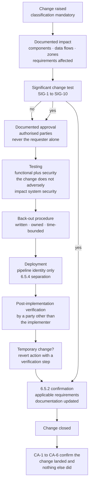

# 04.08 — Change Control

| Field | Value |
|---|---|
| Document ID | MRG-PCI-2026-408 |
| Program | Marketa Retail Group — PCI DSS v4.0.1 Compliance Program |
| Phase | 04 — Build &amp; Maintain Secure Systems |
| Version | 1.0 |
| Status | Approved |
| Owner | Trevor Kim, Director of Infrastructure &amp; Network |
| Approver | Naomi Bhatt, Chief Information Security Officer |
| Date | 2026-07-15 |
| Classification | Confidential — Cardholder Data Environment // Illustrative Portfolio Sample |

## Purpose

Requirement **6.5** — change management as PCI DSS obliges it. This document covers **6.5.1** (change control procedures for all system components), **6.5.2** (confirmation that all applicable requirements are in place and documentation updated on completion of a significant change), **6.5.3** (separation of pre-production and production environments, including access control), **6.5.4** (separation of duties between pre-production and production) and **6.5.6** (test data and test accounts removed before a system goes into production).

**6.5.5** — live PANs are not used for testing or development — is delivered in **04.07 §9**, with the development lifecycle it belongs to. It is not re-delivered here.

The keystone of this document is **§4: what counts as a significant change.** PCI DSS does not define the term. It uses it in **6.5.2**, in **11.3.1** internal vulnerability scanning, in **11.4.2** and **11.4.3** penetration testing, and in **12.5.2** scope confirmation, and it leaves the entity to say what it means. An entity that never writes the definition down has, in practice, defined it as *nothing*, because a trigger nobody can recognise never fires. Marketa's definition is **SIG-1 to SIG-10**, and every one of them carries a named downstream obligation.

Requirement **1.2.2** — change control for network connections and NSC configurations — is delivered in **03.09** and is a specialisation of this process, not a parallel one. 6.5.1 is the general obligation that 1.2.2 points at.

## 1. The Shape of the Requirement Family

| Requirement | Obligation in one line | Where it lands |
|---|---|---|
| **6.5.1** | Changes to all system components are managed: documented impact, documented approval by authorised parties, testing that the change does not adversely impact system security, and back-out procedures | §3 |
| **6.5.2** | On completion of a **significant** change, all applicable PCI DSS requirements are confirmed in place on all new or changed systems and networks, and documentation is updated | §4 and §5 |
| **6.5.3** | Pre-production environments are separated from production environments, and the separation is enforced with access controls | §6 |
| **6.5.4** | Roles and functions are separated between production and pre-production environments to provide accountability such that only reviewed and approved changes are deployed | §7 |
| **6.5.5** | Live PANs are not used for testing or development | **04.07 §9** |
| **6.5.6** | Test data and test accounts are removed from system components before the system goes into production | §8 |

Two of these are frequently mishandled in opposite directions. **6.5.3 is read too narrowly** — as "we have a test server" — when the requirement's teeth are in the access-control limb, which is about whether a pre-production identity can reach a production system. **6.5.2 is read too broadly** — as "we re-assess everything after every change" — which is unsustainable and therefore not done, when what the requirement actually obliges is a bounded confirmation triggered by a defined event.

## 2. The Change Population and Its Classes

6.5.1 attaches to **all system components**, which for Marketa means the **71 assessed components** plus the security-impacting delivery path that can alter them — the build pipelines, the infrastructure-as-code repositories, the CDN and edge configuration, the CMS and the tag-management console enumerated in 02.08. It does not stop at the CDE boundary, and stopping there is the most common way an entity's change process ends up not covering the systems that decide what the CDE contains.

| Class | Definition | Approval | Testing | Back-out | Volume, 2026-04-01 → 2026-07-15 |
|---|---|---|---|---|---|
| **CHG-1 Standard** | Pre-approved, repeatable, low-variance work with a published procedure and a known-good outcome — patch waves, certificate renewal, capacity addition within an existing pattern | Pre-approved as a class, annually, by the change authority; each instance recorded | Automated verification in the procedure | Defined in the procedure | **612** |
| **CHG-2 Normal** | Everything that is neither pre-approved nor significant | Change authority, plus the owning service manager | Test evidence attached before approval | Documented per change | **388** |
| **CHG-3 Significant** | Meets one or more of **SIG-1 to SIG-10** — §4 | Change authority **plus** the CISO or a named delegate, **plus** the Payment Card Compliance Manager | As CHG-2, **plus** the 6.5.2 confirmation in §5 | Documented, and rehearsed where the change is not trivially reversible | **27** |
| **CHG-4 Emergency** | Restoration of service or containment of an active security incident at P1 or P2 | Two approvers at the time, one of whom is from Security Operations; retrospective ratification within 5 business days | Post-implementation, and recorded as such | Mandatory, and the first thing agreed | **16** |

**Classification is a mandatory field and it cannot be set by the requester alone** for any change touching an assessed component, a payment page template or a boundary. This is the same rule 03.09 §3.2 applies to network changes, and it exists for the same reason: everything downstream of a change record hangs off its classification, so the classification is where a process gets quietly defeated.

Of the 1,043 changes in the period, **34 were rejected at approval** and **11 failed post-implementation verification and were backed out**. Those two numbers are reported because a change process with a zero rejection rate is an approval workflow, not a control.

## 3. The 6.5.1 Procedure

6.5.1 names four elements. Marketa implements them as gates in a single record, and a change cannot advance past a gate that has not produced its artefact.

### 3.1 The four elements, and what each has to contain

| 6.5.1 element | What Marketa requires in the record | Why it is written this way |
|---|---|---|
| **Reason for, and description of, the change** | Business or technical driver, the components affected by identifier from the 12.5.1 inventory, the zones touched, and whether any account-data flow is created, altered or removed | A change record that names a system by nickname cannot be reconciled to the assessed population, and reconciliation is how the QSA samples |
| **Documentation of security impact** | Which PCI DSS requirements the change could affect, stated by number; whether the change alters a boundary, an authentication path, a cryptographic control, a logging source or a payment page; the scope-delta judgement | Naming the requirements is what converts "we considered security" into something an assessor can test. **A blank security-impact field fails the gate** |
| **Documented approval by authorised parties** | Named individuals, not roles, with timestamps. Two approvers for CHG-3, and never the requester's own line manager alone for anything affecting a CDE component | Approval by the requesting team's management is the failure mode that lets a team approve its own risk appetite |
| **Testing to verify the change does not adversely impact system security** | Functional test evidence **plus** a security verification appropriate to the change: the authorisation test suite for an application change, a negative boundary test for a network change, a baseline assertion run for a configuration change, a CSP and script-manifest reconciliation for a payment page change | 6.5.1's third limb is the one most often discharged with functional testing alone. A change can work perfectly and still open a hole |
| **Back-out procedures** | A written revert, an owner, and the time within which it must be decided. For a change that is not trivially reversible — a schema migration, a key rotation, a firmware upgrade — the back-out is **rehearsed in pre-production before the change is approved**, not written after | An unrehearsed back-out on an irreversible change is an aspiration. Nine back-outs were invoked in the period; all nine completed inside their stated window |

### 3.2 Temporary changes — the third PAN-03 control

Phase 02 recorded three preventive controls arising from finding **PAN-03**, the debug log that held 1,143 PAN instances for seven months because a temporary log level was never reverted. **04.07 §8 delivered two. This is the third.**

| Element | Rule |
|---|---|
| Definition | Any change whose approved end state differs from its implemented state — a raised log level, a widened rule, a disabled control, a relaxed timeout, an added account, a bypassed gate |
| Mandatory fields | A **revert action**, a **revert-by date**, a named revert owner, and a **verification step that proves the revert happened** |
| Closure rule | **The change record cannot close until the revert is verified.** Not until the revert is performed — until it is *verified*, by evidence, by someone other than the person who performed it |
| Expiry | Maximum 30 days. An extension is a fresh approval by the original approvers, capped at two extensions before it escalates to the PCI Steering Committee and is reclassified as a permanent change requiring a permanent justification |
| Reporting | Open temporary changes are a standing item at the weekly PCI Working Group, with age |
| Operating record | **41 temporary changes** raised in the period; 39 reverted and verified inside their window; 2 extended once; **0 open beyond 30 days at 2026-07-15** |

The distinction between *performed* and *verified* is the entire content of this control. PAN-03's log level was almost certainly believed to have been reverted by somebody. Nobody looked.

## 4. What Counts as a Significant Change

This is the definition the rest of the programme depends on. It is owned by the CISO, approved by the PCI Steering Committee, and supported by the **elective 12.3.1 targeted risk analysis on 12.5.2 scope-reconfirmation triggers** — number 14 in the programme's set of fourteen, recorded in 01.11 §6. It is elective because the standard does not compel an analysis for this judgement; it exists because the judgement is a risk decision and the QSA will ask what it rests on.

### 4.1 The ten triggers

| ID | Trigger | Rationale |
|---|---|---|
| **SIG-1** | New hardware, software or a new system component **added to the CDE** or to the connected-to population, or an existing component moved into either | A component that arrives inside the assessed population arrives with the full requirement set attached |
| **SIG-2** | **Replacement or major upgrade** of hardware or software on any assessed component, including a firmware release that changes platform defaults | The 2.2.2 lesson from 04.01 §3 — three vendor default credentials were reintroduced by firmware updates in the operating period |
| **SIG-3** | Any change to the **flow, storage, processing or transmission of account data**, in any channel, including the introduction or removal of a provider in the path | This is the trigger that decides whether the CDE is still the CDE |
| **SIG-4** | Any change classified as **segmentation-affecting** under 03.03 §4.1, including the four types added in June 2026 | Delegates to the 1.2.2 list rather than duplicating it, so the two cannot diverge |
| **SIG-5** | Any change to a **payment page template**, to the set of scripts executing on one, or to the tag-management or CDN configuration that serves one | 6.4.3's population is defined by this trigger. **A new payment template that never enters the inventory is the ECOM-C3 collapse condition** |
| **SIG-6** | Engagement of a **new third-party service provider**, or a material change to what an existing provider does | Also acquirer obligation **C6**, pre-engagement notification to Cardinal |
| **SIG-7** | A change to an **authentication, authorisation or cryptographic control** on an assessed component — an identity provider change, an MFA policy change, a key class change, a TLS termination change | These are controls whose failure is silent |
| **SIG-8** | A **new physical location** processing or storing account data, a new merchant identifier, a new sales channel, or an acquisition | Scope arrives through the business, not through IT |
| **SIG-9** | A change to a **logging, monitoring or detection** source covering an assessed component, including the removal or redirection of one | R-28's failure mode: the dashboard still looks healthy |
| **SIG-10** | A **store build image revision** or any change executed simultaneously across the 482-store estate | Principle SP-9. **A build image is a change to 482 networks executed once**, and 03.07 is what happens when it is treated as a platform-engineering artefact |

Four things are deliberately **not** significant changes, and naming them is as important as naming the ten: a patch applied within an existing baseline and pattern; a rule change inside an already-approved flow that does not widen it; a capacity addition using an existing, asserted image; and a content change to a non-payment page. Each is CHG-1 or CHG-2, each still carries the full 6.5.1 procedure, and each is still asserted by CA-1 to CA-6. **A definition that captures everything triggers nothing, because the organisation stops believing it.**

### 4.2 What a significant change triggers

| Downstream obligation | Requirement | Owner | Delivered in |
|---|---|---|---|
| Confirmation that all applicable requirements are in place on new or changed systems, and documentation updated | **6.5.2** | Owen Castellanos | §5, here |
| Internal vulnerability scan of the affected components | **11.3.1** | Marcus Hale | Phase 06 |
| Internal and external **penetration testing** where the change is a significant infrastructure or application upgrade or change | **11.4.2**, **11.4.3** | Marcus Hale | Phase 06 |
| **Segmentation** penetration testing, where the change touches segmentation controls or methods | **11.4.5** | Trevor Kim | 03.09; test cycle in Phase 06 |
| **Scope re-confirmation** — the assessed population, the data flows, the segmentation justification and the third-party inventory revisited | **12.5.2** | Owen Castellanos | Phase 06, against the Phase 02 determination |
| Notification to Cardinal Merchant Bank where the change is material to the CDE, channels or processing arrangements | Obligation **C7** | Elena Marchetti | Phase 01 calendar |
| Diagram and inventory updates as a **completion criterion**, not as a follow-up task | 1.2.3, 1.2.4, 12.5.1 | Trevor Kim | 03.09 |

The obligations are raised **automatically by the classification**, at the moment the record is created, and they appear on the change as open items that block closure. They are not raised by somebody remembering. A re-test obligation may be **declined**, but only with a written reason recorded at the Boundary Change Authority, which is the discipline 03.09 §3.3 established when three of fourteen re-test obligations were carried forward rather than declared covered by proximity.

### 4.3 The twenty-seven significant changes in the period

| Trigger | Count | Notable instances |
|---|---|---|
| SIG-1 — component added to the assessed population | 4 | CT-31 authenticated scanner; the log-content sampling pipeline; two Z2 workloads |
| SIG-2 — replacement or major upgrade | 6 | Two appliance firmware releases that changed defaults; the CT-14 secrets vault upgrade; the CDE-04 platform major version |
| SIG-3 — account-data flow change | 1 | The store special-order Truvance payment link, which **removed** a flow |
| SIG-4 — segmentation-affecting | 9 | Including SB-4.2 across 482 stores and the Track A restoration at 37 stores |
| SIG-5 — payment page or script change | 3 | Tag manager removal from all six templates; the CSP move to nonces; the SRI enforcement release |
| SIG-7 — authentication or cryptographic control | 3 | K-07 vault re-key; internal CA certificate agent rollout; TLS 1.0 and 1.1 removal |
| SIG-9 — logging or detection source | 1 | Redirection of appliance syslog to CT-18 |
| **Total** | **27** | **27 of 27 carried a completed 6.5.2 confirmation; 4 produced a finding — §5.2** |

SIG-3's single instance is worth pausing on. The change that triggered it **removed** an account-data flow rather than creating one, and an entity that only classifies additions as significant will miss it. A removed flow changes the scope determination exactly as much as an added one does, and the 12.5.2 confirmation has to record which flows no longer exist as carefully as it records which ones do.

## 5. Confirming Requirements After a Significant Change — 6.5.2

### 5.1 What the confirmation is, and what it is not

6.5.2 obliges that, upon completion of a significant change, **all applicable PCI DSS requirements are confirmed to be in place on all new or changed systems and networks, and documentation is updated as applicable.**

It is not a re-assessment. It is a bounded confirmation with three properties Marketa enforces:

| Property | Marketa's rule |
|---|---|
| **Bounded by the change, not by the estate** | The confirmation covers the systems and networks that were new or changed, and the requirements that could be affected by what changed. The affected-requirement list is derived from the security-impact field completed at §3.1, so it is written **before** the change, when nobody knows yet whether the answer will be inconvenient |
| **Evidence, not attestation** | Each confirmed requirement carries the artefact that confirms it — an assertion run, a scan result, a configuration extract, a review record. **A signature saying "confirmed" is not a confirmation** |
| **Documentation updated as a completion criterion** | Network diagrams, data-flow diagrams, the 12.5.1 inventory, the baseline mapping, the script inventory, the services-and-ports register and the TPSP register are updated before the change closes, not in a subsequent tidy-up |

The confirmation is performed by the Payment Card Compliance Manager with the component owner, and reviewed by Security Operations. It is not performed by the implementing team alone, for the same reason nobody verifies their own change.

### 5.2 The four confirmations that produced a finding

Twenty-seven confirmations, twenty-three clean. The four that were not are the evidence that the control is doing something.

| Change | What the 6.5.2 confirmation found | Disposition |
|---|---|---|
| Appliance firmware upgrade, 2 components | The vendor's release **reinstated a default SNMP community string and a default administrative account** — a 2.2.2 regression that the functional test could not see and the CA-4 weekly assertion would have caught up to six days later | Credentials rotated within the hour; the class added to the SIG-2 trigger rationale; CA-4 frequency for appliance components raised to daily following a firmware event |
| CDE-04 platform major version | Native database audit configuration **did not survive the upgrade**, silently losing a Requirement 10 event source on a CDE component | Audit configuration restored and added to the platform's post-upgrade assertion set; R-28's failure mode confirmed as real in Marketa's estate |
| Secrets vault upgrade, CT-14 | Documentation limb — the cryptographic architecture description in 04.03 §3 was **accurate but stale by one key class**, and the change would have closed with it stale | Description updated as a completion criterion; the 04.03 inventory added to the standing documentation checklist |
| SB-4.2 store build image | Confirmation completed on a **sample of 41 stores rather than the 482 changed**, and the programme recorded that as a limitation rather than claiming estate-wide confirmation | Recorded as such; the gap is covered by the daily DA-1 to DA-6 assertion across all 482, which is continuous rather than sampled |

The last row is the honest one. **A 6.5.2 confirmation across 482 sites cannot be performed by inspection**, and the programme says so rather than describing a sample as a census. What makes the claim defensible is not the sample; it is that a continuously operating assertion covers the population the sample does not.

## 6. Separating Pre-Production from Production — 6.5.3

6.5.3 obliges pre-production environments to be separated from production environments, **and the separation enforced with access controls.** The second limb is the requirement; the first is only a precondition for it.

| Environment | Purpose | Separation from production | Who can reach it |
|---|---|---|---|
| **ENV-DEV** | Local and shared development | Distinct AWS accounts, distinct VPCs, distinct DNS namespace, distinct identity groups. **No network path to Z1 or Z2 exists** | All 74 development personnel |
| **ENV-CI** | Build and automated test | Distinct account; egress to the internal registry proxy only; no credential valid in production is resolvable | Pipeline identities; 9 platform engineers |
| **ENV-QA** | Functional, regression and security test, including DAST | Distinct account; provider **sandbox** endpoints only, at Truvance and Cadence, neither of which accepts a live account number | Development personnel plus 12 QA engineers |
| **ENV-STG** | Production-equivalent staging; back-out rehearsal; 11.6.1 detection testing | Distinct account, production-equivalent configuration, **synthetic data only**. Deliberately the environment closest to production and therefore the one with the strictest access control of the four | 19 named individuals; access reviewed quarterly |
| **PROD** | Production | — | No interactive human write access to the payment-page origin; all deployment through pipeline identities; administrative access brokered through CT-11 |

### 6.1 The access-control limb, stated as five prohibitions

| # | Prohibition | Enforcement | Assertion |
|---|---|---|---|
| 1 | No credential, key or secret is valid in more than one environment | Separate CT-14 vault namespaces per environment with no cross-namespace policy; separate K-03 internal CA intermediates | Weekly key-material scan; CA-4 |
| 2 | No network path exists from a pre-production environment into Z1 or Z2 | Distinct accounts with no peering, no transit attachment, no VPC endpoint service, and a service control policy denying their creation | **DA-6** continuous plan-diff; monthly reachability computation |
| 3 | No production data is copyable to a lower environment | No shared credential; backup restore targets constrained to production and requiring dual authorisation; no production database read replica outside PROD | 04.07 §9; quarterly discovery over all four pre-production environments |
| 4 | A pre-production identity cannot assume a production role | Distinct identity providers for pre-production and production administrative access; no trust relationship between them; MFA under 8.4.2 on the production path | CT-01 configuration; quarterly access review |
| 5 | Pre-production hostnames, endpoints and certificates are not resolvable or trusted from production | Distinct DNS zones; distinct CA intermediates; production trust stores exclude the pre-production intermediate | Certificate inventory under 4.2.1.1; CA-5 |

Prohibition 3 is the one that carries 6.5.5, and prohibition 2 is the one that makes it true rather than merely policy. **An environment that could copy production data but is instructed not to has separated its intentions, not its environments.**

## 7. Separation of Duties — 6.5.4

6.5.4 obliges roles and functions to be separated between production and pre-production environments to provide accountability such that **only reviewed and approved changes are deployed.**

| Function | Development personnel | Platform engineering | Deployment controller | Service manager | Security Operations |
|---|---|---|---|---|---|
| Write code | **Yes** | Yes, for pipeline and IaC | No | No | No |
| Approve a peer review | Yes, non-author only | Yes, non-author only | No | No | Optional reviewer |
| Approve a release | No | No | No | **Yes** | No |
| Deploy to pre-production | Yes | Yes | Executes | No | No |
| **Deploy to production** | **No** | **No** | **Executes, as the only identity that can** | No | No |
| Hold standing production write access | **No** | **No** | n/a | No | No |
| Verify a change post-implementation | No | No | No | No | **Yes** |

Three properties make this more than a table.

**Deployment is an identity, not a permission.** Production deployment is performed by the pipeline identity and by nothing else. The deployment controller verifies the artefact signature under **K-08**, the presence of a management release approval, and the passing of every gate in 04.07 §2 before it will promote. A human with a console cannot substitute for it, because the human does not hold the role that can write to the target.

**The author cannot be the approver and cannot be the deployer.** 04.07 §4.2 keeps peer review and management release approval separate; this document keeps both separate from execution. The three are held by different people by construction, and 6.5.4's word — *accountability* — is what that construction buys.

**Break-glass exists, is narrow, and is noisy.** Two named individuals hold an emergency production credential, retrievable only through a dual-authorisation workflow in CT-11, which issues a time-boxed credential, records the session in full, and raises a P2 alert to Security Operations at the moment of issue rather than at the next review. It was used **twice** in the period, both during P1 incidents, both retrospectively reviewed at the change authority, and both confirmed as legitimate.

## 8. Test Data and Test Accounts — 6.5.6

6.5.6 obliges test data and test accounts to be **removed from system components before the system goes into production.** It is a small requirement with a long tail, because test artefacts are created by people who are certain they will remember to remove them.

| Control | Implementation |
|---|---|
| **Release gate** | A pre-promotion scan of the artefact and its configuration for test account identifiers, seeded fixture datasets, brand test card ranges, sample schemas, demo content and default vendor accounts. **The gate is blocking and is not overridable by the deploying engineer** |
| Naming discipline | Test principals are created only from a reserved namespace, so they are enumerable by pattern rather than by memory |
| Runtime assertion | The production account inventory is asserted daily against the reserved namespace; a match is an incident, not a report line. This is the same silence-and-pattern discipline as **CA-1** and **CA-4** |
| Data side | Synthetic generation only, per 04.07 §9; the quarterly discovery pipeline runs over production **and** all four pre-production environments |
| Vendor defaults | Handled as **SCS-05** and **SCS-06** in 04.01, asserted weekly by CA-4, because a vendor default account is a test account somebody else left behind |
| Documentation | The release record states explicitly that the 6.5.6 gate passed, with the scan artefact attached |

### 8.1 What the first run of the gate found

The gate went live on 2026-05-04 and was run retrospectively against the then-current production state of all nine applications and both legacy batch integrations before it began gating new releases.

| Finding | Count | Disposition |
|---|---|---|
| Test accounts present in production | **7** — 4 in the customer service console, 2 in the reporting extract service, 1 in a legacy batch integration | All disabled the same day and deleted within 5 days; none had authenticated in the preceding 12 months, confirmed from CT-01 |
| Seeded fixture datasets present in production | **2** — a product-review fixture and an address-validation fixture | Removed; the seeding job rewritten to be environment-conditional |
| Sample schemas or demo content | **0** in the application tier; the 6 platform instances were removed in 04.01 §5.1 | Closed |
| Brand test card numbers in production configuration | **0** | Confirmed by pattern scan across configuration stores |

Seven accounts is not a dramatic number, and the point of reporting it is not drama. **Every one of the seven was created by somebody who intended to remove it**, and the reason the gate exists is that intention has a measured failure rate in this estate of seven per eleven applications.

## 9. Change Control Against the Seasonal Freeze

Constraint **CON-01** freezes store systems, store networks and the POS estate from October to January. The freeze is enforced by Store Operations and Merchandising, is not waivable by the programme, and interacts with 6.5 in a way worth stating precisely.

| Position | Statement |
|---|---|
| What the freeze does to 6.5.1 | **Nothing.** The change process runs unchanged; there is simply far less store-side change flowing through it |
| What the freeze does to significant changes | A store-side significant change inside the freeze requires the **joint approval** of the CFO as programme sponsor and the Director of Store Operations, per 04.06 §4.2. Neither alone |
| What the freeze does to 6.5.2 | Nothing. A significant change that happens during the freeze carries the same confirmation, and the fact that it happened during a freeze is recorded on it |
| What the freeze does **not** do | It does not suspend the one-month patch obligation, and it does not suspend the 11.3.1, 11.4.3 or 12.5.2 obligations that a significant change triggers. **It converts a breach of any of them into a `VE-nn` deferral that a named person has to sign**, with an expiry no later than 31 January |
| The programme's planning response | Everything store-side completes before **2026-09-30**, so that the freeze begins from a clean baseline. QSA fieldwork begins 2026-11-02, inside the freeze, which is deliberate: an assessor arriving during a change freeze sees an estate in its stable state |

The freeze's real risk to this requirement family is not the frozen months. It is **February**, when four months of deferred change is released at once into a process whose approval capacity was sized for a normal month. The change authority runs an expanded post-freeze sitting through February and March, and the release is wave-planned rather than opened, which is a lesson the 2025–26 freeze taught at a cost of two rushed changes that both had to be backed out.

## 10. Requirement 6.5 Coverage Summary

| Requirement | Position at 2026-07-15 | Evidence |
|---|---|---|
| **6.5.1** | Met — four change classes across the 71 assessed components and the security-impacting delivery path; documented impact naming affected requirements; named approvers with the requester excluded; security testing distinct from functional testing; back-out written and, for irreversible changes, rehearsed. **1,043 changes, 34 rejected, 11 backed out** | Change records; approval records; test artefacts; back-out records |
| **6.5.1 — temporary changes** | Met — revert action, revert-by date and a **verification step required before closure**. The third PAN-03 preventive control. 41 raised, 0 open beyond 30 days | Change records; the open-temporary-change report |
| **6.5.2** | Met — **SIG-1 to SIG-10** as the definition, an automatically raised obligation set, evidence-based confirmation performed by a party other than the implementer, documentation updated as a completion criterion. **27 significant changes, 27 confirmations, 4 findings** | The definition; the confirmation records; the four findings and their dispositions |
| **6.5.3** | Met — four separated pre-production environments with distinct accounts, identities, credentials, DNS and certificate authorities, and **five enforced prohibitions** asserted rather than asserted-to | Account structure; identity configuration; reachability computation; DA-6; key-material scan |
| **6.5.4** | Met — deployment is an identity no human holds; author, approver and deployer are different by construction; break-glass dual-authorised, time-boxed, recorded and alerting on issue, used twice | Role matrix; deployment controller configuration; CT-11 session records |
| **6.5.5** | Met — **delivered in 04.07 §9.** Synthetic data only, no production copy path, quarterly discovery over pre-production | 04.07 §9 |
| **6.5.6** | Met — blocking pre-promotion gate, reserved test namespace, daily production account assertion. First retrospective run found **7 test accounts and 2 fixture datasets**, all removed | Gate configuration; scan artefacts; removal records |
| **12.3.1 position** | **No targeted risk analysis is compelled by 6.5.** The significant-change definition is supported by the **elective** analysis on 12.5.2 triggers — number 14 of the programme's fourteen — and the fact that it is elective is recorded | 01.11 §6; the analysis |

## 11. Risks Treated

| Risk | Rating | Treatment | Residual |
|---|---|---|---|
| **R-32** — a boundary-affecting change is classified as routine and quietly alters what a zone can reach | Moderate 12 | SIG-4 delegates to the 1.2.2 segmentation-affecting list so the two definitions cannot diverge; classification is mandatory and cannot be set by the requester; obligations are raised automatically by the classification rather than by recollection | **Low** — maintained, not solved. It is Low only while the classification discipline holds |
| **R-33** — scope creep as new systems, integrations or channels enter without a scope determination | Moderate 12 | SIG-1, SIG-6 and SIG-8 make an arrival a significant change; the 6.5.2 confirmation forces the 12.5.2 revisit; acquirer obligation C7 attaches | **Low** |
| **R-34** — payment-page script inventory drift | Moderate 12 | **SIG-5** makes any template, script, tag-manager or CDN change a significant change, which is the change-control half of the 6.4.3 control set in 04.10 | Moderate until 04.10's inventory reconciliation and the Phase 06 monitoring have operating history |
| **R-19** — assets recorded as decommissioned remain powered and reachable | Moderate 9 | Decommissioning is a change with a verified end state; the temporary-change closure rule applies to a partial decommission; CA-1's silence rule catches what the record misses | **Low** by Phase 06 |
| **R-30** — vulnerabilities not remediated within one month, against the freeze | Moderate 12 | §9 — the freeze converts a miss into a signed `VE-nn` deferral rather than an invisible gap; the emergency route survives the freeze with joint approval | Moderate. The constraint is priced, not argued away |
| **R-37** — file integrity and change-detection coverage lapses on a CDE component | Low 6 | Baseline re-establishment after a change is a **completion criterion**, not a follow-up; SIG-9 makes the removal or redirection of a detection source a significant change | **Low** |
| **R-01** — payment-page script injection | High 20 | Partially, through SIG-5 and the 6.5.3 and 6.5.4 separation that keeps human hands off the payment-page origin. **The substantive treatment is 04.10** | High until 6.4.3 and 11.6.1 operate with history |

## Cross-References

| Reference | Relevance |
|---|---|
| 01.08 — Scope Assumptions &amp; Constraints | **CON-01** the seasonal freeze; **CON-02** the 482× multiplier |
| 01.11 — Compliance Calendar &amp; Obligations | The fourteen targeted risk analyses, including the **elective** 12.5.2 significant-change analysis; obligations C6 and C7 |
| 02.08 — Connected-To &amp; Security-Impacting Systems | The delivery-path components this process must cover, including CT-52 and the tag-management console |
| 03.07 — Segmentation Penetration Test | What a change process that recognised neither precondition as a boundary event actually cost |
| 03.09 — NSC Ruleset Governance | **1.2.2** as a specialisation of 6.5.1; the Boundary Change Authority; the four change types added in June 2026 |
| 04.01 — Secure Configuration Standards | **CA-1 to CA-6**, which confirm a change landed and nothing else did; SCS-05 and SCS-06 on vendor defaults |
| 04.03 — Cryptographic Key Management | **K-08** artefact signing, verified by the deployment controller; the cryptographic architecture description as a 6.5.2 documentation artefact |
| 04.06 — Vulnerability Management | The `VE-nn` deferral register; the emergency patch route through the freeze |
| 04.07 — Secure Software Development | **6.5.5**; peer review and management release approval; the two PAN-03 controls this document completes |
| 04.10 — Payment Page Script Management | **SIG-5**, and the 6.4.3 controls it feeds |
| 04.11 — Configuration Baseline Compliance | How the deployed state is measured after a change, and what happens when it diverges |
| Phase 06 — Monitoring, Testing &amp; Third Parties | 11.3.1, 11.4.2, 11.4.3 and 11.4.5 obligations raised by a significant change; the 12.5.2 confirmation |

---
[⬅ Previous](04.07-secure-software-development.md) · [🏠 Phase 04 Home](04.00-README.md) · [Next ➡](04.09-public-facing-application-protection.md)
