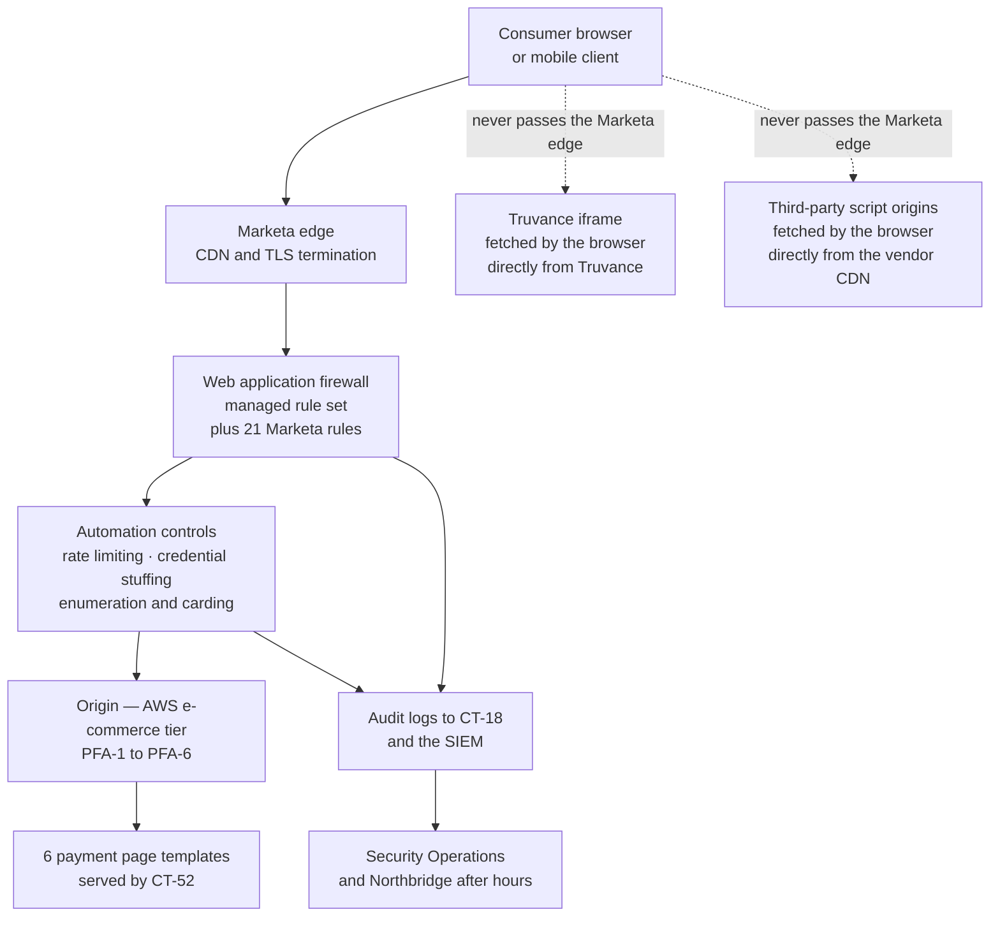

# 04.09 — Public-Facing Application Protection

| Field | Value |
|---|---|
| Document ID | MRG-PCI-2026-409 |
| Program | Marketa Retail Group — PCI DSS v4.0.1 Compliance Program |
| Phase | 04 — Build &amp; Maintain Secure Systems |
| Version | 1.0 |
| Status | Approved |
| Owner | Sonia Rendell, Director of E-Commerce Engineering |
| Approver | Naomi Bhatt, Chief Information Security Officer |
| Date | 2026-07-15 |
| Classification | Confidential — Cardholder Data Environment // Illustrative Portfolio Sample |

## Purpose

Requirement **6.4.1** and **6.4.2** — the protection of public-facing web applications. This document establishes the population of public-facing web applications, records the determination that **6.4.2 has superseded 6.4.1 and is now the only route**, and delivers Marketa's automated technical solution: an edge web application firewall in blocking mode across the storefront estate, with its tuning discipline, its exclusion register, its failure behaviour and the evidence it produces.

**6.4.3 is not here.** Payment-page script management is 04.10, and the two requirements are routinely conflated because both concern the e-commerce channel. They protect against different things by different means. A WAF inspects requests arriving at Marketa's origin. A script executing in a consumer's browser, fetched by that browser directly from a third party's content delivery network, never passes through Marketa's edge at all. **The WAF cannot see it, and no amount of WAF tuning will change that.** §8 states the limits explicitly, because a programme that presents a WAF as its answer to digital skimming has misread both requirements.

## 1. The Requirement, and Which Version of It Applies

This is the part of 6.4 that is most often got wrong in a v4.0.1 assessment, and getting it wrong in either direction produces a finding.

| Requirement | Text, in summary | Status for a 2026 assessment |
|---|---|---|
| **6.4.1** | For public-facing web applications, new threats and vulnerabilities are addressed on an ongoing basis and the applications are protected against known attacks by **either** (a) reviewing them with manual or automated application vulnerability security assessment tools or methods **at least once every 12 months and after significant changes**, by an entity that specialises in application security, with all vulnerabilities corrected and the application re-evaluated after the corrections; **or** (b) installing an automated technical solution that continually detects and prevents web-based attacks | **Superseded.** The requirement carries an applicability note stating it is superseded by 6.4.2 as of **31 March 2025**. The either/or no longer exists |
| **6.4.2** | For public-facing web applications, an **automated technical solution** is deployed that **continually detects and prevents web-based attacks**, with at least the following: it is installed in front of public-facing web applications and is configured to detect and prevent web-based attacks; it is actively running and kept up to date as applicable; it generates audit logs; and it is configured to **either block web-based attacks or generate an alert that is immediately investigated** | **Applicable, and mandatory.** One of the 51 future-dated requirements now in force. **2026 is Marketa's first assessment with it in force** |

Two consequences follow, and Marketa records both so that neither is discovered in fieldwork.

**The periodic-review option is gone.** An entity that has been discharging 6.4.1 by commissioning an annual application security review is no longer compliant on that basis alone, however good the review is. The review remains valuable — Marketa commissions one, in September 2026, from Ironwood Security Labs — but it is **not** how 6.4.2 is met, and the ROC will not present it that way.

**6.4.1 is not separately assessed.** It is recorded in the ROC as superseded, with the supersession date and the reasoning, and 6.4.2 is assessed in the defined approach. This is a recorded determination rather than an omission, in the same discipline that 03.01 applies to 11.4.6 and 04.03 applies to 3.6.1.1 — **being unable to explain why a requirement is absent from the ROC is worse than the absence.**

Where the Phase 03 register and traceability documents map risks **R-01**, **R-22** and **R-35** to "6.4.1", that mapping predates this determination and should be read as pointing at **6.4.2**. 04.12 restates it.

## 2. The Population — What Is a Public-Facing Web Application Here

6.4.2 attaches to public-facing web applications. The population has to be determined explicitly, because a requirement applied to the wrong set is either theatre or a gap, and because the boundary between "an application Marketa publishes" and "an application published on Marketa's behalf" decides who owes the control.

| ID | Application | Public-facing | In the 6.4.2 population | Reasoning |
|---|---|---|---|---|
| **PFA-1** | **Storefront**, including the **6 payment page templates** | Yes | **Yes** | Marketa-authored, Marketa-served, and the highest-value surface in the estate |
| **PFA-2** | Customer account and order self-service, including TPL-04 and TPL-05 | Yes | **Yes** | Marketa-authored; holds order history, addresses and card-on-file registration |
| **PFA-3** | Storefront API consumed by the Marketa mobile applications and by the store special-order clients | Yes | **Yes** | A public-facing web application does not stop being one because its client is not a browser. **This is the population entry entities most often miss** |
| **PFA-4** | Special-order payment-link landing pages | Yes | **Yes** | Created as the compliant path for R-22; publicly reachable by design |
| **PFA-5** | Brand and content site, CMS-served | Yes | **Yes** | Shares the storefront's origin and its edge, and can therefore influence the storefront's cookie and script context |
| **PFA-6** | Corporate investor and press pages | Yes | **Yes** | Low value, same origin family, included rather than argued about |
| *(excluded)* | Careers and recruitment portal | Yes | **No** | **Vendor-hosted on the vendor's own origin and infrastructure.** Marketa cannot install anything in front of it. Governed under **12.8** as a TPSP arrangement, with the provider's own protection evidenced in the quarterly review. The determination is recorded so that its absence from the WAF configuration is explained once rather than four times |

**Six public-facing web applications, all behind one edge.** PFA-5 is in the population for a reason worth stating: a content site sharing an origin with a storefront is not a separate risk domain. A stored cross-site scripting flaw in a CMS-served page can set a cookie, register a service worker or inject script into a context the checkout also occupies. **Origin, not business importance, is what determines whether two applications share a threat model.**

## 3. The Decision — ADR-0010

Marketa considered whether to meet 6.4.2 with an edge WAF operated as a managed service, a self-hosted reverse-proxy WAF, or a runtime application self-protection agent embedded in the application. The decision record is **ADR-0010**, and its content is summarised here because 6.4.2's testing procedures ask what the solution is and why.

| Element | Position |
|---|---|
| **Decision** | An **edge web application firewall** at the CDN and load-balancing tier, in **blocking** mode, in front of all six public-facing web applications, with a managed rule set plus Marketa custom rules |
| Why not the annual specialist review | **It is not available.** 6.4.1's review option was superseded on 2025-03-31. This is the shortest and least interesting reason, and it is the decisive one |
| Why not a self-hosted reverse proxy | It terminates behind the CDN, so it inspects only what the CDN has already accepted, and it adds a Marketa-operated component in the request path of a channel carrying 15.7M transactions a year. The availability cost was judged to exceed the control benefit |
| Why not runtime self-protection alone | An in-application agent sees requests that reach the application, which excludes protocol-level attacks, volumetric automation and anything the platform layer answers. It is complementary rather than substitutive, and it cannot be installed in front of PFA-5's CMS at all |
| **Why blocking rather than alert-and-investigate** | 6.4.2 permits either limb. **Alert-and-investigate obliges immediate investigation of every alert**, which at Marketa's request volume is a staffing commitment Northbridge and Security Operations could not evidence at 03:00 on a December Saturday. Marketa chose the limb it can prove. §6 |
| Accepted consequences | False positives become customer-visible failures rather than analyst work items, so the tuning discipline in §7 is load-bearing; and a blocking control in the checkout path needs an explicit, recorded failure behaviour, which is §6.3 |
| Approver | Naomi Bhatt, endorsed by the PCI Steering Committee 2026-04-06 |

## 4. Deployment

The two dotted paths are the reason this document and 04.10 are separate. **The WAF sits in front of Marketa's origin. It does not sit in front of the consumer's browser.** Everything the browser fetches from somewhere other than Marketa is invisible to it — including the Truvance iframe, which is correct and by design, and including every third-party script on a payment page, which is the 6.4.3 problem.

| Layer | Configuration |
|---|---|
| Placement | Edge, in front of TLS-terminating load balancers, in both us-east-1 and us-west-2. **No route to the origin bypasses it** — origin security groups accept traffic only from the edge fleet, asserted daily by CA-2 and by the DA-6 plan-diff on CT-30 |
| Rule sources | The provider's managed rule set, aligned to the OWASP Top 10 and OWASP Core Rule Set categories; the provider's managed CVE and virtual-patching rule set; **21 Marketa custom rules** authored against this estate |
| Update cadence | Managed rule sets update automatically, and the update is verified rather than assumed — **CA-6-style version assertion daily**, with an alert if the deployed rule set version lags the published version by more than 24 hours. This is 6.4.2's "actively running and up to date" limb, and it is the limb an assessor can test in a minute |
| Logging | Full request metadata, matched rule, action taken and decision latency for every blocked or alerted request, delivered to **CT-18** and the SIEM within 60 seconds; retained under 10.5.1 |
| Health | The absence of WAF telemetry for more than 10 minutes is an alert in its own right, under the **10.7.2** absence-alerting pattern. A control that stops reporting looks exactly like a control with nothing to report |
| Change control | Every rule, exclusion and mode change is a change record under 6.5.1; a change affecting a payment template is **SIG-5** and therefore significant |

## 5. The Attack Classes It Must Address

6.4.2 requires the solution to be configured to detect and prevent web-based attacks. Marketa states the classes explicitly rather than relying on a vendor's product name, because "we bought a WAF" is not a configuration.

| Class | OWASP alignment | Marketa's configuration | Notes specific to this estate |
|---|---|---|---|
| **Injection** — SQL, NoSQL, command, LDAP, expression language | A03 Injection | Managed CRS injection rule groups at paranoia level 2 on PFA-1 to PFA-4, level 1 on PFA-5 and PFA-6 | Defence in depth behind the 6.2.4 parameterisation rules in 04.07 §5, not instead of them |
| **Cross-site scripting and content injection** | A03 | Reflected and stored XSS rule groups; response-header enforcement of `X-Content-Type-Options`, `Referrer-Policy` and the CSP delivered in 04.10 | The CSP is delivered at the edge so that a compromised origin cannot silently drop it |
| **Broken access control and path traversal** | A01 | Path traversal, local and remote file inclusion, and administrative-path rules blocking any request for an administrative route from an internet source | The application penetration test's second Critical finding was **an unauthenticated admin interface**. An edge rule denying administrative paths from the internet is the control that would have made that finding unreachable |
| **Server-side request forgery** | A10 | Rule groups on internal address literals, cloud metadata endpoints and protocol smuggling in URL parameters | IMDSv2 is required estate-wide under BL-AWS; this is the second layer |
| **Insecure deserialisation and object injection** | A08 | Managed rule groups; request body size and nesting-depth limits | Pairs with the deserialisation allow-list in 04.07 §5 |
| **Protocol abuse** — request smuggling, response splitting, header injection, malformed encodings | A05 | Strict HTTP protocol validation and normalisation at the edge; ambiguous requests rejected rather than normalised and forwarded | A request the edge and the origin would parse differently is rejected, not guessed at |
| **Known-vulnerability exploitation** | A06 | Managed CVE rule set as **virtual patching** | The bridge between a vendor release and the 6.3.3 one-month window. It reduces exposure inside the SLA; it does not replace the patch, and no exception in 04.06 §5 is granted on the basis of a WAF rule |
| **Automated threats** — credential stuffing, account enumeration, scraping, gift card enumeration | OWASP Automated Threats | Rate limiting per route and per credential; device and behavioural scoring; challenge on anomalous authentication velocity | **TPL-06's gift card field is a closed-loop stored-value enumeration target**, and it is a Marketa-origin field. The rate-limiting rule on it is one of the 21 custom rules |
| **Card testing and BIN attacks** | OWASP Automated Threats | Velocity limits and behavioural scoring on the checkout **initiation** endpoint, which is Marketa's, even though the authorisation attempt lands at Truvance | Marketa's iframe architecture means a carding campaign consumes Truvance's authorisation path — and it starts by hitting a Marketa endpoint at speed. **Being out of the card data path does not put a merchant out of the card-testing path** |
| **Account-data submission by customers** | — | A pattern rule detecting Luhn-valid card-shaped values in free-text parameters on PFA-1 to PFA-4, rejecting the submission with guidance to the payment link | Directly treats **R-22**, and complements the application-layer field filtering in 04.07 §5 |

Three of the twenty-one custom rules exist because Ironwood found something. That sequence — finding first, rule second — is recorded rather than smoothed, in the same way 04.07 §5 records the origin of its authorisation test suite.

## 6. Detection, Blocking and What Happens When It Fails

### 6.1 The transition, and why it was staged

A WAF switched to blocking on day one either blocks legitimate traffic or is configured so permissively that it blocks nothing. Marketa ran the deployment in detection mode first, tuned against real traffic, and then moved to blocking in a defined order.

| Date | Mode | Population | What it produced |
|---|---|---|---|
| **2026-04-13** | Detection only | All six applications | 4 weeks of production traffic against the full rule set; **41 exclusions** identified and drafted; 3 custom rules withdrawn as unworkable before they ever blocked a customer |
| **2026-05-11** | **Blocking** | PFA-1's six payment page templates, and PFA-4 | The highest-value surfaces went first, deliberately. A tuning error on a payment template is the most damaging kind, and it was made where it was being watched most closely |
| **2026-05-26** | Blocking | The remainder of PFA-1, and PFA-2 and PFA-3 | 2 emergency exclusions inside 48 hours, both on PFA-3's API |
| **2026-06-08** | Blocking | PFA-6 | — |
| **2026-06-22** | Blocking | PFA-5 | Held longest because the CMS produces the most rule-triggering legitimate content — editors paste markup |

**At 2026-07-15 all six public-facing web applications are in blocking mode.** No application is operating under 6.4.2's alert-and-investigate limb, and the programme's position is that if any application ever needs to return to it, the immediate-investigation obligation attaches with it and has to be resourced, not assumed.

### 6.2 Operating record

| Measure, 2026-04-13 → 2026-07-15 | Value |
|---|---|
| Requests inspected | **2.31 billion** |
| Requests blocked | **9.42 million (0.41%)** |
| Blocked requests against the six payment page templates | 214,000 |
| Highest-volume blocked class | Automated threats — credential stuffing and enumeration, 61% of all blocks |
| Virtual-patch rule activations against a CVE not yet patched at the origin | 7 distinct CVEs; **0** reached the origin |
| Alerts escalated to Security Operations as probable targeted activity | 34; 4 became incidents; **0** involved account data |
| Rule-set version lag exceeding 24 hours | **1 occurrence**, 31 hours, caused by a provider publication delay; recorded and confirmed with the provider |
| Telemetry-absence alerts | 2, both under 15 minutes, both edge provider maintenance |
| WAF availability | **99.99%** |

### 6.3 Failure behaviour — the decision nobody wants to make in an incident

| Population | Behaviour if the WAF cannot inspect | Rationale |
|---|---|---|
| **The 6 payment page templates, and PFA-4** | **Fail closed.** A request that cannot be inspected is not served | These are the surfaces where an uninspected request is most expensive. Marketa accepts a checkout outage over an uninspected checkout, and the CFO endorsed that trade in writing |
| PFA-2 and PFA-3 | **Fail closed** | Account self-service and the API both carry authenticated sessions |
| PFA-5 and PFA-6 | **Fail open**, with an immediate P2 alert and a 4-hour restoration target | Content pages hold nothing and are not a path to anything. Failing the brand site closed converts a security-tooling outage into a visible brand outage for no risk reduction |

The split is recorded because 6.4.2 does not specify a failure mode and an entity that has not chosen one has chosen fail-open everywhere by default. **A default is not a decision** — the sentence 04.01 opens with, applied to a different layer.

## 7. Tuning and False-Positive Management

A WAF's false-positive rate is not a nuisance metric. It is the variable that decides whether the control stays in blocking mode, and an entity that manages it badly ends up with a WAF whose rules have been disabled one incident at a time until it is an expensive logging appliance.

| Element | Rule |
|---|---|
| Who may request an exclusion | Any engineering team, through a change record. **Nobody may apply one** except the two named WAF administrators, and never their own request |
| Who approves | Security Operations for PFA-5 and PFA-6; **the CISO for any exclusion touching a payment page template**, PFA-2, PFA-3 or PFA-4 |
| Granularity | Scoped to a rule identifier, a route and a parameter. **A blanket rule disablement is not an exclusion and is not available.** Fourteen of the first 41 requests were rejected on this ground and returned for narrowing |
| Mandatory content | Rule, route, parameter, the legitimate traffic pattern it protects, the compensating control at the application layer, owner, expiry |
| Maximum life | **12 months.** Renewal requires fresh evidence that the underlying application behaviour has not been fixed, and a third renewal escalates to the PCI Steering Committee |
| Register | `WAF-EX-nn`, parsed into the tracker with assertions on count and expiry |
| Review | Monthly by Security Operations; the full register at each quarterly TPSP and tooling review |

| Measure | Value |
|---|---|
| Exclusions at end of the detection-mode tuning period | **41** |
| Exclusions open at 2026-07-15 | **26** — 15 retired as the underlying application behaviour was corrected |
| Exclusions touching a payment page template | **5**, each CISO-approved, each expiring on or before 2027-03-31 |
| False-positive reports raised by engineering or customer support | **214**; **38** confirmed as genuine false positives |
| Median time from confirmed false positive to tuned rule | **6 hours**; longest 3 days, on PFA-5 |
| Emergency exclusions applied outside the normal route | **2**, both on PFA-3, both ratified retrospectively within 5 business days |

The gap between 214 reports and 38 confirmations is worth reading. **Most reported WAF false positives are not false positives** — they are legitimate blocks of malformed client behaviour, of a partner integration doing something it should not, or of an internal tool that was never meant to reach a public endpoint. Investigating all 214 produced four defect tickets against Marketa's own code and one partner integration change.

## 8. What This Control Does Not Do

Naming the limits is the difference between a control and a claim.

| Limit | Consequence |
|---|---|
| **It does not see third-party scripts** | A script the consumer's browser fetches from a vendor's CDN never traverses Marketa's edge. The WAF cannot inspect it, hash it, or know it changed. **This is 6.4.3's problem, and 04.10 is where it is solved** |
| **It does not see what happens inside the browser** | An overlay drawn on top of the Truvance iframe, a keystroke listener on the parent document, a rewritten checkout destination — none of these is a request to Marketa's origin |
| It does not replace secure development | Every class in §5 is also addressed at the code layer in 04.07 §5. A WAF rule is a second line, and 6.2.4 is not discharged by 6.4.2 |
| It does not replace patching | Virtual patching buys time inside the 6.3.3 window. **No 04.06 §5 exception is granted on the basis of a WAF rule**, and that rule is written down so it cannot be relaxed under delivery pressure |
| It does not protect the Truvance iframe | Nor should it. That surface is Truvance's, assured under 12.8 and its AOC |
| It does not make the September penetration test unnecessary | 11.4.3 is a separate obligation delivered in Phase 06. A WAF in front of an application is a reason to test the application from behind it as well as in front of it |

## 9. Evidence, and How It Will Be Sampled

6.4.2's testing procedures examine the solution's configuration, its currency, its logs and its response to detected attacks. Marketa's evidence set is assembled to answer each limb directly.

| 6.4.2 limb | Evidence produced | Sampling method the QSA is expected to use |
|---|---|---|
| Installed in front of public-facing web applications | Edge configuration export mapping all six applications to the WAF; origin security-group configuration proving no bypass route; the CA-2 daily assertion of that configuration | Reconcile the PFA population against the edge configuration; attempt an origin request from outside the edge |
| Configured to detect and prevent web-based attacks | Rule set inventory with the 21 custom rules; paranoia levels per application; the §5 class mapping; the exclusion register with approvals and expiries | Select rules and exclusions and trace each to its approval and justification |
| Actively running and up to date | Daily rule-set version assertion with the 24-hour lag alert; the single 31-hour lag occurrence and its record; availability records | Ask for the version-lag exception record — it exists, which is a better answer than a clean chart |
| Generates audit logs | CT-18 and SIEM ingestion; sample of blocked-request records with matched rule and action; retention under 10.5.1 | Sample a date and trace a block through to the log record |
| Blocks, or alerts with immediate investigation | Mode configuration per application per date, including the staged transition in §6.1; the fail-closed and fail-open determination | Confirm blocking mode on every application; test the determination against a deliberate benign attack payload |
| Effectiveness testing | **Quarterly controlled test** — a benign attack payload from each of the §5 classes is submitted against a production-equivalent target and the block and the log record are confirmed | This is the control that answers the ECOM-C6 principle: **a control that has never been seen to fire is not evidence** |

## 10. Requirement Coverage Summary

| Requirement | Position at 2026-07-15 | Evidence |
|---|---|---|
| **6.4.1** | **Superseded by 6.4.2 as of 2025-03-31.** Not separately assessed; the determination and its reasoning are recorded rather than the requirement being silently omitted | Determination record; ADR-0010 |
| **6.4.2** | **Met** — an edge WAF in blocking mode in front of all **6** public-facing web applications, with a managed rule set plus 21 Marketa custom rules, daily currency assertion with a 24-hour lag alert, full audit logging to CT-18, and a recorded failure behaviour per application | Edge configuration; rule inventory; version assertion; logs; the staged transition record |
| **6.4.2 — population** | Met — 6 applications in the population, 1 vendor-hosted application excluded with a recorded determination and covered under 12.8 | Population determination; TPSP register |
| **6.4.2 — tuning discipline** | Met — 26 open exclusions, each scoped to rule, route and parameter, each owned and dated; blanket disablement unavailable; CISO approval for payment-page exclusions | `WAF-EX-nn` register; approval records |
| **6.4.2 — effectiveness** | Met — quarterly controlled attack-payload testing across all §5 classes, with block and log confirmed | Test records |
| **12.3.1 position** | **No targeted risk analysis arises.** 6.4.2 defines no entity-set frequency; the quarterly effectiveness test is an elective Marketa cadence with a written rationale, and the fact that it is **not** one of the fourteen is recorded | The rationale; 01.11 §6 |

## 11. Risks Treated

| Risk | Rating | Treatment | Residual |
|---|---|---|---|
| **R-35** — an application flaw in the storefront exposes order data, tokens or customer records | Low 6 | The full §5 class set in blocking mode across all six applications; virtual patching inside the 6.3.3 window; administrative paths denied from the internet, which is the class the second Critical penetration test finding belonged to | **Low** |
| **R-22** — customer-initiated account data by web form free-text or special-order note | Moderate 9 | A Luhn-valid pattern rule rejecting card-shaped values in free-text parameters at the edge, before the value reaches an application, a log or a database. PFA-4 is the compliant path the rule redirects to | **Low** |
| **R-01** — unauthorised or malicious script on a payment page | High 20 | **Partially, and it must not be over-claimed.** The WAF blocks injection paths that could rewrite a served page and enforces the CSP header at the edge so a compromised origin cannot drop it. **It cannot see a third-party script the browser fetches directly, and 04.10 is the treatment** | High until 6.4.3 and 11.6.1 operate with history |
| **R-30** — high and critical vulnerabilities not remediated within one month | Moderate 12 | Virtual patching reduces exposure inside the SLA on internet-facing components. It is not a remediation and generates no exception | Moderate |
| **R-29** — an ASV scan fails and remediation plus rescan misses the 30-day window | Low 6 | Edge-level mitigation available within hours for an internet-exploitable finding, buying the remediation window rather than replacing it | **Low** |

## Cross-References

| Reference | Relevance |
|---|---|
| 01.05 — PCI DSS v4 Requirements Overview | Requirement 6's shape, and 6.4.2 as the WAF-or-equivalent obligation |
| 02.05 — E-Commerce Channel Scope | The six payment page templates; why the iframe protects the field and not the page |
| 02.08 — Connected-To &amp; Security-Impacting Systems | **CT-52** the storefront rendering service; the CDN and edge configuration as security-impacting |
| 03.11 — Risk Register | R-01, R-22, R-29, R-30, R-35 |
| **ADR-0010 — Meet 6.4.2 With an Edge WAF in Blocking Mode** | The decision record summarised in §3 |
| 04.04 — Transmission Security | TLS termination at the edge; the certificate inventory under 4.2.1.1 |
| 04.06 — Vulnerability Management | The 6.3.3 window that virtual patching buys time inside, and the rule that no exception rests on a WAF rule |
| 04.07 — Secure Software Development | The 6.2.4 technique set this control is a second line behind; the authorisation test suite |
| 04.08 — Change Control | **SIG-5** — a WAF change affecting a payment template is a significant change |
| 04.10 — Payment Page Script Management | **6.4.3** — the surface this control cannot see |
| Phase 06 — Monitoring, Testing &amp; Third Parties | 11.4.3 application penetration testing; 11.3.2 ASV scanning; the careers-portal provider under 12.8 |

---
[⬅ Previous](04.08-change-control.md) · [🏠 Phase 04 Home](04.00-README.md) · [Next ➡](04.10-payment-page-script-management.md)
