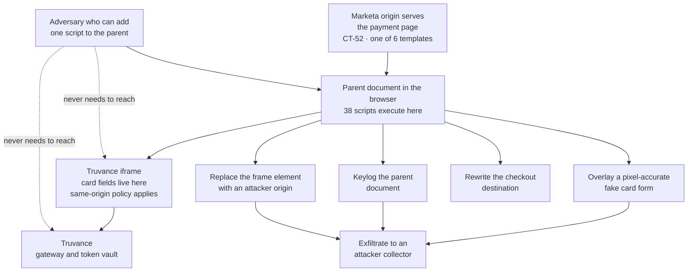

# 04.10 — Payment Page Script Management

| Field | Value |
|---|---|
| Document ID | MRG-PCI-2026-410 |
| Program | Marketa Retail Group — PCI DSS v4.0.1 Compliance Program |
| Phase | 04 — Build &amp; Maintain Secure Systems |
| Version | 1.0 |
| Status | Approved |
| Owner | Sonia Rendell, Director of E-Commerce Engineering |
| Approver | Naomi Bhatt, Chief Information Security Officer |
| Date | 2026-07-15 |
| Classification | Confidential — Cardholder Data Environment // Illustrative Portfolio Sample |

## Purpose

Requirement **6.4.3** — the management of all payment-page scripts that are loaded and executed in the consumer's browser. One of the 51 future-dated requirements, mandatory since **31 March 2025**, and the first requirement in the standard's history to reach past the merchant's servers and into the page a customer is looking at.

This document delivers Marketa's implementation across **6 payment page templates** and **38 scripts, 11 of them third-party**. It records the finding that **3 of those 38 were unauthorised at first inventory**, how they got there, what was done about them, and — the part that matters more than the removal — what had to change in governance so that the mechanism which put them there could not do so again.

**11.6.1 is not delivered here.** 6.4.3 is **preventive**: authorise, assure integrity, inventory. 11.6.1 is **detective**: change- and tamper-detection alerting on unauthorised modification of HTTP headers and page content as received by the consumer browser. They are complementary and neither substitutes for the other. 11.6.1 is delivered in **Phase 06** and goes live in August 2026. §10 states the division precisely, because presenting either one as the other is the most common way this control set is misrepresented.

## 1. Why This Requirement Exists

A payment page can be perfectly secure at the point it leaves the merchant's origin and completely compromised by the time the customer types into it.

Digital skimming — the attack class the industry names after the **Magecart** campaigns — does not steal data at rest and does not need to defeat transport encryption. It puts JavaScript on the page. From there it can draw a form on top of the real one, listen to every keystroke on the parent document, replace the payment frame with one pointing somewhere else, or simply read the fields the merchant's own page legitimately holds and pair them with a card number captured by any of the above.

The reason this reaches Marketa is the reason 02.05 exists. **Marketa's payment pages carry no card fields.** The PAN is entered inside an iframe served from Truvance's origin, posted by the browser straight to Truvance, and never touches a Marketa system. That boundary is real, it is enforced by the browser's same-origin policy rather than by agreement, and it removes 246 AWS e-commerce workloads from the cardholder data environment.

It does nothing whatever for the page around the frame.

The two dotted edges are the argument. **The adversary never touches Truvance, never defeats the same-origin policy, and never sees a Marketa server hold a PAN.** They add one script to a page Marketa serves. The transaction completes normally, the customer receives their order, the reconciliation balances, and nothing in Marketa's estate looks wrong.

Marketa's exposure is measured, not theoretical. **Risk R-01 — unauthorised or malicious script executing in the consumer browser on a payment page — is scored 20, the highest entry in the 44-risk register**, and it is the only entry at both likelihood 4 and impact 5. The likelihood is 4 because it is not an estimate. It is what the first inventory found.

## 2. The Population, and the Definition That Makes It Bite

| Element | Value | Source |
|---|---|---|
| Payment page templates | **6** — TPL-01 to TPL-06 | 02.05 §5.1 |
| Unique scripts executing across those templates | **38** | 02.05 §5 |
| First-party — Marketa-authored or Marketa-hosted | **27** | §4 |
| **Third-party** | **11** | §4 |
| **Unauthorised at first inventory** | **3** | §7 |
| Script-template execution instances | **143** across the six templates | §4.2 |

The definition both 6.4.3 and 11.6.1 use is what makes a merchant like Marketa in scope at all: **a payment page includes the page that contains the payment frame, not only the document in which card data is entered.** A merchant who reads "we do not have a payment page, our provider does" has read the wrong definition, and the six templates in 02.05 §5.1 — including **TPL-04**, card-on-file registration in My Account, and **TPL-05**, balance payment on an amended order, neither of which places an order — are payment pages on that basis.

TPL-04 and TPL-05 were not on anybody's list when the exercise began. They were found by enumeration. **The low-traffic account-management templates are precisely where an unauthorised script survives longest**, because nobody is looking at them and no conversion metric moves when they misbehave.

## 3. The Three Obligations

6.4.3 obliges that all payment-page scripts loaded and executed in the consumer's browser are managed as follows.

| Limb | Obligation | Marketa's method | Section |
|---|---|---|---|
| **(a)** | A method is implemented to **confirm that each script is authorised** | A named authorising individual per script, a written authorisation record, a pipeline reconciliation between the published script manifest and the inventory, and a five-business-day tag approval workflow that is the only route by which a new script can reach a payment template | §5 |
| **(b)** | A method is implemented to **assure the integrity of each script** | Subresource integrity for everything that can carry it; a Content Security Policy source allow-list plus content diffing for everything that cannot; a signed, deterministic build for all first-party script | §6 |
| **(c)** | An **inventory of all scripts** is maintained with **written justification** as to why each is necessary | The 38-row inventory in §4, generated from three independent discovery methods and reconciled monthly against the publication manifest | §4 |

Limb (c) is the one entities under-build, because an inventory looks like documentation. It is not. **It is the control that defines the population the other two limbs operate on**, and an inventory that misses a script means limbs (a) and (b) are perfectly executed against the wrong set.

## 4. The Inventory — Limb (c)

### 4.1 How it was built

A script inventory built by one method is a list of the scripts that method can see. Marketa used the three methods in 02.05 §6 — static build-manifest analysis, an instrumented headless browser with a `MutationObserver` across three geographies, four device profiles, two consent states and all six templates, and Content Security Policy field telemetry from real consumer sessions — and **required them to reconcile.** The reconciliation gaps are where the findings were. The two undeclared scripts appeared in field telemetry and in some dynamic runs, and in **neither** the build manifest nor the earliest synthetic runs. A static-only inventory would have declared the payment pages clean.

The first complete inventory closed on **2026-03-06**. The continuously reconciled inventory, and the 11.6.1 detection that watches it, go live in **August 2026** under open items OI-02-04 and OI-02-05.

### 4.2 The 38 scripts

Every script carries an identity, the templates it executes on, its origin, its purpose, the written business justification required by limb (c), its authorisation status under limb (a), and its integrity method under limb (b). **SCR-01 to SCR-27 are first-party. SCR-28 to SCR-38 are third-party. SCR-36, SCR-37 and SCR-38 were unauthorised at first inventory.**

| ID | Script | Template(s) | Origin | Purpose | Business justification | Authorisation status | Integrity method |
|---|---|---|---|---|---|---|---|
| **SCR-01** | Runtime bootstrap and nonce binder | TPL-01 to TPL-06 | First-party | Establishes the module runtime and binds the CSP nonce | Without it no first-party script executes; it is the mechanism that enforces the nonce policy | Authorised — S. Rendell, 2026-03-09 | SRI at build · K-08 signed bundle |
| **SCR-02** | Design system core | TPL-01 to TPL-06 | First-party | Shared components, layout and interaction primitives | Renders the page; removing it removes the checkout | Authorised — S. Rendell, 2026-03-09 | SRI at build · K-08 signed bundle |
| **SCR-03** | Truvance iframe adapter | TPL-01 to TPL-06 | First-party | Mounts the payment frame and handles the `postMessage` token and approval callback | The integration point with the TPSP; the only script permitted to listen on that channel | Authorised — S. Rendell, 2026-03-09 | SRI at build · K-08 signed bundle · origin-checked listener |
| **SCR-04** | Client error reporter | TPL-01 to TPL-06 | First-party | Captures unhandled exceptions with pattern-based redaction applied before emission | Checkout defects are otherwise invisible; redaction is the 04.07 §8 library | Authorised — S. Rendell, 2026-03-09 | SRI at build · K-08 signed bundle |
| **SCR-05** | Accessibility and focus management | TPL-01 to TPL-06 | First-party | Keyboard navigation, focus order and assistive-technology announcements | Accessibility obligation across the checkout | Authorised — S. Rendell, 2026-03-09 | SRI at build · K-08 signed bundle |
| **SCR-06** | Localisation and currency formatter | TPL-01 to TPL-06 | First-party | Locale, currency and date rendering | Multi-state trading with differing tax display | Authorised — S. Rendell, 2026-03-09 | SRI at build · K-08 signed bundle |
| **SCR-07** | Session keep-alive and timeout warning | TPL-01 to TPL-06 | First-party | Warns before session expiry and extends on interaction | Prevents abandoned baskets from session expiry mid-payment | Authorised — S. Rendell, 2026-03-09 | SRI at build · K-08 signed bundle |
| **SCR-08** | Feature-flag client | TPL-01 to TPL-06 | First-party | Resolves release flags at render time | Enables staged release of checkout changes; **flag payloads are data, not code, and the client refuses executable values** | Authorised — S. Rendell, 2026-03-09 | SRI at build · K-08 signed bundle |
| **SCR-09** | CSP violation reporter and page-integrity beacon | TPL-01 to TPL-06 | First-party | Reports CSP violations and a page-composition digest from real sessions | **The field-telemetry source that found two of the three unauthorised scripts**; feeds the 11.6.1 mechanism | Authorised — N. Bhatt, 2026-03-09 | SRI at build · K-08 signed bundle |
| **SCR-10** | Basket summary renderer | TPL-01, TPL-02, TPL-03 | First-party | Renders line items, totals and tax on the payment step | The customer must see what they are paying for | Authorised — S. Rendell, 2026-03-09 | SRI at build · K-08 signed bundle |
| **SCR-11** | Delivery option selector | TPL-01, TPL-02, TPL-03 | First-party | Delivery method and date selection affecting the total | Total changes with delivery choice, so it must be on the payment step | Authorised — S. Rendell, 2026-03-09 | SRI at build · K-08 signed bundle |
| **SCR-12** | Promotion and voucher handler | TPL-01, TPL-02, TPL-03 | First-party | Applies promotion codes and revalidates the total server-side | Promotions are applied at the payment step; **no client-supplied total is trusted** | Authorised — S. Rendell, 2026-03-09 | SRI at build · K-08 signed bundle |
| **SCR-13** | Total recalculation display client | TPL-01, TPL-02, TPL-03 | First-party | Displays the server-recalculated total | Display only; the authoritative total is server-side per 04.07 §5 | Authorised — S. Rendell, 2026-03-09 | SRI at build · K-08 signed bundle |
| **SCR-14** | Address autocomplete client | TPL-01, TPL-02, TPL-03 | First-party | Marketa-hosted address suggestion against a licensed dataset | Reduces delivery failure; **self-hosted deliberately, so a third-party origin is not on the payment page** | Authorised — S. Rendell, 2026-03-09 | SRI at build · K-08 signed bundle |
| **SCR-15** | Payment method selector | TPL-01, TPL-03, TPL-06 | First-party | Chooses between card, wallet and split tender before the frame mounts | Determines which payment path the frame is mounted for | Authorised — S. Rendell, 2026-03-09 | SRI at build · K-08 signed bundle |
| **SCR-16** | Billing address panel | TPL-01, TPL-03, TPL-06 | First-party | Collects and validates billing address separately from delivery | Required by the authorisation request; **collected by Marketa, not by the frame** | Authorised — S. Rendell, 2026-03-09 | SRI at build · K-08 signed bundle |
| **SCR-17** | Order review and confirm controller | TPL-01, TPL-03, TPL-06 | First-party | Final review, terms acceptance and submission orchestration | The step that converts an authorised payment into an order | Authorised — S. Rendell, 2026-03-09 | SRI at build · K-08 signed bundle |
| **SCR-18** | Payment method availability probe | TPL-01, TPL-02, TPL-06 | First-party | Detects wallet and express-payment availability in the browser | Avoids offering a payment method the device cannot complete | Authorised — S. Rendell, 2026-03-09 | SRI at build · K-08 signed bundle |
| **SCR-19** | Account navigation | TPL-04, TPL-05 | First-party | Navigation and breadcrumb inside My Account | Structural to the account templates | Authorised — S. Rendell, 2026-03-09 | SRI at build · K-08 signed bundle |
| **SCR-20** | Saved payment methods list controller | TPL-04, TPL-05 | First-party | Lists tokenised card-on-file entries by last four and brand | Displays **tokens and truncated PAN only**; no full PAN exists client-side | Authorised — E. Marchetti, 2026-03-09 | SRI at build · K-08 signed bundle |
| **SCR-21** | Checkout progress stepper | TPL-01, TPL-03 | First-party | Step indicator and back-navigation guard | Prevents a back-navigation that would orphan a payment attempt | Authorised — S. Rendell, 2026-03-09 | SRI at build · K-08 signed bundle |
| **SCR-22** | Card-on-file registration consent panel | TPL-01, TPL-04 | First-party | Captures explicit consent to store a payment method for future use | Consent must be captured on Marketa's page, not inside the frame | Authorised — E. Marchetti, 2026-03-09 | SRI at build · K-08 signed bundle |
| **SCR-23** | Compact single-page layout controller | TPL-02, TPL-03 | First-party | Single-page layout and progressive disclosure on compact viewports | Mobile express and guest checkout share one layout engine | Authorised — S. Rendell, 2026-03-09 | SRI at build · K-08 signed bundle |
| **SCR-24** | Guest email capture and tracking opt-in | TPL-03 | First-party | Captures the email address an order confirmation is sent to | A guest order has no account to send confirmation to | Authorised — S. Rendell, 2026-03-09 | SRI at build · K-08 signed bundle |
| **SCR-25** | Default payment method manager | TPL-04 | First-party | Sets, reorders and removes stored payment methods | The purpose of the template | Authorised — E. Marchetti, 2026-03-09 | SRI at build · K-08 signed bundle |
| **SCR-26** | Amended-order balance calculator | TPL-05 | First-party | Computes and displays the balance due after an order amendment | Display of a server-computed figure; the amount charged is server-side | Authorised — E. Marchetti, 2026-03-09 | SRI at build · K-08 signed bundle |
| **SCR-27** | Gift card balance lookup client | TPL-06 | First-party | Looks up closed-loop stored-value balance before split tender | Closed-loop stored value, **not a brand account number** — 02.05 §5.1. Rate-limited at the edge against enumeration | Authorised — E. Marchetti, 2026-03-09 | SRI at build · K-08 signed bundle |
| **SCR-28** | Consent management platform | TPL-01 to TPL-06 | Third-party | Captures and enforces consent and preference state | Consent must resolve before any conditional tag may fire; **it loads first, which makes its own integrity load-bearing** | Authorised — N. Bhatt, 2026-03-20 | CSP allow-list · self-hosted via the tag proxy with SRI pinning · daily content diff |
| **SCR-29** | Analytics core library | TPL-01 to TPL-06 | Third-party | Page and event measurement | Conversion and funnel measurement across the checkout | Authorised — S. Rendell, 2026-03-20 | CSP allow-list · vendor-pinned version · daily content diff |
| **SCR-30** | Analytics funnel extension | TPL-01, TPL-02, TPL-03 | Third-party | Step-level funnel and drop-off analysis | Identifies where checkout abandonment occurs | Authorised — S. Rendell, 2026-03-20 · **payment step excluded from capture, verified by capture not by console setting** | CSP allow-list · daily content diff |
| **SCR-31** | Experimentation and measurement client | TPL-01, TPL-02, TPL-03 | Third-party | Server-decided experiment assignment, rendered client-side | Checkout experimentation; **variant payloads are content, and executable variants are prohibited by contract and by CSP** | Authorised — S. Rendell, 2026-03-20 | CSP allow-list · daily content diff · payload schema validation |
| **SCR-32** | Session replay | TPL-01, TPL-02, TPL-03 | Third-party | Support and usability diagnostics on the parent document | Cannot see into the cross-origin frame; **can record everything else**, so input masking is enforced and verified by capture | Authorised — N. Bhatt, 2026-03-20, with masking as an authorisation condition | CSP allow-list · daily content diff · quarterly masking verification |
| **SCR-33** | Fraud and device intelligence | TPL-01 to TPL-06 | Third-party | Device fingerprinting feeding authorisation risk scoring | A legitimate reason to be on a payment page — it reduces fraud on the transaction being authorised | Authorised — E. Marchetti, 2026-03-20 | CSP allow-list · daily content diff · contractual change notification |
| **SCR-34** | Customer chat and support | TPL-01, TPL-03, TPL-06 | Third-party | Live assistance during checkout | Reviewed specifically for whether an agent can observe typed input; it cannot see into the frame and parent input masking is enforced | Authorised — S. Rendell, 2026-03-20, with masking as an authorisation condition | CSP allow-list · daily content diff |
| **SCR-35** | Hosted UI library from a public CDN | TPL-01 to TPL-06 | Third-party | Shared user-interface library used by the design system | Version-pinned and immutable, so it is the one third-party script SRI fully protects | Authorised — S. Rendell, 2026-03-20 | **SRI pinned to the immutable version** · CSP allow-list |
| **SCR-36** | Marketing tag manager container | TPL-01 to TPL-06 | Third-party | Marketing tag deployment by a self-service console | **No justification accepted for payment pages.** A tag manager is by design a mechanism for loading arbitrary code chosen by a non-developer | **Unauthorised at first inventory** — authorised for the site generally, never for payment pages. **Removed from all six templates 2026-03-11; not reinstated** | Not applicable — removed. CSP now denies the container origin on payment templates |
| **SCR-37** | Advertising and conversion pixel A | TPL-01, TPL-02, TPL-06 | Third-party | Campaign conversion attribution | **Undeclared at first inventory**; re-justified afterwards on attribution value with the payment step excluded from firing | **Unauthorised at first inventory** — injected by SCR-36. Removed 2026-03-11; **re-submitted and re-authorised 2026-05-19** — S. Rendell and N. Bhatt | Self-hosted via the tag proxy with **SRI pinning** · CSP allow-list · daily content diff |
| **SCR-38** | Advertising and conversion pixel B | TPL-01, TPL-02, TPL-06 | Third-party | Campaign conversion attribution, second network | **Undeclared at first inventory**; re-justified afterwards, with the same firing exclusion | **Unauthorised at first inventory** — injected by SCR-36. Removed 2026-03-11; **re-submitted and re-authorised 2026-05-19** — S. Rendell and N. Bhatt | Self-hosted via the tag proxy with **SRI pinning** · CSP allow-list · daily content diff |

### 4.3 What the inventory reconciles to

| Assertion | Result |
|---|---|
| Scripts in the inventory | **38** |
| First-party | **27** |
| **Third-party** | **11** |
| **Unauthorised at first inventory** | **3** — SCR-36, SCR-37, SCR-38 |
| Scripts with a written business justification | **38 of 38** |
| Scripts with a named authorising individual | **38 of 38**, including the three whose recorded authorisation decision is a refusal or a conditional re-authorisation |
| Scripts with an integrity method | **38 of 38** |
| Script-template execution instances | **143** — TPL-01 31, TPL-02 26, TPL-03 29, TPL-04 18, TPL-05 17, TPL-06 22, reconciling to 02.05 §5.1 |
| Scripts executing on a payment template at 2026-07-15 | **37** — SCR-36 removed and not reinstated |
| Overlap with the 6.3.2 software bill of materials | 9 of 38 — the first-party bundles compiled by Marketa. **The other 29 appear in no bill of materials however carefully generated**, which is why 6.4.3 is a separate requirement from 6.3.2 |

## 5. Confirming Each Script Is Authorised — Limb (a)

| Element | Rule |
|---|---|
| Authoriser | Named individual, by script and by template set. Sonia Rendell for first-party and for functional third-party scripts; **Naomi Bhatt personally for any script that can observe user input** — the consent platform, session replay, and any script with an input-visible surface; Elena Marchetti for scripts touching stored payment methods or the authorisation path |
| Record content | Script identity and source, template set, purpose, written business justification, the conditions attached to the authorisation, the authoriser, the date, the review date and the owner |
| Conditions | An authorisation may carry conditions — input masking, payment-step firing exclusion, self-hosting through the tag proxy — and **a condition that is not verified is not a condition.** Each is verified by capture, quarterly, not by reading a vendor console setting |
| Review | Every script re-reviewed at least every 12 months, and immediately on any **SIG-5** change under 04.08 §4 |
| The only route in | A new script reaches a payment template through the tag approval workflow in §8 and through nothing else. Publication is by the pipeline identity; **no human holds write access to the payment-page origin**, asserted daily by CA-2 |
| Reconciliation | Every publication emits a script manifest, reconciled automatically against this inventory. **A script in the manifest that is not in the inventory fails the release. A script in the inventory that is absent from the manifest raises a finding**, because a script that quietly stopped loading is either a defect or a change nobody recorded |
| Refusals | Recorded, not discarded. **4 script requests were refused** in the period — two marketing pixels for non-payment campaigns, one heat-mapping tool, one A/B testing library that required inline execution |

The refusal count is reported for the same reason 04.08 reports its rejection rate. **An authorisation process that has never refused anything is an inventory with a signature block.**

## 6. Assuring the Integrity of Each Script — Limb (b)

6.4.3 asks for a method to assure integrity. It does not prescribe one, and the honest reason it does not is that no single method covers the population.

| Population | Count | Integrity method | Why this method, and what it does not cover |
|---|---|---|---|
| First-party, built and versioned by Marketa | **27** | Deterministic build; **SRI hash generated at build time and embedded in the template**; the bundle signed with **K-08** and verified by the deployment controller; the publication record retained and queryable | Complete for what Marketa publishes. It says nothing about what a browser executes if the page itself is rewritten after delivery — which is 11.6.1's job |
| Third-party, version-pinned and immutable | **2** — SCR-35, plus SCR-28 since self-hosting | **SRI pinned to the immutable version** | Works because the artefact is fixed. Requires a change record to move the pin, which is the point |
| Third-party, self-hosted through the Marketa tag proxy | **3** — SCR-28, SCR-37, SCR-38 | Vendor artefact fetched, reviewed, hashed and **served from Marketa's origin with SRI**; vendor updates enter through a change record rather than at the vendor's convenience | The strongest available position for third-party code, and it costs an operational obligation: Marketa now owns the update cadence, and a vendor fix does not reach production until Marketa ships it |
| Third-party, vendor-hosted and intentionally mutable | **6** | **CSP source allow-list** constraining where script may load from; **daily content diff** of the fetched artefact against the previous fetch, with a human reviewing any difference; contractual change notification; periodic review of the fetched artefact | **SRI is not available.** A hash pinned to a file the vendor intends to change breaks the page on the vendor's first legitimate release. For this population, integrity assurance is a monitoring problem rather than a prevention problem, and 11.6.1 is its enforcement arm |
| The tag manager | 1 — SCR-36 | **Removed.** The CSP denies its origin on all six payment templates | The only integrity method that works for a container whose purpose is to load arbitrary code is not to have one on a payment page |

> **You cannot pin what the vendor intends to change.**
>
> That sentence is the whole difficulty of 6.4.3 and the reason it is hard rather than merely tedious. What a merchant can do is constrain where script may come from, self-host what it can, detect when what arrives differs from what arrived last time, and put a human in front of that difference quickly. Marketa's position is that **six of thirty-eight scripts are assured by detection rather than by prevention**, and the register says so rather than presenting a CSP as though it were a hash.

## 7. The Finding — Three Unauthorised Scripts

### 7.1 What was found

At the first triangulated inventory, three of the 38 scripts executing on Marketa's payment pages had no authorisation, no business justification on file, no change record and — for two of them — no contract.

| Script | What it was | How it got there |
|---|---|---|
| The container — SCR-36 | A marketing tag manager container, present on **all six** payment templates | Deployed by the marketing team through a self-service console. It had been authorised **for the site**, in 2021, by a decision that predated any payment-page requirement and that nobody had revisited. It had never been authorised **for payment pages**, and nobody had ever been asked |
| Pixel A — SCR-37 | An advertising and conversion pixel | Published into the container by a marketing analyst, under a targeting rule, without a change record and without a security review |
| Pixel B — SCR-38 | A second advertising and conversion pixel, different network | As above, by a different analyst, four months later |

Neither pixel appeared in the build manifest. Neither appeared in the earliest synthetic browser runs, because both fired under targeting rules that a headless session in a data centre did not satisfy. **Both appeared in the Content Security Policy field telemetry from real consumer sessions**, which is the only method of the three that sees what actual browsers actually load.

### 7.2 What they did, and what they could have done

The forensic position, established with Ironwood Security Labs and recorded in full:

| Question | Answer |
|---|---|
| Did either pixel capture account data? | **No.** Both were reviewed against retained field telemetry, both vendors' documented behaviour, and captured network traffic. Neither read form input, neither attached a keystroke listener, neither modified the DOM around the frame |
| Was there an incident? | **No account data compromise occurred**, and none is claimed either way without evidence. No obligation **C5** notification arose |
| Was there a control failure? | **Yes, unambiguously.** Three scripts were executing on six payment pages with no authorisation and no integrity assurance. That is a 6.4.3 failure whether or not anything was captured |
| What could the mechanism have done? | Everything in §1. The container could publish any script, to any of the six templates, chosen by anybody with console access, with no review, no record and no notification to engineering or security |
| How long? | The container had been on the payment templates since the 2022-11-14 iframe cutover carried the tag configuration forward unchanged. **The pixels were live for approximately 14 and 10 months respectively** |
| How would Marketa have found out? | Before this exercise, it would not have. There was no inventory, no CSP in enforcing mode, no field telemetry and no page-content monitoring. **The mechanism was working exactly as designed** |

### 7.3 Root cause — and it is not the tag manager

It is tempting to write this finding up as a tooling problem. It was not.

> **The tag manager did precisely what it is built to do: allow a non-developer to publish code to a web page without engineering involvement. That is the product's entire value proposition, and it worked.**
>
> The failure was that **Marketa's governance permitted marketing to deploy to payment pages without security review.** Nobody decided that. Nobody wrote it down. A permission granted in 2021 for "the site" was never scoped, never reviewed, and never reconsidered when the payment templates were rebuilt around an iframe in 2022. The 2025 arrival of a requirement addressing exactly this was noted by the programme and did not reach the marketing console.

| Contributing cause | The general lesson |
|---|---|
| A permission granted at site granularity, never re-scoped to page class | **Access granted to "the site" is access granted to the payment page**, and that is a sentence somebody has to say out loud before it is understood |
| No inventory, so there was nothing for a new script to be absent from | An unauthorised change is only detectable against a recorded authorised state |
| Ownership split — Marketing owned the tags, Engineering owned the templates, and **neither owned the page** | The most common ownership failure in e-commerce, and it produces a surface that everybody can change and nobody watches |
| Discovery methods that a synthetic session defeats | A targeting rule is an evasion mechanism whether or not anybody intended it as one. **Triangulation is not thoroughness; it is necessity** |

01.09 §1 had already recorded that an agency or team with tag-management or template-publication rights is a **TPSP under the security-impact limb**, because it can alter a payment page. This finding is what that register entry was written for, and it moved from a categorisation to an access review with names attached.

### 7.4 What was done

| Date | Action |
|---|---|
| 2026-03-06 | First triangulated inventory closed; the three scripts identified through reconciliation gaps |
| 2026-03-09 | First-party authorisation records completed for SCR-01 to SCR-27; the three findings escalated to the CISO and to the VP of Marketing the same day |
| **2026-03-11** | **All three removed from all six payment templates.** The container was removed rather than reconfigured, because a reconfigured container is still a container |
| 2026-03-13 | Publication rights on the tag-management console reviewed: **19 accounts held publish rights; 6 retained.** Payment-template publication removed from the console entirely |
| 2026-03-20 | Third-party authorisation records completed for the eight retained third-party scripts, with conditions |
| **2026-04-24** | **The tag approval SLA agreed with Marketing** — §8 |
| 2026-05-18 | Content Security Policy moved to enforcing mode with nonces and a source allow-list on all six templates |
| **2026-05-19** | SCR-37 and SCR-38 re-submitted through the new workflow, re-justified rather than grandfathered, and **re-authorised with conditions** — self-hosted through the tag proxy with SRI pinning, and excluded from firing on the payment step |
| 2026-06-02 | SRI enforcement release; the pipeline now fails if a referenced asset's hash changes without a change record |
| **2026-08** | Continuously reconciled inventory and **11.6.1** change- and tamper-detection live, alerting within 24 hours — OI-02-04 and OI-02-05, Phase 06 |

The two re-authorisations are recorded deliberately. **The correct outcome of finding an unauthorised script is not always removal in perpetuity.** It is that the thing has to justify itself to a named person who can say no, under conditions that are verified. Both pixels made that case; the container did not, and was not invited to.

## 8. The Governance Change — the Five-Business-Day Tag Approval SLA

Removing three scripts fixed three scripts. The mechanism that produced them needed a different answer, and the answer had to be one Marketing would actually use, because a control that makes the compliant route slower than the workaround produces workarounds.

| Element | Agreement, effective 2026-04-24 |
|---|---|
| Parties | E-Commerce Engineering, Information Security, and Marketing, endorsed by the PCI Steering Committee |
| Scope | Any script, tag, pixel or container proposed for **any of the six payment page templates** |
| **Service level** | **Five business days** from a complete submission to a decision. Not to a deployment — to a **decision**, which may be a refusal |
| What a complete submission contains | Vendor and origin, the artefact itself, the written business justification, what data it collects, whether it can observe user input, the vendor's own security posture and contract status, the campaign or purpose duration, and the proposed template set |
| Decision authority | Sonia Rendell, jointly with Naomi Bhatt for anything that can observe user input |
| Default outcome on expiry | **Refusal.** An SLA whose default outcome is approval is a queue, not a control |
| Deployment route | Self-hosting through the **Marketa tag proxy** wherever the vendor permits it, which converts an unpinnable third-party script into a pinnable first-party-served one |
| Non-payment pages | Unchanged. Marketing retains self-service publication everywhere else, which is why the agreement was accepted rather than resented |
| Escalation | A refusal may be escalated to the PCI Steering Committee by the VP of Marketing. **This has been used once, and the refusal was upheld** |
| Measured performance to 2026-07-15 | **11 submissions · 7 approved · 4 refused · median decision time 3 business days · 0 SLA breaches** |

The design principle is the one 03.12 records against R-22 and 04.07 records against test data: **make the compliant path the convenient one.** Marketing did not lose the ability to measure a campaign; it lost the ability to do so on six specific templates without telling anybody, and it gained a decision inside a week instead of an argument inside a quarter.

The permission change is the durable half. **Payment-template publication no longer exists as a capability in the tag console**, and the CSP on those templates denies the container origin. Even if the permission were restored by error, the browser would refuse the script.

## 9. CSP and SRI — What Each Actually Buys

| Control | What it prevents | What it does not prevent | Marketa's configuration |
|---|---|---|---|
| **Content Security Policy** | Loading script from an origin that is not on the allow-list; inline script execution without a valid nonce; `eval` and equivalent dynamic evaluation; form submission and connection to undeclared destinations | **Anything the allow-list permits.** A CSP does not judge the content of an allowed script — if a permitted vendor is compromised, the CSP will faithfully allow the malicious version. It also does nothing if it can be stripped before delivery | `script-src` with per-request nonces, no `unsafe-inline`, no `unsafe-eval`; `connect-src`, `form-action`, `frame-src` and `base-uri` all constrained; `object-src 'none'`; **the header is set at the edge as well as at the origin**, so a compromised origin cannot silently drop it; violation reporting from real sessions through SCR-09 |
| **Subresource Integrity** | Execution of a script whose content differs from the hash recorded at build or pin time — a compromised CDN, a substituted artefact, a transit modification | **Anything that legitimately changes.** SRI is unusable for a vendor-updated artefact, which describes most third-party tags. It also protects the *file*, not the *page* — SRI on every script says nothing about a script the attacker adds | Generated at build and embedded for all 27 first-party scripts; pinned for SCR-35; applied to the three self-hosted third-party artefacts through the tag proxy; **the pipeline fails if a referenced asset's hash changes without a change record** |
| **Self-hosting through the tag proxy** | The vendor's ability to change what executes without Marketa's knowledge | The vendor's code from being what it is. Self-hosting makes a third-party script pinnable; it does not make it trustworthy | Applied to SCR-28, SCR-37 and SCR-38. Extension to SCR-29 and SCR-33 is an open item — both vendors' terms currently prohibit it |
| **Removal** | Everything | Nothing, and it is the only control with that property | Applied to SCR-36 |

The four rows are in descending order of assurance and ascending order of cost to the business, and that ordering is the actual content of a 6.4.3 programme. **The strongest control is not deploying the script.** Every other row is a negotiation about how much of that strength to trade for a business capability, and 6.4.3's contribution is to force the trade to be made explicitly, by a named person, in writing.

## 10. Preventive and Detective — 6.4.3 and 11.6.1

| | **6.4.3 — this document** | **11.6.1 — Phase 06** |
|---|---|---|
| Character | **Preventive** | **Detective** |
| Question it answers | *Is every script that should be here authorised, justified and integrity-assured?* | *Has anything on the page changed without authorisation?* |
| Object | The scripts, as a managed population | The page as the consumer receives it — HTTP headers **and** page content |
| Mechanism | Inventory, authorisation workflow, CSP allow-list, SRI, self-hosting, publication reconciliation | Change- and tamper-detection with alerting on unauthorised modification, including indicators of compromise |
| Frequency | Continuous at publication; 12-monthly review; immediate on any SIG-5 change | At least every seven days, **or a frequency set by a 12.3.1 targeted risk analysis**. Marketa's analysis — number 8 of the fourteen — sets **continuous evaluation with alerting inside 24 hours**, on the ground that a weekly floor is too slow for a channel carrying 15.7M transactions a year |
| Status at 2026-07-15 | **Delivered.** Inventory complete, authorisation records complete, CSP enforcing, SRI enforced, tag proxy operating, governance changed | **Live August 2026** — OI-02-05, Phase 06 |
| What it cannot do | Detect a change to a script it has correctly authorised, on an origin it has correctly allow-listed | Prevent anything. It reports after the fact, and its value is entirely a function of how fast a human acts on the alert |

**Neither substitutes for the other, and the failure mode of each is the other's purpose.** 6.4.3 without 11.6.1 is an inventory that goes stale silently. 11.6.1 without 6.4.3 is an alert stream with no authorised state to compare against — every change looks the same, so every change is either investigated or ignored, and at scale it is ignored.

One provision carries across from 02.05 §8 and the programme insists on it: **a detection mechanism that has never fired is not evidence of a clean page.** The 11.6.1 mechanism will be tested quarterly by making a controlled, authorised modification in a production-equivalent environment and confirming the alert arrives inside the expected window.

## 11. Keeping the Inventory True

An inventory is accurate on the day it is built. Four mechanisms keep this one accurate afterwards.

| Mechanism | Cadence | Failure it catches |
|---|---|---|
| **Publication manifest reconciliation** | Every release | A script added to a template through the build path without entering the inventory; a script silently dropped |
| **CSP field telemetry** from real consumer sessions, through SCR-09 | Continuous | A script loading from an origin the allow-list does not permit — the method that found SCR-37 and SCR-38 |
| **Dynamic enumeration** with a `MutationObserver`, across geographies, device profiles and consent states | Weekly, and per release | Runtime injection by an authorised script; a tag with a targeting rule |
| **Template enumeration** reconciled against the release pipeline | Per release | **A new payment page template that never enters the inventory** — condition ECOM-C3, and the failure that would leave a payment page unmonitored |
| Monthly reconciliation against the 6.3.2 software bill of materials | Monthly | Divergence between what Marketa ships and what the browser loads; overlap recorded explicitly at 9 of 38 |

The template-enumeration row is the one that protects against the failure this whole control set is most vulnerable to. Every mechanism above operates on **known payment templates**. A seventh template, introduced by a team that did not know TPL-04 counted as a payment page, would be invisible to all of them — which is why **SIG-5** in 04.08 makes template creation a significant change, and why 02.05's ECOM-C3 names the collapse consequence.

## 12. Requirement 6.4.3 Coverage Summary

| Limb | Position at 2026-07-15 | Evidence |
|---|---|---|
| **(a) Method to confirm each script is authorised** | **Met** — named authorising individual per script with conditions attached and verified; publication-manifest reconciliation failing the release on a mismatch; no human write access to the payment-page origin; the five-business-day tag approval workflow as the only route in, with a **default outcome of refusal**; 4 refusals recorded | Authorisation records; reconciliation output; console permission extract; workflow records |
| **(b) Method to assure the integrity of each script** | **Met** — SRI at build for all 27 first-party scripts on a signed deterministic bundle; SRI pinning for 2; self-hosting with SRI for 3; CSP allow-list plus daily content diff for the 6 that are intentionally mutable; **removal** for the tag manager. The limits of each method are stated rather than smoothed | Build records; SRI manifest; CSP configuration; content-diff records; the tag proxy configuration |
| **(c) Inventory with written justification** | **Met** — **38 scripts, 27 first-party, 11 third-party**, each with purpose, written business justification, template set, authoriser, owner and review date; built by three independent methods required to reconcile; maintained by five mechanisms | The §4.2 inventory; the three discovery method outputs; reconciliation records |
| **The finding** | **3 of 38 unauthorised at first inventory** — a tag manager and two pixels it injected. Removed 2026-03-11; the container not reinstated; both pixels re-justified and conditionally re-authorised 2026-05-19; publication rights reduced from 19 accounts to 6 and payment-template publication removed as a capability | Removal records; console permission extract; the re-authorisation records |
| **12.3.1 position** | **6.4.3 generates no targeted risk analysis** — it sets no entity-defined frequency. **11.6.1 does**, and it is number 8 of the fourteen, owned by Sonia Rendell and delivered in Phase 06 | 01.11 §6 |
| **11.6.1** | **Not delivered here.** Live August 2026 as OI-02-05, Phase 06 | Phase 06 |

## 13. Risks Treated

| Risk | Rating | Treatment | Residual |
|---|---|---|---|
| **R-01** — unauthorised or malicious script harvests card data on a payment page | **High 20** | **This document is R-01's primary treatment.** A complete inventory with justification; authorisation by a named individual with verified conditions; SRI wherever it is possible and self-hosting to make it possible more often; a CSP in enforcing mode with nonces, set at the edge as well as the origin; the tag manager removed from all six templates; publication rights cut from 19 accounts to 6 with payment-template publication removed entirely; and a governance agreement that makes the compliant route faster than the workaround | **High** at 2026-07-15, and expected **Moderate** at close. The controls are strong and **three months old**. Six of 38 scripts are assured by detection rather than prevention, 11.6.1 is not yet live, and the impact component does not fall below 5 while Marketa serves a page into a browser it does not control on a channel carrying 15.7M transactions a year |
| **R-34** — the payment-page script inventory drifts as marketing tooling is added by people who cannot tell a payment template from a product page | Moderate 12 | The mechanism is removed, not governed — the container is gone and the CSP denies its origin. The capability to publish to a payment template no longer exists in the console. Drift is detected by four independent reconciliation mechanisms, and **SIG-5** brings any template or script change into significant-change control | **Low** at close, once the continuous reconciliation has operating history |
| **R-35** — an application flaw in the storefront exposes order data, tokens or customer records | Low 6 | The CSP's `connect-src` and `form-action` constraints bound where any compromised script could send data; input masking conditions on the session replay and chat scripts | **Low** |
| **R-09** — TPSP concentration | High 15 | Not treated here, and the relationship is worth naming: **Truvance's AOC does not cover Marketa's payment pages.** 6.4.3 is the requirement that makes that explicit, and this document is the evidence that Marketa is not relying on a provider's validation for a control the provider does not hold | Moderate — structural |

## Cross-References

| Reference | Relevance |
|---|---|
| 01.09 — Third-Party Service Provider Register | A team or agency with tag-management or template-publication rights is a TPSP under the security-impact limb — the entry this finding was written for |
| 01.11 — Compliance Calendar &amp; Obligations | Targeted risk analysis **8** — the 11.6.1 evaluation frequency, set to continuous with 24-hour alerting |
| **02.05 — E-Commerce Channel Scope** | **The population.** 6 templates, 38 scripts, 11 third-party; the iframe boundary; the three discovery methods; conditions ECOM-C1 to ECOM-C7 |
| 02.08 — Connected-To &amp; Security-Impacting Systems | **CT-52** and the tag-management console as security-impacting components |
| 03.11 — Risk Register | **R-01 at 20 — the register's highest entry**; R-34; R-09 |
| 04.03 — Cryptographic Key Management | **K-08** artefact signing on the payment-page bundle |
| 04.06 — Vulnerability Management | Why the 6.3.2 bill of materials and this inventory are different populations, overlapping at 9 of 38 |
| 04.07 — Secure Software Development | The build pipeline that can prove what was **published**; the runtime claim it deliberately does not make |
| 04.08 — Change Control | **SIG-5** — any template, script, tag-manager or CDN change is a significant change |
| 04.09 — Public-Facing Application Protection | 6.4.2, and the surface a WAF cannot see |
| Phase 06 — Monitoring, Testing &amp; Third Parties | **11.6.1** change- and tamper-detection, live August 2026; the quarterly detection test; the September application penetration test |
| Phase 07 — Security Policy, Risk &amp; Incident Response | The page-integrity incident procedure under 12.10.1 |

---
[⬅ Previous](04.09-public-facing-application-protection.md) · [🏠 Phase 04 Home](04.00-README.md) · [Next ➡](04.11-configuration-baseline-compliance.md)
